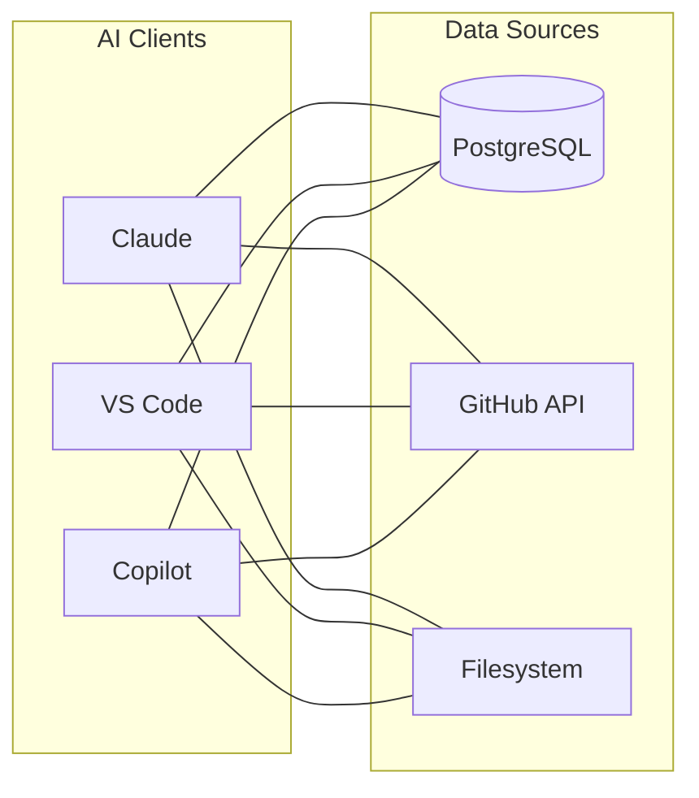
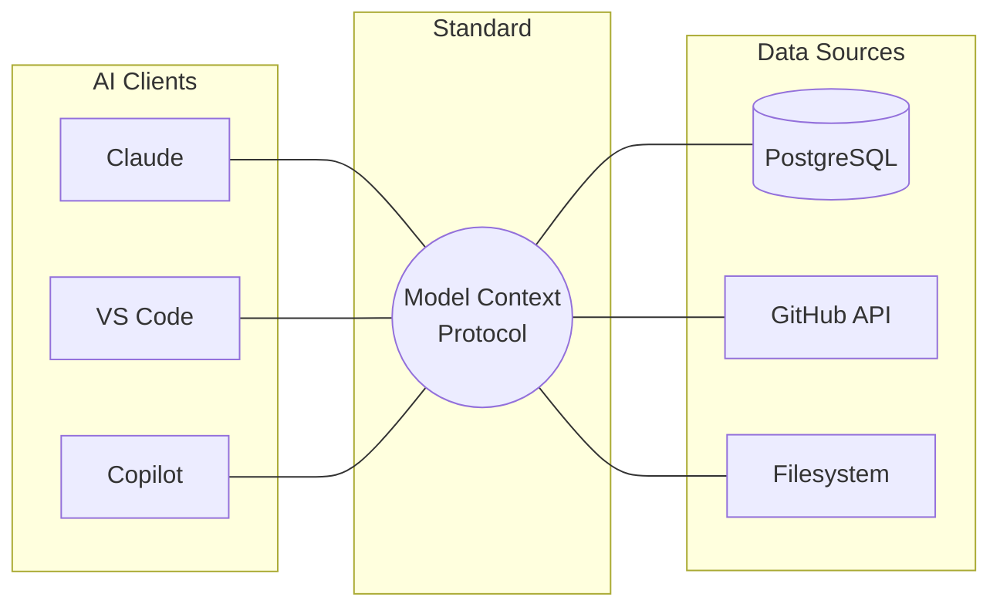

The Model Context Protocol (MCP) is an open standard that simplifies how AI models connect to data sources and tools. Developed to address the fragmented landscape of AI integrations, MCP acts as a universal interface between AI assistants and local or remote resources.

<!--more-->

## What is the Model Context Protocol?

AI models are often isolated from the real world, relying on training data or custom, ad-hoc integrations to access external information. Before MCP, developers had to write bespoke integration code for every combination of AI client (like an IDE extension or a chat interface) and data source (like a database, GitHub, or local files).

MCP standardizes this connection. By providing a uniform protocol, any compatible AI client can interact with any compatible MCP server, mimicking how USB-C provides a single physical standard for connecting diverse peripherals to computers.

```
┌─────────────────┐          ┌──────────────────────────┐          ┌─────────────────┐
│                 │  Stdio   │                          │  APIs    │   Data Source   │
│   MCP Client    │◄────────►│        MCP Server        │◄────────►│   (DB, Files,   │
│ (Claude, IDEs)  │   /SSE   │  (Python, TS, Go, etc.)  │          │    GitHub)      │
│                 │          │                          │          │                 │
└─────────────────┘          └──────────────────────────┘          └─────────────────┘
```

## Core Architecture

MCP operates on a client-server model:

1. **MCP Client**: The AI application or interface (such as Claude Desktop, Cursor, or command-line assistants). The client is responsible for managing user permissions, hosting the LLM session, and translating model requests into protocol calls.
2. **MCP Server**: A lightweight application that exposes specific capabilities to the client. It can run locally on the user's machine or remotely on a server.
3. **Transport Layer**: The communication channel between the client and server. The method of communication depends on the transport type:
   - **Standard Input/Output (stdio)**: Used for local servers. The client **spawns the server as a local child process** by executing a specified command (e.g., using `npx`, `uvx`, or running a Python executable). No network or HTTP requests are made. Instead, communication happens via standard inter-process pipes: the client writes JSON-RPC 2.0 messages directly to the server's standard input (`stdin`) and reads responses from the server's standard output (`stdout`).
   - **Server-Sent Events (SSE)**: Used for remote servers. The client does not execute a local command; instead, it communicates over HTTP. The client establishes a persistent connection to receive a unidirectional stream of events from the server (using Server-Sent Events) and sends requests back to the server using standard HTTP `POST` requests.

## A Lightweight and Flexible Standard

It is important to understand that MCP is designed as a lightweight and flexible standard rather than a rigid, heavily opinionated framework:

- **Transport Agnostic**: While the protocol defines standard behaviors for `stdio` and `SSE` (Server-Sent Events) over HTTP, the underlying communication channel is not strictly mandated. Any two-way communication channel capable of transmitting JSON-RPC 2.0 messages can be used as a transport layer.
- **Abstract Execution**: MCP does not dictate *how* a server executes a tool or retrieves a resource. The implementation details—such as whether a tool queries a local database, hits a third-party API, or runs a subprocess—are left entirely up to the server developer.
- **Flexible Payloads**: Although tool inputs are strictly defined using JSON Schema so that the LLM knows how to call them, the results returned by tools are highly open. A tool can return text, images, or reference resources, leaving it to the client and the model to decide how best to interpret and present the result.

## Under the Hood: JSON-RPC 2.0 Message Format

MCP uses **JSON-RPC 2.0** as its wire format. All communication between clients and servers consists of three message types: **Requests**, **Responses**, and **Notifications**.

### 1. Request Object
A client sends a request to invoke a specific capability on the server. Every request must contain a unique `id`.

```json
{
  "jsonrpc": "2.0",
  "method": "tools/call",
  "params": {
    "name": "get_weather",
    "arguments": {
      "latitude": 45.4215,
      "longitude": -75.6972
    }
  },
  "id": 1
}
```

- `jsonrpc`: Must be exactly `"2.0"`.
- `method`: The MCP method name (e.g., `tools/list`, `tools/call`, `resources/read`).
- `params`: An object containing the arguments defined by the method schema.
- `id`: A unique identifier (number or string) used to pair responses with requests.

### 2. Response Object
When a server receives a request with an `id`, it must return a corresponding response. The response contains either a `result` or an `error`, but never both.

#### Success Response
```json
{
  "jsonrpc": "2.0",
  "result": {
    "content": [
      {
        "type": "text",
        "text": "The weather at lat 45.4215, lon -75.6972 is sunny, 22°C."
      }
    ]
  },
  "id": 1
}
```

#### Error Response
```json
{
  "jsonrpc": "2.0",
  "error": {
    "code": -32601,
    "message": "Method not found",
    "data": "The requested tool 'get_weather_old' does not exist."
  },
  "id": 1
}
```

- `result`: The output returned by the method.
- `error`: An object containing an error `code` (integer), an error `message` (string), and optional additional `data`.
- `id`: The identifier matching the corresponding request.

### 3. Notification Object
Notifications are one-way messages that do not expect a reply. They do not contain an `id` field.

```json
{
  "jsonrpc": "2.0",
  "method": "notifications/initialized",
  "params": {}
}
```

## Core Capabilities

MCP specifies three main primitives that servers can expose to clients:

### 1. Resources
Resources represent read-only data that the AI model can use as context. This can include:
- Local files and directories.
- Database schemas and records.
- API response logs.
- Application state.

### 2. Tools
Tools are executable functions that the model can invoke to perform actions in the physical or digital world. Because tools can modify state, they typically require explicit user approval. Examples include:
- Running a shell command.
- Writing or editing a file.
- Sending an email or posting to a webhook.
- Querying an external search engine.

### 3. Prompts
Prompts are pre-configured templates that help users interact with the model effectively. They allow servers to supply structured workflows or specialized instructions directly to the client interface.

## How MCP Solves the N × M Problem

Without a standard protocol, connecting $N$ AI clients to $M$ data sources requires building and maintaining $N \times M$ unique, custom connectors. Every client must implement a bespoke driver for every data source it wants to support.

For 3 clients and 3 data sources, this creates a fully connected mesh of **9 unique integration pathways**:



With MCP, the integration complexity is reduced to **$N + M$ connections**. Each client implements a single standard MCP client, and each data source implements a single standard MCP server. Because they all speak the same protocol, any client can immediately connect to any server:



This reduces the total development and maintenance effort from **9 custom connectors** to **6 standard implementations** (3 clients + 3 servers).

## Getting Started: Configuring an MCP Server

For users, configuring an MCP client to use a new server is done via a simple configuration file. For example, in Claude Desktop, you can configure local servers in `claude_desktop_config.json`:

```json
{
  "mcpServers": {
    "sqlite-explorer": {
      "command": "uvx",
      "args": [
        "mcp-server-sqlite",
        "--db-path",
        "/path/to/your/database.db"
      ]
    },
    "filesystem": {
      "command": "npx",
      "args": [
        "-y",
        "@modelcontextprotocol/server-filesystem",
        "/path/to/allowed/directory"
      ]
    }
  }
}
```

In this configuration:
- The SQLite explorer runs using `uvx` (a tool to run Python packages).
- The filesystem server runs using Node's `npx` tool, exposing a specific directory to the AI model.

## Implementing a Simple MCP Server

Creating a custom MCP server is straightforward. Below is a minimal example of an MCP server in Python using the official `mcp` SDK, exposing a tool that fetches weather data.

### 1. Install the SDK
```bash
pip install mcp
```

### 2. Write the Server Code
```python
from mcp.server.fastmcp import FastMCP

# Create an MCP server instance
mcp = FastMCP("Weather Service")

@mcp.tool()
def get_weather(latitude: float, longitude: float) -> str:
    """Fetch current weather for a given location."""
    # In a real application, you would make an API request here
    return f"The weather at lat {latitude}, lon {longitude} is sunny, 22°C."

if __name__ == "__main__":
    mcp.run(transport="stdio")
```

This server exposes a single tool, `get_weather`. When an MCP client starts this script using the `stdio` transport, the AI assistant can discover this tool, see its docstring and parameters, and call it when requested by the user.

## Summary

The Model Context Protocol establishes a clean separation of concerns in the AI stack. By decoupling the LLM application from the underlying tools and data sources, it enables a modular ecosystem where developers can build reusable servers, and users can securely grant AI assistants access to the data they need.
