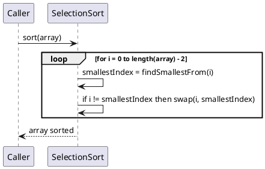
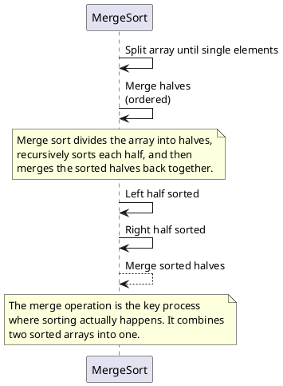
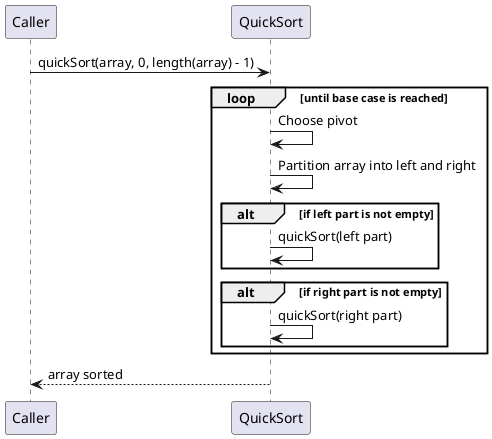

本文记录常见的排序与查找算法
<!--more-->

# 1. Sort

## 1.1 Bubble sort
a simple sorting algorithm that repeatedly steps through the input list element by element, comparing the current element with the one after it, swapping their values if needed. These passes through the list are repeated until no swaps have to be performed during a pass, meaning that the list has become fully sorted. 


## 1.2 insertion sort

```plantuml
participant "Caller"
participant "InsertionSort" as insort

Caller -> insort : sort(array)

loop for i = 1 to length(array) - 1
    insort -> insort : key = array[i]
    insort -> insort : j = i - 1
    loop while j >= 0 and array[j] > key
        insort -> insort : array[j + 1] = array[j]
        insort -> insort : j = j - 1
    end
    insort -> insort : array[j + 1] = key
end

Caller <-- insort : array sorted
@enduml
```

## 1.3 selection sort

selection sort is not stalbe, example  B<sub>1</sub>B<sub>2</sub>A --> AB<sub>2</sub>B<sub>1</sub>

## 1.4 Shell sort
Shell sort can be seen as generalization of sorting by exchange(bubble sort) or sorting by insertion(insertion sort).The method starts by sorting pairs of elements far apart from each other, then progressively reducing the gap between elements to be compared


## 1.5 Merge sort


## 1.6 Quick Sort

1. Shuffle the array
2. Partition so that, for some j
   - entry a[j] is in place
   - no larger entry to the left of j
   - no smaller entry to the right of j
3. sort each piece recursively 
Most implementations of quick sort are not stable,example 
B<sub>1</sub>B<sub>2</sub>A --> AB<sub>2</sub>B<sub>1</sub> with B<sub>2</sub> as pivot



