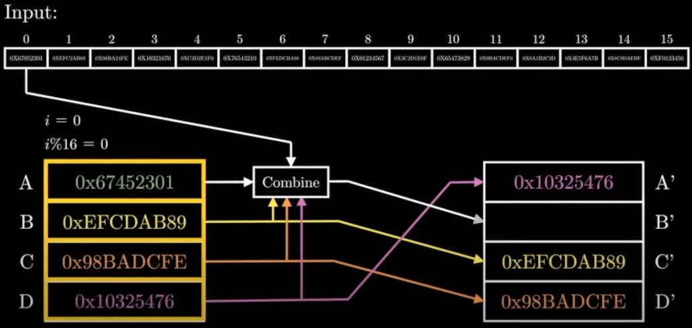

Encryption is commonly used in web, this article try to explore the encryption algorithms and tools used in encryption
<!--more-->


# Algorithms

# hex

hex transform every octet to 2 hex from 0~F

# Base64 
Base64 is a group of binary-to-text encoding schemes that transform binary data into a sequence of printable characters.
The source binary data is taken 6 bits at a time, then this group of 6 bits is mapped to one of 64 unique characters.
Base64 transform every 3 octets to 4 characters in base64 table. with "=" as padding. 
Base64 compression is better than hex.


## AES
Advanced Encryption Standard  established in 2001, supersedes the DES(Data Decryption Standard). It is a symmetric-key algorithm.

AES-128 request 128-bits key which can be generated by openssl
```
openssl rand -out ase.key 16
```

## MD5

The MD5(message-digest algorithm) hashing algorithm is a one-way cryptographic function that accepts a message of any length as input and returns as output a fixed-length digest value to verify the integrity of input.



MD5 processes data in 512-bit string, broken down into 16 words composed of 32 bits each. The output is a 128-bit message-digest value.

Computation is performed in separate stages that process each 512-bit block of data along with the value computed in the preceding stage. 
The first stage begins with the message-digest values initialized using consecutive hexadecimal numerical values.
Each stage include four message-digest passes.
The final value computed from the last block becomes the MD5 digest.

## RSA
RSA(Rivest-Shamir-Adleman) is a public-key cryptosystem, one of the oldest widely used for secure data transmission, published in 1977.

### Key generation
1. two large prime numbers p and q
2. compute n = pq
    * n is released as part of the public key
3. compute $\lambda$(n)   which is the samllest memeber of set of positive integers having property    $a^m \equiv 1 (mod \space n) $ 
    $\lambda(n)$ keep secret
4. Choose an integer e coprime to $\lambda(n)$
5. Determine d that $de \equiv 1 (mode \space \lambda(n))$
   d kept secret as the private key exponent
6. public Key (n, e)
7. private key (d)

### Encryption
turns message M to ciphertext c
$$
c \equiv m^e (mod \space n)
$$

### Decryption
recover M from c
$$
c^d \equiv (m^e)^d \equiv m (mod \space n)
$$

# Security Mechanism 

## SASL

Simple Authentication and Security Layer(SASL) is a framework for authentication and data security in internet protocols. It decouple authentication mechanisms from application protocols.

### SASL mechanisms

## PGP Sign

PGP digital signature uses RSA in different direction.
* encrypt(Sign) with private key (d)
* Decrypt(verify) with public key (n,e)


