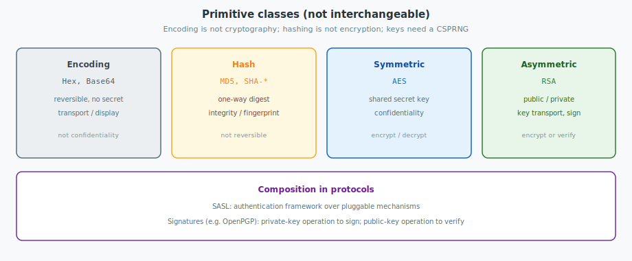
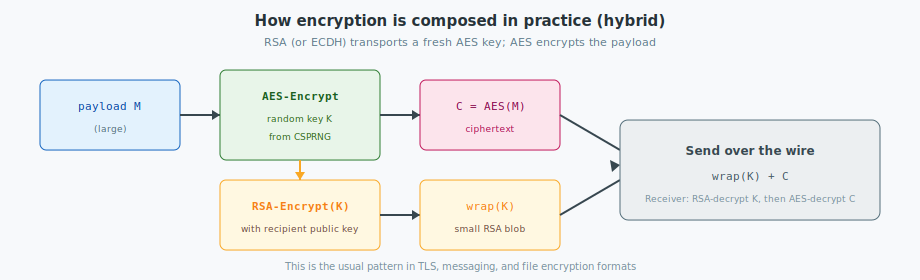
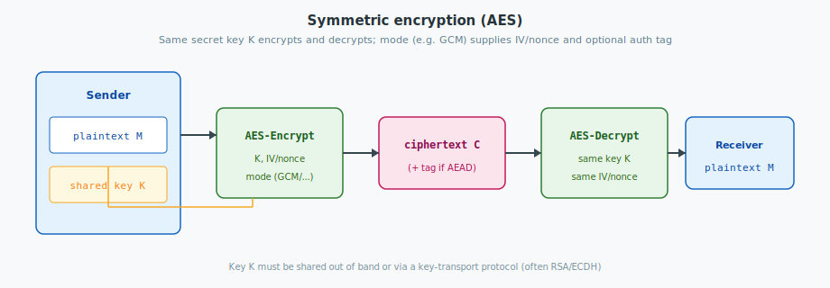
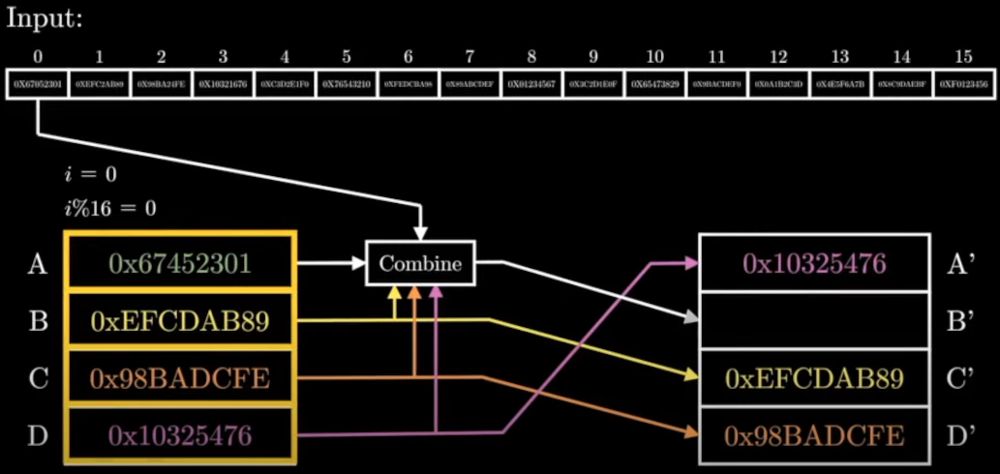
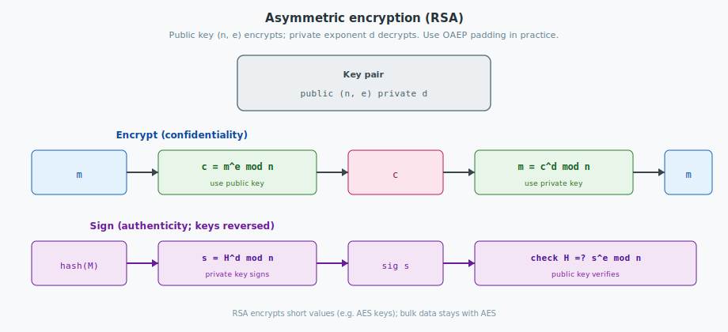
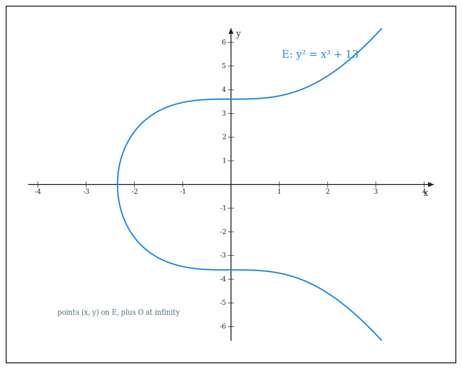
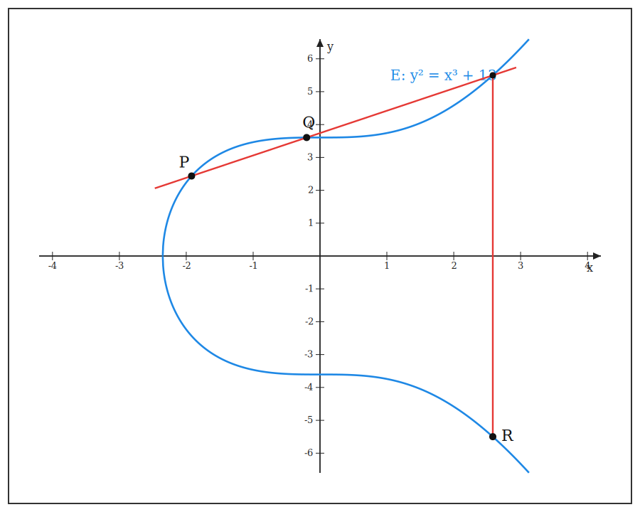
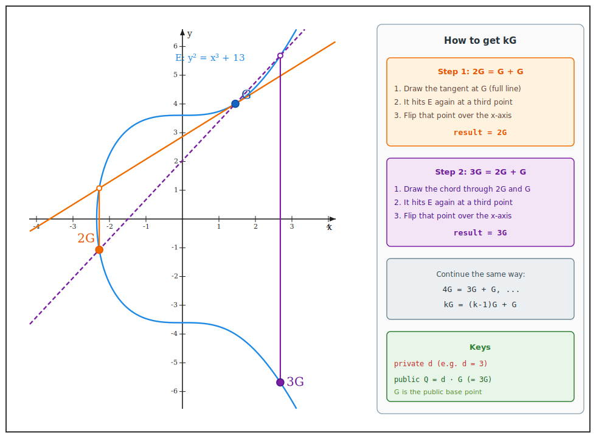
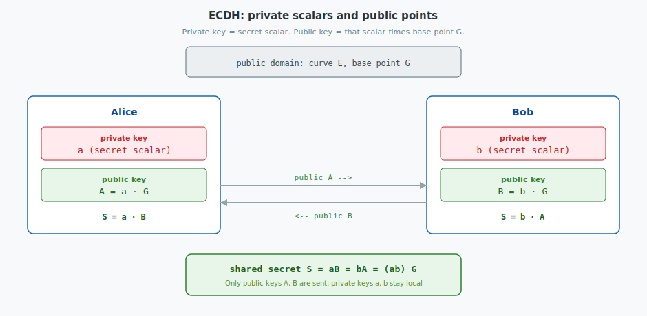
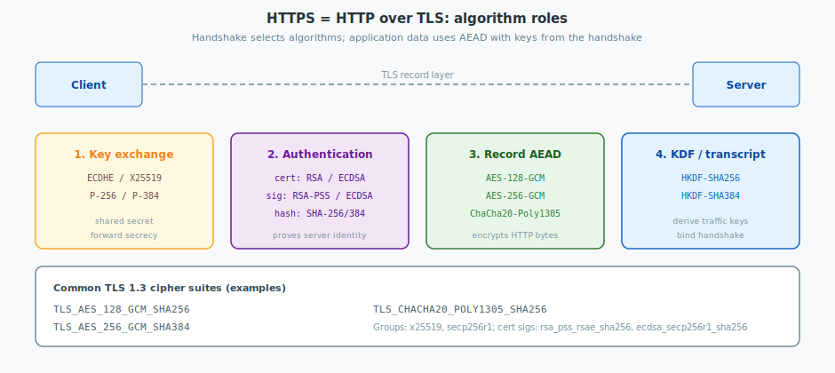

Cryptography in networked systems combines several **primitive classes** that are often conflated: encoding, hashing, symmetric encryption, and public-key operations. This post gives an **overview** of those classes, then the **mechanisms** of common algorithms—including elliptic-curve group law, ECDHE, ECDSA, AEAD, and HKDF—and finally **protocol-level** composition (TLS sessions, SASL, OpenPGP-style signatures) with tool examples. Encoding is not encryption. Hashing is not encryption. Secret keys must come from a CSPRNG; see [Random Number Generation in the JDK](../java-random/).

<!--more-->

Related: [Random Number Generation in the JDK](../java-random/).





---

## 1. Overview

| Class | Secret required? | Reversible? | Primary purpose |
|-------|------------------|-------------|-----------------|
| Encoding (Hex, Base64) | No | Yes | Represent binary as text |
| Cryptographic hash (MD5, SHA-*) | No | No (one-way) | Integrity fingerprint; password hashing needs a KDF, not a bare hash |
| Symmetric cipher (AES, ChaCha20-Poly1305) | Shared key | Yes, with key | Confidentiality of bulk data (AEAD also authenticates) |
| Public-key cryptosystem (RSA, ECDSA) | Key pair | Yes, with matching key | Key transport, digital signatures |
| Key agreement (ECDHE) | Ephemeral key pairs | Shared secret (not a ciphertext) | Forward-secret shared secrets |

### 1.1 Usage

- Display or transport binary in ASCII protocols: Hex or Base64 (not a security control).
- Detect accidental corruption or build content digests: a modern hash (prefer SHA-256 or stronger; avoid MD5/SHA-1 for security).
- Encrypt large payloads with a shared secret: AES in an authenticated mode (for example AES-GCM).
- Exchange keys or sign messages without a pre-shared secret: RSA or elliptic-curve schemes (ECDHE, ECDSA; §2.7).
- Generate AES keys and nonces: a CSPRNG (`openssl rand`, `SecureRandom`), never a general-purpose PRNG.
- Protect HTTP on the public Internet: **HTTPS** (HTTP over TLS); composition and suites in §3.1.

### 1.2 Guarantees and non-guarantees

| Primitive | Provides | Does not provide |
|-----------|----------|------------------|
| Hex / Base64 | Lossless binary↔text mapping | Confidentiality or authenticity |
| Hash | Fixed-length digest; collision resistance only if the algorithm remains unbroken | Encryption; password storage by itself |
| AES (correct mode + key) | Confidentiality (and authenticity if AEAD) | Key distribution |
| RSA encryption | Confidentiality of short messages under the public key | Efficient bulk encryption of large files |
| RSA signature | Integrity and origin under the private key | Confidentiality of the signed payload |

---

## 2. Mechanisms

### 2.1 Hex encoding

Hexadecimal encoding maps each octet to two characters from `0`–`9` and `A`–`F` (or `a`–`f`). One byte becomes two hex digits; the expansion factor is \(2\times\) relative to the raw binary length. Decoding is exact. Hex is used for dumps, fingerprints, and configuration literals—not for secrecy.

### 2.2 Base64 encoding

Base64 is a binary-to-text encoding that consumes input **six bits at a time** and maps each 6-bit value to one of 64 printable characters. Every three octets (24 bits) become four Base64 characters. When the input length is not a multiple of three, `=` padding completes the final quartet.

Relative to Hex, Base64 is denser (4 characters per 3 bytes versus 6 hex digits per 3 bytes). Like Hex, it is reversible without a key and confers no confidentiality.

### 2.3 AES (symmetric encryption)

The **Advanced Encryption Standard** (FIPS 197, 2001) is a block cipher that superseded DES for most new designs. It is a **symmetric-key** algorithm: the same secret key encrypts and decrypts.

| Property | Value |
|----------|-------|
| Block size | 128 bits |
| Key sizes | 128, 192, or 256 bits (AES-128 / AES-192 / AES-256) |
| Structure | Substitution–permutation network (Rijndael) |

A bare block cipher must be used with a **mode of operation**. ECB must not be used for structured data.

**AES-GCM** (Galois/Counter Mode) is a common AEAD for bulk data. Counter mode encrypts by XORing the plaintext with an AES keystream keyed by `(key, nonce, counter)`. Independently, a GHASH authenticator over \(GF(2^{128})\) covers ciphertext and associated data and yields a tag. Decryption recomputes the tag and rejects the record on mismatch. Nonces must never repeat under the same key.

Keys and IVs/nonces must be unpredictable; generate them with a CSPRNG:



```bash
openssl rand -out aes.key 16   # 128-bit key
```

### 2.4 MD5 (hash)

**MD5** (Message-Digest Algorithm 5) is a cryptographic hash: arbitrary-length input maps to a **128-bit** digest. It is one-way under normal use (the digest does not reveal the preimage by design).



**Compression structure (summary).** Input is processed in **512-bit** blocks. Each block is treated as sixteen 32-bit words. The algorithm maintains a 128-bit chaining state, initialized to fixed constants, and updates that state through four rounds of nonlinear functions and modular additions per block. The final chaining value is the digest.

**Security status.** MD5 is **broken for collision resistance** and must not be used for certificates, code signing, or other adversary-facing integrity. It may still appear as a non-cryptographic checksum. Prefer SHA-256 or stronger for security digests; prefer a password-based KDF (for example Argon2, scrypt, PBKDF2) for password storage.

### 2.5 SHA family (hash)

**SHA** denotes the NIST **Secure Hash Algorithm** family. Like MD5, members are one-way digests used for integrity and as building blocks in HMAC, signatures, and KDFs.

| Family | Typical digests | Notes |
|--------|-----------------|-------|
| SHA-1 | 160 bits | Deprecated for signatures and certificates; collision attacks are practical |
| SHA-2 | 224 / 256 / 384 / 512 bits | Current default for many protocols (SHA-256, SHA-512) |
| SHA-3 | 224 / 256 / 384 / 512 bits | Keccak sponge construction; distinct from SHA-2 |

SHA-2 and SHA-3 are not “similar to MD5” in security margin; they are the replacements for MD5/SHA-1 in modern designs. **SHA-256** and **SHA-384** are the usual hashes inside HMAC, signatures, and HKDF (§2.9).

### 2.6 RSA (public-key cryptosystem)

**RSA** (Rivest–Shamir–Adleman, 1977) is a public-key cryptosystem. A **public** key encrypts or verifies; a **private** key decrypts or signs. Practical systems use RSA for small payloads (session keys, signatures) and symmetric ciphers for bulk data.



#### Key generation

1. Choose large secret primes \(p\) and \(q\).
2. Compute modulus \(n = pq\). Publish \(n\) as part of the public key.
3. Compute Carmichael’s totient \(\lambda(n) = \operatorname{lcm}(p-1, q-1)\). Keep \(\lambda(n)\) secret (equivalently, many texts use \(\varphi(n)=(p-1)(q-1)\)).
4. Choose public exponent \(e\) with \(1 < e < \lambda(n)\) and \(\gcd(e, \lambda(n)) = 1\) (common choice: \(e = 65537\)).
5. Compute private exponent \(d\) such that
   \[
   d e \equiv 1 \pmod{\lambda(n)}.
   \]
6. Public key: \((n, e)\). Private key: \(d\) (with \(n\)), plus \(p, q\) in implementations that use CRT acceleration.

#### Encryption and decryption

For message representative \(m\) with \(0 \le m < n\):

\[
c \equiv m^{e} \pmod{n}
\qquad
m \equiv c^{d} \pmod{n}
\]

Padding schemes (for example **OAEP** for encryption, **PSS** for signatures) are mandatory in real systems; textbook RSA without padding is insecure.

#### Signatures (direction reversed)

A digital signature applies the **private** exponent to a hash of the message; verification applies the **public** exponent. OpenPGP-style signing follows that pattern: sign with \(d\), verify with \((n, e)\). This authenticates origin and integrity; it does not encrypt the payload.

### 2.7 Elliptic-curve cryptography

Elliptic-curve schemes build public-key operations from a **group of points** on a curve. The pictures below use real coordinates for intuition; deployed cryptosystems use the **same group law** over a large finite field \(\mathbb{F}_p\).

#### 2.7.1 Curve and group

A short Weierstrass curve has the form

\[
E:\quad y^{2} = x^{3} + a x + b
\]

with fixed coefficients \(a, b\). Over the reals the set of solutions is a smooth curve (plus a formal **point at infinity** \(\mathcal{O}\)). The figures in this section all use the same example

\[
E:\quad y^{2} = x^{3} + 13.
\]



Over \(\mathbb{F}_p\) (NIST P-256 / P-384 style), the equation is the same with arithmetic modulo a prime \(p\). Points are pairs \((x, y) \in \mathbb{F}_p^{2}\) on \(E\), together with \(\mathcal{O}\) as the group identity.

**Group law: third point, then flip.** Take any two points \(P\) and \(Q\) on the curve (if \(P = Q\), use the **tangent** at \(P\) instead of a chord). A line meets a cubic in three places, so that line hits the curve again at a unique third point. Reflect that third point across the \(x\)-axis to obtain the sum \(R = P + Q\). Equivalently, if \(P \cdot Q\) denotes the third intersection,

\[
P + Q = -(P \cdot Q).
\]

On the same curve \(E\): the red chord through \(P\) and \(Q\) meets \(E\) a third time; the vertical red segment drops to \(R\) on the lower branch.



The resulting \(+\) is associative and commutative; \(\mathcal{O}\) (the point at infinity) is the identity—vertical lines are said to meet the curve “again” at \(\mathcal{O}\). Implementations never draw lines; they evaluate the same rule with modular formulas on coordinates.

**Scalar multiplication and keys.** For an integer \(k\) and a point \(P\),

\[
k P = \underbrace{P + P + \cdots + P}_{k\ \mathrm{times}},
\]

computed by repeating the group law (often via double-and-add). On the curve:

1. **\(2G = G + G\)** — draw the **tangent** at \(G\); it meets \(E\) again at a third point; flip that point over the \(x\)-axis to get \(2G\).
2. **\(3G = 2G + G\)** — draw the **chord** through \(2G\) and \(G\); again take the third intersection and flip to get \(3G\).
3. Continue: \(4G = 3G + G\), and so on, until \(kG\).

Domain parameters publish a base point \(G\) of large prime order \(n\). The ECC key pair is:

| | Symbol | What it is | Kept secret? |
|--|--------|------------|--------------|
| **Private key** | \(d\) | Random integer in \(\{1,\ldots,n-1\}\) | Yes |
| **Public key** | \(Q = d\, G\) | Point obtained by the scalar walk above | No (published) |
| Base point | \(G\) | Fixed domain parameter | No (public) |

In the figure, orange is the tangent step to \(2G\); purple is the chord step to \(3G\). If the private key were \(d = 3\), the public key would be the point \(Q = 3G\).



**Hard problem.** Recovering the private key \(d\) from the public pair \((G, Q)\) is the **elliptic-curve discrete logarithm problem (ECDLP)**. For curves with a large prime order and no weak structure, that problem is believed intractable for classical computers at the sizes used in practice (for example 256-bit NIST curves, or Curve25519).

| Curve | Field / form | Typical algorithms |
|-------|--------------|--------------------|
| P-256 (`secp256r1`) | Prime field, short Weierstrass | ECDH, ECDSA |
| P-384 (`secp384r1`) | Prime field, short Weierstrass | ECDH, ECDSA |
| Curve25519 | Prime field, Montgomery | X25519 (ECDH only) |

#### 2.7.2 ECDH and ECDHE (key agreement)

**Elliptic-curve Diffie–Hellman (ECDH)** builds a shared secret from scalar multiplication. Each party’s **private key** is a secret scalar; the matching **public key** is that scalar times \(G\).



1. Domain parameters \((E, G, n)\) are public.
2. Alice’s private key is scalar \(a\); her public key is \(A = a G\).
3. Bob’s private key is scalar \(b\); his public key is \(B = b G\).
4. They exchange only the public keys. Alice computes \(S = a B = (ab)G\); Bob computes \(S = b A = (ba)G\).

An eavesdropper who sees \(A\) and \(B\) but not \(a\) or \(b\) cannot compute \(S\) without solving ECDLP (or a related CDH assumption).

**ECDHE** ("E" for ephemeral) uses **fresh** \(a\) and \(b\) for each run. Compromising a long-term signing key later does not recover past \(S\) values (**forward secrecy**). The shared point (or a coordinate of it) is not used raw as a bulk cipher key; it is passed through a KDF such as **HKDF** (§2.9).

**X25519** is ECDH on **Curve25519** using only the Montgomery \(u\)-coordinate. Private scalars are 32-byte strings that are **clamped** (clear low bits, set a high bit) so every scalar yields a valid, constant-time ladder multiplication. Public keys and the shared secret are 32-byte \(u\)-coordinates. X25519 is key agreement only, not a signature scheme.

#### 2.7.3 ECDSA (signatures)

**ECDSA** signs with the **private key** scalar \(d\) and verifies with the **public key** point \(Q = d G\) on a Weierstrass group (typically P-256 or P-384).

Let \(H(m)\) be a SHA-2 digest of the message, interpreted as an integer modulo \(n\) (the order of \(G\)).

**Sign** (signer knows \(d\)):

1. Choose a fresh secret nonce \(k \in \{1,\ldots,n-1\}\) (must be uniform and never reused).
2. Compute \(R = k G\) and set \(r = R_x \bmod n\). If \(r = 0\), retry with a new \(k\).
3. Compute
   \[
   s \equiv k^{-1}\bigl(H(m) + r\, d\bigr) \pmod{n}.
   \]
   If \(s = 0\), retry.
4. The signature is the pair \((r, s)\).

**Verify** (verifier knows \(Q\)):

1. Reject if \(r\) or \(s\) is not in \(\{1,\ldots,n-1\}\).
2. Compute \(w \equiv s^{-1} \pmod{n}\), then
   \[
   u_{1} \equiv H(m)\, w \pmod{n},
   \qquad
   u_{2} \equiv r\, w \pmod{n}.
   \]
3. Compute point \(X = u_{1} G + u_{2} Q\). Accept iff \(X \ne \mathcal{O}\) and \(X_x \bmod n = r\).

Correctness follows because \(u_{1} G + u_{2} Q = k G\) when \((r,s)\) was produced honestly. Reusing or leaking \(k\) recovers \(d\); \(k\) must come from a CSPRNG (or deterministic derandomization such as RFC 6979). ECDSA authenticates a digest; it does not encrypt.

### 2.8 ChaCha20-Poly1305 (AEAD)

**ChaCha20** is a stream cipher built from **ARX** operations (add, rotate, XOR) on a \(4\times 4\) matrix of 32-bit words. The state is initialized from a 256-bit key, a 96-bit nonce, a 32-bit block counter, and fixed constants. Twenty rounds of quarter-rounds mix the state; the result is added to the initial state to produce a 64-byte keystream block. Plaintext is XORed with the keystream. Decryption is the same XOR.

**Poly1305** is a one-time authenticator: it evaluates a polynomial over the field \(\mathbb{F}_{2^{130}-5}\) with a secret key derived for the message, then adds a secret pad. The 16-byte tag authenticates the ciphertext (and any associated data).

**ChaCha20-Poly1305** (RFC 8439) combines them into an AEAD: encrypt with ChaCha20, then MAC the ciphertext with Poly1305 under a one-time key taken from the ChaCha20 keystream. As with AES-GCM, a nonce must never repeat under the same key.

### 2.9 HKDF (key derivation)

**HKDF** (RFC 5869) turns input keying material into cryptographically separated keys using **HMAC** with a hash \(H\) (commonly SHA-256 or SHA-384).

1. **Extract:** \(\mathrm{PRK} = \mathrm{HMAC}(\mathit{salt}, \mathit{IKM})\). For ECDH, \(\mathit{IKM}\) is (derived from) the shared secret \(S\); salt may be a prior secret or zeros.
2. **Expand:** iteratively apply HMAC to produce as many output bytes as needed:
   \[
   T_{0} = \varepsilon,\quad
   T_{i} = \mathrm{HMAC}(\mathrm{PRK},\, T_{i-1} \,\|\, \mathit{info} \,\|\, i),\quad
   \mathrm{OKM} = T_{1} \,\|\, T_{2} \,\|\, \cdots
   \]
   truncated to the required length. The \(\mathit{info}\) string labels the purpose of each derived key.

---

## 3. Protocol mechanisms and practice

### 3.1 HTTPS and TLS

**HTTPS** is HTTP carried inside a **TLS** session. TLS does not invent new ciphers; it **negotiates and composes** the primitives in §2 into four roles: ephemeral key exchange, certificate authentication, AEAD protection of application records, and a hash/KDF for traffic secrets and the handshake transcript.



| Role | Purpose | Algorithms commonly deployed |
|------|---------|------------------------------|
| Key exchange | Shared secret with **forward secrecy** | ECDHE on **X25519**, **P-256**, **P-384** (§2.7.2) |
| Authentication | Bind handshake to a certificate key | Cert keys: **RSA** or **ECDSA**. Signatures: **RSA-PSS** + SHA-256/384, or **ECDSA** + SHA-256/384 (§2.6, §2.7.3) |
| Record AEAD | Encrypt and authenticate HTTP bytes | **AES-128-GCM**, **AES-256-GCM**, **ChaCha20-Poly1305** (§2.3, §2.8) |
| Transcript / KDF | Derive traffic secrets; bind transcript | **HKDF** with **SHA-256** or **SHA-384** (§2.9) |

Hybrid pattern: asymmetric cryptography and ECDHE only in the handshake; bulk HTTP confidentiality is AEAD.

#### Negotiation outcome (TLS 1.3)

| Negotiated item | Typical choice |
|-----------------|----------------|
| Named group | `x25519` or `secp256r1` |
| Certificate / signature | RSA-PSS-SHA256 or ECDSA-P256-SHA256 |
| Cipher suite | `TLS_AES_128_GCM_SHA256` or `TLS_CHACHA20_POLY1305_SHA256` |

TLS 1.3 **cipher suite** names list only AEAD + HKDF hash. Named groups and signature algorithms are separate extensions. TLS 1.2 suite names still concatenate all four roles, for example `TLS_ECDHE_RSA_WITH_AES_128_GCM_SHA256`.

#### Still observed on TLS 1.2

- `TLS_ECDHE_RSA_WITH_AES_128_GCM_SHA256`
- `TLS_ECDHE_ECDSA_WITH_AES_256_GCM_SHA384`
- `TLS_ECDHE_RSA_WITH_CHACHA20_POLY1305_SHA256`

**ECDHE_*** provides forward secrecy. Suites that encrypt the premaster secret with static RSA alone (`TLS_RSA_WITH_AES_...`) lack forward secrecy and are obsolete on modern clients. CBC suites and RC4 must not be used.

#### Inspection

```bash
# Negotiated TLS version, cipher, and peer certificate algorithms
openssl s_client -connect example.com:443 -servername example.com </dev/null 2>/dev/null \
  | openssl x509 -noout -subject -issuer -dates
```

In the `s_client` handshake trace, look for `Protocol`, `Cipher`, and the certificate `Public Key Algorithm` / signature lines.

### 3.2 SASL

**Simple Authentication and Security Layer (SASL)** is a framework that separates **authentication mechanisms** from application protocols (SMTP, LDAP, XMPP, and others). The application negotiates a mechanism name; the mechanism performs the challenge–response or credential exchange. SASL itself is not a cipher; concrete mechanisms may use hashes, passwords, or GSS-API/Kerberos underneath.

### 3.3 OpenPGP-style signing with RSA

Relative to RSA encryption:

| Operation | Key used | Goal |
|-----------|----------|------|
| Encrypt (confidentiality) | Recipient public \((n, e)\) | Only holder of \(d\) can read |
| Sign (authenticity) | Signer private \(d\) | Anyone with \((n, e)\) can verify |
| Verify | Signer public \((n, e)\) | Accept or reject signature |

### 3.4 Tooling notes

```bash
# 128-bit AES key material (CSPRNG)
openssl rand -out aes.key 16

# SHA-256 digest of a file
openssl dgst -sha256 payload.bin

# Avoid for security digests
# openssl dgst -md5 payload.bin

# HTTPS/TLS: see also openssl s_client in §3.1
```

Java applications that need secret bits for AES keys or nonces must use `SecureRandom` (or an equivalent CSPRNG), not `java.util.Random`. Details: [Random Number Generation in the JDK](../java-random/).

---

| Topic | Summary |
|-------|---------|
| Overview | Encoding, hash, symmetric, and asymmetric classes; usage and limits |
| Mechanisms | Hex, Base64, AES-GCM, MD5, SHA, RSA; elliptic-curve group law, ECDHE, ECDSA; ChaCha20-Poly1305; HKDF |
| Practice | TLS/HTTPS composition and suites; SASL; OpenPGP-style sign; OpenSSL |
