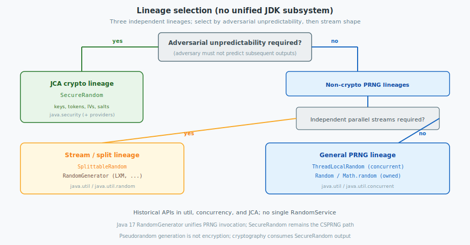

The JDK does not define a single random-number subsystem. It exposes distinct APIs in `java.util`, `java.util.concurrent`, `java.security`, and, since Java 17, `java.util.random`. This post gives an **overview** of those API lineages, then the **generator mechanisms** behind each type, and finally a **lineage selection** procedure with invocation patterns. Pseudorandom generation is not encryption; cryptographic protocols obtain secret material from the JCA `SecureRandom` path.

<!--more-->

Related: [Cryptographic Primitives: Encoding, Hashing, and Encryption](../encryption/).

---

## 1. Overview

OpenJDK provides **three lineages**. They share only the abstract function of producing bit strings; packages, threat models, and algorithms differ.

| Lineage | Primary types | Function |
|---------|---------------|----------|
| General PRNG | `java.util.Random`, `ThreadLocalRandom`, `Math.random()` | Non-cryptographic draws for ordinary application logic |
| Stream / split PRNG | `SplittableRandom`; splittable `RandomGenerator` factories | Statistically independent streams for parallel computation |
| JCA CSPRNG | `SecureRandom` and registered security providers | Bits that must remain unpredictable to an adversary |

`java.util.random.RandomGenerator` (Java 17+) standardizes the **invocation interface** for generators, including optional wrappers around older types. It does not subsume the JCA security boundary and does not remove the pre-existing types already used throughout the ecosystem.

### 1.1 Historical origin of the lineages

| Design pressure | Resulting API |
|-----------------|---------------|
| Seeded PRNG for libraries and `Math` | `java.util.Random` |
| Contention on a shared `Random` under concurrency | `ThreadLocalRandom` |
| Fork-join and parallel streams requiring split streams | `SplittableRandom` |
| Provider-based cryptography and operating-system entropy | `SecureRandom` (JCA) |
| Uniform interface over multiple PRNG algorithms | `RandomGenerator` / `RandomGeneratorFactory` (Java 17+) |

Type inheritance is not a reliable guide to mechanism: `ThreadLocalRandom` extends `Random`, yet OpenJDK does not implement it with `Random`’s 48-bit LCG.

### 1.2 Guarantees and non-guarantees by lineage

| Lineage | Provided | Not provided |
|---------|----------|--------------|
| General / stream PRNG | Deterministic state transition; statistical quality adequate for simulation | Unpredictability under attack; identical algorithm identity for every subtype across all future JDK releases |
| JCA `SecureRandom` | Provider CSPRNG (operating-system generator and/or NIST DRBG) suitable for secret material when correctly configured | A fixed algorithm name on every platform; non-blocking completion for every `getInstanceStrong()` resolution |

### 1.3 Type inventory (OpenJDK)

| Type | Role |
|------|------|
| `java.util.Random` | 48-bit LCG PRNG |
| `java.util.concurrent.ThreadLocalRandom` | Per-thread SplitMix-family PRNG |
| `java.util.SplittableRandom` | SplitMix64 with `split` / `mixGamma` |
| `java.security.SecureRandom` | CSPRNG via JCA providers |
| `java.util.random.RandomGenerator` | Uniform generator interface (Java 17+) |
| `java.util.random.RandomGeneratorFactory` | Discovery and construction by algorithm name |

---

## 2. Generator mechanisms

A **pseudorandom number generator (PRNG)** maintains finite state \(S\) and a transition \(S_{n+1}=f(S_n)\); each draw extracts bits from \(S\) or from a function of \(S\). A **cryptographically secure PRNG (CSPRNG)** must remain unpredictable given knowledge of prior outputs. The JDK types differ in \(f\), state size, and whether adversarial unpredictability is required. The descriptions below follow **OpenJDK**; algorithm bindings may differ by release and provider configuration.

### 2.1 `Random`: 48-bit linear congruential generator

OpenJDK implements `Random` (and the generator underlying `Math.random()`) as a **linear congruential generator** with a **48-bit** seed held in an `AtomicLong`.

**State transition** (`Random.next(int bits)`):

\[
seed \leftarrow (a \cdot seed + c) \bmod 2^{48}
\]

| Constant | Value | Role |
|----------|-------|------|
| Multiplier \(a\) | `0x5DEECE66DL` | Multiplier in the historical `drand48` family |
| Addend \(c\) | `0xBL` | Additive constant selected for full period under LCG constraints |
| Modulus | \(2^{48}\) | Enforced by masking with `((1L << 48) - 1)` |

**Output extraction.** After the transition, the implementation returns the most significant `bits` of the 48-bit seed:

\[
\texttt{next(bits)} = \lfloor seed / 2^{48-\textit{bits}} \rfloor
\]

`nextInt()` requests 32 bits. `nextLong()` concatenates two 32-bit results. `nextDouble()` constructs a value in \([0,1)\) from 53 bits of significand material.

**Seeding.** The constructor and `setSeed` transform the caller-supplied seed by XOR with the multiplier and reduction to 48 bits, so nearby user seeds are not adjacent in the LCG orbit. The transformation does not confer cryptographic strength.

**Properties.**

- Maximum period \(2^{48}\).
- The sequence is determined by the 48-bit seed; sufficiently many observed outputs permit state recovery.
- Concurrent use of a single instance synchronizes within `next`, which motivates `ThreadLocalRandom` on contended paths.

### 2.2 `ThreadLocalRandom`: per-thread SplitMix-family generator

Although `ThreadLocalRandom` subclasses `Random`, modern OpenJDK does **not** use the 48-bit LCG. The implementation follows the **SplitMix family** used by `SplittableRandom`: per-thread state, without a public `split()` operation.

**Per-thread state.** Each `Thread` stores `threadLocalRandomSeed`. A process-wide seeder derives distinct initial seeds from `currentTimeMillis` and `nanoTime`, or, when `java.util.secureRandomSeed` is `true`, from eight bytes obtained via `SecureRandom.getSeed`.

**State advance (Weyl sequence).** Each draw adds an odd increment so that the walk has maximal period over 64-bit words. OpenJDK uses:

\[
seed \leftarrow seed + \bigl(2\cdot\textit{threadId} + \gamma\bigr)
\]

with

\[
\gamma = \mathtt{GOLDEN\_GAMMA} = \mathtt{0x9e3779b97f4a7c15L} \approx 2^{64}/\varphi.
\]

The thread identifier term yields an odd, thread-distinct step while retaining bit transitions contributed by \(\gamma\).

**Output mixing.** The advanced seed is not emitted directly. It is passed through a 64-bit avalanche function \(\mathrm{mix64}\) (Stafford / Murmur-style finalizer). `nextInt` and `nextLong` take bits from the mixed value, suppressing the linear structure of the additive walk for ordinary statistical tests.

**Properties.**

- Documented period \(2^{64}\) for the additive component.
- The common path is unsynchronized; callers must invoke `ThreadLocalRandom.current()` on the thread that consumes the values.
- The generator is not a CSPRNG and must not supply keys or tokens.

### 2.3 `SplittableRandom`: SplitMix64

`SplittableRandom` is OpenJDK’s **SplitMix64** generator for fork-join and parallel streams.

**State.** Two 64-bit fields:

| Field | Meaning |
|-------|---------|
| `seed` | Position on an arithmetic progression |
| `gamma` | Odd Weyl step size; must remain odd |

The default gamma for an unsplit instance is \(\mathtt{GOLDEN\_GAMMA} = \mathtt{0x9e3779b97f4a7c15L}\).

**Next output.**

1. \(seed \leftarrow seed + gamma\)
2. \(z \leftarrow \mathrm{mix64}(seed)\)
3. Return selected bits of \(z\)

OpenJDK’s `mix64` is Stafford variant 13:

```text
z ^= z >>> 30;  z *= 0xbf58476d1ce4e5b9L;
z ^= z >>> 27;  z *= 0x94d049bb133111ebL;
z ^= z >>> 31;
return z;
```

`mix32` performs the corresponding extraction for `nextInt`.

**`split()`.** Constructs a child generator intended to avoid statistical collision with the parent:

1. Obtain mixed values from the parent for the child’s initial seed and a candidate gamma.
2. Derive child `gamma` with `mixGamma`: MurmurHash3 64-bit mix constants, force odd parity (`| 1`), and if the number of 01/10 transitions is below 24 (`Long.bitCount(z ^ (z >>> 1)) < 24`), XOR with `0xaaaaaaaaaaaaaaaaL`.

Each child therefore receives a distinct gamma (a distinct Weyl stride), which is the essential property of the Steele, Lea, and Flood splittable construction.

**Properties.**

- Deterministic given `(seed, gamma)`.
- Suitable for Monte Carlo workloads that require independent streams; not a CSPRNG.

### 2.4 `SecureRandom`: provider-backed CSRNGs

`SecureRandom` is a **JCA engine**. The algorithm name selects a `SecureRandomSpi` from a registered provider. The Java language specification does not prescribe a unique PRNG algorithm.

#### NativePRNG and NativePRNGBlocking on Linux

- **`NativePRNG`** reads from `/dev/urandom` (non-blocking kernel entropy pool). Some JDK releases additionally maintain a Java-side digest for `setSeed` and supplemental input; the entropy source remains the operating-system CSPRNG.
- **`NativePRNGBlocking`** may read `/dev/random`, which can block when the kernel entropy estimate is insufficient.

Modern Linux kernels typically implement the CSPRNG with ChaCha20; earlier kernels used other constructions. From the Java caller’s perspective, `nextBytes` returns operating-system-backed unpredictable output.

#### Windows-PRNG

Delegates to the Windows cryptographic RNG (`CryptGenRandom` or `BCryptGenRandom`, depending on JDK and provider).

#### DRBG under NIST SP 800-90A

A **deterministic random bit generator** constructed from an approved primitive and reseeded from entropy:

| Mechanism | Construction |
|-----------|--------------|
| **Hash_DRBG** | State updated with a hash function (for example SHA-256); output derived by hashing state |
| **HMAC_DRBG** | State updated with HMAC; output derived from an HMAC chain |
| **CTR_DRBG** | State comprises a key and counter; output from a block cipher in counter mode (for example AES-CTR) |

Configuration through `securerandom.drbg.config` or `SecureRandom.getInstance("DRBG", params)` selects the mechanism, security strength (for example 128, 192, or 256 bits), prediction resistance, and optional personalization. When so configured, the DRBG reseeds from entropy after producing a bounded volume of output.

#### SHA1PRNG (legacy Sun provider)

A Java-implemented generator based on SHA-1: internal digest state yields each output block; state is then updated, typically by incorporating prior output. Prefer an operating-system CSPRNG or an SP 800-90A DRBG for new deployments.

**`SecureRandom.getInstanceStrong()`** resolves `securerandom.strongAlgorithms` in `java.security` (for example `NativePRNGBlocking:SUN,DRBG:SUN`) and returns the first available algorithm. Blocking native algorithms may impose latency; selection must match operational constraints.

### 2.5 `RandomGenerator` algorithm families (Java 17+)

`RandomGenerator` and `RandomGeneratorFactory` expose named algorithms. Non-cryptographic factories share large state, an efficient transition, and optional leap or split operations.

#### LXM family

The Steele and Vigna **LXM** construction combines, at each step:

1. **L** — an LCG of width \(p\) (for example 64 bits): \(s \leftarrow a\cdot s + c \bmod 2^{p}\)
2. **X** — an xor-based generator (XBG) of width \(q\) (for example 128-bit xoroshiro-like state)
3. **M** — a mixer that combines the L and X contributions into the returned value

The name `L64X128MixRandom` denotes a 64-bit LCG, a 128-bit XBG, and a mixer. For full-period parameters the period is on the order of \(2^{p+q}\). Selected LXM instances support split or jump for parallel streams.

#### Xoroshiro and Xoshiro families

State comprises several `long` words updated by rotates, shifts, and exclusive-or operations (Blackman and Vigna). The `PlusPlus` output function applies addition, rotation, and addition to state words. Periods are \(2^{128}-1\) or \(2^{256}-1\), excluding the all-zero state. These generators are not CSRNGs.

#### Factory wrappers of earlier types

| Factory name | Mechanism |
|--------------|-----------|
| `Random` | 48-bit LCG (§2.1) |
| `SplittableRandom` | SplitMix64 (§2.3) |
| `SecureRandom` | Provider CSPRNG (§2.4) |

### 2.6 Algorithm comparison by API

| API | Core algorithm | Approximate state | CSPRNG |
|-----|----------------|-------------------|--------|
| `Random` | 48-bit LCG | 48 bits | No |
| `ThreadLocalRandom` | SplitMix-family (per-thread seed and `mix64`) | 64-bit seed per thread | No |
| `SplittableRandom` | SplitMix64 with `mixGamma` on split | seed and gamma (~128 bits) | No |
| LXM / Xoroshiro factories | LCG+XBG+mix, or xor/rotate permutations | 128–256+ bits | No |
| `SecureRandom` | Operating-system CSPRNG and/or NIST DRBG; legacy SHA1PRNG | Provider-defined | Yes, when a suitable provider algorithm is used |

---

## 3. Lineage selection

After the mechanisms above, selection is a mapping from requirements onto lineages. Evaluate requirements in order; do not choose a type by method convenience alone.



### 3.1 Selection by requirement

- Cryptographic secret material (keys, tokens, salts, IVs, nonces): `SecureRandom` exclusively.
- Non-cryptographic draws under concurrency: `ThreadLocalRandom.current()`.
- Non-cryptographic draws with a prescribed seed and reproducible sequence: a constructed `Random` (or other seedable generator).
- Independent streams for parallel or fork-join tasks: `SplittableRandom.split()` or a splittable `RandomGenerator`.
- Selection of a named non-cryptographic algorithm (Java 17+): `RandomGeneratorFactory`.

### 3.2 Selection procedure

1. **Adversarial unpredictability.** If an adversary must not be able to predict subsequent outputs from prior outputs or public state, select the JCA lineage (`SecureRandom`) and terminate the procedure.
2. **Stream independence.** If distinct tasks require streams that are intended to be statistically independent (for example parallel Monte Carlo with `split`), select the stream / split lineage.
3. **Otherwise** select the general PRNG lineage. Prefer `ThreadLocalRandom` when no explicit seed is required. Construct a seeded `Random`, `SplittableRandom`, or seedable `RandomGenerator` when bit-identical reproducibility is required.

| Requirement | Lineage | Representative type |
|-------------|---------|---------------------|
| Adversarial unpredictability | JCA | `SecureRandom` |
| Concurrent non-cryptographic draws | General PRNG | `ThreadLocalRandom` |
| Seeded reproducibility | General or stream PRNG | Seeded `Random` / `SplittableRandom` |
| Independent parallel streams | Stream / split | `SplittableRandom`, LXM factories |
| Named algorithm catalog (Java 17+) | Stream / split (and wrappers) | `RandomGeneratorFactory` |

Incorrect lineage selection includes using `Random` for authentication tokens, and using `SecureRandom` for high-volume simulation when unpredictability is not required (correct for security, often disproportionate in cost).

### 3.3 Non-cryptographic generation

```java
import java.util.concurrent.ThreadLocalRandom;

int n = ThreadLocalRandom.current().nextInt(100);       // [0, 100)
long id = ThreadLocalRandom.current().nextLong();
double u = ThreadLocalRandom.current().nextDouble();    // [0.0, 1.0)
```

Seeded `Random` when a reproducible sequence is required:

```java
import java.util.Random;

Random r = new Random(42L);
int a = r.nextInt(10);
int b = r.nextInt(10);
```

### 3.4 Splittable stream construction

```java
import java.util.SplittableRandom;
import java.util.stream.IntStream;

SplittableRandom root = new SplittableRandom(12345L);
IntStream.range(0, 4).parallel().forEach(i -> {
    SplittableRandom local = root.split();
    System.out.println(local.nextInt());
});
```

### 3.5 Cryptographic byte generation

```java
import java.security.SecureRandom;

SecureRandom sr = new SecureRandom();
// SecureRandom sr = SecureRandom.getInstanceStrong();

byte[] key = new byte[16];    // e.g. AES-128 key material
sr.nextBytes(key);

byte[] token = new byte[32];
sr.nextBytes(token);
```

Do not derive tokens from `Random.nextInt` encodings. Do not initialize `SecureRandom` for production secrets with low-entropy material such as wall-clock time or process identifiers alone.

### 3.6 Named `RandomGenerator` construction (Java 17+)

```java
import java.util.random.RandomGenerator;
import java.util.random.RandomGeneratorFactory;

RandomGenerator g = RandomGeneratorFactory.of("L64X128MixRandom").create();
long x = g.nextLong();

RandomGeneratorFactory.all()
    .map(RandomGeneratorFactory::name)
    .sorted()
    .forEach(System.out::println);
```

---

| Topic | Summary |
|-------|---------|
| Overview | Three API lineages; historical origin; guarantees; type inventory |
| Generator mechanisms | LCG; SplitMix (`ThreadLocalRandom`, `SplittableRandom`); LXM / Xoroshiro; OS CSPRNG and NIST DRBG |
| Lineage selection | Requirement mapping, selection procedure, then invocation patterns |
