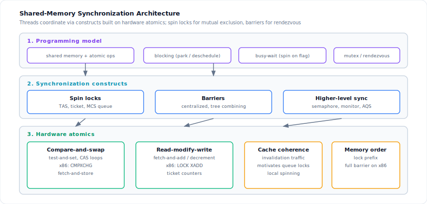
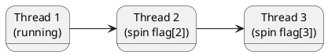

On shared-memory machines, threads communicate by reading and writing shared data structures. Simple updates use **hardware atomics**; larger critical sections use **synchronization constructs** — either **blocking** (deschedule the waiter) or **busy-wait** (spin until a condition holds). This post covers the busy-wait building blocks: **spin locks** for mutual exclusion and **barriers** for rendezvous.
<!--more-->

---

## 1. Architecture

Threads coordinate through two broad classes of construct:

| Class | Behavior | Typical use |
|-------|----------|-------------|
| **Blocking** | Waiter is descheduled (park, futex, kernel mutex) | Long or unknown wait; fair scheduling |
| **Busy-wait** | Waiter spins, repeatedly testing shared state | Short, bounded critical sections; low latency |

Within busy-wait synchronization, two primitives cover most patterns:

| Construct | Purpose |
|-----------|---------|
| **Spin lock** | Mutual exclusion — at most one thread in a critical section |
| **Barrier** | Rendezvous — no thread proceeds past a point until all have arrived |

Spin locks are the low-level building block for richer semantics (semaphores, monitors, Java `AbstractQueuedSynchronizer`). Barriers appear in parallel loops, phased algorithms, and fork/join style pipelines.



### 1.1 Design overview

1. **Acquire / release** — a lock acquire spins (or blocks) until exclusive access is granted; release clears the flag and may wake waiters.
2. **Cache coherence cost** — naïve test-and-set on one word causes every waiter to invalidate the same cache line on each failed attempt. Scalable locks spread waiters across lines (ticket, array, queue).
3. **Barrier sense-reversing** — processors flip a private `local_sense` and poll a shared `sense` until all arrivals are counted; avoids resetting a global counter under contention.
4. **Hardware mapping** — spin loops compile to atomic RMW instructions (`CMPXCHG`, `LOCK XADD` on x86) with full memory ordering on the locked line.

---

## 2. Implementation

### 2.1 Spin locks

A spin lock causes a thread trying to acquire it to **wait in a loop** while checking whether the lock is available. The thread stays runnable but does no useful work — appropriate only when hold time is short and contention is moderate.

| Lock type | Idea | Scalability |
|-----------|------|-------------|
| Test-and-set | Single shared flag; CAS or atomic exchange | Poor under contention (cache line bouncing) |
| Ticket | FIFO ticket counter + serving counter | Fair; waiters mostly read `now_serving` |
| Array-based queue | Each thread spins on its own slot | Reduces invalidation vs single word |
| MCS queue | Linked queue; spin on **local** `locked` flag | Best locality; O(1) acquire/release amortized |

#### Test-and-set

The simplest spin lock atomically sets a flag and spins while it was already set:

```pseudocode
// shared: lock := false

acquire():
    repeat
        while test_and_set(&lock) == true   // or CAS loop with backoff
            // optional: pause, exponential backoff

release():
    lock := false
```

**Backoff** (random or exponential delay between attempts) reduces bus traffic when the lock is held for non-trivial periods.

#### Ticket lock

Threads take a ticket and spin until their number is served — FIFO fairness and waiters probe **`now_serving`** with ordinary reads instead of hammering the lock word:

```pseudocode
// shared: next_ticket, now_serving := 0

acquire():
    my := fetch_and_increment(&next_ticket)
    while my != now_serving
        // spin (read-only on now_serving)

release():
    now_serving := now_serving + 1
```

On cache-coherent machines, spinning on `now_serving` generates far fewer invalidations than a single shared TAS word.

#### Array-based queuing lock

Each processor (or slot index) has a **dedicated location** to spin on. Thread *i* waits on `flag[i]` while thread *i−1* holds the lock, forming a logical queue without a linked structure:



Release clears the caller's flag and sets the successor's flag, passing the lock down the array.

#### MCS queue lock

The **Mellor-Crummey and Scott (MCS)** lock queues waiters in a linked list. Each waiter spins on its **own** `qnode.locked` field — the successor is local to the waiting core, minimizing coherence traffic.

```pseudocode
type qnode = record
    next: qnode
    locked: boolean

type lock = qnode*    // points to tail of queue

// I: qnode allocated in memory local to this processor
acquire(L, I):
    I.next := nil
    I.locked := false
    pred := fetch_and_store(L, I)      // enqueue self as new tail
    if pred != nil then
        I.locked := true
        pred.next := I
        while I.locked                    // spin on LOCAL flag
            ;

release(L, I):
    if I.next == nil then                 // no successor yet
        if compare_and_swap(L, I, nil) then
            return
        repeat while I.next == nil        // wait for successor to link
    I.next.locked := false                // hand off to successor
```

The last arriver may need to CAS the tail to `nil` or wait until a successor links — the classic MCS release race.

---

### 2.2 Barriers

A **barrier** for a group of threads means: **no thread may proceed until all have reached the barrier**. Used at phase boundaries in parallel loops (e.g. before reading results written by peers in the previous iteration).

#### Centralized barrier

One shared counter and a **sense-reversing** flag. Each thread toggles its private `local_sense`, decrements `count`, and either resets the counter (last arrival) or spins until `sense == local_sense`:

```pseudocode
// shared: count := p, sense := true
// private per processor: local_sense := true

central_barrier():
    local_sense := not local_sense
    if fetch_and_decrement(&count) == 1 then
        count := p
        sense := local_sense          // release everyone
    else
        repeat until sense = local_sense
```

The last arriver publishes the new `sense`; others observe it without further writes to `count` until the next round.

#### Software combining tree barrier

For large *p*, a flat centralized counter becomes a hotspot. A **tree barrier** assigns each processor a leaf node; arrivals **combine** upward (increment parent counts) so most threads touch only nearby nodes. Depth is $O(\log p)$; only the root sees global contention.

```pseudocode
type node = record
    k: integer              // fan-in degree
    count: integer
    sense: boolean
    parent: node

// shared nodes[0..p-1] arranged as tree
// private: mynode, local_sense
```

Each thread waits on its leaf's `sense`, then propagates arrival to ancestors — details vary by fan-in and whether combining is synchronous or asynchronous.

---

### 2.3 Hardware atomics (x86)

Spin locks and barriers compile down to a small set of atomic instructions:

| Instruction | Role |
|-------------|------|
| **`CMPXCHG`** | Compare-and-exchange — test-and-set, CAS loops, MCS tail update |
| **`LOCK XADD`** | Atomic fetch-and-add — ticket `next_ticket`, barrier `count` decrement |

The `LOCK` prefix provides full barrier semantics on the modified cache line: prior loads/stores complete before the RMW, and the RMW is visible before subsequent memory ops. Higher-level runtimes (`java.util.concurrent`, pthread mutexes) build blocking synchronizers on these same primitives plus OS wait queues.

---

### 2.4 Relation to Java and higher-level sync

Busy-wait locks are rarely used directly in application Java code — `synchronized`, `ReentrantLock`, and `AbstractQueuedSynchronizer` **block** threads after failed try-acquire. Under the hood, short spins (`onSpinWait`, adaptive spinning in HotSpot) still borrow the same ideas before parking. See [Synchronizer Framework](/2024/04/java/concurrency/synchronizer-framework/) for the Java layer built on `LockSupport` and CAS state.
