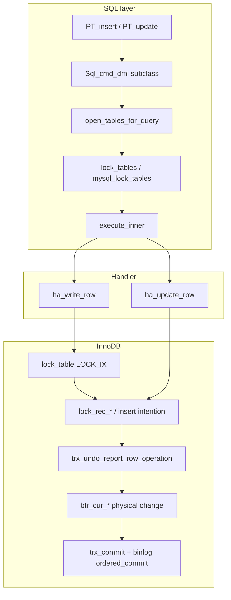
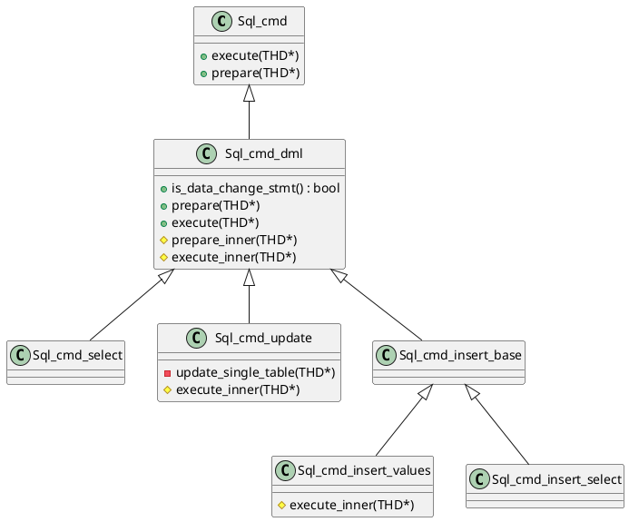
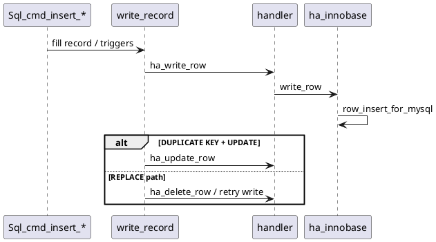
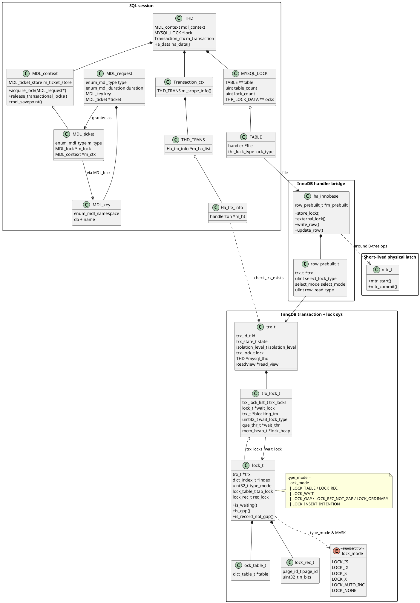
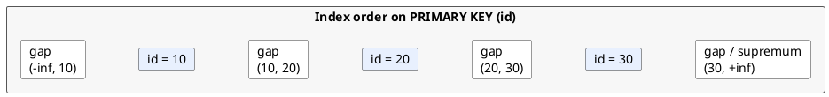
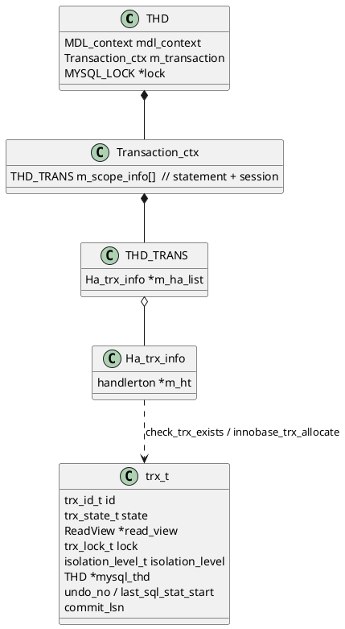
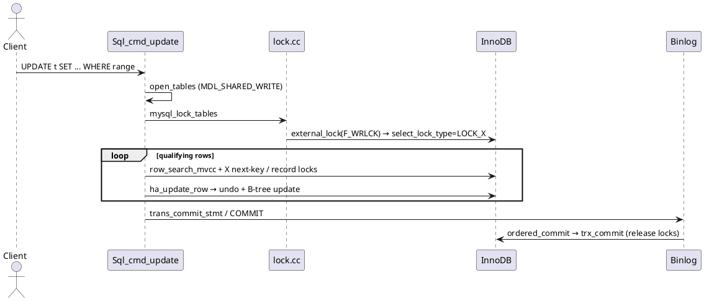
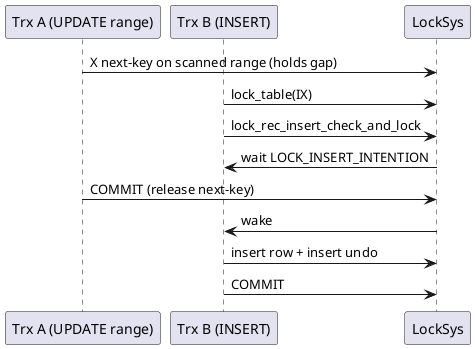

This article traces MySQL **INSERT** and **UPDATE** from the SQL command layer through table and metadata locking into InnoDB row locking, undo generation, and commit — focusing on **concurrency control**, **lock modes**, and **transaction boundaries**. It complements [query processing](/post/data/db/mysql/query/) (SELECT pipeline) and [InnoDB storage](/post/data/db/mysql/innodb/) (MVCC, pages, redo/undo layout). Source paths refer to the checked-out `mysql-server` tree.

<!--more-->

# 1. Architecture

A modifying statement reuses the same `Sql_cmd_dml` prepare / open / lock / execute skeleton as SELECT, but diverges where rows are written:

1. **SQL layer** — parse to `Sql_cmd_update` / `Sql_cmd_insert_*`, open tables, acquire MDL and `MYSQL_LOCK`, then either a specialized write loop (single-table UPDATE, INSERT VALUES) or an iterator plan that sinks rows into `Query_result_update` / `Query_result_insert`.
2. **Handler boundary** — `ha_write_row` / `ha_update_row` / `ha_delete_row` on `ha_innobase`.
3. **InnoDB** — table intention locks (`LOCK_IX`), record / gap / next-key / insert-intention locks, undo for rollback and MVCC, redo for durability, then group commit with the binary log.



### Key source directories

| Path | Role |
|------|------|
| `sql/sql_cmd_dml.h`, `sql/sql_select.cc` | Shared DML prepare / execute pipeline |
| `sql/sql_update.cc`, `sql/sql_insert.cc` | UPDATE / INSERT command execution |
| `sql/sql_base.cc`, `sql/lock.cc` | Open tables, MDL, `MYSQL_LOCK` |
| `sql/transaction.cc`, `sql/handler.cc`, `sql/binlog.cc` | Statement / session commit and 2PC |
| `storage/innobase/handler/ha_innodb.cc` | Handler writes, `external_lock`, commit hooks |
| `storage/innobase/row/row0ins.cc`, `row0upd.cc`, `row0sel.cc` | Insert / update / locking-read graphs |
| `storage/innobase/lock/lock0lock.cc` | Record, gap, next-key, insert-intention locks |
| `storage/innobase/trx/trx0rec.cc`, `trx0trx.cc` | Undo records and transaction commit |

---

# 2. SQL-layer DML pipeline

## 2.1 Shared `Sql_cmd_dml` path

`Sql_cmd_dml` is the common base for SELECT and data-changing statements. `is_data_change_stmt()` defaults to `true`; SELECT overrides it. Execution always:

1. Opens tables (`open_tables_for_query`) — also acquires **MDL**.
2. Locks tables (`lock_tables` → `mysql_lock_tables`) — THR_LOCK + engine `external_lock`.
3. Calls `execute_inner()`.



Default `execute_inner()` is the query-expression path used by SELECT, **INSERT … SELECT**, and **multi-table UPDATE**:

```text
unit->optimize() → create_iterators() → execute()
```

Single-table UPDATE and INSERT VALUES override `execute_inner()` with specialized write loops that still call the same handler APIs.

## 2.2 UPDATE

`Sql_cmd_update::execute_inner()` branches on target shape:

```text
multitable ? Sql_cmd_dml::execute_inner(thd)   // iterators + Query_result_update
           : update_single_table(thd)
```

**Single-table UPDATE** scans qualifying rows (locking read under InnoDB), then:

```text
table->file->ha_update_row(table->record[1], table->record[0])
```

`record[1]` is the old image; `record[0]` is the new image after SET expressions.

**Multi-table UPDATE** installs `Query_result_update`, which never returns rows to the client (`send_data` asserts). It updates eligible targets immediately or buffers row IDs for delayed updates when join order / self-join safety requires it (`UpdateRowsIterator`).

Parser initially marks all listed tables as write-locked; `prepare_inner()` may downgrade non-target tables so concurrent readers are not blocked unnecessarily.

## 2.3 INSERT

| Class | Execution |
|-------|-----------|
| `Sql_cmd_insert_values` | Own `execute_inner()`: loop value lists → `write_record()` |
| `Sql_cmd_insert_select` | Default `Sql_cmd_dml::execute_inner()`; SELECT streams into `Query_result_insert::send_data()` → `write_record()` |

`write_record()` centralizes duplicate handling:

| Mode | Behavior |
|------|----------|
| Normal INSERT | `ha_write_row()` |
| `ON DUPLICATE KEY UPDATE` | On duplicate: `ha_update_row()` |
| `REPLACE` | May `ha_delete_row()` then retry insert, or update in place depending on engine feedback |



---

# 3. Concurrency control layers

MySQL applies several distinct locking mechanisms during DML. They operate at different granularities and must not be conflated: conflating them is a common source of incorrect conclusions such as “READ COMMITTED disables all gap locks.” Each mechanism addresses a separate question—whether DDL may alter the table definition, how the storage engine enters the statement, and whether another transaction may modify a given index record or the gap preceding it.

Unless otherwise stated, the examples below use InnoDB under the default **REPEATABLE READ** isolation level and the following schema:

```sql
CREATE TABLE t (
  id   INT PRIMARY KEY,
  c    INT NOT NULL,
  KEY  idx_c (c)
) ENGINE=InnoDB;

INSERT INTO t VALUES (10, 10), (20, 20), (30, 30);
```

| Layer | Protected resource | Typical acquisition under DML |
|-------|--------------------|-------------------------------|
| **MDL** | Table (and related) metadata against DDL | Target tables: `MDL_SHARED_WRITE`; read-only sources: `MDL_SHARED_READ` |
| **THR_LOCK / `MYSQL_LOCK`** | Server-layer table-lock compatibility among handlers | Write-oriented `thr_lock_type` values; for InnoDB, `lock_count()` is 0, so THR_LOCK is not the row-concurrency mechanism |
| **InnoDB table lock** | Table-level intention prior to record locks | `LOCK_IX` or `LOCK_IS` for DML and locking reads |
| **InnoDB record locks** | Index records and intervening gaps | `LOCK_S` / `LOCK_X` combined with `LOCK_REC_NOT_GAP`, `LOCK_GAP`, `LOCK_ORDINARY`, or `LOCK_INSERT_INTENTION` |
| **Page latches / mtr** | Physical B-tree page mutation | Short-duration latches; not transactional locks |

### Data Structure

The structures below attach either to the SQL session (`THD`) or to the InnoDB transaction (`trx_t`). Edges in the diagram denote ownership or association; they do not depict call order.



Correspondence between layers and types:

| Layer | Primary types |
|-------|----------------|
| MDL | `THD::mdl_context` → `MDL_request` / `MDL_ticket` / `MDL_key` |
| SQL table-lock handshake | `THD::lock` (`MYSQL_LOCK`) → `TABLE` → `ha_innobase::{store,external}_lock` |
| Statement locking-read mode | `row_prebuilt_t::select_lock_type` (`LOCK_NONE` / `LOCK_S` / `LOCK_X`) |
| InnoDB transactional locks | `trx_t::lock` (`trx_lock_t`) owns `trx_locks`; wait state in `wait_lock` / `blocking_trx` |
| Table versus record | `lock_t` discriminant: `lock_table_t` (e.g. IS/IX) or `lock_rec_t` (page identifier and bit map) |
| Page latch | `mtr_t` — not linked into `trx_locks` |

---

## 3.1 Metadata locks (MDL)

**Mechanism.** A metadata lock is a server-wide lock on a dictionary object, identified by `MDL_key` and held in `THD::mdl_context`. Lock modes are defined in `sql/mdl.h`. For DML, the requested mode is derived from the SQL-layer table lock type:

```cpp
// sql/table.h — mdl_type_for_dml()
inline enum enum_mdl_type mdl_type_for_dml(enum thr_lock_type lock_type) {
  return lock_type >= TL_WRITE_ALLOW_WRITE
             ? (lock_type == TL_WRITE_LOW_PRIORITY ? MDL_SHARED_WRITE_LOW_PRIO
                                                   : MDL_SHARED_WRITE)
             : MDL_SHARED_READ;
}
```

Acquisition is coupled to table opening. `open_tables_for_query()` installs a DML prelocking strategy and records an MDL savepoint so that a failed open can release only tickets acquired during that attempt:

```cpp
// sql/sql_base.cc — open_tables_for_query()
bool open_tables_for_query(THD *thd, Table_ref *tables, uint flags) {
  DML_prelocking_strategy prelocking_strategy;
  MDL_savepoint mdl_savepoint = thd->mdl_context.mdl_savepoint();
  if (open_tables(thd, &tables, &thd->lex->table_count, flags,
                  &prelocking_strategy))
    goto end;
  // ...
}
```

Within `open_tables()`, each `Table_ref` carries an `MDL_request`. The context grants the request through `thd->mdl_context.acquire_lock()` or `acquire_locks()`. Compatible shared modes permit concurrent DML on the same table. Exclusive modes required by DDL wait until all conflicting shared holders have released their tickets.

**Scope.** MDL does not serialize concurrent `UPDATE` (or other DML) statements that modify distinct rows. Row-level mutual exclusion is the responsibility of InnoDB.

**Example — DML precludes DDL, not concurrent DML:**

```sql
-- Session A
BEGIN;
UPDATE t SET c = c + 1 WHERE id = 10;   -- holds MDL_SHARED_WRITE on t
-- do not COMMIT yet

-- Session B (concurrent DML: proceeds)
UPDATE t SET c = c + 1 WHERE id = 20;   -- also MDL_SHARED_WRITE
COMMIT;

-- Session C (DDL: waits)
ALTER TABLE t ADD COLUMN d INT;         -- exclusive MDL; blocked until A commits
```

**Example — non-locking SELECT versus DDL:**

```sql
-- Session A
BEGIN;
SELECT * FROM t WHERE id = 10;          -- MDL_SHARED_READ
-- Session B
DROP TABLE t;                           -- waits until A's MDL is released
```

Pending metadata locks may be observed through `performance_schema.metadata_locks` or `sys.schema_table_lock_waits`.

---

## 3.2 THR_LOCK / `MYSQL_LOCK` and InnoDB `external_lock`

**Mechanism.** After tables have been opened, `lock_tables()` constructs a `MYSQL_LOCK` and invokes `mysql_lock_tables()`:

```cpp
// sql/lock.cc — mysql_lock_tables() (structure)
if (!(sql_lock = get_lock_data(thd, tables, count, GET_LOCK_STORE_LOCKS)))
  return nullptr;

if (sql_lock->table_count &&
    lock_external(thd, sql_lock->table, sql_lock->table_count)) {
  // → handler::external_lock() for each TABLE
  reset_lock_data_and_free(&sql_lock);
  goto end;
}

rc = thr_lock_errno_to_mysql[(int)thr_multi_lock(
    sql_lock->locks + sql_lock->lock_count, sql_lock->lock_count,
    &thd->lock_info, timeout)];
```

```text
lock_tables()
  → mysql_lock_tables()
      → get_lock_data / store_lock() per handler
      → lock_external() → ha_innobase::external_lock()
      → thr_multi_lock()   // empty for InnoDB (lock_count() == 0)
```

Engines that rely on `THR_LOCK` (historically MyISAM) use this path for table-level read/write exclusion. InnoDB reports `lock_count() == 0`, so `thr_multi_lock()` does not acquire an InnoDB table mutex for ordinary row DML. The material effect for InnoDB is the pair `store_lock()` / `external_lock()`, which:

1. Registers the engine on `Transaction_ctx` via `Ha_trx_info`.
2. Establishes the statement context (`will_lock`, statement savepoint).
3. Maps SQL write intent onto `row_prebuilt_t::select_lock_type`:

```cpp
// storage/innobase/handler/ha_innodb.cc — external_lock()
if (lock_type == F_WRLCK) {
  /* If this is a SELECT, then it is in UPDATE TABLE ...
  or SELECT ... FOR UPDATE */
  m_prebuilt->select_lock_type = LOCK_X;
  m_stored_select_lock_type = LOCK_X;
}

if (lock_type != F_UNLCK) {
  innobase_register_trx(ht, thd, trx);
  // LOCK_NONE / LOCK_S / LOCK_X chosen from store_lock + isolation
  // (non-locking SELECT → NONE; FOR SHARE → S; FOR UPDATE → X)
}
```

Consequently, the search phase of `UPDATE` and of `SELECT … FOR UPDATE` already requests exclusive record locks through `row_search_mvcc()` before `ha_update_row()` executes. A non-locking `SELECT` retains `LOCK_NONE` and relies on MVCC read views alone.

**Example — identical handshake, distinct InnoDB lock modes:**

```sql
-- Non-locking read: read intent → LOCK_NONE
SELECT * FROM t WHERE id = 10;

-- Locking read: write-style table lock → select_lock_type = LOCK_X
SELECT * FROM t WHERE id = 10 FOR UPDATE;

-- DML: same F_WRLCK path as FOR UPDATE, followed by ha_update_row
UPDATE t SET c = 11 WHERE id = 10;
```

**Example — explicit table locks:**

```sql
LOCK TABLES t WRITE;     -- SQL-layer table lock; excludes other sessions from the table
UPDATE t SET c = 1 WHERE id = 10;
UNLOCK TABLES;
```

For ordinary transactional DML, InnoDB record locks are the appropriate concurrency mechanism; `LOCK TABLES` is a coarser SQL-layer alternative.

---

## 3.3 InnoDB table intention locks (`LOCK_IS` / `LOCK_IX`)

**Mechanism.** Before any record lock is granted, InnoDB acquires a table-level intention lock so that full-table `LOCK_S` / `LOCK_X` remain compatible with fine-grained record locking. The mode occupies the low-order bits of `lock_t::type_mode`:

```cpp
// storage/innobase/include/lock0types.h
enum lock_mode {
  LOCK_IS = 0,   /* intention shared */
  LOCK_IX,       /* intention exclusive */
  LOCK_S,        /* shared */
  LOCK_X,        /* exclusive */
  LOCK_AUTO_INC,
  LOCK_NONE,     /* consistent read — not a lock */
  // ...
};
```

```cpp
// storage/innobase/include/lock0lock.h
dberr_t lock_table(ulint flags, dict_table_t *table,
                   lock_mode mode, que_thr_t *thr);
```

| Mode | Interpretation | Typical acquisition |
|------|----------------|---------------------|
| `LOCK_IS` | Intention to place shared record locks | `SELECT … FOR SHARE`; certain foreign-key checks |
| `LOCK_IX` | Intention to place exclusive record locks | `UPDATE` / `DELETE` / `INSERT` / `SELECT … FOR UPDATE` |
| `LOCK_S` / `LOCK_X` | Full-table shared / exclusive | Uncommon for ordinary DML; appears on some `LOCK TABLES` paths |

The insert execution graph acquires `LOCK_IX` when the statement first references the table:

```cpp
// storage/innobase/row/row0ins.cc — row_ins()
if (node->state == INS_NODE_SET_IX_LOCK) {
  node->state = INS_NODE_ALLOC_ROW_ID;
  if (trx->id == node->trx_id) {
    goto same_trx;   // already IX-locked in this trx
  }
  err = lock_table(0, node->table, LOCK_IX, thr);
  // ...
  node->trx_id = trx->id;
}
```

Record-lock helpers require that the corresponding intention already be held (`LOCK_X` implies `LOCK_IX`; `LOCK_S` implies `LOCK_IS`):

```cpp
// storage/innobase/lock/lock0lock.cc — lock_clust_rec_read_check_and_lock()
ut_ad(mode != LOCK_X ||
      lock_table_has(thr_get_trx(thr), index->table, LOCK_IX));
ut_ad(mode != LOCK_S ||
      lock_table_has(thr_get_trx(thr), index->table, LOCK_IS));

err = lock_rec_lock(false, sel_mode, mode | gap_mode, block, heap_no, index, thr);
```

Intention locks are mutually compatible (`LOCK_IS` coexists with `LOCK_IX`). They conflict with opposing full-table locks.

**Example:**

```sql
-- Session A
BEGIN;
UPDATE t SET c = 11 WHERE id = 10;   -- table IX + record X on id = 10

-- Session B
BEGIN;
UPDATE t SET c = 21 WHERE id = 20;   -- table IX compatible; distinct row X succeeds
COMMIT;

-- Session C
BEGIN;
SELECT * FROM t WHERE id = 10 FOR SHARE;  -- table IS; waits while A holds X on id = 10
```

Table intention locks appear as `LOCK_TABLE` entries with mode `IX` or `IS` in `SHOW ENGINE INNODB STATUS` and `performance_schema.data_locks`.

---

## 3.4 InnoDB record lock modes

A record lock is attached to an **index record** (clustered or secondary), not to an abstract SQL-row identity. Its effective mode is the composition of:

- **Strength:** `LOCK_S` or `LOCK_X` (low nibble under `LOCK_MODE_MASK`);
- **Gap coverage:** precise-mode bits ORed into `type_mode`;
- **Insert waiting:** `LOCK_INSERT_INTENTION` when an insert must wait on a protected gap.

```cpp
// storage/innobase/include/lock0lock.h — precise modes
constexpr uint32_t LOCK_WAIT = 256;
constexpr uint32_t LOCK_ORDINARY = 0;          // next-key: record + preceding gap
constexpr uint32_t LOCK_GAP = 512;             // gap only
constexpr uint32_t LOCK_REC_NOT_GAP = 1024;    // record only
constexpr uint32_t LOCK_INSERT_INTENTION = 2048;
```

Locking reads encode strength and gap coverage in a single `lock_rec_lock` invocation:

```cpp
// lock0lock.cc — lock_clust_rec_read_check_and_lock()
err = lock_rec_lock(false, sel_mode, mode | gap_mode, block, heap_no, index, thr);
// e.g. LOCK_X | LOCK_ORDINARY, LOCK_X | LOCK_REC_NOT_GAP, LOCK_S | LOCK_GAP, ...
```

For a locking index scan, `row_search_mvcc()` selects the gap mode from the cursor’s relation to the search range:

```cpp
// storage/innobase/row/row0sel.cc
if (prebuilt->select_lock_type != LOCK_NONE) {
  auto rel = row_compare_row_to_range(...);
  ulint lock_type;
  if (rel.row_can_be_in_range) {
    lock_type = rel.gap_can_intersect_range ? LOCK_ORDINARY
                                            : LOCK_REC_NOT_GAP;
  } else {
    lock_type = rel.gap_can_intersect_range ? LOCK_GAP
                                            : /* not found */;
  }
  err = sel_set_rec_lock(..., prebuilt->select_lock_type, lock_type, ...);
}
```



### 3.4.1 Record lock only — `LOCK_REC_NOT_GAP`

**Mechanism.** The lock covers the index record and excludes the preceding gap. Concurrent inserts into adjacent gaps remain admissible. InnoDB employs this mode when the conflict domain is confined to a single existing record—typically a unique equality lookup that locates a non-deleted row (`row_can_be_in_range && !gap_can_intersect_range` in the decision above).

The clustered-index modify path reasserts record-only exclusive locking immediately before undo generation:

```cpp
// storage/innobase/lock/lock0lock.cc — lock_clust_rec_modify_check_and_lock()
lock_rec_convert_impl_to_expl(block, rec, index, offsets);
{
  locksys::Shard_latch_guard guard{UT_LOCATION_HERE, block->get_page_id()};
  ut_ad(lock_table_has(thr_get_trx(thr), index->table, LOCK_IX));
  err = lock_rec_lock(true, SELECT_ORDINARY, LOCK_X | LOCK_REC_NOT_GAP,
                      block, heap_no, index, thr);
}
```

**Example — unique primary-key locking read:**

```sql
-- Session A (RR)
BEGIN;
SELECT * FROM t WHERE id = 20 FOR UPDATE;
-- InnoDB: LOCK_X | LOCK_REC_NOT_GAP on clustered record id = 20
-- (unique hit; gaps (10,20) and (20,30) need not be locked)

-- Session B: blocked on the same record
UPDATE t SET c = 99 WHERE id = 20;          -- waits

-- Session C: insert into a neighboring gap remains admissible
INSERT INTO t VALUES (25, 25);                 -- succeeds while A holds id = 20
COMMIT;
```

### 3.4.2 Gap lock — `LOCK_GAP`

**Mechanism.** The lock covers only the open interval preceding an index record (or the supremum gap). It does not lock the boundary record. Its purpose is to prevent phantom inserts into that interval, not to exclude updates of the existing boundary row.

Under REPEATABLE READ, gap locks arise when `!row_can_be_in_range && gap_can_intersect_range` in the scan decision above, and during uniqueness probes on the first unequal (“next”) record:

```cpp
// storage/innobase/row/row0ins.cc — duplicate-key scan (plain INSERT)
} else if (is_next) {
  /* Only gap lock is required on next record. */
  lock_type = LOCK_GAP;
} else {
  /* Next key lock for all equal keys. */
  lock_type = LOCK_ORDINARY;
}
err = row_ins_set_rec_lock(LOCK_S, lock_type, block, rec, index, offsets, thr);
```

Under READ COMMITTED, `trx_t::skip_gap_locks()` is true and ordinary `UPDATE` scans omit most gap locks. Duplicate-key and foreign-key paths may still request them; when `skip_gap_locks` is set, the same routine forces `LOCK_REC_NOT_GAP` where a gap would otherwise be taken.

**Example — range-boundary gaps under REPEATABLE READ:**

```sql
-- Session A (RR)
BEGIN;
SELECT * FROM t WHERE id > 20 FOR UPDATE;
-- Acquires next-key / gap locks along (20, 30] and (30, +inf) as the scan proceeds;
-- inserts with id in (20, +inf) must wait.

-- Session B
INSERT INTO t VALUES (25, 25);   -- waits (gap within the locked range)
INSERT INTO t VALUES (15, 15);   -- succeeds (outside the locked gaps)

-- Session C: a pure gap does not, by itself, block updates of an uncovered record
UPDATE t SET c = 10 WHERE id = 10;  -- succeeds
```

A `LOCK_GAP` attached at `id = 30` precludes `INSERT … (25)` yet does not, by itself, preclude `UPDATE … WHERE id = 30`. Next-key locking (§3.4.3) combines both effects.

### 3.4.3 Next-key lock — `LOCK_ORDINARY`

**Mechanism.** A next-key lock covers the index record together with its preceding gap (`LOCK_S` or `LOCK_X` with precise mode `LOCK_ORDINARY == 0`). Under REPEATABLE READ it is the principal instrument against phantoms on locking range scans: neither an update of the matched record nor an insert into the preceding gap may proceed concurrently.

`row_search_mvcc()` selects `LOCK_ORDINARY` when both `row_can_be_in_range` and `gap_can_intersect_range` hold, and passes that value as `gap_mode` to `lock_rec_lock(mode | LOCK_ORDINARY)`.

**Example — range `UPDATE` under REPEATABLE READ:**

```sql
-- Session A (RR)
BEGIN;
UPDATE t SET c = c + 1 WHERE id BETWEEN 10 AND 20;
-- Next-key exclusive locks on scanned index positions covering the range
-- (exact placement depends on the access method; a primary-key range
-- typically acquires next-key locks along the walk).

-- Session B
UPDATE t SET c = 0 WHERE id = 10;     -- waits (record covered)
INSERT INTO t VALUES (15, 15);          -- waits (gap covered)
INSERT INTO t VALUES (35, 35);          -- succeeds if outside locked gaps
COMMIT;  -- after A commits
```

**Example — READ COMMITTED weakens gap coverage on ordinary scans:**

```sql
-- Session A
SET TRANSACTION ISOLATION LEVEL READ COMMITTED;
BEGIN;
UPDATE t SET c = c + 1 WHERE id BETWEEN 10 AND 20;
-- Matching rows retain record X; gaps are generally not retained for the scan.

-- Session B
INSERT INTO t VALUES (15, 15);   -- typically succeeds under READ COMMITTED
COMMIT;
```

### 3.4.4 Insert-intention lock — `LOCK_INSERT_INTENTION`

**Mechanism.** When the gap that would receive a new index entry is already held by another transaction’s gap or next-key lock, the inserting transaction does not request a conflicting ordinary gap lock—doing so would deadlock concurrent inserters. Prior to clustered undo and physical insert, `btr_cur_ins_lock_and_undo()` invokes `lock_rec_insert_check_and_lock()`, which enqueues a waiting insert-intention lock:

```cpp
// storage/innobase/btr/btr0cur.cc — btr_cur_ins_lock_and_undo()
err = lock_rec_insert_check_and_lock(
    flags, rec, btr_cur_get_block(cursor), index, thr, mtr, inherit);
// ...
err = trx_undo_report_row_operation(flags, TRX_UNDO_INSERT_OP, ...);
```

```cpp
// storage/innobase/lock/lock0lock.cc — lock_rec_insert_check_and_lock()
const ulint type_mode = LOCK_X | LOCK_GAP | LOCK_INSERT_INTENTION;

const auto conflicting =
    lock_rec_other_has_conflicting(type_mode, block, heap_no, trx);

if (conflicting.wait_for != nullptr) {
  RecLock rec_lock(thr, index, block, heap_no, type_mode);
  err = rec_lock.add_to_waitq(conflicting.wait_for);
}
```

Insert-intention requests in the same gap are not treated as mutually conflicting; the implementation comment cites avoidance of spurious deadlocks among concurrent inserts.

**Example:**

```sql
-- Session A (RR)
BEGIN;
SELECT * FROM t WHERE id > 20 FOR UPDATE;  -- retains gaps in (20, +inf)

-- Session B
BEGIN;
INSERT INTO t VALUES (25, 25);
-- Observes a conflicting gap/next-key lock → waits with INSERT_INTENTION

-- Session C
BEGIN;
INSERT INTO t VALUES (27, 27);
-- Likewise INSERT_INTENTION on the same gap; does not conflict with B

-- Session A
COMMIT;   -- releases gap locks → B and C proceed (subject to uniqueness checks)
```

### 3.4.5 Shared versus exclusive strength (`LOCK_S` / `LOCK_X`)

**Mechanism.** Independently of gap coverage, lock strength is `LOCK_S` or `LOCK_X`—the `mode` argument to `lock_rec_lock` and `row_ins_set_rec_lock`:

| SQL construct | Typical strength | Source indication |
|---------------|------------------|-------------------|
| `SELECT … FOR SHARE` | `LOCK_S` | `select_lock_type = LOCK_S` from `store_lock` |
| `SELECT … FOR UPDATE`, `UPDATE`, `DELETE` | `LOCK_X` | `external_lock(F_WRLCK)` / `select_lock_type = LOCK_X` |
| Plain `INSERT` duplicate probe | `LOCK_S` | `row_ins_set_rec_lock(LOCK_S, …)` |
| `INSERT … ON DUPLICATE KEY UPDATE` / `REPLACE` | `LOCK_X` on duplicate candidates | `row_ins_set_rec_lock(LOCK_X, …)` |

```cpp
// storage/innobase/row/row0ins.cc — duplicate scan
if (/* REPLACE / ON DUPLICATE KEY UPDATE */) {
  err = row_ins_set_rec_lock(LOCK_X, lock_type, block, rec, index, offsets, thr);
} else {
  err = row_ins_set_rec_lock(LOCK_S, lock_type, block, rec, index, offsets, thr);
}
```

**Example — shared versus exclusive conflict:**

```sql
-- Session A
BEGIN;
SELECT * FROM t WHERE id = 10 FOR SHARE;   -- LOCK_S on the record

-- Session B
SELECT * FROM t WHERE id = 10 FOR SHARE;   -- LOCK_S; compatible
SELECT * FROM t WHERE id = 10 FOR UPDATE;  -- LOCK_X; waits for A
UPDATE t SET c = 1 WHERE id = 10;         -- LOCK_X; waits for A
```

**Example — duplicate-key locking on `INSERT`:**

```sql
-- Session A
BEGIN;
INSERT INTO t VALUES (40, 40);   -- succeeds; implicit X via DB_TRX_ID on the new row
-- not committed

-- Session B
INSERT INTO t VALUES (40, 40);   -- uniqueness check locks the duplicate site; waits
-- or, with ON DUPLICATE KEY UPDATE:
INSERT INTO t VALUES (40, 40) AS n
  ON DUPLICATE KEY UPDATE c = n.c;  -- LOCK_X on the duplicate, then the update path
```

---

## 3.5 Page latches and mini-transactions

**Mechanism.** During B-tree search or modification, InnoDB holds **page latches** within an `mtr` (mini-transaction) for a brief critical section: the page is latched, the change is applied, redo is recorded in the mini-transaction, and `mtr_commit()` releases the latches. These latches are neither transactional locks nor retained until `COMMIT`.

```cpp
// storage/innobase/btr/btr0cur.cc — typical search/modify framing
mtr_start(&mtr);
btr_cur_search_to_nth_level(index, 0, tuple, mode, ..., &mtr);
// ... lock_rec_* / undo / page update under page latches ...
mtr_commit(&mtr);   // releases page latches; transactional locks remain
```

Transactional locks (§3.3–3.4) outlive the latch: once the page latch is released, other transactions remain constrained by the logical lock until commit or rollback. Lock-system shard latches (`locksys::Shard_latch_guard` in the snippets above) protect lock-hash structures only for the duration of `lock_rec_lock` and are likewise short-lived.

Page latches are not expressible in SQL. Contention manifests as brief stalls or buffer-pool wait instrumentation, not as InnoDB lock-wait timeouts on a particular primary-key value.

---

## 3.6 Layer composition for a single statement

```sql
BEGIN;
UPDATE t SET c = 100 WHERE id BETWEEN 10 AND 20;
-- 1) MDL_SHARED_WRITE on t                         (§3.1)
--      open_tables → mdl_context.acquire_lock
-- 2) mysql_lock_tables → external_lock(F_WRLCK)
--      → select_lock_type = LOCK_X                 (§3.2)
-- 3) InnoDB table LOCK_IX via lock_table()         (§3.3)
-- 4) Per index record: lock_rec_lock(
--      LOCK_X | LOCK_ORDINARY / LOCK_REC_NOT_GAP) (§3.4)
-- 5) Transient mtr page latches around B-tree I/O  (§3.5)
COMMIT;  -- releases (3)–(4); MDL is released when tables are closed
         -- or transactional MDL duration ends, as applicable
```

---

# 4. UPDATE concurrency path

## 4.1 Call chain

```text
Sql_cmd_update::execute_inner
  → update_single_table  (or Query_result_update iterators)
      → row_search_mvcc          // LOCK_X locking read
      → sel_set_rec_lock
      → lock_clust/sec_rec_read_check_and_lock
      → ha_update_row
          → ha_innobase::update_row
          → row_update_for_mysql
          → row_upd_clust_step
          → lock_clust_rec_modify_check_and_lock   // X | LOCK_REC_NOT_GAP
          → trx_undo_report_row_operation(TRX_UNDO_MODIFY_OP)
          → clustered + secondary index updates
```

## 4.2 Choosing record vs gap vs next-key

During the locking scan, `row_search_mvcc()` maps the cursor position relative to the search range:

```cpp
// row0sel.cc — simplified structure of the decision
if (prebuilt->select_lock_type != LOCK_NONE) {
  auto rel = row_compare_row_to_range(...);
  ulint lock_type;
  if (rel.row_can_be_in_range) {
    lock_type = rel.gap_can_intersect_range ? LOCK_ORDINARY : LOCK_REC_NOT_GAP;
  } else {
    lock_type = rel.gap_can_intersect_range ? LOCK_GAP : /* not found */;
  }
  err = sel_set_rec_lock(..., prebuilt->select_lock_type, lock_type, ...);
}
```

Under **REPEATABLE READ**:

- Unique equality on an existing clustered record can take **record-only X**.
- Range / non-unique scans take **next-key X** (and gap locks at boundaries) so phantoms cannot appear in the locked range before commit.
- The modify step re-asserts **X | LOCK_REC_NOT_GAP** on the clustered record before writing undo and mutating the page.

Under **READ COMMITTED**:

- `trx_t::skip_gap_locks()` is true → ordinary UPDATE scans avoid gap/next-key where possible.
- Matching rows stay **record X**-locked until commit.
- Locks taken on rows that **fail the WHERE** can be released (`releases_non_matching_rows()` / `try_unlock`).
- Semi-consistent read may observe the last committed version of a locked row, evaluate the predicate, then re-read with a lock if the row still qualifies.

## 4.3 UPDATE vs `SELECT … FOR UPDATE`

Both set `select_lock_type = LOCK_X` and share the same locking-read machinery. Differences:

| | `SELECT … FOR UPDATE` | `UPDATE` |
|--|----------------------|----------|
| After lock | Return row | `ha_update_row` + undo + index maintenance |
| Predicate miss (RC) | May release non-matching locks | Same semi-consistent / unlock path |
| Binlog / triggers | No row change events | Full write side effects |

---

# 5. INSERT concurrency path

## 5.1 Call chain

```text
Sql_cmd_insert_values::execute_inner
  → write_record
      → ha_write_row
          → ha_innobase::write_row
          → row_insert_for_mysql
          → lock_table(..., LOCK_IX, ...)
          → unique / FK checks (S or X locks on conflicting keys)
          → btr_cur_ins_lock_and_undo
              → lock_rec_insert_check_and_lock   // may wait INSERT_INTENTION
              → trx_undo_report_row_operation(TRX_UNDO_INSERT_OP)
              → insert clustered + secondary records
```

The newly inserted clustered record carries an **implicit X lock** via `DB_TRX_ID`; another transaction that needs an explicit wait converts that to an explicit lock entry.

## 5.2 Insert-intention locks

When the gap before the insert position is held by another transaction’s gap/next-key lock, the inserter does not take a conflicting ordinary lock immediately. It requests:

```cpp
// lock0lock.cc — lock_rec_insert_check_and_lock()
const ulint type_mode = LOCK_X | LOCK_GAP | LOCK_INSERT_INTENTION;
// wait on conflicting.wait_for if present
```

This encodes “I intend to insert here” without blocking other insert intentions in the same gap. After the conflicting gap holder commits/rolls back, the insert proceeds and inherits/splits gap state as needed.

## 5.3 Duplicate-key and FK locking

Unique-index duplicate checking walks equal keys and locks potential conflict sites. Mode depends on statement intent:

```cpp
// row0ins.cc — duplicate scan (conceptual)
if (will_update_or_replace_duplicate) {
  err = row_ins_set_rec_lock(LOCK_X, lock_type, ...);  // REPLACE / ON DUP UPDATE
} else {
  // plain INSERT: S locks; under RR often LOCK_ORDINARY / GAP on neighbors
  err = row_ins_set_rec_lock(LOCK_S, lock_type, ...);
}
```

Under RC, gap locks on supremum / “next” records are skipped where safe, but **duplicate-key and foreign-key** paths still take the locks required for correctness. Isolation level does not mean “no gap locks ever.”

Foreign-key checks place S record/gap locks on parent or child index entries so the referenced relationship cannot disappear mid-statement.

---

# 6. Transactions

## 6.1 From `THD` to `trx_t`



`check_trx_exists(THD*)` lazily allocates `trx_t`. The first modifying operation calls `trx_start_if_not_started_xa()`. Isolation level is copied from the session into `trx_t` during lock setup; helpers such as `skip_gap_locks()` and `releases_non_matching_rows()` are derived from that field.

## 6.2 Undo for INSERT and UPDATE

Undo is generated on the **clustered index** path; secondary indexes are maintained/rolled back from clustered history.

| Operation | Undo type | Role |
|-----------|-----------|------|
| INSERT | `TRX_UNDO_INSERT_OP` | Identify new row for rollback deletion |
| UPDATE / DELETE | `TRX_UNDO_MODIFY_OP` | Before-image + system columns for rollback and MVCC |

```text
btr_cur_ins_lock_and_undo
  → trx_undo_report_row_operation(..., TRX_UNDO_INSERT_OP, ...)

btr_cur_upd_lock_and_undo
  → lock_clust_rec_modify_check_and_lock
  → trx_undo_report_row_operation(..., TRX_UNDO_MODIFY_OP, ...)
```

The returned **roll pointer** is stored in `DB_ROLL_PTR` on the clustered record. Concurrent consistent reads reconstruct older versions by walking that chain (see the InnoDB MVCC article). Writers still need locks: MVCC does not make UPDATE/INSERT lock-free.

## 6.3 Statement vs session commit

After a successful statement:

```text
mysql_execute_command cleanup
  → trans_commit_stmt(thd)     // or trans_rollback_stmt on error
      → ha_commit_trans(thd, all=false, ...)
```

- **Autocommit ON**: statement commit is the real transaction commit.
- **Explicit transaction**: statement commit ends the statement scope; locks and undo stay until `COMMIT` / `ROLLBACK`.

Explicit commit:

```text
trans_commit(thd)
  → ha_commit_trans(thd, all=true, ...)
      → tc_log->prepare()          // if multi-engine 2PC
      → MYSQL_BIN_LOG::commit()
      → ordered_commit()           // group commit
      → ha_commit_low()
          → handlerton::commit → innobase_commit
              → trx_commit_for_mysql → trx_commit_in_memory
              → trx_commit_complete_for_mysql  // redo flush policy
```

`innobase_commit()` records binlog file/offset on `trx_t`, may defer redo flush for group commit, then releases InnoDB locks as the transaction becomes committed in memory.

---

# 7. Isolation summary for DML

| Behavior | READ COMMITTED | REPEATABLE READ (default) |
|----------|----------------|---------------------------|
| Gap locks on ordinary UPDATE range scan | Generally skipped | Next-key / gap as needed |
| Lock non-matching scanned rows | May release | Held to transaction end |
| Semi-consistent read on UPDATE | Allowed | Not used |
| Duplicate-key / FK gap locks | Still possible | Taken |
| INSERT vs held next-key on gap | Waits (`INSERT_INTENTION`) | Same |
| Consistent read snapshot | Per statement | Per transaction (usual RR) |

Rule of thumb: **RC weakens range protection for writers’ scans**; it does not remove all gap locking required for uniqueness and referential integrity.

---

# 8. End-to-end sequences

## 8.1 Single-table UPDATE under RR



## 8.2 INSERT VALUES colliding with a held gap



---

# 9. Design takeaways

1. **DML reuses the SELECT pipeline** until the sink: specialized loops or `Query_result_*` call `ha_write_row` / `ha_update_row`.
2. **Three lock stories coexist** — MDL (DDL safety), SQL table locks (engine handshake), InnoDB record/gap locks (row concurrency). InnoDB does not depend on THR_LOCK for row serializability.
3. **UPDATE locks twice conceptually** — X locking read to find rows, then clustered modify check + undo before the physical change.
4. **INSERT pays for gaps it enters** — insert-intention waits on protective gap/next-key locks; uniqueness/FK checks add their own S/X locks.
5. **Commit is coordinated** — statement vs session scope, binlog ordered/group commit, then InnoDB `trx_commit` releasing locks and applying flush policy.

For the read-side iterator/optimizer path, see [MySQL Query Processing Internals](/post/data/db/mysql/query/). For page format, undo chains, and ReadView visibility, see [InnoDB Storage Engine Internals](/post/data/db/mysql/innodb/).
