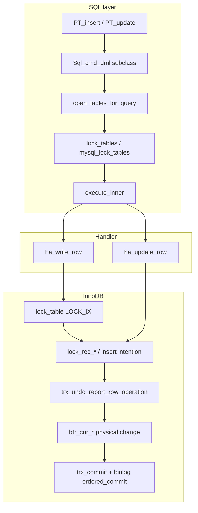
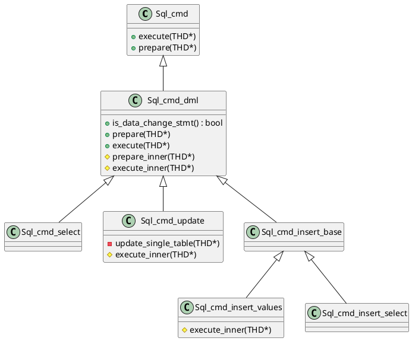
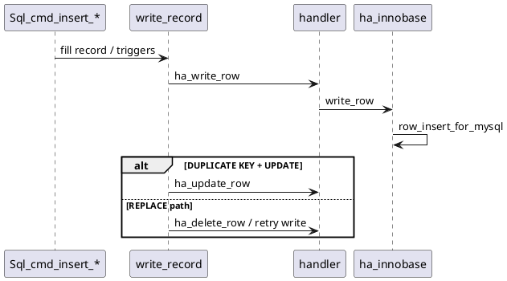
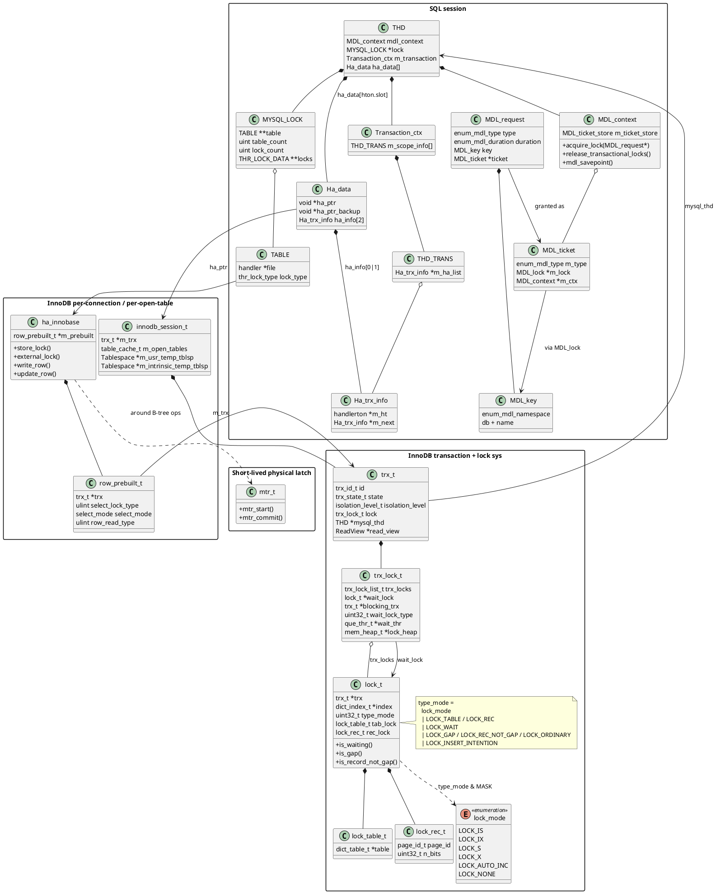
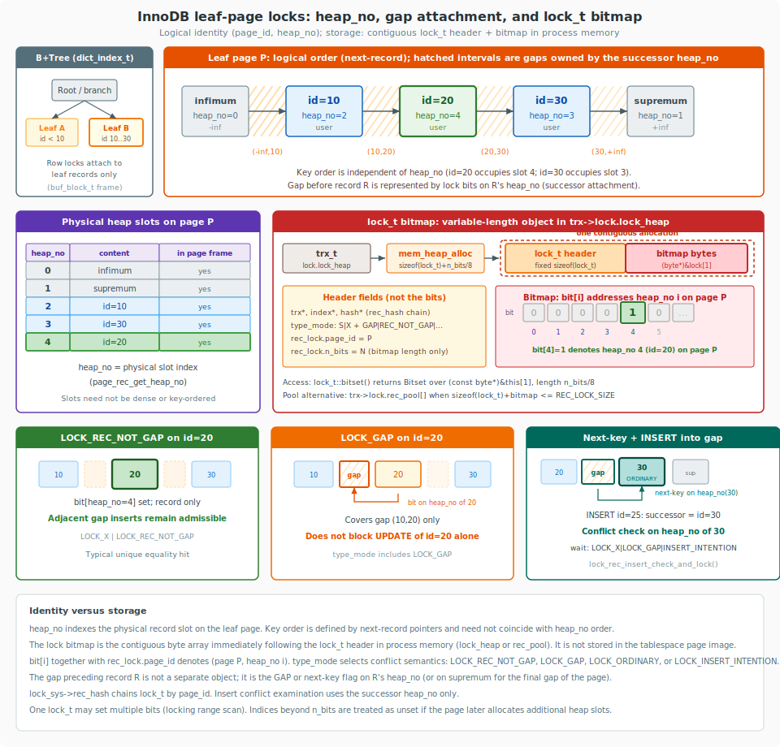
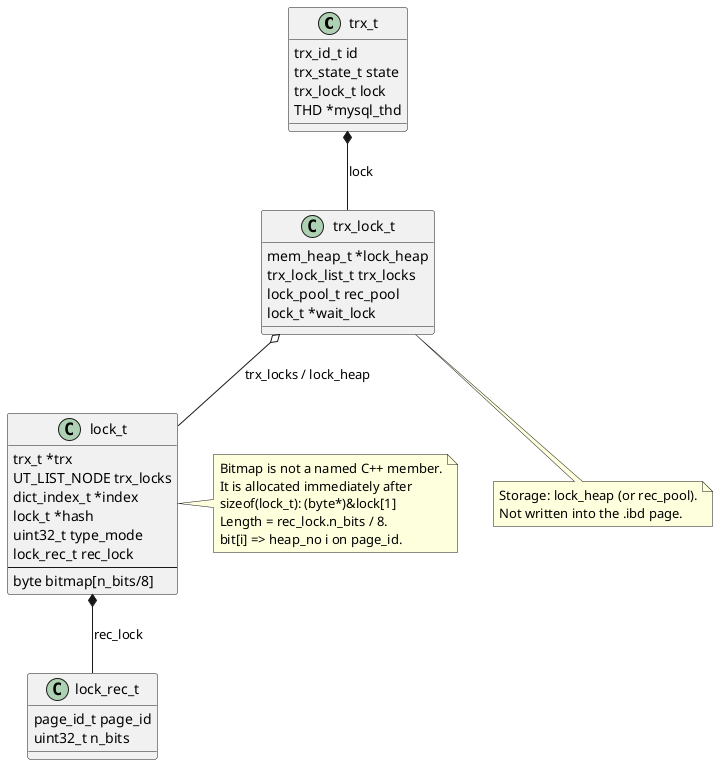
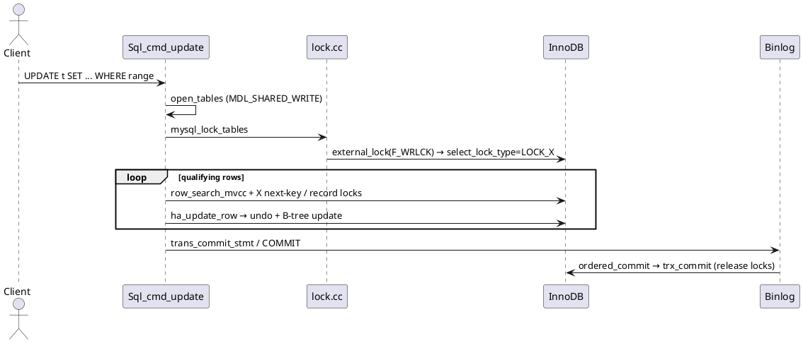
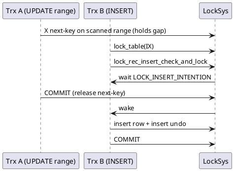

This article examines MySQL **INSERT** and **UPDATE** from the SQL command layer through table and metadata locking into InnoDB record locking, undo generation, and commit, with emphasis on **concurrency control**, **lock modes**, and **transaction boundaries**. It complements [query processing](/post/data/db/mysql/query/) (SELECT pipeline) and [InnoDB storage](/post/data/db/mysql/innodb/) (MVCC, pages, redo/undo layout). Source citations refer to the checked-out `mysql-server` tree.

<!--more-->

# 1. Architecture

A modifying statement follows the same `Sql_cmd_dml` prepare / open / lock / execute skeleton as SELECT, and diverges where rows are written:

1. **SQL layer** — parse to `Sql_cmd_update` / `Sql_cmd_insert_*`, open tables, acquire MDL and `MYSQL_LOCK`, then either a specialized write loop (single-table UPDATE, INSERT VALUES) or an iterator plan that sinks rows into `Query_result_update` / `Query_result_insert`.
2. **Handler boundary** — `ha_write_row` / `ha_update_row` / `ha_delete_row` on `ha_innobase`.
3. **InnoDB** — table intention locks (`LOCK_IX`), record / gap / next-key / insert-intention locks, undo for rollback and MVCC, redo for durability, then group commit with the binary log.



### Key source directories

| Path | Role |
|------|------|
| `sql/sql_cmd_dml.h`, `sql/sql_select.cc` | Shared DML prepare / execute pipeline |
| `sql/sql_update.cc`, `sql/sql_insert.cc` | UPDATE / INSERT command execution |
| `sql/sql_base.cc`, `sql/lock.cc` | Open tables, MDL, `MYSQL_LOCK` |
| `sql/transaction.cc`, `sql/handler.cc`, `sql/binlog.cc` | Statement / session commit and 2PC |
| `storage/innobase/handler/ha_innodb.cc` | Handler writes, `external_lock`, commit hooks |
| `storage/innobase/row/row0ins.cc`, `row0upd.cc`, `row0sel.cc` | Insert / update / locking-read graphs |
| `storage/innobase/lock/lock0lock.cc` | Record, gap, next-key, insert-intention locks |
| `storage/innobase/trx/trx0rec.cc`, `trx0trx.cc` | Undo records and transaction commit |

---

# 2. SQL-layer DML pipeline

## 2.1 Shared `Sql_cmd_dml` path

`Sql_cmd_dml` is the common base class for SELECT and data-changing statements. `is_data_change_stmt()` defaults to `true`; SELECT overrides it to `false`. Preparation and execution proceed as follows:

1. Open tables (`open_tables_for_query`), which also acquires **MDL**.
2. Lock tables (`lock_tables` → `mysql_lock_tables`), invoking THR_LOCK and the engine’s `external_lock`.
3. Invoke `execute_inner()`.



The default `execute_inner()` implements the query-expression path shared by SELECT, **INSERT … SELECT**, and **multi-table UPDATE**:

```text
unit->optimize() → create_iterators() → execute()
```

Single-table UPDATE and INSERT VALUES override `execute_inner()` with specialized write loops that ultimately call the same handler entry points.

## 2.2 UPDATE

`Sql_cmd_update::execute_inner()` selects an execution path according to the number of target tables:

```text
multitable ? Sql_cmd_dml::execute_inner(thd)   // iterators + Query_result_update
           : update_single_table(thd)
```

**Single-table UPDATE** performs a locking read under InnoDB for each qualifying row, then applies:

```text
table->file->ha_update_row(table->record[1], table->record[0])
```

`record[1]` holds the pre-update image; `record[0]` holds the post-SET image.

**Multi-table UPDATE** attaches `Query_result_update` as the sink. That sink does not return rows to the client (`send_data` asserts). Eligible targets are updated immediately, or row identifiers are buffered for deferred update when join order or self-join safety requires it (`UpdateRowsIterator`).

The parser initially marks all listed tables for write locking; `prepare_inner()` may downgrade non-target tables so that concurrent readers of those tables are not excluded unnecessarily.

## 2.3 INSERT

| Class | Execution |
|-------|-----------|
| `Sql_cmd_insert_values` | Specialized `execute_inner()`: iterate value lists → `write_record()` |
| `Sql_cmd_insert_select` | Base `Sql_cmd_dml::execute_inner()`; SELECT delivers rows to `Query_result_insert::send_data()` → `write_record()` |

`write_record()` implements duplicate-key disposition for all INSERT variants:

| Mode | Behavior |
|------|----------|
| Normal INSERT | `ha_write_row()` |
| `ON DUPLICATE KEY UPDATE` | On duplicate-key error: `ha_update_row()` |
| `REPLACE` | Delete then re-insert, or update in place, according to engine return codes |



---

# 3. Concurrency control layers

MySQL applies several locking mechanisms during DML. The mechanisms operate at distinct granularities and must be distinguished: equating them yields incorrect conclusions—for example, that READ COMMITTED eliminates all gap locking. Each mechanism answers a different question: whether DDL may change table metadata, how the storage engine is notified of statement intent, and whether another transaction may modify a given index record or the gap that precedes it.

Unless noted otherwise, the examples below assume InnoDB under the default **REPEATABLE READ** isolation level and the schema:

```sql
CREATE TABLE t (
  id   INT PRIMARY KEY,
  c    INT NOT NULL,
  KEY  idx_c (c)
) ENGINE=InnoDB;

INSERT INTO t VALUES (10, 10), (20, 20), (30, 30);
```

| Layer | Protected resource | Typical acquisition under DML |
|-------|--------------------|-------------------------------|
| **MDL** | Table (and related) metadata against DDL | Target tables: `MDL_SHARED_WRITE`; read-only sources: `MDL_SHARED_READ` |
| **THR_LOCK / `MYSQL_LOCK`** | Server-layer table-lock compatibility among handlers | Write-oriented `thr_lock_type` values; for InnoDB, `lock_count()` is 0, so THR_LOCK is not the row-concurrency mechanism |
| **InnoDB table lock** | Table-level intention prior to record locks | `LOCK_IX` or `LOCK_IS` for DML and locking reads |
| **InnoDB record locks** | Index records and intervening gaps | `LOCK_S` / `LOCK_X` combined with `LOCK_REC_NOT_GAP`, `LOCK_GAP`, `LOCK_ORDINARY`, or `LOCK_INSERT_INTENTION` |
| **Page latches / mtr** | Physical B-tree page mutation | Short-duration latches; not transactional locks |

### Data Structure

The structures below attach either to the SQL session (`THD`) or to the InnoDB transaction (`trx_t`). Edges in the diagram denote ownership or association; they do not depict call order.



#### How `THD` maintains InnoDB session and transaction state

A connection’s InnoDB state is not stored on `TABLE` and is not a process-global singleton. It is maintained through **two complementary associations** on `THD`:

1. **Engine-private session object** — `THD::ha_data[innodb_hton->slot].ha_ptr` references an `innodb_session_t`, which owns the session’s `trx_t *m_trx`.
2. **SQL transaction coordinator lists** — `THD::m_transaction` (`Transaction_ctx`) records which storage engines participate in the **statement** and **session** scopes, so that `COMMIT` / `ROLLBACK` / 2PC can invoke each registered `handlerton`.

```text
THD
├── ha_data[innodb_slot].ha_ptr ──► innodb_session_t
│                                      └── m_trx ──► trx_t ──► mysql_thd ──► THD
│                                      └── m_open_tables / temp tablespaces …
├── ha_data[innodb_slot].ha_info[0]   // statement-scope Ha_trx_info (via register)
├── ha_data[innodb_slot].ha_info[1]   // transaction-scope Ha_trx_info
└── m_transaction (Transaction_ctx)
     ├── THD_TRANS[statement].m_ha_list  ──► Ha_trx_info … (engines in this stmt)
     └── THD_TRANS[session].m_ha_list    ──► Ha_trx_info … (engines in this trx)
```

**Slot lookup.** Each `handlerton` has a stable `slot`. `thd_ha_data(thd, innodb_hton)` returns `&thd->ha_data[slot].ha_ptr`. InnoDB casts that pointer to `innodb_session_t **`:

```cpp
// storage/innobase/handler/ha_innodb.cc
innodb_session_t *&thd_to_innodb_session(THD *thd) {
  innodb_session_t *&innodb_session =
      *(innodb_session_t **)thd_ha_data(thd, innodb_hton_ptr);
  if (innodb_session != nullptr)
    return innodb_session;
  innodb_session = ut::new_withkey<innodb_session_t>(...);
  return innodb_session;
}

trx_t *&thd_to_trx(THD *thd) {
  return thd_to_innodb_session(thd)->m_trx;
}
```

**Deferred `trx_t` allocation.** The first InnoDB operation on a connection invokes `check_trx_exists(thd)`, which resolves `thd_to_trx(thd)` and, if the pointer is null, allocates a transaction via `innobase_trx_allocate(thd)` (`trx_allocate_for_mysql()`, assigns `trx->mysql_thd = thd`, and initialises isolation and read-only flags). Later `store_lock`, `external_lock`, and DML paths reuse that `trx_t` for the connection (unless XA detach/reattach replaces it).

```cpp
trx_t *check_trx_exists(THD *thd) {
  trx_t *&trx = thd_to_trx(thd);
  if (trx == nullptr) {
    trx = innobase_trx_allocate(thd);
  } else {
    innobase_trx_init(thd, trx);
  }
  return trx;
}
```

**Binding open-table handlers to that `trx_t`.** Each `TABLE::file` (`ha_innobase`) holds a private `row_prebuilt_t`. `external_lock()` / `update_thd()` assign `m_prebuilt->trx` to the session’s `thd_to_trx(thd)`. Consequently, multiple open handlers in one statement share a single `trx_t`, while each retains its own `select_lock_type` and cursor state.

**SQL-layer registration (`innobase_register_trx`).** Possession of a `trx_t` alone does not enroll the engine in server-side commit. During `external_lock` / `start_stmt`, InnoDB invokes:

```cpp
void innobase_register_trx(handlerton *hton, THD *thd, trx_t *trx) {
  trans_register_ha(thd, /*all=*/false, hton, &trx_id);  // statement list
  if (!trx_is_registered_for_2pc(trx) &&
      thd_test_options(thd, OPTION_NOT_AUTOCOMMIT | OPTION_BEGIN)) {
    trans_register_ha(thd, /*all=*/true, hton, &trx_id);   // session list
  }
  trx_register_for_2pc(trx);
}
```

`trans_register_ha` inserts or reuses the corresponding `Ha_trx_info` in `Transaction_ctx`’s statement and/or all-transaction `m_ha_list`. `ha_commit_trans` / `ha_rollback_trans` subsequently traverse those lists. `Ha_data::ha_info[0]` spans one statement (or the entire transaction under autocommit); `ha_info[1]` spans one explicit transaction.

| Object | Lifetime | Role |
|--------|----------|------|
| `innodb_session_t` in `ha_data[].ha_ptr` | Connection | InnoDB-private session cache; holds `m_trx` |
| `trx_t` (`m_trx`) | Until free / XA detach | InnoDB transaction id, locks, undo, read view |
| `row_prebuilt_t` on `ha_innobase` | Open `TABLE` instance | Per-table cursor + locking-read mode; points at shared `trx_t` |
| `Ha_trx_info` on statement/session lists | Stmt / trx | SQL coordinator membership for commit/rollback/2PC |

**Per-connection isolation.** Each `THD` owns a distinct `ha_data` array and therefore a distinct `innodb_session_t` / `trx_t`. Handlers for different tables within one connection share that session’s `trx_t`; they do not share `innodb_session_t` with another connection.

Correspondence of layers to types:

| Layer | Primary types |
|-------|----------------|
| InnoDB session / trx on `THD` | `ha_data[slot].ha_ptr` → `innodb_session_t` → `trx_t`; `Transaction_ctx` / `Ha_trx_info` for commit coordination |
| MDL | `THD::mdl_context` → `MDL_request` / `MDL_ticket` / `MDL_key` |
| SQL table-lock handshake | `THD::lock` (`MYSQL_LOCK`) → `TABLE` → `ha_innobase::{store,external}_lock` |
| Statement locking-read mode | `row_prebuilt_t::select_lock_type` (`LOCK_NONE` / `LOCK_S` / `LOCK_X`) |
| InnoDB transactional locks | `trx_t::lock` (`trx_lock_t`) owns `trx_locks`; wait state in `wait_lock` / `blocking_trx` |
| Table versus record | `lock_t` discriminant: `lock_table_t` (e.g. IS/IX) or `lock_rec_t` (page identifier and bit map) |
| Page latch | `mtr_t` — not linked into `trx_locks` |

---

## 3.1 Metadata locks (MDL)

**Mechanism.** A metadata lock is a server-wide lock on a dictionary object, identified by `MDL_key` and held in `THD::mdl_context`. Lock modes are defined in `sql/mdl.h`. For DML, the requested mode is derived from the SQL-layer table lock type:

```cpp
// sql/table.h — mdl_type_for_dml()
inline enum enum_mdl_type mdl_type_for_dml(enum thr_lock_type lock_type) {
  return lock_type >= TL_WRITE_ALLOW_WRITE
             ? (lock_type == TL_WRITE_LOW_PRIORITY ? MDL_SHARED_WRITE_LOW_PRIO
                                                   : MDL_SHARED_WRITE)
             : MDL_SHARED_READ;
}
```

Acquisition is coupled to table opening. `open_tables_for_query()` establishes a DML prelocking strategy and records an MDL savepoint so that a failed open releases only tickets acquired during that attempt:

```cpp
// sql/sql_base.cc — open_tables_for_query()
bool open_tables_for_query(THD *thd, Table_ref *tables, uint flags) {
  DML_prelocking_strategy prelocking_strategy;
  MDL_savepoint mdl_savepoint = thd->mdl_context.mdl_savepoint();
  if (open_tables(thd, &tables, &thd->lex->table_count, flags,
                  &prelocking_strategy))
    goto end;
  // ...
}
```

Within `open_tables()`, each `Table_ref` carries an `MDL_request`. The context grants the request through `thd->mdl_context.acquire_lock()` or `acquire_locks()`. Compatible shared modes permit concurrent DML on the same table. Exclusive modes required by DDL wait until all conflicting shared holders have released their tickets.

**Scope.** MDL does not serialize concurrent `UPDATE` (or other DML) statements that modify distinct rows. Row-level mutual exclusion is the responsibility of InnoDB.

**Example — DML precludes DDL, not concurrent DML:**

```sql
-- Session A
BEGIN;
UPDATE t SET c = c + 1 WHERE id = 10;   -- holds MDL_SHARED_WRITE on t
-- do not COMMIT yet

-- Session B (concurrent DML: proceeds)
UPDATE t SET c = c + 1 WHERE id = 20;   -- also MDL_SHARED_WRITE
COMMIT;

-- Session C (DDL: waits)
ALTER TABLE t ADD COLUMN d INT;         -- exclusive MDL; blocked until A commits
```

**Example — non-locking SELECT versus DDL:**

```sql
-- Session A
BEGIN;
SELECT * FROM t WHERE id = 10;          -- MDL_SHARED_READ
-- Session B
DROP TABLE t;                           -- waits until A's MDL is released
```

Pending metadata locks may be observed through `performance_schema.metadata_locks` or `sys.schema_table_lock_waits`.

---

## 3.2 THR_LOCK / `MYSQL_LOCK` and InnoDB `store_lock` / `external_lock`

**Mechanism.** After tables have been opened, `lock_tables()` constructs a `MYSQL_LOCK` and invokes `mysql_lock_tables()`. For engines that participate in `THR_LOCK`, this path acquires table-level read/write exclusion. InnoDB does not: `ha_innobase::lock_count()` returns **0**, so `thr_multi_lock()` receives an empty lock array. The SQL layer nonetheless invokes InnoDB’s `store_lock()`, `external_lock()`, and (under `LOCK TABLES`) `start_stmt()`. Those three entry points convey **statement intent** and **statement boundaries** to InnoDB; they do not serialize row access.

```cpp
// sql/lock.cc — mysql_lock_tables() (structure)
if (!(sql_lock = get_lock_data(thd, tables, count, GET_LOCK_STORE_LOCKS)))
  return nullptr;
// get_lock_data → handler::store_lock() per TABLE

if (sql_lock->table_count &&
    lock_external(thd, sql_lock->table, sql_lock->table_count)) {
  // → handler::external_lock(thd, F_RDLCK | F_WRLCK) per TABLE
  reset_lock_data_and_free(&sql_lock);
  goto end;
}

rc = thr_lock_errno_to_mysql[(int)thr_multi_lock(
    sql_lock->locks + sql_lock->lock_count, sql_lock->lock_count,
    &thd->lock_info, timeout)];
// For InnoDB, lock_count == 0 → thr_multi_lock is a no-op
```

```text
lock_tables()
  → mysql_lock_tables()
      → get_lock_data(..., GET_LOCK_STORE_LOCKS)
            → ha_innobase::store_lock(thd, to, thr_lock_type)   // phase 1: intent
      → lock_external()
            → ha_innobase::external_lock(thd, F_RDLCK|F_WRLCK) // phase 2: start stmt
      → thr_multi_lock()   // empty for InnoDB
...
unlock / statement end
  → ha_innobase::external_lock(thd, F_UNLCK)                   // phase 3: end stmt
```

The handler documentation states the design explicitly: InnoDB relies on **MDL** (DDL / `LOCK TABLES`) together with its own **record/table lock subsystem**; `store_lock` / `external_lock` / `start_stmt` remain solely as the SQL↔engine control channel.

### Phase 1 — `store_lock()`: declare locking-read intent

`store_lock()` is invoked once per table while `MYSQL_LOCK` is assembled. Because `lock_count()` is 0, the returned `THR_LOCK_DATA **` is unused for queuing. The function’s effect is to initialise or adjust `row_prebuilt_t` fields that later govern `row_search_mvcc()`:

1. **Ensure a `trx_t` exists** (`check_trx_exists(thd)`). Note that `m_prebuilt->trx` may not yet equal this `trx`; `external_lock()` later calls `update_thd()` to bind them.
2. **On the first table of a statement** (`n_mysql_tables_in_use == 0`), copy the session isolation level into `trx->isolation_level`. At READ COMMITTED / READ UNCOMMITTED, an active consistent-read view is closed so the next read can open a fresh snapshot.
3. **Map `thr_lock_type` (+ SQL command) onto a preliminary `select_lock_type`**, stored in both `m_prebuilt->select_lock_type` and `m_stored_select_lock_type`.
4. **Record `SELECT … FOR UPDATE/SHARE` wait policy** (`SELECT_ORDINARY` / `SELECT_SKIP_LOCKED` / `SELECT_NOWAIT`) from the table-list lock descriptor.
5. **Increment `trx->will_lock`** when a locking read is anticipated, so the transaction is not classified as a non-locking autocommit select.

The preliminary lock-mode decision (simplified from the source) is:

| Condition | Preliminary `select_lock_type` |
|-----------|--------------------------------|
| Plain `SELECT` (`TL_READ`, not under `LOCK TABLES`) | `LOCK_NONE` |
| `SELECT … FOR SHARE` / `TL_READ_WITH_SHARED_LOCKS`, or non-SELECT DML at this stage | `LOCK_S` (may later strengthen to `LOCK_X`) |
| `INSERT…SELECT` / `UPDATE…(SELECT…)` / `CREATE…SELECT` under RC/RU **without** `FOR UPDATE`/`FOR SHARE` | `LOCK_NONE` (consistent read of the source) |
| `SELECT … FOR UPDATE` (still `TL_WRITE*` at `store_lock` time) | left as `LOCK_NONE` here; **`external_lock(F_WRLCK)` raises it to `LOCK_X`** |

```cpp
// storage/innobase/handler/ha_innodb.cc — store_lock() (core branches)
if (lock_type != TL_IGNORE && trx->n_mysql_tables_in_use == 0) {
  trx->isolation_level =
      innobase_trx_map_isolation_level(thd_get_trx_isolation(thd));
  // RC/RU: close active read_view so the next consistent read gets a new snapshot
}

if (/* FOR SHARE, LOCK TABLES READ, or non-SELECT … */) {
  if (/* RC/RU source SELECT inside INSERT/UPDATE/CREATE SELECT */) {
    m_prebuilt->select_lock_type = LOCK_NONE;
  } else {
    m_prebuilt->select_lock_type = LOCK_S;   // may strengthen later
  }
  m_stored_select_lock_type = m_prebuilt->select_lock_type;
} else if (lock_type != TL_IGNORE) {
  /* SELECT … FOR UPDATE: LOCK_X is deferred to external_lock */
  m_prebuilt->select_lock_type = LOCK_NONE;
  m_stored_select_lock_type = LOCK_NONE;
}
```

Thus `store_lock` answers: *will this table’s scans be consistent reads, shared locking reads, or (pending) exclusive locking reads?* It does not yet place InnoDB locks.

### Phase 2 — `external_lock(F_RDLCK|F_WRLCK)`: start the statement on this table

`lock_external()` then calls `external_lock` once per table with POSIX-style `F_RDLCK` (read) or `F_WRLCK` (write). This is the statement-entry barrier:

1. **`update_thd(thd)`** binds `m_prebuilt->trx` to the current session transaction.
2. **Reset statement-local cursor state** (`sql_stat_start = true`, clear fetch template).
3. **Strengthen lock mode for write intent:**

```cpp
// ha_innodb.cc — external_lock()
if (lock_type == F_WRLCK) {
  /* UPDATE / DELETE / SELECT … FOR UPDATE / write side of DML */
  m_prebuilt->select_lock_type = LOCK_X;
  m_stored_select_lock_type = LOCK_X;
}
```

4. **For `F_RDLCK`**, retain the value established by `store_lock`, subject to SERIALIZABLE (plain `SELECT` in an explicit transaction becomes `LOCK_S`) and special cases for data-dictionary / ACL tables (`LOCK_NONE` when `no_read_locking` is set).
5. **`innobase_register_trx`** links InnoDB into `Transaction_ctx` / `Ha_trx_info` so commit and rollback include this engine.
6. Optionally take a true InnoDB **table** lock for `LOCK TABLES` when `innodb_table_locks` is enabled and autocommit is off (`row_lock_table`).
7. Increment **`trx->n_mysql_tables_in_use`**, set `m_mysql_has_locked`, possibly increment `will_lock`, and call **`TrxInInnoDB::begin_stmt(trx)`** — establishing the statement savepoint used for statement-level rollback.

The resulting locking-read matrix (from the handler’s own documentation) is:

| Statement class | Isolation &lt; SERIALIZABLE | SERIALIZABLE (explicit trx) |
|-----------------|----------------------------|-----------------------------|
| Non-locking `SELECT` | `LOCK_NONE` | `LOCK_S` |
| `SELECT … FOR SHARE` | `LOCK_S` | `LOCK_S` |
| `SELECT … FOR UPDATE` / DML write path | `LOCK_X` | `LOCK_X` |

`LOCK_NONE` denotes a consistent read via `ReadView`. `LOCK_S` / `LOCK_X` cause `row_search_mvcc()` to invoke `sel_set_rec_lock` before returning a row. Therefore the **search phase** of `UPDATE` already takes exclusive record locks before `ha_update_row()` runs.

### Phase 3 — `external_lock(F_UNLCK)`: end the statement on this table

When the SQL layer releases table locks, it calls `external_lock(F_UNLCK)` per table:

1. **`TrxInInnoDB::end_stmt(trx)`** closes the statement scope.
2. Decrement **`n_mysql_tables_in_use`**.
3. When the count reaches **0**, the current SQL statement has finished using all InnoDB tables. Under autocommit (no open `BEGIN`), InnoDB may then **`innobase_commit`** the transaction; under an explicit transaction, locks and undo remain until `COMMIT` / `ROLLBACK`.

### `start_stmt()` — the `LOCK TABLES` exception

Under `LOCK TABLES`, MySQL may retain tables locked across statements and invoke **`start_stmt()`** instead of a full `external_lock` acquire for a subsequent statement on an already-locked handle. `start_stmt()` restores `select_lock_type` from `m_stored_select_lock_type`, re-registers the transaction, and begins a new statement savepoint. Temporary tables created inside `LOCK TABLES` (where `external_lock` was not previously invoked) force `LOCK_X` so that subsequent updates remain correctly configured.

### Division of labour

| Call | Timing | Effect on InnoDB concurrency |
|------|--------|------------------------------|
| `store_lock(thr_lock_type)` | Building `MYSQL_LOCK` | Sets isolation; proposes `select_lock_type` / `select_mode`; bumps `will_lock` |
| `external_lock(F_WRLCK\|F_RDLCK)` | After store, before execution | Binds `trx`; may raise mode to `LOCK_X`; registers engine; `begin_stmt`; counts tables in use |
| `external_lock(F_UNLCK)` | Unlock / statement end | `end_stmt`; last table may autocommit |
| `start_stmt` | Next stmt under `LOCK TABLES` | Restores stored mode; new statement savepoint |
| `row_search_mvcc` / `lock_rec_*` | During execution | Places actual record / gap / next-key locks |

`store_lock` / `external_lock` therefore configure **how** subsequent scans request locks; they do not themselves enqueue `lock_t` objects on index records.

**Example — identical handshake, distinct InnoDB lock modes:**

```sql
-- store_lock(TL_READ) → LOCK_NONE; external_lock(F_RDLCK) retains NONE
SELECT * FROM t WHERE id = 10;

-- store_lock(TL_READ_WITH_SHARED_LOCKS) → LOCK_S; external_lock(F_RDLCK) retains S
SELECT * FROM t WHERE id = 10 FOR SHARE;

-- store_lock(TL_WRITE*) → provisional NONE; external_lock(F_WRLCK) → LOCK_X
SELECT * FROM t WHERE id = 10 FOR UPDATE;
UPDATE t SET c = 11 WHERE id = 10;
```

**Example — RC source select inside `INSERT … SELECT`:**

```sql
SET TRANSACTION ISOLATION LEVEL READ COMMITTED;
INSERT INTO t SELECT * FROM src WHERE …;
-- store_lock on src: LOCK_NONE (consistent read of the source)
-- store_lock / external_lock on t: write path → LOCK_X for the insert target
```

**Example — explicit table locks:**

```sql
LOCK TABLES t WRITE;     -- MDL + optional InnoDB table lock; subsequent stmts use start_stmt
UPDATE t SET c = 1 WHERE id = 10;
UNLOCK TABLES;           -- external_lock(F_UNLCK) releases statement/table state
```

Under ordinary transactional DML, InnoDB record locks (§3.3–3.4) provide concurrency control; `LOCK TABLES` is a coarser SQL-layer alternative.

---

## 3.3 InnoDB table intention locks (`LOCK_IS` / `LOCK_IX`)

**Mechanism.** Before any record lock is granted, InnoDB acquires a table-level intention lock so that full-table `LOCK_S` / `LOCK_X` remain compatible with fine-grained record locking. The mode occupies the low-order bits of `lock_t::type_mode`:

```cpp
// storage/innobase/include/lock0types.h
enum lock_mode {
  LOCK_IS = 0,   /* intention shared */
  LOCK_IX,       /* intention exclusive */
  LOCK_S,        /* shared */
  LOCK_X,        /* exclusive */
  LOCK_AUTO_INC,
  LOCK_NONE,     /* consistent read — not a lock */
  // ...
};
```

```cpp
// storage/innobase/include/lock0lock.h
dberr_t lock_table(ulint flags, dict_table_t *table,
                   lock_mode mode, que_thr_t *thr);
```

| Mode | Interpretation | Typical acquisition |
|------|----------------|---------------------|
| `LOCK_IS` | Intention to place shared record locks | `SELECT … FOR SHARE`; certain foreign-key checks |
| `LOCK_IX` | Intention to place exclusive record locks | `UPDATE` / `DELETE` / `INSERT` / `SELECT … FOR UPDATE` |
| `LOCK_S` / `LOCK_X` | Full-table shared / exclusive | Uncommon for ordinary DML; appears on some `LOCK TABLES` paths |

The insert execution graph acquires `LOCK_IX` when the statement first references the table:

```cpp
// storage/innobase/row/row0ins.cc — row_ins()
if (node->state == INS_NODE_SET_IX_LOCK) {
  node->state = INS_NODE_ALLOC_ROW_ID;
  if (trx->id == node->trx_id) {
    goto same_trx;   // already IX-locked in this trx
  }
  err = lock_table(0, node->table, LOCK_IX, thr);
  // ...
  node->trx_id = trx->id;
}
```

Record-lock helpers require that the corresponding intention already be held (`LOCK_X` implies `LOCK_IX`; `LOCK_S` implies `LOCK_IS`):

```cpp
// storage/innobase/lock/lock0lock.cc — lock_clust_rec_read_check_and_lock()
ut_ad(mode != LOCK_X ||
      lock_table_has(thr_get_trx(thr), index->table, LOCK_IX));
ut_ad(mode != LOCK_S ||
      lock_table_has(thr_get_trx(thr), index->table, LOCK_IS));

err = lock_rec_lock(false, sel_mode, mode | gap_mode, block, heap_no, index, thr);
```

Intention locks are mutually compatible (`LOCK_IS` coexists with `LOCK_IX`). They conflict with opposing full-table locks.

**Example:**

```sql
-- Session A
BEGIN;
UPDATE t SET c = 11 WHERE id = 10;   -- table IX + record X on id = 10

-- Session B
BEGIN;
UPDATE t SET c = 21 WHERE id = 20;   -- table IX compatible; distinct row X succeeds
COMMIT;

-- Session C
BEGIN;
SELECT * FROM t WHERE id = 10 FOR SHARE;  -- table IS; waits while A holds X on id = 10
```

Table intention locks appear as `LOCK_TABLE` entries with mode `IX` or `IS` in `SHOW ENGINE INNODB STATUS` and `performance_schema.data_locks`.

---

## 3.4 InnoDB record lock modes

A record lock is attached to an **index record** (clustered or secondary), not to an abstract SQL-row identity. Its effective mode is the composition of:

- **Strength:** `LOCK_S` or `LOCK_X` (low nibble under `LOCK_MODE_MASK`);
- **Gap coverage:** precise-mode bits ORed into `type_mode`;
- **Insert waiting:** `LOCK_INSERT_INTENTION` when an insert must wait on a protected gap.

```cpp
// storage/innobase/include/lock0lock.h — precise modes
constexpr uint32_t LOCK_WAIT = 256;
constexpr uint32_t LOCK_ORDINARY = 0;          // next-key: record + preceding gap
constexpr uint32_t LOCK_GAP = 512;             // gap only
constexpr uint32_t LOCK_REC_NOT_GAP = 1024;    // record only
constexpr uint32_t LOCK_INSERT_INTENTION = 2048;
```

Locking reads encode strength and gap coverage in a single `lock_rec_lock` invocation:

```cpp
// lock0lock.cc — lock_clust_rec_read_check_and_lock()
err = lock_rec_lock(false, sel_mode, mode | gap_mode, block, heap_no, index, thr);
// e.g. LOCK_X | LOCK_ORDINARY, LOCK_X | LOCK_REC_NOT_GAP, LOCK_S | LOCK_GAP, ...
```

For a locking index scan, `row_search_mvcc()` selects the gap mode from the cursor’s relation to the search range:

```cpp
// storage/innobase/row/row0sel.cc
if (prebuilt->select_lock_type != LOCK_NONE) {
  auto rel = row_compare_row_to_range(...);
  ulint lock_type;
  if (rel.row_can_be_in_range) {
    lock_type = rel.gap_can_intersect_range ? LOCK_ORDINARY
                                            : LOCK_REC_NOT_GAP;
  } else {
    lock_type = rel.gap_can_intersect_range ? LOCK_GAP
                                            : /* not found */;
  }
  err = sel_set_rec_lock(..., prebuilt->select_lock_type, lock_type, ...);
}
```

### Index B-tree page layout and lock attachment

Record and gap locks are not represented as key intervals `(low_key, high_key)`. Each explicit lock request addresses a leaf-page record slot by the triple `(space_id, page_no, heap_no)`, with conflict semantics encoded in `lock_t::type_mode`. The attachment therefore depends on the index leaf-page layout.



#### From `dict_index_t` to a leaf page

A clustered or secondary index (`dict_index_t`) is organized as a B+tree. Concurrent DML resolves row identity, uniqueness checks, and gap protection on **leaf** pages. A leaf page cached in the buffer pool is a `buf_block_t` whose frame contains the page header together with the linked sequence of index records.

#### Records on one leaf page

Every leaf page allocates two system records at fixed heap numbers, followed by user records:

| Slot | `heap_no` | Role |
|------|-----------|------|
| Infimum | `PAGE_HEAP_NO_INFIMUM` (0) | Pseudo-record denoting −∞; first in the page’s logical order |
| Supremum | `PAGE_HEAP_NO_SUPREMUM` (1) | Pseudo-record denoting +∞; last in logical order; receives locks that cover the final gap after the last user record |
| User records | ≥ 2 | Index entries; `heap_no` identifies the physical heap slot, not the SQL key value |

**Definition of `heap_no`.** `heap_no` is the index of a record within the page’s physical record heap (`page_rec_get_heap_no`). Infimum and supremum occupy `0` and `1` permanently. User records receive successive free heap slots at insertion time. Deletions may leave unused slots; consequently heap numbers need not form a dense sequence and are not ordered by key value.

Logical order on the page is defined by **next-record pointers**, independent of `heap_no` numeric order:

```text
infimum → [id=10, heap_no=2] → [id=20, heap_no=4] → [id=30, heap_no=3] → supremum
              ↑                      ↑                      ↑
         gap locks attach to the successor record’s heap_no (see diagram)
```

A single leaf page therefore admits two distinct orderings: key order, used by range predicates and cursor scans; and `heap_no` order, used by lock-sys as a stable slot address within `(space_id, page_no)`.

#### How `lock_t` encodes a record or gap on that page

Explicit record-lock state is not stored in the leaf-page frame. The page contains only the index records (and thereby their `heap_no` slots). Each granted or waiting record lock is an in-memory `lock_t` owned by the transaction:



```cpp
// storage/innobase/include/lock0priv.h
struct lock_rec_t {
  page_id_t page_id;   // leaf page addressed by this bitmap
  uint32_t n_bits;     // bitmap length in bits (multiple of 8)
  // NOTE: the lock bitmap is placed immediately after the lock struct
};
// lock_t::type_mode = LOCK_S|LOCK_X | LOCK_GAP|LOCK_REC_NOT_GAP|LOCK_ORDINARY | ...
```

**Storage.** A record `lock_t` is variable-length: fixed header + `n_bits / 8` trailing bitmap bytes (`sizeof(lock_t) + bitmap_bytes` from `trx->lock.lock_heap`, or a `rec_pool` slot). Access: `(const byte *)&lock[1]` via `lock_t::bitset()`. `rec_lock.n_bits` is length only; bit *i* denotes `heap_no == i` on `rec_lock.page_id`. The object is hashed into `lock_sys->rec_hash` via `lock_t::hash`. It is never persisted in the tablespace page image.

| Mode bits on `heap_no` of record R | Coverage |
|------------------------------------|----------|
| `LOCK_REC_NOT_GAP` | Index record R only |
| `LOCK_GAP` | Open gap preceding R (between the predecessor and R) |
| `LOCK_ORDINARY` (next-key) | R together with the gap preceding R |
| `LOCK_GAP \| LOCK_INSERT_INTENTION` | Waiting request to insert into the gap preceding R |

There is no separate gap object in lock-sys: **the gap preceding R is represented by lock bits on R’s `heap_no`** (or on supremum for the final gap of the page).

#### Insert: locating the gap by the successor

An insert between two leaf records obtains the physical neighbors from the B-tree search. Gap conflict is evaluated exclusively against the **successor** record:

```cpp
// lock0lock.cc — lock_rec_insert_check_and_lock()
const rec_t *next_rec = page_rec_get_next_const(rec);  // right neighbor / supremum
ulint heap_no = page_rec_get_heap_no(next_rec);

const ulint type_mode = LOCK_X | LOCK_GAP | LOCK_INSERT_INTENTION;
auto conflicting =
    lock_rec_other_has_conflicting(type_mode, block, heap_no, trx);
```

```text
insert key 25 between id=20 and id=30
  → predecessor = record id=20
  → successor   = record id=30   (next_rec)
  → examine locks whose bitmap has heap_no(id=30) set on this page_id
  → if another transaction holds GAP or next-key there → wait (insert intention)
```

Modification of an **existing** index entry addresses that entry’s own `heap_no` (`lock_clust_rec_modify_check_and_lock`, or a locking scan positioned on the cursor record). Gap locks on neighboring records alone do not conflict with that update unless a next-key lock also covers the modified record.

#### Relation to the modes below

Subsections 3.4.1–3.4.4 instantiate the same storage mechanism with distinct `type_mode` bits on a common `(page_id, heap_no)` identity:

| Subsection | Typical attachment |
|------------|--------------------|
| `LOCK_REC_NOT_GAP` | bit on the matched user `heap_no` only |
| `LOCK_GAP` | bit on the boundary / next / supremum `heap_no`, with the gap flag set |
| `LOCK_ORDINARY` | bit on the scanned `heap_no`, covering the record and the preceding gap |
| `LOCK_INSERT_INTENTION` | waiting bit on the **successor** `heap_no` of the insert position |

### 3.4.1 Record lock only — `LOCK_REC_NOT_GAP`


**Mechanism.** The lock covers the index record and excludes the preceding gap. Concurrent inserts into adjacent gaps remain admissible. InnoDB employs this mode when the conflict domain is confined to a single existing record—typically a unique equality lookup that locates a non-deleted row (`row_can_be_in_range && !gap_can_intersect_range` in the decision above).

The clustered-index modify path reasserts record-only exclusive locking immediately before undo generation:

```cpp
// storage/innobase/lock/lock0lock.cc — lock_clust_rec_modify_check_and_lock()
lock_rec_convert_impl_to_expl(block, rec, index, offsets);
{
  locksys::Shard_latch_guard guard{UT_LOCATION_HERE, block->get_page_id()};
  ut_ad(lock_table_has(thr_get_trx(thr), index->table, LOCK_IX));
  err = lock_rec_lock(true, SELECT_ORDINARY, LOCK_X | LOCK_REC_NOT_GAP,
                      block, heap_no, index, thr);
}
```

**Example — unique primary-key locking read:**

```sql
-- Session A (RR)
BEGIN;
SELECT * FROM t WHERE id = 20 FOR UPDATE;
-- InnoDB: LOCK_X | LOCK_REC_NOT_GAP on clustered record id = 20
-- (unique equality hit; adjacent gaps (10,20) and (20,30) are not locked)

-- Session B: blocked on the same record
UPDATE t SET c = 99 WHERE id = 20;          -- waits

-- Session C: insert into a neighboring gap remains admissible
INSERT INTO t VALUES (25, 25);                 -- succeeds while A holds id = 20
COMMIT;
```

### 3.4.2 Gap lock — `LOCK_GAP`

**Mechanism.** The lock covers only the open interval preceding an index record (or the supremum gap). It does not lock the boundary record. Its purpose is to prevent phantom inserts into that interval, not to exclude updates of the existing boundary row.

Under REPEATABLE READ, gap locks arise when `!row_can_be_in_range && gap_can_intersect_range` in the scan decision above, and during uniqueness probes on the first unequal (“next”) record:

```cpp
// storage/innobase/row/row0ins.cc — duplicate-key scan (plain INSERT)
} else if (is_next) {
  /* Only gap lock is required on next record. */
  lock_type = LOCK_GAP;
} else {
  /* Next key lock for all equal keys. */
  lock_type = LOCK_ORDINARY;
}
err = row_ins_set_rec_lock(LOCK_S, lock_type, block, rec, index, offsets, thr);
```

Under READ COMMITTED, `trx_t::skip_gap_locks()` is true and ordinary `UPDATE` scans omit most gap locks. Duplicate-key and foreign-key paths may still request them; when `skip_gap_locks` is set, the same routine forces `LOCK_REC_NOT_GAP` where a gap would otherwise be taken.

**Example — range-boundary gaps under REPEATABLE READ:**

```sql
-- Session A (RR)
BEGIN;
SELECT * FROM t WHERE id > 20 FOR UPDATE;
-- Acquires next-key / gap locks along (20, 30] and (30, +inf) as the scan proceeds;
-- inserts with id in (20, +inf) must wait.

-- Session B
INSERT INTO t VALUES (25, 25);   -- waits (gap within the locked range)
INSERT INTO t VALUES (15, 15);   -- succeeds (outside the locked gaps)

-- Session C: a pure gap does not, by itself, block updates of an uncovered record
UPDATE t SET c = 10 WHERE id = 10;  -- succeeds
```

A `LOCK_GAP` attached at `id = 30` precludes `INSERT … (25)` yet does not, by itself, preclude `UPDATE … WHERE id = 30`. Next-key locking (§3.4.3) combines both effects.

### 3.4.3 Next-key lock — `LOCK_ORDINARY`

**Mechanism.** A next-key lock covers the index record together with its preceding gap (`LOCK_S` or `LOCK_X` with precise mode `LOCK_ORDINARY == 0`). Under REPEATABLE READ it is the principal instrument against phantoms on locking range scans: neither an update of the matched record nor an insert into the preceding gap may proceed concurrently.

`row_search_mvcc()` selects `LOCK_ORDINARY` when both `row_can_be_in_range` and `gap_can_intersect_range` hold, and passes that value as `gap_mode` to `lock_rec_lock(mode | LOCK_ORDINARY)`.

**Example — range `UPDATE` under REPEATABLE READ:**

```sql
-- Session A (RR)
BEGIN;
UPDATE t SET c = c + 1 WHERE id BETWEEN 10 AND 20;
-- Next-key exclusive locks on scanned index positions covering the range
-- (attachment depends on the access path; a primary-key range scan
-- typically acquires next-key locks at successive leaf records).

-- Session B
UPDATE t SET c = 0 WHERE id = 10;     -- waits (record covered)
INSERT INTO t VALUES (15, 15);          -- waits (gap covered)
INSERT INTO t VALUES (35, 35);          -- succeeds if outside locked gaps
COMMIT;  -- after A commits
```

**Example — READ COMMITTED weakens gap coverage on ordinary scans:**

```sql
-- Session A
SET TRANSACTION ISOLATION LEVEL READ COMMITTED;
BEGIN;
UPDATE t SET c = c + 1 WHERE id BETWEEN 10 AND 20;
-- Matching rows retain record X; gaps are generally not retained for the scan.

-- Session B
INSERT INTO t VALUES (15, 15);   -- typically succeeds under READ COMMITTED
COMMIT;
```

### 3.4.4 Insert-intention lock — `LOCK_INSERT_INTENTION`

**Mechanism.** When the gap that would receive a new index entry is already held by another transaction’s gap or next-key lock, the inserting transaction does not request a conflicting ordinary gap lock—doing so would deadlock concurrent inserters. Prior to clustered undo and physical insert, `btr_cur_ins_lock_and_undo()` invokes `lock_rec_insert_check_and_lock()`, which enqueues a waiting insert-intention lock:

```cpp
// storage/innobase/btr/btr0cur.cc — btr_cur_ins_lock_and_undo()
err = lock_rec_insert_check_and_lock(
    flags, rec, btr_cur_get_block(cursor), index, thr, mtr, inherit);
// ...
err = trx_undo_report_row_operation(flags, TRX_UNDO_INSERT_OP, ...);
```

```cpp
// storage/innobase/lock/lock0lock.cc — lock_rec_insert_check_and_lock()
const ulint type_mode = LOCK_X | LOCK_GAP | LOCK_INSERT_INTENTION;

const auto conflicting =
    lock_rec_other_has_conflicting(type_mode, block, heap_no, trx);

if (conflicting.wait_for != nullptr) {
  RecLock rec_lock(thr, index, block, heap_no, type_mode);
  err = rec_lock.add_to_waitq(conflicting.wait_for);
}
```

Insert-intention requests in the same gap are not treated as mutually conflicting; the implementation comment cites avoidance of spurious deadlocks among concurrent inserts.

**Example:**

```sql
-- Session A (RR)
BEGIN;
SELECT * FROM t WHERE id > 20 FOR UPDATE;  -- retains gaps in (20, +inf)

-- Session B
BEGIN;
INSERT INTO t VALUES (25, 25);
-- Observes a conflicting gap/next-key lock → waits with INSERT_INTENTION

-- Session C
BEGIN;
INSERT INTO t VALUES (27, 27);
-- Likewise INSERT_INTENTION on the same gap; does not conflict with B

-- Session A
COMMIT;   -- releases gap locks → B and C proceed (subject to uniqueness checks)
```

### 3.4.5 Shared versus exclusive strength (`LOCK_S` / `LOCK_X`)

**Mechanism.** Independently of gap coverage, lock strength is `LOCK_S` or `LOCK_X`—the `mode` argument to `lock_rec_lock` and `row_ins_set_rec_lock`:

| SQL construct | Typical strength | Source indication |
|---------------|------------------|-------------------|
| `SELECT … FOR SHARE` | `LOCK_S` | `select_lock_type = LOCK_S` from `store_lock` |
| `SELECT … FOR UPDATE`, `UPDATE`, `DELETE` | `LOCK_X` | `external_lock(F_WRLCK)` / `select_lock_type = LOCK_X` |
| Plain `INSERT` duplicate probe | `LOCK_S` | `row_ins_set_rec_lock(LOCK_S, …)` |
| `INSERT … ON DUPLICATE KEY UPDATE` / `REPLACE` | `LOCK_X` on duplicate candidates | `row_ins_set_rec_lock(LOCK_X, …)` |

```cpp
// storage/innobase/row/row0ins.cc — duplicate scan
if (/* REPLACE / ON DUPLICATE KEY UPDATE */) {
  err = row_ins_set_rec_lock(LOCK_X, lock_type, block, rec, index, offsets, thr);
} else {
  err = row_ins_set_rec_lock(LOCK_S, lock_type, block, rec, index, offsets, thr);
}
```

**Example — shared versus exclusive conflict:**

```sql
-- Session A
BEGIN;
SELECT * FROM t WHERE id = 10 FOR SHARE;   -- LOCK_S on the record

-- Session B
SELECT * FROM t WHERE id = 10 FOR SHARE;   -- LOCK_S; compatible
SELECT * FROM t WHERE id = 10 FOR UPDATE;  -- LOCK_X; waits for A
UPDATE t SET c = 1 WHERE id = 10;         -- LOCK_X; waits for A
```

**Example — duplicate-key locking on `INSERT`:**

```sql
-- Session A
BEGIN;
INSERT INTO t VALUES (40, 40);   -- succeeds; implicit X via DB_TRX_ID on the new row
-- not committed

-- Session B
INSERT INTO t VALUES (40, 40);   -- uniqueness check locks the duplicate site; waits
-- or, with ON DUPLICATE KEY UPDATE:
INSERT INTO t VALUES (40, 40) AS n
  ON DUPLICATE KEY UPDATE c = n.c;  -- LOCK_X on the duplicate, then the update path
```

---

## 3.5 Page latches and mini-transactions

**Mechanism.** During B-tree search or modification, InnoDB holds **page latches** within an `mtr` (mini-transaction) for a brief critical section: the page is latched, the change is applied, redo is recorded in the mini-transaction, and `mtr_commit()` releases the latches. These latches are neither transactional locks nor retained until `COMMIT`.

```cpp
// storage/innobase/btr/btr0cur.cc — typical search/modify framing
mtr_start(&mtr);
btr_cur_search_to_nth_level(index, 0, tuple, mode, ..., &mtr);
// ... lock_rec_* / undo / page update under page latches ...
mtr_commit(&mtr);   // releases page latches; transactional locks remain
```

Transactional locks (§3.3–3.4) outlive the latch: once the page latch is released, other transactions remain constrained by the logical lock until commit or rollback. Lock-system shard latches (`locksys::Shard_latch_guard` in the snippets above) protect lock-hash structures only for the duration of `lock_rec_lock` and are likewise short-lived.

Page latches are not expressible in SQL. Contention manifests as brief stalls or buffer-pool wait instrumentation, not as InnoDB lock-wait timeouts on a particular primary-key value.

---

## 3.6 Layer composition for a single statement

```sql
BEGIN;
UPDATE t SET c = 100 WHERE id BETWEEN 10 AND 20;
-- 1) MDL_SHARED_WRITE on t                         (§3.1)
--      open_tables → mdl_context.acquire_lock
-- 2) mysql_lock_tables → external_lock(F_WRLCK)
--      → select_lock_type = LOCK_X                 (§3.2)
-- 3) InnoDB table LOCK_IX via lock_table()         (§3.3)
-- 4) Per index record: lock_rec_lock(
--      LOCK_X | LOCK_ORDINARY / LOCK_REC_NOT_GAP) (§3.4)
-- 5) Transient mtr page latches around B-tree I/O  (§3.5)
COMMIT;  -- releases (3)–(4); MDL is released when tables are closed
         -- or transactional MDL duration ends, as applicable
```

---

# 4. UPDATE concurrency path

## 4.1 Call chain

```text
Sql_cmd_update::execute_inner
  → update_single_table  (or Query_result_update iterators)
      → row_search_mvcc          // LOCK_X locking read
      → sel_set_rec_lock
      → lock_clust/sec_rec_read_check_and_lock
      → ha_update_row
          → ha_innobase::update_row
          → row_update_for_mysql
          → row_upd_clust_step
          → lock_clust_rec_modify_check_and_lock   // X | LOCK_REC_NOT_GAP
          → trx_undo_report_row_operation(TRX_UNDO_MODIFY_OP)
          → clustered + secondary index updates
```

## 4.2 Choosing record vs gap vs next-key

During the locking scan, `row_search_mvcc()` maps the cursor position relative to the search range:

```cpp
// row0sel.cc — simplified structure of the decision
if (prebuilt->select_lock_type != LOCK_NONE) {
  auto rel = row_compare_row_to_range(...);
  ulint lock_type;
  if (rel.row_can_be_in_range) {
    lock_type = rel.gap_can_intersect_range ? LOCK_ORDINARY : LOCK_REC_NOT_GAP;
  } else {
    lock_type = rel.gap_can_intersect_range ? LOCK_GAP : /* not found */;
  }
  err = sel_set_rec_lock(..., prebuilt->select_lock_type, lock_type, ...);
}
```

Under **REPEATABLE READ**:

- A unique equality lookup that locates an existing clustered record may acquire **record-only** exclusive locking.
- Range and non-unique scans acquire **next-key** exclusive locks (and gap locks at boundaries) so that phantoms cannot appear in the locked range before commit.
- The modify step reasserts **X | LOCK_REC_NOT_GAP** on the clustered record before writing undo and mutating the page.

Under **READ COMMITTED**:

- `trx_t::skip_gap_locks()` is true, so ordinary UPDATE scans omit gap and next-key locks where the implementation permits.
- Matching rows retain **record X** until commit.
- Locks acquired on rows that **fail the WHERE** predicate may be released (`releases_non_matching_rows()` / `try_unlock`).
- Semi-consistent read may observe the last committed version of a locked row, evaluate the predicate, and re-read under a lock if the row still qualifies.

## 4.3 UPDATE versus `SELECT … FOR UPDATE`

Both paths set `select_lock_type = LOCK_X` and share the locking-read machinery. Differences:

| | `SELECT … FOR UPDATE` | `UPDATE` |
|--|----------------------|----------|
| After lock | Return the row | `ha_update_row`, undo, and index maintenance |
| Predicate miss (RC) | Non-matching locks may be released | Same semi-consistent / unlock path |
| Binlog / triggers | No row-change events | Full write side effects |

---

# 5. INSERT concurrency path

## 5.1 Call chain

```text
Sql_cmd_insert_values::execute_inner
  → write_record
      → ha_write_row
          → ha_innobase::write_row
          → row_insert_for_mysql
          → lock_table(..., LOCK_IX, ...)
          → unique / FK checks (S or X locks on conflicting keys)
          → btr_cur_ins_lock_and_undo
              → lock_rec_insert_check_and_lock   // may wait INSERT_INTENTION
              → trx_undo_report_row_operation(TRX_UNDO_INSERT_OP)
              → insert clustered + secondary records
```

The newly inserted clustered record carries an **implicit exclusive lock** identified by `DB_TRX_ID`. A concurrent transaction that must wait converts that implicit lock into an explicit `lock_t` entry.

## 5.2 Insert-intention locks

When the gap preceding the insert position is held by another transaction’s gap or next-key lock, the inserting transaction does not request a conflicting ordinary gap lock. It enqueues:

```cpp
// lock0lock.cc — lock_rec_insert_check_and_lock()
const ulint type_mode = LOCK_X | LOCK_GAP | LOCK_INSERT_INTENTION;
// wait on conflicting.wait_for if present
```

The request denotes intent to insert at that position without treating concurrent insert-intention requests in the same gap as mutually conflicting. After the holder of the protective gap or next-key lock commits or rolls back, the insert proceeds and gap inheritance follows the page’s updated record layout.

## 5.3 Duplicate-key and FK locking

Unique-index duplicate checking traverses equal keys and locks candidate conflict sites. Strength depends on statement intent:

```cpp
// row0ins.cc — duplicate scan (conceptual)
if (will_update_or_replace_duplicate) {
  err = row_ins_set_rec_lock(LOCK_X, lock_type, ...);  // REPLACE / ON DUP UPDATE
} else {
  // plain INSERT: S locks; under RR often LOCK_ORDINARY / GAP on neighbors
  err = row_ins_set_rec_lock(LOCK_S, lock_type, ...);
}
```

Under RC, gap locks on supremum / “next” records are skipped where safe, but **duplicate-key and foreign-key** paths still take the locks required for correctness. Isolation level does not mean “no gap locks ever.”

Foreign-key checks place S record/gap locks on parent or child index entries so the referenced relationship cannot disappear mid-statement.

---

# 6. Transactions

## 6.1 From `THD` to `trx_t`

Session binding (`ha_data` → `innodb_session_t` → `trx_t`) and SQL-layer registration (`Transaction_ctx` / `Ha_trx_info`) are detailed under [Data Structure](#data-structure). In brief:

```text
check_trx_exists(thd)
  → thd_to_trx(thd)                 // via innodb_session_t in ha_data[slot]
  → innobase_trx_allocate(thd)      // if m_trx still null
external_lock / start_stmt
  → update_thd → m_prebuilt->trx = session trx
  → innobase_register_trx → trans_register_ha (stmt ± session lists)
```

The first modifying operation calls `trx_start_if_not_started_xa()`. Isolation level is copied from the session into `trx_t` during lock setup; helpers such as `skip_gap_locks()` and `releases_non_matching_rows()` are derived from that field.

## 6.2 Undo for INSERT and UPDATE

Undo is generated on the **clustered index** path; secondary indexes are maintained/rolled back from clustered history.

| Operation | Undo type | Role |
|-----------|-----------|------|
| INSERT | `TRX_UNDO_INSERT_OP` | Identify new row for rollback deletion |
| UPDATE / DELETE | `TRX_UNDO_MODIFY_OP` | Before-image + system columns for rollback and MVCC |

```text
btr_cur_ins_lock_and_undo
  → trx_undo_report_row_operation(..., TRX_UNDO_INSERT_OP, ...)

btr_cur_upd_lock_and_undo
  → lock_clust_rec_modify_check_and_lock
  → trx_undo_report_row_operation(..., TRX_UNDO_MODIFY_OP, ...)
```

The returned **roll pointer** is stored in `DB_ROLL_PTR` on the clustered record. Concurrent consistent reads reconstruct older versions by following that chain (see the InnoDB MVCC article). Writers still require locks: MVCC does not eliminate locking for UPDATE or INSERT.

## 6.3 Statement versus session commit

After a successful statement:

```text
mysql_execute_command cleanup
  → trans_commit_stmt(thd)     // or trans_rollback_stmt on error
      → ha_commit_trans(thd, all=false, ...)
```

- **Autocommit ON**: statement commit is the transaction commit.
- **Explicit transaction**: statement commit ends the statement scope; locks and undo remain until `COMMIT` / `ROLLBACK`.

Explicit commit:

```text
trans_commit(thd)
  → ha_commit_trans(thd, all=true, ...)
      → tc_log->prepare()          // if multi-engine 2PC
      → MYSQL_BIN_LOG::commit()
      → ordered_commit()           // group commit
      → ha_commit_low()
          → handlerton::commit → innobase_commit
              → trx_commit_for_mysql → trx_commit_in_memory
              → trx_commit_complete_for_mysql  // redo flush policy
```

`innobase_commit()` records the binlog file and offset on `trx_t`, may defer redo flush for group commit, and releases InnoDB locks when the transaction becomes committed in memory.

---

# 7. Isolation summary for DML

| Behavior | READ COMMITTED | REPEATABLE READ (default) |
|----------|----------------|---------------------------|
| Gap locks on ordinary UPDATE range scan | Generally omitted | Next-key / gap as required |
| Locks on non-matching scanned rows | May be released | Retained until transaction end |
| Semi-consistent read on UPDATE | Permitted | Not used |
| Duplicate-key / FK gap locks | Still possible | Acquired |
| INSERT against a held next-key on the gap | Waits (`INSERT_INTENTION`) | Same |
| Consistent-read snapshot | Per statement | Per transaction (usual RR) |

**Summary.** READ COMMITTED weakens range protection on writers’ ordinary scans; it does not eliminate gap locking required for uniqueness checks and referential integrity.

---

# 8. End-to-end sequences

## 8.1 Single-table UPDATE under RR



## 8.2 INSERT VALUES colliding with a held gap



---

# 9. Design takeaways

1. **Shared command pipeline.** DML follows the SELECT prepare / open / lock path until the write sink: specialized loops or `Query_result_*` invoke `ha_write_row` / `ha_update_row`.
2. **Distinct lock layers.** MDL protects schema change; SQL-layer table locks convey statement intent to the engine; InnoDB record, gap, next-key, and insert-intention locks serialize row access. Row serializability does not depend on THR_LOCK for InnoDB.
3. **UPDATE locking stages.** A locking read first acquires exclusive coverage of candidate records; the clustered modify path then reasserts record-only X and reports undo before the physical change.
4. **INSERT and gaps.** An insert that enters a protected gap waits with insert-intention; uniqueness and foreign-key checks may additionally acquire shared or exclusive locks on conflicting records.
5. **Commit coordination.** Statement versus session scope, binlog ordered / group commit, and InnoDB `trx_commit` jointly release locks and apply the configured flush policy.

For the read-side iterator/optimizer path, see [MySQL Query Processing Internals](/post/data/db/mysql/query/). For page format, undo chains, and ReadView visibility, see [InnoDB Storage Engine Internals](/post/data/db/mysql/innodb/).
