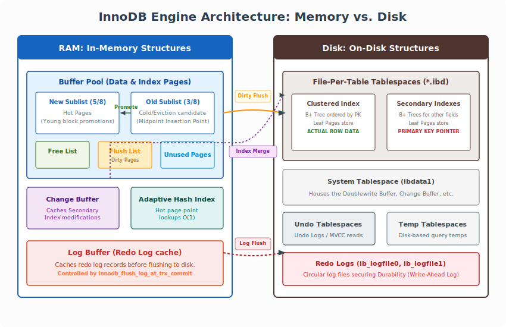
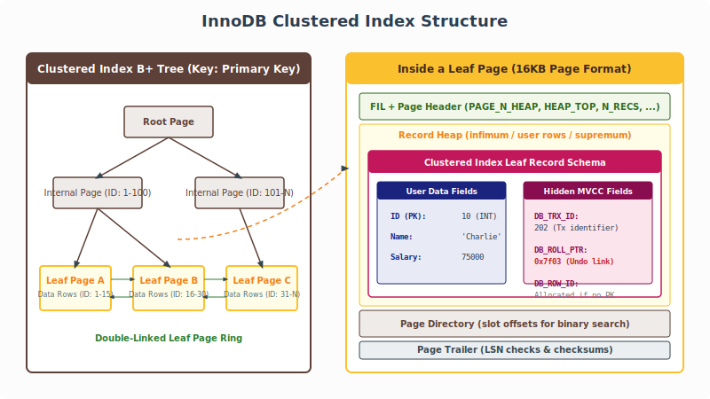
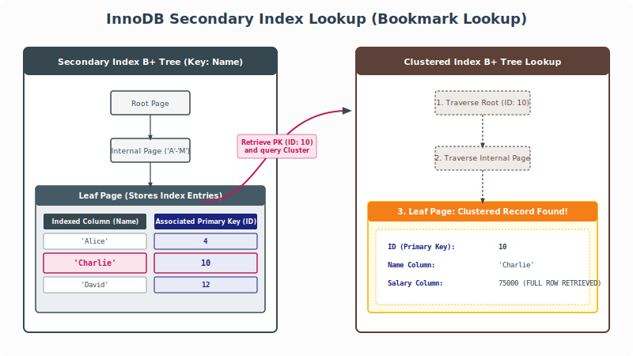
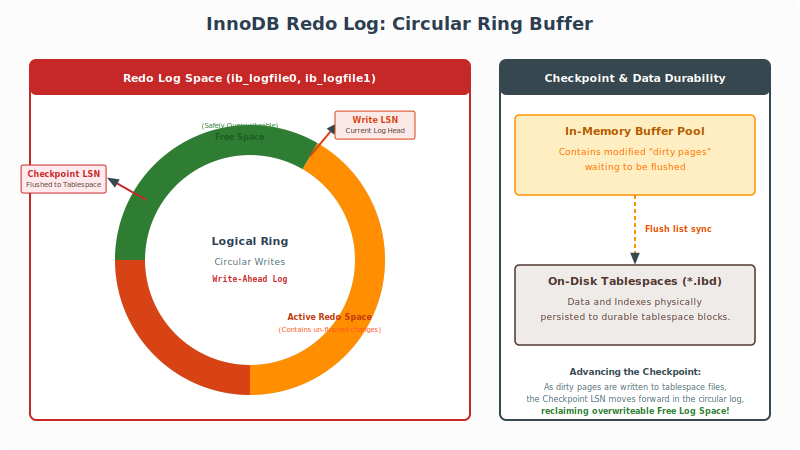
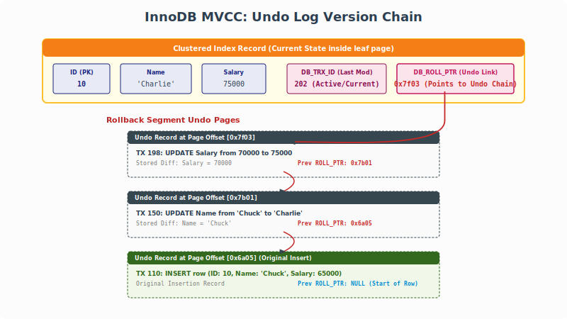

This article introduces the internal architecture and implementation details of MySQL's default storage engine, InnoDB, exploring its memory structures, on-disk storage layouts, physical row formats, and Multi-Version Concurrency Control (MVCC) visibility rules.

<!--more-->

In MySQL's pluggable architecture, the **Storage Engine** is the component responsible for the physical storage, indexing, retrieval, and lock management of relational data.

*   **`handler` Class**: The primary abstract C++ interface through which the SQL Server layer communicates with storage engines. Specific engine drivers inherit from it (e.g., `ha_innobase` for InnoDB). It defines interface methods like `ha_rnd_next()` (scan next row) and `index_read()` (lookup index).
*   **`handlerton`**: A singleton structure—one instance per storage engine—providing global hook registration for engine startup, shutdown, transaction coordination, and log flushes.
*   **`Transaction_ctx`**: Server-layer transaction coordinator associated with a thread/session's `THD`.
*   **`Ha_trx_info`**: Thread-specific transaction state structures registering an active storage engine inside a transaction.

```plantuml

struct Table {
  handler *file
}

class handler {
  TABLE_SHARE *table_share
  TABLE *table
  handlerton *ht
  uchar *ref
  uchar *dup_ref
  Table_flags cached_table_flags
  uint active_index
  store_lock()
  ha_rnd_next()
}
struct handlerton {
uint slot
}


class ha_innobase extends handler {
  
}


class Open_tables_state {
  TABLE *open_tables
  TABLE *temporary_tables
  MYSQL_LOCK *lock
  MYSQL_LOCK *extra_lock
}


class THD extends Query_arena,Open_tables_state {
  MDL_context mdl_context
  Locked_tables_list locked_tables_list
  Ha_data[] ha_data
  Transaction_ctx m_transaction
}

struct  Ha_data {
  void *ha_ptr
  Ha_trx_info ha_info[2]
}


class Transaction_ctx {
  SAVEPOINT *m_savepoints
  THD_TRANS m_scope_info[]
  int64 sequence_number
}


struct THD_TRANS {
  Ha_trx_info *m_ha_list
}

class Ha_trx_info {
  Ha_trx_info *m_next
  handlerton *m_ht

}


THD o-- Table
THD o- Ha_data
THD *-- Transaction_ctx

Table *-- handler
handler *- handlerton

Transaction_ctx *-- THD_TRANS
THD_TRANS *-- Ha_trx_info

```

---

## InnoDB Architecture Overview

InnoDB is a general-purpose transactional storage engine that balances high reliability with peak execution performance. It is the default storage engine in modern MySQL.



---

## 1. In-Memory Structures

To minimize latency caused by slow disk I/O, InnoDB operates a large, highly structured pool of memory:

### A. The Buffer Pool
The **Buffer Pool** is the heart of InnoDB. It caches table and index pages (with a default page size of 16KB) directly in memory, allowing read and write operations to happen at RAM speeds. It is managed via three primary linked lists:
*   **Free List**: Keeps track of unused/empty memory pages ready to be allocated.
*   **Flush List**: Tracks "dirty pages" (pages modified in-memory whose changes have not yet been written to the physical tablespace files).
*   **LRU (Least Recently Used) List**: Implements the page eviction policy when the buffer pool becomes full.
    *   *Midpoint Insertion Strategy*: To prevent large, sequential table scans (e.g., `SELECT * FROM table`) from completely flushing out hot/frequently accessed pages, InnoDB splits the LRU list into two sublists: **New (Young)** (5/8 of the list) and **Old** (3/8 of the list).
    *   Newly fetched pages are initially inserted at the "midpoint" (the boundary between old and young). A page is only promoted to the Young sublist if it is accessed again after a configurable time duration (`innodb_old_blocks_time`), effectively buffering hot pages from sequential scan pollution.

### B. The Change Buffer
Caches insert, update, and delete changes to **secondary indexes** when the corresponding index pages are not currently cached in the Buffer Pool. This avoids expensive random disk reads.
*   When secondary index pages are eventually read into the Buffer Pool for subsequent queries, the cached changes are physically merged.
*   The Change Buffer is itself a physical B+ Tree stored inside the System Tablespace.

### C. The Adaptive Hash Index (AHI)
InnoDB monitors search profiles on index B+ Trees. If it detects that certain leaf pages are queried repeatedly with exact matches (point lookups), it automatically builds a memory-based hash table on top of those leaf nodes.
*   This shifts point lookup speeds from $O(\log N)$ B-Tree traversals to direct $O(1)$ memory hash retrievals.

### D. The Log Buffer
Stores transactional log records (**Redo Logs**) in memory before flushing them to disk tablespace logs.
*   Its flushing behavior is governed by the critical parameter **`innodb_flush_log_at_trx_commit`**:
    *   `1` (Default): Redo log is written to files and flushed/synced to disk at every transaction commit. Guaranteed ACID durability.
    *   `0`: Redo log is written and synced to disk once per second. High speed, but up to 1 second of transaction data can be lost in a crash.
    *   `2`: Redo log is written to the OS file cache at commit, but flushed/synced to disk once per second. Safely survives a `mysqld` crash, but data can be lost during an OS/power failure.

---

## 2. On-Disk Structures

---

### 2.1. Tablespaces & Storage Units
Relational data inside InnoDB is organized into logical tablespace structures containing pages, extents, and segments:

*   **System Tablespace**: Stores the doublewrite buffer pages, change buffer pages, and historical system data.
*   **File-Per-Table Tablespaces**: If `innodb_file_per_table` is enabled (default), each table and its associated indexes are stored on the file system in an independent `.ibd` file.
*   **Undo Tablespaces**: Houses Undo logs, which store previous versions of modified records to facilitate rolling back transactions and providing MVCC reads.
*   **Temporary Tablespaces**: Dedicated tablespace files utilized for temporary tables generated during complex aggregations (like `TemptableAggregateIterator` outputs).

---

### 2.2. Index Structures & Physical Storage

InnoDB tables are stored as **Index-Organized Tables** using B+ Trees:

*   **Clustered Index**: The table itself. Relational row data is stored physically inside the **leaf pages** of the B+ Tree, sorted by the **Primary Key**. If no primary key is defined, InnoDB automatically allocates a hidden 6-byte row ID (`DB_ROW_ID`) to organize the cluster index.



*   **Secondary Index**: Auxiliary B+ Trees built on non-primary columns. Unlike clustered indexes, secondary index leaf pages do **not** store actual data rows; instead, they store the value of the indexed columns along with the corresponding **Primary Key** value. Finding a row via a secondary index requires a secondary lookup (bookmark lookup) in the clustered index.



*   **Redo Logs**: A Write-Ahead Log (WAL) structure ensuring transactional durability (D of ACID). It resides physically on disk as circular ring files (`ib_logfile0`, `ib_logfile1`). The circular buffer operates using a Checkpoint pointer (representing page changes already flushed from RAM to disk tablespace blocks) and a Write pointer (the current active logging head). The active space between checkpoint and write pointers represents logs that must not be overwritten.



---

### 2.3. Key InnoDB Source Code Descriptors

At the C++ source code level, InnoDB structures are represented by these key classes:

*   **`ha_innobase`**: The primary C++ handler class implementing the server's abstract `handler` interface for InnoDB operations.
*   **`innodb_session_t`**: Stores session-specific cached transactional states inside `THD` connection descriptors.
*   **`row_prebuilt_t`**: A highly cached, per-open table structure prebuilt by InnoDB to accelerate repeated index lookups and row cursoring.
*   **`dict_table_t`** & **`dict_index_t`**: Logical descriptors representing tables and index schemas.
*   **`dtuple_t`**: Represents a logical database row tuple.
*   **`btr_pcur_t`**: A persistent B-Tree cursor used to hold positions on index leaf nodes across transactional operations.

```plantuml

struct Table {
  handler *file
}

class handler {
  TABLE_SHARE *table_share
  TABLE *table
  handlerton *ht
  uchar *ref
  uchar *dup_ref
  Table_flags cached_table_flags
  uint active_index
  Record_buffer *m_record_buffer
  store_lock()
  ha_rnd_next()
}
struct handlerton {
uint slot
}

class ha_innobase extends handler {
  row_prebuilt_t *m_prebuilt
  THD *m_user_thd
  INNOBASE_SHARE *m_share
  rnd_next()
}


class Open_tables_state {
  TABLE *open_tables
  TABLE *temporary_tables
  MYSQL_LOCK *lock
  MYSQL_LOCK *extra_lock
}


class THD extends Query_arena,Open_tables_state {
  MDL_context mdl_context
  Locked_tables_list locked_tables_list
  Ha_data[] ha_data
  Transaction_ctx m_transaction
}

struct  Ha_data {
  void *ha_ptr
  Ha_trx_info ha_info[2]
}

class innodb_session_t {
 trx_t *m_trx
 table_cache_t m_open_tables
 Tablespace *m_usr_temp_tblsp
 Tablespace *m_intrinsic_temp_tblsp
}

struct  row_prebuilt_t {
  dict_table_t *table
  dict_index_t *index
  trx_t *trx
  ha_innobase *m_mysql_handler
  dtuple_t *search_tuple
  dtuple_t *m_stop_tuple
  ulint select_lock_type
  mysql_row_templ_t *mysql_template
  ins_node_t *ins_node
  btr_pcur_t *pcur
}

struct btr_pcur_t {
  btr_cur_t m_btr_cur
  
}
row_prebuilt_t *-- btr_pcur_t


struct trx_t {
  trx_id_t id
  trx_state_t state
  ReadView *read_view
  ut_list_node trx_list
  trx_lock_t lock
  isolation_level_t isolation_level
  THD *mysql_thd
  trx_savept_t last_sql_stat_start
  trx_mod_tables_t mod_tables
}


class Transaction_ctx {
  SAVEPOINT *m_savepoints
  THD_TRANS m_scope_info[]
  int64 sequence_number
}


struct THD_TRANS {
  Ha_trx_info *m_ha_list
}

class Ha_trx_info {
  Ha_trx_info *m_next
  handlerton *m_ht

}
struct dict_table_t {
  mem_heap_t *heap
  table_name_t name
  char *data_dir_path
  id_name_t tablespace
  dict_col_t *cols
  List<dict_index_t> indexes
}

struct dict_index_t {
space_index_t id
mem_heap_t *heap
id_name_t name
dict_table_t *table
dict_field_t *fields
rw_lock_t lock
}


THD o-- Table
THD o-- Ha_data
THD *-- Transaction_ctx
Ha_data *-- innodb_session_t
innodb_session_t *-- trx_t
Table *-- handler
handler *- handlerton
ha_innobase *-- row_prebuilt_t
row_prebuilt_t *-- dict_table_t
row_prebuilt_t *-- dict_index_t
row_prebuilt_t *-- trx_t
dict_table_t o- dict_index_t
Transaction_ctx *-- THD_TRANS
THD_TRANS *-- Ha_trx_info

```

---

## 3. Physical Row Formats & BLOB Off-Page Storage

InnoDB supports multiple physical row storage formats: `Compact`, `Redundant`, `Dynamic`, and `Compressed`.
In modern MySQL, the default format is **Dynamic**. 

### The Dynamic Row Format & Off-Page Storage
When columns are exceptionally large (such as text, large `VARCHAR`, or binary `BLOB` fields), storing them inline inside a B+ Tree leaf page can severely reduce index density, forcing more page splits and increasing the B+ Tree height.

*   To combat this, the **Dynamic** row format uses **Off-Page Storage**:
    *   If a row's size exceeds physical page restrictions, InnoDB stores only a **20-byte pointer** inline inside the leaf node.
    *   This 20-byte descriptor contains the **Tablespace ID**, **Page Number**, and **Offset** pointing directly to external off-page tablespace allocation blocks containing the raw BLOB data.
    *   This ensures that B+ Tree leaf pages remain densely populated, keeping search times for key columns exceptionally fast.

---

## 4. Multi-Version Concurrency Control (MVCC)

**MVCC** is the architectural framework used by InnoDB to handle simultaneous, high-throughput transactions without the massive performance penalty of locking entire tables (non-blocking reads).

To implement MVCC, InnoDB appends three hidden metadata fields to every clustered index record:
1.  **`DB_TRX_ID`** (6 bytes): Tracks the transaction identifier of the last transaction that modified (inserted or updated) this row.
2.  **`DB_ROLL_PTR`** (7 bytes): The rollback pointer. Points directly to the undo log record containing the previous state of the row.
3.  **`DB_ROW_ID`** (6 bytes): The row ID used to uniquely organize clustered records if no primary key was specified.



### The ReadView Visibility Logic

When a transaction starts a consistent read query (under `REPEATABLE READ` or `READ COMMITTED` isolation levels), InnoDB instantiates a **`ReadView`** descriptor. The `ReadView` is a snapshot of the transaction landscape at a precise point in time.

The `ReadView` contains four critical variables:
*   **`m_ids`**: A list of all active (running, uncommitted) transaction IDs at the time of view creation.
*   **`m_up_limit_id`**: The lower bound of active transactions. Any transaction with `trx_id < m_up_limit_id` was already committed before the `ReadView` was created and is always visible.
*   **`m_low_limit_id`**: The upper limit of allocated transaction IDs. Any transaction with `trx_id >= m_low_limit_id` started after the `ReadView` was created and is always invisible.
*   **`m_creator_trx_id`**: The ID of the transaction that created this view. Modifications made by the creator transaction are always visible to itself.

#### The Transaction Visibility Algorithm:
For any record in the clustered index with metadata `DB_TRX_ID = trx_id`:

```text
               ReadView Created (Landscape snapshot)
  ───────────┼─────────────────────────────────────────────┼───────────>
             │             Active List [m_ids]             │
   trx_id <  │                                             │  trx_id >=
m_up_limit_id│       m_up_limit_id <= trx_id <             │m_low_limit_id
             │             m_low_limit_id                  │
             │                                             │
   VISIBLE   │   In m_ids? ──► YES ──> INVISIBLE           │  INVISIBLE
             │             └──► NO  ──> VISIBLE            │
```

1.  **Self-Visibility**: If `trx_id == m_creator_trx_id`, the change is **visible**.
2.  **Committed Before ReadView**: If `trx_id < m_up_limit_id`, the transaction was committed before this view was created. The change is **visible**.
3.  **Started After ReadView**: If `trx_id >= m_low_limit_id`, the transaction started after the view's creation. The change is **invisible**.
4.  **Active Transaction Window**: If `m_up_limit_id <= trx_id < m_low_limit_id`:
    *   If `trx_id` is present in the active list `m_ids`, the transaction was still running and had not committed when the view was created. The change is **invisible**.
    *   Otherwise, the transaction committed before the view was created. The change is **visible**.

#### Reconstructing Historical Row States
If the visibility algorithm determines that a record version is **invisible**, InnoDB follows the rollback pointer `DB_ROLL_PTR` to locate the corresponding undo log block. It reconstructs the previous version of the row, retrieves its `DB_TRX_ID`, and runs the visibility evaluation again.

This recursive reconstruction continues down the undo log chain until a visible version of the row is located. If it reaches the end of the undo chain (meaning the row did not exist yet when the `ReadView` was created), the record is treated as non-existent (filtered out of the query result).

```plantuml
struct trx_t {
  trx_id_t id
  trx_state_t state
  ReadView *read_view
  ut_list_node trx_list
  trx_lock_t lock
  isolation_level_t isolation_level
  THD *mysql_thd
  trx_savept_t last_sql_stat_start
  trx_mod_tables_t mod_tables
}

class ReadView {
  ids_t m_ids
  node_t m_view_list
  trx_id_t m_low_limit_id
  trx_id_t m_up_limit_id
  trx_id_t m_creator_trx_id
}

struct trx_sys_t {
  MVCC *mvcc
  trx_id_t next_trx_id_or_no
  Trx_shard shards[TRX_SHARDS_N]
  trx_ids_t rw_trx_ids
}


struct  row_prebuilt_t {
  dict_table_t *table
  dict_index_t *index
  trx_t *trx
  ha_innobase *m_mysql_handler
  dtuple_t *search_tuple
  dtuple_t *m_stop_tuple
  ulint select_lock_type
  mysql_row_templ_t *mysql_template
  ins_node_t *ins_node
  btr_pcur_t *pcur
}

struct btr_pcur_t {
  btr_cur_t m_btr_cur
  
}
struct btr_cur_t {
dict_index_t *index
page_cur_t page_cur
}

row_prebuilt_t *-- btr_pcur_t
btr_pcur_t *-- btr_cur_t

row_prebuilt_t *-- trx_t
trx_t *-- ReadView
trx_sys_t -> trx_t


```

---

## 5. End-to-End SQL Write Lifecycle

To see how InnoDB coordinates clustered indexes, secondary indexes, undo logs, redo logs, and the Buffer Pool in a single unified flow, let’s trace the execution of a concrete SQL query:

```sql
UPDATE employees SET salary = 75000 WHERE name = 'Charlie';
```

When this statement is processed under transaction `Tx 202`, InnoDB coordinates across its subcomponents through the following step-by-step lifecycle:

```text
 1. Index Lookup ──> 2. Bookmark Lookup ──> 3. Create Undo Record ──> 4. Redo Log (WAL)
 (Name='Charlie')     (Get ID=10 Row)        (Save Salary=70000)      (Log modifications)
                                                                             │
 8. Async Flush   <── 7. Commit & Redo  <── 6. Modify Memory  <── 5. Lock & Update view
 (Checkpoint LSN)      (ib_logfile Write)   (Mark page Dirty)         (DB_TRX_ID, ROLL_PTR)
```

1.  **Secondary Index Lookup**:
    *   The optimizer recognizes that `name` has a secondary index. InnoDB traverses the secondary B+ Tree index on `name` for `'Charlie'`.
    *   It finds the secondary index leaf entry containing the key value `'Charlie'` and retrieves the primary key value: **`ID = 10`**.
2.  **Clustered Index Bookmark Lookup**:
    *   Using `ID = 10`, InnoDB queries its **Clustered Index**. It traverses the main table B+ Tree to find the leaf page holding the actual row record for `ID = 10`.
    *   If the target leaf page is not in the **Buffer Pool** memory, it issues a synchronous disk read to load the page from the `.ibd` tablespace file, placing it inside the Buffer Pool LRU list.
3.  **Generate Undo Log Record (MVCC Setup)**:
    *   Before updating the row, InnoDB must back up the current state of the row. It constructs an **Undo Log Record** containing the column state to be overwritten (`Salary = 70000`).
    *   It writes this record to the Undo log buffer/tablespace at page offset `0x7f03`.
4.  **Write Redo Log (Write-Ahead Logging)**:
    *   InnoDB writes a physical **Redo Log record** to the **Log Buffer** in memory, describing the exact byte modifications about to be made on the physical Clustered index leaf page (securing Durability).
5.  **Modify Record Inline (Buffer Pool Update)**:
    *   In the Buffer Pool memory, InnoDB updates the record's user column: **`Salary = 75000`**.
    *   It updates the record's hidden metadata columns:
        *   Sets **`DB_TRX_ID = 202`** (flagging this active transaction).
        *   Sets **`DB_ROLL_PTR = 0x7f03`** (linking the active record to the Undo Log version chain).
    *   The leaf page is now flagged as **Dirty** and linked to the Buffer Pool **Flush List**.
6.  **Transaction Commit & Redo Flush**:
    *   When the client issues `COMMIT`, the SQL layer executes the two-phase commit.
    *   Under Phase 2, the **Log Buffer** contents representing the page write are flushed and synchronized to disk `ib_logfile0` or `ib_logfile1` (governed by `innodb_flush_log_at_trx_commit = 1`), advancing the **`Write LSN`**. The transaction is now legally durable.
7.  **Asynchronous Dirty Page Flushing (Page Sync)**:
    *   Later, an asynchronous InnoDB background thread sweeps the **Flush List**. It writes the dirty page containing `Salary = 75000` to the physical `.ibd` file on disk.
    *   Once the dirty page is safely flushed, InnoDB pushes the **`Checkpoint LSN`** forward in the Redo circular ring, reclaiming that log sector as overwriteable **Free Space**.
