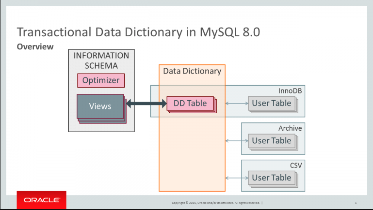

This article introduces Mysql Metadata
<!--more-->

Mysql `Metadata` is anything that describes the database as opposed to being the contents of the database. 
`Metadata` is comprised of 2 parts:
* Data Dictionary
* System tables


# 1. Data Dictionary


Mysql Server incorporates a transactional data dictionary that stores information about database objects. 
The data dictionary schema stores dictionary data in transactional(InnoDB) tables. 
Data dictionary tables are located in the `mysql` database.
Data dictionary tables are created in a single `InnoDB` tablespace named `mysql.ibd`, which resides in the MySql data directory.

Basic Data Dictionary Tables
* `catalogs` catalog information
* `schemata` information about schemata
* `tablespaces` active tablespaces
* `tables` tables in databases
* `columns` columns in tables
* `indexes` information about table indexes

`information_schema` is now implemented as views over dictionary tables, requires no extra disc accesses, no creation of temporary tables.


## 1.1. 1.1 Meta Data Lock

* `MDL_context` context of the owner of metadata locks
* `MDL_ticket` a granted meta data lock
* 
```plantuml
class THD {
    MDL_context mdl_context
}

class Table_ref  {
    char *db
    char *table_name
    LEX_CSTRING target_tablespace_name
    table_map m_map
    table_map sj_inner_tables
    Table_ref *natural_join
    List<Natural_join_column> *join_columns
    TABLE *table

    ST_SCHEMA_TABLE *schema_table
    Query_block *schema_query_block

    Query_block *query_block


    MDL_request mdl_request
}

class MDL_context {
    MDL_context_owner *m_owner
    enum_mdl_type type
    MDL_ticket_store m_ticket_store

    acquire_locks(*mdl_request)

}

class  MDL_request {
    MDL_request *next_in_list
    MDL_request **prev_in_list
    MDL_ticket *ticket
    MDL_key key
}

class MDL_ticket  {
    MDL_context *m_ctx
    MDL_lock *m_lock
}

class MDL_key

class MDL_map {
    LF_HASH m_locks
    MDL_lock *m_global_lock
    MDL_lock *m_commit_lock
    MDL_lock *m_acl_cache_lock
    MDL_lock *m_backup_lock
}

class MDL_lock {
    {static} MDL_map mdl_locks
}

Table_ref *-- MDL_request
MDL_request *-- MDL_key
MDL_request -> MDL_context: require
THD *-- MDL_context
MDL_context *-- MDL_ticket
MDL_request *-- MDL_ticket
MDL_map o-- MDL_lock
MDL_ticket *- MDL_lock


```

## 1.2.  Table_cache

`Table_cache` cache for opened tables
`Table_cache_manager` container class for all the `Table_cache` instances in the system
`Table_cache_element` Element that represents the table in the specific table cache

```plantuml
class Table_cache_manager {
    Table_cache m_table_cache[MAX_TABLE_CACHES]
}

class Table_cache {
    TABLE *m_unused_tables
    map<string, Table_cache_element > m_cache
}

class Table_cache_element {
    TABLE_list used_tables
    TABLE_list free_tables_slim
    TABLE_SHARE *share
}

struct Table {
    THD *in_use
    Field **field
    TABLE_SHARE *s
    handler *file
    TABLE *next
    TABLE *prev
    TABLE *cache_next
    TABLE **cache_prev
    partition_info *part_info
}


Table_cache_manager o-- Table_cache
Table_cache o-- Table_cache_element
Table_cache_element o- Table

```


## 1.3.  Data Dictionary Cache

`Dictionary_client` provides a unified interface to accessing dictionary objects. The main task of the client is to access a shared cache to retrive dictionary objects. The shared cache in its turn, will access dictionary tables if there is a cache miss.

```plantuml
class Dictionary_client {
    std::vector<Entity_object *> m_uncached_objects
  Object_registry m_registry_committed
  Object_registry m_registry_uncommitted
  Object_registry m_registry_dropped
  THD *m_thd                      
  Auto_releaser m_default_releaser
  Auto_releaser *m_current_releaser

  bool acquire(&key, **object,...)
  void acquire_uncommitted(&key, **object)
  size_t release(Object_registry *registry)
  bool fetch_schema_components(*schema, Const_ptr_vec<T> *coll)
  bool fetch_global_components(Const_ptr_vec<T> *coll)
  bool store(T *object)
  update(T *new_object)
  bool drop(const T *object)
}
```


```plantuml
title: database object representation 
class Table_ref  {
    char *db
    char *table_name
    LEX_CSTRING target_tablespace_name
    table_map m_map
    table_map sj_inner_tables
    Table_ref *natural_join
    List<Natural_join_column> *join_columns
    TABLE *table

    ST_SCHEMA_TABLE *schema_table
    Query_block *schema_query_block

    Query_block *query_block


    MDL_request mdl_request
}

class Weak_object <<virtual>>  {

}

class Entity_object<<virtual>> extends Weak_object {
    Object_id id()
    void set_name(name)
}

class Entity_object_impl implements Entity_object {
    Object_id m_id
    String_type m_name
}

class Abstract_table<<virtual>> extends Entity_object 

class Table<<virtual>> extends Abstract_table

class Abstract_table_impl extends Entity_object_impl,Abstract_table {
    Column_collection m_columns
    Object_id m_schema_id
}

class Table_impl extends Abstract_table_impl,Table {
    String_type m_engine
    String_type m_comment
    enum_row_format m_row_format
    enum_partition_type m_partition_type

    Index_collection m_indexes
    Partition_collection m_partitions

    Object_id m_collation_id
    Object_id m_tablespace_id
}

Table_ref --> Table

```

## 1.4. 1.1 DD Cache and persistance


`Storage_adapter` handling of access to persistent storage.

```plantuml

class Storage_adapter {
    Object_registry m_core_registry
    mysql_mutex_t m_lock

    void core_get(K &key, T **object)
    void core_store(THD *thd, T *object)
    bool core_sync(THD *thd, K &key, T *object)

    bool get(THD *thd, K &key, isolation,bypass_registry, T *object)
    bool store(THD *thd, T *object)
    bool drop(THD *thd, T *object)


}

```