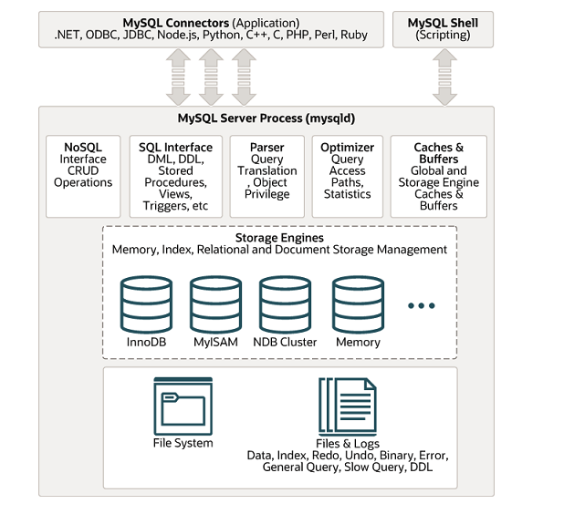

This article provides an in-depth dive into MySQL query processing internals, tracing the lifecycle of a query from the network connection to parsing, logical resolution, table open, locking, physical optimization, execution, and transaction commit.

<!--more-->

# 1. Architecture

MySQL is designed around a multi-layered, client-server architecture where the SQL server layer coordinates query parsing, optimization, and transaction management, delegating the physical storage and indexing of data to pluggable storage engines (like InnoDB).



### Key Source Code Directories
*   **`libmysql`**: Contains the client library implementation responsible for generating the client-side library `libmysqlclient.so` and handling client-server network protocol handshakes.
*   **`sql`**: The main codebase of the MySQL server (`mysqld`), coordinating connection handshakes, parser rules, AST creation, the query optimizer, and execution loops.
    *   **`sql/dd`**: The modern Data Dictionary component (introduced in 8.0), storing database metadata in specialized system tables rather than raw files.
    *   **`sql/server_component`**: Represents the server components architecture that defines modular plugins and extensions.

---

## 1.1. ACID & Transactional Foundation

To guarantee relational reliability, the SQL layer and the storage engine cooperate to enforce ACID properties:

*   **Atomicity**: Managed using the transaction coordinator (`trx_sys_t` and undo logs in InnoDB). It ensures that either all DML changes in a statement succeed or they are completely rolled back.
*   **Consistency**: Maintained by protecting tables and indices from crashes using the Doublewrite Buffer, Redo log, and strict page-level checksum validations.
*   **Isolation**: Implemented via locks (Record locks, Gap locks, Next-Key locks) and Multi-Version Concurrency Control (MVCC) read views in InnoDB, supporting Read Committed, Repeatable Read, etc.
*   **Durability**: Ensured by physical log flush policies (`innodb_flush_log_at_trx_commit` and `sync_binlog`) interacting with underlying hardware disk controller caches.

---

# 2. Server Internals

---

## 2.1. Network & Connection Management

MySQL Server maintains a **One-Thread-Per-Connection** model under normal operation (though modern alternative implementations or enterprise pools can use thread pool plugins). 

The connection loop starts at the socket event listener, which calls `add_connection()` to wrap the socket connection in a connection handler. A dedicated `THD` object (the thread/connection descriptor) is allocated, and the thread enters a command loop calling `do_command()` repeatedly.

```plantuml

actor Client

participant "Event Loop" as EL
participant "Per Thread Connection Handler" as CH
participant "Protocol" as Protocol
participant "sql_parse.cc" as DC


== Establishing Connection ==
Client -> EL : Initiate Connection
activate EL
EL -> CH : add_connection(channel_info)
activate CH  
CH -> CH : handle_connection (THD)
deactivate EL

== Processing Commands ==
loop Handle Multiple Commands
    Client -> Protocol : Send SQL Command
    CH -> DC : do_command(thd)
    activate DC
    DC -> Protocol : get_command(&com_data, &command)
    activate Protocol
    Protocol --> DC : com_data & command
    deactivate Protocol
    DC -> DC : dispatch_command(thd, command)
    DC --> Protocol : Execution Result
    deactivate DC 
    Protocol -> Client : Send Command Result
end

== Terminating Connection ==
Client -> CH : Disconnect
CH -> Client : Close Connection


```

---

## 2.2. SQL Processing Architecture

Every active connection and statement processing state centers around two primary descriptors:

*   **`THD`**: Represents a physical client connection. It acts as the ultimate context descriptor, storing the current thread’s query string, active memory pool (`mem_root`), catalog, database settings, transaction context (`Transaction_ctx`), performance monitoring flags, and network protocol hooks.
*   **`LEX`**: The lexical analyzer and working memory area for parsing and resolving a statement. It contains parsed structures, local variables needed by the current SQL command, and points to the root of the query blocks.

### The General Processing Sequence:
1.  **YACC Parser Step**: The Bison-based parser reads the query and constructs a concrete tree inheriting from **`Parse_tree_root`** (e.g., `PT_select_stmt`).
2.  **Contextualization Step**: The parser root invokes its **`make_cmd()`** method. This contextualizes the AST, generating a hierarchy of **`Query_expression`** and **`Query_block`** objects stored in the `LEX` object, and yields a corresponding **`Sql_cmd`** subclass.
3.  **Statement Execution Step**: The executor invokes the `execute()` method on the resulting `Sql_cmd` instance, driving the runtime query optimization and iterator processing.

```plantuml

class Query_arena {
  Item *m_item_list
  MEM_ROOT *mem_root
}

class Open_tables_state {
  TABLE *open_tables
  TABLE *temporary_tables
  MYSQL_LOCK *lock
  MYSQL_LOCK *extra_lock
}

class THD extends Query_arena,Open_tables_state {
  Thd_mem_cnt m_mem_cnt
  MDL_context mdl_context
  LEX *lex
  LEX_CSTRING m_query_string
  LEX_CSTRING m_catalog
  LEX_CSTRING m_db

  Prepared_statement_map stmt_map
  Transaction_ctx m_transaction

  const char *thread_stack


  System_variables variables
  System_status_var status_var

  Cost_model_server m_cost_model

  Protocol *m_protocol
  Query_plan query_plan
  char *m_trans_log_file
  NET net
}

class Query_tables_list {
  enum_sql_command sql_command
  Table_ref *query_tables
  Table_ref **query_tables_last
}

class LEX << (S,#FF7700) >> extends Query_tables_list{
  THD *thd
  Query_expression *unit
  Query_block *query_block
  Query_result *result
  Query_block *all_query_blocks_list
  Query_block *m_current_query_block
  make_sql_cmd(Parse_tree_root *parse_tree)
}

class Query_expression {
  Query_expression *next
  Query_expression **prev
  Query_block *master
  Query_block *slave
  Query_term *m_query_term
  bool prepared
  bool executed
  Query_result *m_query_result
}

class Query_term {
  Query_term_set_op *m_parent
}

class Query_block extends Query_term {
  mem_root_deque<Item *> fields
  List<Window> m_windows
  List<Item_func_match> *ftfunc_list
  mem_root_deque<Table_ref *> sj_nests
  SQL_I_List<Table_ref> m_table_list
  SQL_I_List<ORDER> order_list
  SQL_I_List<ORDER> group_list
  LEX *parent_lex
  table_map select_list_tables
  Table_ref *leaf_tables
}

class Sql_cmd {
  Prepared_statement *m_owner

  virtual bool prepare(THD *)
  virtual bool execute(THD *thd)
} 


class Sql_cmd_dml extends Sql_cmd {
  LEX *lex
  Query_result *result
}
class Sql_cmd_select extends Sql_cmd_dml {
  
}

THD *-- LEX

LEX *-right- Query_expression
LEX --> Sql_cmd: make
Query_expression *-right- Query_block

```

### Statement Parsing Sequence

The high-level sequence from `dispatch_command()` down to `Sql_cmd::execute()` is shown below:

```plantuml
title parse procedure

participant "sql_parse.cc" as SP
participant THD
participant YACC
participant LEX
participant Parse_Tree

SP --> SP : dispatch_command()
activate SP
SP --> SP :dispatch_sql_command()
activate SP
SP --> SP: parse_sql
activate SP
SP --> THD : sql_parser()
activate THD
THD--> YACC :my_sql_parser_parse
activate Parse_Tree
THD --> LEX : make_sql_cmd(Parse_tree_root *root)
LEX --> Parse_Tree: make_cmd(thd) 
Parse_Tree --> Parse_Tree:contextualize
deactivate Parse_Tree
SP --> SP: mysql_execute_command
activate SP
SP --> Sql_cmd: execute(thd)
activate Sql_cmd
Sql_cmd --> Sql_cmd: prepare(thd)
Sql_cmd --> Sql_cmd: execute_inner(thd)
```

---

### 2.2.1 Parsing & AST Construction

The Bison parser builds a tree of **`Parse_tree_node`** objects representing elements like select statements, expression clauses, lists, and function calls.

```plantuml


title Top level Sql Statements Structure

class Parse_tree_root {
  +virtual Sql_cmd *make_cmd(THD *thd) = 0
}

class PT_select_stmt {
}

class PT_insert
class PT_update
class PT_delete
class PT_explain
class PT_table_ddl_stmt_base
class PT_show_base


class PT_show_engine_base
class PT_show_engine_status

Parse_tree_root <|-- PT_select_stmt
Parse_tree_root <|-- PT_insert
Parse_tree_root <|-- PT_update
Parse_tree_root <|-- PT_delete
Parse_tree_root <|-- PT_explain
Parse_tree_root <|-- PT_table_ddl_stmt_base
Parse_tree_root <|-- PT_show_base


PT_show_base <|-- PT_show_engine_base
PT_show_engine_base <|-- PT_show_engine_status


```

#### DDL Statement Parsing
For Data Definition Language (DDL) queries, parser roots inherit from `PT_table_ddl_stmt_base`, encapsulating metadata mutations like tablespace changes, indexing structures, and tablespace operations:

```plantuml

title Top level  ddl statements 

Parse_tree_root <|-- PT_table_ddl_stmt_base
class PT_table_ddl_stmt_base {
  Alter_info m_alter_info
}
PT_table_ddl_stmt_base <|-- PT_create_table_stmt
PT_table_ddl_stmt_base <|-- PT_alter_table_stmt
PT_table_ddl_stmt_base <|-- PT_create_index_stmt
PT_table_ddl_stmt_base <|-- PT_drop_index_stmt
PT_table_ddl_stmt_base <|-- PT_show_create_table
```

#### DML Expression Representation (`Item` Class)
During the parsing of SQL expressions (like constants, fields, or function evaluations), the parser instantiates nodes inheriting from **`Item`**. The `Item` hierarchy represents all typed evaluation formulas within the database, including fields (`Item_field`), functions (`Item_func`), and comparison operators (`PTI_comp_op`).

```plantuml

title select parse tree
class PT_select_stmt {
  +enum_sql_command m_sql_command
  +PT_query_expression_body *m_qe
  +PT_into_destination *m_into
  +Sql_cmd *make_cmd(THD *thd)
}


class Parse_tree_node {
  Parse_context context_t
  bool contextualized
  {abstract} bool contextualize(Parse_context *pc)
  {abstract} bool do_contextualize(Parse_context *pc)

}

class Parse_context {
  THD *const thd
  MEM_ROOT *mem_root
  Query_block *select
  mem_root_deque<QueryLevel> m_stack
  Show_parse_tree m_show_parse_tree
}


class PT_query_expression_body extends Parse_tree_node
class PT_query_primary extends PT_query_expression_body
class PT_query_specification extends PT_query_primary {
  PT_hint_list *opt_hints
  Query_options options
  PT_item_list *item_list
  PT_into_destination *opt_into1
  const bool m_is_from_clause_implicit
  Mem_root_array_YY<PT_table_reference *> from_clause  
  Item *opt_where_clause
  PT_group *opt_group_clause
  Item *opt_having_clause
  PT_window_list *opt_window_clause
  Item *opt_qualify_clause
}


class PT_query_expression  extends PT_query_expression_body {
   PT_query_expression_body *m_body
   PT_order *m_order
   PT_limit_clause *m_limit
   PT_with_clause *m_with_clause
}

class Item extends  Parse_tree_node

class Parse_tree_item extends  Item

class PTI_context extends  Parse_tree_item {
  Item *expr
  enum_parsing_context m_parsing_place
}

class PTI_where extends PTI_context {

}

class Item_ident extends  Item {
  Name_resolution_context *context
  char *db_name
  char *table_name
  char *field_name
  Table_ref *m_table_ref
}

class Item_field extends Item_ident {
  Field *field
  Field *result_field
  uint16 field_index
  Item_multi_eq *item_equal_all_join_nests
}

class PTI_comp_op extends Parse_tree_item {
  Item *left
  chooser_compare_func_creator boolfunc2creator
  Item *right
}

PT_select_stmt *-- PT_query_expression_body

Parse_tree_node *-- Parse_context: contextualize
PT_query_specification *-- PTI_where

PTI_where *-- PTI_comp_op


```

---

### 2.2.2 Query Expressions, Blocks, & Iterator Compilation

During the `contextualization` step (`make_cmd()`), abstract syntax nodes are transformed into structured query scopes:

*   **`Query_term`**: Abstract base representing operations like `Query_block` or set operations (`Query_term_union`, `Query_term_except`).
*   **`Query_block`**: Corresponds to a single, distinct SQL query block (a query block with a single `SELECT` keyword, `WHERE` clause, and local grouping parameters).
*   **`Query_expression`**: Represents one or more query blocks nested or chained via `UNION` operations.
*   **`AccessPath`**: The modern physical query plan generated by the optimizer.
*   **`RowIterator`**: The compiled Volcano pipeline iterator. `CreateIteratorFromAccessPath()` maps paths directly to physical iterators.

```plantuml
class Query_term {
  Query_term_set_op *m_parent
  uint m_sibling_idx
  Query_result *m_setop_query_result
  bool m_owning_operand
  Table_ref *m_result_table
  mem_root_deque<Item *> *m_fields
}
class Query_block extends Query_term {
  mem_root_deque<Item *> fields
  Item *m_where_cond
  Item *m_having_cond
  List<Window> m_windows
  SQL_I_List<Table_ref> m_table_list
  SQL_I_List<ORDER> order_list
  SQL_I_List<ORDER> group_list
  char *db
  LEX *parent_lex
  table_map select_list_tables
  mem_root_deque<Table_ref *> *m_current_table_nest
  table_map outer_join
  Name_resolution_context context
  JOIN *join
  Item *select_limit
  Item *offset_limit
  Item::cond_result cond_value
  Item::cond_result having_value
  prepare()
  optimize()
}

class JOIN {
  Query_block * query_block
  THD * thd
  mem_root_deque<Item *> *fields
}

class Table_ref {

}

class Parse_context {
  THD *const thd
  MEM_ROOT *mem_root
  Query_block *select
  mem_root_deque<QueryLevel> m_stack
  Show_parse_tree m_show_parse_tree
}

class  Query_expression {
  Query_expression *next
  Query_expression **prev
  Query_block *master
  Query_block *slave
  Query_term *m_query_term
  AccessPath *m_root_access_path
  RowIterator m_root_iterator
  Query_result *m_query_result
}

class Query_result {
  Query_expression *unit
  ha_rows estimated_rowcount
  double estimated_cost
}

class Query_result_send extends Query_result {
  bool send_data(...)
  bool send_eof(...)
  void cleanup()
}

struct AccessPath {
 Type type
 RowIterator *iterator
}

class RowIterator {
  THD *const m_thd
}

class TableRowIterator extends RowIterator {
TABLE * m_table
}

class FilterIterator extends RowIterator
class TableScanIterator extends TableRowIterator {
  
}
class IndexScanIterator extends TableRowIterator
class SortingIterator extends RowIterator


Query_expression *-- Query_result
Query_expression *-- RowIterator
Query_expression *- AccessPath

class Query_term {

}

class Item extends  Parse_tree_node {
  uint8 m_data_type
}
class Item_ident extends  Item {
  Name_resolution_context *context
  char *db_name
  char *table_name
  char *field_name
  Table_ref *m_table_ref
}

class Item_field extends Item_ident {
  Field *field
  Field *result_field
  uint16 field_index
  Item_multi_eq *item_equal_all_join_nests
}

class Item_result_field extends Item {
  Field *result_field
}

class Item_func extends Item_result_field {
  Item **args
  Item *m_embedded_arguments[]
  uint arg_count
}

Parse_context *-- Query_block
Query_expression *-- Query_block
Query_block *-- Table_ref
Query_block *-- Item
Query_block *-- JOIN
JOIN *-- Item


```

---

### 2.2.3 Sql_cmd Representation

An abstract statement representation that encapsulates both definition rules and the runtime execute loop:

```plantuml
class Sql_cmd {
  Prepared_statement *m_owner

}
class Sql_cmd_dml extends Sql_cmd {
  LEX *lex
  Query_result *result
}
class Sql_cmd_select extends Sql_cmd_dml {

}

class Query_tables_list {
  enum_sql_command sql_command
  Table_ref *query_tables
  Table_ref **query_tables_last
}

class LEX << (S,#FF7700) >> extends Query_tables_list{
  THD *thd
  Query_expression *unit
  Query_block *query_block
  Sql_cmd *m_sql_cmd
  Query_result *result
  Query_block *all_query_blocks_list
  Query_block *m_current_query_block
  make_sql_cmd(Parse_tree_root *parse_tree)
}
LEX *- Sql_cmd

```

---

### 2.2.4 Table Representations & Cache Management

Opening and managing physical tables is managed via a set of coordinating structs:

*   **`Table_ref`**: A logical reference representing a table in the `FROM` clause.
*   **`TABLE`**: Represents a physical instance of an open table for the current thread/connection. It owns record buffers (`record[0]`, `record[1]`) and pointers to storage engine abstraction drivers (`handler *file`).
*   **`TABLE_SHARE`**: Stores shared metadata (such as schema definitions, field types, primary keys, and sizes) common across all connections, loaded from the system's Data Dictionary (`sql/dd`).
*   **`Table_cache`** / **`Table_cache_manager`**: Maintains pools of open `TABLE` instances to avoid the severe performance penalty of constantly opening and parsing file systems or data dictionary schemas.
*   **`KEY`** & **`KEY_PART_INFO`**: Describes indices on the tables and correlates fields directly.

```plantuml

class Open_tables_state {
  TABLE *open_tables
  TABLE *temporary_tables
  MYSQL_LOCK *lock
  MYSQL_LOCK *extra_lock
}

class THD extends Query_arena,Open_tables_state {
  MDL_context mdl_context
  Locked_tables_list locked_tables_list
}


struct Table {
    THD *in_use
    Field **field
    TABLE_SHARE *s
    handler *file
    TABLE *next
    TABLE *prev
    TABLE *cache_next
    TABLE **cache_prev
    partition_info *part_info
    char *alias
    Table_ref *pos_in_table_list
    Table_ref *pos_in_locked_tables
    MY_BITMAP *read_set
    MY_BITMAP *write_set
    reginfo
    KEY *key_info
}

struct reginfo {
  thr_lock_type lock_type
}

struct TABLE_SHARE {
  long m_version
  Field **field

}

class KEY {
  KEY_PART_INFO *key_part
  TABLE *table
  ha_key_alg algorithm
}

class KEY_PART_INFO {
  Field *field
  uint offset
}

class Table_cache_manager {
    Table_cache m_table_cache[MAX_TABLE_CACHES]
}

class Table_cache {
    TABLE *m_unused_tables
    map<string, Table_cache_element > m_cache
}

class Table_cache_element {
    TABLE_list used_tables
    TABLE_list free_tables_slim
    TABLE_SHARE *share
}

class Table_ref {
  TABLE *table
}

class Sql_cmd {
  Prepared_statement *m_owner

}
class Sql_cmd_dml extends Sql_cmd {
  LEX *lex
  Query_result *result
}

class Query_tables_list {
  enum_sql_command sql_command
  Table_ref *query_tables
  Table_ref **query_tables_last
}

struct LEX  extends Query_tables_list{
  THD *thd
  Query_expression *unit
  Query_block *query_block
  Query_result *result
  Query_block *all_query_blocks_list
  Query_block *m_current_query_block
  make_sql_cmd(Parse_tree_root *parse_tree)
}

class Field {
  TABLE *table
  char **table_name, 
  char *field_name
  Key_map part_of_key
}

class Field_num extends Field

class Field_str extends Field

class Field_blob extends Field


THD o- Table
Table *- TABLE_SHARE
Table *-- reginfo
Table_cache_manager o-- Table_cache
Table_cache o-- Table_cache_element
Table_cache_element o-- Table
Table_ref o-- Table
Sql_cmd_dml *-- LEX
LEX o-- Table_ref
Table *-- Field
Table O-- KEY
KEY O-- KEY_PART_INFO
```

---

### 2.2.5 Table Locking Structures

The SQL layer coordinates table locking using `MYSQL_LOCK` and underlying engine locking locks (`THR_LOCK_DATA`) to synchronize concurrent access on the server level:

```plantuml
struct MYSQL_LOCK {
  TABLE **table
  uint table_count 
  unit lock_count
  THR_LOCK_DATA **locks
}

struct THR_LOCK_DATA {
  THR_LOCK_INFO *owner
  THR_LOCK_DATA *next
  THR_LOCK_DATA **prev
  THR_LOCK *lock
  mysql_cond_t *cond
  thr_lock_type type
}

MYSQL_LOCK o-- THR_LOCK_DATA

```

---

### 2.2.6 Detailed Query Execution Sequence

The complete runtime lifecycle of a read statement spans parsing, table opening, locking, preparation/type resolution, physical path selection, compiling, and data streaming:

```plantuml
participant sql_parse
participant Sql_cmd_select
participant sql_base.cc
participant Query_block
participant Item
participant lock.cc
participant ha_innodb.cc
participant TrxInInnoDB
participant Query_expression
participant Query_result


sql_parse --> Sql_cmd_select: mysql_execute_command

Sql_cmd_select --> Sql_cmd_select: execute
activate Sql_cmd_select
Sql_cmd_select --> Sql_cmd_select: prepare

activate Sql_cmd_select
Sql_cmd_select --> sql_base.cc: open_tables_for_query
activate sql_base.cc
sql_base.cc --> sql_base.cc: open_tables
deactivate 
Sql_cmd_select --> Query_block: prepare
Query_block --> Item: fix_field
deactivate Sql_cmd_select
Sql_cmd_select --> sql_base.cc: lock_tables
sql_base.cc --> lock.cc: mysql_lock_tables
activate lock.cc
lock.cc --> ha_innodb.cc: store_lock
lock.cc --> lock.cc: lock_external
activate lock.cc
lock.cc --> ha_innodb.cc: external_lock
ha_innodb.cc --> TrxInInnoDB: begin_stmt
deactivate lock.cc
deactivate lock.cc
Sql_cmd_select --> Sql_cmd_select: execute_inner
activate Sql_cmd_select
Sql_cmd_select --> Query_expression: optimize
Sql_cmd_select --> Query_expression: create_iterators
Sql_cmd_select --> Query_expression: execute
activate Query_expression
Query_expression --> Query_expression: ExecuteIteratorQuery
Query_expression --> Query_result: start_execution
loop 
  Query_expression --> RowIterator: read
  Query_expression --> Query_result: send_data
  Query_expression --> Query_result: send_eof
end


```

#### Step-by-Step Breakdown of Execution:
1.  **Metadata Acquisition (`open_tables()`)**: Evaluates `Table_ref` metadata and acquires `TABLE` instances from `Table_cache`.
2.  **Type Resolution (`fix_fields()`)**: Resolves columns, aggregates, and functions across the `Item` expression trees, performing static type coercion.
3.  **Acquire Locks (`mysql_lock_tables()`)**: Acquires server-layer locks, then issues `external_lock()` to instruct storage engines to start active statement contexts (calling InnoDB's `begin_stmt()`).
4.  **Logical & Physical Path Generation (`optimize()`)**: Prepares costs, picks indices, join orders, and outputs physical `AccessPath` plans.
5.  **Compile to Iterator Tree (`create_iterators()`)**: Maps compiled `AccessPath` trees to native Volcano `RowIterator` networks.
6.  **Volcano Execution Loop (`ExecuteIteratorQuery()`)**: Pulls rows sequentially using `RowIterator::Read()`, loading the matching data inside table row buffers and streaming them to client sockets using `Query_result_send::send_data()`.

---

### 2.2.7 Physical Execution of Window Functions

Window-function and other physical operators are catalogued in the Volcano iterator post:

→ [MySQL query Internals — Volcano model §3 Row iterators](/post/data/db/mysql/volcano/#3-row-iterators)

Join, window, and DML mutation iterators (with SQL examples) appear under the same section (§3.4–§3.9).

---

## 2.5. Binary Logging & Two-Phase Commit (2PC)

To guarantee exact consistency between the database storage engine data page structures (specifically, the InnoDB Redo Log) and the replication/recovery trail (the Binary Log), MySQL utilizes a highly coordinated **Two-Phase Commit (2PC)** protocol.

The Binary Log serves as a chronological append-only audit trail of DDL/DML state changes. When a transaction modifies database pages, logging and page committing are split into a structured protocol across `sql/binlog.cc` and `sql/handler.cc`:

```text
       SQL Server Layer                            Storage Engine (InnoDB)
   ┌──────────────────────┐                       ┌──────────────────────┐
   │                      │                       │                      │
   │  1. Initiate commit  │                       │                      │
   │     ───────────────┼─┼──────────────────────>│  2. Prepare Phase    │
   │                      │                       │     - Write Redo Log │
   │                      │                       │     - Mark PREPARED  │
   │                      │                       │     - Flush to disk  │
   │                      │<──────────────────────┼────────┘             │
   │  3. Write & Sync     │                       │                      │
   │     Binary Log       │                       │                      │
   │     - Flush to disk  │                       │                      │
   │     ───────────────┼─┼──────────────────────>│  4. Commit Phase     │
   │                      │                       │     - Mark COMMITTED │
   │                      │                       │     - Release locks  │
   │                      │                       │     - Flush logs     │
   └──────────────────────┘                       └──────────────────────┘
```

### Detailed Two-Phase Commit Steps:

1.  **The Prepare Phase (Phase 1)**:
    *   The SQL layer initiates the commit via `ha_prepare_low()`, notifying InnoDB of the upcoming transaction commit.
    *   InnoDB processes the prepare command inside `innobase_prepare()`, flushing the dirty memory data changes to the physical transactional log (Redo Log) and changing the transaction state descriptor inside memory to `TRX_PREPARED`.
    *   This guarantees that all redo records needed to recreate or rollback the transaction are safely persisted on disk.
2.  **Write and Sync Binary Log (Phase 2 - Part A)**:
    *   The SQL layer takes the query cache buffer contents and writes them directly into the physical binary log file on disk via `MYSQL_BIN_LOG::write_cache()`.
    *   Based on system settings (specifically `sync_binlog = 1`), the binlog file descriptor is forced to synchronize using physical disk flushes.
    *   *Crucial Logic:* Once the transaction's changes are committed to the Binary Log file on disk, **the transaction is considered legally committed** by the database server. Even if the server crashes right after this step, the crash recovery coordinator will detect that the transaction was written to the binlog and force InnoDB to roll it forward.
3.  **The Commit Phase (Phase 2 - Part B)**:
    *   The SQL layer completes the transaction commit via `ha_commit_low()`, calling the physical storage engine commit function `innobase_commit()`.
    *   InnoDB changes the transaction state flag from `TRX_PREPARED` to `TRX_COMMITTED` in its transactional coordinator headers, releases row locks, and schedules internal undo log purges.

---

## 2.6. Essential Server Configuration Variables

Key configurations that control connection pools, data directories, and execution performance limits on the SQL layer:

*   `--defaults-file=<path>`: Specifies the exact local path to read the server options from.
*   `--datadir=<path>`: Sets the physical database root directory path where InnoDB tablespaces reside.
*   `--init-file=<path>`: Specifies an SQL file to execute statements sequentially immediately at server startup.
*   `--open_files_limit=<num>`: Controls the maximum number of physical file descriptors available to `mysqld` on the OS level.
*   `--max-connections=<num>`: The maximum number of simultaneous, active client connection threads allowed.
*   `--thread_cache_size=<num>`: Controls how many connection threads the server caches for reuse instead of creating new threads on connection arrivals.

---

# 3. Administration & Thread Monitoring

Administrators can inspect active client connection handler threads, execution contexts, and lock waits using standard commands:

```sql
-- Display the current running connection handler threads and statements
SHOW FULL PROCESSLIST;

-- Query detailed thread states directly from the Performance Schema
SELECT * FROM performance_schema.threads;

-- Check active caching of threads and connection counts
SHOW STATUS LIKE '%thread%';
```

---

# 4. References & Deep Dive Resources

*   [MySQL Source Code Analysis on Cnblogs](https://www.cnblogs.com/jkin)
*   [Alibaba Cloud DB Team: MySQL Deep Dives](https://mp.weixin.qq.com/mp/appmsgalbum?__biz=MzIzOTU0NTQ0MA==)
*   [MySQL Startup and Parser Lifecycle Course](https://github.com/Jeanhwea/mysql-source-course)
*   [Jeremy Cole's InnoDB Internals Deep Dive Series](https://blog.jcole.us/innodb/)
*   [O'Reilly: Understanding MySQL Internals Reference Manual](https://theswissbay.ch/pdf/Gentoomen%20Library/Databases/mysql/)
