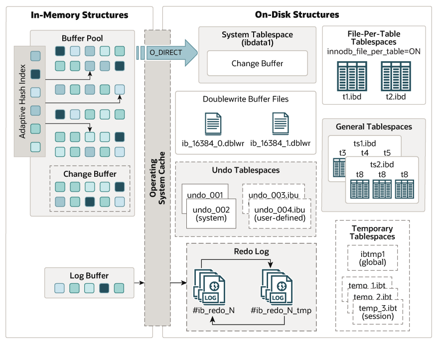

this article introduce Mysql internals
<!--more-->
# 1. Architecture


source code dir:
* `libmysql`    generate `libmysqlclient.so`
* `sql`         main codebase 
  * `dd`        Data dictionary
  * `server_component` server component


## 1.1. ACID

* `Atomicity`     transaction management
* `Consistency`   protect from Crashes
* `Isolation`     transaction Isolation level
* `Durability`    Mysql software features interacting with particular hardware configuration.


# 2. Server


## 2.1. Network

Mysql Server maintains a one thread per connection model. 

```plantuml

actor Client

participant "Event Loop" as EL
participant "Per Thread Connection Handler" as CH
participant "Protocol" as Protocol
participant "sql_parse.cc" as DC


== Establishing Connection ==
Client -> EL : Initiate Connection
activate EL
EL -> CH : add_connection(channel_info)
activate CH  
CH -> CH : handle_connection (THD)
deactivate EL

== Processing Commands ==
loop Handle Multiple Commands
    Client -> Protocol : Send SQL Command
    CH -> DC : do_command(thd)
    activate DC
    DC -> Protocol : get_command(&com_data, &command)
    activate Protocol
    Protocol --> DC : com_data & command
    deactivate Protocol
    DC -> DC : dispatch_command(thd, command)
    DC --> Protocol : Execution Result
    deactivate DC 
    Protocol -> Client : Send Command Result
end

== Terminating Connection ==
Client -> CH : Disconnect
CH -> Client : Close Connection


```

## 2.2. Query Execution

1. `MySql` YACC parser parses `select` statement to one kind of `Parse_tree_root`
2. `Parse_tree_root` calls `make_cmd()` method to generate `Sql_cmd`, In this method, `contextualize` of `Parse_tree_node` called to generate `Query_expression` in `LEX`
3. `Sql_cmd` calls its `execute()` to generate result


* `Query_expression` one query block or several query blocks combined with UNION
* `Query_term` tree structure. 
  Five node types:
  * `Query_block`
  * `Query_term_unary`
  * `Query_term_intersect`
  * `Query_term_except`
  * `Query_term_union`
* `Query_block` a query specification, which is a query consisting of a `SELECT` keyword
* `Sql_cmd` representation of an SQL command, an interface between the parser and the runtime. The parser builds the appropriate `Sql_cmd` to represent a SQL statement in the parsed tree. The `execute()` method in the derived classes of `Sql_cmd` contains the runtime implementation.

```plantuml

class THD {
  Thd_mem_cnt m_mem_cnt
  MDL_context mdl_context
  LEX *lex
  LEX_CSTRING m_query_string
  LEX_CSTRING m_catalog
  LEX_CSTRING m_db

  Prepared_statement_map stmt_map
  const char *thread_stack

  Protocol *m_protocol
  Query_plan query_plan
  char *m_trans_log_file
  NET net
}

class LEX << (S,#FF7700) >> {
  THD *thd
  Query_expression *unit
  Table_ref *insert_table
  enum_tx_isolation tx_isolation
  LEX_STRING create_view_query_block
  Sql_cmd *m_sql_cmd
  make_sql_cmd(Parse_tree_root *parse_tree)
}

class Query_expression {
  Query_expression *next
  Query_expression **prev
  Query_block *master
  Query_block *slave
  Query_term *m_query_term
  bool prepared
  bool executed
  Query_result *m_query_result
}

class Query_term {
  Query_term_set_op *m_parent
}

class Query_block extends Query_term {
  mem_root_deque<Item *> fields
  List<Window> m_windows
  List<Item_func_match> *ftfunc_list
  mem_root_deque<Table_ref *> sj_nests
  SQL_I_List<Table_ref> m_table_list
  SQL_I_List<ORDER> order_list
  SQL_I_List<ORDER> group_list
  LEX *parent_lex
  table_map select_list_tables
  Table_ref *leaf_tables
}

class Sql_cmd {
  Prepared_statement *m_owner

  virtual bool prepare(THD *)
  virtual bool execute(THD *thd)
} 


class Sql_cmd_dml extends Sql_cmd {
  LEX *lex
  Query_result *result
}
class Sql_cmd_select extends Sql_cmd_dml {
  
}

THD *-- LEX

LEX *-right- Query_expression
LEX --> Sql_cmd: make
Query_expression *-right- Query_block

```


```plantuml
title parse procedure

participant "sql_parse.cc" as SP

SP --> SP : dispatch_command()
activate SP
SP --> SP :dispatch_sql_command()
activate SP
SP --> SP: parse_sql
activate SP
SP --> THD : sql_parser()
activate THD
THD--> YACC :my_sql_parser_parse
THD --> LEX : make_sql_cmd(*parse_tree)
LEX --> Parse_Tree: make_cmd(thd) 
SP --> SP: mysql_execute_command
activate SP
SP --> Sql_cmd: execute(thd)
activate Sql_cmd
Sql_cmd --> Sql_cmd: prepare(thd)
Sql_cmd --> Sql_cmd: execute_inner(thd)
```


```plantuml


title Top level Sql Statements Structure

class Parse_tree_root {
  +virtual Sql_cmd *make_cmd(THD *thd) = 0
}

class PT_select_stmt {
}

class PT_insert
class PT_update
class PT_delete
class PT_explain
class PT_table_ddl_stmt_base
class PT_show_base


class PT_show_engine_base
class PT_show_engine_status

Parse_tree_root <|-- PT_select_stmt
Parse_tree_root <|-- PT_insert
Parse_tree_root <|-- PT_update
Parse_tree_root <|-- PT_delete
Parse_tree_root <|-- PT_explain
Parse_tree_root <|-- PT_table_ddl_stmt_base
Parse_tree_root <|-- PT_show_base


PT_show_base <|-- PT_show_engine_base
PT_show_engine_base <|-- PT_show_engine_status


```


```plantuml

title Top level  ddl statements 

Parse_tree_root <|-- PT_table_ddl_stmt_base
class PT_table_ddl_stmt_base {
  Alter_info m_alter_info
}
PT_table_ddl_stmt_base <|-- PT_create_table_stmt
PT_table_ddl_stmt_base <|-- PT_alter_table_stmt
PT_table_ddl_stmt_base <|-- PT_create_index_stmt
PT_table_ddl_stmt_base <|-- PT_drop_index_stmt
PT_table_ddl_stmt_base <|-- PT_show_create_table
```

```plantuml
skinparam linetype ortho
title select parse tree
class PT_select_stmt {
  +enum_sql_command m_sql_command
  +PT_query_expression_body *m_qe
  +PT_into_destination *m_into
  +Sql_cmd *make_cmd(THD *thd)
}


class Parse_tree_node {
  Parse_context context_t
  bool contextualized
  {abstract} bool contextualize(Parse_context *pc)
  {abstract} bool do_contextualize(Parse_context *pc)

}

class Parse_context {
  THD *const thd
  MEM_ROOT *mem_root
  Query_block *select
  mem_root_deque<QueryLevel> m_stack
}


class PT_query_specification {
  PT_item_list *item_list
  Mem_root_array_YY<PT_table_reference *> from_clause
  Item *opt_where_clause
}
Parse_tree_node <|-left- PT_query_expression_body  
class PT_query_primary extends PT_query_expression_body


PT_query_primary <|-left-  PT_query_specification  
class PT_query_expression  {
   PT_query_expression_body *m_body
   PT_order *m_order
   PT_limit_clause *m_limit
}

PT_query_expression_body <|-left- PT_query_expression

PT_select_stmt -down-> PT_query_expression: m_qe

Parse_tree_node --> Parse_context: contextualize
PT_query_expression -down-> PT_query_specification: m_body

```


## 2.3. optimizer


## 2.4. Storage Engine

### 2.4.1. InnoDB
`InnoDB` is a general-purpose storage engine that balances reliability and high performance. `InnoDB` is the default MySQL storage Engine.




#### 2.4.1.1. MVCC

`Multi-version Concurrency Control` A concurrency control method used by `InnoDB` to handle simultaneous transactions without locking the entire table. 

Old versions of changed rows are stored in undo tablespaces in a data structure called a rollback segment. InnoDB uses the information in the rollback segment to perform the undo operations needed in a transaction rollback. It also uses the info to build earlier versions of a row for a consistent read.

Internally `InnoDB` adds three fields to each row stored in the database:
* `DB_TRX_ID` indicates the transaction identifier for the last transaction that inserted or updated the row.
* `DB_ROLL_PTR` roll pointer points to an undo log record written to the rollback segment. if the row was updated, the undo log record contains the information necessary to rebuild the content of the row before it was updated.
* `DB_ROW_ID` contains a row ID that increases monotonically as new rows are inserted.


#### 2.4.1.2. In Memory Structure

`Buffer pool` is an area in main memory where `InnoDB` caches table and index data as it is accessed. The buffer pool permits frequently used data to be accessed directly from memory

#### 2.4.1.3. On Disk Structure

A `file-per-table` tablespace contains data and indexes for a single `InnoDB` table, and is stored on the file system in a single data file.


## 2.5. Bin log


## 2.6. Config

Configs
* `--defaults-file=#` read defaults options from the given file
* `--datadir=#` path to the database root directory 
* `--init-file=name` Read SQL commands from this file at startup
* `--open_files_limit=#`   number of file descriptors available to `mysqld`
* `--max-connections=#` max number of simultaneous client connections
* `--thread-cache-size=#` number of threads the server should cache for reuse

# 3. admin

```
show [full] processlist                      display the current running threads
SELECT * FROM performance_schema.threads    
show status like '%thread%'
```

# 4. Reference
* [mysql源码解读cnblog](https://www.cnblogs.com/jkin)
* [阿里云开发者mysql解析](https://mp.weixin.qq.com/mp/appmsgalbum?__biz=MzIzOTU0NTQ0MA==&action=getalbum&album_id=1970265915745239045&scene=173&subscene=&sessionid=svr_19b6b9d1b73&enterid=1727505362&from_msgid=2247504340&from_itemidx=1&count=3&nolastread=1#wechat_redirect)
* [mysql源码解析github](https://github.com/Jeanhwea/mysql-source-course/blob/master/slides/p04-mysql-startup.pdf)
* [Mysql limitations](https://www.percona.com/blog/mysql-limitations-part-1-single-threaded-replication/)
* [MySQL · 源码分析 · 详解 Data Dictionary](http://mysql.taobao.org/monthly/2021/08/02)
* [InnoDB internals](https://blog.jcole.us/innodb/)
* [understanding mysql internals](https://theswissbay.ch/pdf/Gentoomen%20Library/Databases/mysql/O%27Reilly%20Understanding%20MySQL%20Internals.pdf)