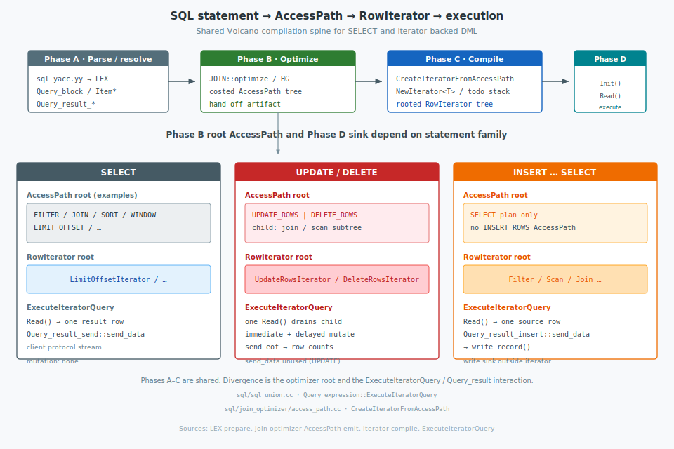

For many years, MySQL executed SQL queries using a deeply nested, monolithic executor loop. Functions like `JOIN::exec()` and `evaluate_join_record()` were responsible for traversing tables, checking search conditions, handling joins, and aggregating results. While functional, this monolithic architecture was notoriously difficult to maintain, optimize, or extend.

In MySQL 8.0, the engineering team undertook a massive architectural refactoring: **migrating the query execution engine to the Volcano Iterator Model** (also known as the Pipeline or Iterator Model, pioneered by Goetz Graefe in 1994).

In this post we examine the architecture of MySQL’s Volcano iterator model: how an AccessPath plan is compiled into a `RowIterator` tree; pull-based execution for `SELECT`, `UPDATE`/`DELETE`, and `INSERT … SELECT`; and a catalog of physical iterators with representative SQL examples.
<!--more-->


## 1. The Volcano Iterator Architecture

The core philosophy of the Volcano model is **composability**. Instead of one monolithic function doing everything, execution is split into a tree of highly specialized, modular **Iterators**. 

Each iterator represents a single physical execution step (e.g., scanning a table, filtering rows, performing a join, or sorting). Iterators are stacked in a parent-child relationship. The parent iterator pulls rows from its child iterators, processes them, and passes them up to its parent.

### The RowIterator Base Class (`sql/iterators/row_iterator.h`)

Every execution iterator in modern MySQL inherits from the abstract base class `RowIterator`. It defines a remarkably simple and elegant interface:

```cpp
class RowIterator {
 public:
  explicit RowIterator(THD *thd) : m_thd(thd) {}
  virtual ~RowIterator() = default;

  // Initialize or re-initialize the iterator (rewind or reposition)
  bool Init() {
    ++m_num_init_calls;
    return DoInit();
  }

  // Read a single row
  int Read() {
    const int error = DoRead();
    if (error == 0) {
      ++m_num_rows;
    } else if (error == -1) {
      ++m_num_full_reads;
    }
    return error;
  }

  virtual void SetNullRowFlag(bool is_null_row) = 0;
  virtual void UnlockRow() = 0;

 private:
  virtual bool DoInit() = 0; // Implemented by subclasses
  virtual int DoRead() = 0; // Implemented by subclasses
};
```

### Key Design Choice: Buffer-Centric Row Retrieval
In a pure Volcano model, `Read()` might return a `Row` object or a tuple. In MySQL, however, **`Read()` returns an integer error code (`0` for OK, `-1` for EOF, `1` for error)**. 

So, where is the row data?

To avoid expensive copying, allocation, and serialization overhead, MySQL uses a **buffer-centric design**. When `Read()` returns `0`, the row data is placed directly inside pre-allocated record buffers associated with the underlying tables (specifically, `table->record[0]`). Any parent iterator or expression-evaluation engine (e.g., a filter condition or projection) reads the columns directly from these in-place table buffers. This **zero-copy design** maximizes memory efficiency and cache friendliness.

---

## 2. From SQL statement to iterator tree

The Volcano compilation and execution pipeline applies to every statement whose run-time plan is represented by a `Query_expression` / `JOIN` rooted at an `AccessPath`: ordinary `SELECT` (and derived/source blocks), multi-table and hypergraph-optimized `UPDATE` / `DELETE`, and `INSERT … SELECT`. All such statements are lowered to a `RowIterator` tree and driven by the same `Init()` / `Read()` contract. Statement families differ in three places: the **AccessPath root** chosen by the optimizer, the attached **`Query_result`**, and whether mutation is performed **inside** a root mutation iterator or **outside** the iterator via `send_data`.



### Phase A — Parsing and semantic resolution

| Concern | Primary artifacts |
|---------|-------------------|
| Grammar reduction | `sql/sql_yacc.yy` → `LEX` |
| Statement structure | `Query_block`, `Query_expression` |
| Expressions | `Item` trees |
| Result / mutation sink | `Query_result_send`, `Query_result_update`, `Query_result_delete`, `Query_result_insert` |

The parser produces an abstract syntax tree. Resolution binds identifiers, applies semantic constraints (including `ONLY_FULL_GROUP_BY` where applicable), and for DML prepares target field lists together with the matching `Sql_cmd_*` and `Query_result_*` objects. No `RowIterator` exists yet.

### Phase B — Logical and physical optimization

`JOIN::optimize()` (classical planner) or the hypergraph optimizer enumerates join order, access methods, and costs. The durable product of this phase is an **`AccessPath`** tree (`sql/join_optimizer/access_path.h`), not iterator instances.

Common operator nodes include `TABLE_SCAN`, `INDEX_RANGE_SCAN`, `FILTER`, `NESTED_LOOP_JOIN`, `HASH_JOIN`, `SORT`, and `WINDOW`. For iterator-backed DML the planner may wrap the candidate-producing subtree:

| Statement family | Characteristic AccessPath root |
|------------------|--------------------------------|
| `SELECT` and derived sources | scan / join / sort / window / limit as required |
| `UPDATE` | `UPDATE_ROWS` over the candidate subtree |
| `DELETE` | `DELETE_ROWS` over the candidate subtree |
| `INSERT … SELECT` | SELECT-style plan only (no `INSERT_ROWS` node) |

### Phase C — Compilation to iterators

`CreateIteratorFromAccessPath()` (`sql/join_optimizer/access_path.cc`) walks the AccessPath graph and instantiates `RowIterator` subclasses via `NewIterator<T>()`. Deep plans are compiled with a MEM_ROOT-backed `todo` stack so that compilation does not rely on unbounded C++ recursion:

```cpp
unique_ptr_destroy_only<RowIterator> CreateIteratorFromAccessPath(
    THD *thd, MEM_ROOT *mem_root, AccessPath *top_path, JOIN *top_join,
    bool top_eligible_for_batch_mode) {

  unique_ptr_destroy_only<RowIterator> ret;
  Mem_root_array<IteratorToBeCreated> todo(mem_root);
  todo.push_back({top_path, top_join, top_eligible_for_batch_mode, &ret, {}});

  while (!todo.empty()) {
    IteratorToBeCreated job = todo.back();
    todo.pop_back();

    AccessPath *path = job.path;
    unique_ptr_destroy_only<RowIterator> iterator;
    // ...

    switch (path->type) {
      case AccessPath::TABLE_SCAN: {
        const auto &param = path->table_scan();
        iterator = NewIterator<TableScanIterator>(thd, mem_root, param.table, ...);
        break;
      }
      case AccessPath::FILTER: {
        // child compiled via the todo stack, then:
        iterator = NewIterator<FilterIterator>(
            thd, mem_root, std::move(child_iterator), path->filter().condition);
        break;
      }
      case AccessPath::NESTED_LOOP_JOIN: {
        iterator = NewIterator<NestedLoopIterator>(
            thd, mem_root, std::move(outer_iterator),
            std::move(inner_iterator), ...);
        break;
      }
      case AccessPath::UPDATE_ROWS:
      case AccessPath::DELETE_ROWS:
      case AccessPath::WINDOW:
        // … remaining AccessPath kinds …
        break;
    }
    // ...
  }
  return ret;  // ownership root of the nested iterator tree
}
```

The returned `unique_ptr` owns the full operator tree; releasing it reclaims the statement’s physical iterators.

### Phase D — Pull-based execution

Volcano execution is **demand-driven (pull-based)**. Control and data flow in opposite directions along the iterator edges:

```text
  demand (Read)     ──────────────────────►   toward the leaves
  rows in buffers   ◄──────────────────────   toward the root

  ExecuteIteratorQuery
        │  Read()
        ▼
  [ root iterator ]
        │  Read()          only when the parent needs another unit
        ▼
  [ child iterators … ]
        │
        ▼
  [ leaf scan / lookup ]
```

No operator pushes a complete result set into its parent. A parent **pulls** by calling `child->Read()`; the child may pull further until it returns `0` (row ready in table buffers), `-1` (EOF), or `1` (error). Leaves perform I/O only in response to those pulls. Early termination follows from refusing further pulls (for example `LIMIT` returning `-1`).

The shared driver is `Query_expression::ExecuteIteratorQuery()` (`sql/sql_union.cc`):

```cpp
// sql/sql_union.cc — ExecuteIteratorQuery() (structure)
if (m_root_iterator->Init()) return true;
for (;;) {
  int error = m_root_iterator->Read();   // one demand at the root
  if (error > 0 || thd->is_error()) return true;
  else if (error < 0) break;             // EOF: stop pulling
  if (query_result->send_data(thd, *fields)) return true;
}
return query_result->send_eof(thd);
```

How often that loop runs, and what `send_data` does, **differs sharply** among `SELECT`, `UPDATE`/`DELETE`, and `INSERT … SELECT`. The subtree remains pull-based in all cases; the **granularity of a root pull** and the **sink** do not.

#### `SELECT` — one root pull per result row

```text
ExecuteIteratorQuery loop
  Read(root) → 0     send_data → client      ⎫
  Read(root) → 0     send_data → client      ⎬  many iterations
  …                                          ⎭
  Read(root) → -1    break → send_eof
```

Each `Read() == 0` means exactly one client-visible row is present in table buffers. `Query_result_send::send_data` streams that row. Demand is paced by the consumer (and by operators such as `LimitOffsetIterator`).

#### `UPDATE` / `DELETE` — one root pull runs the whole mutation

With an `UPDATE_ROWS` / `DELETE_ROWS` root, the mutation iterator’s `DoRead()` **internally** pulls the child join row by row, applies immediate updates/deletes (and buffers delayed row IDs), then runs delayed mutation and returns `-1`. From the driver’s point of view there is typically **no** per-row root loop:

```text
ExecuteIteratorQuery loop
  Read(UpdateRowsIterator | DeleteRowsIterator)
        │
        │   inside DoRead():
        │     loop:  child->Read() → mutate / buffer this candidate
        │     DoDelayedUpdates / DoDelayedDeletes
        │     return -1
        ▼
  error == -1  →  break (send_data not used for UPDATE)
  send_eof()   →  found / updated / deleted counts
```

```cpp
// UpdateRowsIterator::DoRead() — pull of the child is inside one root Read()
while (!local_error) {
  const int read_error = m_source->Read();   // per-candidate pull
  if (read_error < 0) break;
  local_error = DoImmediateUpdatesAndBufferRowIds(...);
}
DoDelayedUpdates(...);
return local_error ? 1 : -1;                 // EOF to ExecuteIteratorQuery
```

`Query_result_update::send_data` is unused (`assert(false)`). Row counts are taken from the mutation iterator in `send_eof()`. Thus UPDATE/DELETE are **not** “one root pull = one updated row” the way SELECT is one root pull per result row; pull applies **inside** the mutation operator.

#### `INSERT … SELECT` — one root pull per source row; write in `send_data`

There is no `INSERT_ROWS` iterator. The root is a SELECT-style tree. The driver again loops per row, but the sink inserts rather than returning tuples to the client:

```text
ExecuteIteratorQuery loop
  Read(SELECT root) → 0    Query_result_insert::send_data → write_record()
  Read(SELECT root) → 0    send_data → write_record()
  …
  Read(SELECT root) → -1   break → send_eof
```

Granularity matches SELECT at the driver (one pull ↔ one buffered source row). The side effect is `write_record()` inside `send_data`, not projection to the protocol.

#### Comparison

| | `SELECT` | `UPDATE` / `DELETE` (mutation root) | `INSERT … SELECT` |
|--|----------|----------------------------------------|-------------------|
| Root operator | Limit / join / scan / … | `UpdateRowsIterator` / `DeleteRowsIterator` | SELECT plan only |
| Driver `Read()` count | One per result row | Typically **one** call that finishes mutation | One per source row |
| Where child rows are pulled | By parents as each result is demanded | Inside mutation `DoRead()`’s loop | By parents as each source row is demanded |
| `send_data` | Protocol | Not used (UPDATE) | `write_record()` |
| Completes when | Root returns `-1` (e.g. EOF / LIMIT) | Mutation `DoRead()` returns `-1` after draining the child | Source root returns `-1` |

Shared invariant: **no child pushes**; every lower `Read()` is caused by an upper demand. Distinct policy: SELECT and INSERT pace the driver per row; UPDATE/DELETE collapse candidate consumption into a single root pull.

#### Example — `SELECT` tree under pull evaluation

```sql
SELECT employees.name, departments.name
FROM employees
JOIN departments ON employees.department_id = departments.id
WHERE employees.salary > 50000
LIMIT 10;
```

After Phases B–C the AccessPath tree is compiled to a rooted `RowIterator` network of the following shape (operator choices may vary with statistics and indexes):

```text
               [ LimitOffsetIterator ]     root: enforce LIMIT 10
                         │
                 [ FilterIterator ]        WHERE salary > 50000
                         │
               [ NestedLoopIterator ]      INNER JOIN
                /                  \
   [ TableScanIterator ]    [ EQRefIterator | RefIterator ]
     employees (outer)         departments (inner, on id)
```

Each client-visible row is one **successful root pull**; that demand recursively induces child pulls only along the path needed for that row:

1. The driver calls `Read()` on `LimitOffsetIterator` (one demand for one output row while `LIMIT` remains unsatisfied).
2. `LimitOffsetIterator` pulls once from `FilterIterator`.
3. `FilterIterator` pulls from `NestedLoopIterator` until `m_condition` accepts a joined row; rejected combinations are unlocked and the filter pulls again.
4. `NestedLoopIterator`, for each outer `employees` row it pulled, re-`Init()`s the inner lookup with `department_id` and pulls matching `departments` rows.
5. On acceptance, buffers hold the row; `send_data` streams projections to the client.
6. After ten accepted root returns, `LimitOffsetIterator` answers with `-1`. The driver stops; leaves are not pulled further—`LIMIT` truncates work because further demands never occur.

The same driver and edge discipline apply to UPDATE/DELETE and INSERT; only root granularity and the sink differ, as in the comparison above.

Phases A–C form a shared compilation spine. Phase D fixes evaluation as **parents pull, children produce on demand**, with statement-specific root pacing and `Query_result` behaviour.

---

## 3. Row iterators

`CreateIteratorFromAccessPath()` (`sql/join_optimizer/access_path.cc`) compiles each `AccessPath` node into a `RowIterator`. Generation always follows the same stack-driven pattern: push children onto a MEM_ROOT `todo` list, construct the operator with `NewIterator<T>(…)` (or a dedicated factory), then attach it as `path->iterator`.

```cpp
// access_path.cc — shared compile skeleton
switch (path->type) {
  case AccessPath::…: {
    if (job.children.is_null()) {
      SetupJobsForChildren(...);  // compile inputs first
      continue;
    }
    iterator = NewIterator<ConcreteIterator>(thd, mem_root, ...);
    break;
  }
}
path->iterator = iterator.get();
```

Execution is always pull-based: `DoInit()` prepares state; each `DoRead()` returns `0` (row in buffers), `-1` (EOF), or `1` (error). The subsections below keep that contract and, for every iterator, give usage SQL, the generation call, and the core of `DoRead` / `DoInit`.

### 3.1 Table-access leaves

**Family generation.** Leaves have no AccessPath children; the switch constructs the iterator directly from `path->*()` parameters (`table`, `idx`, `ref`, …).

#### `TableScanIterator` (`TABLE_SCAN`)

Full table (heap / clustered) scan via `ha_rnd_next`.

```sql
SELECT * FROM employees;
```

```cpp
// Generation — access_path.cc
iterator = NewIterator<TableScanIterator>(
    thd, mem_root, param.table, path->num_output_rows(), examined_rows);
```

```cpp
// Execution — basic_row_iterators.cc
int TableScanIterator::DoRead() {
  int tmp;
  while ((tmp = table()->file->ha_rnd_next(m_record))) {
    if (tmp == HA_ERR_RECORD_DELETED && !thd()->killed) continue;
    return HandleError(tmp);
  }
  if (m_examined_rows != nullptr) ++*m_examined_rows;
  return 0;
}
```

#### `IndexScanIterator` (`INDEX_SCAN`)

Full scan of one index (`ha_index_first` / `ha_index_next`), optionally ordered.

```sql
SELECT * FROM employees FORCE INDEX (idx_hired) ORDER BY hired_at;
```

```cpp
iterator = NewIterator<IndexScanIterator</*reverse=*/false>>(
    thd, mem_root, param.table, param.idx, param.use_order,
    path->num_output_rows(), examined_rows);
```

```cpp
int IndexScanIterator<false>::DoRead() {
  int error = m_first ? table()->file->ha_index_first(m_record)
                      : table()->file->ha_index_next(m_record);
  m_first = false;
  if (error) return HandleError(error);
  if (m_examined_rows != nullptr) ++*m_examined_rows;
  return 0;
}
```

#### `IndexDistanceScanIterator` (`INDEX_DISTANCE_SCAN`)

Index probe constrained by a distance / MBR style key range (e.g. vector or spatial distance plans).

```sql
-- plans that use vector / distance index access (engine-dependent)
SELECT id FROM embeddings
ORDER BY DISTANCE(vec, @q) LIMIT 10;
```

```cpp
iterator = NewIterator<IndexDistanceScanIterator>(
    thd, mem_root, param.table, param.idx, param.range,
    path->num_output_rows(), examined_rows);
```

```cpp
int IndexDistanceScanIterator::DoRead() {
  int error = m_first
      ? table()->file->ha_index_read_map(
            m_record, m_query_mbr->min_key, m_query_mbr->min_keypart_map,
            m_query_mbr->rkey_func_flag)
      : table()->file->ha_index_next_same(
            m_record, m_query_mbr->min_key, m_query_mbr->min_length);
  m_first = false;
  if (error) return HandleError(error);
  return 0;
}
```

#### `RefIterator` (`REF`)

Non-unique equality ref: `ha_index_read_map(…, HA_READ_KEY_EXACT)` then `ha_index_next_same`.

```sql
SELECT * FROM employees WHERE department_id = 7;
```

```cpp
iterator = NewIterator<RefIterator</*reverse=*/false>>(
    thd, mem_root, param.table, param.ref, param.use_order,
    path->num_output_rows(), examined_rows);
```

```cpp
int RefIterator<false>::DoRead() {
  if (m_first_record_since_init) {
    m_first_record_since_init = false;
    if (construct_lookup(thd(), table(), m_ref)) return -1;
    int error = table()->file->ha_index_read_map(
        table()->record[0], key_buff, key_part_map, HA_READ_KEY_EXACT);
    if (error) return HandleError(error);
  } else {
    int error = table()->file->ha_index_next_same(
        table()->record[0], m_ref->key_buff, m_ref->key_length);
    if (error) return HandleError(error);
  }
  return 0;
}
```

#### `EQRefIterator` (`EQ_REF`)

Unique / PK equality; at most one row per `Init`/`Read` cycle (often caches the key).

```sql
SELECT * FROM employees WHERE id = 42;
```

```cpp
iterator = NewIterator<EQRefIterator>(thd, mem_root, param.table, param.ref,
                                      examined_rows);
```

```cpp
int EQRefIterator::DoRead() {
  if (!m_first_record_since_init) return -1;  // already returned the unique row
  m_first_record_since_init = false;
  m_ref->key_err = construct_lookup(thd(), table(), m_ref);
  if (m_ref->key_err) return -1;
  // ha_index_read_map(..., HA_READ_KEY_EXACT) when the key changed or uncached
  return 0;
}
```

#### `RefOrNullIterator` (`REF_OR_NULL`)

Matches `ref` keys, then retries with the NULL key part set (`OR … IS NULL` strategy).

```sql
SELECT * FROM employees WHERE manager_id = 5 OR manager_id IS NULL;
```

```cpp
iterator = NewIterator<RefOrNullIterator>(
    thd, mem_root, param.table, param.ref, param.use_order,
    path->num_output_rows(), examined_rows);
```

```cpp
int RefOrNullIterator::DoRead() {
  // first: ha_index_read_map exact; then ha_index_next_same
  // on EOF, if null key not yet tried: set *null_ref_key and recurse Read()
}
```

#### `PushedJoinRefIterator` (`PUSHED_JOIN_REF`)

Ref lookup pushed into an engine that supports multi-table pushed joins (`ha_index_read_pushed` / `ha_index_next_pushed`).

```sql
-- when the SE accepts a pushed join ref (e.g. NDB-style pushdown)
SELECT e.*, d.* FROM employees e JOIN departments d ON e.department_id = d.id;
```

```cpp
iterator = NewIterator<PushedJoinRefIterator>(
    thd, mem_root, param.table, param.ref, param.use_order, param.is_unique,
    examined_rows);
```

```cpp
int PushedJoinRefIterator::DoRead() {
  if (m_first_record_since_init) {
    construct_lookup(thd(), table(), m_ref);
    int error = table()->file->ha_index_read_pushed(...);
    if (error) return HandleError(error);
  } else if (!m_is_unique) {
    int error = table()->file->ha_index_next_pushed(table()->record[0]);
    if (error) return HandleError(error);
  } else return -1;
  return 0;
}
```

#### `FullTextSearchIterator` (`FULL_TEXT_SEARCH`)

```sql
SELECT * FROM docs WHERE MATCH(body) AGAINST ('volcano' IN NATURAL LANGUAGE MODE);
```

```cpp
iterator = NewIterator<FullTextSearchIterator>(
    thd, mem_root, param.table, param.ref, param.ft_func, param.use_order,
    examined_rows);
```

```cpp
int FullTextSearchIterator::DoRead() {
  int error = table()->file->ha_ft_read(table()->record[0]);
  if (error) return HandleError(error);
  return 0;
}
```

#### `ConstIterator` (`CONST_TABLE`)

One const row already resolved; a single successful `Read()` then EOF.

```sql
SELECT * FROM employees WHERE id = 1;  -- may be optimized to const table access
```

```cpp
iterator = NewIterator<ConstIterator>(thd, mem_root, param.table, param.ref,
                                      examined_rows);
```

```cpp
int ConstIterator::DoRead() {
  if (!m_first_record_since_init) return -1;
  m_first_record_since_init = false;
  int err = read_const(table(), m_ref);
  table()->const_table = true;
  return err;
}
```

#### `FollowTailIterator` (`FOLLOW_TAIL`)

Reads newly appended rows of a working table (recursive CTE / seed-worktable iteration) without overrunning SE EOF.

```sql
WITH RECURSIVE tree AS (
  SELECT id, parent_id FROM org WHERE parent_id IS NULL
  UNION ALL
  SELECT o.id, o.parent_id FROM org o JOIN tree t ON o.parent_id = t.id
)
SELECT * FROM tree;
```

```cpp
iterator = NewIterator<FollowTailIterator>(
    thd, mem_root, param.table, path->num_output_rows(), examined_rows);
```

```cpp
int FollowTailIterator::DoRead() {
  if (m_read_rows == *m_stored_rows) return -1;
  int err = table()->file->ha_rnd_next(m_record);
  if (err) return HandleError(err);
  ++m_read_rows;
  return 0;
}
```

#### `SAMPLE_SCAN`

Handled only in a secondary engine; the primary `CreateIteratorFromAccessPath` path asserts and does not build a server-side sample iterator.

---

### 3.2 Range, MRR, and row-id combination

**Family generation.** Range trees often nest quick-select objects; MRR paths are also wired under `BKA_JOIN` by discovering the child’s `AccessPath::MRR` node.

#### `IndexRangeScanIterator` (`INDEX_RANGE_SCAN`)

(Also `ReverseIndexRangeScanIterator`, `GeometryIndexRangeScanIterator`.)

```sql
SELECT * FROM employees WHERE hired_at BETWEEN '2020-01-01' AND '2020-12-31';
```

```cpp
iterator = NewIterator<IndexRangeScanIterator>(
    thd, mem_root, param.table, ..., examined_rows);
```

```cpp
int IndexRangeScanIterator::DoRead() {
  char *dummy;
  int result = file->ha_multi_range_read_next(&dummy);
  if (result == 0) {
    if (m_examined_rows != nullptr) ++*m_examined_rows;
    return 0;
  }
  return HandleError(result);
}
```

#### `MultiRangeRowIterator` (`MRR`)

Inner reader for BKA: `ha_multi_range_read_next`, then load matching outer buffers.

```sql
-- appears under BKA_JOIN plans
SELECT o.*, c.name FROM orders o STRAIGHT_JOIN customers c
  ON o.customer_id = c.id;
```

```cpp
iterator = NewIterator<MultiRangeRowIterator>(...);  // from AccessPath::MRR
```

```cpp
int MultiRangeRowIterator::DoRead() {
  BufferRow *rec_ptr = nullptr;
  int error = m_file->ha_multi_range_read_next(pointer_cast<char **>(&rec_ptr));
  if (error != 0) return HandleError(error);
  LoadIntoTableBuffers(m_outer_input_tables, ...);
  return 0;
}
```

#### `DynamicRangeIterator` (`DYNAMIC_INDEX_RANGE_SCAN`)

`DoInit` rebuilds a range (or falls back) from the current outer row; `DoRead` delegates.

```sql
SELECT * FROM departments d
WHERE EXISTS (
  SELECT 1 FROM employees e
  WHERE e.department_id = d.id
    AND e.salary BETWEEN d.min_pay AND d.max_pay
);
```

```cpp
iterator = NewIterator<DynamicRangeIterator>(
    thd, mem_root, param.table, param.qep_tab, examined_rows);
```

```cpp
int DynamicRangeIterator::DoRead() {
  if (m_iterator == nullptr) return -1;
  return m_iterator->Read();  // child range or table scan rebuilt in DoInit
}
```

#### `IndexMergeIterator` (`INDEX_MERGE`)

```sql
SELECT * FROM employees
WHERE department_id = 1 OR last_name = 'Smith';
```

```cpp
iterator = NewIterator<IndexMergeIterator>(...);
```

```cpp
int IndexMergeIterator::DoRead() {
  if (doing_pk_scan) return pk_quick_select->Read();
  int result = read_record->Read();
  if (result == -1 && pk_quick_select) {
    doing_pk_scan = true;
    if (pk_quick_select->Init()) return 1;
    return pk_quick_select->Read();
  }
  return result;
}
```

#### `RowIDIntersectionIterator` / `RowIDUnionIterator` (`ROWID_INTERSECTION` / `ROWID_UNION`)

```sql
-- index_merge intersection / union style plans
SELECT * FROM t WHERE a = 1 AND b = 2;  -- may intersect two range streams
SELECT * FROM t WHERE a = 1 OR b = 2;   -- may union row-id streams
```

```cpp
iterator = NewIterator<RowIDIntersectionIterator>(...);
iterator = NewIterator<RowIDUnionIterator>(...);
```

```cpp
// Intersection: advance children until rowids match
int RowIDIntersectionIterator::DoRead() {
  for (;;) {
    if (int error = m_children[current_child_idx]->Read(); error != 0)
      return error;
    // compare / align rowids across children; unlock mismatches
  }
}
```

#### `IndexSkipScanIterator` (`INDEX_SKIP_SCAN`)

```sql
SELECT DISTINCT department_id FROM employees;  -- loose index scan / skip scan
```

```cpp
iterator = NewIterator<IndexSkipScanIterator>(...);
```

```cpp
int IndexSkipScanIterator::DoRead() {
  // ha_index_first / index_next_different over distinct prefix,
  // then scan within the prefix range
}
```

#### `GroupIndexSkipScanIterator` (`GROUP_INDEX_SKIP_SCAN`)

```sql
SELECT department_id, MIN(salary), MAX(salary)
FROM employees GROUP BY department_id;
```

```cpp
iterator = NewIterator<GroupIndexSkipScanIterator>(...);
```

```cpp
int GroupIndexSkipScanIterator::DoRead() {
  if (m_seen_eof) return -1;
  result = next_prefix();
  reset_group();
  while (!append_next_infix()) { /* accumulate MIN/MAX for the group */ }
  return 0;
}
```

---

### 3.3 Synthetic and empty producers

#### `TableValueConstructorIterator` (`TABLE_VALUE_CONSTRUCTOR`)

```sql
SELECT * FROM (VALUES ROW(1, 'a'), ROW(2, 'b')) AS v(id, name);
```

```cpp
iterator = NewIterator<TableValueConstructorIterator>(
    thd, mem_root, examined_rows, *query_block->row_value_list,
    path->table_value_constructor().output_refs);
```

```cpp
int TableValueConstructorIterator::DoRead() {
  if (m_row_it == m_row_value_list.end()) return -1;
  if (m_output_refs != nullptr) {
    for (const Item *value : **m_row_it)
      ref->set_value(const_cast<Item *>(value));
  }
  ++m_row_it;
  return 0;
}
```

#### `FakeSingleRowIterator` (`FAKE_SINGLE_ROW`)

```sql
-- scaffolding for scalar / dual-style one-row projections in subplans
SELECT (SELECT COUNT(*) FROM employees WHERE department_id = d.id)
FROM departments d;
```

```cpp
iterator = NewIterator<FakeSingleRowIterator>(thd, mem_root, examined_rows);
```

```cpp
int FakeSingleRowIterator::DoRead() {
  if (m_has_row) { m_has_row = false; return 0; }
  return -1;
}
```

#### `ZeroRowsIterator` (`ZERO_ROWS`)

```sql
SELECT * FROM employees WHERE 1 = 0;
```

```cpp
iterator = NewIterator<ZeroRowsIterator>(thd, mem_root, CollectTables(thd, path));
```

```cpp
int ZeroRowsIterator::DoRead() override { return -1; }
```

#### `ZeroRowsAggregatedIterator` (`ZERO_ROWS_AGGREGATED`)

```sql
SELECT COUNT(*) FROM employees WHERE 1 = 0;  -- one row: 0
```

```cpp
iterator = NewIterator<ZeroRowsAggregatedIterator>(thd, mem_root, join, examined_rows);
```

```cpp
int ZeroRowsAggregatedIterator::DoRead() {
  if (!m_has_row) return -1;
  for (Item *item : *m_join->fields) item->no_rows_in_result();
  m_has_row = false;
  return 0;
}
```

#### `UnqualifiedCountIterator` (`UNQUALIFIED_COUNT`)

```sql
SELECT COUNT(*) FROM employees;
```

```cpp
iterator = NewIterator<UnqualifiedCountIterator>(thd, mem_root, join);
```

```cpp
int UnqualifiedCountIterator::DoRead() {
  if (!m_has_row) return -1;
  // Item_sum_count::make_const(get_exact_record_count(...))
  m_has_row = false;
  return 0;
}
```

#### `MaterializedTableFunctionIterator` (`MATERIALIZED_TABLE_FUNCTION`)

```sql
SELECT * FROM JSON_TABLE('[{"a":1},{"a":2}]', '$[*]'
  COLUMNS (a INT PATH '$.a')) AS jt;
```

```cpp
iterator = NewIterator<MaterializedTableFunctionIterator>(
    thd, mem_root, param.table_function, param.table, std::move(child));
```

```cpp
bool MaterializedTableFunctionIterator::DoInit() {
  if (m_table_function->fill_result_table()) return true;
  return m_table_iterator->Init();
}
int DoRead() { return m_table_iterator->Read(); }
```

---

### 3.4 Joins

**Family generation.** Two children (`outer`, `inner`) are compiled first; join type and predicates come from the AccessPath / `JoinPredicate`.

#### `NestedLoopIterator` (`NESTED_LOOP_JOIN`)

```sql
SELECT e.name, d.name
FROM employees e
JOIN departments d ON e.department_id = d.id;
```

```cpp
iterator = NewIterator<NestedLoopIterator>(
    thd, mem_root, std::move(outer), std::move(inner),
    param.join_type, param.pfs_batch_mode);
```

```cpp
int NestedLoopIterator::DoRead() {
  for (;;) {
    if (m_state == NEEDS_OUTER_ROW) {
      int err = m_source_outer->Read();
      if (err == -1) { m_state = END_OF_ROWS; return -1; }
      if (m_source_inner->Init()) return 1;
      m_state = READING_FIRST_INNER_ROW;
    }
    int err = m_source_inner->Read();
    if (err == -1) {
      if (m_join_type == JoinType::OUTER && m_state == READING_FIRST_INNER_ROW) {
        m_source_inner->SetNullRowFlag(true);
        m_state = NEEDS_OUTER_ROW;
        return 0;
      }
      m_state = NEEDS_OUTER_ROW;
      continue;
    }
    if (m_join_type == JoinType::SEMI) m_state = NEEDS_OUTER_ROW;
    else m_state = READING_INNER_ROWS;
    return 0;
  }
}
```

#### `NestedLoopSemiJoinWithDuplicateRemovalIterator`

```sql
SELECT * FROM departments d
WHERE EXISTS (
  SELECT 1 FROM employees e WHERE e.department_id = d.id AND e.active = 1
);
```

```cpp
iterator = NewIterator<NestedLoopSemiJoinWithDuplicateRemovalIterator>(
    thd, mem_root, std::move(outer), std::move(inner),
    param.table, param.key, param.key_len);
```

```cpp
int NestedLoopSemiJoinWithDuplicateRemovalIterator::DoRead() {
  for (;;) {
    // skip outer rows with the same join key as the previous emission
    int err = m_source_outer->Read();
    if (m_source_inner->Init()) return 1;
    err = m_source_inner->Read();
    if (err == -1) continue;          // no match
    key_copy(m_key_buf, ...);         // remember outer key
    return 0;                         // first match only
  }
}
```

#### `HashJoinIterator` (`HASH_JOIN`)

```sql
SELECT o.id, c.name
FROM orders o JOIN customers c ON o.customer_id = c.id;
```

```cpp
iterator = NewIterator<HashJoinIterator>(
    thd, mem_root, std::move(outer), std::move(inner),
    /*build=*/inner estimate, conditions, extra_conditions, join_type, ...);
```

```cpp
int HashJoinIterator::DoRead() {
  for (;;) {
    switch (m_state) {
      case State::LOADING_NEXT_CHUNK_PAIR:
        if (ReadNextHashJoinChunk()) return 1; break;       // build
      case State::READING_ROW_FROM_PROBE_ITERATOR:
        if (ReadRowFromProbeIterator()) return 1; break;    // probe
      case State::READING_FROM_HASH_TABLE: {
        const int res = ReadNextJoinedRowFromHashTable();
        if (res == 0) return 0;
        if (res == -1) continue;
        return res;
      }
      case State::END_OF_ROWS: return -1;
    }
  }
}
```

#### `BKAIterator` (`BKA_JOIN`)

```sql
SELECT o.*, c.name FROM orders o JOIN customers c ON o.customer_id = c.id;
-- EXPLAIN may show Batched Key Access; inner path includes MRR
```

```cpp
iterator = NewIterator<BKAIterator>(
    thd, mem_root, std::move(outer), outer_tables, std::move(inner),
    join_buff_size, ..., mrr_iterator, param.join_type);
```

```cpp
int BKAIterator::DoRead() {
  for (;;) {
    switch (m_state) {
      case State::NEED_OUTER_ROWS:
        if (int err = ReadOuterRows(); err != 0) return err;  // fill buffer + MRR
        break;
      case State::RETURNING_JOINED_ROWS: {
        int err = m_inner_input->Read();  // MultiRangeRowIterator
        if (err != -1) return err;
        BatchFinished();
        break;
      }
    }
  }
}
```

---

### 3.5 Filter, sort, aggregate, limit

#### `FilterIterator` (`FILTER`)

```sql
SELECT * FROM employees WHERE salary > 50000;
```

```cpp
iterator = NewIterator<FilterIterator>(
    thd, mem_root, std::move(child), path->filter().condition);
```

```cpp
int FilterIterator::DoRead() {
  for (;;) {
    int err = m_source->Read();
    if (err != 0) return err;
    if (!m_condition->val_int()) { m_source->UnlockRow(); continue; }
    return 0;
  }
}
```

#### `SortingIterator` (`SORT`)

```sql
SELECT * FROM employees ORDER BY last_name, first_name;
```

```cpp
iterator = NewIterator<SortingIterator>(
    thd, mem_root, std::move(child), param.filesort, ...);
```

```cpp
bool SortingIterator::DoInit() {
  if (DoSort()) return true;           // filesort into buffer/file
  // build SortBufferIterator / SortFileIterator as m_result_iterator
  return m_result_iterator->Init();
}
int SortingIterator::DoRead() { return m_result_iterator->Read(); }
```

#### `AggregateIterator` (`AGGREGATE`)

```sql
SELECT department_id, AVG(salary) FROM employees GROUP BY department_id;
```

```cpp
iterator = NewIterator<AggregateIterator>(
    thd, mem_root, std::move(child), join, ...);
```

```cpp
int AggregateIterator::DoRead() {
  switch (m_state) {
    case READING_FIRST_ROW: {
      int err = m_source->Read();
      // start new group / emit aggregated row when group key changes
      ...
    }
  }
}
```

#### Temptable aggregate (`TEMPTABLE_AGGREGATE`)

```sql
SELECT department_id, COUNT(*) FROM employees GROUP BY department_id;
-- may materialize groups in a temp table when streaming aggregation is not used
```

```cpp
iterator = temptable_aggregate_iterator::CreateIterator(
    thd, mem_root, std::move(child), ...);
```

Execution: materialize aggregated rows into a temporary table during `DoInit` / first read cycle, then scan that table on subsequent `DoRead` pulls (same pattern as materialize-then-scan).

#### `LimitOffsetIterator` (`LIMIT_OFFSET`)

```sql
SELECT * FROM employees ORDER BY hired_at DESC LIMIT 10 OFFSET 20;
```

```cpp
iterator = NewIterator<LimitOffsetIterator>(
    thd, mem_root, std::move(child), limit, offset, ...);
```

```cpp
int LimitOffsetIterator::DoRead() {
  // skip OFFSET rows (UnlockRow), then
  if (m_seen_rows >= m_limit) return -1;
  return m_source->Read();
}
```

---

### 3.6 Materialization, stream, append, information schema

#### `MaterializeIterator` (`MATERIALIZE`)

```sql
SELECT * FROM (
  SELECT department_id, COUNT(*) AS c FROM employees GROUP BY department_id
) AS t WHERE t.c > 10;
```

```cpp
iterator = materialize_iterator::CreateIterator(
    thd, mem_root, std::move(operands), ..., std::move(table_iterator), ...);
```

```cpp
bool MaterializeIterator::DoInit() {
  // rematerialize operands into the temporary table if needed
  return m_table_iterator->Init();
}
int MaterializeIterator::DoRead() { return m_table_iterator->Read(); }
```

#### `StreamingIterator` (`STREAM`)

```sql
-- streaming into a temp table / window / distinct spill without a full barrier
SELECT DISTINCT last_name FROM employees;
```

```cpp
iterator = NewIterator<StreamingIterator>(
    thd, mem_root, std::move(child), join, temp_table_param, ...);
```

```cpp
int StreamingIterator::DoRead() {
  int error = m_subquery_iterator->Read();
  if (error != 0) return error;
  if (copy_funcs(m_temp_table_param, thd())) return 1;
  return 0;
}
```

#### `AppendIterator` (`APPEND`)

```sql
SELECT id FROM employees
UNION ALL
SELECT id FROM contractors;
```

```cpp
iterator = NewIterator<AppendIterator>(thd, mem_root, std::move(children));
```

```cpp
int AppendIterator::DoRead() {
  if (m_current_iterator_index >= m_sub_iterators.size()) return -1;
  int err = m_sub_iterators[m_current_iterator_index]->Read();
  if (err != -1) return err;
  if (++m_current_iterator_index >= m_sub_iterators.size()) return -1;
  if (m_sub_iterators[m_current_iterator_index]->Init()) return 1;
  return Read();
}
```

#### `MaterializeInformationSchemaTableIterator`

```sql
SELECT * FROM information_schema.tables WHERE table_schema = 'app';
```

```cpp
iterator = NewIterator<MaterializeInformationSchemaTableIterator>(
    thd, mem_root, std::move(table_iterator), table_list, condition);
```

```cpp
bool MaterializeInformationSchemaTableIterator::DoInit() {
  if (!m_table_list->schema_table_filled) {
    do_fill_information_schema_table(thd(), m_table_list, m_condition);
    m_table_list->schema_table_filled = true;
  }
  return m_table_iterator->Init();
}
int DoRead() { return m_table_iterator->Read(); }
```

---

### 3.7 Windows and duplicate elimination

#### `WindowIterator` (`WINDOW`, `needs_buffering = false`)

```sql
SELECT department_id, name, salary,
       ROW_NUMBER() OVER (PARTITION BY department_id ORDER BY salary DESC) AS rn
FROM employees;
```

```cpp
iterator = NewIterator<WindowIterator>(
    thd, mem_root, std::move(child), param.temp_table_param, join, param.ref_slice);
```

```cpp
int WindowIterator::DoRead() {
  int err = m_source->Read();
  if (err != 0) return err;
  if (copy_funcs(m_temp_table_param, thd(), CFT_HAS_NO_WF)) return 1;
  m_window->check_partition_boundary();
  if (copy_funcs(m_temp_table_param, thd(), CFT_WF)) return 1;
  return 0;
}
```

#### `BufferingWindowIterator` (`WINDOW`, `needs_buffering = true`)

```sql
SELECT department_id, salary,
       AVG(salary) OVER (
         PARTITION BY department_id ORDER BY salary
         ROWS BETWEEN 1 PRECEDING AND 1 FOLLOWING) AS local_avg
FROM employees;
```

```cpp
iterator = NewIterator<BufferingWindowIterator>(
    thd, mem_root, std::move(child), param.temp_table_param, join, param.ref_slice);
```

```cpp
int BufferingWindowIterator::DoRead() {
  // emit already-buffered frame rows, else pull source,
  // buffer_windowing_record(), on partition/EOF process_buffered_windowing_record()
  // and bring_back_frame_row()
}
```

#### `WeedoutIterator` (`WEEDOUT`)

```sql
SELECT * FROM departments d
WHERE d.id IN (SELECT department_id FROM employees WHERE active = 1);
```

```cpp
iterator = NewIterator<WeedoutIterator>(
    thd, mem_root, std::move(child), param.weedout_table,
    param.tables_to_get_rowid_for);
```

```cpp
int WeedoutIterator::DoRead() {
  for (;;) {
    int ret = m_source->Read();
    if (ret != 0) return ret;
    ret = do_sj_dups_weedout(thd(), m_sj);
    if (ret == 0) return 0;   // first time this row-id set is seen
  }
}
```

#### `RemoveDuplicatesIterator` (`REMOVE_DUPLICATES`)

```sql
SELECT DISTINCT last_name FROM employees;
```

```cpp
iterator = NewIterator<RemoveDuplicatesIterator>(
    thd, mem_root, std::move(child), join, ...);
```

```cpp
int RemoveDuplicatesIterator::DoRead() {
  for (;;) {
    int err = m_source->Read();
    if (err != 0) return err;
    bool any_changed = false;
    for (Cached_item *cache : m_caches) any_changed |= cache->cmp();
    if (m_first_row || any_changed) { m_first_row = false; return 0; }
  }
}
```

#### `RemoveDuplicatesOnIndexIterator` (`REMOVE_DUPLICATES_ON_INDEX`)

```sql
SELECT DISTINCT department_id FROM employees FORCE INDEX (idx_dept);
```

```cpp
iterator = NewIterator<RemoveDuplicatesOnIndexIterator>(
    thd, mem_root, std::move(child), table, key, key_len);
```

```cpp
int RemoveDuplicatesOnIndexIterator::DoRead() {
  for (;;) {
    int err = m_source->Read();
    if (err != 0) return err;
    if (!m_first_row && key_cmp(m_key->key_part, m_key_buf, m_key_len, false) == 0)
      continue;
    key_copy(m_key_buf, m_table->record[0], m_key, m_key_len);
    return 0;
  }
}
```

---

### 3.8 Alternative plans and cache invalidation

#### `AlternativeIterator` (`ALTERNATIVE`)

```sql
SELECT * FROM employees WHERE email = 'a@example.com';
-- EXPLAIN may show Alternative plans (ref vs table scan guards)
```

```cpp
iterator = NewIterator<AlternativeIterator>(
    thd, mem_root, table, std::move(child0), std::move(child1), used_ref);
```

```cpp
bool AlternativeIterator::DoInit() {
  m_iterator = m_source_iterator.get();
  for (bool *cond_guard : m_applicable_cond_guards)
    if (!*cond_guard) { m_iterator = m_table_scan_iterator.get(); break; }
  return m_iterator->Init();
}
int DoRead() { return m_iterator->Read(); }
```

#### `CacheInvalidatorIterator` (`CACHE_INVALIDATOR`)

```sql
SELECT * FROM departments d
WHERE EXISTS (
  SELECT 1 FROM employees e
  WHERE e.department_id = d.id AND e.salary > d.budget
);
```

```cpp
iterator = NewIterator<CacheInvalidatorIterator>(
    thd, mem_root, std::move(child), param.name);
```

```cpp
bool CacheInvalidatorIterator::DoInit() {
  ++m_generation;                 // invalidate named join cache
  return m_source_iterator->Init();
}
int DoRead() {
  ++m_generation;
  return m_source_iterator->Read();
}
```

---

### 3.9 DML mutation iterators and the INSERT sink

#### `UpdateRowsIterator` (`UPDATE_ROWS`)

```sql
UPDATE employees e
JOIN departments d ON e.department_id = d.id
SET e.salary = e.salary * 1.05
WHERE d.name = 'Engineering';
```

```cpp
iterator = CreateUpdateRowsIterator(thd, mem_root, join, std::move(child));
// → NewIterator<UpdateRowsIterator>(..., source, immediate_table, ...)
```

```cpp
int UpdateRowsIterator::DoRead() {
  while (!local_error) {
    const int read_error = m_source->Read();
    if (read_error < 0) break;
    local_error = DoImmediateUpdatesAndBufferRowIds(...);
  }
  DoDelayedUpdates(...);
  return local_error ? 1 : -1;   // one root pull completes the statement
}
```

#### `DeleteRowsIterator` (`DELETE_ROWS`)

```sql
DELETE e FROM employees e
JOIN departments d ON e.department_id = d.id
WHERE d.name = 'Legacy';
```

```cpp
iterator = NewIterator<DeleteRowsIterator>(
    thd, mem_root, std::move(child), join,
    param.tables_to_delete_from, param.immediate_tables);
```

```cpp
int DeleteRowsIterator::DoRead() {
  while (true) {
    const int read_error = m_source->Read();
    if (read_error < 0) break;
    if (DoImmediateDeletesAndBufferRowIds()) { local_error = true; break; }
  }
  if (m_has_delayed_deletes) DoDelayedDeletes();
  return local_error ? 1 : -1;
}
```

#### `Query_result_insert` (no `INSERT_ROWS` AccessPath)

```sql
INSERT INTO archive_employees (id, name, department_id)
SELECT id, name, department_id FROM employees
WHERE hired_at < '2020-01-01';
```

Generation: prepare installs `Query_result_insert`; the SELECT plan is compiled normally. Execution uses the Phase D per-row pull loop:

```cpp
// ExecuteIteratorQuery
for (;;) {
  int error = m_root_iterator->Read();     // SELECT iterators
  if (error < 0) break;
  if (query_result->send_data(thd, *fields)) return true;
}
// Query_result_insert::send_data → store_values → write_record()
```

---

## 4. Design consequences

The iterator factorization yields several operational properties:

1. **Composition.** New physical operators are added as `RowIterator` subclasses wired from `AccessPath` (as with `HashJoinIterator`, `UpdateRowsIterator`, and `DeleteRowsIterator`) without rewriting the `ExecuteIteratorQuery` driver.
2. **Pull-based early termination.** Ancestors such as `LimitOffsetIterator` stop calling `Read()` on their children once quotas are met, so leaf I/O ceases for that statement.
3. **Per-operator profiling.** `TimingIterator` (and related wrappers) can decorate any subtree for `EXPLAIN ANALYZE` without changing operator semantics.

---

## Summary

Section 3 enumerates the AccessPath → `RowIterator` map with SQL examples. Wrapper iterators used for instrumentation (notably `TimingIterator` for `EXPLAIN ANALYZE`) decorate those operators without introducing a separate AccessPath kind.

---

The Volcano iterator model is a modular, pull-based execution framework: AccessPath plans compile to `RowIterator` trees shared by read queries and iterator-backed DML, with statement-specific root pacing and `Query_result` sinks as described in §2 Phase D.
