**StarRocks** is a MySQL-compatible MPP OLAP engine. A cluster is **Frontend (FE)** nodes for metadata and query coordination plus **Backend (BE)** or **Compute Node (CN)** workers for execution. This post follows **FE query planning**—logical plan, Cascades optimize, fragmentize—and the **MPP** path through schedule, deploy, and result pull. Worker process internals are in [Backend and Compute Node](../backend/).
<!--more-->

Related: [Backend and Compute Node](../backend/).

---

## 1. Overview

StarRocks speaks the **MySQL protocol** and ANSI SQL. Clients connect to any FE; the **leader FE** owns metadata writes and schedules work onto compute nodes. **MPP** is the fundamental character of OLAP: a statement is a large **computation** over sharded tablets, so it must run as parallel stages on many workers. The FE that accepts SQL does **not** execute operators.

| Piece | Language | Role in the cluster |
|-------|----------|---------------------|
| **FE** | Java | Catalog, SQL plan, **Coordinator**, tablet/replica scheduling |
| **BE** | C++ | Local OLAP storage + vectorized execution (shared-nothing) |
| **CN** | C++ (same binary as BE) | Compute + cache; data on object storage (shared-data) |

Deployment mode is fixed at cluster init via **`Config.run_mode`**, detected in **`RunMode.detectRunMode()`**:

| Mode | Compute nodes | Storage |
|------|---------------|---------|
| **`shared_nothing`** | **Backend** with local disks | **`LocalTablet`** replicas on BEs |
| **`shared_data`** | **ComputeNode** (`starrocks_be --cn`) | **`LakeTablet`** segments on S3/HDFS/MinIO; StarOS manages shards |

There is no external metadata service: FE metadata is replicated with **BDB JE**, and tablet placement lives in the FE catalog. How a BE/CN process starts, stores tablets, and runs the pipeline engine is covered in [Backend and Compute Node](../backend/).

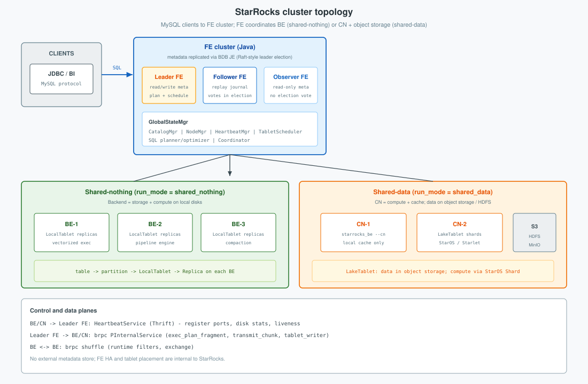

---

## 2. Cluster topology

StarRocks keeps the surface small: **FE + BE** (shared-nothing) or **FE + CN + object storage** (shared-data). Nodes scale horizontally; FE metadata and data replicas have internal redundancy.

**Clients** send SQL to any FE (typically via a load balancer). **FEs** form an HA group:

| FE role (`FrontendNodeType`) | Metadata | Leader election |
|------------------------------|----------|-----------------|
| **Leader** | Read/write; replicates journal to followers | Elected from followers (> half alive) |
| **Follower** | Read; replays leader journal | Participates in election |
| **Observer** | Read; replays journal | Does **not** vote — scales read/metadata fan-out |

Each FE holds a full in-memory catalog copy backed by **BDB JE** (Berkeley DB Java Edition). Metadata writes go to the leader and must replicate to a quorum of followers before they are considered durable.

**Compute registration.** BEs and CNs heartbeat to the **leader FE** over Thrift **`HeartbeatService`**, reporting ports (`be_port`, `brpc_port`, `starlet_port`), disk capacity, and liveness. **`SystemInfoService`** tracks **`Backend`** and **`ComputeNode`** instances; **`HeartbeatMgr`** drives the heartbeat loop. Worker-side heartbeat and service ports are detailed in [Backend and Compute Node](../backend/).

**Tablets as placement units.** OLAP tables are partitioned; each partition holds one or more **tablets** (the unit of sharding and replication). In shared-nothing, each **`LocalTablet`** has **`Replica`** objects on BEs; the FE **`TabletScheduler`** repairs and balances them. In shared-data, **`LakeTablet`** maps to a StarOS shard and object-storage segments. The Coordinator uses that placement map when assigning scan **`FragmentInstance`**s—worker storage layout is in the [Backend](../backend/) post.

### 2.1 Frontend (FE)

The FE process entry is **`StarRocksFE`** → **`StarRocksFEServer`**. **`GlobalStateMgr`** is the central singleton: it wires catalog, node registry, load/transaction managers, and HA state.

| Subsystem | Responsibility |
|-----------|----------------|
| **`CatalogMgr` / `InternalCatalog`** | Databases, tables, partitions, materialized views |
| **`NodeMgr` / `SystemInfoService`** | FE and BE/CN membership |
| **`TabletInvertedIndex`, `TabletScheduler`** | Tablet health, replica repair, balance |
| **SQL engine** (`sql/`, `planner/`, optimizer) | Parse, analyze, CBO, physical **`PlanFragment`** generation |
| **`Coordinator`** | Deploy fragments to BE/CN, collect status, return results |
| **`QeService`** | MySQL wire protocol to clients |

**FE composition.** **`StarRocksFEServer`** bootstraps **`GlobalStateMgr`** and network services. The singleton owns catalog and node registries, tablet scheduling, and the metadata journal; **`QeService`** accepts MySQL sessions and drives **`Coordinator`** instances per query.

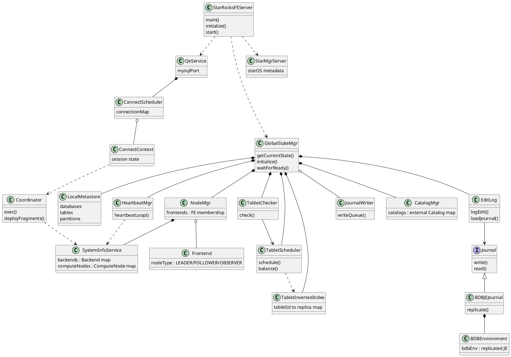
```plantuml
@startuml

class StarRocksFEServer {
  main()
  initialize()
  start()
}

class GlobalStateMgr {
  getCurrentState()
  initialize()
  waitForReady()
}

class CatalogMgr {
  catalogs : external Catalog map
}

class LocalMetastore {
  databases
  tables
  partitions
}

class NodeMgr {
  frontends : FE membership
}

class Frontend {
  nodeType : LEADER/FOLLOWER/OBSERVER
}

class SystemInfoService {
  backends : Backend map
  computeNodes : ComputeNode map
}

class HeartbeatMgr {
  heartbeatLoop()
}

class TabletInvertedIndex {
  tabletId to replica map
}

class TabletScheduler {
  schedule()
  balance()
}

class TabletChecker {
  check()
}

class EditLog {
  logEdit()
  loadJournal()
}

interface Journal {
  write()
  read()
}

class BDBJEJournal {
  replicate()
}

class BDBEnvironment {
  bdbEnv : replicated JE
}

class JournalWriter {
  writeQueue()
}

class QeService {
  mysqlPort
}

class ConnectScheduler {
  connectionMap
}

class ConnectContext {
  session state
}

class Coordinator {
  exec()
  deployFragments()
}

class StarMgrServer {
  starOS metadata
}

StarRocksFEServer ..> GlobalStateMgr
StarRocksFEServer ..> QeService
StarRocksFEServer ..> StarMgrServer

GlobalStateMgr *-- CatalogMgr
GlobalStateMgr *-- LocalMetastore
GlobalStateMgr *-- NodeMgr
GlobalStateMgr *-- HeartbeatMgr
GlobalStateMgr *-- TabletInvertedIndex
GlobalStateMgr *-- TabletScheduler
GlobalStateMgr *-- TabletChecker
GlobalStateMgr *-- EditLog
GlobalStateMgr o-- JournalWriter

NodeMgr *-- SystemInfoService
NodeMgr o-- Frontend

EditLog --> Journal
Journal <|-- BDBJEJournal
BDBJEJournal *-- BDBEnvironment

QeService *-- ConnectScheduler
ConnectScheduler o-- ConnectContext
ConnectContext ..> Coordinator

TabletChecker --> TabletScheduler
TabletScheduler ..> TabletInvertedIndex
HeartbeatMgr ..> SystemInfoService
Coordinator ..> SystemInfoService

@enduml
```

On **shared-data** clusters the FE also starts **`StarMgrServer`** (StarOS metadata) alongside the BDB JE journal.

### 2.2 FE ↔ worker protocols (query path)

| Direction | Protocol | Typical use |
|-----------|----------|-------------|
| Client → FE | MySQL | Interactive SQL, auth, result sets |
| BE/CN → FE leader | Thrift **`HeartbeatService`** | Registration, master info, run mode |
| BE → FE leader | Thrift **`FrontendService`** | `reportExecStatus`, task finish, load txn |
| FE leader → BE/CN | brpc **`PInternalService`** | **`exec_plan_fragment`**, **`transmit_chunk`**, runtime filters, tablet writer |
| FE leader → BE/CN | Thrift **`BackendService`** | Agent tasks, legacy sync APIs |
| BE ↔ BE | brpc | Shuffle exchange, broadcast filters |

The hot query path is **brpc/protobuf** on each node's **`brpc_port`**. Thrift remains for heartbeat, reporting, and tablet maintenance agents.

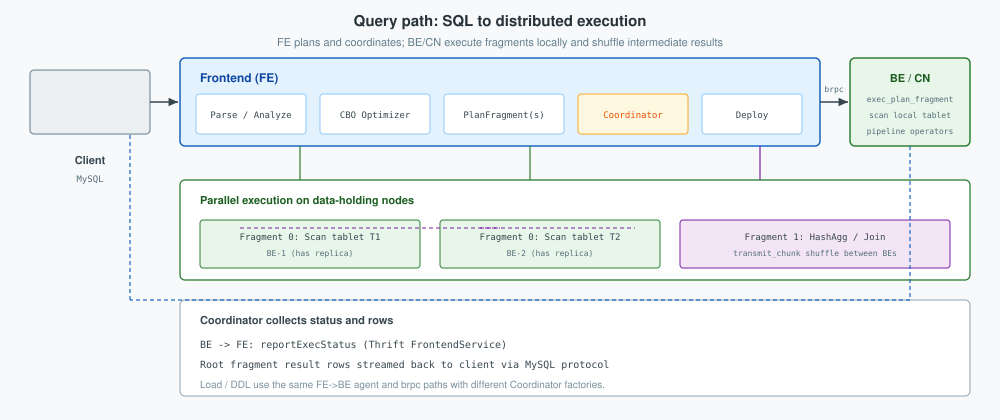

---

## 3. MPP: the OLAP execution model

**MPP (Massively Parallel Processing)** is the fundamental character of OLAP, not an optional accelerator. An analytical statement is a large **computation** over data that is already sharded into tablets. The only way to finish that computation at interactive latency is to run the same operators on **many machines at once** and move intermediate batches by **shuffle**—not to walk one operator tree in one process. StarRocks is built around that model: the FE plans and coordinates; BE/CN workers execute.

A stage is a **`PlanFragment`**: a **`PlanNode`** subtree that can run without an in-process call to another machine, plus a **`DataSink`**. An **edge** is the **Exchange** that connects two stages—the producer’s sink and the consumer’s **`ExchangeNode`**, carrying **`transmit_chunk`**. The **DAG** is those stages and edges: **`ExecPlan.fragments`** after **`visitPhysicalDistribution`** cuts the physical tree at every **`PhysicalDistributionOperator`**. The FE never joins those batches in its own heap.

That is the opposite of classic OLTP, where the cost is the **SQL transaction** (one node’s log and locks) and a distributed shuffle would make every small write a distributed commit.

| | OLTP | StarRocks MPP (OLAP) |
|--|------|----------------------|
| What the statement *is* | A transaction | A computation |
| Bottleneck | Commit, isolation, locks | Scan / join / agg CPU and IO |
| Plan shape | One local operator tree | **`PlanFragment`** DAG + **`FragmentInstance`**s |
| SQL endpoint | Executes | Plans, deploys, pulls the root |

A typical analytical plan is two-phase: scan stages, a join stage (often with a local aggregate), a merge-aggregate stage, and a root GATHER into **`ResultSink`**. Data flows along edges toward the root (fragment 0 in **`EXPLAIN`**). Each Exchange is not drawn by hand: **`QueryOptimizer`** CBO picks a **join distribution** (shuffle / broadcast / colocate) and an **aggregate distribution** (local then global), then **`EnforceAndCostTask`** inserts a **`PhysicalDistributionOperator`**. **`visitPhysicalDistribution`** cuts the fragment DAG at those operators.

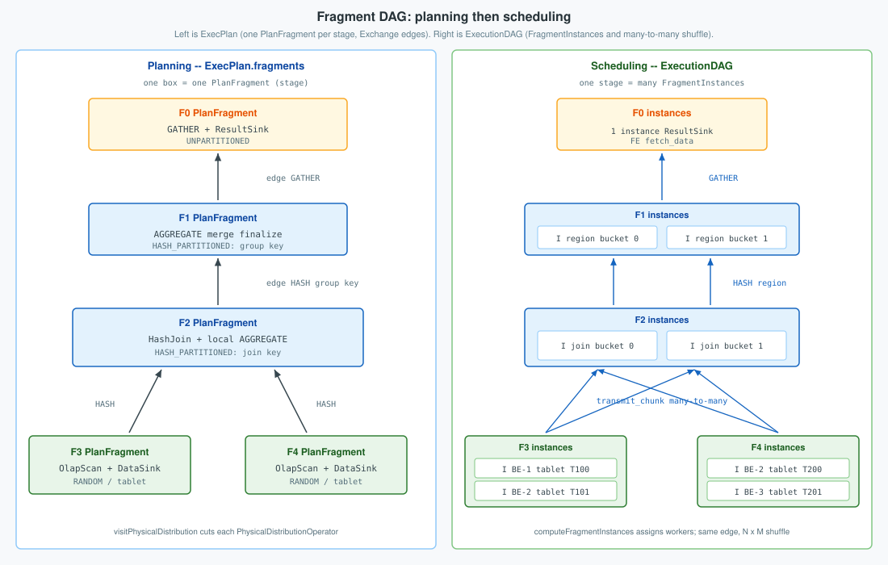

The left half of the figure is **planning**: **`ExecPlan.fragments`**, one **`PlanFragment`** per stage, Exchange edges from **`PhysicalDistributionOperator`**. The right half is **scheduling**: **`ExecutionDAG`** unfolds each stage into **`FragmentInstance`**s (tablet replicas on the scan side, hash buckets on join/agg). The same edge becomes a many-to-many **`transmit_chunk`**.

| DAG piece | Planning (`ExecPlan`) | Scheduling (`ExecutionDAG`) |
|-----------|----------------------|------------------------------|
| **Stage** | one **`PlanFragment`** (`planRoot`, `dataPartition`, `sink`) | N **`FragmentInstance`**s on BE/CN |
| **Edge** | producer **`DataSink`** → dest **`ExchangeNode`** | instance × instance **`transmit_chunk`** |
| **DAG** | fragment list after **`visitPhysicalDistribution`** | instances after **`computeFragmentInstances`** |

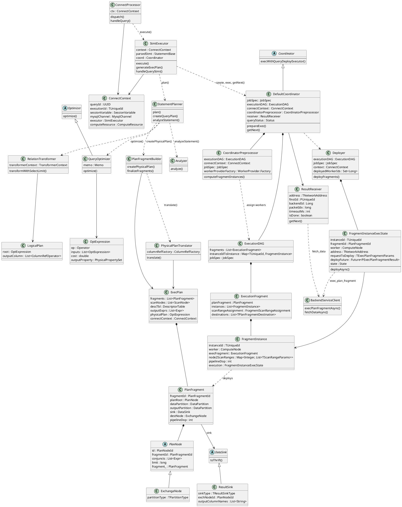
```plantuml
@startuml

class ConnectContext {
  queryId : UUID
  executionId : TUniqueId
  sessionVariable : SessionVariable
  mysqlChannel : MysqlChannel
  executor : StmtExecutor
  computeResource : ComputeResource
}

class ConnectProcessor {
  ctx : ConnectContext
  --
  dispatch()
  handleQuery()
}

class StmtExecutor {
  context : ConnectContext
  parsedStmt : StatementBase
  coord : Coordinator
  --
  execute()
  generateExecPlan()
  handleQueryStmt()
}

class StatementPlanner {
  --
  plan()
  createQueryPlan()
  analyzeStatement()
}

class Analyzer {
  --
  analyze()
}

class RelationTransformer {
  transformerContext : TransformerContext
  --
  transformWithSelectLimit()
}

class LogicalPlan {
  root : OptExpression
  outputColumn : List<ColumnRefOperator>
}

abstract class Optimizer {
  --
  optimize()
}

class QueryOptimizer {
  memo : Memo
  --
  optimize()
}

class OptExpression {
  op : Operator
  inputs : List<OptExpression>
  cost : double
  outputProperty : PhysicalPropertySet
}

class PlanFragmentBuilder {
  --
  createPhysicalPlan()
  finalizeFragments()
}

class PhysicalPlanTranslator {
  columnRefFactory : ColumnRefFactory
  --
  translate()
}

class ExecPlan {
  fragments : List<PlanFragment>
  scanNodes : List<ScanNode>
  descTbl : DescriptorTable
  outputExprs : List<Expr>
  physicalPlan : OptExpression
  connectContext : ConnectContext
}

class PlanFragment {
  fragmentId : PlanFragmentId
  planRoot : PlanNode
  dataPartition : DataPartition
  outputPartition : DataPartition
  sink : DataSink
  destNode : ExchangeNode
  pipelineDop : int
}

abstract class PlanNode {
  id : PlanNodeId
  fragmentId : PlanFragmentId
  conjuncts : List<Expr>
  limit : long
  fragment_ : PlanFragment
}

class ExchangeNode {
  partitionType : TPartitionType
}

abstract class DataSink {
  --
  toThrift()
}

class ResultSink {
  sinkType : TResultSinkType
  exchNodeId : PlanNodeId
  outputColumnNames : List<String>
}

abstract class Coordinator {
  --
  execWithQueryDeployExecutor()
}

class DefaultCoordinator {
  jobSpec : JobSpec
  executionDAG : ExecutionDAG
  connectContext : ConnectContext
  coordinatorPreprocessor : CoordinatorPreprocessor
  receiver : ResultReceiver
  queryStatus : Status
  --
  prepareExec()
  getNext()
}

class CoordinatorPreprocessor {
  executionDAG : ExecutionDAG
  connectContext : ConnectContext
  jobSpec : JobSpec
  workerProviderFactory : WorkerProvider.Factory
  --
  computeFragmentInstances()
}

class ExecutionDAG {
  fragments : List<ExecutionFragment>
  instanceIdToInstance : Map<TUniqueId, FragmentInstance>
  jobSpec : JobSpec
}

class ExecutionFragment {
  planFragment : PlanFragment
  instances : List<FragmentInstance>
  scanRangeAssignment : FragmentScanRangeAssignment
  destinations : List<TPlanFragmentDestination>
}

class FragmentInstance {
  instanceId : TUniqueId
  worker : ComputeNode
  execFragment : ExecutionFragment
  node2ScanRanges : Map<Integer, List<TScanRangeParams>>
  pipelineDop : int
  execution : FragmentInstanceExecState
}

class Deployer {
  executionDAG : ExecutionDAG
  jobSpec : JobSpec
  context : ConnectContext
  deployedWorkerIds : Set<Long>
  --
  deployFragments()
}

class FragmentInstanceExecState {
  instanceId : TUniqueId
  fragmentId : PlanFragmentId
  worker : ComputeNode
  address : TNetworkAddress
  requestToDeploy : TExecPlanFragmentParams
  deployFuture : Future<PExecPlanFragmentResult>
  state : State
  --
  deployAsync()
}

class BackendServiceClient {
  --
  execPlanFragmentAsync()
  fetchDataAsync()
}

class ResultReceiver {
  address : TNetworkAddress
  finstId : PUniqueId
  backendId : Long
  packetIdx : long
  timeoutMs : int
  isDone : boolean
  --
  getNext()
}

ConnectProcessor --> ConnectContext
ConnectProcessor ..> StmtExecutor : execute()

StmtExecutor --> ConnectContext
StmtExecutor ..> StatementPlanner : plan()
StmtExecutor ..> DefaultCoordinator : create, exec, getNext()

StatementPlanner ..> Analyzer : analyzeStatement()
StatementPlanner ..> RelationTransformer
RelationTransformer --> LogicalPlan
StatementPlanner ..> QueryOptimizer : optimize()
Optimizer <|-- QueryOptimizer
QueryOptimizer --> OptExpression
StatementPlanner ..> PlanFragmentBuilder : createPhysicalPlan()
PlanFragmentBuilder ..> PhysicalPlanTranslator : translate()
PhysicalPlanTranslator --> ExecPlan
PlanFragmentBuilder --> ExecPlan

ExecPlan *-- PlanFragment
PlanFragment *-- PlanNode
PlanNode <|-- ExchangeNode
PlanFragment --> DataSink : sink
DataSink <|-- ResultSink

Coordinator <|-- DefaultCoordinator
DefaultCoordinator *-- CoordinatorPreprocessor
DefaultCoordinator *-- ExecutionDAG
DefaultCoordinator --> ResultReceiver
CoordinatorPreprocessor ..> ExecutionDAG : assign workers
ExecutionDAG *-- ExecutionFragment
ExecutionFragment *-- FragmentInstance

DefaultCoordinator ..> Deployer
Deployer *-- FragmentInstanceExecState
FragmentInstanceExecState --> FragmentInstance
FragmentInstanceExecState ..> BackendServiceClient : exec_plan_fragment
ResultReceiver ..> BackendServiceClient : fetch_data
FragmentInstance ..> PlanFragment : deploys

@enduml
```

A MySQL **`COM_QUERY`** is how a session enters this machinery. **`StmtExecutor`** builds the DAG, **`DefaultCoordinator`** instantiates and deploys it, and the FE only **`fetch_data`**s the root.

### 3.1 Statement generation

**`ConnectProcessor.handleQuery()`** decodes the MySQL **`COM_QUERY`** payload to a SQL string. **`SqlParser.parse`** splits the string, walks the ANTLR tree with **`AstBuilder`**, and returns one **`StatementBase`** per statement. **`AstBuilder`** is the constructor: each `visit*` allocates the subclass and fills its fields. Names are still unresolved; this step does not plan or execute.

```java
// ConnectProcessor.handleQuery
originStmt = new String(bytes, 1, ending, StandardCharsets.UTF_8);
List<StatementBase> stmts = parseStatements(originStmt);

// ConnectProcessor.parseStatements
return SqlParser.parse(originStmt, ctx.getSessionVariable());
```

```java
// SqlParser.parseWithStarRocksDialect
for (int idx = 0; idx < singleStatementContexts.size(); ++idx) {
    HintCollector collector = new HintCollector(tokenStream, sessionVariable);
    collector.collect(singleStatementContexts.get(idx));
    AstBuilder astBuilder = astBuilderFactory.create(sqlMode, caseInsensitive, collector.getContextWithHintMap());
    StatementBase statement = (StatementBase) astBuilder.visitSingleStatement(singleStatementContexts.get(idx));
    statement.setOrigStmt(new OriginStatement(sql, idx));
    statements.add(statement);
}
```

A **`SELECT`** becomes **`QueryStatement(queryRelation)`**. **`INSERT VALUES`** wraps a **`ValuesRelation`** in a **`QueryStatement`** and hangs it on **`InsertStmt.queryStatement`**. **`UPDATE`** / **`DELETE`** store **`TableRef`**, assignments or USING, and **`wherePredicate`** only.

```java
// AstBuilder.visitQueryStatement
QueryRelation queryRelation = (QueryRelation) visit(context.queryRelation());
QueryStatement queryStatement = new QueryStatement(queryRelation);
queryStatement.setQueryStartIndex(context.queryRelation().start.getStartIndex());
return queryStatement;

// AstBuilder.visitInsertStatement
if (context.VALUES() != null) {
    queryStatement = new QueryStatement(new ValuesRelation(rows, colNames, pos));
} else {
    queryStatement = (QueryStatement) visit(context.queryStatement());  // INSERT SELECT
}
return new InsertStmt(tableRef, partitionNames, label, columnAliases, queryStatement,
        context.OVERWRITE() != null, properties, pos);

// AstBuilder.visitUpdateStatement
List<ColumnAssignment> assignments = visit(context.assignmentList().assignment(), ColumnAssignment.class);
Expr where = context.where != null ? (Expr) visit(context.where) : null;
return new UpdateStmt(tableRef, assignments, fromRelations, where, ctes, pos);

// AstBuilder.visitDeleteStatement
return new DeleteStmt(tableRef, partitionNames, usingRelations, where, ctes, pos);
```

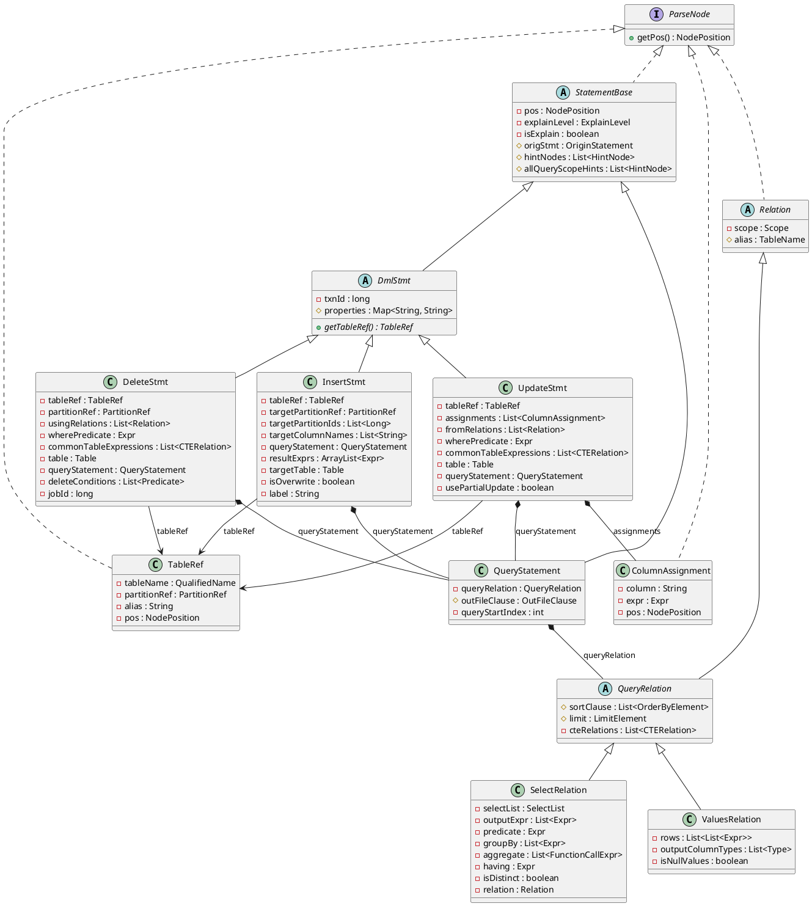
```plantuml
@startuml

interface ParseNode {
  + getPos() : NodePosition
}

abstract class StatementBase {
  - pos : NodePosition
  - explainLevel : ExplainLevel
  - isExplain : boolean
  # origStmt : OriginStatement
  # hintNodes : List<HintNode>
  # allQueryScopeHints : List<HintNode>
}

abstract class DmlStmt {
  - txnId : long
  # properties : Map<String, String>
  + {abstract} getTableRef() : TableRef
}

class QueryStatement {
  - queryRelation : QueryRelation
  # outFileClause : OutFileClause
  - queryStartIndex : int
}

class InsertStmt {
  - tableRef : TableRef
  - targetPartitionRef : PartitionRef
  - targetPartitionIds : List<Long>
  - targetColumnNames : List<String>
  - queryStatement : QueryStatement
  - resultExprs : ArrayList<Expr>
  - targetTable : Table
  - isOverwrite : boolean
  - label : String
}

class UpdateStmt {
  - tableRef : TableRef
  - assignments : List<ColumnAssignment>
  - fromRelations : List<Relation>
  - wherePredicate : Expr
  - commonTableExpressions : List<CTERelation>
  - table : Table
  - queryStatement : QueryStatement
  - usePartialUpdate : boolean
}

class DeleteStmt {
  - tableRef : TableRef
  - partitionRef : PartitionRef
  - usingRelations : List<Relation>
  - wherePredicate : Expr
  - commonTableExpressions : List<CTERelation>
  - table : Table
  - queryStatement : QueryStatement
  - deleteConditions : List<Predicate>
  - jobId : long
}

abstract class Relation {
  - scope : Scope
  # alias : TableName
}

abstract class QueryRelation {
  # sortClause : List<OrderByElement>
  # limit : LimitElement
  - cteRelations : List<CTERelation>
}

class SelectRelation {
  - selectList : SelectList
  - outputExpr : List<Expr>
  - predicate : Expr
  - groupBy : List<Expr>
  - aggregate : List<FunctionCallExpr>
  - having : Expr
  - isDistinct : boolean
  - relation : Relation
}

class ValuesRelation {
  - rows : List<List<Expr>>
  - outputColumnTypes : List<Type>
  - isNullValues : boolean
}

class TableRef {
  - tableName : QualifiedName
  - partitionRef : PartitionRef
  - alias : String
  - pos : NodePosition
}

class ColumnAssignment {
  - column : String
  - expr : Expr
  - pos : NodePosition
}

ParseNode <|.. StatementBase
ParseNode <|.. Relation
ParseNode <|.. TableRef
ParseNode <|.. ColumnAssignment
StatementBase <|-- QueryStatement
StatementBase <|-- DmlStmt
DmlStmt <|-- InsertStmt
DmlStmt <|-- UpdateStmt
DmlStmt <|-- DeleteStmt
Relation <|-- QueryRelation
QueryRelation <|-- SelectRelation
QueryRelation <|-- ValuesRelation

QueryStatement *-- QueryRelation : queryRelation
InsertStmt *-- QueryStatement : queryStatement
InsertStmt --> TableRef : tableRef
UpdateStmt *-- QueryStatement : queryStatement
UpdateStmt --> TableRef : tableRef
UpdateStmt *-- ColumnAssignment : assignments
DeleteStmt *-- QueryStatement : queryStatement
DeleteStmt --> TableRef : tableRef

@enduml
```

Generation ends when each **`StatementBase`** is on the list. The next object is **`StmtExecutor`**: **`execute()`** → **`generateExecPlan()`** → **`StatementPlanner.plan(parsedStmt, context)`**. That call is the whole plan: it returns an **`ExecPlan`**.

```java
executor = new StmtExecutor(ctx, parsedStmt);
ctx.setExecutor(executor);
executor.execute();
// StmtExecutor.generateExecPlan:
execPlan = StatementPlanner.plan(parsedStmt, context);
```

### 3.2 Plan

**`StatementPlanner.plan()`** turns a **`StatementBase`** into an **`ExecPlan`**. Analyze is the first phase inside that method, not a separate pipeline. For DML, **`beginTransaction()`** may set **`DmlStmt.txnId`** (a load transaction, not a SQL `BEGIN`). After analyze and **`Authorizer.check`**, the method branches: a **`QueryStatement`** goes to **`createQueryPlan()`** (or **`createQueryPlanWithReTry`**); **`InsertStmt`** / **`UpdateStmt`** / **`DeleteStmt`** / **`MergeIntoStmt`** go to their planners.

```java
public static ExecPlan plan(StatementBase stmt, ConnectContext session, TResultSinkType resultSinkType) {
    if (stmt instanceof DmlStmt) {
        beginTransaction((DmlStmt) stmt, session);
    }
    plannerMetaLocker = new PlannerMetaLocker(session, stmt);
    analyzeStatement(stmt, session, plannerMetaLocker);
    Authorizer.check(stmt, session);

    if (stmt instanceof QueryStatement) {
        return createQueryPlan(queryStmt, session, resultSinkType);
    } else if (stmt instanceof InsertStmt) {
        return planInsertStmt(plannerMetaLocker, (InsertStmt) stmt, session);
    } else if (stmt instanceof UpdateStmt) {
        return new UpdatePlanner().plan((UpdateStmt) stmt, session);
    } else if (stmt instanceof DeleteStmt) {
        return new DeletePlanner().plan((DeleteStmt) stmt, session);
    } else if (stmt instanceof MergeIntoStmt) {
        return new MergeIntoPlanner().plan((MergeIntoStmt) stmt, session);
    }
}
```

**`analyzeStatement()`** takes the metadata lock and **`Analyzer.analyze()`** visits the AST: resolve names, types, and partition metadata. For **`UpdateStmt`** / **`DeleteStmt`** it also writes the rewritten source **`queryStatement`**. No fragments yet.

```java
analyzeStatement(stmt, session, plannerMetaLocker);
// Analyzer.analyze(statement, session) → AnalyzerVisitor.visit(...)
```

For a query, **`createQueryPlan()`** is the rest of **`plan()`**: transform → optimize → fragmentize. The three phases below are that body.

```java
logicalPlan = new RelationTransformer(transformerContext).transformWithSelectLimit(query);
optimizedPlan = optimizer.optimize(logicalPlan.getRoot(),
        new PhysicalPropertySet(), new ColumnRefSet(logicalPlan.getOutputColumn()));
return PlanFragmentBuilder.createPhysicalPlan(
        optimizedPlan, session, logicalPlan.getOutputColumn(), columnRefFactory, colNames,
        resultSinkType, !session.getSessionVariable().isSingleNodeExecPlan(), isShortCircuit);
```

### 3.3 Logical plan

First phase of **`createQueryPlan()`**: turn the analyzed **`QueryRelation`** into a tree of **`OptExpression`**s. **`LogicalPlan`** is not a subclass of that tree; it holds the **root** **`OptExpression`** and the output **`ColumnRefOperator`**s.

Each **`OptExpression`** is one node:

- **`op`** — this node’s own operator (`LogicalOlapScanOperator`, `LogicalJoinOperator`, …).
- **`inputs`** — the child **`OptExpression`**s. A scan has none; a filter or agg has one; a join has two.

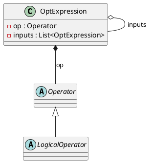
```plantuml
@startuml

class OptExpression {
  - op : Operator
  - inputs : List<OptExpression>
}

abstract class Operator

abstract class LogicalOperator

OptExpression *-- Operator : op
OptExpression o-- OptExpression : inputs
Operator <|-- LogicalOperator

@enduml
```

**`QueryTransformer.plan()`** stacks one **`OptExpression`** per clause (`OptExprBuilder` wraps **`op`** + child builders until **`getRoot()`**). **`SqlToScalarOperatorTranslator`** turns each **`Expr`** into a **`ScalarOperator`** on that **`op`**.

```java
OptExprBuilder builder = planFrom(queryBlock.getRelation(), cteContext);  // FROM
builder = filter(builder, queryBlock.getPredicate());                     // WHERE
builder = aggregate(builder, queryBlock.getGroupBy(), queryBlock.getAggregate(), ...);
builder = filter(builder, queryBlock.getHaving());                        // HAVING
builder = window(builder, analyticExprList);                              // OVER()
builder = project(...);                                                   // SELECT / ORDER BY exprs
builder = distinct(builder, queryBlock, queryBlock.isDistinct(), ...);
builder = sort(builder, queryBlock.getOrderBy(), orderByColumns);         // ORDER BY
builder = limit(builder, queryBlock.getLimit());                          // LIMIT / OFFSET
return new LogicalPlan(builder, outputColumns, correlation);
```

| SQL clause | AST field | Logical operator |
|------------|-----------|------------------|
| `FROM t` | `SelectRelation.relation` (`TableRelation`) | **`LogicalOlapScanOperator`** (or other **`LogicalScanOperator`**) |
| `JOIN … ON` | **`JoinRelation`** (`joinOp`, `onPredicate`) | **`LogicalJoinOperator`** (`onPredicate` kept distinct from WHERE) |
| `WHERE` | `SelectRelation.predicate` | **`LogicalFilterOperator`** (below agg) |
| `GROUP BY` / `SUM()` | `groupBy`, `aggregate` | **`LogicalAggregationOperator`** (`groupingKeys`, `aggregations` → **`CallOperator`**) |
| `GROUPING SETS` | `groupingSetsList` | **`LogicalRepeatOperator`** under the agg |
| `HAVING` | `having` | **`LogicalFilterOperator`** (above agg) |
| `SELECT` list | `outputExpr` | **`LogicalProjectOperator`** (`columnRefMap`) |
| `DISTINCT` | `isDistinct` | **`LogicalAggregationOperator`** (group keys = output, empty agg map) |
| `ORDER BY` | `orderBy` | **`LogicalTopNOperator`** |
| `LIMIT` / `OFFSET` | `limit` | **`LogicalLimitOperator`**; session **`sql_select_limit`** is an extra wrap in **`transformWithSelectLimit()`** |
| `OVER()` | analytic exprs | **`LogicalWindowOperator`** |
| `UNION` / `EXCEPT` / `INTERSECT` | **`SetOperationRelation`** | **`LogicalUnionOperator`** / **`Except`** / **`Intersect`** |
| subquery in expr | `Subquery` | **`LogicalApplyOperator`** |

WHERE and HAVING are the same operator class; only stack position differs. A join’s **`onPredicate`** stays on **`LogicalJoinOperator`** so MV rewrite can tell ON from WHERE. Filter pushdown into the scan is a later CBO rewrite, not this transform.

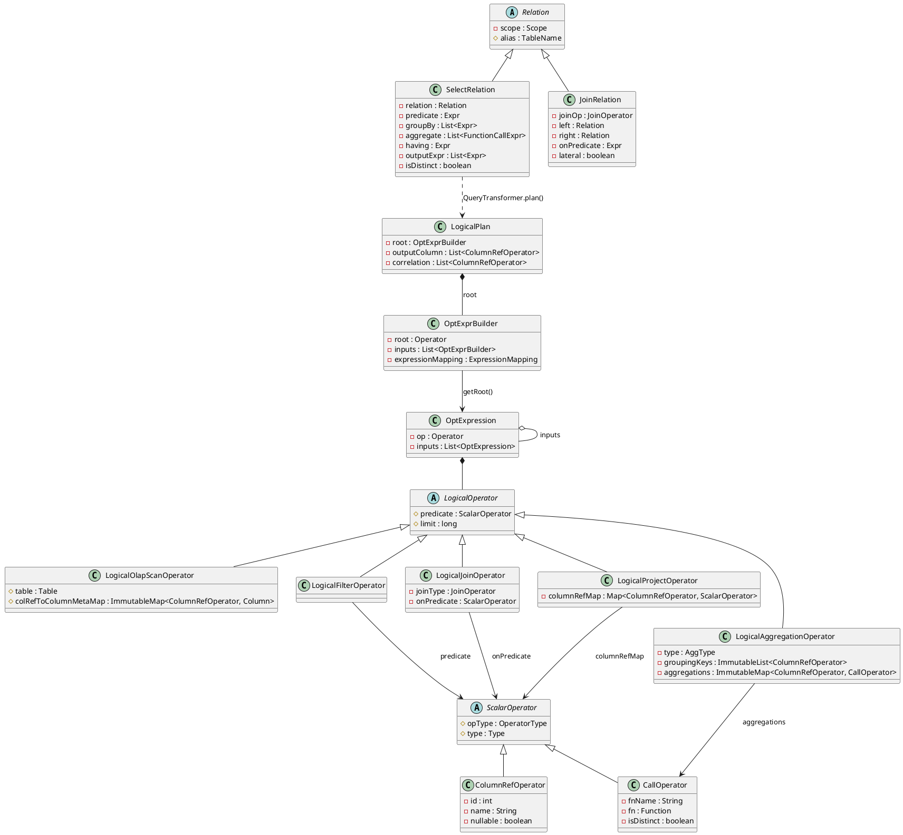
```plantuml
@startuml

abstract class Relation {
  - scope : Scope
  # alias : TableName
}

class SelectRelation {
  - relation : Relation
  - predicate : Expr
  - groupBy : List<Expr>
  - aggregate : List<FunctionCallExpr>
  - having : Expr
  - outputExpr : List<Expr>
  - isDistinct : boolean
}

class JoinRelation {
  - joinOp : JoinOperator
  - left : Relation
  - right : Relation
  - onPredicate : Expr
  - lateral : boolean
}

class LogicalPlan {
  - root : OptExprBuilder
  - outputColumn : List<ColumnRefOperator>
  - correlation : List<ColumnRefOperator>
}

class OptExprBuilder {
  - root : Operator
  - inputs : List<OptExprBuilder>
  - expressionMapping : ExpressionMapping
}

class OptExpression {
  - op : Operator
  - inputs : List<OptExpression>
}

abstract class LogicalOperator {
  # predicate : ScalarOperator
  # limit : long
}

class LogicalOlapScanOperator {
  # table : Table
  # colRefToColumnMetaMap : ImmutableMap<ColumnRefOperator, Column>
}

class LogicalJoinOperator {
  - joinType : JoinOperator
  - onPredicate : ScalarOperator
}

class LogicalFilterOperator

class LogicalAggregationOperator {
  - type : AggType
  - groupingKeys : ImmutableList<ColumnRefOperator>
  - aggregations : ImmutableMap<ColumnRefOperator, CallOperator>
}

class LogicalProjectOperator {
  - columnRefMap : Map<ColumnRefOperator, ScalarOperator>
}

abstract class ScalarOperator {
  # opType : OperatorType
  # type : Type
}

class ColumnRefOperator {
  - id : int
  - name : String
  - nullable : boolean
}

class CallOperator {
  - fnName : String
  - fn : Function
  - isDistinct : boolean
}

Relation <|-- SelectRelation
Relation <|-- JoinRelation

SelectRelation ..> LogicalPlan : QueryTransformer.plan()
LogicalPlan *-- OptExprBuilder : root
OptExprBuilder --> OptExpression : getRoot()
OptExpression *-- LogicalOperator
OptExpression o-- OptExpression : inputs
LogicalOperator <|-- LogicalOlapScanOperator
LogicalOperator <|-- LogicalJoinOperator
LogicalOperator <|-- LogicalFilterOperator
LogicalOperator <|-- LogicalAggregationOperator
LogicalOperator <|-- LogicalProjectOperator

LogicalJoinOperator --> ScalarOperator : onPredicate
LogicalFilterOperator --> ScalarOperator : predicate
LogicalProjectOperator --> ScalarOperator : columnRefMap
LogicalAggregationOperator --> CallOperator : aggregations
ScalarOperator <|-- ColumnRefOperator
ScalarOperator <|-- CallOperator

@enduml
```

The running query is revenue by customer region. Tables are not colocated: **`orders`** is hashed on **`cust_id`**, **`customers`** on **`id`**.

```sql
CREATE TABLE orders (
    dt      DATE,
    cust_id BIGINT,
    amount  DECIMAL(12, 2)
)
DUPLICATE KEY(dt, cust_id)
PARTITION BY RANGE(dt) (
    PARTITION p2024 VALUES [('2024-01-01'), ('2025-01-01'))
)
DISTRIBUTED BY HASH(cust_id) BUCKETS 8;

CREATE TABLE customers (
    id     BIGINT,
    region VARCHAR(32)
)
PRIMARY KEY(id)
DISTRIBUTED BY HASH(id) BUCKETS 8;

SELECT c.region, SUM(o.amount)
FROM orders o
JOIN customers c ON o.cust_id = c.id
WHERE o.dt BETWEEN '2024-01-01' AND '2024-06-30'
GROUP BY c.region;
```

**`planFrom`** builds the join; **`filter`** hangs WHERE on top of the join (not yet on the **`orders`** scan); **`aggregate`** then **`project`** produce the SELECT list. Each line below is one **`OptExpression`**: the name is **`op`**; indentation is **`inputs`**.

```
OptExpression  op=LogicalProject  { region, sum_amount }
  OptExpression  op=LogicalAggregation  groupingKeys=[region]  aggregations={sum_amount: SUM(amount)}
    OptExpression  op=LogicalFilter  predicate=(dt BETWEEN ...)
      OptExpression  op=LogicalJoin  INNER  onPredicate=(cust_id = id)
        OptExpression  op=LogicalOlapScan  orders     inputs=[]
        OptExpression  op=LogicalOlapScan  customers  inputs=[]
```

### 3.4 Optimize

**`QueryOptimizer.optimize()`** is the second phase of **`createQueryPlan()`**. The framework follows Graefe’s Cascades paper [[2]](#5-references): **Memo**, task-stack search, transformation and implementation **Rules**, and **property enforce**. A normal **`SELECT`** uses **`optimizeByCost`** (`OptimizerOptions` defaults to **`COST_BASED`**). **`optimizeByRule`** is rewrite only (MV’s own tree) and never initializes the Memo.

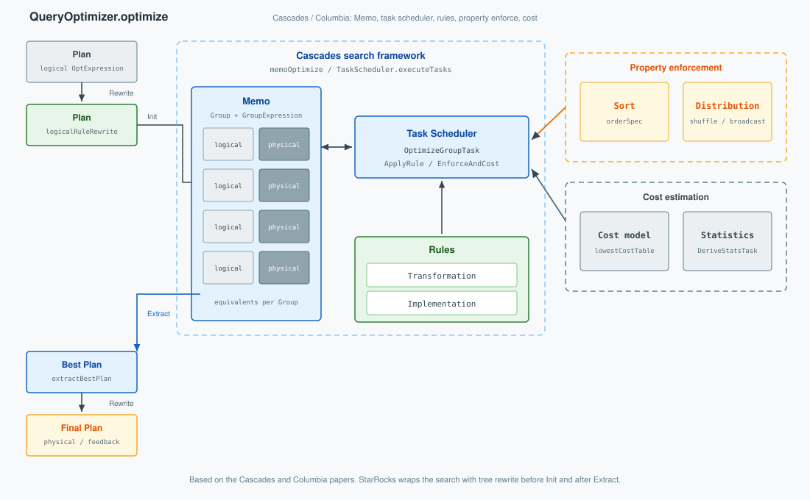

#### 3.4.1 Overall procedure

**`optimizeByCost`** is a fixed pipeline. Logical rewrite still runs on the concrete tree; from **`memo.init`** onward, Cascades search happens **inside the Memo**.

1. **Logical rewrite** — `rewriteAndValidatePlan` → `logicalRuleRewrite` (subquery, CTE inline, prune, pushdown) on the concrete **`OptExpression`** tree.
2. **Init Memo** — `memo.init(logicOperatorTree)` then `deriveAllGroupLogicalProperty` (§3.4.2).
3. **Memo search** — `memoOptimize`: prepare join rules, push `OptimizeGroupTask(rootGroup)`, run the task stack until physical alternatives are costed (§3.4.2–3.4.4).
4. **Extract** — `extractBestPlan(requiredProperty, rootGroup)` rebuilds one physical **`OptExpression`** from the cheapest physical **`GroupExpression`**.
5. **Physical rewrite** — `physicalRuleRewrite`, then feedback `dynamicRewrite`.

What changes on the tree is **`op`** and which **`GroupExpression`** CBO kept. **`PlanFragmentBuilder`** later cuts at every **`PhysicalDistributionOperator`**.

```java
Optimizer optimizer = OptimizerFactory.create(optimizerContext);
OptExpression optimizedPlan = optimizer.optimize(
        logicalPlan.getRoot(),
        new PhysicalPropertySet(),
        new ColumnRefSet(logicalPlan.getOutputColumn()));

OptExpression optimize(OptExpression logicOperatorTree, PhysicalPropertySet requiredProperty,
        ColumnRefSet requiredColumns) {
    prepare(logicOperatorTree);
    prepareMvRewrite(...);
    return optimizerOptions.isRuleBased() ?
            optimizeByRule(logicOperatorTree, requiredProperty, requiredColumns) :
            optimizeByCost(connectContext, logicOperatorTree, requiredProperty, requiredColumns);
}

OptExpression optimizeByCost(ConnectContext connectContext, OptExpression logicOperatorTree,
        PhysicalPropertySet requiredProperty, ColumnRefSet requiredColumns) {
    TaskContext rootTaskContext =
            new TaskContext(context, requiredProperty, requiredColumns.clone(), Double.MAX_VALUE);
    logicOperatorTree = rewriteAndValidatePlan(logicOperatorTree, rootTaskContext);
    memo.init(logicOperatorTree);
    memo.deriveAllGroupLogicalProperty();
    memoOptimize(connectContext, memo, rootTaskContext);
    OptExpression result = extractBestPlan(requiredProperty, memo.getRootGroup());
    result = physicalRuleRewrite(connectContext, rootTaskContext, result);
    result = dynamicRewrite(connectContext, rootTaskContext, result);
    return result;
}

OptExpression extractBestPlan(PhysicalPropertySet requiredProperty, Group rootGroup) {
    GroupExpression groupExpression = rootGroup.getBestExpression(requiredProperty);
    List<PhysicalPropertySet> inputProperties = groupExpression.getInputProperties(requiredProperty);
    List<OptExpression> childPlans = Lists.newArrayList();
    for (int i = 0; i < groupExpression.arity(); ++i) {
        childPlans.add(extractBestPlan(inputProperties.get(i), groupExpression.inputAt(i)));
    }
    return OptExpression.create(groupExpression.getOp(), childPlans);
}
```

#### 3.4.2 Memo

All cost-based search after logical rewrite runs **against the Memo**. A **`Group`** holds **logically equivalent** alternatives. A **`GroupExpression`** is one alternative: an **`op`** whose **`inputs`** are **`Group`s**. Identity **`(op, input group ids)`** makes **`copyIn`** share duplicates.

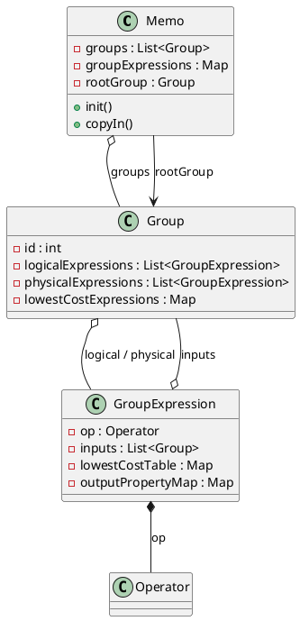
```plantuml
@startuml

class Memo {
  - groups : List<Group>
  - groupExpressions : Map
  - rootGroup : Group
  + init()
  + copyIn()
}

class Group {
  - id : int
  - logicalExpressions : List<GroupExpression>
  - physicalExpressions : List<GroupExpression>
  - lowestCostExpressions : Map
}

class GroupExpression {
  - op : Operator
  - inputs : List<Group>
  - lowestCostTable : Map
  - outputPropertyMap : Map
}

Memo o-- Group : groups
Memo --> Group : rootGroup
Group o-- GroupExpression : logical / physical
GroupExpression o-- Group : inputs
GroupExpression *-- Operator : op

@enduml
```

**`memo.init`** loads groups → **`memoOptimize`** prepares join rules and drains the task stack from the root → **`extractBestPlan`** (§3.4.1) reads the filled memo.

After init the running query is a **group DAG** (`memo.rootGroup` = **G5**). 

```
memo.rootGroup ──► G5  { LogicalProject          inputs=[G4] }
                         │
                         ▼
                       G4  { LogicalAggregation    inputs=[G3] }
                         │
                         ▼
                       G3  { LogicalFilter         inputs=[G2] }
                         │
                         ▼
                       G2  { LogicalJoin           inputs=[G0, G1] }
                        / \
                       ▼   ▼
        G0 { LogicalOlapScan(orders) }   G1 { LogicalOlapScan(customers) }
             inputs=[]                        inputs=[]
```

**`memoOptimize` traversal.** The scheduler is a **stack** (LIFO). Only **`OptimizeGroupTask(G5)`** is pushed at entry.

Two different orders share that stack:

- **Explore (transform-only).** **`OptimizeExpressionTask`** pushes **`ExploreGroupTask`** on each input group *after* other work, so children are popped first: logical exploration descends **G5 → G4 → G3 → G2 → (G0, G1)** before the parent’s own transform rules finish draining.
- **Implement + enforce/cost.** Full **`OptimizeGroupTask`** (with implement rules) on a child is usually started from a parent’s **`EnforceAndCostTask`**: the parent physical expression is already **`copyIn`**, costing begins at the parent, then the parent **suspends** and pushes **`OptimizeGroupTask(child)`**. So for the join group **G2**, implement/enforce **starts on G2 first**; **G0** / **G1** run **after** that suspension, while G2’s cost task waits; G2 **resumes** when the scans have a best expression. How that suspend/resume walk works is §3.4.4.

```java
// --- 1. memo.init: bottom-up copy into groups ---
GroupExpression init(OptExpression originExpression) {
    GroupExpression rootGroupExpression = copyIn(null, originExpression).second;
    rootGroup = rootGroupExpression.getGroup();  // G5
    return rootGroupExpression;
}

Pair<Boolean, GroupExpression> copyIn(Group targetGroup, OptExpression expression) {
    List<Group> inputs = Lists.newArrayList();
    for (OptExpression input : expression.getInputs()) {
        inputs.add(copyIn(null, input).second.getGroup());
    }
    GroupExpression groupExpression = new GroupExpression(expression.getOp(), inputs);
    return insertGroupExpression(groupExpression, targetGroup);
}

// --- 2–4. memoOptimize: bookkeeping, extend RuleSet, push root, drain stack ---
void memoOptimize(ConnectContext connectContext, Memo memo, TaskContext rootTaskContext) {
    context.setInMemoPhase(true);
    OptExpression tree = memo.getRootGroup().extractLogicalTree();
    CTEUtils.collectCteOperators(tree, context);

    int innerCrossJoinNode = Utils.countJoinNodeSize(tree, JoinOperator.innerCrossJoinSet());
    if (!sessionVariable.isDisableJoinReorder()
            && innerCrossJoinNode < sessionVariable.getCboMaxReorderNode()) {
        if (innerCrossJoinNode > sessionVariable.getCboMaxReorderNodeUseExhaustive()) {
            new ReorderJoinRule().transform(tree, context);
            context.getRuleSet().addJoinCommutativityWithoutInnerRule();
        } else {
            context.getRuleSet().addJoinTransformationRules();
        }
    }
    context.getRuleSet().addAutoJoinImplementationRule();

    scheduler.pushTask(new OptimizeGroupTask(rootTaskContext, memo.getRootGroup())); // G5
    scheduler.executeTasks(rootTaskContext);
}

// --- 5. OptimizeGroupTask: explore logical exprs, cost physical exprs ---
void OptimizeGroupTask.execute() {
    if (group.getCostLowerBound(context.getRequiredProperty()) >= context.getUpperBoundCost()
            || group.hasBestExpression(context.getRequiredProperty())) {
        return;
    }
    for (int i = group.getLogicalExpressions().size() - 1; i >= 0; i--) {
        pushTask(new OptimizeExpressionTask(context, group.getLogicalExpressions().get(i)));
    }
    for (int i = group.getPhysicalExpressions().size() - 1; i >= 0; i--) {
        pushTask(new EnforceAndCostTask(context, group.getPhysicalExpressions().get(i)));
    }
}

// --- descend explore: children before parent ApplyRuleTasks (LIFO) ---
void OptimizeExpressionTask.execute() {
    for (Rule rule : getValidRules()) {
        pushTask(new ApplyRuleTask(context, groupExpression, rule, isExplore));
    }
    pushTask(new DeriveStatsTask(context, groupExpression));
    for (int i = groupExpression.arity() - 1; i >= 0; i--) {
        pushTask(new ExploreGroupTask(context, groupExpression.getInputs().get(i)));
    }
}

// --- 6. ApplyRuleTask: copyIn substitutes; logical → explore, physical → enforce/cost ---
void ApplyRuleTask.execute() {
    Binder binder = new Binder(optimizerContext, rule.getPattern(), groupExpression, ...);
    List<OptExpression> newExpressions = Lists.newArrayList();
    for (OptExpression extractExpr = binder.next(); extractExpr != null; extractExpr = binder.next()) {
        if (rule.check(extractExpr, optimizerContext)) {
            newExpressions.addAll(rule.transform(extractExpr, optimizerContext));
        }
    }
    for (OptExpression expression : newExpressions) {
        GroupExpression neu = memo.copyIn(groupExpression.getGroup(), expression).second;
        if (neu.getOp().isLogical()) {
            pushTask(new OptimizeExpressionTask(context, neu, isExplore));
        } else {
            pushTask(new EnforceAndCostTask(context, neu));
        }
    }
    groupExpression.setRuleExplored(rule);
}
```

Match / check / transform details are §3.4.3; EnforceAndCost top→bottom→top walk is §3.4.4; distribution enforcers are §3.4.5. After commute and hash-join implement:

```
G2  {
  LogicalJoin(G0, G1)           // from init
  LogicalJoin(G1, G0)           // JoinCommutativityRule
  PhysicalHashJoin(G0, G1)      // HashJoinImplementationRule
  PhysicalHashJoin(G1, G0)      // implement the commute
}
```

#### 3.4.3 Rules

**How a rule runs.** Cascades explores plans by applying **`Rule`s**. Each rule is one rewrite of a matched fragment. Inside the memo the steps are:

1. **Match** — **`Pattern`** is a tree of operator-type placeholders. The binder walks a **`GroupExpression`** and its child groups until the shape fits (for example `LOGICAL_JOIN` over two unconstrained leaves).
2. **Gate** — optional **`check(input, context)`** rejects matches that are structurally valid but semantically wrong (for example nest-loop implement refusing an equi-join).
3. **Rewrite** — **`transform(input, context)`** builds zero or more new **`OptExpression`** trees. An empty list means “no change.” The matched expression is not mutated.
4. **Insert** — each substitute is **`copyIn`** into the same equivalence group as a new **`GroupExpression`**. Later search sees it as another alternative.

**`COST_BASED`** means: apply rules to grow the search space, then pick the cheapest physical alternative — not a separate non-rule planner.

**Two subclasses.** **`Rule`** splits by what **`transform`** puts at the root of each substitute:

- **`TransformationRule`** — **logical → logical**. Same result, different logical shape (join commute, split agg into local/global, …). The search space grows before any executable operator exists. Example: **`JoinCommutativityRule`** produces `LogicalJoin(B, A)` from `LogicalJoin(A, B)`.
- **`ImplementationRule`** — **logical → physical**. Replaces a logical operator with one the executor can run, usually keeping the same children. Example: **`HashJoinImplementationRule`** produces `PhysicalHashJoin` from `LogicalJoin`.

Both share **`Pattern` / `check` / `transform`**. Transformation widens logical alternatives; implementation adds executable ones. Cost chooses among physical alternatives. Implementation rules use higher **`promise`** so they are tried before more transforms on the same expression. **`RuleSet`** keeps **`transformRules`** and **`implementRules`**.

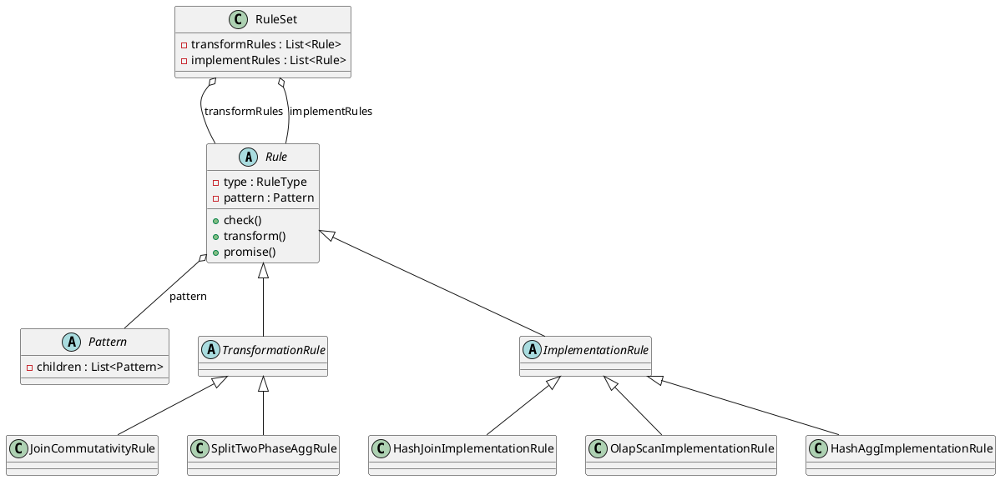
```plantuml
@startuml

abstract class Rule {
  - type : RuleType
  - pattern : Pattern
  + check()
  + transform()
  + promise()
}

abstract class Pattern {
  - children : List<Pattern>
}

abstract class TransformationRule
abstract class ImplementationRule

class JoinCommutativityRule
class SplitTwoPhaseAggRule
class HashJoinImplementationRule
class OlapScanImplementationRule
class HashAggImplementationRule

class RuleSet {
  - transformRules : List<Rule>
  - implementRules : List<Rule>
}

Rule o-- Pattern : pattern
Rule <|-- TransformationRule
Rule <|-- ImplementationRule
TransformationRule <|-- JoinCommutativityRule
TransformationRule <|-- SplitTwoPhaseAggRule
ImplementationRule <|-- HashJoinImplementationRule
ImplementationRule <|-- OlapScanImplementationRule
ImplementationRule <|-- HashAggImplementationRule
RuleSet o-- Rule : transformRules
RuleSet o-- Rule : implementRules

@enduml
```

```java
// ImplementationRule: logical join → physical hash join (same children)
List<OptExpression> transform(OptExpression input, OptimizerContext context) {
    LogicalJoinOperator join = (LogicalJoinOperator) input.getOp();
    PhysicalHashJoinOperator hashJoin =
            new PhysicalHashJoinOperator(join.getJoinType(), join.getOnPredicate(), ...);
    return Lists.newArrayList(OptExpression.create(hashJoin, input.getInputs()));
}
```

**Physical operators from implementation rules.** After a successful implement **`copyIn`**, the new expression is physical and the optimizer costs it (and may insert distribution enforcers — §3.4.4–3.4.5). **`RuleSet`** starts with **`ALL_IMPLEMENT_RULES`** (scan, hash agg, filter, project, top-n, … — not join). **`memoOptimize`** adds **`HashJoinImplementationRule`** and **`NestLoopJoinImplementationRule`**. **`PhysicalDistributionOperator`** is not from an implementation rule; **`EnforceAndCostTask`** inserts it when delivered layout does not satisfy the parent requirement. Its **`distributionSpec`** is the required layout (`SHUFFLE_JOIN` / **`SHUFFLE_AGG`** / **`BUCKET`** / **`BROADCAST`** / **`GATHER`**).

| Implementation rule | Logical input | Physical operator |
|---------------------|---------------|-------------------|
| **`OlapScanImplementationRule`** | **`LogicalOlapScanOperator`** | **`PhysicalOlapScanOperator`** (`table`, `selectedPartitionId`, `selectedTabletId`; residual **`predicate`**; **`distributionSpec`** = **`LOCAL`**) |
| **`HashJoinImplementationRule`** | **`LogicalJoinOperator`** (equi-join; not CROSS) | **`PhysicalHashJoinOperator`** (`joinType`, `onPredicate`) |
| **`NestLoopJoinImplementationRule`** | **`LogicalJoinOperator`** (when **`check`** allows) | **`PhysicalNestLoopJoinOperator`** |
| **`HashAggImplementationRule`** | **`LogicalAggregationOperator`** | **`PhysicalHashAggregateOperator`** (`type` **`LOCAL`** / **`GLOBAL`**, `isSplit`, `groupBys`, `partitionByColumns`) |
| **`FilterImplementationRule`** | **`LogicalFilterOperator`** | **`PhysicalFilterOperator`** (or residual **`Operator.predicate`** on the scan when pushed earlier) |
| **`ProjectImplementationRule`** | **`LogicalProjectOperator`** | **`PhysicalProjectOperator`** (`columnRefMap`; or folded **`Operator.projection`**) |
| **`TopNImplementationRule`** | **`LogicalTopNOperator`** | **`PhysicalTopNOperator`** (`orderSpec`, `sortPhase` **`PARTIAL`** / **`FINAL`**, `isSplit`) |
| *(enforcer, not a rule)* | — | **`PhysicalDistributionOperator`** — **`appendEnforcers`**; carries **`distributionSpec`** |

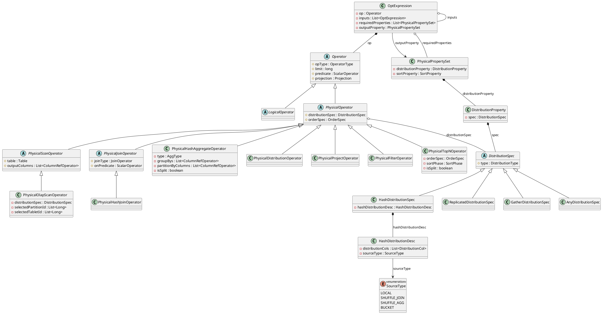
```plantuml
@startuml

class OptExpression {
  - op : Operator
  - inputs : List<OptExpression>
  - requiredProperties : List<PhysicalPropertySet>
  - outputProperty : PhysicalPropertySet
}

abstract class Operator {
  # opType : OperatorType
  # limit : long
  # predicate : ScalarOperator
  # projection : Projection
}

abstract class LogicalOperator

abstract class PhysicalOperator {
  # distributionSpec : DistributionSpec
  # orderSpec : OrderSpec
}

abstract class PhysicalScanOperator {
  # table : Table
  # outputColumns : List<ColumnRefOperator>
}

class PhysicalOlapScanOperator {
  - distributionSpec : DistributionSpec
  - selectedPartitionId : List<Long>
  - selectedTabletId : List<Long>
}

abstract class PhysicalJoinOperator {
  # joinType : JoinOperator
  # onPredicate : ScalarOperator
}

class PhysicalHashJoinOperator

class PhysicalHashAggregateOperator {
  - type : AggType
  - groupBys : List<ColumnRefOperator>
  - partitionByColumns : List<ColumnRefOperator>
  - isSplit : boolean
}

class PhysicalDistributionOperator

class PhysicalProjectOperator
class PhysicalFilterOperator

class PhysicalTopNOperator {
  - orderSpec : OrderSpec
  - sortPhase : SortPhase
  - isSplit : boolean
}

class PhysicalPropertySet {
  - distributionProperty : DistributionProperty
  - sortProperty : SortProperty
}

class DistributionProperty {
  - spec : DistributionSpec
}

abstract class DistributionSpec {
  # type : DistributionType
}

class HashDistributionSpec {
  - hashDistributionDesc : HashDistributionDesc
}

class ReplicatedDistributionSpec
class GatherDistributionSpec
class AnyDistributionSpec

class HashDistributionDesc {
  - distributionCols : List<DistributionCol>
  - sourceType : SourceType
}

enum SourceType <<enumeration>> {
  LOCAL
  SHUFFLE_JOIN
  SHUFFLE_AGG
  BUCKET
}

OptExpression *-- Operator : op
OptExpression o-- OptExpression : inputs
OptExpression --> PhysicalPropertySet : outputProperty
OptExpression o-- PhysicalPropertySet : requiredProperties

Operator <|-- LogicalOperator
Operator <|-- PhysicalOperator
PhysicalOperator <|-- PhysicalScanOperator
PhysicalOperator <|-- PhysicalJoinOperator
PhysicalOperator <|-- PhysicalHashAggregateOperator
PhysicalOperator <|-- PhysicalDistributionOperator
PhysicalOperator <|-- PhysicalProjectOperator
PhysicalOperator <|-- PhysicalFilterOperator
PhysicalOperator <|-- PhysicalTopNOperator
PhysicalScanOperator <|-- PhysicalOlapScanOperator
PhysicalJoinOperator <|-- PhysicalHashJoinOperator

PhysicalPropertySet *-- DistributionProperty : distributionProperty
DistributionProperty *-- DistributionSpec : spec
DistributionSpec <|-- HashDistributionSpec
DistributionSpec <|-- ReplicatedDistributionSpec
DistributionSpec <|-- GatherDistributionSpec
DistributionSpec <|-- AnyDistributionSpec
HashDistributionSpec *-- HashDistributionDesc : hashDistributionDesc
HashDistributionDesc --> SourceType : sourceType

PhysicalOperator o-- DistributionSpec : distributionSpec

@enduml
```

Scan **`LOCAL`** lives on **`PhysicalOlapScanOperator.distributionSpec`** (from **`DISTRIBUTED BY`**). Join / agg carry the keys that required-property derivation turns into child requirements (`onPredicate`, **`partitionByColumns`**). The enforcer’s **`PhysicalDistributionOperator.distributionSpec`** is the required layout that did not satisfy the delivered output.

#### 3.4.4 EnforceAndCostTask

**`EnforceAndCostTask`** runs only after a physical **`GroupExpression`** exists (`copyIn` from an implementation rule). The physical DAG shape is already there (input **Group**s link parent to children); this task does **not** build the tree leaf-first. It costs and enforces properties on that existing expression.

**Top → bottom → top (suspend / resume).** The walk is a stack, not a recursive Java call. A parent is **not** finished when a child runs — on the join/scans example, **G2** (physical hash join) **starts first**; **G0** / **G1** run **while G2 is suspended**; G2 **resumes** afterward:

1. **Start at the parent** (e.g. physical join in **G2** / **E3**). Read **`requiredProperty`**, derive each child’s requirement (steps 1–2 below). The parent has only *started*.
2. **Suspend the parent.** **`optimizeChildGroup`** pushes a **clone** of this **`EnforceAndCostTask`** (resume later), then **`OptimizeGroupTask(child)`** — that is what runs implement+cost on **G0** / **G1** if they still lack a best expression under the derived requirement.
3. **Run the child to completion** (e.g. **E1**): leaf steps 1–4, **`outputProperty`**, maybe an enforcer.
4. **Resume the parent.** After all inputs have a best expression, derive this node’s **`outputProperty`**, compare, maybe **`appendEnforcers`** (steps 3–4), then return to *its* parent.

Required properties flow **down** as the stack deepens; output properties and enforcers are decided **up** as clones resume. The same pattern links **E5 → E4 → E3 → E1/E2** and back.

Each visit is four steps:

1. Read **`TaskContext.requiredProperty`**.
2. **`RequiredPropertyDeriver`** → **`childrenRequiredProperties`** (each becomes that child’s **`TaskContext.requiredProperty`**).
3. After children return: **`OutputPropertyDeriver`** → this **`outputProperty`**.
4. **`recordCostsAndEnforce`**: if not **`isSatisfy`**, insert **`PhysicalDistributionOperator(required spec)`**.

```java
void initRequiredProperties() {
    RequiredPropertyDeriver requiredPropertyDeriver = new RequiredPropertyDeriver(context);
    childrenRequiredPropertiesList = requiredPropertyDeriver.getRequiredProps(groupExpression);
}

void execute() {
    initRequiredProperties();  // parent → child requirements (down)
    for (List<PhysicalPropertySet> childrenRequiredProperties : childrenRequiredPropertiesList) {
        for (; curChildIndex < groupExpression.getInputs().size(); curChildIndex++) {
            PhysicalPropertySet childRequiredProperty = childrenRequiredProperties.get(curChildIndex);
            Group childGroup = groupExpression.getInputs().get(curChildIndex);
            GroupExpression childBestExpr = childGroup.getBestExpression(childRequiredProperty);
            if (childBestExpr == null) {
                // G2 suspends here; G0/G1 OptimizeGroupTask (+ implement) run next
                optimizeChildGroup(childRequiredProperty, childGroup);
                return;
            }
            childrenOutputProperties.add(childBestExpr.getOutputProperty(childRequiredProperty));
        }
        // all children done → outputProperty / enforce (up); G2 resumes after G0/G1
        OutputPropertyDeriver outputPropertyDeriver = new OutputPropertyDeriver(groupExpression,
                context.getRequiredProperty(), childrenOutputProperties);
        recordCostsAndEnforce(outputPropertyDeriver.getOutputProperty(), childrenRequiredProperties);
    }
}

void optimizeChildGroup(PhysicalPropertySet inputProperty, Group childGroup) {
    pushTask((EnforceAndCostTask) clone());
    TaskContext taskContext = new TaskContext(context.getOptimizerContext(), inputProperty,
            context.getRequiredColumns(), context.getUpperBoundCost() - curTotalCost);
    pushTask(new OptimizeGroupTask(taskContext, childGroup));
}

void recordCostsAndEnforce(PhysicalPropertySet outputProperty,
        List<PhysicalPropertySet> childrenOutputProperties) {
    PhysicalPropertySet requiredProperty = context.getRequiredProperty();
    if (!outputProperty.getDistributionProperty()
            .isSatisfy(requiredProperty.getDistributionProperty())) {
        enforceDistribute(outputProperty);
    }
}

PhysicalPropertySet enforceDistribute(PhysicalPropertySet oldOutputProperty) {
    PhysicalPropertySet requiredPropertySet = oldOutputProperty.copy();
    requiredPropertySet.setDistributionProperty(context.getRequiredProperty()
            .getDistributionProperty().getNullStrictProperty());
    GroupExpression enforcer = requiredPropertySet.getDistributionProperty()
            .appendEnforcers(groupExpression.getGroup());
    return updateCostAndOutputPropertySet(enforcer, oldOutputProperty, requiredPropertySet);
}

GroupExpression appendEnforcers(Group child) {
    return new GroupExpression(new PhysicalDistributionOperator(spec), Lists.newArrayList(child));
}
```

On the running statement, solid edges are **down** (`requiredProperty`); dotted edges are **up** (`outputProperty`):

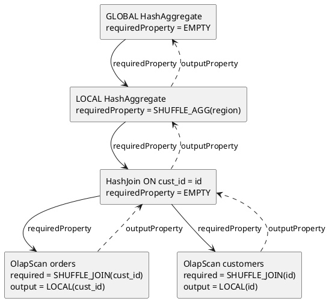
```plantuml
@startuml
top to bottom direction

rectangle "GLOBAL HashAggregate\nrequiredProperty = EMPTY" as G
rectangle "LOCAL HashAggregate\nrequiredProperty = SHUFFLE_AGG(region)" as L
rectangle "HashJoin ON cust_id = id\nrequiredProperty = EMPTY" as J
rectangle "OlapScan orders\nrequired = SHUFFLE_JOIN(cust_id)\noutput = LOCAL(cust_id)" as So
rectangle "OlapScan customers\nrequired = SHUFFLE_JOIN(id)\noutput = LOCAL(id)" as Sc

G --> L : requiredProperty
L --> J : requiredProperty
J --> So : requiredProperty
J --> Sc : requiredProperty

So ..> J : outputProperty
Sc ..> J : outputProperty
J ..> L : outputProperty
L ..> G : outputProperty

@enduml
```

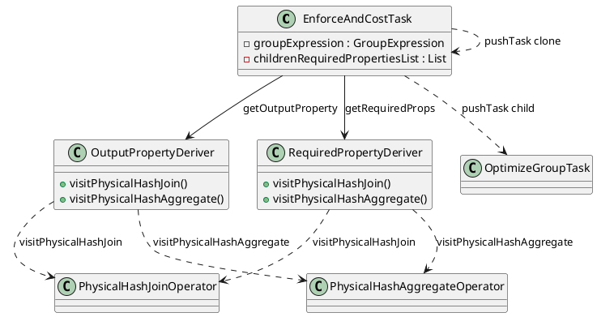
```plantuml
@startuml

class EnforceAndCostTask {
  - groupExpression : GroupExpression
  - childrenRequiredPropertiesList : List
}

class RequiredPropertyDeriver {
  + visitPhysicalHashJoin()
  + visitPhysicalHashAggregate()
}

class OutputPropertyDeriver {
  + visitPhysicalHashJoin()
  + visitPhysicalHashAggregate()
}

EnforceAndCostTask --> RequiredPropertyDeriver : getRequiredProps
EnforceAndCostTask --> OutputPropertyDeriver : getOutputProperty
EnforceAndCostTask ..> OptimizeGroupTask : pushTask child
EnforceAndCostTask ..> EnforceAndCostTask : pushTask clone
RequiredPropertyDeriver ..> PhysicalHashJoinOperator : visitPhysicalHashJoin
RequiredPropertyDeriver ..> PhysicalHashAggregateOperator : visitPhysicalHashAggregate
OutputPropertyDeriver ..> PhysicalHashJoinOperator : visitPhysicalHashJoin
OutputPropertyDeriver ..> PhysicalHashAggregateOperator : visitPhysicalHashAggregate

@enduml
```

#### 3.4.5 Distribution

**Distribution** is how a node’s output rows are laid out across **tablets / hash buckets**. Catalog metadata is **`DistributionInfo`**. CBO carries a **`DistributionSpec`** inside **`PhysicalPropertySet.distributionProperty`**, and inserts a **`PhysicalDistributionOperator`** only when delivered layout does not **`isSatisfy`** the parent requirement. Fragmentize later cuts only where that operator exists; root **`ResultSink`** GATHER is **`createOutputFragment()`**, not this path.

**`DistributionInfo`** is table metadata from `CREATE TABLE` on **`OlapTable`**. **`PARTITION BY`** (date ranges) is a different catalog object. **`DISTRIBUTED BY`** is this one: how **each partition** splits into tablets. For **`orders`**, **`DISTRIBUTED BY HASH(cust_id) BUCKETS 8`** is **`HashDistributionInfo`** (`cust_id`, `bucketNum = 8`). **`RANDOM`** is **`RandomDistributionInfo`**. Replica placement is not this object.

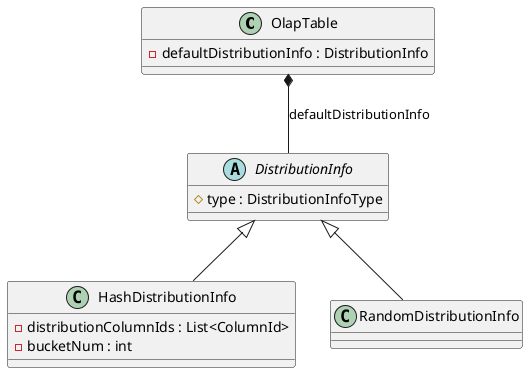
```plantuml
@startuml

class OlapTable {
  - defaultDistributionInfo : DistributionInfo
}

abstract class DistributionInfo {
  # type : DistributionInfoType
}

class HashDistributionInfo {
  - distributionColumnIds : List<ColumnId>
  - bucketNum : int
}

class RandomDistributionInfo

OlapTable *-- DistributionInfo : defaultDistributionInfo
DistributionInfo <|-- HashDistributionInfo
DistributionInfo <|-- RandomDistributionInfo

@enduml
```

**`DistributionSpec`** is CBO’s encoding of a layout on an **`OptExpression`**, not a catalog field. Two specs are built independently and compared by **`isSatisfy`**.

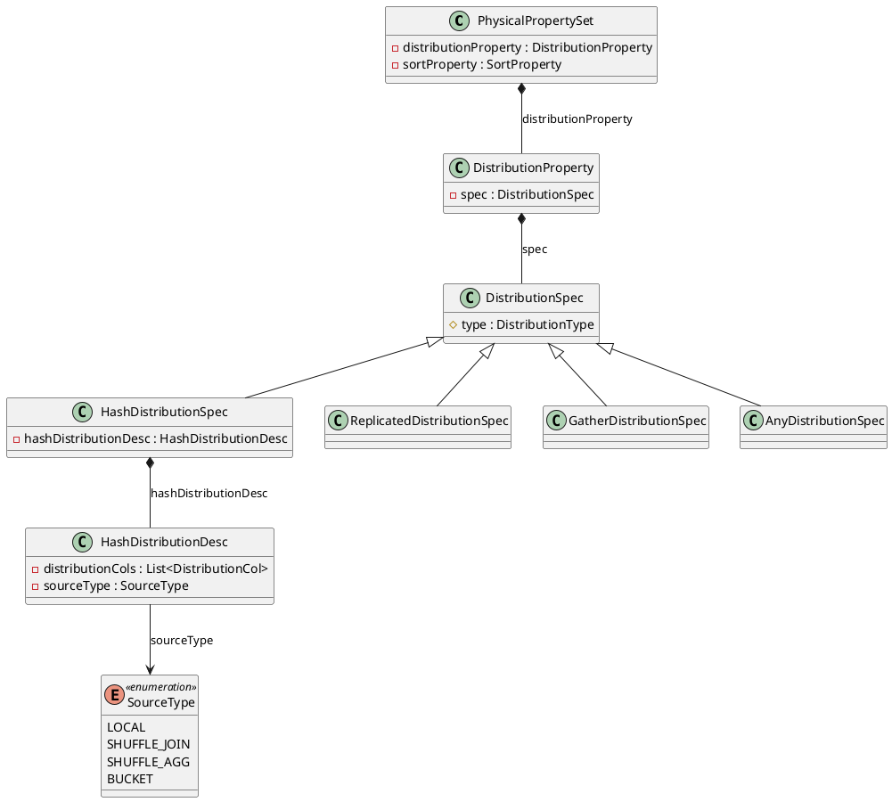
```plantuml
@startuml

class PhysicalPropertySet {
  - distributionProperty : DistributionProperty
  - sortProperty : SortProperty
}

class DistributionProperty {
  - spec : DistributionSpec
}

class DistributionSpec {
  # type : DistributionType
}

class HashDistributionSpec {
  - hashDistributionDesc : HashDistributionDesc
}

class ReplicatedDistributionSpec
class GatherDistributionSpec
class AnyDistributionSpec

class HashDistributionDesc {
  - distributionCols : List<DistributionCol>
  - sourceType : SourceType
}

enum SourceType <<enumeration>> {
  LOCAL
  SHUFFLE_JOIN
  SHUFFLE_AGG
  BUCKET
}

PhysicalPropertySet *-- DistributionProperty : distributionProperty
DistributionProperty *-- DistributionSpec : spec
DistributionSpec <|-- HashDistributionSpec
DistributionSpec <|-- ReplicatedDistributionSpec
DistributionSpec <|-- GatherDistributionSpec
DistributionSpec <|-- AnyDistributionSpec
HashDistributionSpec *-- HashDistributionDesc : hashDistributionDesc
HashDistributionDesc --> SourceType : sourceType

@enduml
```

**`HashDistributionDesc.sourceType`** distinguishes delivered scan layout from a required shuffle: **`LOCAL`** on the scan, **`SHUFFLE_JOIN`** / **`SHUFFLE_AGG`** / **`BUCKET`** on a parent. **`ReplicatedDistributionSpec`** is broadcast; **`GatherDistributionSpec`** is one stream; **`AnyDistributionSpec`** is **`EMPTY`**.

| Spec | Origin | Layout |
|------|--------|--------|
| **`LOCAL`** | scan **`DISTRIBUTED BY HASH`** | Table tablets |
| **`SHUFFLE_JOIN`** | required by hash join | Hash on ON-key column-refs |
| **`SHUFFLE_AGG`** | required by **`GLOBAL`** agg | Hash on group keys |
| **`BUCKET`** | bucket-shuffle join | Right child of a local-bucket join |
| **`BROADCAST`** | required by hash join | Full copy on every consumer |
| **`GATHER`** | scalar **`GLOBAL`** agg | One stream |
| **`ANY`** | no requirement | **`EMPTY`**, root **`optimize()`** |

**`PhysicalDistributionOperator`** is never produced by an implementation rule. It appears in two places during **`EnforceAndCostTask`**: (1) when this node’s **`outputProperty`** fails **`isSatisfy(requiredProperty)`**, and (2) when **`ChildOutputPropertyGuarantor`** rewrites a join child’s delivered layout to **`BUCKET`**.

**1. Parent writes the child’s required `DistributionSpec`.** **`RequiredPropertyDeriver`** fills **`childrenRequiredPropertiesList`**. For a hash join it records a broadcast pair and, unless **`onlyBroadcast()`**, a shuffle pair on the ON keys. For a non-local hash aggregate it requires **`GATHER`** (no group keys) or **`SHUFFLE_AGG`** on **`partitionByColumns`**; a local aggregate requires **`EMPTY`**.

```java
// RequiredPropertyDeriver — hash join
PhysicalPropertySet rightBroadcastProperty = new PhysicalPropertySet(
        DistributionProperty.createProperty(DistributionSpec.createReplicatedDistributionSpec()));
requiredProperties.add(Lists.newArrayList(PhysicalPropertySet.EMPTY, rightBroadcastProperty));
if (joinHelper.onlyShuffle()) {
    requiredProperties.clear();
}
requiredProperties.add(computeShuffleJoinRequiredProperties(requirementsFromParent, leftCols, rightCols));
// → SHUFFLE_JOIN(cust_id) / SHUFFLE_JOIN(id) on the two children

// RequiredPropertyDeriver — hash aggregate
if (!node.getType().isLocal()) {
    if (columns.isEmpty()) {
        requiredProperties.add(Lists.newArrayList(createGatherPropertySet()));  // GATHER
    } else {
        requiredProperties.add(Lists.newArrayList(computeAggRequiredShuffleProperties(columns)));
        // → SHUFFLE_AGG(region)
    }
} else {
    requiredProperties.add(Lists.newArrayList(PhysicalPropertySet.EMPTY));
}
```

**2. Mismatch inserts the enforcer on this group.** After children return, **`recordCostsAndEnforce`** compares this node’s **`outputProperty`** to **`TaskContext.requiredProperty`**. If distribution does not satisfy, **`enforceDistribute`** takes the *required* distribution property and **`appendEnforcers`** builds a new **`GroupExpression`** whose **`op`** is **`PhysicalDistributionOperator(spec)`** and whose sole input is **this** group. That expression is costed and recorded as satisfying the required property; the parent later reads the enforced spec as the child’s output.

```java
// EnforceAndCostTask.recordCostsAndEnforce
boolean satisfyDistributionProperty =
        outputProperty.getDistributionProperty().isSatisfy(requiredProperty.getDistributionProperty());
if (!satisfyOrderProperty || !satisfyDistributionProperty) {
    enforcedProperty = enforceProperty(outputProperty, requiredProperty,
            satisfyOrderProperty, satisfyDistributionProperty);
}

PhysicalPropertySet enforceDistribute(PhysicalPropertySet oldOutputProperty) {
    PhysicalPropertySet requiredPropertySet = oldOutputProperty.copy();
    requiredPropertySet.setDistributionProperty(context.getRequiredProperty()
            .getDistributionProperty().getNullStrictProperty());
    GroupExpression enforcer = requiredPropertySet.getDistributionProperty()
            .appendEnforcers(groupExpression.getGroup());
    return updateCostAndOutputPropertySet(enforcer, oldOutputProperty, requiredPropertySet);
}

// DistributionProperty.appendEnforcers — the only constructor of the enforcer op
GroupExpression appendEnforcers(Group child) {
    return new GroupExpression(new PhysicalDistributionOperator(spec), Lists.newArrayList(child));
}
```

On the running query this path inserts **`PhysicalDistributionOperator(SHUFFLE_AGG(region))`** between LOCAL and GLOBAL aggregate: LOCAL’s **`outputProperty`** is still **`LOCAL(cust_id)`**, which does not **`isSatisfy`** **`SHUFFLE_AGG(region)`**. The same path inserts **`SHUFFLE_JOIN`** or **`BROADCAST`** at a scan when **`LOCAL`** fails **`isSatisfy`** of the join’s child requirement (several selected partitions, not colocate-eligible).

**3. Bucket shuffle inserts on the join’s right child.** Before **`OutputPropertyDeriver`** on a hash join, **`ChildOutputPropertyGuarantor`** may decide the two **`LOCAL`** children cannot colocate. **`transToBucketShuffleJoin`** builds a **`HashDistributionSpec`** with **`SourceType.BUCKET`** and calls **`enforceChildDistribution`**, which again ends in **`appendEnforcers`** — but the child of the enforcer is the *right child’s group*, not the join’s group.

```java
// ChildOutputPropertyGuarantor.transToBucketShuffle
DistributionSpec rightDistributionSpec = DistributionSpec.createHashDistributionSpec(
        new HashDistributionDesc(bucketShuffleColumns, HashDistributionDesc.SourceType.BUCKET));
enforceChildDistribution(rightDistributionSpec, rightChild, rightChildOutputProperty);

Pair<GroupExpression, PhysicalPropertySet> enforceChildDistribution(
        DistributionSpec distributionSpec, GroupExpression child, PhysicalPropertySet childOutputProperty) {
    DistributionProperty newDistributionProperty = DistributionProperty.createProperty(distributionSpec);
    GroupExpression enforcer = newDistributionProperty.appendEnforcers(child.getGroup());
    // insertEnforceExpression / setBestExpression for BUCKET on that child group
    return new Pair<>(enforcer, newOutputProperty);
}
```

**Join / aggregate requirements (summary).** Shuffle join: both children **`SHUFFLE_JOIN`** on ON keys (or **`LOCAL`** if **`isSatisfy`**). Broadcast: left **`EMPTY`**, right **`ReplicatedDistributionSpec`**. Colocate: both **`LOCAL`**, no join-side enforcer. Bucket shuffle: left **`LOCAL`**, right **`BUCKET`**. Two-phase **`GROUP BY`**: GLOBAL requires **`SHUFFLE_AGG`** of the LOCAL child; scalar **`SUM`** requires **`GATHER`**.

**Worked example — adding enforcers step by step.** Same **`EnforceAndCostTask`** four steps as §3.4.4 on the running statement. Depth-first: steps 1–2 on the way down, children, then steps 3–4 on the way up. Each node is an expression; **`inputs`** are its children.

```sql
SELECT c.region, SUM(o.amount)
FROM orders o
JOIN customers c ON o.cust_id = c.id
WHERE o.dt BETWEEN '2024-01-01' AND '2024-06-30'
GROUP BY c.region;
```

Before enforcers:

```
E5  PhysicalHashAggregate GLOBAL  groupBys=[region]                    inputs=[E4]
 └─ E4 PhysicalHashAggregate LOCAL  groupBys=[region]                  inputs=[E3]
     └─ E3 PhysicalHashJoin INNER  onPredicate=(cust_id = id)          inputs=[E1, E2]
         ├─ E1 PhysicalOlapScan orders     LOCAL(cust_id)              inputs=[]
         └─ E2 PhysicalOlapScan customers  LOCAL(id)                   inputs=[]
```

**Visit E5 (`GLOBAL` HashAggregate) — steps 1–2.** Expression **E5**, input **E4**.

1. **`requiredProperty`** = **`EMPTY`** (root).
2. Child requirement for **E4** = **`SHUFFLE_AGG(region)`** (`partitionByColumns` = **`c.region`**).

**Visit E4 (`LOCAL` HashAggregate) — steps 1–2.** Expression **E4**, input **E3**.

1. **`requiredProperty`** = **`SHUFFLE_AGG(region)`** (from E5).
2. Child requirement for **E3** = **`EMPTY`** (`isLocal()`).

**Visit E3 (`HashJoin`) — steps 1–2.** Expression **E3**, inputs **E1** (left), **E2** (right).

1. **`requiredProperty`** = **`EMPTY`** (from E4).
2. Child-requirement pairs from ON (`cust_id = id`):
   - (**`EMPTY`**, **`BROADCAST`**) on (**E1**, **E2**)
   - (**`SHUFFLE_JOIN(cust_id)`**, **`SHUFFLE_JOIN(id)`**) on (**E1**, **E2**)
   Shuffle pair drives the scan visits below.

**Visit E1 (`OlapScan` orders) — steps 1–4.** Expression **E1**, **`inputs=[]`**.

1. **`requiredProperty`** = **`SHUFFLE_JOIN(cust_id)`**.
2. No child requirements.
3. **`outputProperty`** = **`LOCAL(cust_id)`** (`DISTRIBUTED BY HASH(cust_id)`).
4. **`LOCAL(cust_id)`** **`isSatisfy`** **`SHUFFLE_JOIN(cust_id)`** (one selected partition **`p2024`**). **No enforcer.** Parent E3 reads **E1** output **`LOCAL(cust_id)`**.

**Visit E2 (`OlapScan` customers) — steps 1–4.** Expression **E2**, **`inputs=[]`**.

1. **`requiredProperty`** = **`SHUFFLE_JOIN(id)`**.
2. No child requirements.
3. **`outputProperty`** = **`LOCAL(id)`**.
4. **`isSatisfy`** succeeds. **No enforcer.** Parent E3 reads **E2** output **`LOCAL(id)`**.

**Visit E3 — steps 3–4.** Inputs **E1**, **E2** returned **`LOCAL(cust_id)`** and **`LOCAL(id)`**. **`requiredProperty`** still **`EMPTY`**.

**`ChildOutputPropertyGuarantor`**: the two **`LOCAL`** specs cannot colocate across tables. **`appendEnforcers`** on **E2**’s group inserts **E2′** = **`PhysicalDistributionOperator(BUCKET)`** with **`inputs=[E2]`**. E3’s right input becomes **E2′** (path **3**).

3. **`outputProperty`** of **E3** = **`LOCAL(cust_id)`** (left dominates; right is **`BUCKET`**).
4. **`LOCAL(cust_id)`** satisfies **`EMPTY`**. **No enforcer on E3.** Parent E4 reads **E3** as **`LOCAL(cust_id)`**.

**Visit E4 — steps 3–4.** Input **E3** returned **`LOCAL(cust_id)`**. **`requiredProperty`** still **`SHUFFLE_AGG(region)`**.

3. **`outputProperty`** of **E4** = **`LOCAL(cust_id)`** (copy child).
4. Not **`isSatisfy(SHUFFLE_AGG(region))`**. **`appendEnforcers`** inserts **E4′** = **`PhysicalDistributionOperator(SHUFFLE_AGG(region))`** with **`inputs=[E4]`** (path **2**). Parent E5 reads **E4′** as **`SHUFFLE_AGG(region)`**.

**Visit E5 — steps 3–4.** Input **E4′** returned **`SHUFFLE_AGG(region)`**. **`requiredProperty`** still **`EMPTY`**.

3. **`outputProperty`** of **E5** = **`SHUFFLE_AGG(region)`**.
4. Satisfies **`EMPTY`**. **No enforcer on E5.**

After enforcers:

```
E5  PhysicalHashAggregate GLOBAL  groupBys=[region]  output=SHUFFLE_AGG(region)   inputs=[E4′]
 └─ E4′ PhysicalDistribution SHUFFLE_AGG(region)                                   inputs=[E4]
     └─ E4 PhysicalHashAggregate LOCAL  groupBys=[region]  output=LOCAL(cust_id)   inputs=[E3]
         └─ E3 PhysicalHashJoin INNER  onPredicate=(cust_id = id)  output=LOCAL(cust_id)
                                                                       inputs=[E1, E2′]
             ├─ E1 PhysicalOlapScan orders     LOCAL(cust_id)          inputs=[]
             └─ E2′ PhysicalDistribution BUCKET(id)                    inputs=[E2]
                 └─ E2 PhysicalOlapScan customers  LOCAL(id)           inputs=[]
```

CBO also costs the join’s broadcast pair on (**E1**, **E2**): E1 keeps **`LOCAL`**; E2 fails **`isSatisfy(BROADCAST)`** and path **2** inserts a broadcast enforcer with **`inputs=[E2]`**. If a scan is not colocate-eligible, **`LOCAL`** fails **`isSatisfy(SHUFFLE_JOIN)`** at E1/E2 and path **2** inserts **`PhysicalDistributionOperator(SHUFFLE_JOIN)`** with that scan as its sole input.

### 3.5 Fragmentize (the MPP cut)

Last phase of **`createQueryPlan()`**. **`PlanFragmentBuilder.createPhysicalPlan()`** walks the physical tree. A **`PhysicalDistributionOperator`** becomes a new **`PlanFragment`** whose root is an **`ExchangeNode`**; the child fragment’s **`DataSink`** is set to that exchange. **`createOutputFragment()`** adds a GATHER exchange when the top fragment is still partitioned (more than one tablet, not short-circuit). **`finalizeFragments()`** attaches **`ResultSink`** (`TResultSinkType.MYSQL_PROTOCAL`) on the root.

**`PhysicalDistributionOperator`** nodes on the physical tree are the only cut points. Each becomes an **Exchange** that separates producer and consumer fragments. Broadcast (one small side) keeps the other scan in the join fragment:

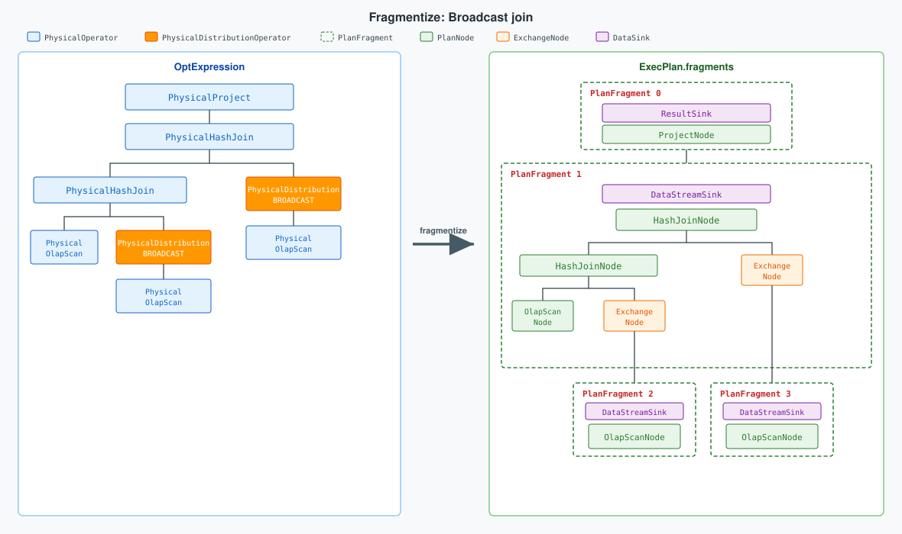

When both join children need **`SHUFFLE_JOIN`** and the aggregate needs **`SHUFFLE_AGG`** (the §3.12 shape), every child is cut—three distribution operators, five fragments after root GATHER:

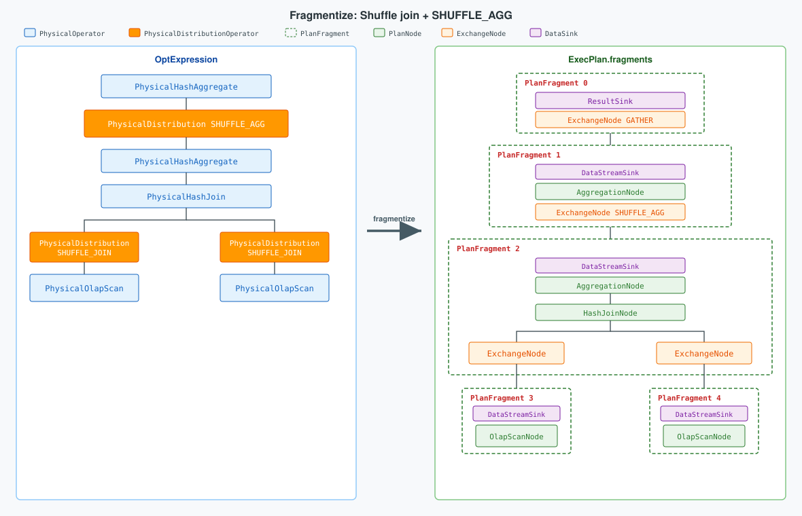

Bucket shuffle (§3.4.5 **`E2′`**) is between those shapes: the left scan stays with the join (**`LOCAL`** satisfies), the right scan is cut by **`PhysicalDistributionOperator(BUCKET)`**, and **`SHUFFLE_AGG`** still cuts local from global aggregate.

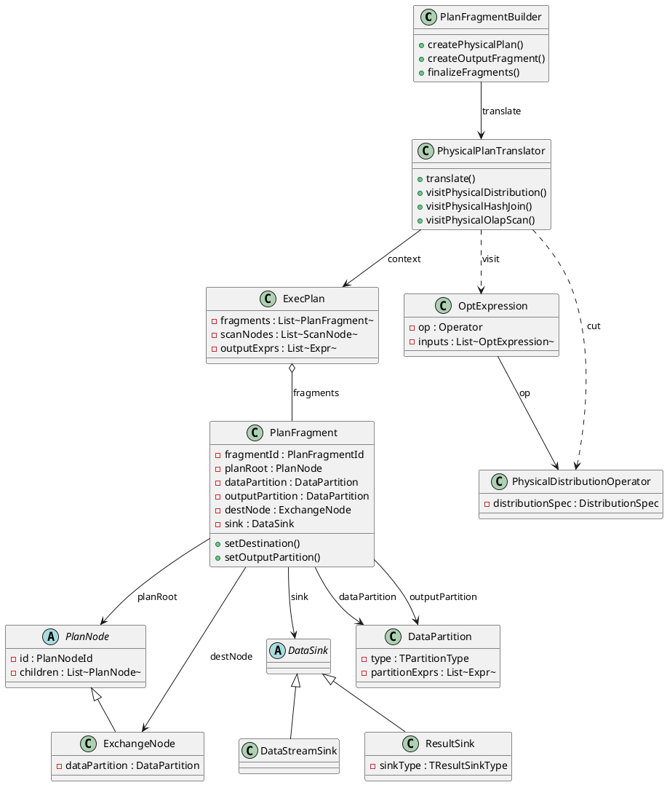
```plantuml
@startuml

class PlanFragmentBuilder {
  + createPhysicalPlan()
  + createOutputFragment()
  + finalizeFragments()
}

class PhysicalPlanTranslator {
  + translate()
  + visitPhysicalDistribution()
  + visitPhysicalHashJoin()
  + visitPhysicalOlapScan()
}

class ExecPlan {
  - fragments : List~PlanFragment~
  - scanNodes : List~ScanNode~
  - outputExprs : List~Expr~
}

class PlanFragment {
  - fragmentId : PlanFragmentId
  - planRoot : PlanNode
  - dataPartition : DataPartition
  - outputPartition : DataPartition
  - destNode : ExchangeNode
  - sink : DataSink
  + setDestination()
  + setOutputPartition()
}

abstract class PlanNode {
  - id : PlanNodeId
  - children : List~PlanNode~
}

class ExchangeNode {
  - dataPartition : DataPartition
}

abstract class DataSink
class DataStreamSink
class ResultSink {
  - sinkType : TResultSinkType
}

class DataPartition {
  - type : TPartitionType
  - partitionExprs : List~Expr~
}

class OptExpression {
  - op : Operator
  - inputs : List~OptExpression~
}

class PhysicalDistributionOperator {
  - distributionSpec : DistributionSpec
}

PlanFragmentBuilder --> PhysicalPlanTranslator : translate
PhysicalPlanTranslator ..> OptExpression : visit
PhysicalPlanTranslator ..> PhysicalDistributionOperator : cut
PhysicalPlanTranslator --> ExecPlan : context
ExecPlan o-- PlanFragment : fragments
PlanFragment --> PlanNode : planRoot
PlanFragment --> DataPartition : dataPartition
PlanFragment --> DataPartition : outputPartition
PlanFragment --> ExchangeNode : destNode
PlanFragment --> DataSink : sink
PlanNode <|-- ExchangeNode
DataSink <|-- DataStreamSink
DataSink <|-- ResultSink
OptExpression --> PhysicalDistributionOperator : op

@enduml
```

**`PhysicalPlanTranslator`** turns each physical operator into **`PlanNode`s** inside a **`PlanFragment`**. Only **`visitPhysicalDistribution`** starts a new fragment and wires the producer’s **`destNode`** / **`outputPartition`**. **`ResultSink`** is attached later on the root fragment; intermediate edges use a stream sink toward the consumer **`ExchangeNode`**.

```java
ExecPlan execPlan = new ExecPlan(connectContext, colNames, plan, outputColumns, isShortCircuit);
createOutputFragment(new PhysicalPlanTranslator(columnRefFactory).translate(plan, execPlan),
        execPlan, outputColumns, hasOutputFragment);
return finalizeFragments(execPlan, resultSinkType);
```

The cut itself is **`visitPhysicalDistribution`**: one distribution requirement, one new fragment. Translate the child first (**`inputFragment`**), then splice an **`ExchangeNode`** above it and return the consumer fragment:

```java
ExchangeNode exchangeNode = new ExchangeNode(context.getNextNodeId(),
        inputFragment.getPlanRoot(), distribution.getDistributionSpec().getType());
DataPartition dataPartition =
        translateDistributionToDataPartition(distribution.getDistributionSpec(), context);
inputFragment.setDestination(exchangeNode);
inputFragment.setOutputPartition(dataPartition);
context.getFragments().add(new PlanFragment(context.getNextFragmentId(), exchangeNode, dataPartition));
```

A shuffle join sets the child’s output to **`TPartitionType.HASH_PARTITIONED`** on the join keys (`computeShuffleHashBucketPlanFragment`). A two-phase aggregate sets the local (update serialize) fragment’s output partition to **`DataPartition.hashPartitioned(group keys)`** so the merge (merge finalize) fragment receives one group on one worker.

### 3.6 Schedule

**`StmtExecutor.handleQueryStmt()`** builds **`DefaultCoordinator`**, registers the query, and starts scheduling. **`CoordinatorPreprocessor.computeFragmentInstances()`** assigns every fragment to workers: scan fragments via **`LocalFragmentAssignmentStrategy`** (tablet → replica BE in shared-nothing; lake shard → warehouse CN in shared-data); remote/exchange fragments via **`RemoteFragmentAssignmentStrategy`**.

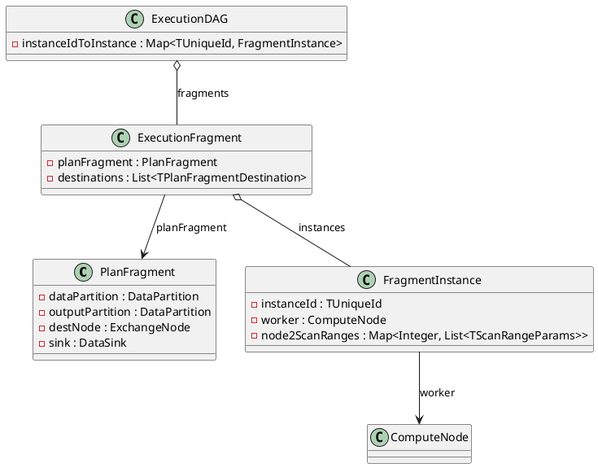
```plantuml
@startuml

class PlanFragment {
  - dataPartition : DataPartition
  - outputPartition : DataPartition
  - destNode : ExchangeNode
  - sink : DataSink
}

class ExecutionDAG {
  - instanceIdToInstance : Map<TUniqueId, FragmentInstance>
}

class ExecutionFragment {
  - planFragment : PlanFragment
  - destinations : List<TPlanFragmentDestination>
}

class FragmentInstance {
  - instanceId : TUniqueId
  - worker : ComputeNode
  - node2ScanRanges : Map<Integer, List<TScanRangeParams>>
}

ExecutionDAG o-- ExecutionFragment : fragments
ExecutionFragment --> PlanFragment : planFragment
ExecutionFragment o-- FragmentInstance : instances
FragmentInstance --> ComputeNode : worker

@enduml
```

A **`PlanFragment`** is still one stage. **`ExecutionFragment`** is that stage plus assignment: **`instances`** and Exchange **`destinations`**. Each **`FragmentInstance`** is one run of the stage on one **`worker`**, with **`node2ScanRanges`** (tablet ids) for scans. CBO distribution only named buckets; this step binds buckets to machines.

```java
coord = getCoordinatorFactory().createQueryScheduler(context, fragments, scanNodes, descTable, execPlan);
QeProcessorImpl.INSTANCE.registerQuery(context.getExecutionId(), ...);
coord.execWithQueryDeployExecutor(context);   // prepareExec() then deliverExecFragments()
```

```java
void computeFragmentInstances() {
    for (ExecutionFragment execFragment : executionDAG.getFragmentsInPostorder()) {
        fragmentAssignmentStrategyFactory.create(execFragment, lazyWorkerProvider.get())
                .assignFragmentToWorker(execFragment);
    }
    executionDAG.finalizeDAG();
}
```

A scan fragment becomes one **`FragmentInstance`** per chosen worker, each carrying that worker’s **`TScanRangeParams`** (tablet ids). The same **`PlanFragment`** therefore runs in parallel without the FE copying rows.

### 3.7 Deploy

**`prepareExec()`** attaches a **`ResultReceiver`** to the root instance’s worker, then **`Deployer.deployFragments()`** RPCs each instance.

```java
receiver = new ResultReceiver(rootInstance.getInstanceId(), workerId, worker.getBrpcAddress(), timeoutMs);
// Deployer:
executions.forEach(FragmentInstanceExecState::deployAsync);
// FragmentInstanceExecState:
deployFuture = BackendServiceClient.getInstance()
        .execPlanFragmentAsync(brpcAddress, requestToDeploy, jobSpec.getPlanProtocol());
```

### 3.8 Execute on workers

Operators run in the BE/CN pipeline engine. Intermediate batches never return to the FE; they move worker-to-worker as **`transmit_chunk`** on Exchange edges. Pipeline internals are in [Backend and Compute Node](../backend/).

### 3.9 Report status

Workers call Thrift **`FrontendService.reportExecStatus`**. **`QeProcessorImpl`** forwards to **`DefaultCoordinator.updateFragmentExecStatus()`** so the FE can cancel remaining instances on failure and know when the root is done.

### 3.10 Collect results

The FE is only a client of the root worker. **`StmtExecutor`** loops until EOS and writes MySQL packets.

```java
do {
    batch = coord.getNext();           // ResultReceiver → fetchDataAsync(root worker)
    responseRowBatch(..., batch, channel);
} while (!batch.isEos());
```

```java
PFetchDataRequest request = new PFetchDataRequest(finstId);
Future<PFetchDataResult> future = BackendServiceClient.getInstance().fetchDataAsync(address, request);
// deserialize TResultBatch from the serialized payload
```

### 3.11 Simple query: scan, filter, project

MPP still applies when there is no join and no aggregate. Parallelism is the **tablet instances**; the only shuffle is an optional GATHER so the client sees one stream.

```sql
CREATE TABLE sales (
    dt     DATE,
    id     BIGINT,
    amount DECIMAL(12, 2)
)
DUPLICATE KEY(dt, id)
PARTITION BY RANGE(dt) (
    PARTITION p2024 VALUES [('2024-01-01'), ('2025-01-01'))
)
DISTRIBUTED BY HASH(id) BUCKETS 2;

SELECT id, amount
FROM sales
WHERE dt = '2024-06-01';
```

Partition **`p2024`** has two tablets (**`BUCKETS 2`**): **T100** (replicas on BE-1, BE-2) and **T101** (replicas on BE-2, BE-3). After CBO the physical tree is **`OlapScan`** (predicate pushed to the scan) + project. **`createOutputFragment()`** sees two tablets, so it does **not** pin **`ResultSink`** on the scan fragment; it adds a GATHER exchange.

```
PLAN FRAGMENT 0                    -- root, UNPARTITIONED
  RESULT SINK
  1:EXCHANGE                       -- GATHER

PLAN FRAGMENT 1                    -- RANDOM (tablet-parallel)
  STREAM DATA SINK
    EXCHANGE ID: 01  UNPARTITIONED
  0:OlapScanNode  TABLE: sales
     PREDICATES: dt = '2024-06-01'
     tablets: T100, T101
```

**`LocalFragmentAssignmentStrategy`** places one F1 instance on a live replica of each tablet (for example BE-1 for T100, BE-2 for T101). F0 has a single instance on one of those workers (or another BE); that instance is the **`ResultReceiver`** target. Each F1 instance scans its local segments, evaluates the predicate in the scan, and **`transmit_chunk`**s surviving rows to F0. The FE only **`fetch_data`**s F0.

If the optimizer can prove a **single tablet** (or short-circuit PK lookup), **`createOutputFragment()`** skips the GATHER fragment and hangs **`ResultSink`** on the scan fragment—one instance, still a deployed worker plan, not an FE-local tree.

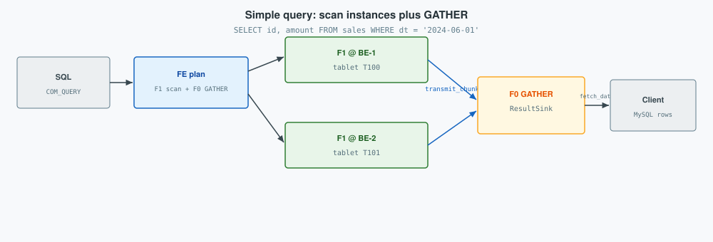

### 3.12 Complete query: shuffle join and two-phase aggregate

A join plus **`GROUP BY`** is the full MPP shape: two scan stages, a hash-partitioned join, a local (update serialize) aggregate, a second shuffle on the group key, and a merge (merge finalize) aggregate under **`ResultSink`**. **`orders`** is **`DISTRIBUTED BY HASH(cust_id)`**; **`customers`** is **`HASH(id)`**; they are not colocated.

```sql
CREATE TABLE orders (
    dt      DATE,
    cust_id BIGINT,
    amount  DECIMAL(12, 2)
)
DUPLICATE KEY(dt, cust_id)
PARTITION BY RANGE(dt) (
    PARTITION p2024 VALUES [('2024-01-01'), ('2025-01-01'))
)
DISTRIBUTED BY HASH(cust_id) BUCKETS 8;

CREATE TABLE customers (
    id     BIGINT,
    region VARCHAR(32)
)
PRIMARY KEY(id)
DISTRIBUTED BY HASH(id) BUCKETS 8;

SELECT c.region, SUM(o.amount)
FROM orders o
JOIN customers c ON o.cust_id = c.id
WHERE o.dt BETWEEN '2024-01-01' AND '2024-06-30'
GROUP BY c.region;
```

When the tables are **not** colocated on the join key, CBO requires **`HASH_PARTITIONED`** on **`o.cust_id` / `c.id`**. **`visitPhysicalDistribution`** therefore cuts a fragment per scan and a fragment for the join (that fragment’s **`DataPartition`** is the join key, not **`region`**). The aggregate is split: local **`AGGREGATE (update serialize) STREAMING`** stays with the join; **`AGGREGATE (merge finalize)`** runs after a second hash shuffle on **`c.region`**. **`createOutputFragment()`** then GATHERs the still-partitioned merge output into **`ResultSink`**.

```
PLAN FRAGMENT 0                    -- UNPARTITIONED
  RESULT SINK
  9:EXCHANGE                       -- GATHER

PLAN FRAGMENT 1                    -- HASH_PARTITIONED: region
  8:AGGREGATE (merge finalize)
  7:EXCHANGE                       -- HASH_PARTITIONED: region

PLAN FRAGMENT 2                    -- HASH_PARTITIONED: cust_id
  STREAM DATA SINK
    EXCHANGE ID: 07  HASH_PARTITIONED: region
  6:AGGREGATE (update serialize)
     STREAMING
  5:Project
  4:HASH JOIN
     2:EXCHANGE                    -- HASH_PARTITIONED: o.cust_id
     3:EXCHANGE                    -- HASH_PARTITIONED: c.id

PLAN FRAGMENT 3                    -- RANDOM
  STREAM DATA SINK
    EXCHANGE ID: 02  HASH_PARTITIONED: cust_id
  1:OlapScanNode  TABLE: orders
     PREDICATES: dt BETWEEN ...

PLAN FRAGMENT 4                    -- RANDOM
  STREAM DATA SINK
    EXCHANGE ID: 03  HASH_PARTITIONED: id
  0:OlapScanNode  TABLE: customers
```

Execution, not a single tree:

1. **F3 / F4 instances** start on the BEs that hold the chosen **`orders`** / **`customers`** tablet replicas. Scans run in parallel; each instance hashes outgoing chunks on the join key and **`transmit_chunk`**s to the F2 workers that own those hash buckets.
2. **F2 instances** run the **`HASH JOIN`**, then the local aggregate. Partial **`(region, sum)`** groups are hashed on **`region`** and shuffled to F1.
3. **F1 instances** merge partials for their **`region`** buckets. F0 GATHERs finalized rows and serves **`fetch_data`**. The FE session thread only entered the picture at this sink.

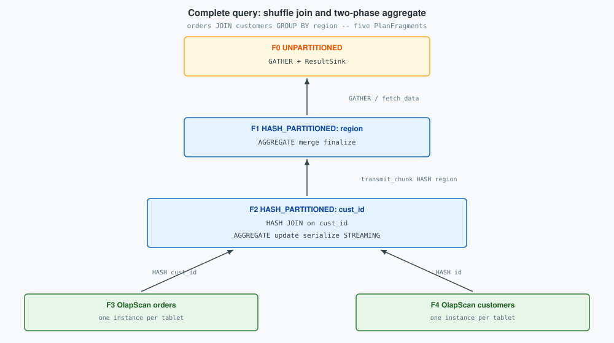

CBO may replace the join shuffle with **broadcast** (small **`customers`**) or **colocate / local bucket shuffle** (same tablet mapping on the join key). Those plans drop one or both join-side Exchange fragments; they are still MPP—scan instances remain parallel—but they avoid a full network repartition. The two-phase aggregate remains whenever group keys are not already aligned with the fragment partition.

**`EXPLAIN`** prints this fragment DAG; **`EXPLAIN SCHEDULER`** prints the **`FragmentInstance`** → worker assignment that **`computeFragmentInstances()`** produced. That pair is the MPP plan the cluster actually runs.

---

## 4. Load transaction

A StarRocks **transaction** is not a client SQL transaction. There is no `BEGIN` / `COMMIT` that isolates several statements the way InnoDB does. **`DmlStmt.txnId`** is a **load transaction**: a ticket for **one** INSERT, UPDATE, DELETE, MERGE, or stream load so that write becomes visible as a single tablet-version change.

OLAP visibility is **tablet version**, not a mixed-statement WAL. **`StatementPlanner.plan()`** calls **`beginTransaction()`** for DML. **`GlobalTransactionMgr.beginTransaction`** creates a **`TransactionState`** (`label`, source usually **`INSERT_STREAMING`**) and stores the id on the statement. BE writers produce new rowsets under that id. **Commit** then **publish version** moves every replica of the affected tablets to the same new version, so readers either see the whole write or none of it. **Abort** discards unpublished deltas.

A **`SELECT`** never begins this path. **`EXPLAIN`** (except **`EXPLAIN ANALYZE`**), **`INSERT INTO FILES`**, and the old non-PK delete skip **`beginTransaction()`**. If **`session.getTxnId() != 0`**, the statement reuses that id (grouped inserts), still not a general SQL txn.

```java
txnId = transactionMgr.beginTransaction(
        dbId, Lists.newArrayList(targetTable.getId()), label,
        new TransactionState.TxnCoordinator(FE, localHost),
        TransactionState.LoadJobSourceType.INSERT_STREAMING,
        session.getExecTimeout(), session.getCurrentComputeResource());
stmt.setTxnId(txnId);
```

## 5. References

1. K. Kang, “StarRocks Query Optimizer,” CMU Database Group Seminar, 31 March 2025. [Notes](https://kangkaisen.com/post/cmu-starrocks-query-optimizer).
2. G. Graefe, “The Cascades Framework for Query Optimization,” *IEEE Data Engineering Bulletin*, vol. 18, no. 3, pp. 19–29, 1995. [PDF](https://15721.courses.cs.cmu.edu/spring2016/papers/graefe-ieee1995.pdf).
3. Y. Xu, “Efficiency in the Columbia Database Query Optimizer,” M.S. thesis, Portland State University, 1998. [PDF](https://15721.courses.cs.cmu.edu/spring2019/papers/22-optimizer1/xu-columbia-thesis1998.pdf).
