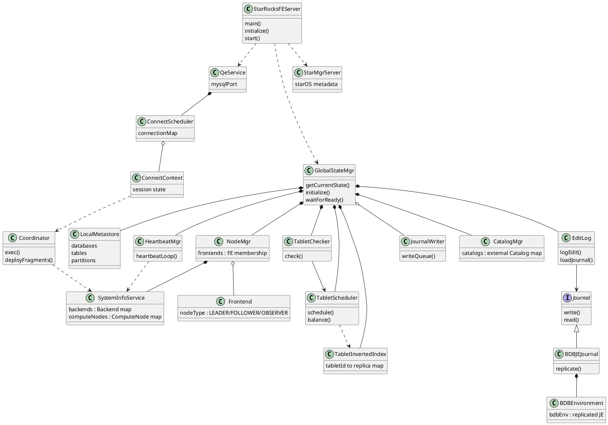
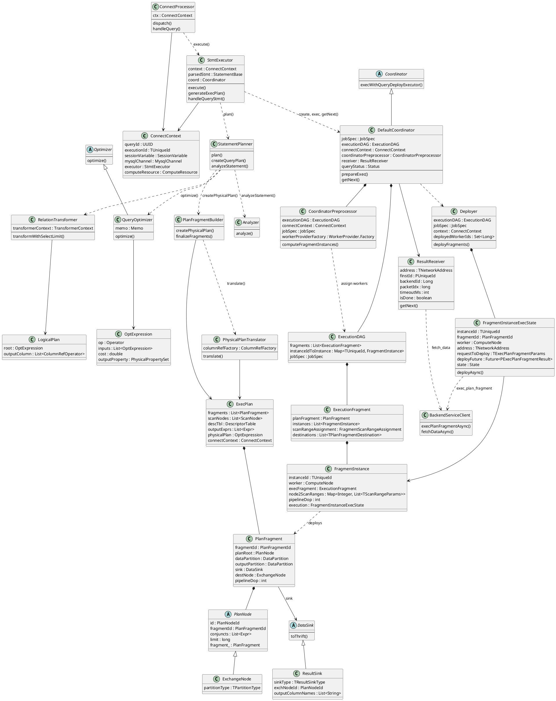

**StarRocks** is a MySQL-compatible MPP OLAP engine. A cluster is **Frontend (FE)** nodes for metadata and query coordination plus **Backend (BE)** or **Compute Node (CN)** workers for execution. This post covers **cluster topology** and the **MPP** path from SQL on the FE to fragment deploy and result pull. Worker process internals are in [Backend and Compute Node](../backend/).
<!--more-->

Related: [Backend and Compute Node](../backend/).

---

## 1. Overview

StarRocks speaks the **MySQL protocol** and ANSI SQL. Clients connect to any FE; the **leader FE** owns metadata writes and schedules work onto compute nodes. The FE that accepts SQL does **not** execute operators—that is the MPP split versus classic OLTP.

| Piece | Language | Role in the cluster |
|-------|----------|---------------------|
| **FE** | Java | Catalog, SQL plan, **Coordinator**, tablet/replica scheduling |
| **BE** | C++ | Local OLAP storage + vectorized execution (shared-nothing) |
| **CN** | C++ (same binary as BE) | Compute + cache; data on object storage (shared-data) |

Deployment mode is fixed at cluster init via **`Config.run_mode`**, detected in **`RunMode.detectRunMode()`**:

| Mode | Compute nodes | Storage |
|------|---------------|---------|
| **`shared_nothing`** | **Backend** with local disks | **`LocalTablet`** replicas on BEs |
| **`shared_data`** | **ComputeNode** (`starrocks_be --cn`) | **`LakeTablet`** segments on S3/HDFS/MinIO; StarOS manages shards |

There is no external metadata service: FE metadata is replicated with **BDB JE**, and tablet placement lives in the FE catalog. How a BE/CN process starts, stores tablets, and runs the pipeline engine is covered in [Backend and Compute Node](../backend/).


---

## 2. Architecture

### 2.1 Cluster topology

StarRocks keeps the surface small: **FE + BE** (shared-nothing) or **FE + CN + object storage** (shared-data). Nodes scale horizontally; FE metadata and data replicas have internal redundancy.

**Clients** send SQL to any FE (typically via a load balancer). **FEs** form an HA group:

| FE role (`FrontendNodeType`) | Metadata | Leader election |
|------------------------------|----------|-----------------|
| **Leader** | Read/write; replicates journal to followers | Elected from followers (> half alive) |
| **Follower** | Read; replays leader journal | Participates in election |
| **Observer** | Read; replays journal | Does **not** vote — scales read/metadata fan-out |

Each FE holds a full in-memory catalog copy backed by **BDB JE** (Berkeley DB Java Edition). Metadata writes go to the leader and must replicate to a quorum of followers before they are considered durable.

**Compute registration.** BEs and CNs heartbeat to the **leader FE** over Thrift **`HeartbeatService`**, reporting ports (`be_port`, `brpc_port`, `starlet_port`), disk capacity, and liveness. **`SystemInfoService`** tracks **`Backend`** and **`ComputeNode`** instances; **`HeartbeatMgr`** drives the heartbeat loop. Worker-side heartbeat and service ports are detailed in [Backend and Compute Node](../backend/).

**Tablets as placement units.** OLAP tables are partitioned; each partition holds one or more **tablets** (the unit of sharding and replication). In shared-nothing, each **`LocalTablet`** has **`Replica`** objects on BEs; the FE **`TabletScheduler`** repairs and balances them. In shared-data, **`LakeTablet`** maps to a StarOS shard and object-storage segments. The Coordinator uses that placement map when assigning scan **`FragmentInstance`**s—worker storage layout is in the [Backend](../backend/) post.

### 2.2 Frontend (FE)

The FE process entry is **`StarRocksFE`** → **`StarRocksFEServer`**. **`GlobalStateMgr`** is the central singleton: it wires catalog, node registry, load/transaction managers, and HA state.

| Subsystem | Responsibility |
|-----------|----------------|
| **`CatalogMgr` / `InternalCatalog`** | Databases, tables, partitions, materialized views |
| **`NodeMgr` / `SystemInfoService`** | FE and BE/CN membership |
| **`TabletInvertedIndex`, `TabletScheduler`** | Tablet health, replica repair, balance |
| **SQL engine** (`sql/`, `planner/`, optimizer) | Parse, analyze, CBO, physical **`PlanFragment`** generation |
| **`Coordinator`** | Deploy fragments to BE/CN, collect status, return results |
| **`QeService`** | MySQL wire protocol to clients |

**FE composition.** **`StarRocksFEServer`** bootstraps **`GlobalStateMgr`** and network services. The singleton owns catalog and node registries, tablet scheduling, and the metadata journal; **`QeService`** accepts MySQL sessions and drives **`Coordinator`** instances per query.



On **shared-data** clusters the FE also starts **`StarMgrServer`** (StarOS metadata) alongside the BDB JE journal.

### 2.3 MPP: PlanFragment planning and result collection

**MPP (Massively Parallel Processing)** means: one SQL statement becomes a **pipeline of stages**, each stage runs on **many machines at once**, and stages pass data to each other by **shuffling**—not by sharing memory in one process. That is the opposite of a classic single-node plan, where one server walks one operator tree end to end.

In StarRocks a stage is a **`PlanFragment`**; each fragment runs as many **`FragmentInstance`**s on BE/CN workers; shuffle is **`transmit_chunk`** on **Exchange** edges. The FE only builds that plan, deploys instances, and pulls the root rows.

OLAP needs this because analytics are large **computations** over sharded tablets—parallel workers finish the scan/join/agg faster than one node can. OLTP avoids it because its cost is the **transaction**: short updates want one node’s log and locks; MPP would make every small write a distributed commit.

| | OLTP | StarRocks MPP |
|--|------|---------------|
| Bottleneck | Transaction (commit, isolation) | Compute (scan / join / agg) |
| Plan shape | One local operator tree | **`PlanFragment`** DAG across workers |
| SQL endpoint | Executes | Plans and coordinates |


1. **Receive SQL** — **`ConnectProcessor.handleQuery()`** reads a MySQL **`COM_QUERY`**, parses it, and creates **`StmtExecutor`** bound to **`ConnectContext`**. Protocol looks like OLTP; steps 5–10 are MPP.

2. **Analyze** — **`StmtExecutor.generateExecPlan()`** calls **`StatementPlanner.plan()`** → **`analyzeStatement()`** → **`Analyzer.analyze()`**. Catalog objects are resolved and partition-pruning metadata is collected.

3. **Build logical plan** — **`RelationTransformer.transformWithSelectLimit()`** produces a **`LogicalPlan`** (logical operator tree + output columns).

4. **Optimize** — **`QueryOptimizer.optimize()`** runs CBO over a memo and outputs a physical **`OptExpression`** tree (scan/join/aggregate placement, runtime-filter hints).

5. **Fragmentize (MPP split)** — Unlike OLTP's one tree, **`PlanFragmentBuilder.createPhysicalPlan()`** / **`PhysicalPlanTranslator.translate()`** cut the plan at **Exchange** boundaries into **`PlanFragment`** stages. Each fragment has a **`PlanNode`** subtree, **`DataPartition`**, and **`DataSink`** (shuffle or root **`ResultSink`**). **`createOutputFragment()`** may add a GATHER exchange; **`finalizeFragments()`** sets **`TResultSinkType.MYSQL_PROTOCAL`** on the root sink. Output is an **`ExecPlan`**.

6. **Schedule** — **`StmtExecutor.handleQueryStmt()`** builds **`DefaultCoordinator`**, registers the query in **`QeProcessorImpl`**, and calls **`execWithQueryDeployExecutor()`**. **`CoordinatorPreprocessor.computeFragmentInstances()`** maps tablets / scan ranges to BE replicas (shared-nothing) or warehouse CNs (shared-data) and builds an **`ExecutionDAG`** of **`FragmentInstance`** objects. Remote stages use **`RemoteFragmentAssignmentStrategy`**.

7. **Deploy** — **`DefaultCoordinator.prepareExec()`** attaches a **`ResultReceiver`** to the root instance's worker. **`Deployer.deployFragments()`** sends **`TExecPlanFragmentParams`** via **`BackendServiceClient.execPlanFragmentAsync()`** (brpc **`exec_plan_fragment`**) to each **`FragmentInstanceExecState`**.

8. **Execute on workers** — Operators run on BE/CN (not on the FE session thread as in OLTP). Intermediate batches shuffle with **`transmit_chunk`**; the FE does not see that traffic. Pipeline execution on the worker is in [Backend and Compute Node](../backend/).

9. **Report status** — workers call Thrift **`FrontendService.reportExecStatus`** → **`QeProcessorImpl`** → **`DefaultCoordinator.updateFragmentExecStatus()`**.

10. **Collect results** — OLTP would return rows from the same process; here **`StmtExecutor`** loops **`coord.getNext()`** → **`ResultReceiver.getNext()`** → **`BackendServiceClient.fetchDataAsync()`** on the root worker, then encodes **`TResultBatch`** through **`MysqlChannel`**.

**Fragment shape vs OLTP.** For `SELECT region, SUM(amount) … GROUP BY region` over two tablets, OLTP typically runs one local scan + aggregate. StarRocks MPP yields **F0** (scan instance per tablet), **F1** (partial hash aggregate + shuffle on group key), **F2** (merge aggregate + **`ResultSink`**)—parallel stages linked by Exchange, not a single-node tree.



### 2.4 FE ↔ worker protocols (query path)

| Direction | Protocol | Typical use |
|-----------|----------|-------------|
| Client → FE | MySQL | Interactive SQL, auth, result sets |
| BE/CN → FE leader | Thrift **`HeartbeatService`** | Registration, master info, run mode |
| BE → FE leader | Thrift **`FrontendService`** | `reportExecStatus`, task finish, load txn |
| FE leader → BE/CN | brpc **`PInternalService`** | **`exec_plan_fragment`**, **`transmit_chunk`**, runtime filters, tablet writer |
| FE leader → BE/CN | Thrift **`BackendService`** | Agent tasks, legacy sync APIs |
| BE ↔ BE | brpc | Shuffle exchange, broadcast filters |

The hot query path is **brpc/protobuf** on each node's **`brpc_port`**. Thrift remains for heartbeat, reporting, and tablet maintenance agents.


---

## 3. Implementation

### 3.1 Run mode selection

At FE boot, **`RunMode.detectRunMode()`** reads **`Config.run_mode`** and exits if the value is neither `shared_nothing` nor `shared_data`. The chosen mode flows to BE/CN heartbeats as **`TRunMode`** and drives which tablet class (`LocalTablet` vs `LakeTablet`) the catalog creates—and therefore how the Coordinator assigns scan instances.

### 3.2 Query execution path

The end-to-end MPP flow is in **§2.3**. At implementation level:

1. **Connect** — client opens a MySQL session to an FE; **`ConnectContext`** holds session state.
2. **Parse and plan** — **`StatementPlanner`** produces an **`ExecPlan`**; fragment boundaries and worker assignment differ by run mode.
3. **Coordinate** — **`DefaultCoordinator`** deploys instances and **`ResultReceiver`** pulls root batches.
4. **Execute on BE/CN** — pipeline engine runs fragments; **`transmit_chunk`** shuffles between workers ([Backend](../backend/)).
5. **Collect** — **`StmtExecutor`** encodes **`TResultBatch`** rows into the MySQL protocol.

For **shared-nothing**, **`LocalFragmentAssignmentStrategy`** places scan instances on BEs that hold tablet replicas. For **shared-data**, **`DefaultSharedDataWorkerProvider`** scopes workers to a warehouse **`ComputeResource`** and assigns lake scans via **`LakeTablet`** shard metadata.

### 3.3 Worked example: `SELECT` on a shared-nothing table

Table **`sales`** has partition **`p2024`** with tablets **T100** (replicas on BE-1, BE-2) and **T101** (replicas on BE-2, BE-3).

```sql
SELECT region, SUM(amount)
FROM sales
WHERE dt = '2024-06-01'
GROUP BY region;
```

**FE (MPP).** Optimizer picks partition **`p2024`**, builds fragments: (F0) tablet scans with **`dt`** predicate pushdown; (F1) partial hash aggregate per tablet; (F2) merge aggregate + project. **`Coordinator`** sends F0 instances to BE-1 and BE-2 for T100/T101 respectively, then F1/F2 on a subset of BEs with shuffle edges. Root rows return through **`ResultReceiver`** → client.

**Workers.** Each F0 scan reads columnar segments from its local replica (or lake segments on CN), evaluates the filter, and emits batches; **`transmit_chunk`** moves partial groups toward F2. That worker-side path is in [Backend and Compute Node](../backend/).

The same SQL on a **lake table** in shared-data mode replaces local replica lookup with **`LakeTablet`** shard metadata and CN cache/object-storage reads; the FE **`Coordinator`** path is unchanged.
