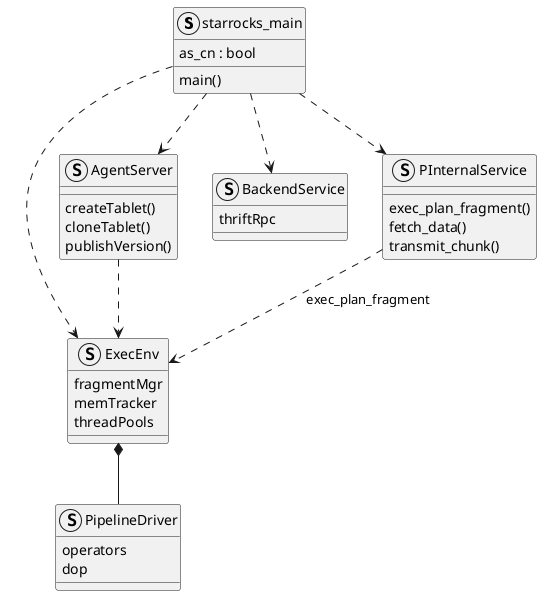

**Backend (BE)** and **Compute Node (CN)** are the C++ workers that execute StarRocks **`PlanFragment`** instances. They share one binary; BE hosts local tablet data (shared-nothing), CN runs compute and cache against object storage (shared-data). FE query planning and the MPP path are in [FE query planning and the MPP path](../architecture/).
<!--more-->

Related: [FE query planning and the MPP path](../architecture/).

---

## 1. Overview

The FE plans SQL into a **`PlanFragment`** DAG and deploys instances over brpc. The process that **runs** those instances is a BE or CN. Clients never connect to workers for interactive SQL; workers speak Thrift/brpc to the FE and to each other for shuffle.

| Mode | Process | Storage |
|------|---------|---------|
| **`shared_nothing`** | **Backend** | Local disks; **`LocalTablet`** directories + replicas |
| **`shared_data`** | **Compute Node** (`--cn`) | Object storage via Starlet; **`LakeTablet`** / shard cache |

Both roles report to the FE leader through **`HeartbeatService`** and expose Thrift **`BackendService`** plus brpc **`PInternalService`** for fragment deploy, status, and **`transmit_chunk`**. How the FE builds and schedules fragments is in the [architecture](../architecture/) post.

---

## 2. Architecture

### 2.1 One binary, two roles

BE and CN share one C++ entry (`starrocks_main.cpp`). Passing **`--cn`** selects compute-node mode and typically **`cn.conf`** instead of **`be.conf`**.

```cpp
// starrocks_main.cpp (abbreviated)
bool as_cn = false;
if (argc > 1 && strcmp(argv[1], "--cn") == 0) {
    as_cn = true;
}
```

On the FE membership model, **`Backend`** extends **`ComputeNode`**. A backend sets **`isSetStoragePath = true`** and reports **`DiskInfo`**; it hosts **`LocalTablet`** data directories. A CN is a **`ComputeNode`** without local data paths—it executes plans and caches hot data while **`LakeTablet`** files live in object storage.

### 2.2 Process composition

Startup (conceptually):

1. Daemon / flags / config
2. Storage engine (local path on BE; Starlet / lake IO on CN)
3. **`ExecEnv`** — operators, memory tracker, pipeline thread pools
4. **`AgentServer`** — tablet create/delete, clone, publish-version tasks from FE
5. Thrift **`BackendService`** + brpc **`PInternalService`**
6. Heartbeat loop back to FE leader

| Component | Role |
|-----------|------|
| **`ExecEnv`** | Global execution environment: fragment mgr, query context, mem, threads |
| **`AgentServer`** | Applies FE agent tasks (create tablet, clone, drop, publish) |
| **`BackendService`** (Thrift) | Legacy / sync RPCs, some task paths |
| **`PInternalService`** (brpc) | **`exec_plan_fragment`**, **`fetch_data`**, **`transmit_chunk`**, runtime filters |
| Pipeline engine (`exec/pipeline/`) | Vectorized operators; DOP = pipeline drivers per instance |



### 2.3 Local tablet vs lake tablet (on the worker)

**Shared-nothing — `LocalTablet`.** Data lives under the BE storage root as tablet directories: metadata, rowsets, columnar segments and indexes. Replicas are FE-managed; the BE applies clone and publish-version agent tasks. Scan fragments usually run on a BE that already holds a healthy replica so IO stays local.

**Shared-data — `LakeTablet`.** Segment layout is the same columnar format; persistence is object storage. The CN (or BE in lake mode) pulls/caches segments through Starlet. Tablet id aligns with the StarOS shard id. Scan placement is warehouse/CN assignment on the FE, not local replica affinity.

### 2.4 Fragment execution and shuffle

When the FE **`Deployer`** calls brpc **`exec_plan_fragment`**, the worker deserializes **`TExecPlanFragmentParams`**, builds a pipeline for that **`FragmentInstance`**, and starts drivers. Scan operators read local rowsets or lake segments; join/aggregate operators run vectorized batches.

**Exchange** between fragments does not go through the FE. A producing instance sends batches with **`transmit_chunk`** to consuming instances' brpc addresses from the fragment destinations map. The root fragment's **`ResultSink`** retains batches for the FE **`ResultReceiver`** to **`fetch_data`**. Status and profiles return on Thrift **`reportExecStatus`**.

That FE-side deploy / fetch loop is in [FE query planning and the MPP path](../architecture/) §3.

---

## 3. Implementation

### 3.1 Heartbeat and registration

On a timer the worker sends Thrift heartbeat to the FE leader: ports, disks (BE), run mode, alive status. Failed heartbeat leads the FE to mark the node dead and to reschedule tablets / avoid that worker for new fragments.

### 3.2 Tablet lifecycle (worker side)

| FE event | BE/CN action |
|----------|--------------|
| Create table / tablet | Agent **create tablet**: dirs + initial meta (BE) or lake meta/shard bind |
| Load / insert publish | Flush memtable → segments; apply **publish version** so the version is readable |
| Replica repair | **Clone** task: pull snapshot from peer BE into local tablet dir |
| Drop | Agent removes tablet directory / lake references |

FE catalog and **`TabletScheduler`** decisions are in the [architecture](../architecture/) post; this table is only what runs on the worker.

### 3.3 Handling `exec_plan_fragment`

1. brpc receives **`PExecPlanFragmentRequest`** (serialized **`TExecPlanFragmentParams`**).
2. **`FragmentMgr`** / exec env creates query/fragment context, descriptor table, scan ranges.
3. Pipeline builder instantiates operators for the plan tree; DOP from fragment params.
4. Drivers run until EOS or cancel; exchange sinks push **`transmit_chunk`**; result sink buffers for **`fetch_data`**.
5. Periodic / final **`reportExecStatus`** to FE with profile and error state.

### 3.4 Worked example: worker view of `GROUP BY`

Continuing the `sales` example from [architecture](../architecture/) §3: tablets **T100** / **T101**, fragments **F0** (scan), **F1** (partial agg), **F2** (merge + result).

**BE-1 (F0 for T100).** Pipeline scan reads columnar segments for the pushed-down `dt` predicate, projects `region` / `amount`, feeds partial hash aggregate (or ships to F1 per plan). Output batches go to F1/F2 destinations via **`transmit_chunk`**.

**Root worker (F2).** Merge aggregate consumes shuffled partial groups; **`ResultSink`** serves FE **`fetch_data`** until EOS.

On a **CN** with a lake table, F0 opens lake segment readers (cache miss → object storage) instead of local replica directories; shuffle and result pull are unchanged.
