**Backend (BE)** and **Compute Node (CN)** are the C++ workers that execute StarRocks **`FragmentInstance`**s. They share one binary; BE hosts local tablet data (shared-nothing), CN runs compute and cache against object storage (shared-data).
<!--more-->

Related: [FE query planning and the MPP path](../architecture/).

---

## 1. Overview

The FE plans SQL into a **`PlanFragment`** DAG, schedules **`FragmentInstance`**s onto workers, and deploys each instance over brpc. The process that **runs** an instance is a BE or CN. Clients never open interactive SQL sessions to workers; workers speak Thrift/brpc to the FE and to each other for shuffle.

| Mode | Process | Durable user data |
|------|---------|-------------------|
| **`shared_nothing`** | **Backend** | Local disks: **`Tablet`** directories (rowsets / segments) + RocksDB meta |
| **`shared_data`** | **Compute Node** (`--cn`) | Object storage via Starlet; **`lake::Tablet`** metadata / shard cache |

Both roles report to the FE leader through Thrift **`HeartbeatService`**, expose Thrift **`BackendService`** (agent / tablet control) and brpc **`PInternalService`** (fragment deploy, result pull, **`transmit_chunk`**). This post is what happens **after** a worker receives **`exec_plan_fragment`**.

BE and CN share one C++ entry (`starrocks_main.cpp`). Passing **`--cn`** selects compute-node mode and typically **`cn.conf`** instead of **`be.conf`**.

```cpp
// starrocks_main.cpp (abbreviated)
bool as_cn = false;
if (argc > 1 && strcmp(argv[1], "--cn") == 0) {
    as_cn = true;
}
```

On the FE membership model, **`Backend`** extends **`ComputeNode`**. A backend sets **`isSetStoragePath = true`** and reports **`DiskInfo`**; it hosts tablet data directories. A CN is a **`ComputeNode`** without local data paths—it executes plans and caches hot data while lake tablet files live in object storage.

Startup (conceptually):

1. Daemon / flags / config
2. Storage engine (local **`DataDir`**s on BE; Starlet / lake IO on CN)
3. **`ExecEnv`** — fragment executor, memory tracker, pipeline thread pools
4. **`AgentServer`** — tablet create/delete, clone, publish-version tasks from FE
5. Thrift **`BackendService`** + brpc **`PInternalService`**
6. Heartbeat loop back to FE leader

| Component | Role |
|-----------|------|
| **`ExecEnv`** | Global execution environment: query contexts, mem, driver executors |
| **`HeartbeatService`** (Thrift) | Alive report to FE leader |
| **`BackendService`** (Thrift) | Agent tasks, tablet stats, routine load, export snapshot, external scanners |
| **`AgentServer`** | Applies FE agent tasks (create tablet, clone, drop, publish) from **`BackendService`** |
| **`PInternalService`** (brpc) | Query plane: **`exec_plan_fragment`**, **`fetch_data`**, **`transmit_chunk`**, runtime filters |
| Pipeline engine | Vectorized **`Operator`**s; one **`FragmentInstance`** → pipelines → **`PipelineDriver`**s |

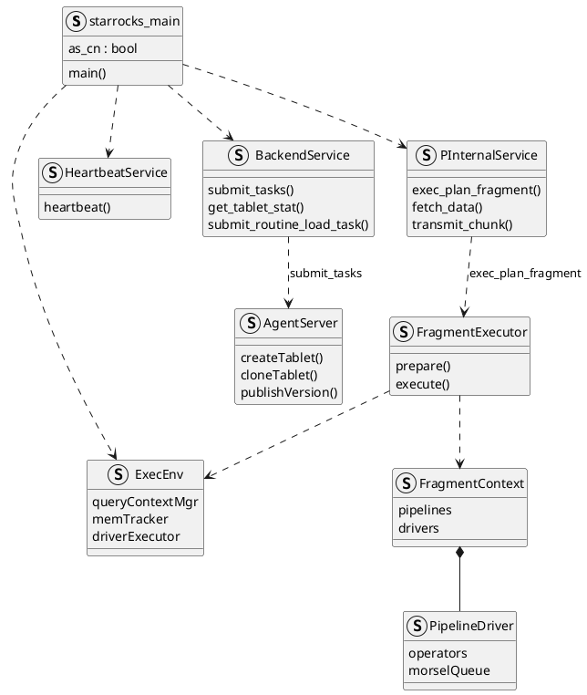

On a timer the worker sends Thrift heartbeat to the FE leader: ports, disks (BE), run mode, alive status. Failed heartbeat leads the FE to mark the node dead and to reschedule tablets / avoid that worker for new fragments.

A FE **`FragmentInstance`** is one scheduled run of a **`PlanFragment`** on one BE/CN. The worker materializes it as a **`pipeline::FragmentContext`**: pipelines, drivers, and scan **morsels**. The full architecture, types, and call path are in **§3**.

On the FE catalog a tablet is one **bucket** of one **partition** (**`LocalTablet`** + **`Replica`**). On the BE it is **`starrocks::Tablet`**: versioned **rowsets** of columnar **segments** under a **`DataDir`**, with RocksDB holding metadata only. Placement, storage stack, layout, insert, scan, and indexes are in **§2**. Shared-data uses **`lake::Tablet`** and object storage instead of a local replica tree.

---

## 2. Tablet storage and access

OLAP data reaches a BE in two steps: the FE decides **which tablet** owns a row, then that tablet’s replica stores the row in **versioned columnar files**.

**Placement (FE catalog).** A table is split first by partition, then by bucket; each bucket is a tablet.

- **Partition** — from **`PARTITION BY`** (often a date/value range). Rows land in one partition by partition-key value. No `PARTITION BY` means a single default partition. Same schema in every partition.
- **Bucket / tablet** — inside one partition, **`DISTRIBUTED BY HASH(...) BUCKETS N`** maps the distribution key to one of **N** buckets. Each bucket is an FE **`LocalTablet`** with replicas on BEs. This is the FE hash bucket, not BE `DataDir` `shard_id` (local `data/{shard}/` fan-out only).

**Storage (one BE replica).** The replica is **`starrocks::Tablet`**. On disk it is a stack of immutable files under `data/{shard}/{tablet_id}/{schema_hash}/`; RocksDB under `meta/` holds tablet/rowset/txn metadata, not user rows.

- **Tablet** — one replica of one bucket: identity in **`TabletMeta`**, and a version map of visible **rowsets**.
- **Rowset** — one publish (or compaction/clone) over a **version range** (`start_version` … `end_version`). Successive loads add new rowsets; they do not rewrite older ones. A rowset holds the **full table schema** for its rows—it does not assign different columns to different rowsets.
- **Segment** — one `.dat` file inside a rowset (`{rowset_id}_{seg_id}.dat`). Multiple segments in the same rowset split **rows** (e.g. several memtable flushes), not columns.

**Columnar** layout is **inside each segment**: `SegmentWriter` writes one page stream per column into that `.dat`; the footer stores short-key / zone-map / … indexes. Scans open the chosen segments and read only needed column pages.


```sql
CREATE TABLE sales (
  dt DATE,
  region VARCHAR(32),
  amount BIGINT
)
DUPLICATE KEY(dt, region)
PARTITION BY RANGE(dt) (
  PARTITION p202603 VALUES [("2026-03-01"), ("2026-04-01"))
)
DISTRIBUTED BY HASH(region) BUCKETS 2;

-- dt -> partition p202603; HASH(region) -> one of 2 tablets in that partition
-- load A -> new Rowset rs020a (version 3-3) on those replicas (full schema)
INSERT INTO sales VALUES
  ('2026-03-01', 'east', 100),
  ('2026-03-01', 'west', 200),
  ('2026-03-02', 'east', 150);

-- load B -> new Rowset rs031b (version 4-4); does not rewrite rs020a or split its columns
INSERT INTO sales VALUES
  ('2026-03-03', 'east', 80),
  ('2026-03-03', 'west', 90);
```

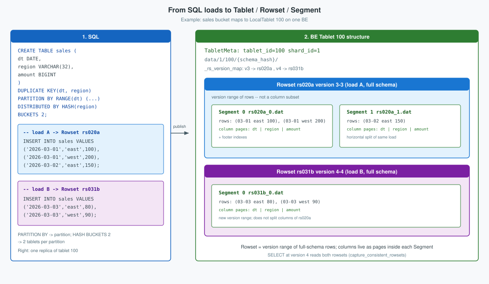

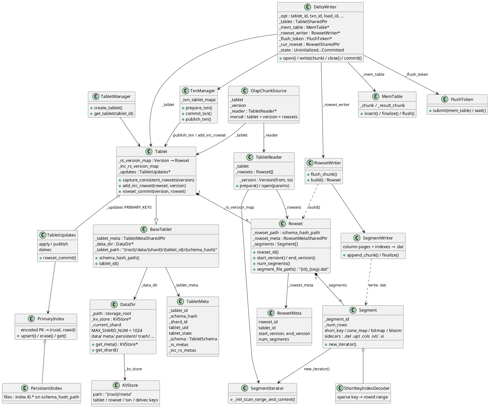

### 2.1 On-disk layout

Path construction joins **`DATA_PREFIX` (`/data`)**, shard id, tablet id, and **`schema_hash`** (historical leaf; multi-schema-hash era; still the directory shape today). There is no separate `segment/` directory: a **`Segment`** is one columnar file **`{rowset_id}_{seg_id}.dat`** (plus optional sidecars with the same prefix). A **`Rowset`** is the versioned unit that owns one or more such segments; RocksDB under **`meta/`** records which rowsets belong to the tablet.

**Shard.** Under one **`DataDir`**, user data is spread across **`data/{shard_id}/…`** with **`shard_id ∈ [0, 1024)`** (`DataDir::MAX_SHARD_NUM`). This is a **local directory fan-out** so a single disk root does not put every tablet in one flat folder—it is **not** the FE hash bucket, not a lake/StarOS shard, and not chosen by SQL `DISTRIBUTED BY`. On create-tablet, the BE picks the next id with **`DataDir::get_shard`**: round-robin **`_current_shard = (_current_shard + 1) % 1024`**, creates **`{root}/data/{shard}/`** if missing, stores that id in **`TabletMeta::shard_id`**, and builds **`data/{shard}/{tablet_id}/{schema_hash}/`**. The shard stays with the tablet for its life on that disk (clone / load reuse the meta path).

```text
{storage_root}/
├── meta/                              # RocksDB (KVStore): tablet / rowset / txn meta
├── persistent/                        # DataDir helper for persistent index
├── trash/  snapshot/  clone/  ...
└── data/
    └── {shard}/                       # e.g. 1
        └── {tablet_id}/               # e.g. 100
            └── {schema_hash}/         # BaseTablet::schema_hash_path
                ├── rs020a_0.dat       # Segment 0 of rowset rs020a
                ├── rs020a_1.dat       # Segment 1 (same rowset, if multi-segment)
                ├── rs031b_0.dat       # Segment 0 of a later published rowset
                ├── rs020a_0.del       # PK delete bitmap (when present)
                ├── rs020a_0.upt
                ├── rs020a_0_{ver}_{i}.cols
                ├── rs020a_0_{index_id}.ivt/
                ├── rs020a_0_{index_id}.vi
                └── index.l0.*         # PersistentIndex (PRIMARY_KEYS only)
```

| Artifact | Naming | Role |
|----------|--------|------|
| **Segment** | **`{rowset_id}_{seg}.dat`** | One immutable columnar file: data pages + footer (short-key, zone maps, bitmap/bloom often **inside**) |
| Delete / upt / cols | **`{rowset_id}_{seg}.del` / `.upt` / `.cols`** | PK deletes, partial update, delta column group for that segment |
| Inverted / vector | **`{rowset_id}_{seg}_{index_id}.ivt/` / `.vi`** | Standalone GIN / ANN sidecars next to that segment |
| PK persistent index | **`index.l0.*`** | Local persistent primary index under the schema-hash path (tablet-level, not per segment) |
| Meta | **`{root}/meta`** | Tablet / rowset / txn keys — separate from segment bytes |

**`TabletManager`** loads tablets from RocksDB when a **`DataDir`** starts; create-tablet agent tasks create the directory tree and initial meta.

Example: a two-bucket `sales` table becomes two FE tablets; one replica of tablet **100** on BE-1 looks like this on disk.

```sql
CREATE TABLE sales (
  dt DATE,
  region VARCHAR(32),
  amount BIGINT
)
DUPLICATE KEY(dt, region)
DISTRIBUTED BY HASH(region) BUCKETS 2;
```

**Columnar layout.** Inside one `.dat`, each table column is stored as its own sequence of data pages (plus small index pages for that column). The file ends with a footer that points at those pages and holds the short-key index. A query can read only the columns it needs. Sidecars such as `.del` / `.ivt` sit next to the `.dat`, not inside the column pages.

```text
rs020a_0.dat
├── column dt      → data pages …
├── column region  → data pages …
├── column amount  → data pages …
└── footer         → page pointers, short-key index, num_rows
```

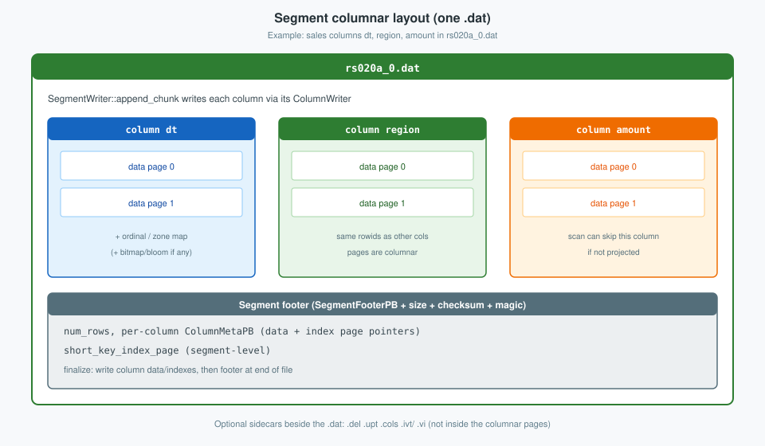

### 2.2 Insert

Load / stream load / insert on a local tablet goes through **`DeltaWriter`**:

1. **`open`** — **`TxnManager::prepare_txn`**; create **`RowsetWriter`** under **`tablet->schema_hash_path()`**.
2. **`write`** — append into **`MemTable`**; on full or memory pressure, async flush (**`MemTableFlushExecutor`**).
3. **Flush** — sort / aggregate → **`RowsetWriter`** / **`SegmentWriter`** → `.dat` (+ indexes built with the segment).
4. **`close` / `commit`** — wait flushes, **`RowsetWriter::build()`**, **`TxnManager::commit_txn`** (committed rowset, **not** scannable).
5. **Publish** — agent **`PUBLISH_VERSION`** → **`TxnManager::publish_txn`**:
   - DUP / UNIQUE / AGG: **`Tablet::add_inc_rowset(rowset, version)`**
   - PRIMARY_KEYS: **`Tablet::rowset_commit`** → **`TabletUpdates`** apply (delvec + PK index upsert)

The opening §2 diagram already shows **`DeltaWriter`**, **`MemTable`**, **`FlushToken`**, **`RowsetWriter`**, **`SegmentWriter`**, and **`TxnManager`**. The insert path also uses the types below: the flush executor and task, the memtable sink, factory / horizontal writer, and per-column writers inside a segment.

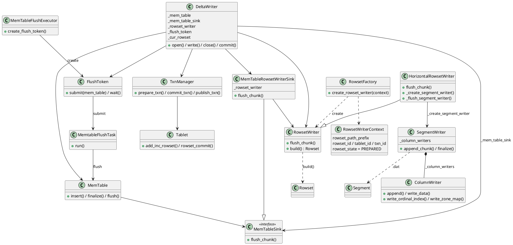

```cpp
// Abbreviated; omitted branches marked "// ...".

// ---- 1. open ----
StatusOr<std::unique_ptr<DeltaWriter>> DeltaWriter::open(const DeltaWriterOptions& opt,
                                                         MemTracker* mem_tracker) {
    std::unique_ptr<DeltaWriter> writer(new DeltaWriter(opt, mem_tracker, StorageEngine::instance()));
    SCOPED_THREAD_LOCAL_MEM_SETTER(mem_tracker, false);
    RETURN_IF_ERROR(writer->_init());
    return std::move(writer);
}

Status DeltaWriter::_init() {
    // ...
    TabletManager* tablet_mgr = _storage_engine->tablet_manager();
    _tablet = tablet_mgr->get_tablet(_opt.tablet_id, false);
    // ... null / PK mem / version-count checks ...

    std::lock_guard push_lock(_tablet->get_push_lock());
    auto st = _storage_engine->txn_manager()->prepare_txn(_opt.partition_id, _tablet, _opt.txn_id, _opt.load_id);
    if (!st.ok()) {
        _set_state(kAborted, st);
        return st;
    }

    RowsetWriterContext writer_context;
    // ... schema / partial-update fields ...
    writer_context.rowset_id = _storage_engine->next_rowset_id();
    writer_context.tablet_id = _opt.tablet_id;
    writer_context.txn_id = _opt.txn_id;
    writer_context.rowset_path_prefix = _tablet->schema_hash_path();
    writer_context.rowset_state = PREPARED;
    // ...

    st = RowsetFactory::create_rowset_writer(writer_context, &_rowset_writer);
    if (!st.ok()) {
        auto msg = strings::Substitute("Fail to create rowset writer. tablet_id: $0, error: $1", _opt.tablet_id,
                                       st.to_string());
        st = Status::InternalError(msg);
        _set_state(kAborted, st);
        return st;
    }
    _mem_table_sink = std::make_unique<MemTableRowsetWriterSink>(_rowset_writer.get());
    _flush_token = _storage_engine->memtable_flush_executor()->create_flush_token();
    // ... Primary replicate_token / Secondary segment_flush_token ...
    _set_state(kWriting, Status::OK());
    return Status::OK();
}

// ---- 2. write (repeated) ----
Status DeltaWriter::write(const Chunk& chunk, const uint32_t* indexes, uint32_t from, uint32_t size) {
    // ...
    if (_mem_table == nullptr) {
        RETURN_IF_ERROR(_reset_mem_table());
    }
    // ... state / Secondary / PK partial-update checks ...
    Status st;
    ASSIGN_OR_RETURN(auto full, _mem_table->insert(chunk, indexes, from, size));
    if (_mem_tracker->limit_exceeded()) {
        st = _flush_memtable();
        RETURN_IF_ERROR(_reset_mem_table());
    } else if (_mem_tracker->parent() && _mem_tracker->parent()->limit_exceeded()) {
        st = _flush_memtable();
        RETURN_IF_ERROR(_reset_mem_table());
    } else if (full) {
        st = flush_memtable_async();
        RETURN_IF_ERROR(_reset_mem_table());
    }
    if (!st.ok()) {
        _set_state(kAborted, st);
    }
    return st;
}

// MemTable::insert appends rows into _chunk; returns suggest_flush (true when is_full()).

// ---- 3. flush ----
Status DeltaWriter::flush_memtable_async(bool eos) {
    DeferOp defer([this] { _mem_table.reset(); });
    if (_mem_table != nullptr) {
        RETURN_IF_ERROR(_mem_table->finalize());   // sort / agg → _result_chunk
    }
    // ... auto-increment fill when needed ...
    // Peer (and Primary without replicate_token): submit when result chunk non-null
    if (_mem_table != nullptr && _mem_table->get_result_chunk() != nullptr) {
        return _flush_token->submit(std::move(_mem_table), eos, [this](SegmentPBPtr seg, bool, int64_t) {
            if (seg) {
                _tablet->add_in_writing_data_size(_opt.txn_id, seg->data_size());
            }
            // ... immutable tablet size check ...
        });
    }
    // ... Primary+replicate_token / Secondary paths ...
    return Status::OK();
}

Status DeltaWriter::_flush_memtable() {
    RETURN_IF_ERROR(flush_memtable_async());
    Status st = _flush_token->wait();
    // ... stats ...
    return st;
}

Status FlushToken::submit(std::unique_ptr<MemTable> mem_table, bool eos,
                          std::function<void(SegmentPBPtr, bool, int64_t)> cb) {
    RETURN_IF_ERROR(status());
    auto task = std::make_shared<MemtableFlushTask>(this, std::move(mem_table), eos, std::move(cb), _slot_idx);
    _slot_idx++;
    return _flush_token->submit(std::move(task));
}

// MemtableFlushTask::run → FlushToken::_flush_memtable → MemTable::flush
Status MemTable::flush(SegmentPB* seg_info, bool eos, int64_t* flush_data_size, int64_t slot_idx) {
    if (UNLIKELY(_result_chunk == nullptr)) {
        return Status::OK();
    }
    // ...
    if (_deletes) {
        RETURN_IF_ERROR(_sink->flush_chunk_with_deletes(*_result_chunk, *_deletes, seg_info, eos, flush_data_size,
                                                        slot_idx));
    } else if (_has_op_slot && _sink->keep_op_column()) {
        RETURN_IF_ERROR(_sink->flush_chunk_with_op(*_result_chunk, seg_info, eos, flush_data_size, slot_idx));
    } else {
        RETURN_IF_ERROR(_sink->flush_chunk(*_result_chunk, seg_info, eos, flush_data_size, slot_idx));
    }
    return Status::OK();
}

Status MemTableRowsetWriterSink::flush_chunk(const Chunk& chunk, SegmentPB* seg_info, bool eos,
                                             int64_t* flush_data_size, int64_t slot_idx) {
    return _rowset_writer->flush_chunk(chunk, seg_info);
}

Status HorizontalRowsetWriter::flush_chunk(const Chunk& chunk, SegmentPB* seg_info) {
    // ... _flush_chunk_state UPSERT / MIXED ...
    return _flush_chunk(chunk, seg_info);
}

Status HorizontalRowsetWriter::_flush_chunk(const Chunk& chunk, SegmentPB* seg_info) {
    auto segment_writer = _create_segment_writer();
    if (!segment_writer.ok()) {
        return segment_writer.status();
    }
    RETURN_IF_ERROR((*segment_writer)->append_chunk(chunk));
    // ... update _num_rows_written / seg_info row counts ...
    return _flush_segment_writer(&segment_writer.value(), seg_info);
}

Status HorizontalRowsetWriter::_flush_segment_writer(std::unique_ptr<SegmentWriter>* segment_writer,
                                                     SegmentPB* seg_info) {
    uint64_t segment_size = 0;
    uint64_t index_size = 0;
    uint64_t footer_position = 0;
    RETURN_IF_ERROR((*segment_writer)->finalize(&segment_size, &index_size, &footer_position));
    // ... sizes / partial footers / seg_info (path, index sidecars) ...
    (*segment_writer).reset();
    return Status::OK();
}

// ---- 4. close / commit ----
Status DeltaWriter::close() {
    auto state = get_state();
    switch (state) {
    // ... kUninitialized / kAborted / kCommitted / kClosed ...
    case kWriting: {
        Status st = flush_memtable_async(true);
        _set_state(st.ok() ? kClosed : kAborted, st);
        return st;
    }
    }
    return Status::OK();
}

Status DeltaWriter::commit() {
    auto state = get_state();
    switch (state) {
    // ... kUninitialized / kAborted / kWriting → error; kCommitted → OK ...
    case kClosed:
        break;
    }
    std::call_once(_commit_once, [this] { _commit_result = _do_commit_body(); });
    return _commit_result;
}

Status DeltaWriter::_do_commit_body() {
    if (auto st = _flush_token->wait(); UNLIKELY(!st.ok())) {
        _set_state(kAborted, st);
        return st;
    }
    if (auto res = _rowset_writer->build(); res.ok()) {
        _cur_rowset = std::move(res).value();
    } else {
        _set_state(kAborted, res.status());
        return res.status();
    }
    if (_replicate_token != nullptr) {
        if (auto st = _replicate_token->wait(); UNLIKELY(!st.ok())) {
            _set_state(kAborted, st);
            return st;
        }
    }
    Status res;
    FAIL_POINT_TRIGGER_ASSIGN_STATUS_OR_DEFAULT(
            load_commit_txn, res, COMMIT_TXN_FP_ACTION(_opt.txn_id, _opt.tablet_id),
            _storage_engine->txn_manager()->commit_txn(_opt.partition_id, _tablet, _opt.txn_id, _opt.load_id,
                                                       _cur_rowset, false, _is_shadow));
    if (!res.ok()) {
        _storage_engine->update_manager()->on_rowset_cancel(_tablet.get(), _cur_rowset.get());
    }
    if (!res.ok() && !res.is_already_exist()) {
        _set_state(kAborted, res);
        return res;
    }
    {
        std::lock_guard l(_state_lock);
        if (_state == kClosed) {
            _state = kCommitted;
        } else {
            return Status::InternalError(
                    fmt::format("Delta writer has been aborted. tablet_id: {}, state: {}", _opt.tablet_id,
                                state_name(_state)));
        }
    }
    return Status::OK();
}

// ---- 5. publish (FE PUBLISH_VERSION → agent) ----
Status TxnManager::publish_txn(TPartitionId partition_id, const TabletSharedPtr& tablet, TTransactionId transaction_id,
                               int64_t version, const RowsetSharedPtr& rowset, uint32_t wait_time,
                               bool is_double_write) {
    if (tablet->updates() != nullptr) {
        auto st = tablet->rowset_commit(version, rowset, wait_time, false, is_double_write);
        if (!st.ok()) {
            return st;
        }
    } else {
        auto st = tablet->add_inc_rowset(rowset, version);
        tablet->remove_in_writing_data_size(transaction_id);
        if (!st.ok() && !st.is_already_exist()) {
            return st;
        }
    }
    tablet->erase_committed_rowset(rowset);
    // ... erase txn_tablet_map entry ...
    return Status::OK();
}
```

Secondary replicas may receive prebuilt segments (**`write_segment`**) and skip local MemTable encoding; publish still decides visibility.

### 2.3 Query

Pipeline OLAP scan binds FE **`TInternalScanRange`** (tablet id, version, key ranges) to IO:

1. **`OlapScanOperator`** / **`OlapScanContext`** resolve the tablet and capture consistent rowsets at the scan version.
2. **Morsels** split work: physical (rowid) or logical (short-key) **`SplitMorselQueue`**; each morsel carries tablet + rowset list + version bounds.
3. **`OlapChunkSource`** builds **`TabletReader`** with those rowsets and **`TabletReaderParams`** (predicates, key ranges, short-key options).
4. **`TabletReader::open`** → per-segment **`Segment::new_iterator`** → **`SegmentIterator`** (index prune in **§2.4**) → union / merge / aggregate collectors as needed.
5. Drivers pull chunks; residual conjuncts may remain above the iterator.

Lake / connector scans use **`ConnectorScanOperator`** and lake readers against object storage; morsel and chunk pull shape stay analogous.

The opening §2 diagram already shows **`OlapChunkSource`**, **`TabletReader`**, **`Tablet`**, **`Rowset`**, and **`SegmentIterator`**. The query path also uses the pipeline scan types below.

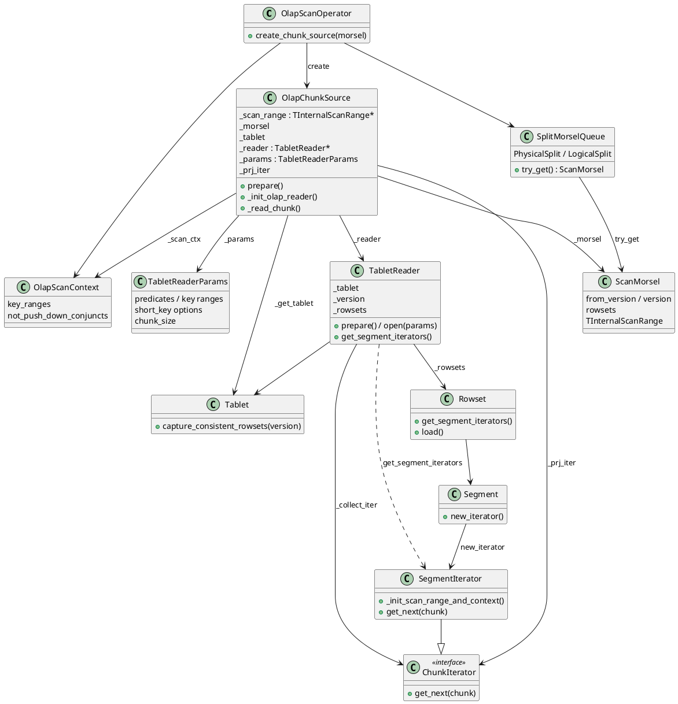

```cpp
// Abbreviated; omitted branches marked "// ...".

// ---- 1–3. OlapChunkSource::_init_olap_reader ----
Status OlapChunkSource::_init_olap_reader(RuntimeState* runtime_state) {
    RETURN_IF_ERROR(_get_tablet(_scan_range));
    // ... schema / dict / scanner columns ...
    RETURN_IF_ERROR(_init_reader_params(_scan_ctx->key_ranges()));

    std::vector<RowsetSharedPtr> rowsets;
    for (auto& rowset : _morsel->rowsets()) {
        rowsets.emplace_back(std::dynamic_pointer_cast<Rowset>(rowset));
    }
    _reader = std::make_shared<TabletReader>(
            _tablet, Version(_morsel->from_version(), _version),
            std::move(child_schema), std::move(rowsets), &_tablet_schema);
    // ... optional projection iterator → _prj_iter ...

    RETURN_IF_ERROR(_reader->prepare());
    RETURN_IF_ERROR(_reader->open(_params));
    return Status::OK();
}

// ---- 4. TabletReader::prepare / open ----
Status TabletReader::prepare() {
    if (_rowsets.empty() && !_use_gtid) {
        std::shared_lock l(_tablet->get_header_lock());
        RETURN_IF_ERROR(_tablet->capture_consistent_rowsets(_version, &_rowsets));
    }
    Rowset::acquire_readers(_rowsets);
    for (const auto& rowset : _rowsets) {
        RETURN_IF_ERROR(rowset->load());
    }
    return Status::OK();
}

Status TabletReader::open(const TabletReaderParams& read_params) {
    if (read_params.use_pk_index) {
        _reader_params = &read_params;
        return Status::OK();  // PK path deferred
    }
    return _init_collector(read_params);
}

Status TabletReader::_init_collector(const TabletReaderParams& params) {
    std::vector<ChunkIteratorPtr> seg_iters;
    RETURN_IF_ERROR(get_segment_iterators(params, &seg_iters));
    // … union / heap-merge / aggregate collectors by KeysType …
    // get_segment_iterators → Rowset::get_segment_iterators → Segment::new_iterator
    return Status::OK();
}

// SegmentIterator prune order (details in §2.4)
Status SegmentIterator::_init_scan_range_and_context() {
    RETURN_IF_ERROR(_get_row_ranges_by_rowid_range());
    RETURN_IF_ERROR(_get_row_ranges_by_keys());
    RETURN_IF_ERROR(_apply_bitmap_index());
    RETURN_IF_ERROR(_get_row_ranges_by_zone_map());
    RETURN_IF_ERROR(_get_row_ranges_by_bloom_filter());
    RETURN_IF_ERROR(_apply_inverted_index());
    RETURN_IF_ERROR(_get_row_ranges_by_vector_index());
    return Status::OK();
}

// ---- 5. pull chunks ----
Status OlapChunkSource::_read_chunk_from_storage(RuntimeState* state, Chunk* chunk) {
    Status status = _prj_iter->get_next(chunk);
    // … residual conjuncts / expr filter above storage …
    return status;
}
```

### 2.4 Indexes

Most structures that prune OLAP scans live **in the segment** (footer / index pages). Sidecars (**.ivt** / **.vi**) and the tablet-level **primary-key** index are the exceptions. At open time **`SegmentIterator::_init_scan_range_and_context`** narrows a candidate **`_scan_range`** (rowid sparse range); stages typically intersect that range in order short key → bitmap → zone map → bloom → inverted → vector (delvec early or late by config). The subsections below cover each index type.

#### Short key

The **short-key** (prefix) index is the segment’s sparse index on the table’s sort / key columns. It exists for every OLAP segment that has a key prefix—no `CREATE INDEX` is required—and is the first structure used to turn key-range predicates into rowid intervals.

**Physical layout.** A sparse short-key page inside the segment: one encoded key prefix about every `num_rows_per_block` rows (default ~1024), pointing at the first rowid of that block. Built from the table’s sort / key columns when the segment is written.

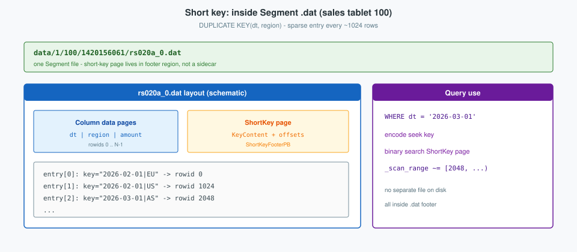

```sql
CREATE TABLE sales (
  dt DATE,
  region VARCHAR(32),
  amount BIGINT
)
DUPLICATE KEY(dt, region)
DISTRIBUTED BY HASH(region) BUCKETS 2;

-- prefix on dt uses the short-key index
SELECT region, SUM(amount)
FROM sales
WHERE dt = '2026-03-01'
GROUP BY region;
```

```cpp
// SegmentIterator::_get_row_ranges_by_keys (abbreviated)
SparseRange<> scan_range_by_keys;
if (!_opts.short_key_ranges.empty()) {
    ASSIGN_OR_RETURN(scan_range_by_keys, _get_row_ranges_by_short_key_ranges());
} else {
    ASSIGN_OR_RETURN(scan_range_by_keys, _get_row_ranges_by_key_ranges());
}
_scan_range &= scan_range_by_keys;
```

#### Zone map

A **zone map** records min / max / null statistics for a column so predicates can skip data that cannot match. StarRocks keeps **both** a segment-wide map and per–data-page maps for the same column inside the segment’s zone-map index. No `CREATE INDEX` is required; **`SegmentWriter`** sets `need_zone_map` when any of the following holds:

- the column is a **key** or **sort-key**;
- table is **DUP_KEYS** and the type passes **`is_zone_map_key_type`** (numeric / date / decimal, …);
- table is **PRIMARY_KEYS**, **`enable_pk_value_column_zonemap`** is on (default), and the type passes **`is_zone_map_key_type`**;
- **`enable_string_prefix_zonemap`** is on (default) and the column is a **string** type (non-key strings are often truncated).

**`is_zone_map_key_type`** excludes **`CHAR` / `VARCHAR` / `JSON` / `VARBINARY` / `OBJECT` / `HLL` / `PERCENTILE`** (strings use the string-prefix path above). **`ARRAY`** never gets a zone map; map/struct nested writers also disable it on children.

**Physical layout.** Both levels are stored in the segment’s zone-map index meta (`ZoneMapIndexPB` inside `.dat`), not a sidecar:

| Level | Proto / storage | Role |
|-------|-----------------|------|
| **Segment** | **`ZoneMapIndexPB.segment_zone_map`** (`ZoneMapPB`) | One min/max/null for the whole column in this segment; kept in column-reader meta |
| **Page** | **`ZoneMapIndexPB.page_zone_maps`** (IndexedColumn of serialized **`ZoneMapPB`**, one per data page) | Finer prune inside the segment |

On write, **`ZoneMapIndexWriter::flush`** finalizes each page’s map and merges it into the running segment map; **`finish`** writes both into index meta (`zone_map_index.h`: page maps in an IndexedColumn, segment map in meta so the reader can prune without loading pages).

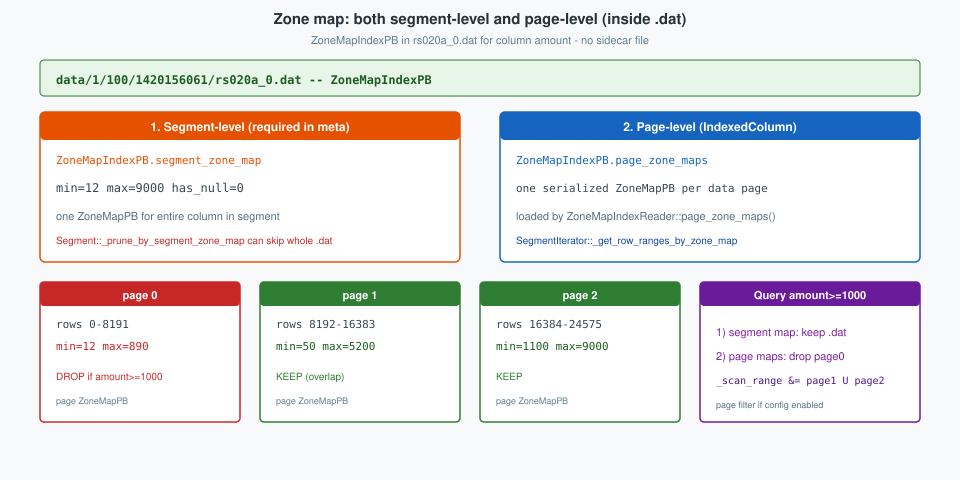

```sql
CREATE TABLE sales (
  dt DATE,
  region VARCHAR(32),
  amount BIGINT
)
DUPLICATE KEY(dt, region)
DISTRIBUTED BY HASH(region) BUCKETS 2;

-- pages whose max(amount) < 1000 are skipped
SELECT *
FROM sales
WHERE amount >= 1000;
```

```cpp
// Segment::_new_iterator — segment-level prune before opening the iterator
RETURN_IF_ERROR(_prune_by_segment_zone_map(read_options));
// if SegmentZoneMapPruner says impossible → Status::EndOfFile (skip .dat)

// SegmentIterator::_get_row_ranges_by_zone_map — page-level
RETURN_IF(!config::enable_index_page_level_zonemap_filter, Status::OK());
ASSIGN_OR_RETURN(auto hit_row_ranges,
                 _opts.pred_tree_for_zone_map.visit(ZoneMapFilterEvaluator{...}));
_scan_range = _scan_range.intersection(zm_range);
```

#### Bitmap

A **bitmap index** maps each distinct column value to a roaring bitmap of rowids. It is created explicitly (`CREATE INDEX … USING BITMAP`) and suits low-to-moderate cardinality columns with selective equality / IN filters.

**Physical layout.** Usually embedded in the segment footer / index pages for columns with a **`USING BITMAP`** index. On shared-data, an ADD INDEX path may attach a standalone **`.idx`** via IDG.

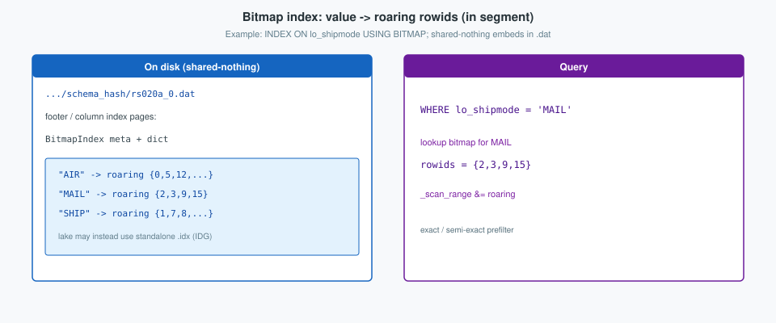

```sql
CREATE TABLE lineorder (
  lo_orderkey INT,
  lo_shipmode VARCHAR(16),
  lo_revenue INT
)
DUPLICATE KEY(lo_orderkey)
DISTRIBUTED BY HASH(lo_orderkey) BUCKETS 4;

CREATE INDEX idx_shipmode ON lineorder (lo_shipmode) USING BITMAP;

SELECT SUM(lo_revenue)
FROM lineorder
WHERE lo_shipmode = 'MAIL';
```

```cpp
// SegmentIterator::_apply_bitmap_index (abbreviated)
RETURN_IF(!config::enable_index_bitmap_filter, Status::OK());
RETURN_IF_ERROR(_bitmap_index_evaluator.init(/* new_bitmap_index_iterator per cid */));
RETURN_IF(!_bitmap_index_evaluator.has_bitmap_index(), Status::OK());
RETURN_IF_ERROR(_bitmap_index_evaluator.evaluate(_scan_range, _opts.pred_tree));
// evaluate intersects matching roaring rowids into _scan_range
```

#### Bloom / ngram

A **bloom filter** is a compact probabilistic set of values present in a column (or page). It answers “definitely not here” cheaply; false positives are possible. N-gram blooms (`USING NGRAMBF`) extend the same idea to tokenized substrings for `LIKE`-style patterns. Configured via table **`bloom_filter_columns`** or an n-gram index—not part of the default key path.

**Physical layout.** Column bloom filters (and n-gram blooms when created with **`USING NGRAMBF`** or table **`bloom_filter_columns`**) live with the segment’s column index data—not a separate tablet-level file.

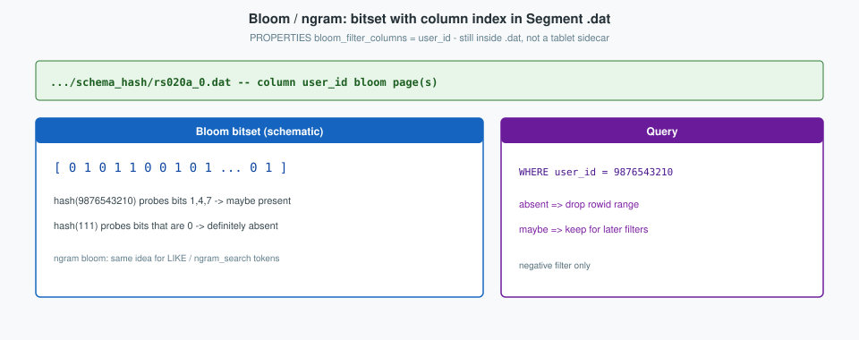

```sql
CREATE TABLE events (
  event_id BIGINT,
  user_id BIGINT,
  ts DATETIME
)
DUPLICATE KEY(event_id)
DISTRIBUTED BY HASH(event_id) BUCKETS 4
PROPERTIES ("bloom_filter_columns" = "user_id");

SELECT *
FROM events
WHERE user_id = 9876543210;
```

```cpp
// SegmentIterator::_get_row_ranges_by_bloom_filter (abbreviated)
RETURN_IF(!config::enable_index_bloom_filter, Status::OK());
const bool support = _opts.pred_tree.visit(BloomFilterSupportChecker{...});
RETURN_IF(!support, Status::OK());
RETURN_IF_ERROR(
    _opts.pred_tree.visit(BloomFilterEvaluator{...}, _scan_range));
// absent → drop rowids from _scan_range; maybe → keep
```

#### Inverted (GIN)

A **full-text inverted (GIN)** index maps terms to posting lists of rowids. It is created with **`CREATE INDEX … USING GIN`** (optional parser) and accelerates tokenized text predicates (`MATCH` / `MATCH_ANY` / `MATCH_ALL`), unlike short-key or bitmap equality.

**Physical layout.** Standalone directory **`{rowset_id}_{seg}_{index_id}.ivt/`** beside the segment under the schema-hash path (CLucene-based or built-in inverted, depending on version / config).

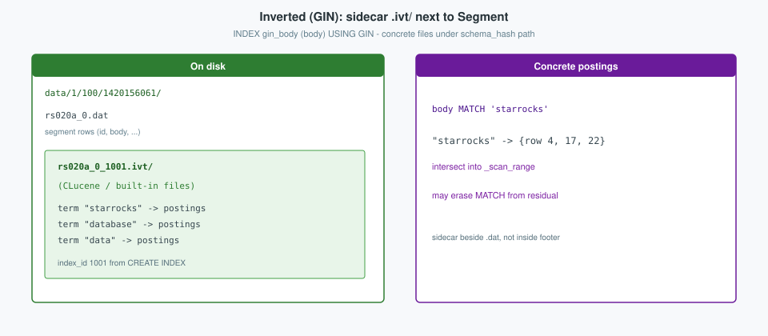

```sql
CREATE TABLE docs (
  id BIGINT,
  body VARCHAR(1024),
  INDEX gin_body (body) USING GIN("parser" = "english")
)
DUPLICATE KEY(id)
DISTRIBUTED BY HASH(id) BUCKETS 2;

SELECT id, body
FROM docs
WHERE body MATCH 'starrocks';
```

```cpp
// SegmentIterator::_apply_inverted_index (abbreviated)
RETURN_IF(!_opts.enable_gin_filter, Status::OK());
roaring::Roaring row_bitmap = range2roaring(_scan_range);
// pred->seek_inverted_index(..., &row_bitmap) for MATCH / expr preds
_scan_range = roaring2range(row_bitmap);
erase_column_pred_from_pred_tree(_opts.pred_tree, erased_preds);
```

#### Vector (ANN)

A **vector (ANN)** index stores an approximate nearest-neighbor structure (HNSW / IVFPQ via TenANN) over embedding columns. It is created with **`CREATE INDEX … USING VECTOR`** and serves top-k / range similarity search, not ordinary scalar predicates.

**Physical layout.** Standalone **`{rowset_id}_{seg}_{index_id}.vi`** beside the segment (TenANN HNSW / IVFPQ, etc., from **`USING VECTOR`**).

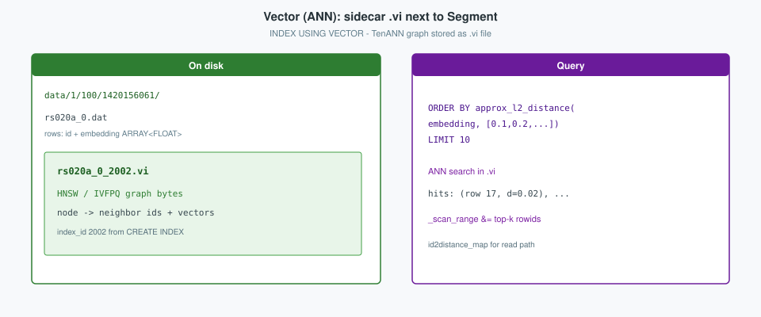

```sql
CREATE TABLE items (
  id BIGINT,
  embedding ARRAY<FLOAT> NOT NULL,
  INDEX idx_emb (embedding) USING VECTOR (
    "index_type" = "hnsw",
    "dim" = "3",
    "metric_type" = "l2_distance",
    "M" = "16",
    "efconstruction" = "40"
  )
)
DUPLICATE KEY(id)
DISTRIBUTED BY HASH(id) BUCKETS 2;

SELECT id
FROM items
ORDER BY approx_l2_distance(embedding, [0.1, 0.2, 0.3])
LIMIT 10;
```

```cpp
// SegmentIterator::_get_row_ranges_by_vector_index (abbreviated)
if (!_vector_index_ctx || !_vector_index_ctx->use_vector_index) {
    return Status::OK();  // non-ANN query
}
// optional: narrow by residual predicates, then ANN search in .vi
// intersect hits into _scan_range; fill id2distance_map for the read path
```

#### Primary key

The **primary-key index** belongs to **`PRIMARY KEY`** tables: it maps an encoded PK to **`(rssid, rowid)`** so publish can upsert / delete correctly. **`rssid`** (rowset-segment id) is a tablet-local **`uint32`**: the rowset’s base **`rowset_seg_id`** plus the segment index inside that rowset (`rssid = rowset_seg_id + seg_idx`). Together with **`rowid`** (offset within that segment) it names an exact physical row. Unlike the prune indexes above, the PK index is tablet-scoped (optional **`PersistentIndex`** on disk) and is not the default OLAP `_scan_range` filter chain.

**Physical layout.** Tablet-level **`PrimaryIndex`**, optionally backed by **`PersistentIndex`** files **`index.l0.*`** under the schema-hash path (lake: **`lake::LakePrimaryIndex`**). Delete vectors for PK tables are tracked in meta / **`.del`** sidecars as rowsets publish.

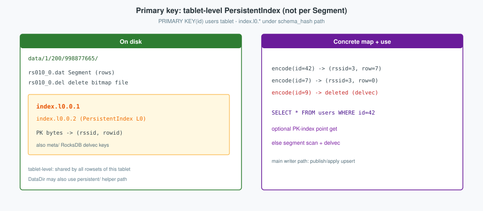

```sql
CREATE TABLE users (
  id BIGINT,
  name VARCHAR(64),
  balance BIGINT
)
PRIMARY KEY(id)
DISTRIBUTED BY HASH(id) BUCKETS 2;

-- publish updates PrimaryIndex; point get may use it
SELECT *
FROM users
WHERE id = 42;
```

```cpp
// publish / apply — PrimaryIndex::upsert(rssid, rowid_start, pks, &deletes)
// point lookup API — PrimaryIndex::get(pks, &rowids)

// TabletReader::open — optional PK-index scan path
if (read_params.use_pk_index) {
    _reader_params = &read_params;
    return Status::OK();  // collector deferred; uses PK index
}
// otherwise normal segment iterators + _apply_del_vector
```

### 2.5 Implementation snippets

**Path and segment names.**

```cpp
// BaseTablet::_gen_tablet_path
std::string path = _data_dir->path() + DATA_PREFIX;  // "/data"
path = path_util::join_path_segments(path, std::to_string(_tablet_meta->shard_id()));
path = path_util::join_path_segments(path, std::to_string(_tablet_meta->tablet_id()));
path = path_util::join_path_segments(path, std::to_string(_tablet_meta->schema_hash()));
_tablet_path = path;
```

```cpp
// Rowset path helpers (abbreviated)
segment_file_path(dir, id, seg)     -> "$dir/$id_$seg.dat"
segment_del_file_path(...)          -> "... .del"
segment_upt_file_path(...)          -> "... .upt"
delta_column_group_path(...)        -> "... .cols"
```

---

## 3. FragmentInstance execution

This section is the worker-side execution of one FE **`FragmentInstance`**: how brpc deploy becomes pipelines and drivers, which types own that state, and the concrete call path.

### 3.1 Framework

The worker’s **execution framework** is the pipeline engine: an FE **`FragmentInstance`** arrives as Thrift on **`PInternalService`**, **`FragmentExecutor`** turns it into runnable state, and workgroup **`DriverExecutor`** threads pull **`PipelineDriver`**s until EOS or cancel. Scope is nested—**`QueryContext`** for the whole query on this BE, **`FragmentContext`** for one instance, **`Pipeline`** / **`Operator`** factories expanded × DOP into drivers, with scan **`Morsel`**s binding FE tablet ranges to **`OlapScanOperator`**. Since StarRocks 3.2 the normal path is **pipeline only**; non-pipeline **`FragmentMgr`** remains only for rare sinks such as SchemaTableSink.

**Contract.** The FE ships **`TExecPlanFragmentParams`** (plan tree, descriptor table, scan ranges, destinations, DOP hints). The BE builds that runnable instance, moves chunks among instances with **`transmit_chunk`**, and reports status with **`reportExecStatus`**.

**Layers.**

| Layer | Responsibility |
|-------|----------------|
| **RPC** | **`PInternalService`**: deserialize attachment → **`FragmentExecutor`** |
| **Orchestration** | **`FragmentExecutor`**: **`prepare`** then **`execute`** |
| **Query scope** | **`QueryContext`**: all fragment instances of one query on this BE |
| **Instance scope** | **`FragmentContext`**: plan, morsel factories, pipelines, drivers, runtime state |
| **Pipeline** | **`Pipeline`** + **`Operator`** factories; DOP copies → **`PipelineDriver`** |
| **Scheduling** | Workgroup **`DriverExecutor`** / **`DriverQueue`**; **`PipelineDriver::process`** |
| **IO binding** | FE **`TInternalScanRange`** → **`Morsel`** → **`OlapScanOperator`** / **`OlapChunkSource`** |

**Prepare then execute.**

1. **`QueryContext`** — get or register by `query_id`.
2. **`FragmentContext`** — one per `fragment_instance_id`.
3. Workgroup + **`RuntimeState`** + global dicts.
4. **`_prepare_exec_plan`** — **`ExecFactory::create_tree`**; scan ranges → **`MorselQueueFactory`**.
5. **`_prepare_pipeline_driver`** — **`decompose_to_pipeline`** → **`PipelineBuilder::build`** → instantiate **`PipelineDriver`**s (× DOP); bind morsel queues.
6. Register the fragment on **`QueryContext::fragment_mgr()`**.
7. **`execute`**: acquire runtime filters → **`prepare_active_drivers`** → **`submit_active_drivers(DriverExecutor*)`**.

**Data planes while drivers run.**

| Kind | Mechanism |
|------|-----------|
| **Scan** | Capture **`Tablet`** + rowsets at scan **`version`**; read segments (**§2.3**) |
| **Shuffle** | **`ExchangeSinkOperator`** → **`transmit_chunk`** → **`DataStreamRecvr`** / **`ExchangeSourceOperator`** |
| **Result** | Root **`ResultSinkOperator`**; FE pulls with **`fetch_data`** |
| **Status** | **`ExecStateReporter`** → Thrift **`reportExecStatus`** |

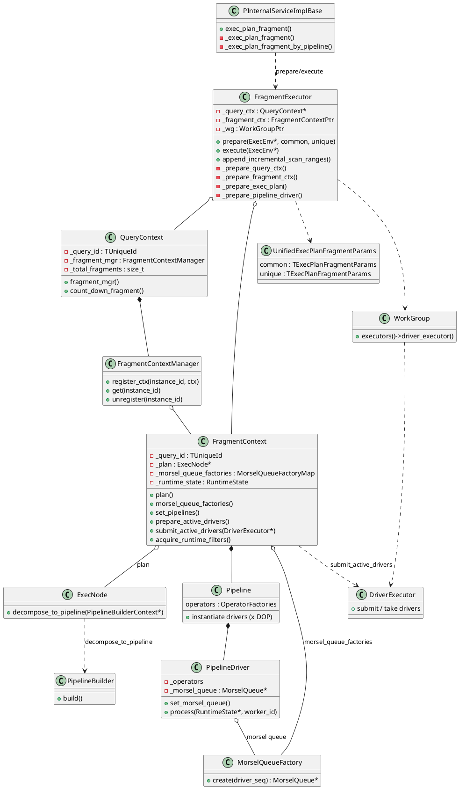

### 3.2 Implementation: call path and snippets

**RPC entry.** The brpc handler queues work on the query RPC pool, deserializes the Thrift body, and requires **`is_pipeline`**.

```cpp
// PInternalServiceImplBase::exec_plan_fragment
auto task = [=]() { this->_exec_plan_fragment(cntl_base, request, response, done); };
_exec_env->execution_services().query_rpc_pool->try_offer(std::move(task));
```

```cpp
// PInternalServiceImplBase::_exec_plan_fragment (abbreviated)
TExecPlanFragmentParams t_request;
deserialize_thrift_msg(/* attachment */, ..., &t_request);

bool is_pipeline = t_request.__isset.is_pipeline && t_request.is_pipeline;
if (is_pipeline) {
    return _exec_plan_fragment_by_pipeline(t_request, t_request);
}
// non-pipeline rejected since 3.2 (SchemaTableSink exception omitted)
```

```cpp
// PInternalServiceImplBase::_exec_plan_fragment_by_pipeline
orchestration::FragmentExecutor fragment_executor(_batch_write_mgr);
auto status = fragment_executor.prepare(_exec_env, t_common_param, t_unique_request);
if (status.ok()) {
    return fragment_executor.execute(_exec_env);
}
```

**Prepare.** Ordered stages match the class diagram: query ctx → fragment ctx → plan/morsels → pipelines/drivers → register.

```cpp
// FragmentExecutor::prepare (control flow)
UnifiedExecPlanFragmentParams request(common_request, unique_request);
RETURN_IF_ERROR(_prepare_query_ctx(exec_env, request));
RETURN_IF_ERROR(_prepare_fragment_ctx(request));
RETURN_IF_ERROR(_prepare_workgroup(request));
RETURN_IF_ERROR(_prepare_runtime_state(exec_env, request));
RETURN_IF_ERROR(_prepare_global_dict(request));
RETURN_IF_ERROR(_prepare_exec_plan(exec_env, request));
RETURN_IF_ERROR(_prepare_pipeline_driver(exec_env, request));
RETURN_IF_ERROR(_query_ctx->fragment_mgr()->register_ctx(
        request.fragment_instance_id(), _fragment_ctx));
_query_ctx->mark_prepared();
```

**Plan → pipelines.** DOP comes from fragment params; the **`ExecNode`** tree decomposes into operator factories, then drivers are instantiated per DOP and bound to morsel queues (scan side).

```cpp
// FragmentExecutor::_prepare_pipeline_driver (abbreviated)
const auto degree_of_parallelism = _calc_dop(exec_env, request);
ExecNode* plan = _fragment_ctx->plan();
PipelineBuilderContext context(_fragment_ctx.get(), degree_of_parallelism, sink_dop);
PipelineBuilder builder(context);
ASSIGN_OR_RETURN(auto exec_ops, plan->decompose_to_pipeline(&context));
// DataSink::create_data_sink + decompose_data_sink_to_pipeline when output_sink set
// PipelineBuilder::build → FragmentContext::set_pipelines
// instantiate PipelineDriver × DOP; driver->set_morsel_queue(...)
```

**Execute.** Drivers are prepared then handed to the workgroup executor; the RPC returns once submission succeeds—the instance runs asynchronously on driver threads.

```cpp
// FragmentExecutor::execute
_fragment_ctx->acquire_runtime_filters();
RETURN_IF_ERROR(_fragment_ctx->prepare_active_drivers());
auto* executor = _wg->executors()->driver_executor();
RETURN_IF_ERROR(_fragment_ctx->submit_active_drivers(executor));
```

**Incremental ranges.** A later **`exec_plan_fragment`** without a `fragment` body appends scan ranges to a live instance via **`FragmentExecutor::append_incremental_scan_ranges`** (morsels only; no full rebuild).
