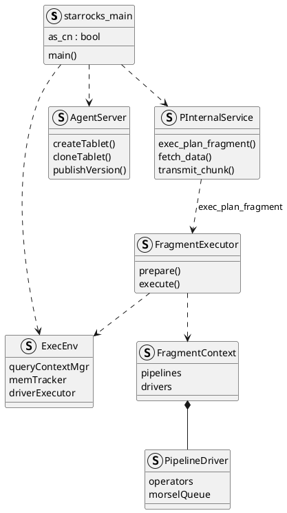
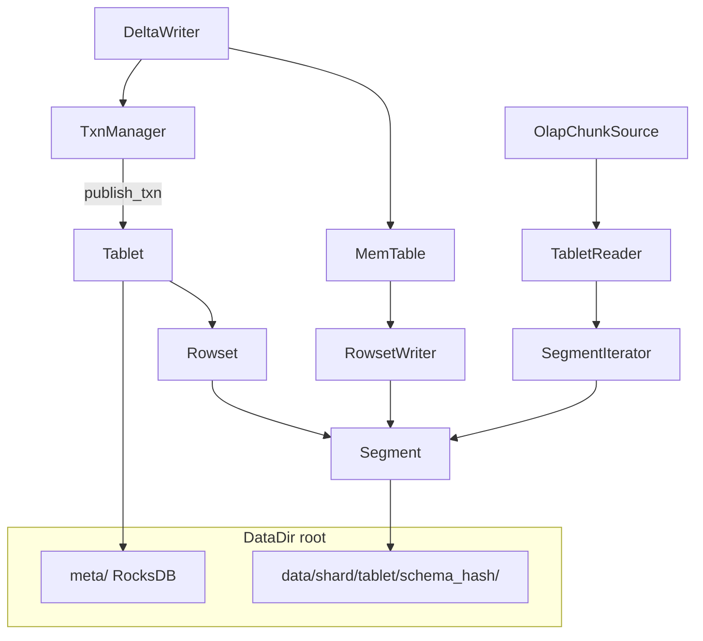
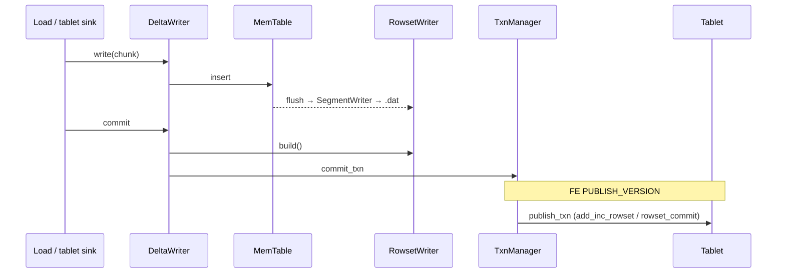
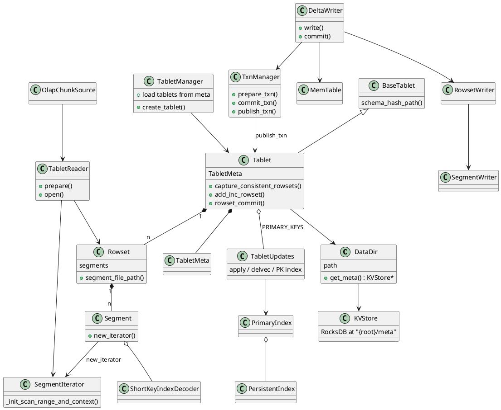
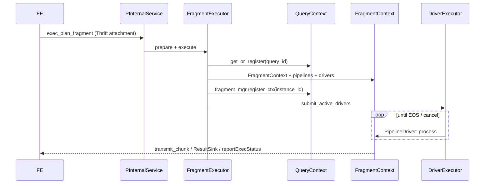
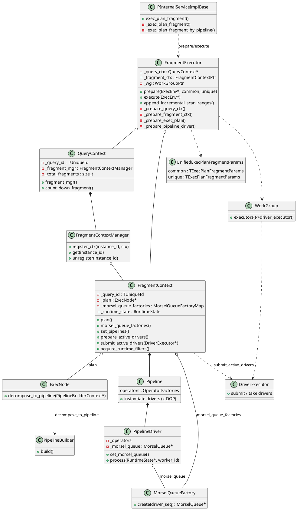

**Backend (BE)** and **Compute Node (CN)** are the C++ workers that execute StarRocks **`FragmentInstance`**s. They share one binary; BE hosts local tablet data (shared-nothing), CN runs compute and cache against object storage (shared-data).
<!--more-->

Related: [FE query planning and the MPP path](../architecture/).

---

## 1. Overview

The FE plans SQL into a **`PlanFragment`** DAG, schedules **`FragmentInstance`**s onto workers, and deploys each instance over brpc. The process that **runs** an instance is a BE or CN. Clients never open interactive SQL sessions to workers; workers speak Thrift/brpc to the FE and to each other for shuffle.

| Mode | Process | Durable user data |
|------|---------|-------------------|
| **`shared_nothing`** | **Backend** | Local disks: **`Tablet`** directories (rowsets / segments) + RocksDB meta |
| **`shared_data`** | **Compute Node** (`--cn`) | Object storage via Starlet; **`lake::Tablet`** metadata / shard cache |

Both roles report to the FE leader through Thrift **`HeartbeatService`**, expose Thrift **`BackendService`** (agent / tablet control) and brpc **`PInternalService`** (fragment deploy, result pull, **`transmit_chunk`**). This post is what happens **after** a worker receives **`exec_plan_fragment`**.

BE and CN share one C++ entry (`starrocks_main.cpp`). Passing **`--cn`** selects compute-node mode and typically **`cn.conf`** instead of **`be.conf`**.

```cpp
// starrocks_main.cpp (abbreviated)
bool as_cn = false;
if (argc > 1 && strcmp(argv[1], "--cn") == 0) {
    as_cn = true;
}
```

On the FE membership model, **`Backend`** extends **`ComputeNode`**. A backend sets **`isSetStoragePath = true`** and reports **`DiskInfo`**; it hosts tablet data directories. A CN is a **`ComputeNode`** without local data paths—it executes plans and caches hot data while lake tablet files live in object storage.

Startup (conceptually):

1. Daemon / flags / config
2. Storage engine (local **`DataDir`**s on BE; Starlet / lake IO on CN)
3. **`ExecEnv`** — fragment executor, memory tracker, pipeline thread pools
4. **`AgentServer`** — tablet create/delete, clone, publish-version tasks from FE
5. Thrift **`BackendService`** + brpc **`PInternalService`**
6. Heartbeat loop back to FE leader

| Component | Role |
|-----------|------|
| **`ExecEnv`** | Global execution environment: query contexts, mem, driver executors |
| **`AgentServer`** | Applies FE agent tasks (create tablet, clone, drop, publish) |
| **`BackendService`** (Thrift) | Agent tasks, tablet stats, routine load, export snapshot, external scanners |
| **`PInternalService`** (brpc) | Query plane: **`exec_plan_fragment`**, **`fetch_data`**, **`transmit_chunk`**, runtime filters |
| Pipeline engine | Vectorized **`Operator`**s; one **`FragmentInstance`** → pipelines → **`PipelineDriver`**s |



A FE **`FragmentInstance`** is one scheduled run of a **`PlanFragment`** on one BE/CN. The worker materializes it as a **`pipeline::FragmentContext`**: pipelines, drivers, and scan **morsels**. The full architecture, types, and call path are in **§3**.

On the FE catalog a tablet is a placement unit (**`LocalTablet`** + **`Replica`**). On the BE it is **`starrocks::Tablet`**: versioned **rowsets** of columnar **segments** under a **`DataDir`**, with RocksDB holding metadata only. Layout, indexes, insert, and scan are in **§2**. Shared-data uses **`lake::Tablet`** and object storage instead of a local replica tree.

---

## 2. Tablet storage and access

This section is the shared-nothing replica on a BE: how user data is laid out on disk, which indexes prune reads, how loads become visible versions, and how pipeline scans open those versions.

### 2.1 Architecture

**FE vs BE.** The FE owns placement and replica health. The BE owns the durable replica: directories under **`storage_root_path`**, in-memory **`Tablet`**, and the writers / readers that touch them.

**Logical stack.**

| Layer | Role |
|-------|------|
| **`DataDir`** | One disk root: **`data/`**, **`meta/`** (RocksDB), trash / snapshot / clone / persistent |
| **`Tablet` / `TabletMeta`** | Identity, schema, tablet state, versioned rowset graph |
| **`Rowset` / `RowsetMeta`** | One published (or committed) unit of data — one or more segments |
| **`Segment`** | Immutable columnar file (`.dat`) plus embedded / sidecar indexes |
| **`KVStore`** | RocksDB under **`{root}/meta`** — tablet / rowset / txn meta, PK delvecs; **not** user rows |
| **`TabletUpdates`** | Primary-key path: apply, delvec, **`PrimaryIndex`** / **`PersistentIndex`** |

**Visibility.** Writers flush segments and **`TxnManager::commit_txn`** (durable, not query-visible). FE **`PUBLISH_VERSION`** → **`TxnManager::publish_txn`** installs the rowset at a version (`add_inc_rowset`, or PK **`Tablet::rowset_commit`** via **`TabletUpdates`**). Scans capture rowsets at that **`version`**.

**Shared-data.** **`lake::Tablet`** is an id plus remote **`TabletMetadata`** / txn logs through Starlet. Segment bytes live in object storage (with local cache); there is no local **`data/{shard}/{tablet_id}/{schema_hash}`** primary copy with RocksDB tablet meta.



### 2.2 On-disk layout

Path construction joins **`DATA_PREFIX` (`/data`)**, shard id, tablet id, and **`schema_hash`** (historical leaf; multi-schema-hash era; still the directory shape today):

```text
{storage_root}/
├── meta/                              # RocksDB (KVStore)
├── persistent/                        # DataDir helper for persistent index
├── trash/  snapshot/  clone/  ...
└── data/
    └── {shard}/
        └── {tablet_id}/
            └── {schema_hash}/
                ├── {rowset_id}_0.dat
                ├── {rowset_id}_0.del          # PK delete bitmap file (when present)
                ├── {rowset_id}_0.upt          # partial update
                ├── {rowset_id}_0_{ver}_{i}.cols
                ├── {rowset_id}_0_{index_id}.ivt/   # inverted (GIN)
                ├── {rowset_id}_0_{index_id}.vi    # vector (ANN)
                └── index.l0.*                 # PersistentIndex L0 (PRIMARY_KEYS)
```

| Artifact | Naming | Role |
|----------|--------|------|
| Segment data | **`{rowset_id}_{seg}.dat`** | Column pages + footer (short-key, zone maps, bitmap/bloom often **inside** the segment) |
| Delete / upt / cols | **`.del` / `.upt` / `.cols`** | PK deletes, partial update, delta column group |
| Inverted / vector | **`.ivt/` / `.vi`** | Standalone GIN / ANN sidecars next to the segment |
| PK persistent index | **`index.l0.*`** | Local persistent primary index under the schema-hash path |
| Meta | **`{root}/meta`** | Tablet / rowset / txn keys — separate from segment bytes |

**`TabletManager`** loads tablets from RocksDB when a **`DataDir`** starts; create-tablet agent tasks create the directory tree and initial meta.

### 2.3 Indexes

Most secondary structures used by scans live **in the segment footer** (or pages referenced from it). Sidecars and the PK index are the exceptions.

| Index | Where | Role at query / write |
|-------|-------|------------------------|
| **Short key** | Segment short-key page | Sparse prefix of sort/key columns (default block ~1024 rows); binary search → rowid range |
| **Zone map** | Per-page + segment min/max/null | Drop pages that cannot match predicates |
| **Bitmap** | Usually in segment; lake may attach standalone `.idx` via IDG | Exact / semi-exact rowid sets for discrete predicates |
| **Bloom / ngram** | Column bloom | Negative checks before page IO |
| **Inverted (GIN)** | **`.ivt`** | Text / inverted predicates |
| **Vector (ANN)** | **`.vi`** | Approximate nearest-neighbor narrowing |
| **Primary key** | **`PrimaryIndex`** → optional **`PersistentIndex`** (`index.l0.*`); lake: **`lake::LakePrimaryIndex`** | Upsert / delete at **publish/apply** (encoded PK → `(rssid, rowid)`); not the general OLAP scan path unless PK-index scan is enabled |

**Prune order** inside **`SegmentIterator::_init_scan_range_and_context`** (when no precomputed scan range): rowid range → short/key ranges → (optional early delvec) → **bitmap** → **zone map** → **bloom** → **inverted** → (optional late delvec) → rewrite predicates → **vector** → sampling → column predicates.

Short-key encoding uses markers so prefix predicates can distinguish GT vs GE and NULLs (`KEY_MINIMAL_MARKER` … `KEY_MAXIMAL_MARKER`).

### 2.4 Insert mechanism

Load / stream load / insert on a local tablet goes through **`DeltaWriter`**:

1. **`open`** — **`TxnManager::prepare_txn`**; create **`RowsetWriter`** under **`tablet->schema_hash_path()`**.
2. **`write`** — append into **`MemTable`**; on full or memory pressure, async flush (**`MemTableFlushExecutor`**).
3. **Flush** — sort / aggregate → **`RowsetWriter`** / **`SegmentWriter`** → `.dat` (+ indexes built with the segment).
4. **`close` / `commit`** — wait flushes, **`RowsetWriter::build()`**, **`TxnManager::commit_txn`** (committed rowset, **not** scannable).
5. **Publish** — agent **`PUBLISH_VERSION`** → **`TxnManager::publish_txn`**:
   - DUP / UNIQUE / AGG: **`Tablet::add_inc_rowset(rowset, version)`**
   - PRIMARY_KEYS: **`Tablet::rowset_commit`** → **`TabletUpdates`** apply (delvec + PK index upsert)



Secondary replicas may receive prebuilt segments (**`write_segment`**) and skip local MemTable encoding; publish still decides visibility.

### 2.5 Query mechanism

Pipeline OLAP scan binds FE **`TInternalScanRange`** (tablet id, version, key ranges) to IO:

1. **`OlapScanOperator`** / **`OlapScanContext`** resolve the tablet and capture consistent rowsets at the scan version.
2. **Morsels** split work: physical (rowid) or logical (short-key) **`SplitMorselQueue`**; each morsel carries tablet + rowset list + version bounds.
3. **`OlapChunkSource`** builds **`TabletReader`** with those rowsets and **`TabletReaderParams`** (predicates, key ranges, short-key options).
4. **`TabletReader::open`** → per-segment **`Segment::new_iterator`** → **`SegmentIterator`** (index prune above) → union / merge / aggregate collectors as needed.
5. Drivers pull chunks; residual conjuncts may remain above the iterator.

Lake / connector scans use **`ConnectorScanOperator`** and lake readers against object storage; morsel and chunk pull shape stay analogous.

### 2.6 Class diagram



### 2.7 Implementation snippets

**Path and segment names.**

```cpp
// BaseTablet::_gen_tablet_path
std::string path = _data_dir->path() + DATA_PREFIX;  // "/data"
path = path_util::join_path_segments(path, std::to_string(_tablet_meta->shard_id()));
path = path_util::join_path_segments(path, std::to_string(_tablet_meta->tablet_id()));
path = path_util::join_path_segments(path, std::to_string(_tablet_meta->schema_hash()));
_tablet_path = path;
```

```cpp
// Rowset path helpers (abbreviated)
segment_file_path(dir, id, seg)     -> "$dir/$id_$seg.dat"
segment_del_file_path(...)          -> "... .del"
segment_upt_file_path(...)          -> "... .upt"
delta_column_group_path(...)        -> "... .cols"
```

**Commit then publish.**

```cpp
// DeltaWriter::_do_commit_body (abbreviated)
RETURN_IF_ERROR(_flush_token->wait());
ASSIGN_OR_RETURN(_cur_rowset, _rowset_writer->build());
// … replicate wait when needed …
RETURN_IF_ERROR(TxnManager::commit_txn(/* partition, tablet, txn, rowset … */));
```

```cpp
// TxnManager::publish_txn (abbreviated)
if (tablet->updates() != nullptr) {
    return tablet->rowset_commit(version, rowset, wait_time, false, is_double_write);
}
return tablet->add_inc_rowset(rowset, version);
```

**Scan open and segment prune.**

```cpp
// OlapChunkSource — open reader on morsel rowsets
_reader = std::make_shared<TabletReader>(
        _tablet, Version(_morsel->from_version(), _version),
        std::move(child_schema), std::move(rowsets), &_tablet_schema);
RETURN_IF_ERROR(_reader->prepare());
RETURN_IF_ERROR(_reader->open(_params));
```

```cpp
// SegmentIterator::_init_scan_range_and_context (filter order)
RETURN_IF_ERROR(_get_row_ranges_by_rowid_range());
RETURN_IF_ERROR(_get_row_ranges_by_keys());       // short key / key ranges
RETURN_IF_ERROR(_apply_bitmap_index());
RETURN_IF_ERROR(_get_row_ranges_by_zone_map());
RETURN_IF_ERROR(_get_row_ranges_by_bloom_filter());
RETURN_IF_ERROR(_apply_inverted_index());
RETURN_IF_ERROR(_get_row_ranges_by_vector_index());
```

---

## 3. FragmentInstance execution

This section is the worker-side execution of one FE **`FragmentInstance`**: how brpc deploy becomes pipelines and drivers, which types own that state, and the concrete call path.

### 3.1 Architecture

**Contract.** The FE ships **`TExecPlanFragmentParams`** (plan tree, descriptor table, scan ranges, destinations, DOP hints). The BE builds a runnable instance, schedules drivers, moves chunks among instances with **`transmit_chunk`**, and reports status with **`reportExecStatus`**. Since 3.2 the normal path is **pipeline only**; non-pipeline **`FragmentMgr`** remains only for rare sinks such as SchemaTableSink.

**Layers.**

| Layer | Responsibility |
|-------|----------------|
| **RPC** | **`PInternalService`**: deserialize attachment → **`FragmentExecutor`** |
| **Orchestration** | **`FragmentExecutor`**: **`prepare`** then **`execute`** |
| **Query scope** | **`QueryContext`**: all fragment instances of one query on this BE |
| **Instance scope** | **`FragmentContext`**: plan, morsel factories, pipelines, drivers, runtime state |
| **Pipeline** | **`Pipeline`** + **`Operator`** factories; DOP copies → **`PipelineDriver`** |
| **Scheduling** | Workgroup **`DriverExecutor`** / **`DriverQueue`**; **`PipelineDriver::process`** |
| **IO binding** | FE **`TInternalScanRange`** → **`Morsel`** → **`OlapScanOperator`** / **`OlapChunkSource`** |

**Prepare then execute.**

1. **`QueryContext`** — get or register by `query_id`.
2. **`FragmentContext`** — one per `fragment_instance_id`.
3. Workgroup + **`RuntimeState`** + global dicts.
4. **`_prepare_exec_plan`** — **`ExecFactory::create_tree`**; scan ranges → **`MorselQueueFactory`**.
5. **`_prepare_pipeline_driver`** — **`decompose_to_pipeline`** → **`PipelineBuilder::build`** → instantiate **`PipelineDriver`**s (× DOP); bind morsel queues.
6. Register the fragment on **`QueryContext::fragment_mgr()`**.
7. **`execute`**: acquire runtime filters → **`prepare_active_drivers`** → **`submit_active_drivers(DriverExecutor*)`**.

**Data planes while drivers run.**

| Kind | Mechanism |
|------|-----------|
| **Scan** | Capture **`Tablet`** + rowsets at scan **`version`**; read segments (**§2.5**) |
| **Shuffle** | **`ExchangeSinkOperator`** → **`transmit_chunk`** → **`DataStreamRecvr`** / **`ExchangeSourceOperator`** |
| **Result** | Root **`ResultSinkOperator`**; FE pulls with **`fetch_data`** |
| **Status** | **`ExecStateReporter`** → Thrift **`reportExecStatus`** |



### 3.2 Class diagram



### 3.3 Implementation: call path and snippets

**RPC entry.** The brpc handler queues work on the query RPC pool, deserializes the Thrift body, and requires **`is_pipeline`**.

```cpp
// PInternalServiceImplBase::exec_plan_fragment
auto task = [=]() { this->_exec_plan_fragment(cntl_base, request, response, done); };
_exec_env->execution_services().query_rpc_pool->try_offer(std::move(task));
```

```cpp
// PInternalServiceImplBase::_exec_plan_fragment (abbreviated)
TExecPlanFragmentParams t_request;
deserialize_thrift_msg(/* attachment */, ..., &t_request);

bool is_pipeline = t_request.__isset.is_pipeline && t_request.is_pipeline;
if (is_pipeline) {
    return _exec_plan_fragment_by_pipeline(t_request, t_request);
}
// non-pipeline rejected since 3.2 (SchemaTableSink exception omitted)
```

```cpp
// PInternalServiceImplBase::_exec_plan_fragment_by_pipeline
orchestration::FragmentExecutor fragment_executor(_batch_write_mgr);
auto status = fragment_executor.prepare(_exec_env, t_common_param, t_unique_request);
if (status.ok()) {
    return fragment_executor.execute(_exec_env);
}
```

**Prepare.** Ordered stages match the class diagram: query ctx → fragment ctx → plan/morsels → pipelines/drivers → register.

```cpp
// FragmentExecutor::prepare (control flow)
UnifiedExecPlanFragmentParams request(common_request, unique_request);
RETURN_IF_ERROR(_prepare_query_ctx(exec_env, request));
RETURN_IF_ERROR(_prepare_fragment_ctx(request));
RETURN_IF_ERROR(_prepare_workgroup(request));
RETURN_IF_ERROR(_prepare_runtime_state(exec_env, request));
RETURN_IF_ERROR(_prepare_global_dict(request));
RETURN_IF_ERROR(_prepare_exec_plan(exec_env, request));
RETURN_IF_ERROR(_prepare_pipeline_driver(exec_env, request));
RETURN_IF_ERROR(_query_ctx->fragment_mgr()->register_ctx(
        request.fragment_instance_id(), _fragment_ctx));
_query_ctx->mark_prepared();
```

**Plan → pipelines.** DOP comes from fragment params; the **`ExecNode`** tree decomposes into operator factories, then drivers are instantiated per DOP and bound to morsel queues (scan side).

```cpp
// FragmentExecutor::_prepare_pipeline_driver (abbreviated)
const auto degree_of_parallelism = _calc_dop(exec_env, request);
ExecNode* plan = _fragment_ctx->plan();
PipelineBuilderContext context(_fragment_ctx.get(), degree_of_parallelism, sink_dop);
PipelineBuilder builder(context);
ASSIGN_OR_RETURN(auto exec_ops, plan->decompose_to_pipeline(&context));
// DataSink::create_data_sink + decompose_data_sink_to_pipeline when output_sink set
// PipelineBuilder::build → FragmentContext::set_pipelines
// instantiate PipelineDriver × DOP; driver->set_morsel_queue(...)
```

**Execute.** Drivers are prepared then handed to the workgroup executor; the RPC returns once submission succeeds—the instance runs asynchronously on driver threads.

```cpp
// FragmentExecutor::execute
_fragment_ctx->acquire_runtime_filters();
RETURN_IF_ERROR(_fragment_ctx->prepare_active_drivers());
auto* executor = _wg->executors()->driver_executor();
RETURN_IF_ERROR(_fragment_ctx->submit_active_drivers(executor));
```

**Incremental ranges.** A later **`exec_plan_fragment`** without a `fragment` body appends scan ranges to a live instance via **`FragmentExecutor::append_incremental_scan_ranges`** (morsels only; no full rebuild).

---

## 4. Implementation notes

### 4.1 Heartbeat and registration

On a timer the worker sends Thrift heartbeat to the FE leader: ports, disks (BE), run mode, alive status. Failed heartbeat leads the FE to mark the node dead and to reschedule tablets / avoid that worker for new fragments.

### 4.2 Tablet lifecycle on the worker

| FE event | BE action |
|----------|-----------|
| Create tablet | Agent **create tablet**: create dirs under **`data/...`**, initial meta in RocksDB |
| Load / insert | **`DeltaWriter`** → **`commit_txn`** → **publish version** (details in **§2.4**) |
| Replica repair | **Clone**: pull snapshot from peer into local tablet path; update meta |
| Drop | Agent removes tablet directory / trash; meta keys deleted |

Disk layout and scan binding are in **§2**.

### 4.3 Worked example: worker view of `GROUP BY`

Continuing the `sales` example: tablets **T100** / **T101**, fragments **F0** (scan), **F1** (partial agg), **F2** (merge + result).

**BE-1 (F0 for T100).** **`FragmentExecutor::prepare`** (**§3**) builds an **`OlapScan`** pipeline whose morsel names **T100** and the published version. Drivers run **`OlapChunkSource` → `TabletReader` → `SegmentIterator`** (**§2.5**) over segments under **`data/{shard}/T100/{schema_hash}/`**, apply the pushed-down `dt` predicate (zone map / short key / …), project `region` / `amount`, and feed partial aggregate (or ship to F1 per plan). Output batches go to F1/F2 destinations via **`transmit_chunk`**.

**Root worker (F2).** Merge aggregate consumes shuffled partial groups; **`ResultSink`** serves FE **`fetch_data`** until EOS.

On a **CN** with a lake table, F0 opens lake segment readers (cache miss → object storage) instead of local replica directories; shuffle and result pull are unchanged.
