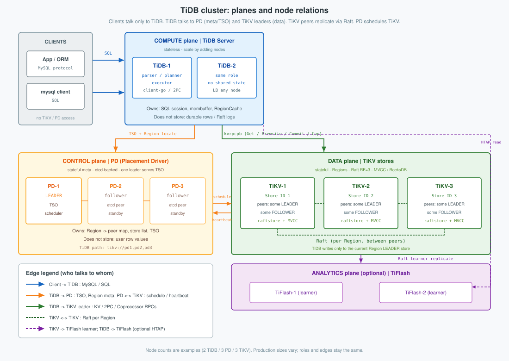
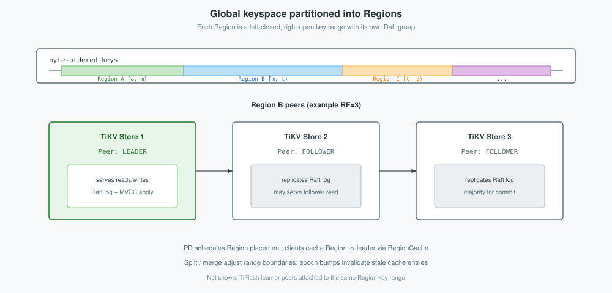
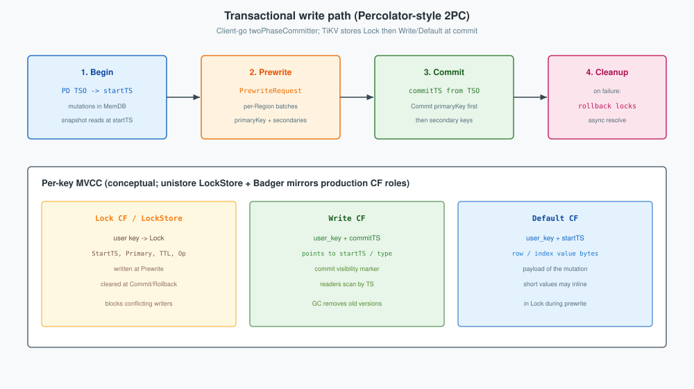

TiDB is an open-source, MySQL-compatible distributed SQL database: the **TiDB** process handles SQL and transactions, **PD** places data and issues timestamps, and **TiKV** stores rows with Multi-Raft, MVCC, and RocksDB. This post covers architecture (planes and division of labor, Regions, TiKV store) then implementation of codecs, client-go, and `primaryKey` 2PC—illustrated with a small `orders` table. Grounded in `git/tidb` and `github.com/tikv/client-go/v2` (TiKV server raftstore/RocksDB at architecture level; in-tree **unistore** for MVCC behavior where the `tikv/tikv` tree is absent).
<!--more-->

Related: [MySQL InnoDB](../../mysql/innodb/), [MySQL DML / locking](../../mysql/dml/).



---

## 2. Architecture

### 2.1 Cluster planes and division of labor

Clients speak **only** to TiDB. Durable rows live in **TiKV**. **PD** places data and issues timestamps. TiDB does not open RocksDB; it talks to PD and TiKV over RPC. See the figure at the top of this post.

| Plane | Nodes | Role | Division of labor |
|-------|-------|------|-------------------|
| **Clients** | apps / drivers | MySQL protocol | — |
| **Compute** | TiDB-1, TiDB-2, … | SQL + 2PC client | Turn SQL into keys; drive Prewrite/Commit |
| **Control** | PD (odd set, one leader) | Region meta, schedule, **TSO** | Where data is, what time it is, how peers move |
| **Data** | TiKV stores | Regions, Raft, MVCC, RocksDB | Store and replicate bytes; execute KV RPCs |
| **Analytics** (optional) | TiFlash | Columnar Raft learners | Raft learner replicate |

| Edge | Carries |
|------|---------|
| Client → TiDB | SQL / MySQL protocol |
| TiDB → PD | TSO, Region locate, store list |
| TiDB → TiKV leader | Get, Prewrite, Commit, Coprocessor, … |
| TiKV ↔ TiKV | Raft per Region |
| TiKV ↔ PD | Heartbeat / schedule |

**TiDB server** is the compute plane: it accepts the MySQL protocol, parses and plans SQL, encodes rows into keys (`tablecodec`), holds a per-session membuffer, and drives multi-Region transactions with `twoPhaseCommitter` / client-go. Nodes are interchangeable behind a load balancer; they own sessions and a `RegionCache`, not durable row storage.

**PD** is the control plane: it stores Region metadata, serves **TSO** (`startTS` / `commitTS`), answers Region locate requests, and schedules split / merge / transfer-leader from TiKV heartbeats. It never serves row values.

**TiKV** is the data plane: each store hosts Region peers (leader or follower), replicates with Raft, applies MVCC, and persists in local RocksDB. Client KV RPCs go to the **Region leader**; followers hold Raft copies and do not take writes for that Region.

**Example.** Schema used in later sections (`table_id = 100`, unique index `idx_user` = `index_id = 1`). Keys are logical; on the wire they are `tablecodec` bytes.

```sql
CREATE TABLE orders (
  id BIGINT PRIMARY KEY,
  user_id BIGINT NOT NULL,
  amount DECIMAL(10,2) NOT NULL,
  UNIQUE KEY idx_user (user_id)
);

INSERT INTO orders (id, user_id, amount) VALUES
  (1, 10, 19.90),
  (2, 20,  5.00);
```

| id | user_id | amount | Record key | Index key |
|----|---------|--------|------------|-----------|
| 1 | 10 | 19.90 | `t100_r1` | `t100_i1_10` → 1 |
| 2 | 20 | 5.00 | `t100_r2` | `t100_i1_20` → 2 |

Initial commit at `commitTS = 400` (`startTS = 390`).

```sql
SELECT id, amount FROM orders WHERE id = 1;
```

| id | amount |
|----|--------|
| 1 | 19.90 |

| Step | Edge | Action |
|------|------|--------|
| 1 | Client → TiDB | Encode handle `1` → `t100_r1` |
| 2 | TiDB → PD | Locate Region for `t100_r1`; take snapshot TS if needed |
| 3 | TiDB → TiKV leader | Point Get at that TS |
| 4 | TiKV | Return `amount = 19.90` from MVCC on the leader |

A write follows the same edges: TiDB buffers mutations and runs Prewrite/Commit; PD supplies TSO and leaders; TiKV leaders apply Lock / Write / Default. Region layout and the TiKV process stack are in §2.2–§2.3; `primaryKey` 2PC detail is in §3.

### 2.2 Keyspace and Regions

TiKV is one big sorted map. PD cuts it into **Regions**:

| Piece | Meaning |
|-------|---------|
| Range | `[startKey, endKey)` |
| Peers | Copies on different stores; one **leader** serves writes |
| Epoch | Bumps on split / merge / membership change |



TiDB encodes SQL rows into that map (`tablecodec`):

| Kind | Pattern |
|------|---------|
| Row | `t{tableID}_r{handle}` |
| Index | `t{tableID}_i{indexID}…` |
| Meta | `m…` |

A table’s rows sort together under `t{tableID}`, so splits and scans can follow table boundaries. The client caches Region→leader in **`RegionCache`** and refreshes on epoch / not-leader errors.

Example split for `orders` (`table_id = 100`):

| Region | Range | Holds |
|--------|-------|-------|
| R1 | `[t100_r1, t100_r2)` | `t100_r1` |
| R2 | `[t100_r2, t100_i1)` | `t100_r2` |
| R3 | `[t100_i1, t101)` | `idx_user` |

```sql
SELECT * FROM orders WHERE id = 1;              -- one locate → R1 leader
SELECT * FROM orders WHERE id >= 1 AND id <= 2; -- R1 then R2
SELECT id FROM orders WHERE user_id = 20;       -- R3 index, then R2 row
```

| id | user_id | amount |
|----|---------|--------|
| 1 | 10 | 19.90 |

*(Point lookup `id = 1` result; range and index queries follow the Region comments above.)*

### 2.3 Inside one TiKV store

TiDB is **not** a coordinator on a shared RocksDB. Each TiKV process owns Multi-Raft, MVCC apply, and local engines.


**Stack (top → bottom)**

1. **gRPC** — `kvrpcpb` (Get, Prewrite, Commit, Coprocessor, …)  
2. **Scheduler / latches** — conflict control before propose  
3. **raftstore** — many Region peers (leader or follower) on this machine  
4. **Apply + MVCC** — Lock / Write / Default after Raft majority  
5. **kvdb + raftdb** — two RocksDB instances (data CFs vs Raft logs)  

**kvdb column families (production)**

| CF | Holds |
|----|--------|
| `lock` | Prewrite / pessimistic locks |
| `write` | Commit records (and small values) |
| `default` | Large values |
| `raft` (meta) | Region metadata |

One RocksDB batch is atomic **on one store**. Keys on **other** Regions/stores need the distributed txn protocol in §3 (`primaryKey` 2PC). Raft makes each Region’s replicas agree.

| TiDB | TiKV |
|------|------|
| SQL, codecs, membuffer | Execute KV RPCs |
| Choose `primaryKey`, send 2PC | Latch, Raft, apply MVCC |
| RegionCache | Host peers; return not-leader |

A write through that stack:

```sql
UPDATE orders SET amount = 21.00 WHERE id = 1;
-- Query OK, 1 row affected
```

| id | user_id | amount |
|----|---------|--------|
| 1 | 10 | 21.00 |
| 2 | 20 | 5.00 |

| Step | Component | Result |
|------|-----------|--------|
| 1 | Executor + `tablecodec` | `t100_r1` in membuffer |
| 2 | `twoPhaseCommitter` | `primaryKey = t100_r1`, `startTS = 410` |
| 3 | `RegionCache` | R1 leader |
| 4 | Prewrite on TiKV | Latch → Raft propose → apply Lock + Default @410 |
| 5 | Commit on TiKV | Write@420; Lock cleared |
| 6 | Later SELECT | `21.00` if snapshot ≥ 420 |

Path in one line: TiDB → gRPC Prewrite/Commit → **R1 leader** → latch → Raft → apply MVCC into kvdb. Wrong peer returns **not leader**. `primaryKey` atomicity and lock resolve details are in §3.

---

## 3. Implementation

### 3.1 TiDB storage façade

`pkg/kv`: `Storage`, `Transaction`, `Snapshot`.  
`TiKVDriver.OpenWithOptions` builds PD client + client-go `KVStore`.  
`NewTiKVTxn` wraps `tikv.KVTxn`.

```sql
SELECT amount FROM orders WHERE id = 1;  -- → Get(EncodeRowKeyWithHandle(100, 1))
```

| amount |
|--------|
| 21.00 |

### 3.2 Encoding rows (`tablecodec`)

```go
tablePrefix     = []byte{'t'}
recordPrefixSep = []byte("_r")
indexPrefixSep  = []byte("_i")

func EncodeRowKey(tableID int64, encodedHandle []byte) kv.Key { /* t + tableID + _r + handle */ }
```

```sql
SELECT id, user_id FROM orders ORDER BY id;
```

| id | user_id | Row key | Index key |
|----|---------|---------|-----------|
| 1 | 10 | `t\|100\|_r\|1` | `t\|100\|_i\|1\|10` |
| 2 | 20 | `t\|100\|_r\|2` | `t\|100\|_i\|1\|20` |

### 3.3 RegionCache (`client-go`)

`KVStore` holds PD client, oracle, `RegionCache`, lock resolver.

```go
func (c *RegionCache) LocateKey(bo *retry.Backoffer, key []byte) (*KeyLocation, error)
```

```sql
SELECT amount FROM orders WHERE id = 2;
```

| amount |
|--------|
| 5.00 |

| Call | Result |
|------|--------|
| `LocateKey(t100_r2)` | Region R2, leader address |
| `Get` | row → `amount = 5.00` |

### 3.4 Distributed MVCC and `primaryKey` 2PC

TiKV has **no** central txn table. Each Region stores MVCC locally. For multi-key writes, the client sets one mutated key as **`primaryKey`** (`twoPhaseCommitter.primaryKey` / Lock.`Primary`). That key’s Write is the durable commit bit. **Regions are not typed primary/secondary**—only keys in **this** txn are.


| Name | Meaning | Not |
|------|---------|-----|
| **`primaryKey`** | One mutation key; Write@`commitTS` = txn committed | Not SQL `PRIMARY KEY` column; not a Region class |
| **Secondary keys** | Other mutations; Lock stores `Primary = primaryKey` | Not Raft followers |
| **Lock / Write / Default** | Intent, commit record, value | — |

```text
Prewrite:  Lock[key] = { startTS, Primary: primaryKey, ... }
Decision:  Commit(primaryKey) → Write@commitTS
Others:    Commit(secondary) or resolve via Lock.Primary
```

| Property | How |
|----------|-----|
| **Atomicity** | Committed iff `primaryKey` has Write@`commitTS`; secondaries must match |
| **Consistency (SI)** | Snapshot `startTS'`; resolve leftover Locks to the same commitTS (or hide txn if `startTS' < commitTS`) |
| **Recovery** | Later Lock hit checks `primaryKey` and finishes Commit/Rollback |



**Flow:** Begin (TSO) → choose `primaryKey` → Prewrite per Region leader → Commit `primaryKey` first → Commit secondaries → cleanup/resolve.

**Single-key example**

```sql
BEGIN;                                          -- startTS = 410
UPDATE orders SET amount = 21.00 WHERE id = 1; -- primaryKey = t100_r1
COMMIT;                                         -- commitTS = 420
```

| Phase | TiKV |
|-------|------|
| Prewrite | Lock@410; Default @410 |
| Commit | Write@420; Lock cleared |

```sql
SELECT amount FROM orders WHERE id = 1;  -- startTS' = 430 → 21.00
```

Reader at `startTS' = 415` still sees **19.90**.

**Multi-Region example** (R1 = `t100_r1`, R2 = `t100_r2`)

```sql
BEGIN;  -- startTS = 440
UPDATE orders SET amount = amount + 1.00 WHERE id IN (1, 2);
-- primaryKey = t100_r1; secondary = t100_r2
COMMIT; -- commitTS = 450
```

| Step | Result |
|------|--------|
| Prewrite R1+R2 | OK |
| Commit `primaryKey` on R1 | OK → **txn committed** |
| Commit secondary on R2 | may fail once |
| Later op hitting `t100_r2` Lock | Check `primaryKey` → finish secondary Commit → then read/write |

```sql
SELECT id, amount FROM orders ORDER BY id;  -- after resolve
```

| id | amount |
|----|--------|
| 1 | 22.00 |
| 2 | 6.00 |

| Reader | `id=1` | `id=2` (Lock still present) |
|--------|--------|------------------------------|
| `startTS' ≥ 450` | **22.00** now | resolve → **6.00** |
| `startTS' < 450` | **21.00** | **5.00** |

Checking `primaryKey` runs on **Lock hit**, not on every query.

### 3.5 Coprocessor

```sql
SELECT SUM(amount) FROM orders;
```

| SUM(amount) |
|-------------|
| 26.00 |

*(Amounts 21.00 + 5.00 after the single-row update in §2.3, before the multi-Region `+1.00`.)* TiDB may push a DAG per Region; TiKV computes partial aggregates next to data. Same SQL result whether merged in TiDB or partially pushed down.

### 3.6 Unistore (in-tree stand-in)

`pkg/store/mockstore/unistore/tikv.MVCCStore`: LockStore + Badger, Prewrite/Commit aligned with `kvrpcpb`, **no** Multi-Raft. Use for lock/resolve behavior tests—not RocksDB CF layout.

```sql
-- A: BEGIN; UPDATE orders SET amount = 30 WHERE id = 1;  -- holds Lock
-- B: BEGIN; UPDATE orders SET amount = 40 WHERE id = 1; COMMIT;
-- B waits / conflicts until A commits or rolls back
```

### 3.7 Key files

| Path | Role |
|------|------|
| `git/tidb/pkg/kv/kv.go` | `Storage`, `Transaction` |
| `git/tidb/pkg/store/driver/tikv_driver.go` | Open PD + `KVStore` |
| `git/tidb/pkg/store/driver/txn/txn_driver.go` | `tikvTxn` |
| `git/tidb/pkg/tablecodec/tablecodec.go` | Key encoding |
| `git/tidb/pkg/store/mockstore/unistore/tikv/mvcc.go` | Unistore MVCC |
| `client-go/.../tikv/kv.go` | `KVStore` |
| `client-go/.../internal/locate/region_cache.go` | `RegionCache` |
| `client-go/.../txnkv/transaction/2pc.go` | `twoPhaseCommitter` |

(`client-go` = module version in `git/tidb/go.mod`.)

---

*Production raftstore/RocksDB details live in `tikv/tikv`. SQL tables here are illustrative for `orders`; TSO and Region IDs are not from a live cluster.*
