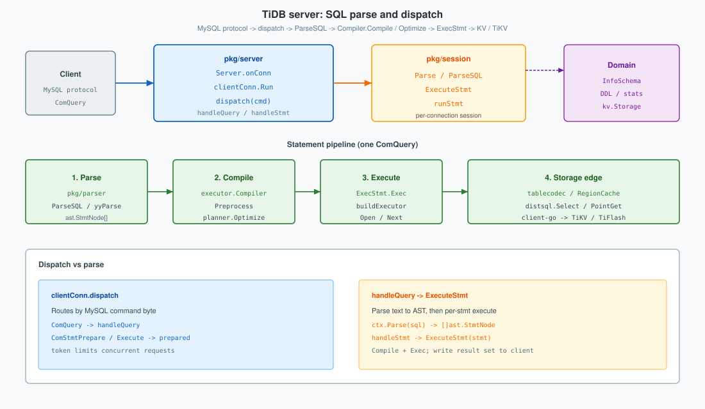
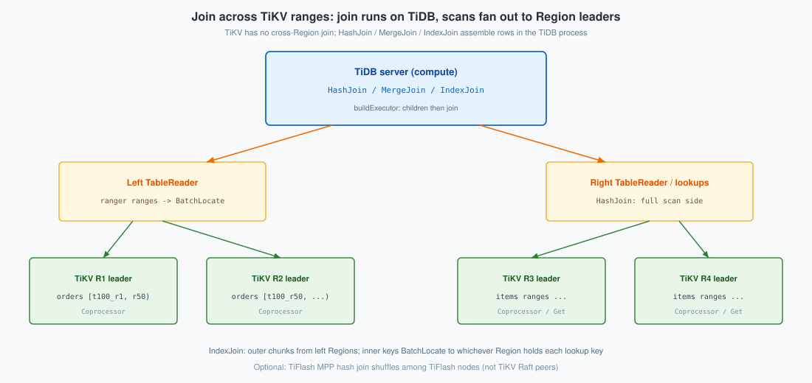
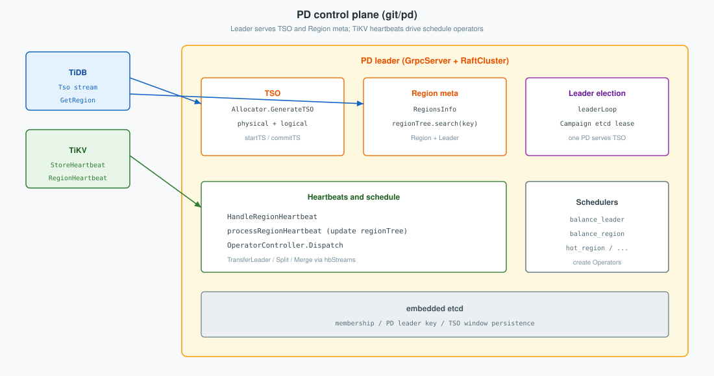

TiDB is a MySQL-compatible distributed SQL system. A deployment is a **cluster** of TiDB servers (compute), **PD** (control), **TiKV** (row store), and optionally **TiFlash** (columnar). This post orients cluster roles, follows one TiDB server in `git/tidb` (dispatch → execute), then shows how **PD** in `git/pd` owns Region key ranges (split/merge), TSO, locate, and scheduling. TiKV store, Region Raft, and 2PC are in [TiKV](../tikv/); CAP theory and PD etcd Raft are in [CAP and Raft](../cap/).
<!--more-->

Related: [TiKV architecture: Multi-Raft Regions, peer Raft, and MVCC](../tikv/), [CAP and Raft](../cap/).


---

## 1. Overview

Clients speak the MySQL protocol only to **TiDB**. Durable rows live in **TiKV**. **PD** places Regions and issues timestamps. **TiFlash** is an optional analytics plane on the same keyspace.

**What this post covers**

1. Overview — cluster roles and content map  
2. TiDB server — dispatch → execute, including cross-Region joins (`git/tidb`)  
3. PD — Region key ranges / split, TSO, locate, heartbeats (`git/pd`)  

**Cluster roles**

| Plane | Nodes | Role |
|-------|-------|------|
| **Clients** | apps / drivers | MySQL protocol |
| **Compute** | TiDB-1, TiDB-2, … | SQL + transaction client |
| **Control** | PD (odd set, one leader) | Region ranges / meta, schedule, **TSO** |
| **Data** | TiKV stores | Regions, Raft, MVCC, RocksDB |
| **Analytics** (optional) | TiFlash | Columnar Raft learners; MPP reads |

| Piece | Owns | Does not own |
|-------|------|--------------|
| **TiDB** | SQL session, plan, membuffer, 2PC client, RegionCache | Durable rows, Raft logs |
| **PD** | Region meta, schedule, TSO | Row values |
| **TiKV** | Regions, Raft, MVCC, RocksDB | SQL parsing |
| **TiFlash** (optional) | Columnar learners / MPP | Transactional write authority |

| Edge | Carries |
|------|---------|
| Client → TiDB | SQL / MySQL protocol |
| TiDB → PD | TSO, Region locate, store list |
| TiDB → TiKV leader | Get, Prewrite, Commit, Coprocessor, … |
| TiDB → TiFlash | Analytical / MPP queries (when chosen by the optimizer) |
| TiKV ↔ TiKV | Raft per Region |
| TiKV ↔ PD | Heartbeat / schedule |
| TiFlash ↔ TiKV | Learner replicate |

Clients never open TiKV or PD directly. TiDB nodes are interchangeable behind a load balancer. Store stack, Region Raft, and 2PC are in [TiKV](../tikv/); CAP and PD etcd Raft are in [CAP and Raft](../cap/). How PD answers TSO and Region locate is §3.

---

## 2. TiDB server

A TiDB process accepts the MySQL protocol, parses SQL to AST, compiles a physical plan, builds executors, and talks to PD / TiKV (or TiFlash) over RPC. It does **not** run Raft or open RocksDB.



| Layer | Package | Responsibility |
|-------|---------|----------------|
| Protocol | `pkg/server` | Accept connections; `dispatch` by command; write result sets |
| Session | `pkg/session` | Per-connection state; `Parse` / `ExecuteStmt` / txn lifecycle |
| Parser | `pkg/parser` | Text → `[]ast.StmtNode` (`ParseSQL` / `yyParse`) |
| Planner | `pkg/planner` | Preprocess + `Optimize` (logical → physical) |
| Executor | `pkg/executor` | `Compiler.Compile`, `ExecStmt`, executor tree |
| Domain | `pkg/domain` | Process-wide InfoSchema, DDL, stats, `kv.Storage` |
| Storage client | `pkg/store`, `distsql`, client-go | Region locate, Get / Coprocessor, 2PC |

Statement handling follows the source call order below: **dispatch → parse → compile → execute**.

### 2.1 Connection and command dispatch

`Server.onConn` runs one goroutine per client. After handshake and `openSession`, `clientConn.Run` reads packets and calls **`dispatch`**. The first byte is the protocol command; the hot path is `ComQuery` → `handleQuery`.

```go
// git/tidb: pkg/server/conn.go — dispatch (simplified)
func (cc *clientConn) dispatch(ctx context.Context, data []byte) error {
	cmd := data[0]
	data = data[1:]
	dataStr := string(hack.String(data))
	switch cmd {
	case mysql.ComQuery: // Most frequently used command.
		return cc.handleQuery(ctx, /* trimmed sql */)
	case mysql.ComStmtPrepare:
		return cc.HandleStmtPrepare(ctx, dataStr)
	case mysql.ComStmtExecute:
		return cc.handleStmtExecute(ctx, data)
	// ComQuit, ComInitDB, ...
	}
}
```

`handleQuery` only routes into parse then per-statement execute; it does not plan or touch KV itself:

```go
// git/tidb: pkg/server/conn.go — handleQuery (simplified)
func (cc *clientConn) handleQuery(ctx context.Context, sql string) (err error) {
	var stmts []ast.StmtNode
	if stmts, err = cc.ctx.Parse(ctx, sql); err != nil { // §2.2
		return err
	}
	for i, stmt := range stmts {
		_, err = cc.handleStmt(ctx, stmt, /* warns */, i == len(stmts)-1)
		// handleStmt → ExecuteStmt (§2.3–2.4) → writeResultSet / OK
	}
	return err
}
```

`cc.ctx` is a `TiDBContext` wrapping `sessionapi.Session` (`pkg/server/driver_tidb.go`). Prepared statements use `ComStmtPrepare` / `ComStmtExecute`; they still enter `ExecuteStmt` after bind/resolve.

### 2.2 Parse

`session.Parse` → `ParseSQL` takes a pooled in-tree parser (`github.com/pingcap/tidb/pkg/parser` → `./pkg/parser` in `go.mod`), applies session SQL mode, and returns AST nodes.

```go
// git/tidb: pkg/session/session.go — ParseSQL (core)
p := parserutil.GetParser()
defer parserutil.DestroyParser(p)
p.SetSQLMode(sqlMode)
p.SetParserConfig(s.sessionVars.BuildParserConfig())
tmp, warn, err := p.ParseSQL(sql, params...)
res := slices.Clone(tmp) // copy so the parser can be reused
return res, warn, err
```

```go
// git/tidb: pkg/parser/yy_parser.go
func (parser *Parser) ParseSQL(sql string, params ...ParseParam) (stmt []ast.StmtNode, warns []error, err error) {
	parser.lexer.reset(sql)
	var l yyLexer = &parser.lexer
	yyParse(l, parser)
	// ... errors / warns ...
	for _, stmt := range parser.result {
		ast.SetFlag(stmt)
	}
	return parser.result, warns, nil
}
```

Output is `[]ast.StmtNode` (for example `*ast.SelectStmt`, `*ast.InsertStmt`). No plan and no KV I/O yet.

### 2.3 Compile

`handleStmt` calls `session.ExecuteStmt` → `executeStmtImpl`. After `PrepareTxnCtx` and `ResetContextOfStmt`, the session builds an **`executor.Compiler`** and calls **`Compile`**: `plannercore.Preprocess`, then **`planner.Optimize`**, then wrap the physical plan in **`ExecStmt`**.

```go
// git/tidb: pkg/executor/compiler.go — Compile (simplified)
func (c *Compiler) Compile(ctx context.Context, stmtNode ast.StmtNode) (*ExecStmt, error) {
	nodeW := resolve.NewNodeW(stmtNode)
	err := plannercore.Preprocess(ctx, c.Ctx, nodeW, /* ... */)
	is := sessiontxn.GetTxnManager(c.Ctx).GetTxnInfoSchema()
	finalPlan, names, err := planner.Optimize(ctx, c.Ctx, nodeW, is)
	stmt := &ExecStmt{Plan: finalPlan, StmtNode: stmtNode, Ctx: c.Ctx /* ... */}
	return stmt, nil
}
```

`Optimize` may hit plan cache or take a point-get fast path (`TryFastPlan`) before a full logical→physical search. Compile ends when an `ExecStmt` (or point-get plan handle) exists; it does not yet open executors or send RPCs.

**Compile does not pick TiKV store addresses.** For a predicate such as `id >= 1`, the optimizer turns access conditions into **logical key ranges** on the plan (`PhysicalTableScan.Ranges` as `[]*ranger.Range`), via `ranger.BuildTableRange` / `DetachCondAndBuildRangeForIndex` (see `PhysicalTableScan.ResolveCorrelatedColumns` and path building during optimize). Those ranges are encoded later as `kv.KeyRange` bytes (`tablecodec` record prefix + handle bounds). The plan still does **not** list Region IDs or TiKV leader addresses—only “which key intervals to scan.” Which TiKV peers own those intervals is resolved at **execute** (§2.4) through `RegionCache`.

```go
// git/tidb: pkg/planner/.../physical_table_scan.go — ranges on the plan (not store addrs)
// AccessCondition is used to calculate range.
AccessCondition []expression.Expression
Ranges          []*ranger.Range
```

```go
// git/tidb: same file — rebuild ranges from access conditions (optimizer / correlated path)
p.Ranges, _, _, err = ranger.BuildTableRange(access, ctx.GetRangerCtx(), &pkTP, 0)
```

### 2.4 Execute

Still inside `executeStmtImpl`: if the compiled result is a point-get short path, `stmt.PointGet` runs; otherwise **`runStmt`** calls **`ExecStmt.Exec`**.

`ExecStmt.Exec` (`pkg/executor/adapter.go`):

1. `buildExecutor` — `executorBuilder.build(plan)`  
2. `openExecutor`  
3. `handleNoDelay` for DML, or return a record set whose `Next` pulls chunks  

**TiKV targets are chosen here.** `TableReaderExecutor` turns `ranger.Range` into `[]kv.KeyRange`, then the coprocessor client (`pkg/store/copr`) splits those ranges by Region and looks up leaders:

1. Encode logical ranges → `kv.KeyRange` (`tablecodec` for `t{tableID}_r…`)  
2. `RegionCache.BatchLocateKeyRanges` / `LocateKey` — cache hit or PD Region locate  
3. Build cop tasks per Region; send Coprocessor / KV RPCs to each **Region leader** store  

```go
// git/tidb: pkg/store/copr/region_cache.go — map key ranges → Region locations
locs, err := c.BatchLocateKeyRanges(bo.TiKVBackoffer(), kvRanges, opts...)
```

A single `id >= 1` scan may therefore fan out to **several TiKV leaders** if the range crosses Region boundaries; compile only knew the key interval, not that fan-out. Cache misses go to PD; `NotLeader` / epoch errors refresh the cache and retry—see [TiKV](../tikv/). SQL `COMMIT` becomes Prewrite/Commit via `twoPhaseCommitter` on the same locate path—see [TiKV](../tikv/). After `Exec` returns, `handleStmt` writes the result set or OK packet to the client.

**End-to-end (source order)**

```text
onConn → handshake → openSession → Run
  → dispatch(ComQuery) → handleQuery
  → Parse / ParseSQL → []ast.StmtNode
  → handleStmt → ExecuteStmt / executeStmtImpl
       → PrepareTxnCtx, ResetContextOfStmt
       → Compiler.Compile
            → Preprocess
            → planner.Optimize
                 → ranger ranges on PhysicalTableScan (logical keys only)
            → ExecStmt
       → runStmt → ExecStmt.Exec
            → buildExecutor → openExecutor → Next | handleNoDelay
            → kv.KeyRange + RegionCache.BatchLocateKeyRanges
            → Coprocessor / Get / Prewrite → Region leader TiKVs
  → writeResultSet / OK packet
```

### 2.5 Join across TiKV ranges

TiKV data is partitioned by Region key ranges owned by PD (§3.3). A Region leader only serves keys in its `[start, end)`. There is **no** TiKV RPC that joins two tables across Regions. Cross-Region joins run in the **TiDB process** as volcano-style executors (`Next` returns a `chunk.Chunk`): a join operator pulls child readers; each reader already fans one logical scan into **parallel Coprocessor RPCs** to many Region leaders (§2.4). TiDB then joins those row streams in memory.



```sql
SELECT o.id, i.name
FROM orders o
JOIN items i ON o.item_id = i.id
WHERE o.id >= 1;
```

| Strategy | Where the join runs | How TiKV is used |
|----------|---------------------|------------------|
| **HashJoin** / **MergeJoin** | TiDB (`HashJoinExec` / `MergeJoinExec`) | Each side’s `TableReader` / `IndexReader` splits its ranges and runs concurrent cop tasks; TiDB builds/probes the join |
| **IndexJoin** (IndexLookUpJoin) | TiDB | Outer reader: multi-Region parallel scan; per outer chunk, encode inner keys, `BatchLocate`, batched Get / index lookup on the leaders that hold those keys |
| **TiFlash MPP** (optional) | TiFlash nodes | MPP hash join + exchange among TiFlash—still not a TiKV Raft-peer join |

#### Reader path: one scan → many parallel Region RPCs

For each join child (`TableReaderExecutor` / `IndexReaderExecutor`), DistSQL does not issue a single RPC for the whole table. It:

1. Encodes the planner’s `ranger` intervals as `[]kv.KeyRange`.
2. **`RegionCache.SplitKeyRangesByLocations`** (via `BatchLocateKeyRanges`) cuts those ranges at Region (or bucket) boundaries.
3. **`buildCopTasks`** builds one **`copTask`** per location: `{region, ranges, storeAddr}`.
4. **`CopClient.Send`** starts up to `min(tidb_distsql_scan_concurrency, len(tasks))` workers (default concurrency **15**) that each send a Coprocessor RPC to that Region’s leader; responses merge into the reader’s `Next` chunks.

```go
// git/tidb: pkg/store/copr/region_cache.go
locs, err := c.BatchLocateKeyRanges(bo.TiKVBackoffer(), kvRanges, opts...)
// SplitKeyRangesByLocations → []*LocationKeyRanges

// git/tidb: pkg/store/copr/coprocessor.go
type copTask struct {
	region    tikv.RegionVerID
	ranges    *KeyRanges
	storeAddr string
	...
}
tasks, err := buildCopTasks(bo, ranges, opt)  // one task per Region/bucket
// then workers: for i := range concurrency { go handle copTask → TiKV RPC }
```

```go
// git/tidb: pkg/distsql/distsql.go
func Select(...) (SelectResult, error) {
	...
	resp := dctx.Client.Send(ctx, kvReq, dctx.KVVars, option)  // CopClient, parallel tasks
```

So a join child is still an iterator leaf from HashJoin’s point of view; underneath, that leaf is a **merge of concurrent Region RPCs**, not a local `TABLE` buffer.

#### Join tree: children first, then join in TiDB

`executorBuilder` builds the join **after** its children, so each side’s multi-Region I/O is nested under the join:

```go
// git/tidb: pkg/executor/builder.go — HashJoin
leftExec := b.build(v.Children()[0])  // TableReader → buildCopTasks → parallel leaders
rightExec := b.build(v.Children()[1])
return b.buildHashJoinFromChildExecs(leftExec, rightExec, v)
```

```text
HashJoin.Next (TiDB memory)
  ├─ TableReader(orders).Next
  │     KeyRange → SplitKeyRangesByLocations → copTasks
  │     ├── worker ─ Cop RPC ─► store A (R1 leader)
  │     ├── worker ─ Cop RPC ─► store B (R2 leader)
  │     └── …  (capped by DistSQLScanConcurrency)
  └─ TableReader(items).Next   — same fan-out on items Regions

IndexJoin.Next
  ├─ Outer TableReader — parallel cop as above
  └─ per outer chunk: BatchLocate(inner keys) → batched Get/Cop to those leaders
```

“Join across multiple TiKV” therefore means: **parallel range I/O to many leaders under each reader, join logic on TiDB** (or MPP on TiFlash)—not a distributed join inside raftstore. RPC cost is overlapped by that concurrency and by chunked `Next`; it is not free for tiny lookups (see §2.4 locate path).

### 2.6 Worked example: SQL → keys → locate

Schema (`table_id = 100`, unique index `idx_user` = `index_id = 1`):

```sql
CREATE TABLE orders (
  id BIGINT PRIMARY KEY,
  user_id BIGINT NOT NULL,
  amount DECIMAL(10,2) NOT NULL,
  UNIQUE KEY idx_user (user_id)
);

INSERT INTO orders (id, user_id, amount) VALUES
  (1, 10, 19.90),
  (2, 20,  5.00);
```

| id | user_id | amount | Record key | Index key |
|----|---------|--------|------------|-----------|
| 1 | 10 | 19.90 | `t100_r1` | `t100_i1_10` → 1 |
| 2 | 20 | 5.00 | `t100_r2` | `t100_i1_20` → 2 |

```sql
SELECT id, amount FROM orders WHERE id >= 1;
```

| id | amount |
|----|--------|
| 1 | 19.90 |
| 2 | 5.00 |

| Step | Phase | Inside TiDB | Knows TiKV stores? |
|------|-------|-------------|--------------------|
| 1 | Dispatch | `dispatch` / `handleQuery` | No |
| 2 | Parse | `ParseSQL` → AST | No |
| 3 | Compile | `Optimize` → TableReader; `ranger` range ≈ `[t100_r1, +∞)` | No — logical key range only |
| 4 | Execute | Encode `kv.KeyRange`; `BatchLocateKeyRanges` → Region leader(s); Coprocessor scan | Yes — after RegionCache / PD |

### 2.7 Key files

| Path | Role |
|------|------|
| `git/tidb/pkg/server/server.go` | `Server`, `onConn` |
| `git/tidb/pkg/server/conn.go` | `dispatch`, `handleQuery`, `handleStmt` |
| `git/tidb/pkg/server/driver_tidb.go` | `TiDBDriver` / `TiDBContext` |
| `git/tidb/pkg/session/session.go` | `ParseSQL`, `ExecuteStmt`, `runStmt` |
| `git/tidb/pkg/parser/yy_parser.go` | `Parser.ParseSQL` / `yyParse` |
| `git/tidb/pkg/executor/compiler.go` | `Compiler.Compile` |
| `git/tidb/pkg/planner/optimize.go` | `Optimize` |
| `git/tidb/pkg/util/ranger/...` | Build logical key ranges from predicates |
| `git/tidb/pkg/executor/adapter.go` | `ExecStmt.Exec`, `buildExecutor` |
| `git/tidb/pkg/executor/builder.go` | `buildHashJoin`, `buildIndexLookUpJoin`, … |
| `git/tidb/pkg/executor/join/` | HashJoin / IndexJoin workers |
| `git/tidb/pkg/store/copr/region_cache.go` | `SplitKeyRangesByLocations` / `BatchLocateKeyRanges` |
| `git/tidb/pkg/store/copr/coprocessor.go` | `buildCopTasks`, parallel `copTask` workers / Cop RPC |
| `git/tidb/pkg/distsql/distsql.go` | `Select` → `CopClient.Send` |
| `git/tidb/pkg/domain/domain.go` | process-wide Domain |
| `git/tidb/pkg/tablecodec/tablecodec.go` | Key encoding |
| `git/tidb/pkg/store/driver/tikv_driver.go` | Open PD + `KVStore` |

---

## 3. PD

PD is the control plane in `git/pd`. An odd-sized PD membership elects **one leader** (etcd lease). That leader owns the **Region keyspace map** (ranges, split/merge), allocates **TSO**, answers **Region locate**, ingests **TiKV heartbeats**, and drives **schedule operators**. It never stores row values.



```text
BOOT:  pd-server → CreateServer → embed etcd → startServer → leaderLoop
LEAD:  Campaign lease → Keep → createRaftCluster / Coordinator

TiDB:  Tso stream → Allocator.GenerateTSO
       GetRegion(key) → RegionsInfo.GetRegionByKey → regionTree.search

TiKV:  StoreHeartbeat / RegionHeartbeat → processRegionHeartbeat
       → OperatorController.Dispatch → cmds on hbStreams
```

### 3.1 Leader election

`Server.Run` starts etcd, then `leaderLoop`. Only the member that is also etcd leader campaigns for the PD leader key; followers watch until the lease changes.

```go
// git/pd: server/server.go — leaderLoop (simplified)
leader, checkAgain := s.member.CheckLeader()
if leader != nil {
	leader.Watch(s.serverLoopCtx) // block until leader changes
	continue
}
etcdLeader := s.member.GetEtcdLeader()
if etcdLeader != s.member.ID() {
	time.Sleep(200 * time.Millisecond)
	continue
}
s.campaignLeader() // etcd lease Campaign + Keep; then createRaftCluster
```

TSO generation requires serving leadership (`Allocator.isServing`); otherwise clients see not-leader and retry against the current leader.

### 3.2 TSO

TiDB takes `startTS` / `commitTS` from a gRPC **`Tso`** stream. The leader’s `tso.Allocator` advances a physical (ms) + logical counter (`GenerateTSO` → `timestampOracle.getTS`). The allocation window is persisted so a new leader does not go backward.

```go
// git/pd: server/grpc_service.go — Tso (core path)
ts, err := s.tsoAllocator.GenerateTSO(ctx, count)
response := &pdpb.TsoResponse{Timestamp: &ts, Count: count}
stream.Send(response)
```

```go
// git/pd: pkg/tso/allocator.go
func (a *Allocator) GenerateTSO(ctx context.Context, count uint32) (pdpb.Timestamp, error) {
	if !a.isServing() {
		return pdpb.Timestamp{}, errs.ErrGenerateTimestamp.FastGenByArgs(/* not leader */)
	}
	return a.timestampOracle.getTS(ctx, count)
}
```

### 3.3 Keyspace and Region ranges

TiKV presents **one global sorted keyspace**, not one table per store. TiDB SQL tables and indexes are **encoded into that keyspace** (e.g. record keys `t{table_id}_r…`, index keys `t{table_id}_i{index_id}_…`). PD does **not** assign “table T → TiKV N.” It cuts the byte keyspace into **Regions**—half-open ranges `[startKey, endKey)`—and places each Region’s peers on TiKV stores (commonly RF=3).

Consequences:

- One **TiKV store** hosts **many Region peers** for whatever ranges PD placed there. Those ranges can cover fragments of **many tables** (and indexes), plus system keys—not a single table.
- One **table** is usually split into **many Regions** across **many stores** as it grows; a scan or join may hit several Region leaders (§2.4–2.5).
- Scheduling moves or splits **Regions** (key ranges), not whole tables.

Epoch bumps on split, merge, or membership change. That Region layout is what TiDB’s `RegionCache` and join/scan fan-out consume.

| Piece | Meaning |
|-------|---------|
| Range | `[startKey, endKey)` in the global keyspace |
| Peers | Copies on different stores; one **leader** serves client KV RPCs |
| Epoch | Version for split / merge / conf-change; stale cache must reload |


Example after splits for `orders` (`table_id = 100`)—still only key ranges, not “this TiKV owns orders”:

| Region | Range | Holds |
|--------|-------|-------|
| R1 | `[t100_r1, t100_r50)` | early row keys |
| R2 | `[t100_r50, t100_i1)` | later rows |
| R3 | `[t100_i1, t101)` | `idx_user` |

R1–R3’s peers sit on different TiKV stores; another table’s keys (`t101_…`) are other ranges that may share those same stores. `id >= 1` becomes a logical key range that may cover R1 and R2; execute locates each overlapping Region’s leader. How Raft replicates within one Region is in [TiKV](../tikv/); CAP and PD etcd Raft are in [CAP and Raft](../cap/).

**Split.** When a Region grows too large or hot, PD (or TiKV via `AskSplit`) creates a **split operator**. The operator carries split keys; on the next heartbeat tick, TiKV applies the split and heartbeats report the new children—PD inserts them into `regionTree`.

```go
// git/pd: pkg/schedule/operator/create_operator.go
func CreateSplitRegionOperator(desc string, region *core.RegionInfo, kind OpKind,
	policy pdpb.CheckPolicy, keys [][]byte) (*Operator, error) {
	step := SplitRegion{
		StartKey:  region.GetStartKey(),
		EndKey:    region.GetEndKey(),
		Policy:    policy,
		SplitKeys: keys,
	}
	brief := fmt.Sprintf("split: region %v use policy %s", region.GetID(), policy)
	op := NewOperator(desc, brief, region.GetID(), region.GetRegionEpoch(),
		kind, region.GetApproximateSize(), step)
	return op, nil
}
```

Merge is the inverse (`CreateMergeRegionOperator`). Transfer-leader moves which peer serves writes without changing the key range.

### 3.4 Region locate

TiDB’s `RegionCache` fills misses via PD **`GetRegion`** / scan RPCs. PD looks up the key in an in-memory **region tree** ordered by `StartKey` (`[start, end)`).

```go
// git/pd: pkg/core/region.go
func (r *RegionsInfo) GetRegionByKey(regionKey []byte) *RegionInfo {
	return r.tree.search(regionKey)
}
```

```go
// git/pd: pkg/utils/grpcutil/cluster.go — GetRegion helper
region := rc.GetRegionByKey(request.GetRegionKey())
return &pdpb.GetRegionResponse{
	Region: region.GetMeta(),
	Leader: region.GetLeader(),
	// DownPeers / PendingPeers / ...
}, nil
```

That is how execute-time `BatchLocateKeyRanges` (§2.4) learns Region leaders when the client cache misses.

### 3.5 Heartbeats and schedule

TiKV sends **`StoreHeartbeat`** and **`RegionHeartbeat`**. On each region heartbeat, `RaftCluster.HandleRegionHeartbeat` updates the region tree (`processRegionHeartbeat`), then **`OperatorController.Dispatch`** advances pending operators and may push `TransferLeader` / change-peer / **split** / **merge** commands back on the heartbeat stream.

```go
// git/pd: server/cluster/cluster_worker.go
func (c *RaftCluster) HandleRegionHeartbeat(region *core.RegionInfo) error {
	if err := c.processRegionHeartbeat(ctx, region); err != nil {
		return err
	}
	c.coordinator.GetOperatorController().Dispatch(
		region, operator.DispatchFromHeartBeat, c.coordinator.RecordOpStepWithTTL)
	return nil
}
```

Schedulers and checkers (`balance_leader`, `balance_region`, **split** / **merge** checkers, …) create `Operator`s; heartbeats are the tick that applies them. TiDB does not participate in that loop—it only consumes the resulting Region meta and TSO.

### 3.6 Key files (`git/pd`)

| Path | Role |
|------|------|
| `cmd/pd-server/main.go` | process entry |
| `server/server.go` | `CreateServer`, `Run`, `leaderLoop`, `campaignLeader` |
| `server/grpc_service.go` | `GrpcServer.Tso`, `GetRegion`, heartbeats, AskSplit |
| `pkg/tso/allocator.go` | `GenerateTSO` |
| `pkg/tso/tso.go` | `timestampOracle.getTS` |
| `pkg/core/region.go` | `RegionsInfo.GetRegionByKey` |
| `pkg/core/region_tree.go` | B-tree search by start key |
| `server/cluster/cluster_worker.go` | `HandleRegionHeartbeat` |
| `pkg/schedule/operator/create_operator.go` | `CreateSplitRegionOperator`, merge / transfer-leader |
| `pkg/schedule/operator/operator_controller.go` | `Dispatch` |
| `pkg/schedule/checker/split_checker.go` | size / rule driven splits |
| `pkg/schedule/schedulers/` | balance / hot-region schedulers |

---
