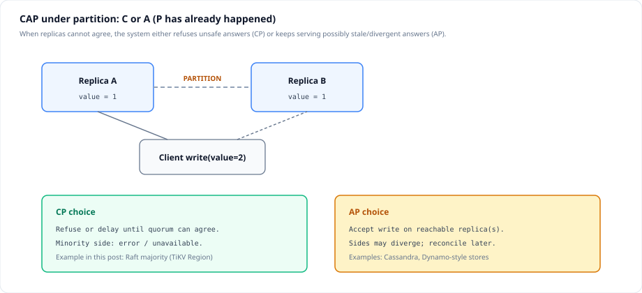
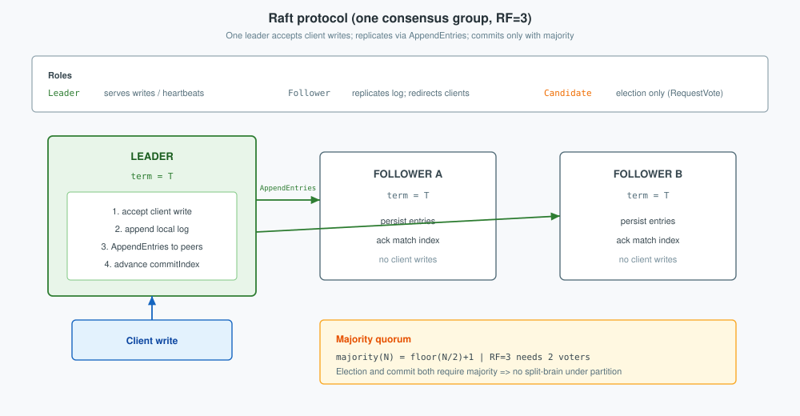
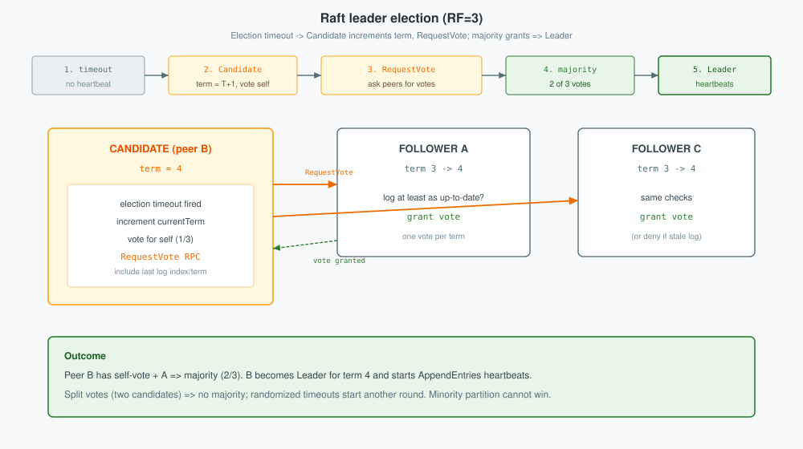
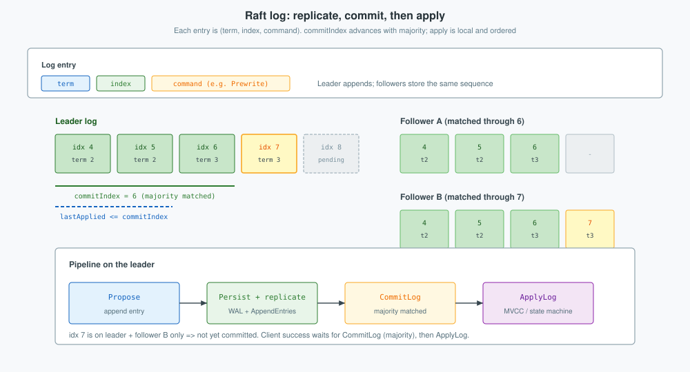
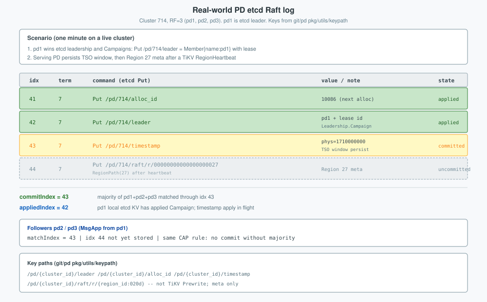

The **CAP theorem** states what a replicated store can guarantee when the network splits. **Raft** is a consensus algorithm that implements CAP’s **CP** choice via majority quorum. This post defines C, A, and P, explains how Raft relates to that trade-off, then details **PD’s** embedded-etcd Raft (control-plane membership). TiKV Region Multi-Raft (`raft-rs`) is in [TiKV: store, Multi-Raft Regions, and 2PC](../tikv/); PD TSO / locate / schedule surfaces are in [TiDB architecture](../architecture/).
<!--more-->

Related: [TiKV: store, Multi-Raft Regions, and 2PC](../tikv/), [TiDB architecture: cluster and server](../architecture/).

Source grounding: Raft as design and protocol; PD embedded etcd in `git/pd`. Region Multi-Raft runs in **TiKV** ([TiKV post](../tikv/)); PD membership Raft runs in **PD**—neither in the TiDB server process.

---

## 1. Overview

Brewer conjectured CAP in 2000; Gilbert and Lynch proved a formal version in 2002. Under unbounded message delay or loss between replicas, a system cannot offer both **linearizable** reads/writes to every live node and **non-error responses** from every live node.

Raft answers the CP side for one replicated object: at most one leader per term, and a write commits only when a **majority** of voters have stored it. In a TiDB cluster that object is either a **Region** (TiKV—[TiKV post](../tikv/)) or the **PD / etcd membership log** (this post, §3).

**What this post covers**

1. Overview — CAP and where Raft appears  
2. Theory — C, A, P, then Raft as the CP mechanism  
3. PD Raft — two leaders (etcd vs PD), start, election, keep-alive, log (`git/pd`)  

**When CAP applies**

| Applies | Does not decide alone |
|---------|------------------------|
| Multi-replica read/write of one logical object | Single-node stores |
| Behavior while replicas cannot communicate | Latency when the network is healthy |
| Success vs error of client operations | SQL isolation levels by themselves |

**Facts**

- On a real multi-node network, **partitions happen**; the design question is **C or A** while P holds.  
- **CP**: one agreed value; the minority side often errors or stalls.  
- **AP**: each side may accept work; values can diverge until repair.  
- Raft majority commit ⇒ **CP per Raft group**. PD: one etcd group for the PD members. TiKV: one group per Region ([TiKV](../tikv/)).

---

## 2. Theory

### 2.1 The three properties

| Property | Meaning |
|----------|---------|
| **Consistency (C)** | A successful read reflects the latest successful write (linearizability for that object). |
| **Availability (A)** | Every request to a non-failing node eventually gets a non-error response (no unbounded wait for unreachable peers). |
| **Partition tolerance (P)** | The system still operates when messages between node subsets are lost or delayed arbitrarily. |

CAP’s **C** is not ACID “consistency” (constraints across rows). It is the **single-copy illusion** for a replicated object. CAP’s **A** is not “three nines uptime”; it is whether a live node answers or waits forever for quorum.

### 2.2 The partition model

Split the replicas so **no message crosses** the cut for an unbounded time. Clients may still reach nodes inside each component.



| Choice | Behavior | Client on the minority side |
|--------|----------|-----------------------------|
| **CP** | Commit only with a rule that preserves linearizability (typically a **majority quorum**). | Error, timeout, or “not leader” |
| **AP** | Accept locally; reconcile later (LWW, vector clocks, CRDTs, …). | Success; histories may fork |

There is no option that keeps linearizability for all clients **and** non-error answers on every live node for the whole partition. That is the theorem.

### 2.3 Raft Protocol

CAP asks what is possible under partition. **Raft** is one concrete answer: choose **C** by requiring a **majority** before a write is committed, and allow at most one leader per term so histories do not fork.

| CAP question | Raft answer |
|--------------|-------------|
| How to keep one history? | Commit only prefixes a majority has stored |
| What happens on the minority side? | Cannot elect or commit → error / stall |
| Split-brain? | One vote per term + majority ⇒ at most one leader per term |

A Raft group of `N` voters has at most one **Leader** per term. Followers replicate; they do not accept client writes for that group. Quorum size is `majority(N) = ⌊N/2⌋ + 1`. Election and log commit use the same rule—**no split-brain**. That is CAP’s **CP** outcome for the group.



| Step | Who | What |
|------|-----|------|
| Client write | Leader only | Append a new log entry locally |
| Replicate | Leader → followers | `AppendEntries` (also used as heartbeat) |
| Commit | Leader | Advance `commitIndex` when a **majority** of voters have matched that index |
| Redirect | Follower / old leader | Tell the client who the leader is (or that there is none during election) |

**Election.** The leader periodically sends `AppendEntries` (with new log entries, or empty as a **heartbeat**). Each follower keeps a randomized **election timeout**. Receiving a valid `AppendEntries` from the current leader proves the leader is still alive, so the follower **resets** that timer. Followers do not probe the leader; silence is the signal. If no valid `AppendEntries` arrives before the timeout—leader crash, long GC pause, or a partition that blocks heartbeats—the follower treats the leader as gone: it becomes a **Candidate**, increments `currentTerm`, votes for itself, and sends `RequestVote`. A peer grants at most one vote per term, and only if the candidate’s log is at least as up-to-date. Majority votes ⇒ **Leader**, which resumes `AppendEntries` heartbeats.



| Rule | Effect |
|------|--------|
| Majority of votes required | Split votes → randomized timeouts → another round |
| One vote per term per peer | At most one leader per term |
| Log up-to-date check | Prefers peers with longer history |
| Minority partition | Cannot elect |

**Log.** Each entry is `(term, index, command)`. Safety is committing only prefixes a majority has stored.



| Pointer | Meaning |
|---------|---------|
| `commitIndex` | Highest index stored on a majority |
| `lastApplied` | Applied to the local state machine (`≤ commitIndex`) |
| Match index | Per-follower agreement with the leader |

Pipeline: **propose** → **persist + replicate** → **commit** (majority) → **apply** (state machine).

Raft is not CAP itself; it is a **CP implementation** of consensus for one replicated log. Two deployments in this cluster use that pattern with different libraries and objects: **PD** (§3, etcd Raft) and **TiKV** Regions ([TiKV post](../tikv/), `raft-rs`).

---

## 3. PD Raft implementation

Each PD member embeds **etcd**; the PD servers form **one** Raft group whose log holds control-plane state (membership, Region meta keys, leases). The library is Go **`go.etcd.io/etcd/raft`**, inside embedded etcd. PD does **not** call `RequestVote` / `AppendEntries` itself—those RPCs live in etcd. PD **starts** etcd, **observes** term / commit / apply, and layers a **PD leader** lease (`/pd/{cluster}/leader`) on top of that quorum.

| | **PD Raft** (this section) | **TiKV Raft** ([TiKV](../tikv/)) |
|--|----------------------------|----------------------------------|
| **Protects** | PD **membership** and etcd-stored **meta** | Region **data** (KV commands in the Region log) |
| **Library** | Go etcd Raft | Rust `raft-rs` |
| **Groups** | **One** group for the PD members | One group **per Region** (Multi-Raft) |
| **Peers** | PD servers (odd set, typically 3 or 5) | TiKV stores |
| **Client surface** | **PD leader** (TSO / locate / schedule) | Region **leader** (`NotLeader`) |

Same CAP rule from §2.3: majority commit, minority cannot elect a second leader. Different object and different library.

### 3.1 Two leaders: etcd Raft leader vs PD leader

**etcd runs its own Raft.** PD embeds etcd (`go.etcd.io/etcd`); etcd’s consensus library (`go.etcd.io/etcd/raft`) forms **one** Raft group among the PD members. That group must elect a Raft leader—the peer that appends entries, sends `MsgApp` / `MsgVote`, and advances `commitIndex`. PD did not invent a second Raft for meta; it **inherits** etcd’s. “etcd Raft leader” means leader of **etcd’s** Raft group.

The **PD leader** is a separate **application** role. TiDB and TiKV need one PD process to serve TSO, Region locate, and schedule. PD records that primary with a lease and `Put /pd/{cluster}/leader`—a key **inside** etcd’s Raft-replicated KV, not another Raft implementation.

| | **etcd Raft leader** | **PD leader** |
|--|----------------------|---------------|
| **Why it exists** | etcd’s Raft needs a leader to commit the meta log | PD’s API needs one serving primary |
| **Chosen by** | Raft inside etcd (`MsgVote` / PreVote → `etcd.Server.Lead()`) | App campaign: lease + `Put /pd/{cluster}/leader` (via that Raft log) |
| **Owns** | Consensus for meta keys in etcd | Control-plane API and in-memory cluster (`createRaftCluster`) |
| **TiDB / TiKV see** | Indirectly (meta must commit) | Directly (gRPC to the PD leader) |

Calling only “the leader” is ambiguous: Raft leadership ≠ “who answers `Tso` / `GetRegion`.” etcd `Lead()` answers the first; the PD leader key answers the second.

**Why they usually sit on one machine.** `leaderLoop` campaigns for the PD leader key only when `GetEtcdLeader() == self`, so the member that serves PD can commit etcd writes locally. If etcd leadership moves away, the PD leader resigns. You typically observe **one host holding both titles**; the mechanisms remain distinct (etcd’s Raft role vs PD’s lease/key).

```text
PD-A (usual steady state)          PD-B / PD-C
+---------------------------+      +------------------+
| etcd Raft leader          |      | etcd follower    |
| PD leader (lease + key)   |      | watch /pd/.../leader
| serves TSO / locate       |      | no PD API primary|
+---------------------------+      +------------------+
         ^ writes meta via local etcd Lead()
```

### 3.2 Start embedded etcd

`Server.Run` → `startEtcd` boots one etcd peer per PD process (`GenEmbedEtcdConfig` sets tick / election intervals and PreVote). Raft peers then exchange votes and appends **inside** etcd—this elects the **etcd Raft leader**, not yet the PD leader.

```go
// git/pd: server/server.go
func (s *Server) startEtcd(ctx context.Context) (retErr error) {
	etcd, err := embed.StartEtcd(s.etcdCfg)
	if err != nil {
		return errs.ErrStartEtcd.Wrap(err).GenWithStackByCause()
	}
	select {
	case <-etcd.Server.ReadyNotify():
	case <-newCtx.Done():
		return errs.ErrCancelStartEtcd.FastGenByArgs()
	}
	// startClient + initMember ...
	return nil
}
```

```go
// git/pd: server/config/config.go — GenEmbedEtcdConfig (excerpt)
cfg := embed.NewConfig()
cfg.PreVote = c.PreVote
cfg.TickMs = uint(c.TickInterval.Duration / time.Millisecond)
cfg.ElectionMs = uint(c.ElectionInterval.Duration / time.Millisecond)
```

### 3.3 Election (align etcd leader, then campaign PD leader)

After §3.1: first become **etcd Raft leader**, then **Campaign** for the **PD leader** key. `leaderLoop` skips campaigning unless this member is etcd leader; otherwise it watches an existing PD leader or waits.

```go
// git/pd: server/server.go — leaderLoop (simplified)
func (s *Server) leaderLoop() {
	for {
		leader, checkAgain := s.member.CheckLeader()
		if leader != nil {
			leader.Watch(s.serverLoopCtx) // block until PD leader changes
			continue
		}
		etcdLeader := s.member.GetEtcdLeader() // etcd.Server.Lead() — Raft role
		if etcdLeader != s.member.ID() {
			time.Sleep(200 * time.Millisecond)
			continue // do not Campaign PD leader on a non-etcd-leader
		}
		s.campaignLeader() // now seek PD leader lease + key
	}
}
```

```go
// git/pd: pkg/member/member.go
func (m *Member) GetEtcdLeader() uint64 {
	return m.etcd.Server.Lead()
}
```

```go
// git/pd: pkg/election/leadership.go — Campaign (excerpt)
func (ls *Leadership) Campaign(leaseTimeout int64, leaderData string, cmps ...clientv3.Cmp) error {
	if err := newLease.Grant(leaseTimeout); err != nil {
		return err
	}
	finalCmps = append(finalCmps, clientv3.Compare(clientv3.CreateRevision(ls.leaderKey), "=", 0))
	resp, err := kv.NewSlowLogTxn(ls.client).
		If(finalCmps...).
		Then(clientv3.OpPut(ls.leaderKey, leaderData, clientv3.WithLease(newLease.GetID()))).
		Commit()
	// Succeeded ⇒ Put entered the etcd Raft log and committed
	return nil
}
```

That `OpPut` is how PD leadership is **recorded**: the etcd Raft leader appends it, replicates with `MsgApp` (AppendEntries), and commits only with a majority—same CP rule as §2.3. Winning the key does not replace Raft; it depends on it.

### 3.4 Heartbeat and leadership keep-alive

**Raft heartbeats** (`MsgApp` with no new entries) are sent by the **etcd Raft leader** on its tick; PD never issues them.

**PD leadership** stays alive via an etcd **lease** renew loop after a successful campaign. If the lease expires, or **etcd** leadership moves away, the member steps down as **PD** leader—again keeping the two roles aligned.

```go
// git/pd: server/server.go — campaignLeader (excerpt)
func (s *Server) campaignLeader() {
	if err := s.member.Campaign(s.ctx, s.cfg.LeaderLease); err != nil {
		return
	}
	s.member.GetLeadership().Keep(ctx) // renew lease until resign
	// createRaftCluster / enable TSO ... then serve while IsServing()
}
```

```go
// git/pd: pkg/election/leadership.go
func (ls *Leadership) Keep(ctx context.Context) {
	ls.keepAliveCtx, ls.keepAliveCancelFunc = context.WithCancel(ctx)
	go ls.GetLease().KeepAlive(ls.keepAliveCtx) // KeepAliveOnce on an interval
}
```

Serving check (lease still valid and self is PD leader):

```go
// git/pd: pkg/member/member.go
func (m *Member) IsServing() bool {
	return m.leadership.Check() && m.GetLeader().GetMemberId() == m.member.GetMemberId()
}
```

### 3.5 Raft log (commit and apply)

etcd owns the replicated log. A successful PD `Campaign` (or any other meta write) becomes one or more log entries; after majority match, `CommittedIndex` advances and the etcd state machine applies into its MVCC store (`AppliedIndex`).

The figure below is a **concrete cluster-714 slice**: after `pd1` becomes etcd leader it `Put`s `/pd/714/leader` (Campaign), persists `/pd/714/timestamp` (TSO window), and begins replicating Region 27 meta at `/pd/714/raft/r/…027`—real key shapes from `git/pd` `pkg/utils/keypath`.



| Pointer (etcd API) | Meaning for PD |
|--------------------|----------------|
| `Term()` | Current Raft term of the embedded peer |
| `CommittedIndex()` | Highest index replicated to a majority |
| `AppliedIndex()` | Highest index applied to etcd’s local KV (`≤` committed) |
| `Lead()` | Current etcd Raft leader member ID |

PD surfaces those fields as Prometheus gauges (`pd_server_etcd_state`):

```go
// git/pd: server/server.go
func (s *Server) collectEtcdStateMetrics() {
	etcdTermGauge.Set(float64(s.member.Etcd().Server.Term()))
	etcdAppliedIndexGauge.Set(float64(s.member.Etcd().Server.AppliedIndex()))
	etcdCommittedIndexGauge.Set(float64(s.member.Etcd().Server.CommittedIndex()))
}
```

Under partition, the minority PD side cannot advance this log or keep the PD lease. TiDB clients that need TSO or Region meta against a non-leader PD see not-leader and retry—CAP’s CP outcome for the **control plane**, independent of any TiKV Region’s Raft group.

PD Raft does **not** replicate row values. Losing PD majority stalls TSO and meta updates; existing TiKV Region majorities can still commit until the client needs a fresh TSO or cache fill from PD.

### 3.6 Key files (`git/pd`)

| Location | Role |
|----------|------|
| `server/server.go` | `startEtcd`, `leaderLoop`, `campaignLeader`, `collectEtcdStateMetrics` |
| `server/config/config.go` | `GenEmbedEtcdConfig`, `LeaderLease`, election tick |
| `pkg/member/member.go` | `Campaign`, `GetEtcdLeader`, `IsServing`, `MoveEtcdLeader` |
| `pkg/election/leadership.go` | lease `Campaign` / `Keep` / `Watch` |
| `pkg/election/lease.go` | `Grant`, `KeepAlive` / `KeepAliveOnce` |
| Embedded etcd (`go.etcd.io/etcd/raft`) | `MsgVote`, `MsgApp`, log commit / apply |

---

## Scope

Covered: CAP definitions; Raft as a CP majority-quorum mechanism; PD embedded-etcd Raft and why etcd Raft leader ≠ PD leader; start, election, keep-alive, log commit/apply with source snippets. TiKV Region Multi-Raft (`raft-rs`), `NotLeader`, and `CommitLog`: [TiKV](../tikv/). Region key ranges, TSO allocation, and schedule operators: [architecture §3](../architecture/). Not covered: PACELC, Dynamo/AP designs, Byzantine faults, or a full etcd FSM walkthrough.
