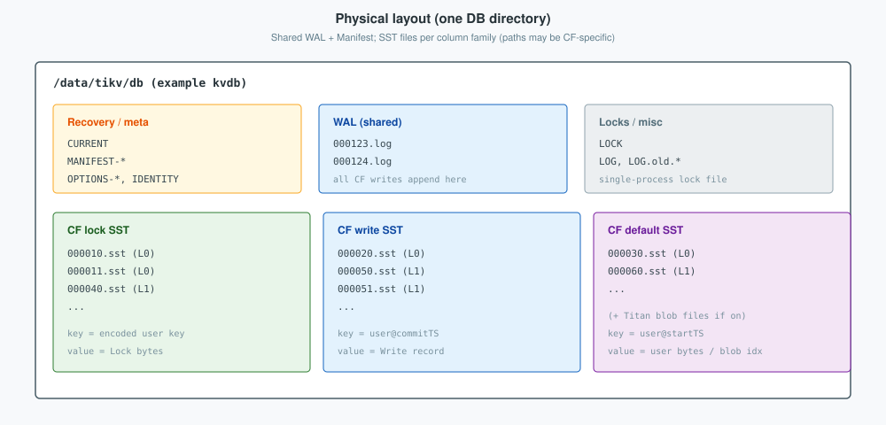
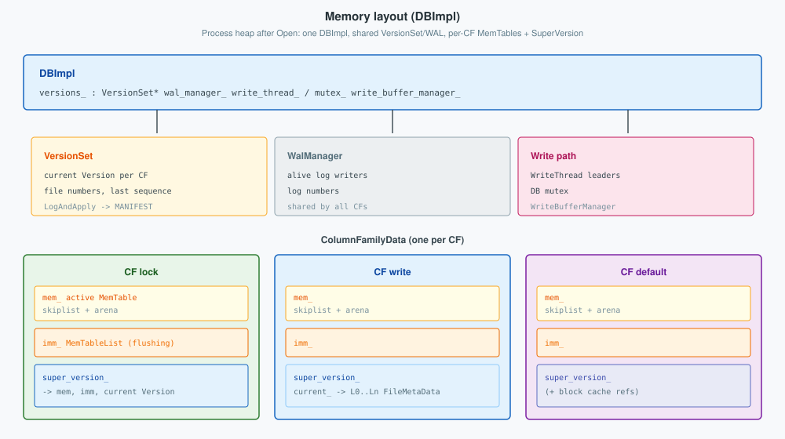
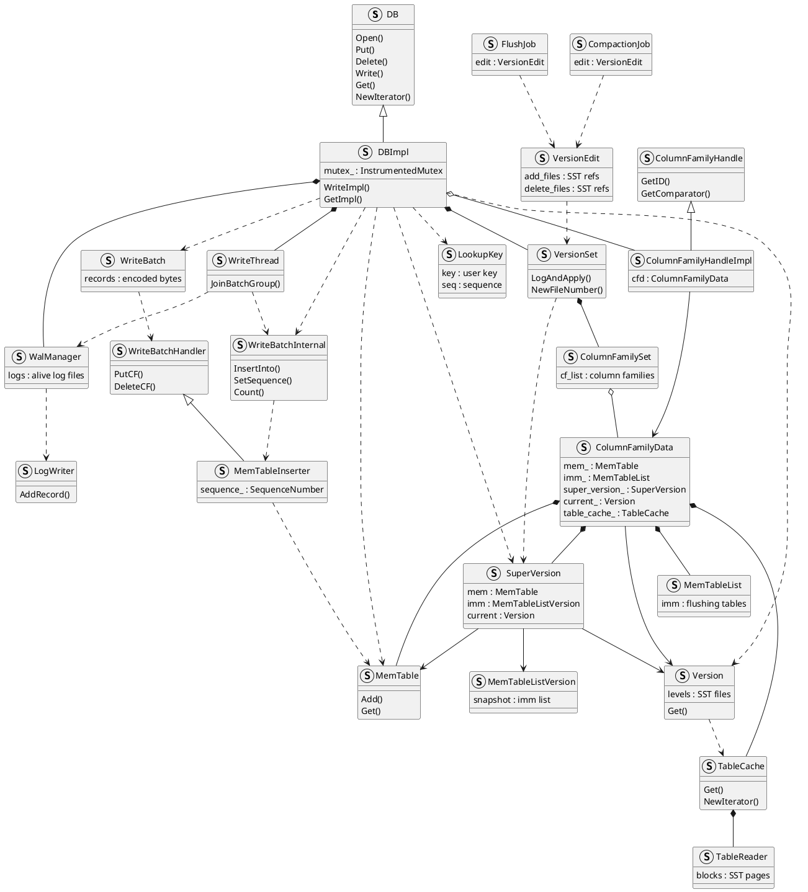
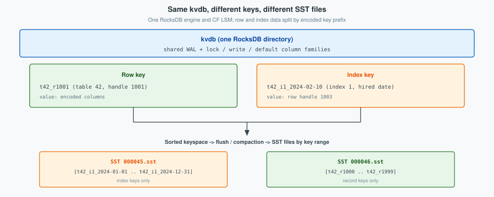
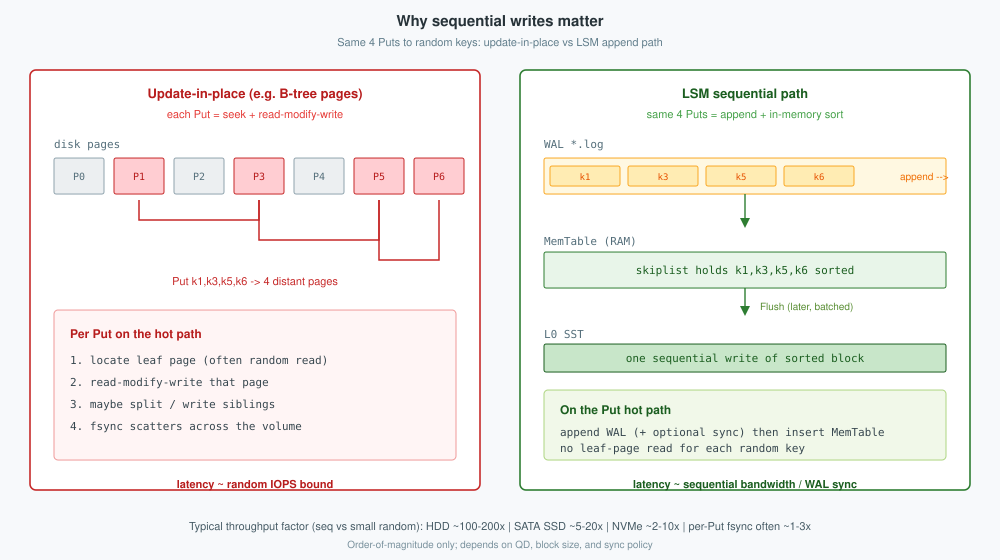
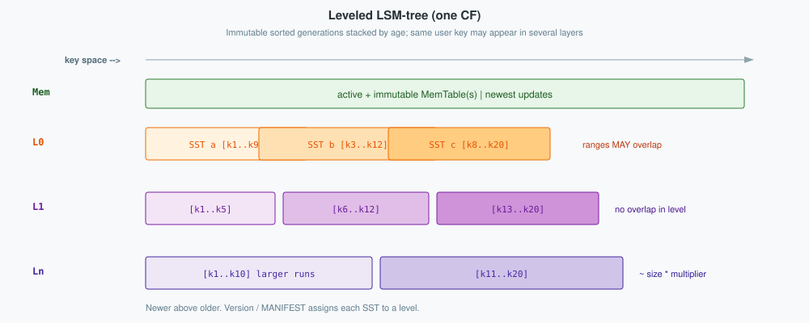
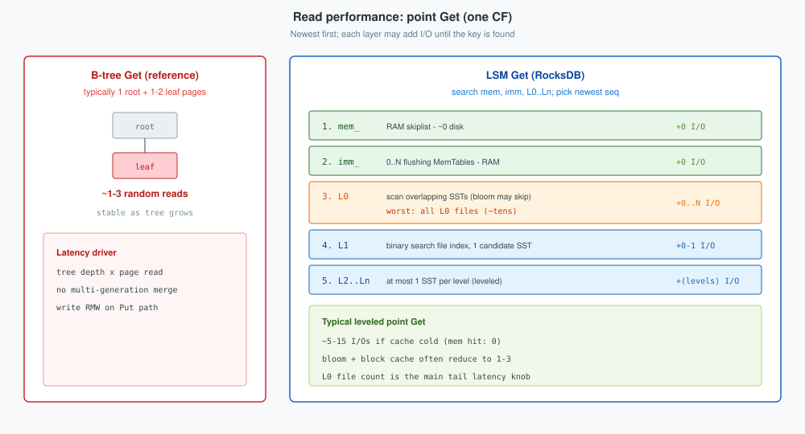
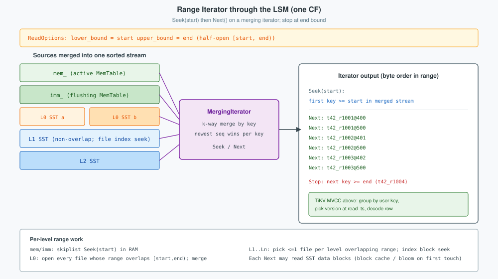

**RocksDB** is the embeddable LSM key-value engine under each TiKV store. TiKV builds **[tikv/rocksdb](https://github.com/tikv/rocksdb)** (branch `8.10.tikv`) through **rust-rocksdb**, and opens **two** DB instances—**kvdb** (MVCC column families) and **raftdb** (Raft HardState + log).
<!--more-->

Related: [TiKV: Multi-Raft storage](../tikv/).

---

## 1. Overview

RocksDB stores sorted string tables on disk and recent updates in memory. A single `DB` handle exposes `Put` / `Delete` / `Write` / `Get` / iterators over one or more **column families** (CFs). Durability comes from an append-only **WAL**; queryability comes from **MemTables** plus leveled **SST** files. Compaction merges SST levels in the background to bound read amplification.

In a TiKV store process, RocksDB is the local disk layer only. Consensus and transaction protocol sit above it ([TiKV](../tikv/)): Raft commits decide *whether* a mutation is durable and replicated; RocksDB applies the resulting byte Puts/Deletes into CF files. TiKV’s fork tracks RocksDB **8.10** with TiKV-oriented patches (Titan blob indexes, multi-batch write, flow / IO rate control, ingestion race fixes). It is **not** a continuous sync of upstream `main`; upgrades are deliberate pins.

| Piece | Role |
|-------|------|
| **`DB`** | Opened directory; owns WAL, Manifest, Version set |
| **Column family** | Independent MemTable + SST levels inside one DB |
| **WAL** | Crash-recovery log ahead of MemTable |
| **MemTable** | In-memory skiplist (active + immutable while flushing) |
| **SST / levels** | Immutable tables; L0 may overlap; L1+ typically non-overlapping |
| **Version / MANIFEST** | Which SST files are live |

TiKV’s **kvdb** uses CFs such as `default`, `lock`, `write` (and others for meta). **raftdb** holds Raft machinery per Region peer. Both are ordinary RocksDB directories with different Options and key encodings.

---

## 2. Architecture

A RocksDB `DB` is one directory on disk and one `DBImpl` in the process. **Physical layout** is what survives crash; **memory layout** is what serves reads and accepts writes until flush. Between them sits the **LSM-tree**: the organization of MemTables and SST levels that makes durable writes cheap and keeps reads correct.

### 2.1 Physical layout

Everything for one open engine lives under a single DB path (TiKV’s **kvdb** and **raftdb** are two such directories). Files fall into three roles:

| On disk | Shared? | Role |
|---------|---------|------|
| `CURRENT`, `MANIFEST-*`, `OPTIONS-*` | Yes | Point at the live Version; recover file set and options |
| `*.log` (WAL) | Yes | Durable record of every `WriteBatch` before / with MemTable insert |
| `*.sst` (and Titan blobs if enabled) | Per CF | Immutable sorted tables; levels recorded in MANIFEST |
| `LOCK`, `LOG*` | Yes | Single-process lock; informational logs |

SST filenames are global file numbers; which CF and level each belongs to is **not** encoded only in the path—MANIFEST / `Version` owns that mapping. TiKV kvdb typically keeps separate LSM trees for `lock`, `write`, and `default` (and meta CFs) inside the same directory and shared WAL.



Crash recovery reads `CURRENT` → MANIFEST → live SST set, then replays WAL into MemTables. Compaction and flush only become durable after a MANIFEST `VersionEdit` is appended and synced.

### 2.2 Memory layout

After `DB::Open`, the process holds one **`DBImpl`**. Shared pieces: **`VersionSet`** (current `Version` per CF, sequence numbers, file numbering), **`WalManager`**, write thread / DB mutex, and optional **`WriteBufferManager`**. Per column family, **`ColumnFamilyData`** owns:

- **`mem_`** — active MemTable (skiplist + arena); writers insert here  
- **`imm_`** — immutable MemTable list waiting for / undergoing flush  
- **`super_version_`** — a refcounted snapshot of `mem` + `imm` + `current` Version (SST file list), so readers can proceed without holding the DB mutex for the whole Get  
- **`current_`** — the CF’s live `Version` (levels → `FileMetaData` → SST paths)

Block / blob cache entries are separate heap objects keyed by file+offset; SuperVersion and iterators pin them while a read is in flight.



A multi-CF `WriteBatch` updates several `mem_` instances under one WAL append and one sequence assignment—hence atomicity across `lock` / `default` on a single engine.

### 2.3 Code Structure

RocksDB has no SQL parser; the public **`DB`** API (`Put`, `Delete`, `Write`, `Get`) builds or accepts a **`WriteBatch`**—a length-prefixed record stream—and **`DBImpl`** executes it. **`WriteBatchInternal::InsertInto`** walks those records with a **`MemTableInserter`** handler (one **`PutCF` / `DeleteCF`** per record). Reads pin a **`SuperVersion`** and delegate to **`MemTable::Get`**, then **`Version::Get`** via **`TableCache`**. Background **`FlushJob`** / **`CompactionJob`** publish **`VersionEdit`** through **`VersionSet::LogAndApply`**.



**Write path.** `DB::Put` wraps one key into a **`WriteBatch`** and calls **`Write`**. **`DBImpl::WriteImpl`** joins the **`WriteThread`** queue; the leader appends the batch through **`WalManager`** / **`log::Writer`**, assigns a **sequence number**, then **`WriteBatchInternal::InsertInto`** drives **`MemTableInserter`** into each CF’s **`mem_`**. A full MemTable triggers **`FlushJob`**, which emits a **`VersionEdit`** and **`VersionSet::LogAndApply`**.

**Read path.** **`DBImpl::GetImpl`** resolves **`ColumnFamilyHandleImpl::cfd`**, pins **`SuperVersion`**, builds a **`LookupKey`**, probes **`mem_`** and **`imm_`**, then **`Version::Get`**, which uses **`TableCache`** to load **`TableReader`** blocks from SST files. Iterators follow the same stack via **`DBIter`** over a merging iterator.

**Recovery.** **`DB::Open`** constructs **`DBImpl`**, loads **`VersionSet`** from MANIFEST, and **`RecoverLogFiles`** replays WAL batches through the same **`InsertInto`** path into fresh MemTables.

### 2.4 TiDB tables and indexes in kvdb

TiDB stores **rows and secondary indexes in the same kvdb** RocksDB instance—the same shared WAL and the same **`lock` / `write` / `default`** column families as any other TiKV data ([TiKV](../tikv/) §4.2). There is no separate RocksDB per table or per index.

What differs is the **encoded key**:

| Kind | Key prefix (example) | Value (typical) |
|------|------------------------|-----------------|
| **Row** | `t42_r1001` — `t` + table id + **`_r`** + handle | Encoded column data |
| **Index** | `t42_i1_2024-02-10` — `t` + table id + **`_i`** + index id + indexed columns | Row **handle** |

Because `_i` and `_r` are different byte prefixes, index keys and row keys **sort into different ranges** in the global keyspace. Flush and compaction write **immutable SST files** that each cover a contiguous key interval. An index-only range scan therefore opens SST files whose keys are mostly **`t42_i…`**; a primary-key scan opens files whose keys are mostly **`t42_r…`**. Same engine, same CF trees—**separate on-disk files** because the keys are separate.



One **`INSERT`** still writes both a record key and each index key in one Raft apply (**`WriteBatch`**), so the row and its indexes commit atomically on that Region. MVCC uses the same CF layout for both; only the user-key prefix changes.

**Reads.** PK lookup **`Get`s** `t42_r{handle}`. A query on an indexed column scans **`t42_i{index_id}_…`** (§3.2 Example B), then **`Get`s** the record key for each handle.

### 2.5 LSM-tree

An **LSM-tree** (log-structured merge-tree) stacks **immutable sorted runs** (MemTable, SST levels) instead of updating disk pages in place. The same user key may appear in several runs; a read merges them and keeps the **newest** live version by **sequence number**. The design trades cheap **sequential writes** for **read amplification** that leveling, blooms, and cache must bound.

#### Sequential writes

RocksDB targets workloads with many small random mutations (TiKV Raft apply and MVCC Puts). A classical B-tree turns each Put into **read-modify-write** of one or more pages and scattered fsync traffic. An LSM keeps the **foreground write path sequential**.

| | Update-in-place | LSM (RocksDB hot path) |
|--|-----------------|-------------------------|
| Disk pattern | Seek to each key's leaf page | **Append** to one WAL stream |
| Work per Put | Read page, modify, write page (often splits) | WAL append + MemTable insert in RAM |
| Ack latency | Bound by **random IOPS** and per-page RMW | Bound by **sequential bandwidth** and WAL sync policy |
| Sorting | Tree already ordered on disk | Order in MemTable; Flush writes one sorted SST sequentially |
| Random I/O | On the Put path | Deferred to **background compaction** (rate-limited) |

Devices deliver far higher throughput for large sequential transfers than for many tiny random writes. WAL + MemTable batching converts a random update stream into sequential appends on the critical path.

**Order-of-magnitude write throughput factor** (small random writes vs large sequential writes of similar total bytes; device-dependent):

| Media | Typical sequential advantage | What the number means |
|-------|------------------------------|------------------------|
| **HDD** | about **10²-10³x** (often ~**100-200x** for ~4 KiB random vs sequential MB/s) | Mechanical seek (~ms) vs streaming bandwidth (~100+ MB/s) |
| **SATA / consumer SSD** | about **10x** (roughly **5-20x**) | Queue/GC and many small I/Os still lose to large sequential transfers |
| **Datacenter NVMe** (QD high) | about **2-10x** | Parallel NAND narrows the gap; sequential still wins on bandwidth |
| **Single Put + `fsync` every time** | often **~1-3x** (sometimes near parity) | Durability wait dominates until batches share one sync |

The LSM write bet is strongest when many mutations share a WAL sync and Flush writes multi-MB SSTs: foreground time tracks **sequential bandwidth**, while update-in-place stays on **random IOPS x RMW**. On TiKV's typical SSD/NVMe stores, expect **several x** hot-path write throughput from the sequential shape—not HDD's hundredfold—unless sync policy collapses both designs to fsync latency.



That choice drives the rest of the LSM shape on the write side:

| Choice | Rationale |
|--------|-----------|
| **Append + merge, not update-in-place** | WAL and SST writes are mostly sequential; random I/O moves to background compaction |
| **MemTable then Flush** | Absorb bursts in memory; ack after WAL sync without rewriting a leaf page |
| **Immutable SSTs** | Readers and compactors share files without page locks |
| **L0 may overlap** | Flush finishes quickly; overlap cost is paid on read and later compaction |
| **Sequence numbers + tombstones** | Multi-version and delete without in-place rewrite; compaction reclaims space |
| **Version / MANIFEST** | Crash-safe install of flush/compaction output |

RocksDB's default is a **leveled** LSM **per column family**: MemTable(s) above SST **levels** `L0` … `Ln`.

| Layer | Overlap | Write role |
|-------|---------|------------|
| MemTable / `imm_` | N/A (sorted in memory) | Newest updates; not yet an SST |
| **L0** | Key ranges **may** overlap across files | Flush output; many small SSTs |
| **L1 … Ln** | Within a level, ranges **do not** overlap | Compacted runs; bytes grow by `max_bytes_for_level_multiplier` |



#### Read performance

Writes defer sorting and merging; a **point Get** must search **every generation** that might hold the key, newest first: `mem_` → `imm_` → L0 SSTs → one candidate file per lower level. That is **read amplification**: more disk work per lookup than a B-tree that walks a fixed tree height.

| | B-tree Get | LSM Get (leveled, cold cache) |
|--|------------|-------------------------------|
| Typical I/O | **1-3** pages (root + leaf chain) | **0** if MemTable hit; else **~5-15** block reads |
| Scales with | Tree depth (log N) | **L0 file count** + number of levels |
| Multi-version | One value per key on page | Merge by **sequence number** across runs |
| Worst case | Stable | L0 backlog: scan many overlapping SSTs |

| Layer | Search cost | Why |
|-------|-------------|-----|
| **`mem_` / `imm_`** | RAM skiplist | No disk if data still in memory |
| **L0** | Linear over overlapping files | Any L0 file *may* contain the key; bloom filter skips non-candidates |
| **L1 … Ln** | Binary search index, **at most one SST per level** | Non-overlap invariant bounds depth |
| **Block cache** | Reuse decoded 4-64 KiB blocks | Turns repeat reads into RAM hits |
| **Bloom filter** | Per-SST probabilistic skip | Avoids open/read when key absent in file |

A leveled LSM caps depth below L0: a cold Get touches roughly **O(L0 files + num_levels)** SST blocks, not the whole database. **Compaction** and flush tuning that keep L0 small are therefore read-latency tuning as much as write smoothing. TiKV MVCC adds engine snapshots on top; RocksDB itself filters by **sequence number** at each layer.



**Write vs read tradeoff.** Sequential writes buy throughput at the cost of **write amplification** (compaction rewrites data) and **read amplification** (multi-layer search). **Leveled compaction**, **bloom filters**, and **block cache** are the main levers that pull read cost back toward B-tree-like behavior while keeping the append write path. RocksDB also offers **universal** compaction for write-heavy shapes that accept higher read amp; TiKV engines typically stay on **leveled** defaults tuned per CF.

### 2.6 Version set

`VersionSet` / `Version` record which SST files belong to which level. Compaction and flush publish **`VersionEdit`**s through **`LogAndApply`**: update in-memory Version, append to MANIFEST, fsync, then install a new SuperVersion. The global DB mutex serializes much of that path; contention on `LogAndApply` is a known hotspot at large SST counts—TiKV’s operational history includes mutex-side optimizations and careful flush/compaction tuning.

---

## 3. Examples

The examples below follow one **`employees`** table from SQL through TiKV apply into **kvdb**, then a **range query**. Raft replication and full MVCC rules live in the [TiKV](../tikv/) post; SQL compile and Region locate live in [TiDB architecture](../architecture/). Here the focus is what **RocksDB** stores and how a **range scan** walks the LSM.

### 3.1 Multi-column table: writes in kvdb

**SQL schema** (`table_id = 42`; column ids: `id=1`, `dept_id=2`, `name=3`, `salary=4`, `created_date=5`; index **`idx_hired`** on `created_date` has **`index_id = 1`**):

```sql
CREATE TABLE employees (
  id           BIGINT PRIMARY KEY,
  dept_id      BIGINT NOT NULL,
  name         VARCHAR(64) NOT NULL,
  salary       INT NOT NULL,
  created_date DATE NOT NULL,
  KEY idx_hired (created_date)
);

INSERT INTO employees (id, dept_id, name, salary, created_date) VALUES
  (1001, 10, 'Ada',   120000, '2024-01-15'),
  (1002, 20, 'Grace', 110000, '2024-03-20'),
  (1003, 10, 'Lin',    95000, '2024-02-10');
```

TiDB encodes each row as a **record key** plus a **row value** (column id / value pairs). Non-primary-key columns also get **index keys** when indexed:

| Concept | Encoding (sketch) |
|---------|---------------------|
| Record key | `t` + `table_id` + `_r` + **`handle`** → **`t42_r1001`** … **`t42_r1003`** |
| Row value | `(col_id, value)*` → e.g. `(2,10),(3,'Ada'),(4,120000),(5,'2024-01-15')` for handle 1001 |
| Index key | `t` + `table_id` + `_i` + **`index_id`** + **encoded index column(s)** → e.g. **`t42_i1_{2024-01-15}`** → handle `1001` |

After **commit** at **`commitTS = 500`** (simplified), kvdb holds **record** and **index** entries (same MVCC CFs):

| User key | CF | Engine key (sketch) | Stored bytes (role) |
|----------|-----|----------------------|---------------------|
| `t42_r1001` | **`write`** / **`default`** | `…@500` / `…@400` | row `(2,10),(3,'Ada'),(4,120000),(5,'2024-01-15')` |
| `t42_i1_{2024-01-15}` | **`write`** / **`default`** | `…@500` / `…@400` | index value → handle **`1001`** |
| `t42_r1002` | **`write`** / **`default`** | … | row for Grace, `2024-03-20` |
| `t42_i1_{2024-03-20}` | **`write`** / **`default`** | … | → handle **`1002`** |
| `t42_r1003` | **`write`** / **`default`** | … | row for Lin, `2024-02-10` |
| `t42_i1_{2024-02-10}` | **`write`** / **`default`** | … | → handle **`1003`** |

Prewrite would have briefly held **`lock`** CF rows at each **`startTS`**; Commit **`Delete`s** those locks and **`Put`s** the **`write`** rows above. TiKV applies the Commit batch as one **`WriteBatch`** on **kvdb**, so all CF updates for that command succeed or fail together—RocksDB’s per-batch atomicity.

On disk inside one CF, keys sort lexicographically: `t42_r1001@400`, `t42_r1001@500`, `t42_r1002@401`, …—the LSM property that makes **range scans** efficient.

```text
TiDB INSERT … COMMIT
  → client 2PC (Prewrite / Commit) on Region leader
  → Raft replicate + apply
  → ApplyFsm WriteBatch on kvdb (per row):
       Put(write/default, t42_r1001@…, row bytes)
       Put(write/default, t42_i1_{2024-01-15}@…, →1001)
       Delete(lock CF, …)
       … (record + index keys for 1002, 1003)
  → DBImpl::WriteImpl: WAL append + mem_ insert per CF
  → later Flush → L0 SST; compaction merges levels
```

### 3.2 Range queries

Both examples use **`read_ts = 600`**. TiDB compiles a predicate into a half-open **`kv.KeyRange`**, locates Regions, and sends a **Coprocessor** scan to the leader. RocksDB sees only **sorted byte keys** in **`write`** / **`default`** CFs; MVCC and decoding sit above the engine ([TiKV](../tikv/) §4.2).

#### How a range scan walks the LSM

A range query is **not** one **`Get`** per row. TiKV opens a **`Iterator`** on a column family with **`ReadOptions::iterate_lower_bound`** = `start` and **`iterate_upper_bound`** = `end`, pins a **`SuperVersion`** (`mem_` + `imm_` + `current` Version), then:

```text
Iterator::Seek(start)     -- first key >= start in global sort order
loop Iterator::Next()       -- advance in byte order
  until !Valid() or key >= end
```

RocksDB implements that as a **MergingIterator**: it k-way merges the active **`mem_`**, each table in **`imm_`**, every **L0** SST whose key range overlaps `[start, end)`, and at most **one SST per level** on **L1…Ln** whose file range overlaps the interval. The client sees a **single sorted stream**; internally each **`Next()`** may pull the next entry from whichever source currently has the smallest key.

| LSM layer | What the range scan does on this layer |
|-----------|----------------------------------------|
| **`mem_`** | Skiplist **`Seek(start)`** in RAM; **`Next`** until past `end` |
| **`imm_`** | Same for each flushing MemTable; merged with other sources |
| **L0** | For each overlapping SST file: open iterator, **`Seek(start)`**; **all** overlapping L0 files participate (ranges may overlap) |
| **L1 … Ln** | **`Version`** metadata: find file(s) whose `[smallest,largest]` intersects `[start,end)`; usually **one file per level**; inside file, seek index block then data blocks |
| **Block cache / bloom** | First touch on an SST may read index + data **blocks**; later keys in the same scan often hit cache; bloom skips files/blocks that cannot contain the next key |

So read cost for a range is roughly: **(number of keys emitted in `[start,end)`) × (cost to merge versions across layers)** plus **sequential block reads** as the iterator walks forward—not a random **`Get`** per row from scratch, but also not “one page” like a B-tree range scan on a single tree.



On **`write`** CF, keys include **`@ commitTS`**, so the iterator may emit **several byte keys per user key** (one per MVCC version). TiKV’s scanner groups by user key, picks the version visible at **`read_ts`**, then may **`Get`** **`default`** CF for row bytes. Example A emits six engine keys for three employees; Example B’s index scan emits fewer index keys, then one record **`Get`** per match.

#### Example A — range on primary key (`id` / table handle)

**SQL:**

```sql
SELECT id, dept_id, name, salary, created_date
FROM employees
WHERE id >= 1001 AND id < 1004;
```

The planner uses a **TableScan** on **record keys** (`_r` prefix) for `table_id = 42`:

```text
start = encode_row_key(42, 1001)   -- t42_r1001
end   = encode_row_key(42, 1004)   -- t42_r1004  (exclusive)
```

```text
Coprocessor TableScan [t42_r1001, t42_r1004)
  → Iterator over record keys in range (sorted by handle)
  → per key: MVCC Get on write/default → decode row columns
  → return rows to TiDB
```

| id | dept_id | name | created_date | Record key visited |
|----|---------|------|--------------|-------------------|
| 1001 | 10 | Ada | 2024-01-15 | `t42_r1001` |
| 1002 | 20 | Grace | 2024-03-20 | `t42_r1002` |
| 1003 | 10 | Lin | 2024-02-10 | `t42_r1003` |

**LSM walk (Example A).** Coprocessor bounds **`write`** CF to `[t42_r1001, t42_r1004)`. **`Seek(t42_r1001)`** positions the merging iterator at the first key in range—possibly in **`mem_`** if recent commits are not flushed, else in an L0/L1 SST holding employee rows. Each **`Next()`** moves forward in byte order through **`t42_r1001@…`**, **`t42_r1002@…`**, **`t42_r1003@…`** (multiple timestamps per handle), stopping before **`t42_r1004`**. Keys outside the prefix (`t42_i1_…`, other tables) never enter the merge because they fall outside `[start, end)`. MVCC collapses versions → three logical rows; **`default`** CF **`Get`s** fetch column payloads.

#### Example B — range on index column (`created_date`)

**SQL:**

```sql
SELECT id, dept_id, name, salary, created_date
FROM employees
WHERE created_date >= '2024-02-01' AND created_date < '2024-03-01';
```

There is no record-key order by `created_date`. TiDB picks **`idx_hired`** (`index_id = 1`) and builds a range on **index keys** (`_i` prefix):

```text
start = encode_index_seek_key(42, 1, encode('2024-02-01'))  -- t42_i1_{2024-02-01}
end   = encode_index_seek_key(42, 1, encode('2024-03-01'))  -- t42_i1_{2024-03-01}  (exclusive)
```

Index entries sort by encoded date, then handle. Only **`2024-02-10`** (Lin) falls in `[2024-02-01, 2024-03-01)`:

| id | dept_id | name | created_date | Index key visited | Then record lookup |
|----|---------|------|--------------|-------------------|--------------------|
| 1003 | 10 | Lin | 2024-02-10 | `t42_i1_{2024-02-10}` → handle 1003 | **`Get`** `t42_r1003` for full row |

```text
Coprocessor IndexScan [t42_i1_{2024-02-01}, t42_i1_{2024-03-01})
  → Iterator on write CF with index bounds (same LSM walk as above)
  → per index key: MVCC → read index value (handle 1003)
  → IndexLookup: point Get record t42_r1003 (mem → L0 → L1… per §2.5)
  → return one row to TiDB
```

**LSM walk (Example B).** Phase 1 is the same **Seek / Next** loop, but bounds are on **`t42_i1_*`** keys. **`Seek(t42_i1_{2024-02-01})`** merges **`mem_`**, **`imm_`**, and every overlapping SST; **`Next()`** walks index keys in date order. Only **`t42_i1_{2024-02-10}`** lies in `[2024-02-01, 2024-03-01)`—Ada and Grace index keys sort outside the interval and are never emitted. Phase 2 is a **point **`Get`** on record **`t42_r1003`**: that lookup walks **`mem_` → imm_ → L0 → L1…** for a **single** key (point-read path in §2.5), not another full range scan.

**Compare A vs B**

| | Example A (PK range) | Example B (`created_date` range) |
|--|------------------------|----------------------------------|
| Key prefix | `t42_r` (record) | `t42_i1` (index `idx_hired`) |
| Planner op | TableScan | IndexScan (+ lookup to `_r` keys) |
| LSM pattern | One **range Iterator** on `write` CF | **Range Iterator** on index keys, then **point Get** per handle on `t42_r*` |
| Rows read from disk | 3 logical rows (6 MVCC keys in `write` CF sketch) | 1 index key + 1 record lookup |
| When useful | `WHERE id BETWEEN …` | `WHERE created_date BETWEEN …` without full table scan |

Uncommitted rows at `read_ts` still follow the same lock / `write` rules as in Example A.

### 3.3 Crash and recovery (same example)

If the store process dies after WAL records the Commit **`WriteBatch`** but before Flush, **`DB::Open`** replays WAL into MemTables; the three employees rows remain visible after recovery because batch atomicity replays all CF **`Put`s** together. If apply never reached kvdb (Raft not committed), neither SQL nor RocksDB shows the rows—consensus sits above the engine.
