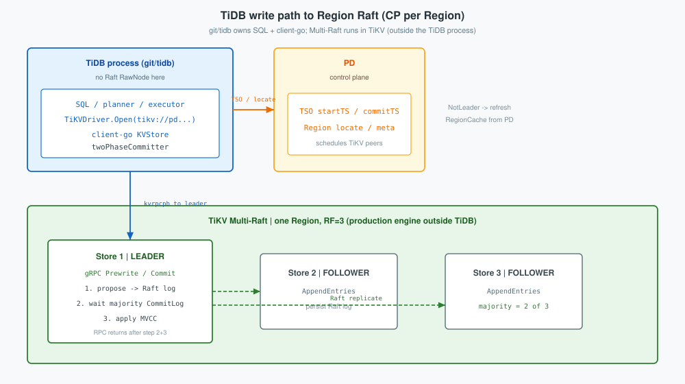
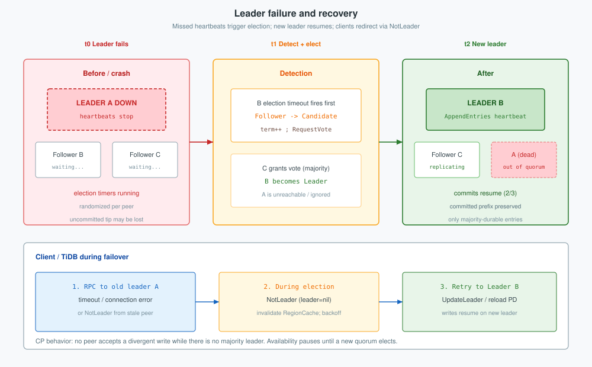

**TiKV** is the row-store data plane behind TiDB: one sorted keyspace cut into Regions, each a Raft group (`raft-rs`), with MVCC and **`primaryKey` 2PC** for cross-Region atomicity. This post covers the store stack, Region Multi-Raft (election, log, client `NotLeader`), and the 2PC client path. Cluster / PD planes are in [TiDB architecture](../architecture/); CAP theory, Raft-as-CP, and PD etcd Raft are in [CAP and Raft](../cap/).
<!--more-->

Related: [TiDB architecture: cluster and server](../architecture/), [CAP and Raft](../cap/).

Source grounding: store and raftstore layout in `git/tikv` (`raft-rs`); Region ranges in PD ([architecture §3](../architecture/)); client locate and 2PC from `github.com/tikv/client-go/v2` (via `git/tidb`).

---

## 1. Overview

Clients never open TiKV directly. The TiDB process (or any client-go store) talks to **Region leaders** for Get / Prewrite / Commit / Coprocessor. PD owns the `[startKey, endKey)` map and TSO; each Region’s replicas agree via Raft.

**What this post covers**

1. Overview — TiKV as the CP data plane  
2. Store stack — process layers and write path into Region leaders  
3. TiKV Raft — Multi-Raft per Region, election, log, `NotLeader` / `CommitLog`  
4. `primaryKey` 2PC — distributed MVCC and Prewrite/Commit  

**Facts**

| Piece | Role |
|-------|------|
| **Region** | Half-open key range; one Raft group (commonly RF=3) |
| **Leader** | Accepts client KV RPCs for that Region |
| **Store** | One TiKV process; hosts many Region peers |
| **2PC** | Cross-Region atomicity; each phase is a Raft-backed write |

Region split/merge and locate live in [architecture §3](../architecture/). CAP definitions, generic Raft majority rules, and PD’s etcd Raft live in [CAP and Raft](../cap/).

---

## 2. Store stack

TiKV is one global sorted map. PD cuts it into Regions; each Region is a Raft group on (typically) three stores. Client KV RPCs go to the **Region leader**; followers replicate. Cross-Region transactions use **`primaryKey` 2PC** (§4); each Prewrite/Commit is proposed into that Region’s Raft log (§3).



Each TiKV process hosts many Region peers (leader or follower). Keyspace partitioning and PD’s region tree are in [architecture §3](../architecture/).


**Stack (top → bottom)**

1. **gRPC** — `kvrpcpb` (Get, Prewrite, Commit, Coprocessor, …)  
2. **Scheduler / latches** — conflict control before propose  
3. **raftstore** — many Region peers (leader or follower) on this machine  
4. **Apply + MVCC** — Lock / Write / Default after Raft majority  
5. **kvdb + raftdb** — two RocksDB instances (data CFs vs Raft logs)  

| CF | Holds |
|----|--------|
| `lock` | Prewrite / pessimistic locks |
| `write` | Commit records (and small values) |
| `default` | Large values |

One RocksDB batch is atomic **on one store**. Keys on other Regions need 2PC (§4). Raft makes each Region’s replicas agree (§3). CAP’s majority rule is stated in [CAP §2.3](../cap/).

### 2.1 Key files (store)

| Path | Role |
|------|------|
| `components/raftstore/src/store/fsm/store.rs` | Store-level FSM / region routing |
| Storage / MVCC crates under `components/` | Lock / Write / Default apply |

---

## 3. TiKV Raft

TiKV runs **Multi-Raft**: each Region is an independent Raft group (commonly `N = 3` voters on three stores), implemented with Rust **`raft-rs`** inside raftstore. Protocol roles, election rules, and log pointers match [CAP §2.3](../cap/); this section is the TiKV deployment—many groups per store, client `NotLeader`, and `CommitLog` wait.

A store runs **many** independent Raft groups (one per Region peer). Failover is per Region: losing the leader of R1 does not elect a new leader for R2.


Quorum size is `majority(N) = ⌊N/2⌋ + 1`. For three voters that is two. That is CAP’s **CP** outcome for the Region ([CAP](../cap/)).

### 3.1 Leader election

The leader periodically sends `AppendEntries` (with new log entries, or empty as a **heartbeat**). Each follower keeps a randomized **election timeout**. Receiving a valid `AppendEntries` from the current leader proves the leader is still alive, so the follower **resets** that timer. Followers do not probe the leader; silence is the signal. If no valid `AppendEntries` arrives before the timeout—leader crash, long GC pause, or a partition that blocks heartbeats—the follower treats the leader as gone: it becomes a **Candidate**, increments `currentTerm`, votes for itself, and sends `RequestVote`. Majority votes ⇒ **Leader**; heartbeats resume.


`RequestVote` runs in TiKV (`raft-rs` / raftstore). The SQL client observes an election as `NotLeader` with an empty leader:

```go
// client-go: internal/locate/region_request.go  (via git/tidb go.mod)
if notLeader := regionErr.GetNotLeader(); notLeader != nil {
	if s.replicaSelector != nil {
		return s.replicaSelector.onNotLeader(bo, ctx, notLeader)
	} else if notLeader.GetLeader() == nil {
		// Raft group in election (or isolated peer) — reload from PD
		s.regionCache.InvalidateCachedRegionWithReason(ctx.Region, NoLeader)
		if err = bo.Backoff(
			retry.BoRegionScheduling,
			newBackoffErrWithRPCContext(fmt.Sprintf("not leader: %v", notLeader), ctx),
		); err != nil {
			return false, err
		}
		return false, nil
	} else {
		s.regionCache.UpdateLeader(ctx.Region, notLeader.GetLeader(), ctx.AccessIdx)
		return true, nil
	}
}
```

```go
// client-go: internal/locate/replica_selector.go
func (s *replicaSelector) onNotLeader(
	bo *retry.Backoffer, ctx *RPCContext, notLeader *errorpb.NotLeader,
) (shouldRetry bool, err error) {
	leader := notLeader.GetLeader()
	if leader == nil {
		// Transferring leader or election in progress
		err = bo.Backoff(retry.BoRegionScheduling, newBackoffErrWithRPCContext("no leader", ctx))
		return err == nil, err
	}
	leaderIdx := s.updateLeader(leader)
	// ... retry toward new leader ...
	return true, nil
}
```

### 3.2 Leader failure

Heartbeats stop; a follower times out and elects. Committed prefixes survive; an entry only on the dead leader may never have committed. Clients timeout or see `NotLeader` (`leader = nil` during election), then retry.

**RF=3 is not a tie after one failure.** Quorum is `⌊3/2⌋+1 = 2` against the **original** voter set. Two live peers: Candidate self-vote + one grant elects. A “tie” is two Candidates splitting votes (1–1–0); randomized timeouts break that. Peers for one Region sit on **three TiKV stores** (`max-replicas = 3`).



| Phase | Group | Client |
|-------|-------|--------|
| Leader down | Timers running | Timeout to old leader |
| Election | Candidate + 1 = majority of 3 | `NotLeader` / `NoLeader` + backoff |
| New leader | Commits with 2/3 | `UpdateLeader` / retry |

| Side under partition (RF=3) | Peers | Effect |
|-----------------------------|-------|--------|
| Majority (2/3) | Leader+follower, or two followers after leader death | Can elect and commit |
| Minority (1/3) | One follower | Cannot elect or commit |

Raft is on the **OLTP write path**: every durable Region write waits for majority before the RPC returns. Failover elections are uncommon; consensus itself is not optional.

### 3.3 Raft log

Each entry is `(term, index, command)`. Safety is committing only prefixes a majority has stored.


| Pointer | Meaning |
|---------|---------|
| `commitIndex` | Highest index stored on a majority |
| `lastApplied` | Applied to the local state machine (`≤ commitIndex`) |
| Match index | Per-follower agreement with the leader |

Pipeline: **propose** → **persist + replicate** → **commit** (majority) → **apply** (MVCC). client-go records the wait from TiKV write detail:

```go
// client-go: internal/client/client.go
{name: "tikv.ProposeSendWait", dur: wd.ProposeSendWaitNanos},
{name: "tikv.PersistLog", dur: wd.PersistLogNanos}, // Raft WAL on leader
{name: "tikv.CommitLog", dur: wd.CommitLogNanos},   // majority-committed
{name: "tikv.ApplyLog", dur: wd.ApplyLogNanos},
```

`CommitLog` is CAP’s **C** cost on the Region write path. Apply writes MVCC into kvdb on the store.

### 3.4 Key files (`git/tikv`)

| Location | Role |
|----------|------|
| `components/raftstore/src/store/fsm/peer.rs` | Peer FSM; election / AppendEntries / propose |
| `components/raftstore/src/store/peer_storage.rs` | Persist Raft log / hard state |
| `components/raftstore/src/store/fsm/apply.rs` | Apply committed entries |
| `raft-rs` (dependency) | Core Raft state machine |
| `client-go` `internal/locate/region_request.go` | `NotLeader` during election / redirect |
| `client-go` `internal/locate/replica_selector.go` | `onNotLeader` |
| `client-go` `internal/client/client.go` | `CommitLog` / `PersistLog` / `ApplyLog` |

PD’s separate etcd Raft (membership / meta, not Region data) is in [CAP §3](../cap/).

---

## 4. Distributed MVCC and `primaryKey` 2PC

TiKV has **no** central txn table. Each Region stores MVCC locally. For multi-key writes, the client sets one mutated key as **`primaryKey`**. That key’s Write record is the durable commit bit. **Regions are not typed primary/secondary**—only keys in **this** txn are.


| Name | Meaning | Not |
|------|---------|-----|
| **`primaryKey`** | One mutation key; Write@`commitTS` = txn committed | Not SQL `PRIMARY KEY`; not a Region class |
| **Secondary keys** | Other mutations; Lock stores `Primary = primaryKey` | Not Raft followers |
| **Lock / Write / Default** | Intent, commit record, value | — |

```text
Prewrite:  Lock[key] = { startTS, Primary: primaryKey, ... }
Decision:  Commit(primaryKey) → Write@commitTS
Others:    Commit(secondary) or resolve via Lock.Primary
```

| Property | How |
|----------|-----|
| **Atomicity** | Committed iff `primaryKey` has Write@`commitTS` |
| **Consistency (SI)** | Snapshot `startTS'`; resolve leftover Locks to the same commitTS |
| **Recovery** | Later Lock hit checks `primaryKey` and finishes Commit/Rollback |


**Flow:** Begin (TSO from PD) → choose `primaryKey` → Prewrite per Region leader (each phase Raft-committed) → Commit `primaryKey` first → Commit secondaries → cleanup/resolve.

**Single-Region example** (`orders` row `t100_r1`)

```sql
BEGIN;                                          -- startTS = 410
UPDATE orders SET amount = 21.00 WHERE id = 1; -- primaryKey = t100_r1
COMMIT;                                         -- commitTS = 420
```

| Phase | On TiKV leader |
|-------|----------------|
| Prewrite | Latch → Raft propose → apply Lock + Default @410 |
| Commit | Raft propose → Write@420; Lock cleared |

**Multi-Region example** (R1 = `t100_r1`, R2 = `t100_r2`)

```sql
BEGIN;  -- startTS = 440
UPDATE orders SET amount = amount + 1.00 WHERE id IN (1, 2);
-- primaryKey = t100_r1; secondary = t100_r2
COMMIT; -- commitTS = 450
```

| Step | Result |
|------|--------|
| Prewrite R1+R2 | Each Region Raft-commits its Lock |
| Commit `primaryKey` on R1 | OK → **txn committed** |
| Commit secondary on R2 | may fail once |
| Later op hitting `t100_r2` Lock | Check `primaryKey` → finish secondary Commit |

Raft’s C is for the **committed Region log**. 2PC’s atomicity is for the **txn** across logs. A minority Region partition blocks that Region’s Prewrite/Commit; it does not invent a second history.

In-tree **unistore** (in `git/tidb`) implements Prewrite/Commit-shaped MVCC **without** Multi-Raft—useful for lock tests, not for Raft behavior.

### 4.1 Key files (client)

| Location | Role |
|----------|------|
| `client-go` `txnkv/transaction/2pc.go` | `twoPhaseCommitter.execute` Prewrite/Commit |
| `client-go` `internal/locate/region_request.go` | `NotLeader` during election / redirect |
| `client-go` `internal/locate/replica_selector.go` | `onNotLeader` |
| `client-go` `internal/locate/region_cache.go` | `NoLeader` invalidation |
| `client-go` `internal/client/client.go` | `CommitLog` / `PersistLog` / `ApplyLog` |
| `git/tidb/pkg/store/driver/tikv_driver.go` | Opens PD-backed `KVStore` |
| `git/tidb/pkg/store/mockstore/unistore/...` | Mock store; Raft forced off |

---

## Scope

Covered: TiKV store stack; Region Multi-Raft (`raft-rs`) election, log, and client `NotLeader` / `CommitLog`; `primaryKey` 2PC and MVCC CFs. Region key ranges and split/merge: [architecture §3](../architecture/). CAP theory, Raft-as-CP, and PD etcd Raft: [CAP and Raft](../cap/). Not covered: TiFlash learner internals or a full raftstore FSM walkthrough.
