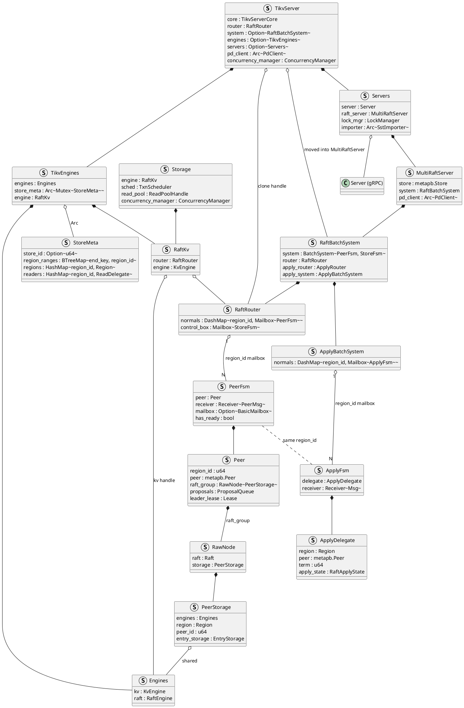
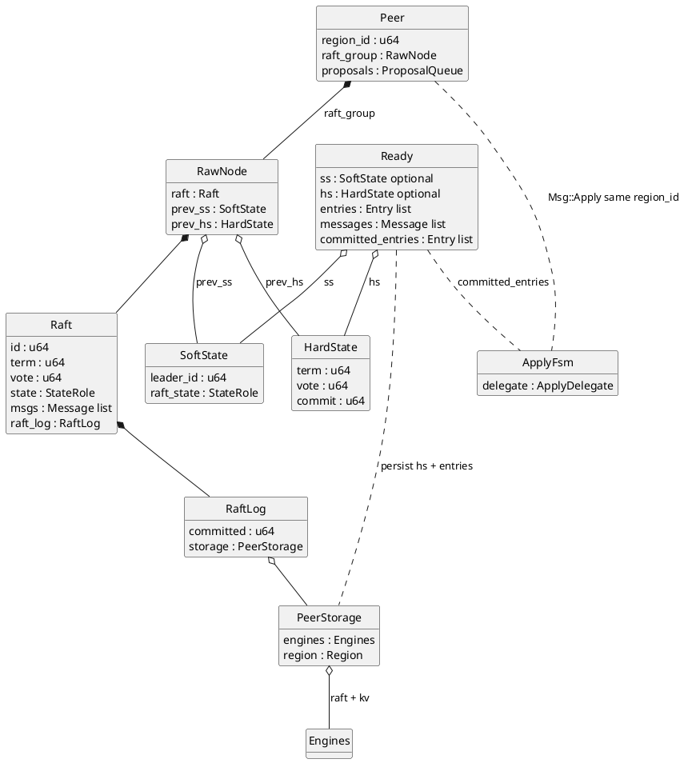
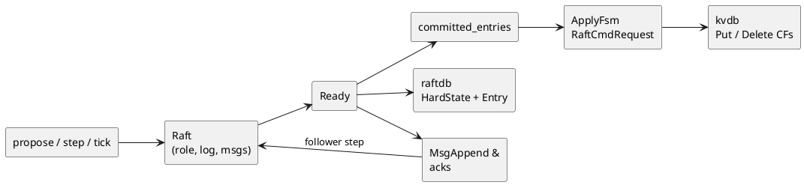

**TiKV** is the distributed row store: one sorted keyspace, many **Regions** (each a Raft group), **MVCC** in RocksDB, and Raft-backed apply for every durable write.
<!--more-->

---

## 1. Overview

TiKV is a distributed transactional key-value store. Externally it presents **one globally sorted keyspace**. Internally that map is cut into **Regions**—half-open key ranges `[startKey, endKey)`—managed by **PD** and served by **TiKV store** processes. Each Region is replicated as an independent **Raft** group (default **three peers** on three different stores). Clients (typically TiDB via client-go) send Get / Prewrite / Commit / Coprocessor RPCs to the Region’s **leader**; followers replicate Raft logs. Durable user state is **MVCC** in RocksDB (`lock` / `write` / `default`).

**Common production layouts.** A starter deployment often runs **three TiKV stores** so each Region’s default RF=3 peers can sit on different machines. Scaling for capacity or QPS adds more TiKV stores: PD spreads **more Regions** across them; it does not add extra copies of every Region unless `max-replicas` changes. On disk, a Region (and thus each peer’s data for that Region) is sized around **`region-split-size = 256 MiB`** by default (96 MiB on older releases) and splits near **`region-max-size ≈ 384 MiB`**. A production **TiKV store** data disk is commonly kept within about **1.5 TB (regular SSD) to 2–4 TB (PCIe/NVMe)**, with usage under ~80%, so peer counts stay manageable as capacity grows. If one store or AZ fails, Regions that still have a **majority (2/3)** can elect and commit; the minority side cannot.

| Piece | In TiKV |
|-------|---------|
| **Store** | One TiKV process; many Region peers |
| **Region peer** | One Raft group member for a key range |
| **Leader** | Accepts KV RPCs; proposes to the Raft log |
| **kvdb / raftdb** | User MVCC vs Raft HardState + log |


Top → bottom inside one store:

1. **gRPC** — Get, Prewrite, Commit, Coprocessor, …  
2. **Scheduler / latches** — per-key conflict control before propose  
3. **raftstore** — FSM per peer; Multi-Raft on this machine  
4. **Apply** — committed entries → MVCC mutations  
5. **kvdb + raftdb** — two RocksDB instances  

| Engine | Holds |
|--------|-------|
| **raftdb** | Raft HardState and Raft log per peer (consensus machinery) |
| **kvdb** | User MVCC (`lock`, `write`, `default` CFs) after apply |

Client KV RPCs target the **Region leader**. Followers receive Raft messages from other TiKV stores. PD heartbeats carry store/Region meta; they do not carry row values.

### Process structure

TiKV is one OS process. Its in-memory layout is a **composition of structs**: ownership (`struct` fields) plus shared handles (`Arc` / `Clone` engine wrappers).


- **TikvServer** — process root: wires gRPC, engines, PD client, and the Multi-Raft system.
- **Server (gRPC)** — accepts client KV RPCs (Get, Prewrite, Commit, Coprocessor, …) and peer Raft messages from other TiKV stores.
- **Storage** / **TxnScheduler** — turns an RPC into transactional work: latches for key conflicts, prepare read or write batch, then hand off to the engine.
- **RaftKv** — Storage’s engine facade: **writes** go to `RaftRouter` as proposals; **local reads** can use the kv engine / snapshot path.
- **Engines** — shared disk handles: `kv` (user MVCC) and `raft` (HardState + Raft log).
- **StoreMeta** — in-memory Region map and key-range index for this store (which `region_id` owns which keys).
- **MultiRaftServer** / **RaftBatchSystem** — runs peer and apply pollers; owns the routers that deliver messages to FSMs.
- **RaftRouter** — `region_id` → mailbox of a **PeerFsm**; entry point for propose and Raft `step`.
- **PeerFsm** / **Peer** — one local replica of one Region: proposals, lease, and the Raft group.
- **RawNode** — raft-rs facade (`raft: Raft` is the consensus state machine); opaque `Entry.data` until apply.
- **PeerStorage** — implements raft Storage: persist / load HardState and log entries via `Engines.raft`.
- **ApplyFsm** / **ApplyDelegate** — same `region_id`; applies committed entries into `Engines.kv` (MVCC Puts/Deletes).



**How an RPC enters.** Client (TiDB) opens gRPC to this store’s **Server**. The handler builds a `Storage` command (e.g. Prewrite or Get). `TxnScheduler` runs it under latches. The command uses **RaftKv**, which already knows the target `region_id` from the request context (filled earlier by Region cache / PD locate on the client).

**How a write becomes durable.** On the Region **leader**, `RaftKv` asks `RaftRouter` to deliver a `RaftCmdRequest` to that Region’s **Peer**. After `propose`, the path is the Ready loop—not an immediate kvdb write:

1. **Propose** — the Peer serializes the command into opaque bytes and calls `RawNode::propose`, which appends a log **Entry** in memory inside `Raft` / `RaftLog`.
2. **Ready (local persist)** — `has_ready()` yields a **Ready**: new log entries (and often HardState) must be written to **raftdb** first.
3. **Replicate** — the same Ready carries outbound **`MsgAppend`** messages; the leader sends them to followers. Each follower `step`s, persists its own raftdb copy, and acks.
4. **Commit** — when a **majority** has that entry durable, raft-rs advances `committed`; the next Ready exposes it in `committed_entries`.
5. **Apply** — the Peer hands those entries to **ApplyFsm**, which decodes `Entry.data` and writes MVCC into **kvdb**.
6. **RPC success** — only after apply does the client write RPC return. Followers apply the same committed entries on their ApplyFsm; they never accept the client write (`NotLeader`).

```text
gRPC write (Prewrite / Commit / …)
  → Storage / TxnScheduler (latch, build Modify batch)
  → RaftKv → RaftRouter → PeerFsm / Peer
  → RawNode.propose          (in-memory Entry)
  → Ready: persist entries → raftdb
  → Ready: send MsgAppend → followers (they persist + ack)
  → majority → committed_entries
  → ApplyFsm → kvdb MVCC
  → RPC response
```

**How a query (read) works.** Point Gets and snapshot reads still enter via gRPC → **Storage**. If the peer is leader and the lease is valid, RaftKv / local reader can serve from a snapshot of **kvdb** without proposing a new log entry (stale or follower reads use other rules: read index or replica read). Coprocessor scans are leader-side reads over the same MVCC. Reads do not change raftdb; they observe state already applied to kvdb.

```text
gRPC read (Get / Coprocessor / …)
  → Storage (snapshot / read pool)
  → RaftKv / local reader → kvdb (MVCC)
  → RPC response
```

**How Raft between stores works.** Another TiKV’s Raft messages (vote, append, heartbeat) hit gRPC as Raft traffic, not as KV commands. The store routes them by `region_id` into the matching **PeerFsm**, which calls `RawNode::step`. Ready then updates **raftdb** and may send more messages or hand committed entries to **ApplyFsm**—the same Ready/apply machinery as a local propose, without going through `Storage`.

```text
peer Raft RPC (MsgAppend / MsgRequestVote / …)
  → RaftRouter → PeerFsm
  → RawNode.step → Ready → raftdb / outbound Messages
  → committed entries → ApplyFsm → kvdb
```

Many Region peers share one `Engines` pair; each peer has its own `RawNode` and apply delegate. Peer Raft is §2; write preparation, MVCC, and 2PC are §3.

## 2. Multi-Raft

**Multi-Raft** means TiKV runs **many Raft groups**, not one: **PD** splits the keyspace into Regions; **each Region is one Raft group** (default three peers on three stores). A **TiKV store** hosts **many peers**—one local replica for each Region PD placed on that machine. The same store can be leader for some Regions and follower for others; leadership is per Region.


Peers share one process (`TikvServer`: gRPC, `MultiRaftServer`, `Engines`) so TiKV need not open a RocksDB per Region. Consensus stays independent: R1’s election and log progress do not block R2. `RaftRouter` routes work by `region_id` to each `PeerFsm`. Clients send KV RPCs only to that Region’s **leader**.

### 2.1 Peer Raft protocol (RawNode → kvdb)

Each Region **Peer** owns one raft-rs **`RawNode`** (`Peer.raft_group: RawNode<PeerStorage>`). This subsection is the full protocol path on one peer: inputs into the node, **Ready** handling, **raftdb** durability and replication, then **ApplyFsm** writing user state into **kvdb**. Election (who is leader) is §2.2; how applied bytes become MVCC / 2PC is §3.

**`RawNode.raft`: the consensus engine.** `RawNode` is a thin facade around **`raft: Raft`**. `Raft` holds peer `id`, `term` / `vote`, `StateRole`, timers, outbound `msgs`, follower progress, and `RaftLog` (committed index + `PeerStorage`). `tick` / `step` / `propose` mostly forward into that field; `RawNode` then diffs SoftState / HardState to emit a **`Ready`** for the store.





#### Three Raft inputs: `tick`, `step`, `propose`

Everything that moves a peer’s consensus state enters `RawNode` through one of three calls. All three eventually drive **`Raft::step`** (tick synthesizes local messages; propose wraps a `MsgPropose`). TiKV’s Peer poller invokes them; afterward the same **Ready** path runs.

| Call | Who invokes it (TiKV) | Function |
|------|------------------------|----------|
| **`tick`** | Peer base-tick timer (`on_raft_base_tick` → `raft_group.tick`) | Advance Raft’s logical clock: election timeout or heartbeat |
| **`step`** | Peer Raft RPC handler (`Peer::step`) | Apply one inbound `Message` (append, vote, heartbeat, …) |
| **`propose`** | Leader write path (`Peer::propose` → `raft_group.propose`) | Append opaque client bytes as a new log `Entry` |

##### `tick` — timers

**Function.** Raft has no wall-clock inside the library; the store must call `tick` periodically. On a **Follower / Candidate**, enough ticks without a valid leader message start an election (`MsgHup`). On a **Leader**, ticks send heartbeats (`MsgBeat`) and optionally check quorum.

**Implementation.** `RawNode::tick` forwards to `Raft::tick`, which branches on role:

```rust
// RawNode
pub fn tick(&mut self) -> bool {
    self.raft.tick()
}

// Raft
pub fn tick(&mut self) -> bool {
    match self.state {
        StateRole::Follower | StateRole::PreCandidate | StateRole::Candidate => {
            self.tick_election()
        }
        StateRole::Leader => self.tick_heartbeat(),
    }
}
```

```rust
// Follower / Candidate: election timeout → campaign
pub fn tick_election(&mut self) -> bool {
    self.election_elapsed += 1;
    if !self.pass_election_timeout() || !self.promotable {
        return false;
    }
    self.election_elapsed = 0;
    let m = new_message(INVALID_ID, MessageType::MsgHup, Some(self.id));
    let _ = self.step(m);   // becomes Candidate, sends MsgRequestVote
    true
}

// Leader: heartbeat timeout → bcast heartbeat
fn tick_heartbeat(&mut self) -> bool {
    self.heartbeat_elapsed += 1;
    // …
    if self.heartbeat_elapsed >= self.heartbeat_timeout {
        self.heartbeat_elapsed = 0;
        let m = new_message(INVALID_ID, MessageType::MsgBeat, Some(self.id));
        let _ = self.step(m);   // step_leader → bcast_heartbeat
    }
    // …
}
```

TiKV schedules a per-peer Raft tick; when it fires, `has_ready` may become true so heartbeats or vote messages leave via Ready.

##### `step` — network (and local) messages

**Function.** `step` is the general state-machine transition: given one `Message`, update term/role/log and queue outbound replies. Followers use it for `MsgAppend` / `MsgHeartbeat` / votes; leaders use it for append responses and for local messages produced by tick (`MsgBeat`, `MsgHup`).

**Implementation.** `RawNode::step` rejects unexpected local message types from the network, then calls `Raft::step`:

```rust
// Peer — after gRPC delivers a Raft Message for this region_id
self.raft_group.step(m)?;

// RawNode::step
pub fn step(&mut self, m: Message) -> Result<()> {
    if is_local_msg(m.get_msg_type()) {
        return Err(Error::StepLocalMsg);
    }
    // …
    self.raft.step(m)
}
```

Inside `Raft::step`:

1. **Term handling** — if `m.term > self.term`, become follower (except pre-vote quirks); if `m.term < self.term`, reject or reply so the sender advances.
2. **Role dispatch** — `step_leader` / `step_candidate` / `step_follower` on `m.msg_type` (e.g. follower on `MsgAppend` appends to `RaftLog` and resets `election_elapsed`; leader on `MsgAppendResponse` updates progress and may advance `committed`).

Local messages that tick injects are stepped **directly** on `Raft` (not via `RawNode::step`), so `MsgHup` / `MsgBeat` are not blocked as `StepLocalMsg`.

##### `propose` — client log entries

**Function.** Only the **leader** should accept client writes. `propose` asks Raft to append opaque bytes (`RaftCmdRequest`) as a new log entry and replicate them. Followers that receive `MsgPropose` forward or drop; they do not append as leader.

**Implementation.** `RawNode::propose` builds a local `MsgPropose` and steps it; there is no separate propose engine:

```rust
// Peer::propose_normal — after req.write_to_bytes()
self.raft_group.propose(ctx.to_vec(), data)?;

// RawNode::propose
pub fn propose(&mut self, context: impl Into<Bytes>, data: impl Into<Bytes>) -> Result<()> {
    let mut m = Message::default();
    m.set_msg_type(MessageType::MsgPropose);
    m.from = self.raft.id;
    let mut e = Entry::default();
    e.data = data.into();       // RaftCmdRequest bytes
    e.context = context.into();
    m.set_entries(vec![e].into());
    self.raft.step(m)           // → step_leader MsgPropose → append + bcast MsgAppend
}
```

On the leader, `step_leader` for `MsgPropose` assigns term/index, appends to `RaftLog`, and queues `MsgAppend` for followers. `Entry.data` stays opaque inside raft-rs: no CF names, no MVCC decode.

```text
tick  → (MsgHup | MsgBeat) → Raft::step → maybe Ready (votes / heartbeats)
step  → Message from peer  → Raft::step → maybe Ready (log / HardState / msgs)
propose → MsgPropose       → Raft::step → Ready (entries + MsgAppend)
         └──────── all three share the Ready → raftdb / apply path below
```

#### `Message` structure (and `term`)

Peer-to-peer Raft RPCs and many local events are one protobuf **`Message`**. Ready’s outbound `messages` and `Peer::step` inputs are this type.

```protobuf
message Message {
  MessageType msg_type = 1;
  uint64 to = 2;
  uint64 from = 3;
  uint64 term = 4;       // sender's current Raft term (see below)
  uint64 log_term = 5;   // term of the log entry at `index` (matching)
  uint64 index = 6;      // log index this message refers to
  repeated Entry entries = 7;
  uint64 commit = 8;     // leader's committed index (Append / Heartbeat)
  bool reject = 10;
  // … snapshot, reject_hint, context, priority, …
}

message Entry {
  EntryType entry_type = 1;
  uint64 term = 2;       // term when this log entry was created
  uint64 index = 3;
  bytes data = 4;        // opaque (RaftCmdRequest in TiKV)
}
```

| Field | Role |
|-------|------|
| `msg_type` | What kind of RPC / local event (`MsgAppend`, `MsgRequestVote`, `MsgHeartbeat`, …) |
| `from` / `to` | Peer ids in the Region’s Raft group |
| **`term`** | **The sender’s current election term** when the message is sent (or `0` for some local messages) |
| `log_term` + `index` | Log matching: “the entry at `index` has term `log_term`” (Append / vote / reject hint) |
| `entries` | New log entries (Append / Propose) |
| `commit` | Leader’s commit index so followers can advance |

**`Message.term` vs other “term” fields.** Raft’s logical clock is a monotonically increasing **term** stored in HardState and in `Raft.term`. Do not confuse:

| Name | Meaning |
|------|---------|
| **`Message.term`** | Current term of the **sender’s Raft instance** (who claims leadership / candidacy now) |
| **`Entry.term`** | Term in which **that log entry** was proposed (fixed once appended) |
| **`Message.log_term`** | Term of the log entry at **`Message.index`** (prev-log matching on Append; last-log info on Vote) |
| **`HardState.term`** | This peer’s persisted current term |

When raft-rs **sends** a network message, it normally stamps `m.term = self.term` (except `MsgPropose` / `MsgReadIndex`, which stay local-style with term `0` until forwarded). Receivers use **`Message.term` first** in `Raft::step`:

```rust
// Raft::step — term gate before role-specific handling
if m.term > self.term {
    // higher term wins: step down (become_follower), then process
    if m.get_msg_type() == MsgAppend || MsgHeartbeat || MsgSnapshot {
        self.become_follower(m.term, m.from);  // recognize sender as leader
    } else {
        self.become_follower(m.term, INVALID_ID);
    }
} else if m.term < self.term {
    // stale leader / candidate: ignore or reply with newer term
    // (e.g. reject Append/Heartbeat so they learn the higher term)
}
// then step_leader / step_candidate / step_follower(m)
```

So **`Message.term` enforces a single timeline**: a leader from an old term cannot overwrite a peer that has already moved on; a candidate with a higher term forces everyone else to follow. **`Entry.term` / `log_term`** enforce **log consistency** (same index must carry the same entry term), which is separate from “who is the current leader.”

#### Ready: what the store must do

After propose / step / tick, if `has_ready()`, the Peer takes a **Ready** and must handle it before further mutating the node:

```rust
if !self.raft_group.has_ready() { return None; }
let mut ready = self.raft_group.ready();

if !ready.messages().is_empty() {
    let raft_msgs = self.build_raft_messages(ctx, ready.take_messages());
    self.send_raft_messages(ctx, raft_msgs);   // MsgAppend, votes, …
}
if !ready.committed_entries().is_empty() {
    self.handle_raft_committed_entries(ctx, ready.take_committed_entries());
}
// PeerStorage::handle_raft_ready → WriteTask → raftdb
self.mut_store().handle_raft_ready(&mut ready, destroy_regions)?;
```

| Ready field | Meaning | Peer action |
|-------------|---------|-------------|
| `entries` | New log to append | Persist to **raftdb** |
| `hs` | HardState (`term`, `vote`, `commit`) | Persist to **raftdb** |
| `messages` | Outbound Raft RPC | Send to other TiKV peers |
| `committed_entries` | Majority-committed log | Schedule **ApplyFsm** |

#### Persist: log and HardState → raftdb

`PeerStorage` folds Ready into a write task; the async write worker appends to the shared **raft** engine:

```rust
// PeerStorage::handle_raft_ready
if !ready.entries().is_empty() {
    self.append(ready.take_entries(), &mut write_task);  // EntryStorage cache + task
}
if let Some(hs) = ready.hs() {
    self.raft_state_mut().set_hard_state(hs.clone());
}
if prev_raft_state != *self.raft_state() || !ready.snapshot().is_empty() {
    write_task.raft_state = Some(self.raft_state().clone());
}
```

Until this (and follower acks for a majority) succeeds, the entry is not **committed**. User **kvdb** is still unchanged.

#### Replicate then commit

Ready `messages` carry **`MsgAppend`** (and heartbeats / votes). Followers `step`, run the same Ready persist path on their raftdb, and respond. When a majority has the entry, `RaftLog.committed` advances; a later Ready exposes those entries as `committed_entries`.

#### Apply: committed `Entry.data` → kvdb

The Peer schedules an apply task on the same `region_id`. **ApplyDelegate** parses bytes as `RaftCmdRequest` and writes the KV engine batch:

```rust
// Peer — notify ApplyFsm
ctx.apply_router.schedule_task(
    self.region_id,
    ApplyTask::apply(Apply::new(/* … committed_entries … */)),
);
```

```rust
// ApplyDelegate — per committed Entry
let data = entry.get_data();
let cmd = util::parse_raft_cmd_request(data, index, term, &self.tag);
// …
for req in requests {
    match req.get_cmd_type() {
        CmdType::Put => self.handle_put(ctx, req),      // kv_wb.put_cf(…)
        CmdType::Delete => self.handle_delete(ctx, req),
        // …
    }
}
// ApplyContext::commit → kv_wb.write → Engines.kv
```

`handle_put` checks the key is in the Region, prefixes the data key, and puts into the requested CF (`lock` / `write` / `default`). Flushing the write batch is when **user** state becomes durable on this store. The leader’s client RPC completes only after this apply path (proposal callback), not after propose alone.

```text
propose / step
  → Raft updates role, RaftLog, msgs
  → Ready
       ├─ entries + HardState → PeerStorage → raftdb
       ├─ messages → other peers (followers: step → their raftdb)
       └─ committed_entries → ApplyFsm
            → parse RaftCmdRequest
            → Put/Delete on kvdb CFs
  → (leader) RPC callback
```

**Where bytes land.**

| Bytes | Engine / path |
|-------|----------------|
| HardState + log `Entry` | **raftdb** (`Engines.raft`) |
| Outbound `Message` | Network only |
| Applied `Put` / `Delete` | **kvdb** (`Engines.kv`, MVCC CFs) |

Followers never accept the client write (`NotLeader`); they still apply the same committed entries so their kvdb matches the leader’s applied log.

### 2.2 Peer election

Who becomes **Leader** is decided inside the Ready loop above. Silence is the signal: if a follower’s **election timeout** fires without a valid leader message, raft-rs campaigns.

| State | Behavior |
|-------|----------|
| **Follower** | Accepts heartbeats / appends; resets election timer |
| **Candidate** | Increments term, votes for self, asks peers for votes |
| **Leader** | Sends heartbeats; only this peer accepts client writes for the Region |

| Message | Purpose |
|---------|---------|
| `MsgRequestVote` / `MsgRequestVoteResponse` | Election |
| `MsgRequestPreVote` / `MsgRequestPreVoteResponse` | Optional pre-vote before bumping term |
| `MsgHeartbeat` / `MsgHeartbeatResponse` | Leader liveness; followers reset the election timer |

```rust
election_elapsed += 1;
if !pass_election_timeout() || !promotable {
    return false;
}
election_elapsed = 0;
step(Message { msg_type: MsgHup, .. });
```

`MsgHup` drives `campaign` → `become_candidate` (term + 1, vote for self) and broadcast of `MsgRequestVote` with last log index/term so voters can reject a stale candidate:

```rust
fn become_candidate(&mut self) {
    let term = self.term + 1;
    self.reset(term);
    self.vote = self.id;
    self.state = StateRole::Candidate;
}
```

A peer grants **at most one vote per term**, and only if the candidate’s log is at least as up-to-date. Majority votes (2 of 3 at RF=3) ⇒ Leader. The new `HardState` (term/vote) is what Ready persists to **raftdb**—not to kvdb. TiKV then reacts to the SoftState change (lease, in-memory locks, …). Non-leaders reject client writes with **`NotLeader`**.


```text
no heartbeat within election timeout
  → Follower: MsgHup → Candidate (term++)
  → MsgRequestVote to other peers
  → majority MsgRequestVoteResponse(granted)
  → Leader; Ready persists HardState to raftdb; heartbeats begin
```

On restart, the peer reloads HardState from raftdb so it resumes the same term/vote and does not double-vote.

---

## 3. Writes: MVCC and 2PC

§2 makes an opaque `Entry.data` durable and applied. This section is what those bytes **mean** on TiKV’s write path: how a client mutation is prepared, how **MVCC** is laid out in kvdb, and how **Percolator 2PC** (Prewrite / Commit) uses that layout. The coordinator is the client (TiDB / client-go); each TiKV Region leader only runs local latch + propose + apply.

### 3.1 Write path implementation

A durable user write always ends as one or more CF Puts/Deletes applied through Raft on the Region **leader**. Layers above the peer:

```text
gRPC (Prewrite / Commit / Rollback / …)
  → Storage + TxnScheduler   (latches; conflict / lock checks; build Modify batch)
  → RaftKv                   (engine facade)
  → RaftRouter → Peer        (serialize RaftCmdRequest → propose)   [§2.1]
  → Ready → raftdb + replicate → commit
  → ApplyFsm                 (decode Entry.data → kv_wb Put/Delete)
  → Engines.kv (MVCC CFs)
  → RPC callback
```

| Layer | Role on the write path |
|-------|-------------------------|
| **TxnScheduler** | Per-key latches; run the command (Prewrite/Commit/…) against a snapshot; produce `Modify`s |
| **RaftKv** | Turn the batch into a proposal on the right `region_id`, or serve local reads |
| **Peer / RawNode** | Consensus durability for the serialized `RaftCmdRequest` (§2.1) |
| **ApplyDelegate** | Decode applied entries into CF mutations on **kvdb** |

```rust
// Modify::Put → one RaftCmdRequest Request (CF + key + value)
Modify::Put(cf, k, v) => {
    let mut put = PutRequest::default();
    put.set_key(k.into_encoded());
    put.set_value(v);
    if cf != CF_DEFAULT {
        put.set_cf(cf.to_string());
    }
    req.set_cmd_type(CmdType::Put);
    req.set_put(put);
}
```

```rust
let reqs: Vec<Request> = batch.modifies.into_iter().map(Into::into).collect();
let mut cmd = RaftCmdRequest::default();
cmd.set_header(header);       // region_id, epoch, peer, …
cmd.set_requests(reqs.into());
// → peer.propose(cmd.write_to_bytes())
```

After majority commit, apply is ordinary CF I/O—not a second transaction protocol inside raftstore:

```rust
let cmd = parse_raft_cmd_request(entry.get_data());
process_raft_cmd(apply_ctx, index, term, cmd);
// CmdType::Put → handle_put → kv_wb.put_cf(cf, key, value)
```

Reads (Get / Coprocessor) use the same MVCC in **kvdb**; they do not propose unless the read protocol requires it (e.g. read index). Coprocessor does not bypass Raft for writes.

### 3.2 MVCC column families

User state is multi-versioned in **kvdb**. Intents and commits share that engine:

| CF | Contents |
|----|----------|
| `lock` | Prewrite / pessimistic **intent** (who holds the key, `startTS`, primary, …) |
| `write` | **Commit** records at `commitTS` (and short values inline) |
| `default` | Large values keyed by `startTS` when not inlined in `write` |


**Read rule (sketch).** A snapshot read at `ts` looks for the latest `write` record with `commitTS ≤ ts` (and no conflicting lock that must be resolved). **Write rule.** A Prewrite installs a `lock` (and maybe `default`); a Commit installs `write` and deletes `lock`.

One RocksDB apply batch is atomic **on one store for one Region**. Keys in other Regions are other Raft groups; cross-Region atomicity is the client’s 2PC over these CFs (§3.4)—not a multi-Region transaction inside one apply.

### 3.3 Write payload: `RaftCmdRequest` on MVCC CFs

Transactional RPCs become ordinary CF mutations **before** propose. Raft has no `Prewrite` message type—only `Entry.data = RaftCmdRequest` with `Put` / `Delete` on CFs.

Logical shape after a Prewrite that takes a lock:

```text
Entry {
  term, index,
  data: RaftCmdRequest {
    header: { region_id, peer, region_epoch, … },
    requests: [
      Put { cf: "lock", key: <user key>, value: <Lock { startTS, primary, … }> },
      // optional: Put { cf: "default", key: <user key>@startTS, value: <blob> }
    ]
  }
}
```

A later **Commit** is another entry—typically `Put` on `write` at `commitTS` plus `Delete` on `lock`:

```text
requests: [
  Put    { cf: "write", key: <user key>@commitTS, value: <Write { startTS, … }> },
  Delete { cf: "lock",  key: <user key> }
]
```

```rust
let mut cmd = Request::default();
cmd.set_cmd_type(CmdType::Put);
cmd.mut_put().set_cf("lock".into());
cmd.mut_put().set_key(key);
cmd.mut_put().set_value(lock_bytes);
let mut req = RaftCmdRequest::default();
req.mut_requests().push(cmd);
entry.set_data(req.write_to_bytes()?.into());
```

| Pointer (peer) | Meaning |
|----------------|---------|
| `commitIndex` | Highest Raft index majority-replicated (raftdb / HardState) |
| `lastApplied` | Highest index applied into MVCC / kvdb (`≤ commitIndex`) |


### 3.4 2PC: Prewrite and Commit

TiKV implements **Percolator-style 2PC** as two (or more) Region writes. The **client** chooses a primary key, obtains `startTS` / `commitTS` from PD TSO, and issues RPCs to each involved Region **leader**. TiKV does not run a cross-Region coordinator inside `MultiRaftServer`.

| Phase | Client | Typical apply on each Region leader |
|-------|--------|-------------------------------------|
| **Prewrite** | Lock all keys in the txn (primary first) | Write `lock` CF (+ `default` for large values) at `startTS` |
| **Commit** | Commit primary, then secondaries | Write `write` CF at `commitTS`; delete `lock` |
| **Rollback / ResolveLock** | Abort or recover | Clear or finish leftover locks |

```text
Prewrite key:  Lock[key] = { startTS, primary, … }
Commit key:    Write[key]@commitTS; delete Lock[key]
```


**Single-Region txn.** Prewrite then Commit are two Raft-committed applies on that Region’s leader—two entries, two MVCC updates, same propose/apply path as §3.1.

**Multi-Region txn.** Each Region’s leader runs Prewrite/Commit independently on its key range. Whole-txn atomicity is: **committed iff the primary key’s `write` record exists**. Secondaries and readers that see a lock **resolve** by reading the primary’s MVCC state on its Region (commit, rollback, or wait). That primary-key rule—not a distributed prepare across stores inside TiKV—is the 2PC commit bit.

```text
client (TiDB / client-go)
  ├─ Prewrite(primary) → Region P leader → Raft → lock CF
  ├─ Prewrite(secondaries) → Region S_i leaders → Raft → lock CF
  ├─ Commit(primary) → Region P → Raft → write CF; clear lock
  └─ Commit(secondaries) → Region S_i → Raft → write CF; clear lock
       (async / retry ok: primary Write is the source of truth)
```

Failure modes stay local to the protocol: Prewrite conflict → lock or latch error to the client; majority loss on a Region → that Region cannot commit its phase (`NotLeader` / timeout); undetermined primary → lock resolution polls the primary Region until `write` or rollback appears.
