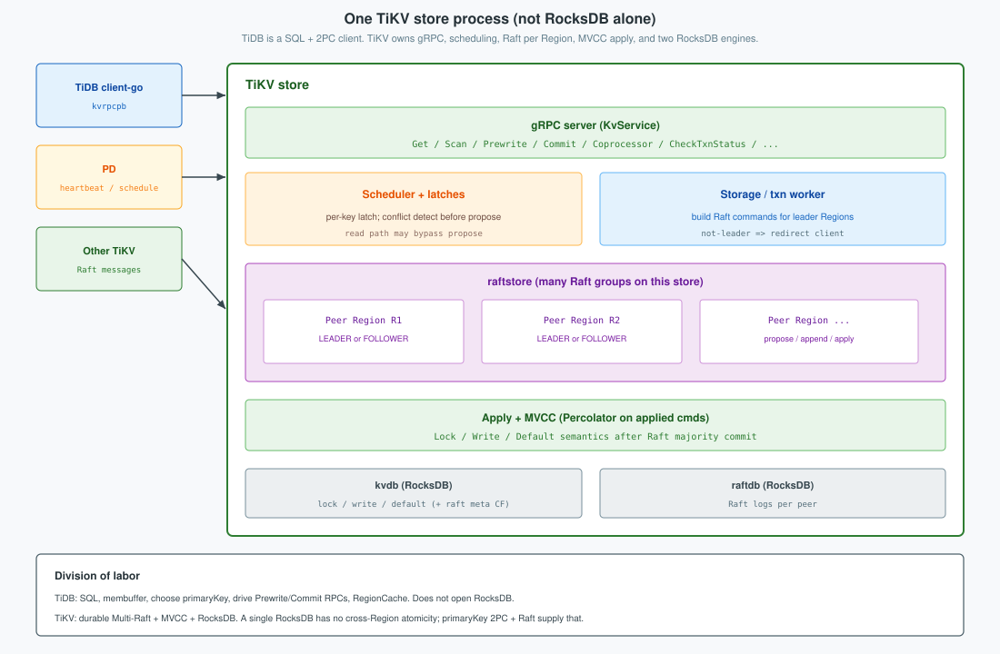
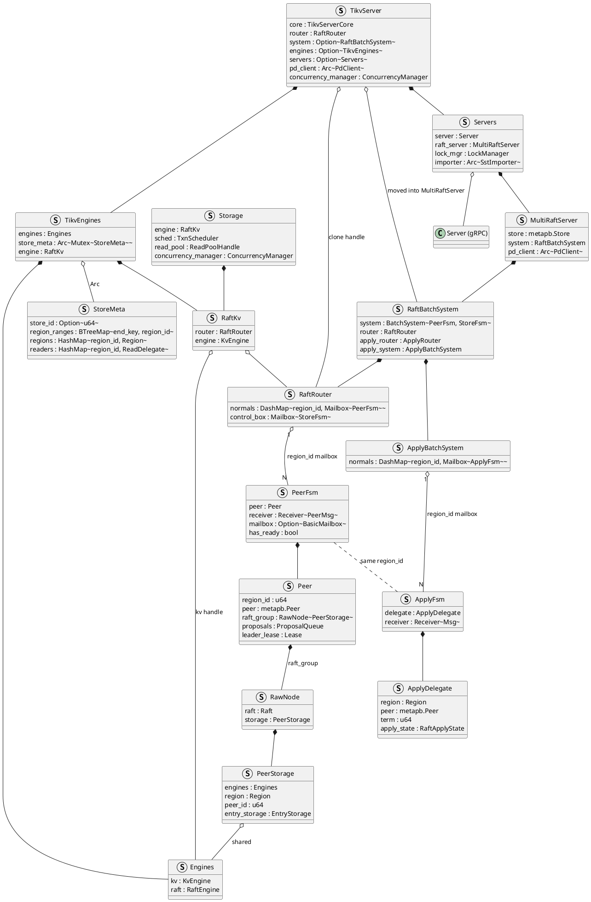
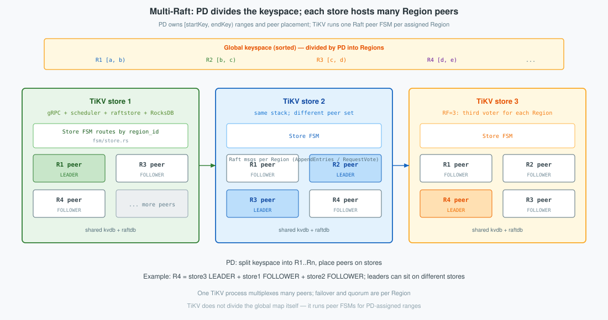
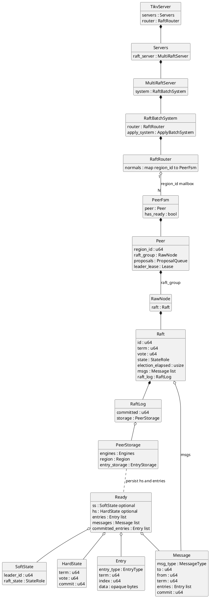
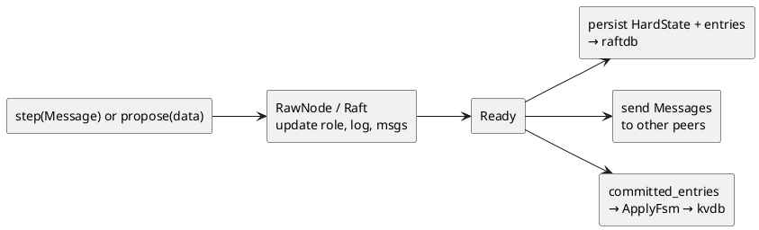
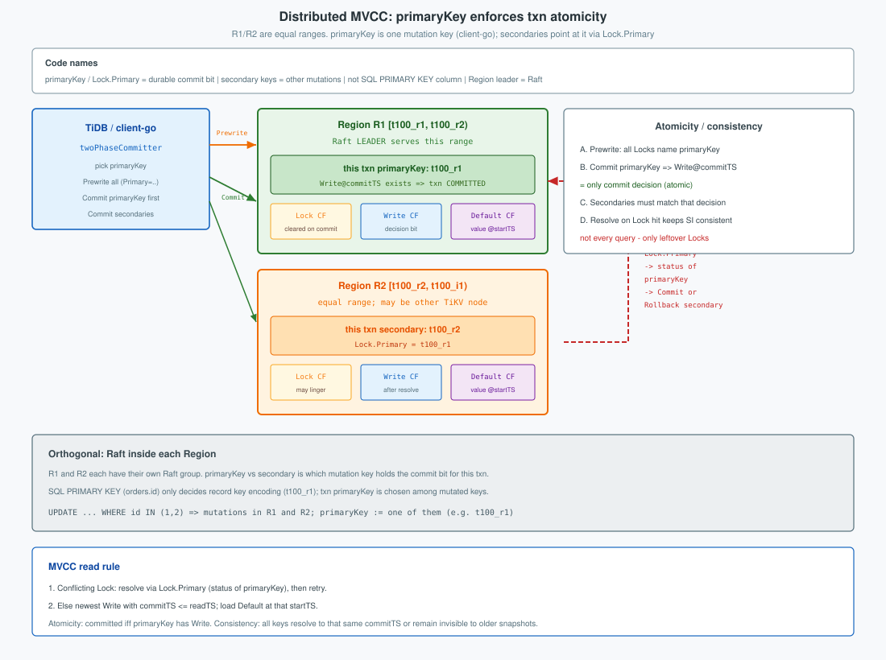
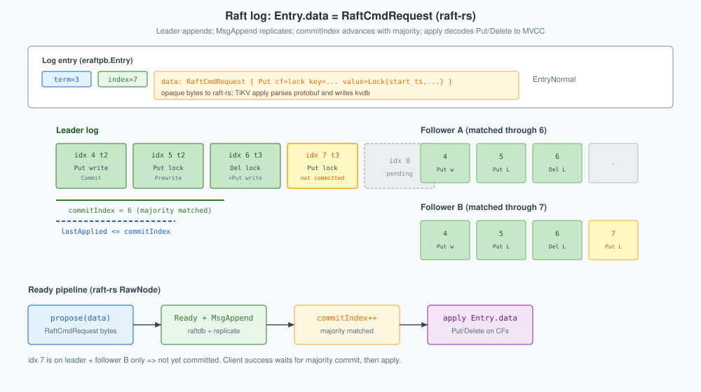

**TiKV** is the distributed row store: one sorted keyspace, many **Regions** (each a Raft group), **MVCC** in RocksDB, and Raft-backed apply for every durable write.
<!--more-->

---

## 1. Overview

TiKV is a distributed transactional key-value store. Externally it presents **one globally sorted keyspace**. Internally that map is cut into **Regions**—half-open key ranges `[startKey, endKey)`—managed by **PD** and served by **TiKV store** processes. Each Region is replicated as an independent **Raft** group (default **three peers** on three different stores). Clients (typically TiDB via client-go) send Get / Prewrite / Commit / Coprocessor RPCs to the Region’s **leader**; followers replicate Raft logs. Durable user state is **MVCC** in RocksDB (`lock` / `write` / `default`).

**Common production layouts.** A starter deployment often runs **three TiKV stores** so each Region’s default RF=3 peers can sit on different machines. Scaling for capacity or QPS adds more TiKV stores: PD spreads **more Regions** across them; it does not add extra copies of every Region unless `max-replicas` changes. On disk, a Region (and thus each peer’s data for that Region) is sized around **`region-split-size = 256 MiB`** by default (96 MiB on older releases) and splits near **`region-max-size ≈ 384 MiB`**. A production **TiKV store** data disk is commonly kept within about **1.5 TB (regular SSD) to 2–4 TB (PCIe/NVMe)**, with usage under ~80%, so peer counts stay manageable as capacity grows. If one store or AZ fails, Regions that still have a **majority (2/3)** can elect and commit; the minority side cannot.

| Piece | In TiKV |
|-------|---------|
| **Store** | One TiKV process; many Region peers |
| **Region peer** | One Raft group member for a key range |
| **Leader** | Accepts KV RPCs; proposes to the Raft log |
| **kvdb / raftdb** | User MVCC vs Raft HardState + log |




Top → bottom inside one store:

1. **gRPC** — Get, Prewrite, Commit, Coprocessor, …  
2. **Scheduler / latches** — per-key conflict control before propose  
3. **raftstore** — FSM per peer; Multi-Raft on this machine  
4. **Apply** — committed entries → MVCC mutations  
5. **kvdb + raftdb** — two RocksDB instances  

| Engine | Holds |
|--------|-------|
| **raftdb** | Raft HardState and Raft log per peer (consensus machinery) |
| **kvdb** | User MVCC (`lock`, `write`, `default` CFs) after apply |

Client KV RPCs target the **Region leader**. Followers receive Raft messages from other TiKV stores. PD heartbeats carry store/Region meta; they do not carry row values.

### Process structure

TiKV is one OS process. Its in-memory layout is a **composition of structs**: ownership (`struct` fields) plus shared handles (`Arc` / `Clone` engine wrappers).


- **TikvServer** — process root: wires gRPC, engines, PD client, and the Multi-Raft system.
- **Server (gRPC)** — accepts client KV RPCs (Get, Prewrite, Commit, Coprocessor, …) and peer Raft messages from other TiKV stores.
- **Storage** / **TxnScheduler** — turns an RPC into transactional work: latches for key conflicts, prepare read or write batch, then hand off to the engine.
- **RaftKv** — Storage’s engine facade: **writes** go to `RaftRouter` as proposals; **local reads** can use the kv engine / snapshot path.
- **Engines** — shared disk handles: `kv` (user MVCC) and `raft` (HardState + Raft log).
- **StoreMeta** — in-memory Region map and key-range index for this store (which `region_id` owns which keys).
- **MultiRaftServer** / **RaftBatchSystem** — runs peer and apply pollers; owns the routers that deliver messages to FSMs.
- **RaftRouter** — `region_id` → mailbox of a **PeerFsm**; entry point for propose and Raft `step`.
- **PeerFsm** / **Peer** — one local replica of one Region: proposals, lease, and the Raft group.
- **RawNode** — raft-rs state machine (roles, log, commit); opaque `Entry.data` until apply.
- **PeerStorage** — implements raft Storage: persist / load HardState and log entries via `Engines.raft`.
- **ApplyFsm** / **ApplyDelegate** — same `region_id`; applies committed entries into `Engines.kv` (MVCC Puts/Deletes).



**How an RPC enters.** Client (TiDB) opens gRPC to this store’s **Server**. The handler builds a `Storage` command (e.g. Prewrite or Get). `TxnScheduler` runs it under latches. The command uses **RaftKv**, which already knows the target `region_id` from the request context (filled earlier by Region cache / PD locate on the client).

**How a write becomes durable.** On the Region **leader**, `RaftKv` asks `RaftRouter` to propose a `RaftCmdRequest`. The **Peer** serializes it into `RawNode::propose`; Ready appends the log to **raftdb** and replicates with `MsgAppend`. After a majority commits, the peer notifies **ApplyFsm**, which decodes `Entry.data` and writes MVCC into **kvdb**. Only then does the RPC succeed. Followers take the same apply path for the replicated entries; they do not accept client writes (`NotLeader`).

```text
gRPC write (Prewrite / Commit / …)
  → Storage / TxnScheduler (latch, build Modify batch)
  → RaftKv → RaftRouter → PeerFsm / Peer
  → RawNode.propose → raftdb + MsgAppend
  → majority commit → ApplyFsm → kvdb MVCC
  → RPC response
```

**How a query (read) works.** Point Gets and snapshot reads still enter via gRPC → **Storage**. If the peer is leader and the lease is valid, RaftKv / local reader can serve from a snapshot of **kvdb** without proposing a new log entry (stale or follower reads use other rules: read index or replica read). Coprocessor scans are leader-side reads over the same MVCC. Reads do not change raftdb; they observe state already applied to kvdb.

```text
gRPC read (Get / Coprocessor / …)
  → Storage (snapshot / read pool)
  → RaftKv / local reader → kvdb (MVCC)
  → RPC response
```

**How Raft between stores works.** Another TiKV’s Raft messages (vote, append, heartbeat) hit gRPC as Raft traffic, not as KV commands. The store routes them by `region_id` into the matching **PeerFsm**, which calls `RawNode::step`. Ready then updates **raftdb** and may send more messages or hand committed entries to **ApplyFsm**—the same Ready/apply machinery as a local propose, without going through `Storage`.

```text
peer Raft RPC (MsgAppend / MsgRequestVote / …)
  → RaftRouter → PeerFsm
  → RawNode.step → Ready → raftdb / outbound Messages
  → committed entries → ApplyFsm → kvdb
```

Many Region peers share one `Engines` pair; each peer has its own `RawNode` and apply delegate. Raft protocol detail and MVCC command shapes continue in the sections below.

## 2. Raft

### 2.1 Multi-Raft

**Multi-Raft** means TiKV runs **many Raft groups**, not one: **PD** splits the keyspace into Regions; **each Region is one Raft group** (default three peers on three stores). A **TiKV store** hosts **many peers**—one local replica for each Region PD placed on that machine. The same store can be leader for some Regions and follower for others; leadership is per Region.



Peers share one process (gRPC, raftstore, `kvdb`/`raftdb`) so TiKV need not open a RocksDB per Region. Consensus stays independent: R1’s election and log progress do not block R2. The store routes work by `region_id` to each peer. Clients send KV RPCs only to that Region’s **leader**.

### 2.2 How peer Raft works

Each Region **Peer** owns one raft-rs **`RawNode`**. raftstore feeds it inputs (`step`, `propose`, ticks) and consumes **`Ready`**: persist, send messages, then advance. User MVCC apply of `Entry.data` happens after commit (later); this section is the Raft loop itself.




**Inputs: `step` and `propose`.** Network Raft traffic and local client proposals both become raft-rs messages. Incoming peer RPCs call `step`; a leader write builds an `Entry` and proposes it:

```rust
// peer receives MsgAppend / MsgRequestVote / …
raft_group.step(m)?;
```

```rust
// RawNode::propose — wrap payload as MsgPropose
let mut m = Message::default();
m.set_msg_type(MessageType::MsgPropose);
let mut e = Entry::default();
e.data = data.into();       // opaque bytes (RaftCmdRequest)
e.context = context.into();
m.set_entries(vec![e].into());
raft.step(m)
```

```rust
// leader peer, after serializing RaftCmdRequest
let data = req.write_to_bytes()?;
raft_group.propose(ctx.to_vec(), data)?;
```

**Output: Ready.** After `step` / `propose` / tick, if `has_ready()`, the store must handle Ready before further mutating the node:

```rust
if !raft_group.has_ready() { return; }
let mut ready = raft_group.ready();
```

```rust
// persist Raft protocol state to raftdb
if !ready.entries().is_empty() {
    append(ready.take_entries());           // → Engines.raft
}
if let Some(hs) = ready.hs() {
    raft_state.set_hard_state(hs.clone());  // term / vote / commit
}
// send ready.messages() to other TiKV peers
// committed entries → ApplyFsm (kvdb); data decoded later
```



```text
step(Message) or propose(data)
  → RawNode / Raft update role, log, msgs
  → Ready { hs?, entries?, messages?, committed_entries? }
  → PeerStorage: HardState + entries → raftdb
  → send Messages (MsgAppend, votes, heartbeats, …)
  → committed_entries → ApplyFsm → kvdb (user data)
```

**Where bytes land.** HardState and log **Entry** bodies are Raft protocol durability on **raftdb**. Outbound **Message**s are network only. **kvdb** changes only when committed entries are applied—`Entry.data` stays opaque to raft-rs until that apply path.

### 2.3 Peer election

Who becomes **Leader** is decided inside the Ready loop above. Silence is the signal: if a follower’s **election timeout** fires without a valid leader message, raft-rs campaigns.

| State | Behavior |
|-------|----------|
| **Follower** | Accepts heartbeats / appends; resets election timer |
| **Candidate** | Increments term, votes for self, asks peers for votes |
| **Leader** | Sends heartbeats; only this peer accepts client writes for the Region |

| Message | Purpose |
|---------|---------|
| `MsgRequestVote` / `MsgRequestVoteResponse` | Election |
| `MsgRequestPreVote` / `MsgRequestPreVoteResponse` | Optional pre-vote before bumping term |
| `MsgHeartbeat` / `MsgHeartbeatResponse` | Leader liveness; followers reset the election timer |

```rust
election_elapsed += 1;
if !pass_election_timeout() || !promotable {
    return false;
}
election_elapsed = 0;
step(Message { msg_type: MsgHup, .. });
```

`MsgHup` drives `campaign` → `become_candidate` (term + 1, vote for self) and broadcast of `MsgRequestVote` with last log index/term so voters can reject a stale candidate:

```rust
fn become_candidate(&mut self) {
    let term = self.term + 1;
    self.reset(term);
    self.vote = self.id;
    self.state = StateRole::Candidate;
}
```

A peer grants **at most one vote per term**, and only if the candidate’s log is at least as up-to-date. Majority votes (2 of 3 at RF=3) ⇒ Leader. The new `HardState` (term/vote) is what Ready persists to **raftdb**—not to kvdb. TiKV then reacts to the SoftState change (lease, in-memory locks, …). Non-leaders reject client writes with **`NotLeader`**.


```text
no heartbeat within election timeout
  → Follower: MsgHup → Candidate (term++)
  → MsgRequestVote to other peers
  → majority MsgRequestVoteResponse(granted)
  → Leader; Ready persists HardState to raftdb; heartbeats begin
```

On restart, the peer reloads HardState from raftdb so it resumes the same term/vote and does not double-vote.

---

## 3. MVCC

### 3.1 Column families

User data is versioned in **kvdb**. Transaction intents and commit records share the same engines as ordinary Gets:

| CF | Contents |
|----|----------|
| `lock` | Prewrite / pessimistic locks (intent) |
| `write` | Commit records (and small values) |
| `default` | Large values |

One RocksDB batch is atomic **on one store for one Region’s apply**. Keys that live in other Regions are other Raft groups; cross-Region atomicity is a multi-Region Prewrite/Commit protocol whose **storage** side is these CFs (§3.4).



### 3.2 Storage scheduler and commands

Above raftstore, the storage layer turns RPC commands into transactional work (latches, snapshot, write preparation), then proposes through raftstore: Prewrite, Commit, Rollback, Get, and related commands prepare MVCC mutations on Lock / Write / Default, then hand a write batch to the peer for propose.

Coprocessor DAG execution for scans sits on the same store (leader), reading committed MVCC; it does not bypass Raft for writes.

### 3.3 Propose and apply: RaftCmdRequest → kvdb

§2 left `Entry.data` opaque and stopped at raftdb. Here the leader turns user mutations into log bytes, and apply turns committed bytes into **kvdb** CF writes.

Write path on the leader:

```text
KV RPC / WriteData (Put / Delete, …)
  → RaftCmdRequest (protobuf)
  → propose → Entry { term, index, data = RaftCmdRequest bytes }
  → Ready: append Entry to raftdb + MsgAppend to followers   [§2.2]
  → majority → commitIndex advances
  → apply: parse Entry.data → Put/Delete on kvdb CFs
  → RPC returns
```

Transactional RPCs (Prewrite, Commit, …) become ordinary CF mutations before propose—not a separate Raft command name:

```rust
// Modify::Put → RaftCmdRequest Request
Modify::Put(cf, k, v) => {
    let mut put = PutRequest::default();
    put.set_key(k.into_encoded());
    put.set_value(v);
    if cf != CF_DEFAULT {
        put.set_cf(cf.to_string());
    }
    req.set_cmd_type(CmdType::Put);
    req.set_put(put);
}
```

```rust
let reqs: Vec<Request> = batch.modifies.into_iter().map(Into::into).collect();
let mut cmd = RaftCmdRequest::default();
cmd.set_header(header);
cmd.set_requests(reqs.into());
// → peer.propose(cmd)
```

```rust
let data = req.write_to_bytes()?;
raft_group.propose(ctx.to_vec(), data)?;
```

```rust
// RawNode::propose — wrap bytes as a log Entry
let mut m = Message::default();
m.set_msg_type(MessageType::MsgPropose);
let mut e = Entry::default();
e.data = data.into();
e.context = context.into();
m.set_entries(vec![e].into());
raft.step(m)
```

After commit, apply decodes `Entry.data` and executes (`CmdType::Put` → write the CF)—this is the step that writes **kvdb**:

```rust
let data = entry.get_data();
let cmd = parse_raft_cmd_request(data); // → RaftCmdRequest
process_raft_cmd(apply_ctx, index, term, cmd);
```

**Raft log: real command example.** After a Prewrite that writes a lock, the leader’s new entry looks like this (logical view of the protobuf in `data`):

```text
Entry {
  entry_type: EntryNormal,
  term:  3,
  index: 7,
  data:  RaftCmdRequest {
    header: {
      region_id: 1001,
      peer: { id: 11, store_id: 1 },
      region_epoch: { conf_ver: 5, version: 12 },
      ...
    },
    requests: [
      Request {
        cmd_type: Put,
        put: {
          cf:    "lock",
          key:   <encoded user key>,
          value: <Lock { start_ts, primary, ... } bytes>
        }
      }
      // optional: Put on "default" for a large value
    ]
  }
}
```

Building the same shape for an entry payload:

```rust
let mut cmd = Request::default();
cmd.set_cmd_type(CmdType::Put);
cmd.mut_put().set_key(b"key".to_vec());
cmd.mut_put().set_value(b"value".to_vec());
let mut req = RaftCmdRequest::default();
req.mut_requests().push(cmd);
entry.set_data(req.write_to_bytes()?.into());
```

A following **Commit** is another `RaftCmdRequest`—typically `Put` on `write` at `commit_ts` plus `Delete` on `lock`—at a later index.



| Pointer | Meaning on a peer |
|---------|-------------------|
| `commitIndex` | Highest index known majority-replicated (in HardState / raftdb) |
| `lastApplied` | Applied to MVCC / kvdb (`≤ commitIndex`) |

### 3.4 Prewrite and Commit on TiKV

Clients drive multi-Region transactions; **TiKV implements each phase as a normal Region write** via the propose/apply path in §3.3:

| RPC | Typical apply on the leader |
|-----|-----------------------------|
| **Prewrite** | Write `lock` CF (+ `default` for large values) at `startTS` |
| **Commit** | Write `write` CF at `commitTS`; clear `lock` |
| **Rollback / ResolveLock** | Clear or finish leftover locks |

```text
Prewrite key:  Lock[key] = { startTS, primary, ... }
Commit key:    Write[key]@commitTS; delete Lock[key]
```


For a single-Region mutation, Prewrite then Commit are two Raft-committed applies on that Region’s leader. For multi-Region txns, each Region’s leader runs the same apply path independently; TiKV does not run a cross-Region coordinator inside raftstore—the coordinator is the client. Atomicity of the whole txn is “committed iff the designated primary key’s Write record exists,” enforced by lock resolution reading that primary’s MVCC state on its Region.
