**TiKV** is TiDB’s row store built on **Multi-Raft**: every Region is a Raft group, every durable write is a Raft log entry, and RocksDB holds the Raft log (**raftdb**) plus applied MVCC (**kvdb**).
<!--more-->

Related: [RocksDB (TiKV fork)](../rocksdb/).

---

## 1. Overview

TiKV is a distributed transactional key-value store whose **replication and commit path are Raft**. Externally TiDB presents **one globally sorted keyspace**. Internally that map is cut into **Regions**—half-open ranges `[startKey, endKey)`—managed by **PD**. Each Region is an independent **Raft** group (default **three peers** on three TiKV stores); the store process runs many such peers at once (**Multi-Raft**). Clients (typically TiDB via client-go) send Get / Prewrite / Commit / Coprocessor RPCs only to that Region’s **leader**. The leader **`propose`s** a log entry; followers replicate it; after a majority commit, **apply** turns `Entry.data` into **MVCC** in RocksDB (`lock` / `write` / `default`). Consensus state (HardState + log) lives in a separate RocksDB instance (**raftdb**); user state after apply lives in **kvdb**.

**Common production layouts.** A starter deployment often runs **three TiKV stores** so each Region’s default RF=3 peers can sit on different machines. Scaling for capacity or QPS adds more TiKV stores: PD spreads **more Regions** across them; it does not add extra copies of every Region unless `max-replicas` changes. On disk, a Region (and thus each peer’s data for that Region) is sized around **`region-split-size = 256 MiB`** by default (96 MiB on older releases) and splits near **`region-max-size ≈ 384 MiB`**. A production **TiKV store** data disk is commonly kept within about **1.5 TB (regular SSD) to 2–4 TB (PCIe/NVMe)**, with usage under ~80%, so peer counts stay manageable as capacity grows. If one store or AZ fails, Regions that still have a **majority (2/3)** can elect and commit; the minority side cannot.

| Piece | In TiKV |
|-------|---------|
| **Store** | One TiKV process; many Region peers |
| **Region peer** | One Raft group member for a key range |
| **Leader** | Accepts KV RPCs; proposes to the Raft log |
| **kvdb / raftdb** | User MVCC vs Raft HardState + log |


Top → bottom inside one store:

1. **gRPC** — Get, Prewrite, Commit, Coprocessor, …  
2. **Scheduler / latches** — per-key conflict control before propose  
3. **raftstore** — FSM per peer; Multi-Raft on this machine  
4. **Apply** — committed entries → MVCC mutations  
5. **kvdb + raftdb** — two RocksDB instances  

| Engine | Holds |
|--------|-------|
| **raftdb** | Raft HardState and Raft log per peer (consensus machinery) |
| **kvdb** | User MVCC (`lock`, `write`, `default` CFs) after apply |

Client KV RPCs target the **Region leader**. Followers receive Raft messages from other TiKV stores. PD heartbeats carry store/Region meta; they do not carry row values.

### Process structure

TiKV is one OS process. Its in-memory layout is a **composition of structs**: ownership (`struct` fields) plus shared handles (`Arc` / `Clone` engine wrappers).


- **TikvServer** — process root: wires gRPC, engines, PD client, and the Multi-Raft system.
- **Server (gRPC)** — accepts client KV RPCs (Get, Prewrite, Commit, Coprocessor, …) and peer Raft messages from other TiKV stores.
- **Storage** / **TxnScheduler** — turns an RPC into transactional work: latches for key conflicts, prepare read or write batch, then hand off to the engine.
- **RaftKv** — Storage’s engine facade: **writes** go to `RaftRouter` as proposals; **local reads** can use the kv engine / snapshot path.
- **Engines** — shared disk handles: `kv` (user MVCC) and `raft` (HardState + Raft log).
- **StoreMeta** — in-memory Region map and key-range index for this store (which `region_id` owns which keys).
- **MultiRaftServer** / **RaftBatchSystem** — runs peer and apply pollers; owns the routers that deliver messages to FSMs.
- **RaftRouter** — `region_id` → mailbox of a **PeerFsm**; entry point for propose and Raft `step`.
- **PeerFsm** / **Peer** — one local replica of one Region: proposals, lease, and the Raft group.
- **RawNode** — raft-rs facade (`raft: Raft` is the consensus state machine); opaque `Entry.data` until apply.
- **PeerStorage** — implements raft Storage: persist / load HardState and log entries via `Engines.raft`.
- **ApplyFsm** / **ApplyDelegate** — same `region_id`; applies committed entries into `Engines.kv` (MVCC Puts/Deletes).

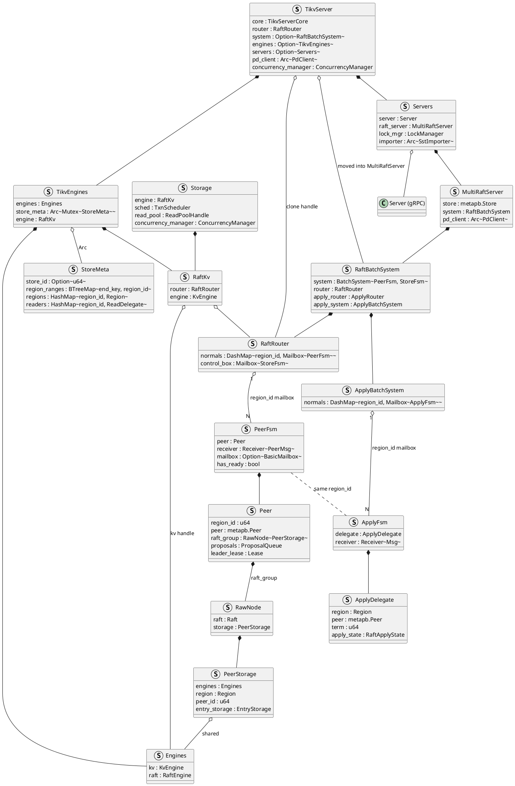

**How an RPC enters.** Client (TiDB) opens gRPC to this store’s **Server**. The handler builds a `Storage` command (e.g. Prewrite or Get). `TxnScheduler` runs it under latches. The command uses **RaftKv**, which already knows the target `region_id` from the request context (filled earlier by Region cache / PD locate on the client).

**How a write becomes durable.** On the Region **leader**, `RaftKv` asks `RaftRouter` to deliver a `RaftCmdRequest` to that Region’s **Peer**. After `propose`, the path is the Ready loop—not an immediate kvdb write:

1. **Propose** — the Peer serializes the command into opaque bytes and calls `RawNode::propose`, which appends a log **Entry** in memory inside `Raft` / `RaftLog`.
2. **Ready (local persist)** — `has_ready()` yields a **Ready**: new log entries (and often HardState) must be written to **raftdb** first.
3. **Replicate** — the same Ready carries outbound **`MsgAppend`** messages; the leader sends them to followers. Each follower `step`s, persists its own raftdb copy, and acks.
4. **Commit** — when a **majority** has that entry durable, raft-rs advances `committed`; the next Ready exposes it in `committed_entries`.
5. **Apply** — the Peer hands those entries to **ApplyFsm**, which decodes `Entry.data` and writes MVCC into **kvdb**.
6. **RPC success** — only after apply does the client write RPC return. Followers apply the same committed entries on their ApplyFsm; they never accept the client write (`NotLeader`).

```text
gRPC write (Prewrite / Commit / …)
  → Storage / TxnScheduler (latch, build Modify batch)
  → RaftKv → RaftRouter → PeerFsm / Peer
  → RawNode.propose          (in-memory Entry)
  → Ready: persist entries → raftdb
  → Ready: send MsgAppend → followers (they persist + ack)
  → majority → committed_entries
  → ApplyFsm → kvdb MVCC
  → RPC response
```

**How a query (read) works.** Point Gets and snapshot reads still enter via gRPC → **Storage**. If the peer is leader and the lease is valid, RaftKv / local reader can serve from a snapshot of **kvdb** without proposing a new log entry (stale or follower reads use other rules: read index or replica read). Coprocessor scans are leader-side reads over the same MVCC. Reads do not change raftdb; they observe state already applied to kvdb.

```text
gRPC read (Get / Coprocessor / …)
  → Storage (snapshot / read pool)
  → RaftKv / local reader → kvdb (MVCC)
  → RPC response
```

**How Raft between stores works.** Another TiKV’s Raft messages (vote, append, heartbeat) hit gRPC as Raft traffic, not as KV commands. The store routes them by `region_id` into the matching **PeerFsm**, which calls `RawNode::step`. Ready then updates **raftdb** and may send more messages or hand committed entries to **ApplyFsm**—the same Ready/apply machinery as a local propose, without going through `Storage`.

```text
peer Raft RPC (MsgAppend / MsgRequestVote / …)
  → RaftRouter → PeerFsm
  → RawNode.step → Ready → raftdb / outbound Messages
  → committed entries → ApplyFsm → kvdb
```

Many Region peers share one `Engines` pair; each peer has its own `RawNode` and apply delegate. Peer Raft (tick / step / Ready / role) is §3; client writes (propose → log → engines, then MVCC / 2PC) are §4.

## 2. Multi-Raft

TiKV runs **many Raft groups**, not one: **PD** splits the keyspace into Regions; **each Region is one Raft group** (default three peers on three stores). A **TiKV store** hosts **many peers**—one local replica for each Region PD placed on that machine. The same store can be leader for some Regions and follower for others; leadership is per Region.


Peers share one process (`TikvServer`: gRPC, `MultiRaftServer`, `Engines`) so TiKV need not open a RocksDB per Region. Consensus stays independent: R1’s election and log progress do not block R2. `RaftRouter` routes work by `region_id` to each `PeerFsm`. Clients send KV RPCs only to that Region’s **leader**.

## 3. Peer Raft protocol 

Each Region **Peer** owns one raft-rs **`RawNode`**—the consensus engine for that key range on this store. The protocol is one loop with three kinds of drive:

A **timer tick** fires on a fixed interval. Each tick advances Raft’s logical clock. On a Follower or Candidate, enough ticks without hearing the leader start an election (`MsgHup`); on a Leader, ticks send heartbeats (`MsgBeat`) so followers keep resetting their election timers. That tick → maybe Ready → idle path repeats for the life of the peer.

**Raft RPCs** between stores are request/response on the same machine: inbound `Message`s (`MsgAppend`, `MsgRequestVote`, `MsgHeartbeat`, and their responses) are `step`ped into `RawNode`; outbound replies and fan-out sit in `msgs` until Ready sends them. A follower that accepts an Append persists and answers `MsgAppendResponse`; a candidate that gathers vote responses may win; a leader that sees AppendResponses may advance `committed`. Client writes use the same Ready path; how `propose` grows the log and what apply means for MVCC / 2PC is §4.

**State transfer** (role transfer) is SoftState **`StateRole`** on that same loop—Follower, PreCandidate / Candidate, Leader—the Raft state machine, not a separate controller. Election timeout and majority votes move Follower → Candidate → Leader; a higher-term message or failed quorum check moves Leader (or Candidate) back to Follower. After any input, TiKV drains **Ready**: persist HardState and log entries to **raftdb**, send Messages, and hand committed entries to **ApplyFsm** for **kvdb**.

### 3.1 Peer and RawNode

**`RawNode.raft`: the consensus engine.** `RawNode` is a thin facade around **`raft: Raft`**. `Raft` holds peer `id`, `term` / `vote`, `StateRole`, timers, outbound `msgs`, follower progress, and `RaftLog` (committed index + `PeerStorage`). `tick` / `step` mostly forward into that field (`propose` on the write path is §4); `RawNode` then diffs SoftState / HardState to emit a **`Ready`** for the store.

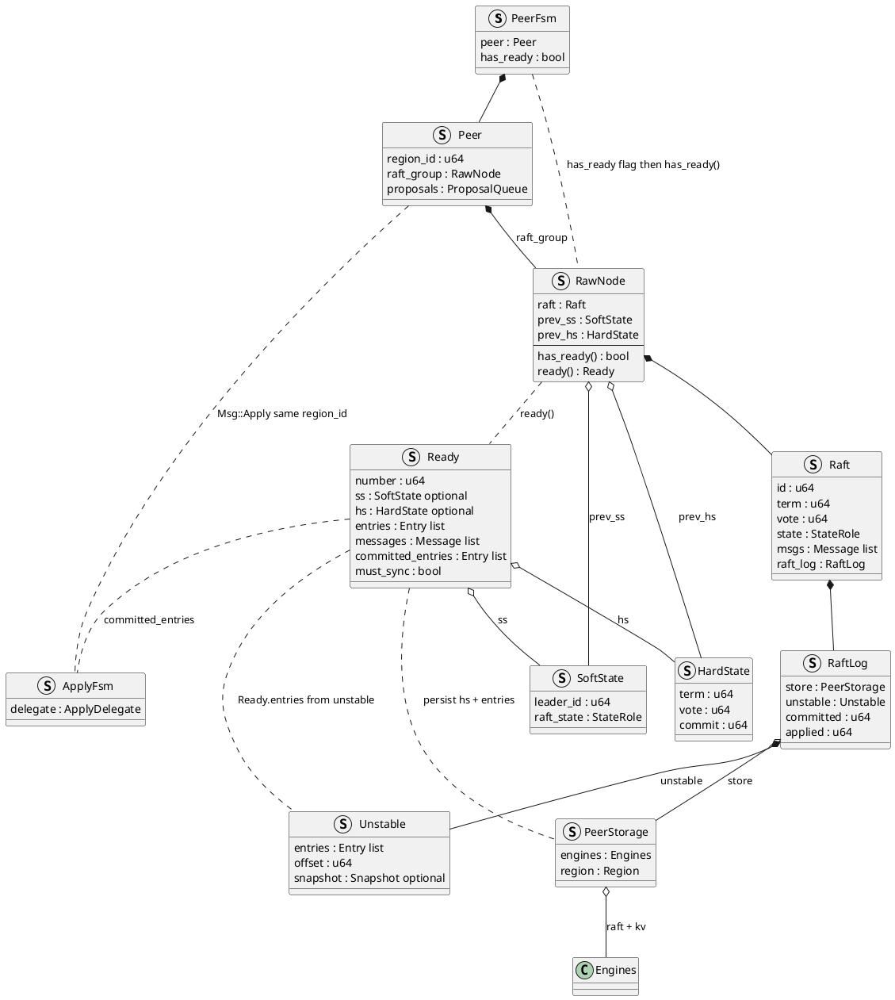

`PeerFsm.has_ready` is TiKV’s poll batching flag (set after tick / step, and after propose on the write path). `RawNode::has_ready()` is raft-rs’s real check against `prev_ss` / `prev_hs`, `unstable`, and `msgs`; `ready()` then materializes the **`Ready`** value the store must persist and send. Ready drain is below (§3.2.3); client `propose` that fills the log is §4.


### 3.2 Raft cycles and role transfer

Peer Raft is the repeated **cycle** (`tick` / `step` → Ready) plus **role transfer** on SoftState `StateRole` (Follower ⇄ Candidate ⇄ Leader). Inputs drive both: a cycle may send votes or heartbeats without changing role, or it may call `become_*` / `hup` / `poll` and transfer role; afterward the same Ready drain runs. Client log appends (`propose`) use that same Ready path and are §4.

Everything that moves consensus state enters `RawNode` through **`tick`** or **`step`** (tick synthesizes local messages). TiKV’s Peer poller invokes them; afterward Ready—persist, send, apply, advance—then idle until the next input.


| Call | Who invokes it (TiKV) | Role |
|------|------------------------|------|
| **`tick`** | Peer base-tick (`on_raft_base_tick` → `raft_group.tick`) | Advance the logical clock: election timeout or leader heartbeat |
| **`step`** | Peer Raft RPC (`Peer::step`) and local msgs from tick | Apply one `Message`; update term, role, log, outbound msgs |

**One cycle on the store side** (same drain after any dirtying input):

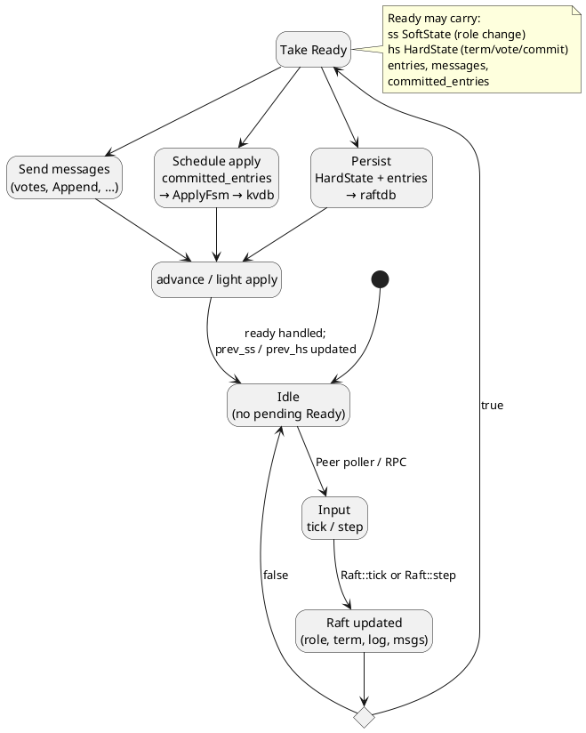

```text
  tick / step
           │
           ▼
    Raft in-memory update
    (term, log, msgs; maybe StateRole)
           │
           ▼ has_ready()
    Ready { ss?, hs?, entries?, messages?, committed_entries? }
           │
     ┌─────┼─────┐
     ▼     ▼     ▼
  raftdb  send  ApplyFsm → kvdb
     └─────┴─────┘
           ▼
      advance → Idle  (next cycle)
```

Each cycle is **input → maybe Ready drain**. Role transfers happen inside some cycles. Growing the log with client bytes is **`propose`** on a Leader (§4).

```text
tick  → (MsgHup | MsgBeat) → Raft::step → maybe Ready (votes / heartbeats)
step  → Message from peer  → Raft::step → maybe Ready (log / HardState / msgs)
         └──────── both share the Ready → raftdb / apply path
```

#### 3.2.1 `tick` — timers

`tick` advances Raft’s **logical clock** by one unit. The library does not read wall time; TiKV’s peer base-tick must call `RawNode::tick` on a fixed interval. What a tick does depends on `StateRole`: as **Follower**, **PreCandidate**, or **Candidate**, successive ticks accumulate `election_elapsed` until the randomized election timeout fires, at which point the peer injects a local `MsgHup` and campaigns; as **Leader**, ticks accumulate `heartbeat_elapsed` (and optionally run a quorum check) and inject `MsgBeat` so followers keep resetting their election timers. A tick therefore either starts or sustains leadership—it never itself appends client log entries.

**Implementation.** `RawNode::tick` forwards to `Raft::tick`, which branches on role:

```rust
// RawNode
pub fn tick(&mut self) -> bool {
    self.raft.tick()
}

// Raft
pub fn tick(&mut self) -> bool {
    match self.state {
        StateRole::Follower | StateRole::PreCandidate | StateRole::Candidate => {
            self.tick_election()
        }
        StateRole::Leader => self.tick_heartbeat(),
    }
}
```

```rust
// Follower / Candidate: election timeout → campaign
pub fn tick_election(&mut self) -> bool {
    self.election_elapsed += 1;
    if !self.pass_election_timeout() || !self.promotable {
        return false;
    }
    self.election_elapsed = 0;
    let m = new_message(INVALID_ID, MessageType::MsgHup, Some(self.id));
    let _ = self.step(m);   // becomes Candidate, sends MsgRequestVote
    true
}

// Leader: heartbeat timeout → bcast heartbeat
fn tick_heartbeat(&mut self) -> bool {
    self.heartbeat_elapsed += 1;
    // …
    if self.heartbeat_elapsed >= self.heartbeat_timeout {
        self.heartbeat_elapsed = 0;
        let m = new_message(INVALID_ID, MessageType::MsgBeat, Some(self.id));
        let _ = self.step(m);   // step_leader → bcast_heartbeat
    }
    // …
}
```

TiKV schedules a per-peer Raft tick; when it fires, `has_ready` may become true so heartbeats or vote messages leave via Ready.

#### 3.2.2 `step` — network (and local) messages

`step` is the **single transition function** of the consensus state machine: it consumes one `Message` and may update `term`, `vote`, `StateRole`, the Raft log, follower progress, and the outbound `msgs` queue. Network RPCs from other peers (`MsgAppend`, `MsgAppendResponse`, `MsgHeartbeat`, `MsgRequestVote`, …) enter through `RawNode::step` → `Raft::step`. Local control messages synthesized by `tick` (`MsgHup`, `MsgBeat`; `MsgPropose` in §4) call `Raft::step` directly. Every meaningful role change and almost every log mutation is the result of some `step`; Ready only reports what `step` (or a preceding tick that stepped) already changed.

**Implementation.** `RawNode::step` rejects unexpected local message types from the network, then calls `Raft::step`:

```rust
// Peer — after gRPC delivers a Raft Message for this region_id
self.raft_group.step(m)?;

// RawNode::step
pub fn step(&mut self, m: Message) -> Result<()> {
    if is_local_msg(m.get_msg_type()) {
        return Err(Error::StepLocalMsg);
    }
    // …
    self.raft.step(m)
}
```

`Raft::step` has two phases: **term gate**, then **message / role dispatch**. SoftState moves only inside `become_*`; Ready later surfaces `ss` if it differs from `prev_ss`. Local messages that **tick** injects call **`Raft::step` directly** (not `RawNode::step`), so `MsgHup` / `MsgBeat` are not rejected as `StepLocalMsg`.

**1. Term gate** — compare `m.term` to `self.term` before interpreting the payload:

```rust
pub fn step(&mut self, m: Message) -> Result<()> {
    if m.term == 0 {
        // local message (MsgHup / MsgBeat / MsgPropose, …)
    } else if m.term > self.term {
        // … PreVote quirks: may ignore vote while lease valid; may not bump term …
        if m.get_msg_type() == MessageType::MsgAppend
            || m.get_msg_type() == MessageType::MsgHeartbeat
            || m.get_msg_type() == MessageType::MsgSnapshot
        {
            self.become_follower(m.term, m.from);
        } else if /* not a PreVote special case */ {
            self.become_follower(m.term, INVALID_ID);
        }
    } else if m.term < self.term {
        // stale leader/candidate: often reply MsgAppendResponse so they learn
        // the newer term, then return without applying the old message
        return Ok(());
    }
    // … continue to dispatch …
```

**2. Dispatch** — `MsgHup` / votes are handled here; everything else goes to the role-specific stepper:

```rust
    match m.get_msg_type() {
        MessageType::MsgHup => self.hup(false),  // → campaign → PreCandidate or Candidate
        MessageType::MsgRequestVote | MessageType::MsgRequestPreVote => {
            // grant or reject; maybe set self.vote = m.from
            // (does not change StateRole by itself)
        }
        _ => match self.state {
            StateRole::PreCandidate | StateRole::Candidate => self.step_candidate(m)?,
            StateRole::Follower => self.step_follower(m)?,
            StateRole::Leader => self.step_leader(m)?,
        },
    }
    Ok(())
}
```

**3. Role steppers and final handlers** — `MsgHup` (from tick, or follower `MsgTimeoutNow`) starts a campaign; vote responses and Append/Heartbeat drive the rest:

```rust
fn hup(&mut self, transfer_leader: bool) {
    if self.state == StateRole::Leader { return; }
    // … refuse if unapplied conf changes …
    if transfer_leader {
        self.campaign(CAMPAIGN_TRANSFER);       // → Candidate, no PreVote
    } else if self.pre_vote {
        self.campaign(CAMPAIGN_PRE_ELECTION);   // → PreCandidate
    } else {
        self.campaign(CAMPAIGN_ELECTION);       // → Candidate (term++)
    }
}

pub fn campaign(&mut self, campaign_type: &'static [u8]) {
    let (vote_msg, term) = if campaign_type == CAMPAIGN_PRE_ELECTION {
        self.become_pre_candidate(); // state = PreCandidate; term unchanged
        (MessageType::MsgRequestPreVote, self.term + 1)
    } else {
        self.become_candidate();     // term++; vote = self; state = Candidate
        (MessageType::MsgRequestVote, self.term)
    };
    if VoteResult::Won == self.poll(self.id, vote_msg, true) {
        return; // single-node
    }
    // … send vote_msg to other voters …
}

pub fn become_follower(&mut self, term: u64, leader_id: u64) {
    self.reset(term);
    self.leader_id = leader_id;
    self.state = StateRole::Follower;
}

pub fn become_pre_candidate(&mut self) {
    self.state = StateRole::PreCandidate;
    self.prs.reset_votes();
    self.leader_id = INVALID_ID; // term / vote unchanged
}

pub fn become_candidate(&mut self) {
    let term = self.term + 1;
    self.reset(term);
    self.vote = self.id;
    self.state = StateRole::Candidate;
}

pub fn become_leader(&mut self) {
    let term = self.term;
    self.reset(term);
    self.leader_id = self.id;
    self.state = StateRole::Leader;
    self.append_entry(&mut [Entry::default()]); // empty noop
}

fn step_leader(&mut self, mut m: Message) -> Result<()> {
    match m.get_msg_type() {
        MessageType::MsgBeat => { self.bcast_heartbeat(); return Ok(()); }
        MessageType::MsgCheckQuorum => {
            if !self.check_quorum_active() {
                self.become_follower(self.term, INVALID_ID); // Leader → Follower
            }
            return Ok(());
        }
        MessageType::MsgPropose => {
            if !self.append_entry(m.mut_entries()) {
                return Err(Error::ProposalDropped);
            }
            self.bcast_append(); // role unchanged
            return Ok(());
        }
        MessageType::MsgAppendResponse => self.handle_append_response(&m),
        // MsgHeartbeatResponse / MsgTransferLeader / … → handle_*
        _ => {}
    }
    Ok(())
}

pub fn append_entry(&mut self, es: &mut [Entry]) -> bool {
    if !self.maybe_increase_uncommitted_size(es) {
        return false;
    }
    let li = self.raft_log.last_index();
    for (i, e) in es.iter_mut().enumerate() {
        e.term = self.term;
        e.index = li + 1 + i as u64;
    }
    self.raft_log.append(es); // → RaftLog.unstable
    true
}

pub fn bcast_append(&mut self) {
    let self_id = self.id;
    let core = &mut self.r;
    let msgs = &mut self.msgs;
    self.prs.iter_mut()
        .filter(|&(id, _)| *id != self_id)
        .for_each(|(id, pr)| core.send_append(*id, pr, msgs));
}

fn handle_append_response(&mut self, m: &Message) {
    // … reject → maybe_decr_to + send_append; accept → maybe_update …
    if self.maybe_commit() && self.should_bcast_commit() {
        self.bcast_append();
    }
    self.send_append_aggressively(m.from);
}

fn step_candidate(&mut self, m: Message) -> Result<()> {
    match m.get_msg_type() {
        MessageType::MsgAppend => {
            self.become_follower(m.term, m.from);
            self.handle_append_entries(&m);
        }
        MessageType::MsgHeartbeat => {
            self.become_follower(m.term, m.from);
            self.handle_heartbeat(m);
        }
        MessageType::MsgSnapshot => {
            self.become_follower(m.term, m.from);
            self.handle_snapshot(m);
        }
        MessageType::MsgRequestPreVoteResponse | MessageType::MsgRequestVoteResponse => {
            self.poll(m.from, m.get_msg_type(), !m.reject);
            // Won → campaign again or become_leader; Lost → become_follower
        }
        MessageType::MsgPropose => return Err(Error::ProposalDropped),
        _ => {}
    }
    Ok(())
}

fn poll(&mut self, from: u64, t: MessageType, vote: bool) -> VoteResult {
    self.prs.record_vote(from, vote);
    match self.prs.tally_votes().2 {
        VoteResult::Won if self.state == StateRole::PreCandidate => {
            self.campaign(CAMPAIGN_ELECTION);   // → Candidate
        }
        VoteResult::Won => {
            self.become_leader();                 // → Leader
            self.bcast_append();
        }
        VoteResult::Lost => self.become_follower(self.term, INVALID_ID),
        VoteResult::Pending => {}
    }
    // …
}

fn step_follower(&mut self, mut m: Message) -> Result<()> {
    match m.get_msg_type() {
        MessageType::MsgPropose => {
            m.to = self.leader_id;
            self.r.send(m, &mut self.msgs);  // forward; role unchanged
        }
        MessageType::MsgAppend => {
            self.election_elapsed = 0;
            self.leader_id = m.from;
            self.handle_append_entries(&m);
        }
        MessageType::MsgHeartbeat => {
            self.election_elapsed = 0;
            self.leader_id = m.from;
            self.handle_heartbeat(m);
        }
        MessageType::MsgSnapshot => {
            self.election_elapsed = 0;
            self.leader_id = m.from;
            self.handle_snapshot(m);
        }
        MessageType::MsgTimeoutNow => {
            self.hup(true);  // transfer: → Candidate (skip PreVote)
        }
        // …
        _ => {}
    }
    Ok(())
}

pub fn handle_append_entries(&mut self, m: &Message) {
    // … reject if m.index < committed; else maybe_append …
    let mut to_send = Message::default();
    to_send.set_msg_type(MessageType::MsgAppendResponse);
    to_send.to = m.from;
    if let Some((_, last_idx)) =
        self.raft_log.maybe_append(m.index, m.log_term, m.commit, &m.entries)
    {
        to_send.set_index(last_idx);
    } else {
        to_send.reject = true;
        // … reject_hint / log_term from find_conflict_by_term …
    }
    to_send.set_commit(self.raft_log.committed);
    self.r.send(to_send, &mut self.msgs);
}

pub fn handle_heartbeat(&mut self, mut m: Message) {
    self.raft_log.commit_to(m.commit);
    let mut to_send = Message::default();
    to_send.set_msg_type(MessageType::MsgHeartbeatResponse);
    to_send.to = m.from;
    to_send.context = m.take_context();
    to_send.commit = self.raft_log.committed;
    self.r.send(to_send, &mut self.msgs);
}

fn handle_snapshot(&mut self, mut m: Message) {
    let mut to_send = Message::default();
    to_send.set_msg_type(MessageType::MsgAppendResponse);
    to_send.to = m.from;
    if self.restore(m.take_snapshot()) {
        to_send.index = self.raft_log.last_index();
    } else {
        to_send.index = self.raft_log.committed;
    }
    self.r.send(to_send, &mut self.msgs);
}
```

#### 3.2.3 Ready: when it fires, and how unstable becomes durable

**In-memory deltas are not durable.** After `tick` / `step` / `propose`, new log entries may sit only in **`RaftLog.unstable`**, outbound RPCs in **`Raft.msgs`**, and SoftState / HardState may differ from `RawNode`’s `prev_ss` / `prev_hs`. Nothing is durable until the Peer drains a **Ready**.

**When Ready is triggered.** TiKV does not call `RawNode::has_ready` on every message inline. The peer FSM sets a local flag after inputs that may dirty Raft; at the **end of the poll**, it drains Ready if that flag is set.

After **tick** / **step** / **propose**, mark the peer dirty:

```rust
// tick (on_raft_base_tick)
if self.fsm.peer.raft_group.tick() {
    self.fsm.has_ready = true;
}

// step (inbound Raft Message for this region)
self.fsm.peer.step(self.ctx, msg.take_message())?;
// …
self.fsm.has_ready = true;

// propose (RaftCmdRequest on the leader)
if self.fsm.peer.propose(self.ctx, cb, msg, resp, diskfullopt) {
    self.fsm.has_ready = true;
}
```

End of the peer poll cycle — only then call into raft-rs:

```rust
// PeerFsmDelegate::collect_ready — after handle_msgs in this poll
pub fn collect_ready(&mut self) -> bool {
    let has_ready = self.fsm.has_ready;
    self.fsm.has_ready = false;
    if !has_ready || self.fsm.stopped {
        return false;
    }
    let res = self.fsm.peer.handle_raft_ready_append(self.ctx);
    // …
}

// Peer::handle_raft_ready_append
if !self.raft_group.has_ready() {
    return None;  // flag was optimistic; nothing to drain
}
let mut ready = self.raft_group.ready();
```

`RawNode::has_ready()` is the precise check: true when any in-memory delta exists:

```rust
pub fn has_ready(&self) -> bool {
    let raft = &self.raft;
    if !raft.msgs.is_empty() { return true; }                    // outbound Messages
    if raft.soft_state() != self.prev_ss { return true; }        // role / leader_id
    if raft.hard_state() != self.prev_hs { return true; }        // term / vote / commit
    if !raft.raft_log.unstable_entries().is_empty() { return true; } // unstable log
    // … snapshot or newly commit-able entries since commit_since_index …
    false
}
```

```text
tick / step / propose
  → PeerFsm.has_ready = true          (batching flag)
  → (more msgs in same poll…)
  → collect_ready()
       → handle_raft_ready_append()
            → RawNode::has_ready()?   (real check)
            → RawNode::ready()
```

A successful **propose** (§4) sets the FSM flag because **`unstable` is non-empty** and **`msgs` holds `MsgAppend`**; elections and Append paths set it for the same reason when `msgs` / HardState / SoftState change. `has_ready()` confirms before `ready()` is taken.

**What `ready()` packages.** `RawNode::ready()` snapshots those deltas into a `Ready` the store must handle before further `step` / `propose`:

```rust
pub fn ready(&mut self) -> Ready {
    // …
    if ss != self.prev_ss { rd.ss = Some(ss); }
    if hs != self.prev_hs { rd.hs = Some(hs); }
    rd.entries = raft.raft_log.unstable_entries().to_vec(); // copy from Unstable
    // Leader: messages may be sent before/while persisting (concurrent replication)
    // Follower: messages that must wait for persist go on the persisted path
    rd.light = self.gen_light_ready(); // messages + committed_entries
    rd
}
```

| Ready field | Comes from (in memory) | Peer must |
|-------------|------------------------|-----------|
| `entries` | `RaftLog.unstable.entries` | Persist to **raftdb** (`PeerStorage` / write worker) |
| `hs` | HardState delta vs `prev_hs` | Persist to **raftdb** |
| `ss` | SoftState delta vs `prev_ss` | Update lease / role bookkeeping (not raftdb log) |
| `messages` | `Raft.msgs` (e.g. `MsgAppend`) | Send to other TiKV peers |
| `committed_entries` | committed but not yet applied slice | Schedule **ApplyFsm** → kvdb |

```text
propose / step / tick
  → only memory: Unstable + msgs (+ maybe term/role)
  → has_ready() == true
  → ready()
       Ready.entries  ← unstable_entries()
       Ready.messages ← raft.msgs
       Ready.hs / ss  ← HardState / SoftState deltas
  → Peer:
       persist entries + hs → raftdb
       send messages → network
       committed_entries → ApplyFsm
  → advance / on_persist_*  (stable unstable; update prev_ss / prev_hs)
```

```rust
if !self.raft_group.has_ready() { return None; }
let mut ready = self.raft_group.ready();

if !ready.messages().is_empty() {
    let raft_msgs = self.build_raft_messages(ctx, ready.take_messages());
    self.send_raft_messages(ctx, raft_msgs);   // MsgAppend, votes, …
}
if !ready.committed_entries().is_empty() {
    self.handle_raft_committed_entries(ctx, ready.take_committed_entries());
}
// PeerStorage::handle_raft_ready → WriteTask → raftdb
self.mut_store().handle_raft_ready(&mut ready, destroy_regions)?;
```

#### 3.2.4 Persist: unstable entries and HardState → raftdb

`PeerStorage` folds Ready’s **`entries`** (the unstable snapshot) and optional HardState into a write task; the async write worker appends to the shared **raft** engine:

```rust
// PeerStorage::handle_raft_ready
if !ready.entries().is_empty() {
    self.append(ready.take_entries(), &mut write_task);  // EntryStorage cache + task
}
if let Some(hs) = ready.hs() {
    self.raft_state_mut().set_hard_state(hs.clone());
}
if prev_raft_state != *self.raft_state() || !ready.snapshot().is_empty() {
    write_task.raft_state = Some(self.raft_state().clone());
}
```

After the write succeeds, TiKV notifies raft-rs (`on_persist_entries` / `advance`) so **`unstable` can drop the persisted prefix** and `persisted` / match indexes advance. Until that persist (and follower majority acks) completes, the entry is not **committed**. User **kvdb** is still unchanged.

#### 3.2.5 Replicate then commit

Ready **`messages`** are the network side of the cycle: typically **`MsgAppend`** carrying new entries (from propose or follower catch-up), plus heartbeats / votes from other paths. Followers `step` those messages, append into *their* unstable, run the same Ready persist path on their raftdb, and respond. When a majority has the entry durable, `RaftLog.committed` advances; a later Ready exposes it in `committed_entries` for apply (§4.1.6).

#### 3.2.6 Role transfer (state machine)

SoftState **`StateRole`** (Follower / PreCandidate / Candidate / Leader) is the peer’s leadership state machine. **Role transfer** is moving along that machine when a cycle calls `become_*` / `hup` / `poll`. After an input, SoftState / HardState / log / `msgs` deltas still surface as **Ready** on the same drain path. Appending client entries (`propose`) does not transfer role (§4).

**Transitions** (`Raft.state` / SoftState `raft_state`):

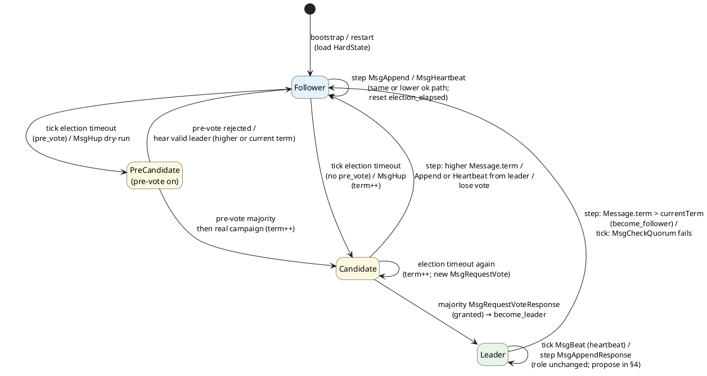

Those transitions are the `become_*` / `hup` / `poll` / `step_*` paths under **`step`**; the diagram is the SoftState view of the same calls.

### 3.3 Example: Follower → Leader (steps, Ready, Raft log)

Three peers (**1**, **2**, **3**; majority = 2). Track **peer 1**. PreVote off. Peer Raft only (empty leader noops). Figures split **store / raftdb** (`RaftLocalState` + `Entry[]`) vs **in memory** (SoftState, HardState, `unstable`, `msgs`).

**Initial** — peer 1 Follower, peer 2 Leader.

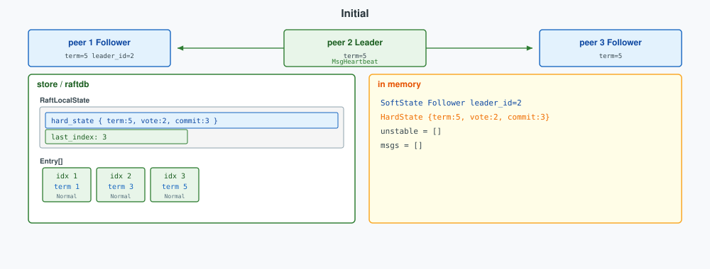

**Step 1 — `tick` election timeout** → Candidate; votes queued in `msgs`.

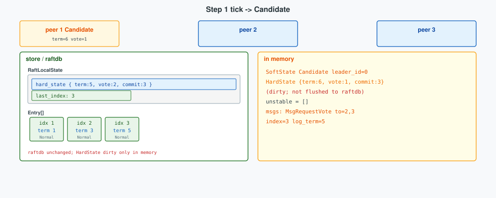

**Step 2 — Ready** — persist HardState; send `MsgRequestVote`.

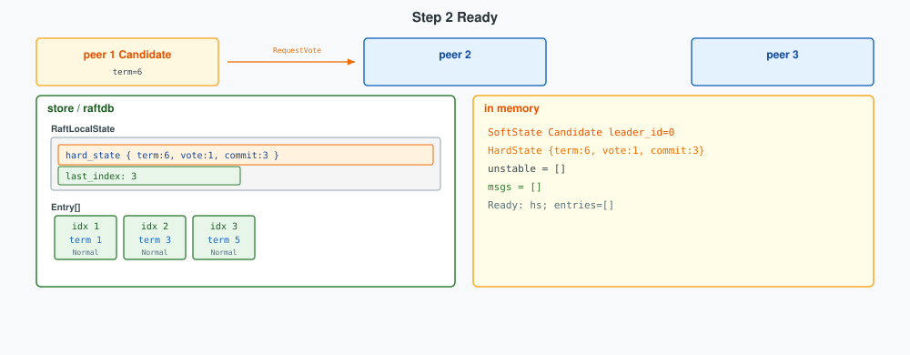

**Step 3 — `step` vote grants** → Leader; noop in `unstable`.

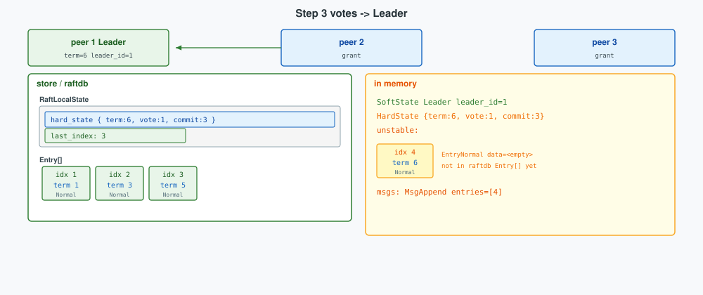

**Step 4 — Ready** — persist Entry 4; send `MsgAppend`.

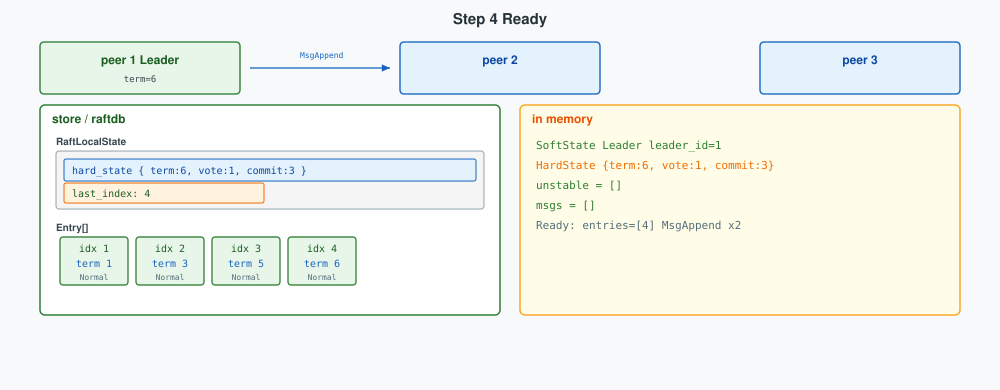

**Step 5 — followers `step` Append** — persist; `MsgAppendResponse`.

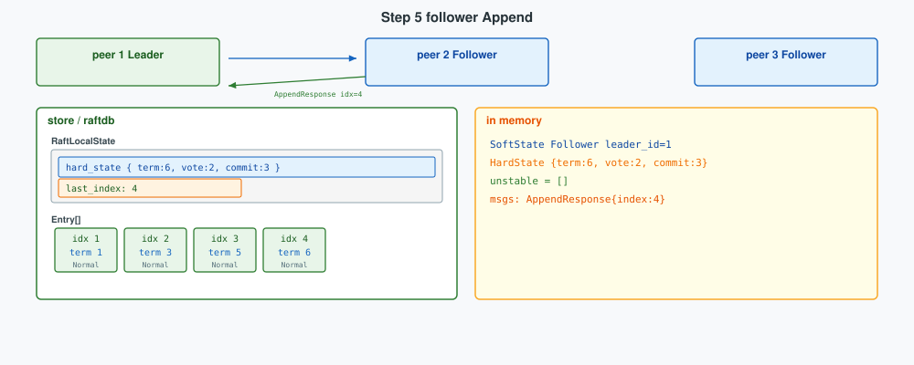

**Step 6 — `step` AppendResponse** — peer 1 `hard_state.commit` = 4 (followers still 3).

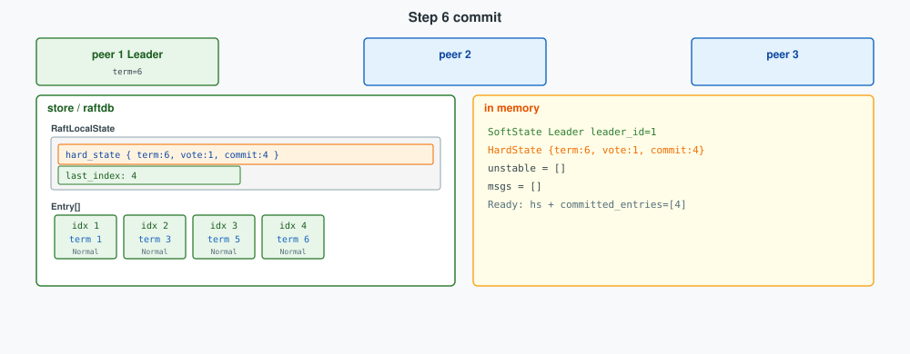

**Step 7 — Heartbeat** — peer 1 sends `MsgHeartbeat` with `commit=4`; peers 2 / 3 `commit_to(4)` and persist `hard_state.commit`.

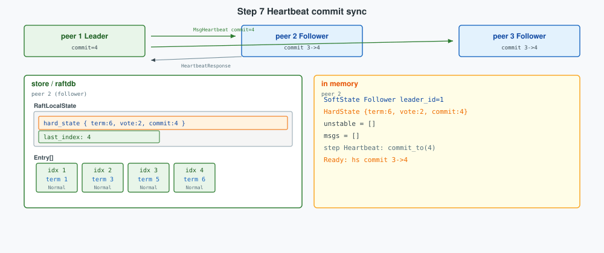

## 4. Client writes (Raft path)

A client write first **changes the Raft log** on the Region leader (`propose` → `Entry` in `unstable`). Ready (§3) persists and replicates that log to **raftdb**; **apply** (§4.1.6) turns committed `Entry.data` into **kvdb**. Applied bytes are MVCC CF mutations; multi-key transactions use Percolator 2PC over that path.

### 4.1 Client write → Raft log → raftdb / kvdb

A client write on the Region **leader** becomes opaque bytes in a Raft **`Entry`**, then—via the Ready cycle in §3—lands in **raftdb** (log + HardState) and finally **kvdb** (MVCC Puts/Deletes). Followers never accept the client RPC (`NotLeader`); they still append and apply the same log.

```text
gRPC (Prewrite / Commit / Rollback / …)
  → Storage + TxnScheduler   (latches; conflict / lock checks; build Modify batch)
  → RaftKv → RaftRouter → Peer
  → propose → RaftLog.unstable (+ MsgAppend in msgs)
  → Ready (§3.2.3): persist Entry → raftdb
  → replicate / majority → committed
  → ApplyFsm (§4.1.6): Entry.data → kvdb
  → RPC callback
```

| Layer | Role on the write path |
|-------|-------------------------|
| **TxnScheduler** | Per-key latches; run Prewrite/Commit/…; produce `Modify`s |
| **RaftKv** / **Peer** | Serialize `RaftCmdRequest`, `propose` into the Raft log |
| **Ready / PeerStorage** | Persist `Entry` + HardState to **raftdb** (§3.2.3–§3.2.4) |
| **ApplyDelegate** | Decode committed `Entry.data` into CF mutations on **kvdb** (§4.1.6) |

```rust
// Modify::Put → one RaftCmdRequest Request (CF + key + value)
Modify::Put(cf, k, v) => {
    let mut put = PutRequest::default();
    put.set_key(k.into_encoded());
    put.set_value(v);
    if cf != CF_DEFAULT {
        put.set_cf(cf.to_string());
    }
    req.set_cmd_type(CmdType::Put);
    req.set_put(put);
}
```

```rust
let reqs: Vec<Request> = batch.modifies.into_iter().map(Into::into).collect();
let mut cmd = RaftCmdRequest::default();
cmd.set_header(header);       // region_id, epoch, peer, …
cmd.set_requests(reqs.into());
// → peer.propose(cmd.write_to_bytes())
```

#### 4.1.1 `propose` — append into the Raft log

`propose` is how a **Leader** turns a client write into a Raft log entry. TiKV passes opaque bytes—typically a serialized `RaftCmdRequest`—plus an optional context; `RawNode::propose` wraps them as a local `MsgPropose` and `Raft::step`s that message. On the leader, `step_leader` assigns `term`/`index`, appends to `RaftLog`, and queues `MsgAppend` for followers. On a non-leader, the same `MsgPropose` is forwarded or dropped (`NotLeader` / `ProposalDropped`); followers never treat propose as authority to grow the log themselves. Propose does not change `StateRole`: it only extends the log when the peer already is Leader, then relies on the Ready drain (§3.2.3–§3.2.5) for raftdb persistence and replication, then apply (§4.1.6).

**Implementation.** `RawNode::propose` builds a local `MsgPropose` and steps it; there is no separate propose engine:

```rust
// Peer::propose_normal — after req.write_to_bytes()
self.raft_group.propose(ctx.to_vec(), data)?;

// RawNode::propose
pub fn propose(&mut self, context: impl Into<Bytes>, data: impl Into<Bytes>) -> Result<()> {
    let mut m = Message::default();
    m.set_msg_type(MessageType::MsgPropose);
    m.from = self.raft.id;
    let mut e = Entry::default();
    e.data = data.into();       // RaftCmdRequest bytes
    e.context = context.into();
    m.set_entries(vec![e].into());
    self.raft.step(m)           // → step_leader MsgPropose
}
```

On the leader, `step_leader` accepts `MsgPropose`, then **`append_entry` → `bcast_append`** (snippets under **`step`** above). Persistence to **raftdb** is not inside `step`: Ready (§3.2.3) later exposes `RaftLog.unstable`.

```text
MsgPropose { entries: [Entry { data, context, term:0, index:0 }] }
  → append_entry: set term/index → RaftLog.unstable
  → bcast_append: msgs += MsgAppend(…)
  → Ready (§3.2.3): entries → raftdb; messages → followers; committed_entries → apply (§4.1.6)
```

`Entry.data` stays opaque inside raft-rs: no CF names, no MVCC decode.

#### 4.1.2 Raft log shape (`RaftLog`, `Unstable`, `Entry`)

On the write path, every durable mutation is one **`Entry`** in **`Raft.raft_log: RaftLog`**. Commit advances a contiguous prefix (`committed`); apply consumes that prefix into the state machine (`applied`).


| Piece | Role |
|-------|------|
| **`store`** (`PeerStorage`) | Entries (and HardState) already written to **raftdb** |
| **`unstable`** | Entries (and optional snapshot) not yet persisted; filled by `append_entry` / follower append |
| **`committed`** | Highest index known majority-replicated (`commitIndex`) |
| **`applied`** | Highest index handed to ApplyFsm (`lastApplied` ≤ `committed`) |

```text
index:  1        2        3        4
term:   1        1        2        2
        [==== committed ====]
                 ^
            applied may lag committed until ApplyFsm catches up
```

#### 4.1.3 Entry fields

```protobuf
enum EntryType {
  EntryNormal = 0;
  EntryConfChange = 1;
  EntryConfChangeV2 = 2;
}

message Entry {
  EntryType entry_type = 1;
  uint64 term = 2;           // leader currentTerm when created
  uint64 index = 3;          // position in the log
  bytes data = 4;            // type-dependent payload
  bytes context = 6;         // optional proposal context
}
```

| Field | Function |
|-------|----------|
| **`index`** | Contiguous position; leaders assign `last_index + 1` on propose |
| **`term`** | Election term that created this slot; fixed for that entry |
| **`data`** | Payload interpreted by **`entry_type`** (below) |
| **`entry_type`** | Which of the three log kinds this slot is |
| **`context`** | Opaque side channel (TiKV proposal callback id, etc.) |

#### 4.1.4 Entry types (all kinds, with examples)

raft-rs defines exactly three `EntryType` values. TiKV uses all of them.

**1. `EntryNormal` — user / admin Raft commands (or empty noop).**  
`data` is usually a serialized **`RaftCmdRequest`**. Apply decodes Puts/Deletes onto MVCC CFs (§4.2). An **empty** `EntryNormal` (no `data`) is the leader’s first noop after `become_leader`, used to commit prior-term entries.

```text
# Prewrite lock (typical TiKV write)
Entry {
  entry_type: EntryNormal,
  term:  3,
  index: 42,
  data:  RaftCmdRequest {
    header: { region_id, peer, region_epoch, … },
    requests: [
      Put { cf: "lock", key: <user key>, value: <Lock { startTS, primary, … }> }
      // optional: Put { cf: "default", … }
    ]
  }
}

# Commit (clear lock + write record)
Entry {
  entry_type: EntryNormal,
  term:  3,
  index: 43,
  data:  RaftCmdRequest {
    requests: [
      Put    { cf: "write", key: <user key>@commitTS, value: <Write { startTS, … }> },
      Delete { cf: "lock",  key: <user key> }
    ]
  }
}

# Leader noop after election (commit barrier for prior term)
Entry {
  entry_type: EntryNormal,
  term:  4,          // new leader’s term
  index: 44,
  data:  <empty>
}
```

**2. `EntryConfChange` — single membership change (v1).**  
`data` is a **`ConfChange`**: add / remove voter or add learner, one peer at a time. TiKV still accepts this type on apply; new proposals prefer V2.

```text
Entry {
  entry_type: EntryConfChange,
  term:  5,
  index: 50,
  data:  ConfChange {
    change_type: AddNode,      // or RemoveNode / AddLearnerNode
    node_id: 1003,
    context: <optional app bytes>
  }
}
```

**3. `EntryConfChangeV2` — joint consensus / multi-change (v2).**  
`data` is a **`ConfChangeV2`**: one or more `ConfChangeSingle` ops, optional transition mode. An **empty** `ConfChangeV2` (nil data) is used to **leave a joint configuration** automatically when `auto_leave` is set.

```text
# Add a learner and remove a voter in one joint change
Entry {
  entry_type: EntryConfChangeV2,
  term:  6,
  index: 60,
  data:  ConfChangeV2 {
    transition: Auto,          // or Implicit / Explicit
    changes: [
      { change_type: AddLearnerNode, node_id: 1004 },
      { change_type: RemoveNode,     node_id: 1002 }
    ],
    context: <optional>
  }
}

# Empty ConfChangeV2 — leave joint config (auto_leave path)
Entry {
  entry_type: EntryConfChangeV2,
  term:  6,
  index: 61,
  data:  <empty ConfChangeV2>
}
```

| `EntryType` | `data` payload | Typical TiKV use |
|-------------|----------------|------------------|
| **`EntryNormal`** | `RaftCmdRequest` or empty | Prewrite / Commit / admin cmds; leader noop |
| **`EntryConfChange`** | `ConfChange` | Legacy single add/remove peer |
| **`EntryConfChangeV2`** | `ConfChangeV2` (maybe empty) | Region conf change / leave joint |

Apply dispatches on type: `EntryNormal` → CF mutations; conf-change types → update Region membership, then `RawNode::apply_conf_change`.

#### 4.1.5 `Unstable` and append

After `MsgPropose`, `append_entry` only mutates memory:

```rust
// Raft::append_entry — leader only
pub fn append_entry(&mut self, es: &mut [Entry]) -> bool {
    let li = self.raft_log.last_index();
    for (i, e) in es.iter_mut().enumerate() {
        e.term = self.term;
        e.index = li + 1 + i as u64;
    }
    self.raft_log.append(es);  // → unstable.truncate_and_append
    true
}

// RaftLog::append
pub fn append(&mut self, ents: &[Entry]) -> u64 {
    self.unstable.truncate_and_append(ents);
    self.last_index()
}
```

`Unstable.offset` is the Raft index of `entries[0]`; `entries[i]` has index `offset + i`. Ready copies `unstable_entries()` into `Ready.entries` for the Peer to flush to raftdb (§3.2.3); after persist / `advance`, that unstable prefix is dropped so the next propose appends into a fresh buffer.

```text
MsgPropose
  → append_entry → RaftLog.unstable   (memory)
  → bcast_append → Raft.msgs          (memory)
  → Ready.entries / messages
  → raftdb persist + network MsgAppend
  → majority → committed ↑ → ApplyFsm
```

Propose wiring is §4.1.1; Ready persist/replicate is §3.2.3–§3.2.5; apply is §4.1.6.

---


#### 4.1.6 Apply: committed `Entry.data` → kvdb

The Peer schedules an apply task on the same `region_id`. **ApplyDelegate** parses bytes as `RaftCmdRequest` and writes the KV engine batch:

```rust
// Peer — notify ApplyFsm
ctx.apply_router.schedule_task(
    self.region_id,
    ApplyTask::apply(Apply::new(/* … committed_entries … */)),
);
```

```rust
// ApplyDelegate — per committed Entry
let data = entry.get_data();
let cmd = util::parse_raft_cmd_request(data, index, term, &self.tag);
// …
for req in requests {
    match req.get_cmd_type() {
        CmdType::Put => self.handle_put(ctx, req),      // kv_wb.put_cf(…)
        CmdType::Delete => self.handle_delete(ctx, req),
        // …
    }
}
// ApplyContext::commit → kv_wb.write → Engines.kv
```

`handle_put` checks the key is in the Region, prefixes the data key, and puts into the requested CF (`lock` / `write` / `default`). Flushing the write batch is when **user** state becomes durable on this store. The leader’s client RPC completes only after this apply path (proposal callback), not after propose alone.

```text
propose → RaftLog / msgs
  → Ready (§3.2.3)
       ├─ entries + HardState → raftdb
       ├─ messages → followers
       └─ committed_entries → ApplyFsm
            → parse RaftCmdRequest
            → Put/Delete on kvdb CFs
  → (leader) RPC callback
```

**Where bytes land.**

| Bytes | Engine / path |
|-------|----------------|
| HardState + log `Entry` | **raftdb** (`Engines.raft`) |
| Outbound `Message` | Network only |
| Applied `Put` / `Delete` | **kvdb** (`Engines.kv`, MVCC CFs) |

Followers never accept the client write (`NotLeader`); they still apply the same committed entries so their kvdb matches the leader’s applied log.

### 4.2 MVCC column families

User state after apply lives in **kvdb** as three RocksDB **column families**. They share the same engine and Region key ranges, but store different roles for each logical user key: an open **intent**, a **commit history**, and optional **value blobs**.

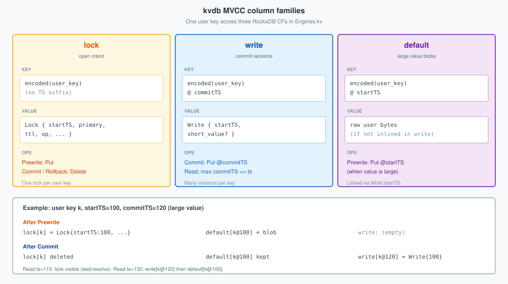

| CF | Key layout | Value | Lifetime |
|----|------------|-------|----------|
| **`lock`** | Encoded user key (no timestamp suffix) | `Lock { startTS, primary, ttl, op, … }` | Exists only while the txn holds the key; Prewrite Puts it, Commit/Rollback Deletes it |
| **`write`** | Encoded user key **`@ commitTS`** | `Write { startTS, … }` (optional short value inline) | One record per commit; snapshot reads pick the latest `commitTS ≤ read_ts` |
| **`default`** | Encoded user key **`@ startTS`** | Raw user bytes | Written on Prewrite when the value is too large to inline in `write`; kept after Commit; `Write.startTS` points here |

**One key, two timestamps.** `startTS` (from PD TSO at begin) versions the intent and the large-value slot. `commitTS` (from TSO at commit) versions the durable commit record. The lock row has no TS in the key because a key may hold only one open lock.

```text
user key k

lock CF:     k              -> Lock { startTS=100, primary=… }     # Prewrite only
write CF:    k @ commitTS   -> Write { startTS=100, … }            # after Commit
default CF:  k @ startTS    -> <blob>                              # if not inlined
```

**Read rule (sketch).** A snapshot read at `ts` ignores `lock` when safe (or resolves it), then finds the newest **`write`** with `commitTS ≤ ts`, and loads the value from that `Write` (inline) or from **`default`** at `Write.startTS`. **Write rule.** Prewrite Puts **`lock`** (and maybe **`default`**); Commit Puts **`write`** and Deletes **`lock`**.

#### 4.2.1 Example: one key through Prewrite, Commit, and snapshot reads

User key `k` already has a committed value `"v1"` from an earlier txn (`startTS=40`, `commitTS=50`). A new txn sets `k` to `"v2"` with `startTS=100`, `commitTS=120`. Value is stored in **`default`** (not inlined).

**t0 — initial CF state**

```text
lock:     (empty)
write:    k @ 50  -> Write { startTS: 40 }
default:  k @ 40  -> "v1"
```

`Get(k, ts=60)` → newest `write` with `commitTS ≤ 60` is `k@50` → `default[k@40]` → `"v1"`.

**t1 — after Prewrite apply** (Raft entry Puts `lock` + `default`)

```text
lock:     k       -> Lock { startTS: 100, primary: k, … }
write:    k @ 50  -> Write { startTS: 40 }          # unchanged
default:  k @ 40  -> "v1"
          k @ 100 -> "v2"                           # new
```

`Get(k, ts=60)` still → `"v1"` (ignores the new default; no `write` at 100 yet).  
`Get(k, ts=110)` sees **`lock[k]`** with `startTS=100 ≤ 110` → wait or resolve (txn not committed).  
Another Prewrite on `k` conflicts on the lock.

**t2 — after Commit apply** (Puts `write@120`, Deletes `lock`)

```text
lock:     (empty)
write:    k @ 50  -> Write { startTS: 40 }
          k @ 120 -> Write { startTS: 100 }         # new
default:  k @ 40  -> "v1"
          k @ 100 -> "v2"                           # kept
```

| Snapshot read | Chosen `write` | Value |
|---------------|----------------|-------|
| `Get(k, ts=60)` | `k@50` → startTS 40 | `"v1"` |
| `Get(k, ts=110)` | `k@50` → startTS 40 | `"v1"` (commit 120 not visible yet) |
| `Get(k, ts=130)` | `k@120` → startTS 100 | `"v2"` |

Old versions stay until GC compaction removes them; reads do not rewrite prior `write` / `default` rows. That is multi-version retention, not an undo log replay.

One RocksDB apply batch is atomic **on one store for one Region**. Keys in other Regions are other Raft groups; cross-Region atomicity is the client’s 2PC (§4.3).

#### 4.2.2 Write payload: `RaftCmdRequest` on MVCC CFs

Transactional RPCs become ordinary CF mutations **before** propose. Raft has no `Prewrite` message type—only `Entry.data = RaftCmdRequest` with `Put` / `Delete` on CFs.

Logical shape after a Prewrite that takes a lock:

```text
Entry {
  term, index,
  data: RaftCmdRequest {
    header: { region_id, peer, region_epoch, … },
    requests: [
      Put { cf: "lock", key: <user key>, value: <Lock { startTS, primary, … }> },
      // optional: Put { cf: "default", key: <user key>@startTS, value: <blob> }
    ]
  }
}
```

A later **Commit** is another entry—typically `Put` on `write` at `commitTS` plus `Delete` on `lock`:

```text
requests: [
  Put    { cf: "write", key: <user key>@commitTS, value: <Write { startTS, … }> },
  Delete { cf: "lock",  key: <user key> }
]
```

```rust
let mut cmd = Request::default();
cmd.set_cmd_type(CmdType::Put);
cmd.mut_put().set_cf("lock".into());
cmd.mut_put().set_key(key);
cmd.mut_put().set_value(lock_bytes);
let mut req = RaftCmdRequest::default();
req.mut_requests().push(cmd);
entry.set_data(req.write_to_bytes()?.into());
```

| Pointer (peer) | Meaning |
|----------------|---------|
| `commitIndex` | Highest Raft index majority-replicated (raftdb / HardState) |
| `lastApplied` | Highest index applied into MVCC / kvdb (`≤ commitIndex`) |

Log layout and all `EntryType` examples are in §4.1.

### 4.3 2PC: Prewrite and Commit

TiKV implements **Percolator-style 2PC** as two (or more) Region writes. The **client** chooses a primary key, obtains `startTS` / `commitTS` from PD TSO, and issues RPCs to each involved Region **leader**. TiKV does not run a cross-Region coordinator inside `MultiRaftServer`.

| Phase | Client | Typical apply on each Region leader |
|-------|--------|-------------------------------------|
| **Prewrite** | Lock all keys in the txn (primary first) | Write `lock` CF (+ `default` for large values) at `startTS` |
| **Commit** | Commit primary, then secondaries | Write `write` CF at `commitTS`; delete `lock` |
| **Rollback / ResolveLock** | Abort or recover | Clear or finish leftover locks |

```text
Prewrite key:  Lock[key] = { startTS, primary, … }
Commit key:    Write[key]@commitTS; delete Lock[key]
```

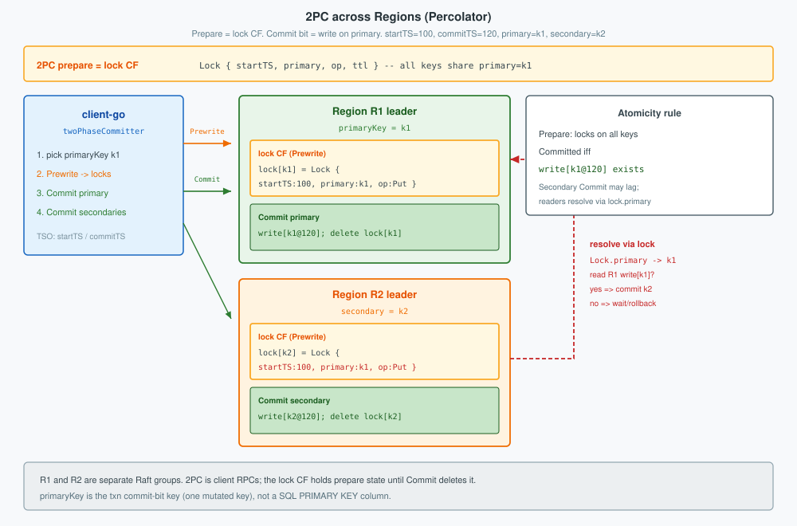

Prewrite’s durable prepare is the **`lock` CF**: every key in the txn gets a `Lock` whose **`primary`** field names the commit-bit key. Commit (or resolve) deletes those locks after the primary’s `write@commitTS` exists.

**Single-Region txn.** Prewrite then Commit are two Raft-committed applies on that Region’s leader—two entries, two MVCC updates, same propose/apply path as §4.1.

**Multi-Region txn.** Each Region’s leader runs Prewrite/Commit independently on its key range. Whole-txn atomicity is: **committed iff the primary key’s `write` record exists**. Secondaries and readers that see a lock **resolve** by reading the primary’s MVCC state on its Region (commit, rollback, or wait). That primary-key rule—not a distributed prepare across stores inside TiKV—is the 2PC commit bit.

```text
client (TiDB / client-go)
  ├─ Prewrite(primary) → Region P leader → Raft → lock CF
  ├─ Prewrite(secondaries) → Region S_i leaders → Raft → lock CF
  ├─ Commit(primary) → Region P → Raft → write CF; clear lock
  └─ Commit(secondaries) → Region S_i leaders → Raft → write CF; clear lock
       (async / retry ok: primary Write is the source of truth)
```

#### 4.3.1 Example: cross-Region atomicity

Client runs one txn that updates two rows in different Regions (PD split the keyspace so each table’s row sits on its own Raft group):

```sql
-- logical SQL (TiDB)
BEGIN;
UPDATE accounts SET balance = balance - 100 WHERE id = 1;   -- primary key row
UPDATE accounts SET balance = balance + 100 WHERE id = 2;   -- secondary
COMMIT;
```

| Role in 2PC | Logical row | Encoded user key (sketch) | Region |
|-------------|-------------|---------------------------|--------|
| **primary** | `accounts.id=1` | `t_accounts_r1` | **R1** |
| **secondary** | `accounts.id=2` | `t_accounts_r2` | **R2** |

Client picks **`t_accounts_r1` as txn primaryKey**, `startTS=100`, `commitTS=120`. R1 and R2 never share one Raft apply—atomicity is the primary’s `write` record.

**After Prewrite**

| Store | `lock` CF | `write` CF |
|-------|-----------|------------|
| R1 | `lock[t_accounts_r1] = Lock { startTS:100, primary:t_accounts_r1, op:Put }` | prior committed version only (e.g. `@80`) |
| R2 | `lock[t_accounts_r2] = Lock { startTS:100, primary:t_accounts_r1, op:Put }` | prior committed version only |

Txn **not committed**—there is still no `write@120`. Snapshot reads use MVCC as follows:

| Reader snapshot `ts` | vs `lock.startTS=100` | What the `SELECT` sees |
|----------------------|------------------------|-------------------------|
| `ts < 100` (e.g. 90) | lock is “in the future” | **Ignore lock**; newest `write` with `commitTS ≤ ts` → **original** balances |
| `ts ≥ 100` (e.g. 110) | lock overlaps the snapshot | Must **wait / resolve** the lock (cannot skip it). If resolve finds the txn still open or rolled back, then read the prior `write` → original balances; the Prewrite mutation stays invisible until a `write@commitTS ≤ ts` exists |

So uncommitted data is never returned: older snapshots skip the lock by timestamp; overlapping snapshots resolve first, then still fall back to the previous committed version while the txn has no commit `write`.

**After Commit primary only** (R1 finished; R2 Commit delayed)

| Store | `lock` CF | `write` CF |
|-------|-----------|------------|
| R1 | (empty for this key) | `write[t_accounts_r1@120] = Write { startTS:100 }` |
| R2 | `lock[t_accounts_r2] = Lock { startTS:100, primary:t_accounts_r1, … }` | (no `@120` yet) |

Whole txn is already **committed**: `write[t_accounts_r1@120]` is the commit bit. Row `id=2` may still show a lock until secondary Commit or resolve.

**Resolve path** — reader on R2 sees `lock[t_accounts_r2]`, follows `primary → t_accounts_r1`, queries R1:

| Step | Action | Result |
|------|--------|--------|
| 1 | Read R1 for primary at `startTS=100` | `write[t_accounts_r1@120]` exists |
| 2 | Decision | txn **COMMITTED** |
| 3 | Finish R2 | `write[t_accounts_r2@120]`; delete `lock[t_accounts_r2]` |
| 4 | Retry read | both balances visible at `commitTS=120` |

**If Commit primary never succeeds** (crash after Prewrite)

| Store | State | Resolve on R2 |
|-------|--------|----------------|
| R1 | no `write[t_accounts_r1@120]`; lock cleared / rolled back | — |
| R2 | `lock[t_accounts_r2]` still points at `t_accounts_r1` | primary missing commit → **ROLLBACK** `lock[t_accounts_r2]` |

Neither Region ends with only one side committed. Cross-Region atomicity is that **one primary `write`**, plus lock resolve forcing the secondary to the same decision—not a multi-Region Raft transaction.

Failure modes stay local to the protocol: Prewrite conflict → lock or latch error to the client; majority loss on a Region → that Region cannot commit its phase (`NotLeader` / timeout); undetermined primary → lock resolution polls the primary Region until `write` or rollback appears.
