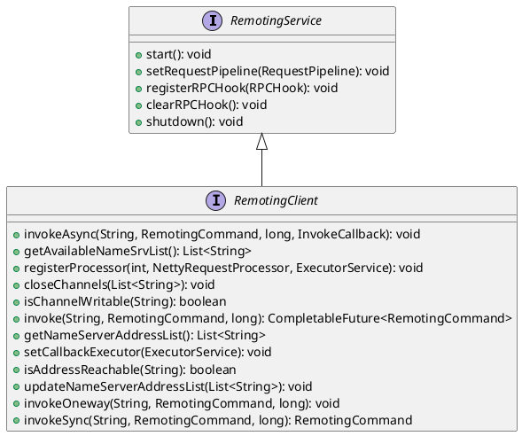

This Article introduces RocketMQ network implementation

<!--more-->


## RocketMQ remoting
RocketMQ remoting provides a single API for most network related service that uses pluggable transports and codecs. The remoting API provides the ability for making synchronous, asynchronous, oneway remote calls,  push and pull callbacks.




## Netty Implementation

The default RocketMQ network implementation is based on Netty. It defines its own protocol and codec.


### Client


```plantuml
class NettyRemotingAbstract {
  # defaultRequestProcessorPair: Pair<NettyRequestProcessor, ExecutorService>
  # semaphoreAsync: Semaphore
  # responseTable: ConcurrentMap<Integer, ResponseFuture>
  # processorTable: HashMap<Integer, Pair<NettyRequestProcessor, ExecutorService>>
  # sslContext: SslContext
  # requestPipeline: RequestPipeline
  # semaphoreOneway: Semaphore
  # isShuttingDown: AtomicBoolean
  # nettyEventExecutor: NettyEventExecutor
  # rpcHooks: List<RPCHook>
}

class NettyRemotingClient extends NettyRemotingAbstract implements RemotingClient {
  - eventLoopGroupWorker: EventLoopGroup
  - bootstrapMap: ConcurrentHashMap<String, Bootstrap>
  - publicExecutor: ExecutorService
  - channelEventListener: ChannelEventListener
  - defaultEventExecutorGroup: EventExecutorGroup
  - proxyMap: Map<String, SocksProxyConfig>
  - channelWrapperTables: ConcurrentMap<Channel, ChannelWrapper>
  - scanExecutor: ExecutorService
  - bootstrap: Bootstrap
  - callbackExecutor: ExecutorService
  - channelTables: ConcurrentMap<String, ChannelWrapper>
} 


```
