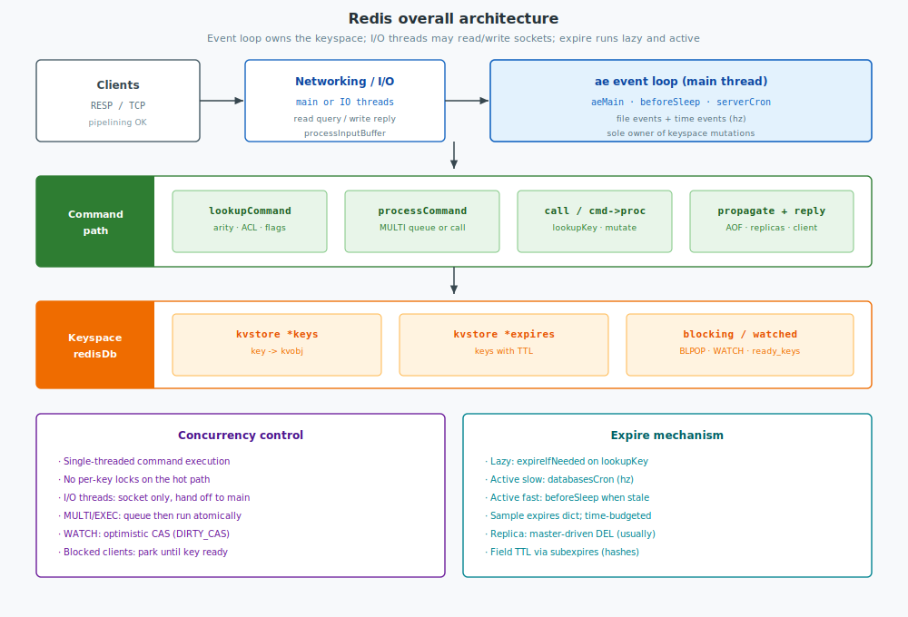
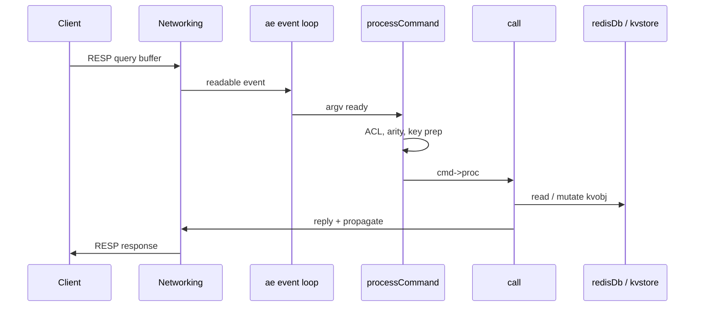

Redis is an in-memory data structure server. Clients speak **RESP** over TCP; the process stores keys in logical databases and serves commands from a single-threaded event loop that owns the keyspace. Logical types (string, list, set, …) are separate from physical **encodings** chosen for memory and CPU cost.

This post covers **general concepts**, **process architecture**, and the **type / encoding** map as implemented in current Redis source (`server.h`, `object.h`, `server.c`).

<!--more-->

Related: [Build Redis from source](../build/).

---

## 1. Generals

### 1.1 What Redis is

| Idea | Meaning |
|------|---------|
| Data structure server | Values are typed structures (lists, sets, streams), not opaque blobs only |
| In-memory primary | Hot path is RAM; disk is for durability and restart |
| Key → value | Every entry is addressed by a string key inside a selected DB |
| Logical DB | `SELECT` switches among `server.db[id]` instances (default `0`) |
| Single-threaded commands | One thread runs `processCommand` / `call` against the keyspace (I/O may use extra threads) |

Redis is not a relational engine: there is no SQL planner. Commands are registered procedures (`redisCommand`) that mutate or read `robj` values under keys.

### 1.2 Client protocol (RESP)

Clients send arrays of bulk strings (command name + args). The server parses into `client->argv` / `argc`, looks up the command, then executes it. Replies are RESP integers, bulk strings, arrays, errors, or push messages (for Pub/Sub and some tracking features).

### 1.3 Persistence and durability (overview)

| Mechanism | Role |
|-----------|------|
| **RDB** | Point-in-time binary snapshot (`rdb.c`); cheap restart image |
| **AOF** | Append-only log of write commands (`aof.c`); finer durability |
| **BIO / fork** | Background save and rewrite avoid blocking the main loop for long |

Replication and Cluster build on the same command path: writes are propagated to replicas or to slot owners after local execution.

### 1.4 Concurrency model

- **Main thread**: event loop (`aeMain`), command execution, expire, eviction hooks in `beforeSleep`.
- **Optional I/O threads**: read queries / write replies off the main thread; still hand off to main for command execution.
- **Fork children**: RDB/AOF rewrite; copy-on-write shares pages with the parent until dirty.

Blocking commands (`BLPOP`, `XREAD BLOCK`, …) park the client and resume when keys become ready—still without a second command-executing thread on the keyspace.

---

## 2. Architecture

### 2.1 Layered process view



### 2.2 Event loop and request path

Redis drives I/O with **ae** (`ae.c` / `ae.h`): file events (sockets) and time events (cron). Each loop iteration can run `beforeSleep` before waiting on the OS multiplexer (epoll/kqueue/select).

Typical path for a simple command:



Source anchors:

- `aeMain(server.el)` — main loop entry (`server.c`)
- `beforeSleep` — pending writes, AOF flush helpers, expire-related work before polling
- `processCommand(client *c)` — validation and dispatch
- `call(client *c, int flags)` — invoke `c->cmd->proc`, stats, propagation

```c
// server.c — conceptual shape
int processCommand(client *c) {
    /* module filters, ACL, arity, cluster redirection, … */
    call(c, flags);   /* or queue / block instead */
    return C_OK;
}
```

### 2.3 Keyspace: `redisDb` and `kvstore`

Each logical database is a `redisDb`:

```c
// server.h
typedef struct redisDb {
    kvstore *keys;       /* keyspace */
    kvstore *expires;    /* keys with TTL */
    estore *subexpires;  /* field-level TTL (e.g. hash) */
    dict *blocking_keys;
    dict *watched_keys;
    /* … */
    int id;
} redisDb;
```

`kvstore` is a slot-aware collection of hash tables (important for Cluster). Lookups go through helpers such as `dbFind` / `dbAdd` rather than a single global `dict` per DB as in older Redis.

Keys with TTL appear in `expires`; deletion is **lazy** on access and **active** during cron/`beforeSleep` cycles (`expire.c`).

### 2.4 Object model: `robj` / `kvobj`

Every value is a `redisObject` (`object.h`):

```c
struct redisObject {
    unsigned type:4;       /* OBJ_STRING, OBJ_LIST, … */
    unsigned encoding:4;   /* OBJ_ENCODING_*, physical layout */
    unsigned refcount : /* … */;
    unsigned iskvobj : 1;
    unsigned metabits : 8; /* when iskvobj: expiry / metadata */
    unsigned lru:24;       /* LRU or LFU bits */
    void *ptr;             /* SDS, dict, quicklist, stream, … */
};
```

- **`type`**: what the API promises (commands check type).
- **`encoding`**: how `ptr` is laid out; may change as the value grows (`hashTypeConvert`, `setTypeConvert`, …).
- **`kvobj`**: same struct used as a key–value unit that can embed the key (and optional expiry metadata) beside the value—see the header comment in `object.h`.

Shared integers and common reply objects use elevated `refcount` so they are never freed.

### 2.5 Persistence, replication, cluster (placement)

```plantuml
@startuml
!option handwritten true
skinparam class {
    BackgroundColor White
    BorderColor Black
    ArrowColor Black
}

class redisServer {
  +el : aeEventLoop
  +db : redisDb*
  +aof_state
  +master / replicas
}

class redisDb {
  +keys : kvstore
  +expires : kvstore
}

class redisObject {
  +type
  +encoding
  +ptr
}

class redisCommand {
  +name
  +proc
  +flags
}

redisServer "1" *-- "N" redisDb
redisDb "1" --> "*" redisObject : keys hold
redisServer --> redisCommand : command table
redisCommand ..> redisDb : proc mutates
@enduml
```

| Subsystem | Files (entry) | Notes |
|-----------|---------------|--------|
| Networking | `networking.c` | Accept, query parse, reply buffers |
| Commands | `t_*.c`, `db.c`, `multi.c` | Per-type and generic key ops |
| RDB / AOF | `rdb.c`, `aof.c` | Snapshot and rewrite |
| Replication | `replication.c` | PSYNC, backlog, replica feed |
| Cluster | `cluster.c` | Hash slots, redirection |
| Modules | `module.c`, `redismodule.h` | `OBJ_MODULE` custom types |

---

## 3. Data types and encodings

Logical types are defined in `server.h` (`OBJ_STRING` … `OBJ_STREAM`, plus module/array). Encodings are defined in `object.h`. **Type is stable for a key’s API; encoding is an implementation detail that can convert.**

### 3.1 Type ↔ encoding map

| Type | Typical encodings | Payload (`ptr`) | Convert when |
|------|-------------------|-----------------|--------------|
| **String** | `INT`, `EMBSTR`, `RAW` | integer / embedded SDS / heap SDS | length or non-integer content |
| **List** | `LISTPACK`, `QUICKLIST` | single listpack or linked listpacks | length / node size thresholds |
| **Hash** | `LISTPACK`, `LISTPACK_EX`, `HT` | compact fields or `dict` | field count / size limits |
| **Set** | `INTSET`, `LISTPACK`, `HT` | integers / compact / hashtable | member count or non-int members |
| **ZSet** | `LISTPACK`, `SKIPLIST` (+ dict) | compact pairs or skiplist+dict | size thresholds |
| **Stream** | `STREAM` | radix tree (`rax`) of listpacks | N/A (stream-native) |
| **Module** | module-defined | `moduleValue` | module owns layout |

Legacy encodings (`ZIPLIST`, `LINKEDLIST`, `ZIPMAP`) remain as constants for RDB compatibility but are not created for new data.

### 3.2 String

Commands: `GET` / `SET` / `INCR` / `APPEND` / bitops (`t_string.c`, `bitops.c`).

| Encoding | When |
|----------|------|
| `OBJ_ENCODING_INT` | Value fits a long; no SDS allocation |
| `OBJ_ENCODING_EMBSTR` | Short string; object header and SDS in one allocation |
| `OBJ_ENCODING_RAW` | Longer or mutable SDS |

`OBJECT ENCODING key` reports the current encoding.

### 3.3 List

Commands: `LPUSH` / `RPUSH` / `LPOP` / `LRANGE` / blocking variants (`t_list.c`).

| Encoding | Structure |
|----------|-----------|
| `LISTPACK` | One contiguous listpack for small lists |
| `QUICKLIST` | Linked list of listpack nodes; optional compression of interior nodes |

### 3.4 Hash

Commands: `HSET` / `HGET` / `HDEL` / field TTL variants (`t_hash.c`).

| Encoding | Structure |
|----------|-----------|
| `LISTPACK` / `LISTPACK_EX` | Alternating field/value (extended form carries metadata such as field expiry) |
| `HT` | `dict` of field → value SDS |

### 3.5 Set

Commands: `SADD` / `SREM` / `SISMEMBER` / set algebra (`t_set.c`).

| Encoding | Structure |
|----------|-----------|
| `INTSET` | Compact sorted integers |
| `LISTPACK` | Compact non-int-friendly small sets |
| `HT` | Hash table of members |

### 3.6 Sorted set (ZSet)

Commands: `ZADD` / `ZRANGE` / `ZRANK` (`t_zset.c`).

| Encoding | Structure |
|----------|-----------|
| `LISTPACK` | Member/score pairs in one listpack |
| `SKIPLIST` | Skiplist ordered by score + `dict` for O(1) member lookup |

### 3.7 Stream

Commands: `XADD` / `XREAD` / consumer groups (`t_stream.c`).

Encoding is `OBJ_ENCODING_STREAM`: a radix tree of listpack nodes holding entries, plus consumer-group state. Streams are append-oriented logs with IDs, not random-access maps.

### 3.8 Inspecting types at runtime

```bash
TYPE mykey
OBJECT ENCODING mykey
OBJECT FREQ mykey          # when LFU
MEMORY USAGE mykey
```

Conversion is automatic when size thresholds in `redis.conf` are crossed (e.g. `hash-max-listpack-entries`, `set-max-intset-entries`, `zset-max-listpack-entries`).

---

## 4. Design consequences

1. **API type ≠ memory layout** — capacity planning and latency cliffs often come from encoding conversions, not from the logical type name.
2. **Single-threaded mutation** — no per-key locks on the main command path; long commands or large `KEYS` scans stall everyone.
3. **Expire is opportunistic** — TTL keys are not always deleted at the exact millisecond; combine lazy + active expire.
4. **kvstore / slots** — Cluster and keyspace iteration are designed around slot-sharded dictionaries rather than one flat table.
5. **Modules extend types** — `OBJ_MODULE` plugs custom serialization into RDB/AOF via module type callbacks.

---

## 5. Summary

| Layer | Core types / entry points |
|-------|---------------------------|
| Event & I/O | `aeEventLoop`, `beforeSleep`, `networking.c` |
| Dispatch | `processCommand` → `call` → `redisCommand.proc` |
| Keyspace | `redisDb`, `kvstore`, `expires` |
| Values | `robj` / `kvobj`: `type` + `encoding` + `ptr` |
| Durability | RDB + AOF; replication/cluster reuse command propagation |

Redis’s public surface is a set of **data-type commands**; its internals are an **event-driven process** whose keyspace stores **reference-counted objects** that switch **encodings** as data grows. Understanding that split is enough to reason about memory, latency, and why `OBJECT ENCODING` matters in production.

Build and run notes: [Redis Build from source](../build/).
