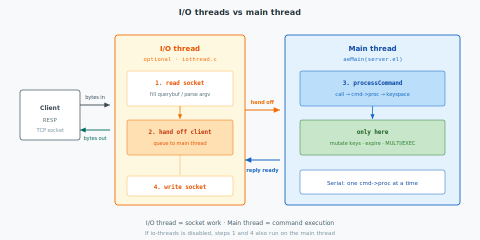
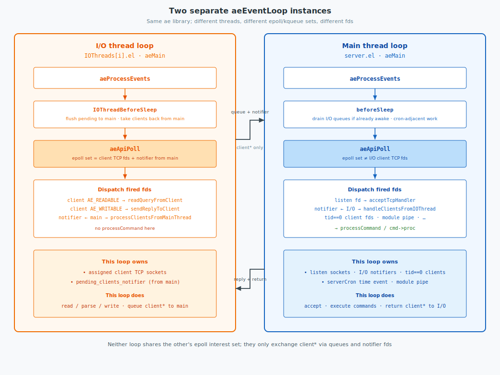

Redis stores keys in memory and serves RESP commands on a single-threaded event loop. This post covers four areas from the current source under `git/redis`: **network** (`ae`, `networking.c`), **command execution** (`processCommand` / `call`), **concurrency control**, and **expire**.

<!--more-->

Related: [Build Redis from source](../build/).


Process-wide state is one C struct:

```c
/* server.h / server.c */
struct redisServer { /* … */ };
extern struct redisServer server;
struct redisServer server; /* Server global state */
```

---

## 1. Network

The network subsystem accepts connections, multiplexes file descriptors through one or more `aeEventLoop` instances, accumulates RESP in `client->querybuf`, and emits replies. Command execution (§2) begins only after a complete command has been parsed on the main thread.



### 1.1 Structures

`struct redisServer` contains the main event loop pointer `el` (`server.el`) and the global client list. It does not embed I/O worker state. I/O workers are instances of `IOThread` stored in a file-static array in `iothread.c`. The server exposes only configuration fields (`io_threads_num`, `io_threads_active`, `io_threads_do_reads`).

```text
redisServer
  el                    → aeEventLoop          (main thread)
  clients               → list of client*
  io_threads_num        (configuration)

iothread.c
  static IOThreads[]
    IOThreads[i].el     → aeEventLoop          (I/O pthread i)
    IOThreads[i].clients
    IOThreads[i].pending_clients_to_main_thread
```

Thread id `0` (`IOTHREAD_MAIN_THREAD_ID`) denotes the main thread. I/O workers use ids `1 .. io_threads_num-1`.

```plantuml
@startuml
!option handwritten true
skinparam class {
    BackgroundColor White
    BorderColor Black
    ArrowColor Black
}

package "redisServer" {
  struct redisServer {
    +el : aeEventLoop*
    +clients : list*
    +io_threads_num : int
    +io_threads_active : int
  }
  struct "aeEventLoop (main)" as MainEL
  redisServer *-- MainEL : el
  redisServer o-- client : clients
}

package "iothread.c" {
  struct IOThread {
    +id : uint8_t
    +tid : pthread_t
    +el : aeEventLoop*
    +clients : list*
    +pending_clients_to_main_thread : list*
  }
  struct "aeEventLoop (I/O)" as IoEL
  IOThread *-- IoEL : el
}

struct client {
  +conn : connection*
  +tid : uint8_t
  +running_tid : uint8_t
  +querybuf : sds
  +argc : int
  +argv : robj**
  +reply : list*
}

redisServer ..> IOThread : io_threads_num
client --> IOThread : tid
IoEL ..> client : socket I/O
IOThread ..> MainEL : enqueue for processCommand
MainEL ..> client : processCommand
@enduml
```

```c
/* server.h — type; instances are static in iothread.c */
typedef struct {
    uint8_t id;
    pthread_t tid;
    aeEventLoop *el;
    list *clients;
    list *pending_clients_to_main_thread;
    /* … */
} IOThread;

/* iothread.c */
static IOThread IOThreads[IO_THREADS_MAX_NUM];
```

| Object | Location | Responsibility |
|--------|----------|----------------|
| `server.el` | `redisServer` | Main `aeMain`; `processCommand`; `serverCron`; expire hooks |
| `IOThreads[i]` | `iothread.c` | Dedicated pthread and `aeEventLoop` for socket I/O |
| `server.clients` | `redisServer` | Canonical list of all `client` objects |

### 1.2 Client object

Each accepted connection is represented by exactly one `struct client`, allocated once and linked from `server.clients`. I/O workers never allocate a second client for the same socket. Thread-local lists (`IOThreads[i].clients`, pending-transfer queues) hold that same pointer while work runs on a given loop.

| Field | Meaning |
|-------|---------|
| `conn` | Socket / connection abstraction bound to at most one `aeEventLoop` at a time |
| `tid` | Home thread id (`0` = main, otherwise an I/O worker) |
| `running_tid` | Thread currently handling the client |
| `querybuf` | Accumulated RESP input |
| `argc` / `argv` | Parsed command arguments (filled on I/O or main before `processCommand`) |
| `reply` | Buffered reply awaiting write |

`tid` is set when the connection is assigned (`assignClientToIOThread`, or left on main). `running_tid` tracks temporary ownership during a transfer: it becomes `0` while the main thread executes the command, even if `tid` still names an I/O worker as home.

The payload for a command—bytes in `querybuf`, then `argv`—always travels inside this object. How I/O and main coordinate ownership of that object for command execution is the subject of §1.3.

### 1.3 Two event loops: I/O and main

With `io-threads` enabled, Redis runs **more than one** `aeEventLoop`. Each is a full `aeMain` → `aeProcessEvents` → `aeApiPoll` cycle on its own thread, with its own epoll/kqueue interest set. They share the `ae` type and API (`ae.h` / `ae.c`); they do not share file-descriptor registrations.

| Loop | Pointer | Thread | Responsibility |
|------|---------|--------|----------------|
| I/O | `IOThreads[i].el` | I/O pthread `i` | Client TCP read/write and RESP parse for assigned clients |
| Main | `server.el` | Main thread | Accept, command execution, `serverCron`, process-global work |

Cross-thread coupling is only queues of `client*` plus **notifier** fds (`eventfd` / pipe), not shared listening on the same client socket.



```c
/* ae.h — same type for both loops */
typedef struct aeEventLoop {
    aeFileEvent *events;
    aeFiredEvent *fired;
    aeTimeEvent *timeEventHead;
    aeBeforeSleepProc *beforesleep;
    aeBeforeSleepProc *aftersleep;
    /* … */
} aeEventLoop;
```

#### 1.3.1 Accept on main; client I/O on an I/O thread

**Listen sockets** stay on `server.el` for the life of the process. I/O threads never call `accept`.

```c
/* server.c — createSocketAcceptHandler */
for (j = 0; j < sfd->count; j++) {
    if (aeCreateFileEvent(server.el, sfd->fd[j], AE_READABLE,
                          accept_handler, sfd) == AE_ERR) {
        /* … rollback … */
        return C_ERR;
    }
}
```

```c
/* socket.c — connSocketAcceptHandler (runs on main) */
acceptCommonHandler(connCreateAcceptedSocket(el, cfd, NULL), 0, cip);
/* el here is server.el */
```

After accept, main creates the `client` and, if I/O threads are enabled, **assigns** it to a worker. Steady-state design: main keeps the listen fd; the new connection’s read/write run on `IOThreads[i].el`.

```c
/* networking.c — after client is created / accepted */
if (server.io_threads_num > 1) assignClientToIOThread(c);
```

`createClient` always installs a read handler on the connection’s current `el` (still `server.el` at this point), because the same helper is used when there is no I/O thread and the client must stay on main:

```c
/* networking.c — createClient */
if (conn) {
    connSetReadHandler(conn, readQueryFromClient);  /* AE_READABLE on conn->el */
    connSetPrivateData(conn, c);
}
```

With I/O threads, that registration is immediately removed and the `client*` is queued to the chosen worker; the I/O loop later rebinds the fd and installs the read handler again:

```c
/* iothread.c — assignClientToIOThread */
c->tid = min_id;   /* least-loaded I/O thread */
connUnbindEventLoop(c->conn);   /* clear AE_READABLE/WRITABLE from server.el */
c->io_flags &= ~(CLIENT_IO_READ_ENABLED | CLIENT_IO_WRITE_ENABLED);
enqueuePendingClienstToIOThreads(c);  /* main beforeSleep / notifier → I/O */
```

```c
/* iothread.c — processClientsFromMainThread (on I/O loop) */
if (!connHasEventLoop(c->conn)) {
    connRebindEventLoop(c->conn, t->el);
    connSetReadHandler(c->conn, readQueryFromClient);
}
```

So: main’s permanent networking role for new connections is **listen + accept + assign**. The `connUnbindEventLoop` in `assignClientToIOThread` is not “moving listen interest”; it clears the temporary client-fd registration that `createClient` just put on `server.el`, so main does not perform that connection’s I/O.

#### 1.3.2 I/O thread loop — `IOThreads[i].el`

Each I/O worker calls `aeMain(IOThreads[i].el)` with `IOThreadBeforeSleep` / `IOThreadAfterSleep`.

**Fds in this loop's poll set**

| Fd | Handler | Purpose |
|----|---------|---------|
| Assigned client TCP | `readQueryFromClient` / `sendReplyToClient` | Socket I/O for `tid == i` |
| `pending_clients_notifier` | `handleClientsFromMainThread` | Wake when main returns a `client*` for write / further I/O |

Registration of the I/O-side notifier (main → I/O):

```c
/* iothread.c — initIOThreads */
t->pending_clients_notifier = createEventNotifier();
if (aeCreateFileEvent(t->el, getReadEventFd(t->pending_clients_notifier),
                      AE_READABLE, handleClientsFromMainThread, t) != AE_OK)
{
    /* fatal */
}
```

**One iteration (conceptually)**

1. `IOThreadBeforeSleep` — `processClientsFromMainThread`; `sendPendingClientsToMainThreadIfNeeded(t, 0)` (flush all pending to main before sleep).
2. `aeApiPoll` on this loop's fds only.
3. Dispatch: readable client → read/parse; writable client → flush reply; notifier → take clients from main.

When a complete command is ready on an I/O thread, execution is deferred:

```c
/* networking.c — processInputBuffer */
if (c->running_tid != IOTHREAD_MAIN_THREAD_ID) {
    c->io_flags |= CLIENT_IO_PENDING_COMMAND;
    enqueuePendingClientsToMainThread(c, 0);  /* unbind = 0 */
    break;
}
```

```c
/* iothread.c — enqueuePendingClientsToMainThread */
if (unbind) connUnbindEventLoop(c->conn);
if (c->io_thread_client_list_node) {
    IOThread *t = &IOThreads[c->tid];
    sendPendingClientsToMainThreadIfNeeded(t, 1);
    c->io_flags &= ~(CLIENT_IO_READ_ENABLED | CLIENT_IO_WRITE_ENABLED);
    listUnlinkNode(t->clients, c->io_thread_client_list_node);
    listLinkNodeTail(t->pending_clients_to_main_thread,
                     c->io_thread_client_list_node);
    c->io_thread_client_list_node = NULL;
}
```

The client TCP fd stays registered on the I/O loop; enable flags gate further I/O until main finishes.

#### 1.3.3 Main thread loop — `server.el`

The main thread calls `aeMain(server.el)` with Redis `beforeSleep` / `afterSleep`.

**Fds in this loop's poll set**

| Fd | Handler | Purpose |
|----|---------|---------|
| Listen sockets | accept handler via `createSocketAcceptHandler` | New connections |
| Per–I/O-thread notifiers | `handleClientsFromIOThread` | Wake when I/O queued `client*` objects |
| Clients with `tid == 0` | `readQueryFromClient` / write handlers | Never offloaded (or `keepClientInMainThread`) |
| Module pipe / other | subsystem handlers | Modules and related I/O |

**Time events:** `serverCron`.

Registration of the main-side notifier (I/O → main), one per I/O thread id:

```c
/* iothread.c — initIOThreads */
mainThreadPendingClientsNotifiers[i] = createEventNotifier();
if (aeCreateFileEvent(server.el,
                      getReadEventFd(mainThreadPendingClientsNotifiers[i]),
                      AE_READABLE, handleClientsFromIOThread, t) != AE_OK)
{
    /* fatal */
}
```

**One iteration (conceptually)**

1. `beforeSleep` — may drain queued clients without a notifier (see below).
2. `aeApiPoll` on **this** loop's fds (not I/O-assigned client TCP sockets).
3. Dispatch — notifier → `handleClientsFromIOThread` → `processCommand`; listen → accept; then time events.

#### 1.3.4 Notifier mechanism (source)

A notifier is a wake-up channel, not the client socket. Implementation is `eventfd` when available, otherwise a pipe:

```c
/* eventnotifier.c — createEventNotifier (sketch) */
#ifdef HAVE_EVENT_FD
    en->efd = eventfd(0, EFD_NONBLOCK | EFD_CLOEXEC);
#else
    anetPipe(en->pipefd, O_CLOEXEC|O_NONBLOCK, O_CLOEXEC|O_NONBLOCK);
#endif
```

```c
/* eventnotifier.c — trigger / handle */
int triggerEventNotifier(struct eventNotifier *en) {
#ifdef HAVE_EVENT_FD
    uint64_t u = 1;
    write(en->efd, &u, sizeof(u));
#else
    char buf[1] = {'R'};
    write(en->pipefd[1], buf, 1);
#endif
    return EN_OK;
}

int handleEventNotifier(struct eventNotifier *en) {
#ifdef HAVE_EVENT_FD
    uint64_t u;
    read(en->efd, &u, sizeof(u));
#else
    char buf[1];
    read(en->pipefd[0], buf, 1);
#endif
    return EN_OK;
}
```

**I/O → main: when is the notifier written?**

Joining the I/O thread's local pending list into the main-visible list optionally wakes main:

```c
/* iothread.c — sendPendingClientsToMainThreadIfNeeded */
listJoin(mainThreadPendingClients[t->id], t->pending_clients_to_main_thread);
if (!pending) atomicGetWithSync(server.running, running);

/* Only notify if main is not running and had no pending clients —
 * otherwise main will see the queue in beforeSleep. */
if (!running && !pending) {
    triggerEventNotifier(mainThreadPendingClientsNotifiers[t->id]);
}
```

**Main: file-event path after wake**

```c
/* iothread.c — handleClientsFromIOThread (AE_READABLE on notifier) */
handleEventNotifier(mainThreadPendingClientsNotifiers[t->id]);
processClientsFromIOThread(t);   /* → processCommand for pending clients */
```

**Main: drain path without wake (`beforeSleep`)**

If main was already busy (`server.running == 1`), I/O skips `triggerEventNotifier`. Those clients are still on `mainThreadPendingClients` and are picked up before the next poll:

```c
/* server.c — beforeSleep (io_threads_num > 1) */
if (processClientsOfAllIOThreads() > 0) {
    dont_sleep = 1;
}
if (!dont_sleep) {
    atomicSetWithSync(server.running, 0);
    processClientsOfAllIOThreads();  /* catch races around going to sleep */
}
```

```c
/* iothread.c */
int processClientsOfAllIOThreads(void) {
    int processed = 0;
    for (int i = 1; i < server.io_threads_num; i++)
        processed += processClientsFromIOThread(&IOThreads[i]);
    return processed;
}
```

| Main state | Mechanism |
|------------|-----------|
| Asleep in `aeApiPoll` (`server.running == 0`) | `triggerEventNotifier` → notifier readable → `handleClientsFromIOThread` |
| Busy (`server.running == 1`) | Queue only → next `beforeSleep` → `processClientsOfAllIOThreads` |

#### 1.3.5 Race: “main looks busy” then enters `aeApiPoll`

Judging `server.running` and choosing notify vs queue-only is **not** one atomic “read state and dispatch” instruction. The safety comes from a fixed order on both sides plus a second drain after publishing “I am going to sleep.”

`server.running` is `redisAtomic` and is read/written with `atomicGetWithSync` / `atomicSetWithSync` (`memory_order_seq_cst` in the C11 path) so the flag is visible across threads. The queue move uses a per–I/O-thread mutex.

**Dangerous interleaving (what must not lose work)**

1. Main is in an event-loop turn (`server.running == 1`) — e.g. still in `beforeSleep` / handlers, not yet blocked in `aeApiPoll`.
2. I/O joins `client*` into `mainThreadPendingClients[i]`, sees `running == 1`, **skips** `triggerEventNotifier`.
3. Main then decides it has nothing left, sets `server.running = 0`, and blocks in `aeApiPoll` on listen/notifiers/timers.

If step 3 did not look at the queue again after clearing `running`, those clients would sit unprocessed until some other event woke main — a lost wake.

**I/O side order** (`sendPendingClientsToMainThreadIfNeeded`)

```c
/* iothread.c — order matters */
pthread_mutex_lock(&mainThreadPendingClientsMutexes[t->id]);
pending = listLength(mainThreadPendingClients[t->id]);   /* before join */
listJoin(mainThreadPendingClients[t->id],
         t->pending_clients_to_main_thread);             /* publish clients first */
pthread_mutex_unlock(&mainThreadPendingClientsMutexes[t->id]);

if (!pending) atomicGetWithSync(server.running, running); /* then sample flag */

if (!running && !pending)
    triggerEventNotifier(mainThreadPendingClientsNotifiers[t->id]);
```

| Observation | Action |
|-------------|--------|
| `pending != 0` before join | List was already non-empty — a prior send already notified (or main will drain); skip another write. |
| `running == 1` | Main is in a turn; it must drain in `beforeSleep` — skip notifier. |
| `running == 0` and list was empty | Main is (or is about to be) in `aeApiPoll` — write notifier. |

Clients are always on the shared list **before** the running sample, so a concurrent main that clears `running` and drains again can still see them.

**Main side order** (`beforeSleep` → then `aeApiPoll`)

```c
/* server.c — beforeSleep */
if (processClientsOfAllIOThreads() > 0) {
    dont_sleep = 1;   /* keep running; more I/O traffic likely */
}
if (!dont_sleep) {
    atomicSetWithSync(server.running, 0);   /* publish “asleep soon” */
    /* Catch I/O that joined while we still looked busy and skipped notify. */
    processClientsOfAllIOThreads();
}
/* … later aeProcessEvents calls aeApiPoll … */

/* server.c — afterSleep (after poll returns) */
atomicSetWithSync(server.running, 1);
```

```text
I/O thread                              Main thread
──────────                              ──────────
listJoin(clients) ──────────────────►   (queue visible)
atomicGet(running)==1
  → no notifier

                                        beforeSleep:
                                          drain #1
                                          running = 0     ◄── published
                                          drain #2        ◄── catches join above
                                          aeApiPoll(...)

listJoin(more) ─────────────────────►
atomicGet(running)==0
  → triggerEventNotifier ────────────►  poll wakes
                                        handleClientsFromIOThread
```

So the “atomic” property is a **handshake**, not a single CAS of state+action:

1. **Enqueue before sample** on I/O — work is visible before the skip-notify decision.
2. **Clear `running` before the last drain** on main — anything that skipped notify because main looked busy is taken before `aeApiPoll`.
3. **Notifier after `running == 0`** — anything that arrives after the last drain wakes poll.

The same pattern is mirrored for main → I/O: each `IOThread` has `t->running`; `IOThreadBeforeSleep` sets it to 0 and calls `processClientsFromMainThread` again before that worker’s `aeApiPoll`.

The reverse direction (main → I/O after command execution) uses `IOThreads[i].pending_clients_notifier` and `handleClientsFromMainThread` symmetrically.

```text
IOThreads[i].el                         server.el
────────────────                        ────────────────
aeApiPoll(client TCP, …)                aeApiPoll(listen, notifiers, …)
       │
AE_READABLE → read / parse
       │
disable CLIENT_IO_*_ENABLED
queue client*
[if main asleep] triggerEventNotifier ──write──► notifier AE_READABLE
       │                                 handleClientsFromIOThread
       │                                 / beforeSleep drain
       │                                       │
       │                                       ▼
       │                                 processCommand
       │                                       │
       │◄──── queue + I/O notifier ────────────┘
AE_WRITABLE / write path → reply
```

`connUnbindEventLoop` / rebind onto `server.el` is for permanent home changes (`keepClientInMainThread`) or teardown — not the normal per-command path. When `io_threads_num <= 1`, only `server.el` exists for client I/O and commands.

### 1.4 Example: `SET k v` through I/O thread then main thread

Assume `io-threads` is enabled and `assignClientToIOThread` has set `client.tid = 1`. The client sends:

```text
*3\r\n$3\r\nSET\r\n$1\r\nk\r\n$1\r\nv\r\n
```

| Phase | Thread / loop | What happens for this `SET` |
|-------|---------------|-----------------------------|
| 1. Readable | I/O thread 1 (`IOThreads[1].el`) | `AE_READABLE`: append RESP to `querybuf`; may parse `argv = { SET, k, v }`. |
| 2. Hand off | I/O → main | `CLIENT_IO_PENDING_COMMAND`; disable I/O enable flags; enqueue `client*` (`unbind = 0`); `sendPendingClientsToMainThreadIfNeeded` may `triggerEventNotifier`. Fd stays on the I/O loop. |
| 3. Execute | Main (`server.el`) | `handleClientsFromIOThread` and/or `beforeSleep` → `processClientsFromIOThread` → `processCommand` → `setCommand` (§2); reply `+OK` buffered. |
| 4. Return | Main → I/O | Client returned to thread 1; flags re-enabled. |
| 5. Writable | I/O thread 1 | Write path / `AE_WRITABLE` flushes `+OK\r\n`. |

Source anchors: `enqueuePendingClientsToMainThread(..., 0)`, `sendPendingClientsToMainThreadIfNeeded`, `processClientsFromIOThread`, `setCommand`, `processClientsFromMainThread`. Without I/O threads, the same steps run entirely on `server.el` (`readQueryFromClient` → `processCommandAndResetClient` → `sendReplyToClient`).

---

## 2. Command execution

A command is a RESP array (for example `SET k v`), already in `client->argv` / `argc` after §1. There is no SQL planner: each command is a registered `redisCommand.proc`.

### 2.1 Structures

```plantuml
@startuml
!option handwritten true
skinparam class {
    BackgroundColor White
    BorderColor Black
    ArrowColor Black
}

struct redisServer {
  +db : redisDb*
  +commands : dict*
  +current_client : client*
  +executing_client : client*
}

struct client {
  +argc : int
  +argv : robj**
  +cmd : redisCommand*
  +db : redisDb*
  +flags : uint64_t
}

struct redisCommand {
  +declared_name : const char*
  +proc : redisCommandProc*
  +arity : int
  +flags : uint64_t
  +fullname : sds
}

struct redisDb {
  +keys : kvstore*
  +expires : kvstore*
  +blocking_keys : dict*
  +watched_keys : dict*
  +id : int
}

struct kvstore {
}

struct redisObject {
  +type : 4 bits
  +encoding : 4 bits
  +refcount
  +ptr : void*
}

redisServer "1" *-- "N" redisDb : db
redisServer ..> redisCommand : commands
client --> redisCommand : cmd
client --> redisDb : db
redisDb *-- kvstore : keys
kvstore --> redisObject : kvobj entries
redisCommand ..> redisDb : proc
@enduml
```

```c
/* server.h */
typedef struct redisDb {
    kvstore *keys;
    kvstore *expires;
    estore *subexpires;
    dict *blocking_keys;
    dict *watched_keys;
    /* … */
    int id;
} redisDb;
```

### 2.2 `processCommand` and `call`

```text
processInputBuffer
  → processCommandAndResetClient
    → processCommand
      → call
        → c->cmd->proc(c)
```

`processCommand` (`server.c`):

1. Optional module command filters.
2. `lookupCommand`; reject unknown name, wrong arity, or disallowed internal commands.
3. Enforce ACL, memory limits, Cluster redirect, loading, busy script/module, client pause, Pub/Sub and replica rules.
4. If `CLIENT_MULTI` and the command is not `EXEC` / `DISCARD` / `MULTI` / `WATCH` (and related bookkeeping) → `queueMultiCommand` (§3).
5. Otherwise `call(c, flags)`: set `server.current_client` / `executing_client`, invoke `c->cmd->proc(c)`, update stats, propagate writes (AOF / replicas), fill the reply buffer.

```c
/* server.c — control structure */
int processCommand(client *c) {
    /* lookup, ACL, arity, cluster, loading, busy, pause, … */
    if (c->flags & CLIENT_MULTI && /* not EXEC / DISCARD / … */) {
        queueMultiCommand(c, cmd_flags);
        return C_OK;
    }
    call(c, flags);
    return C_OK;
}
```

### 2.3 Key access inside `cmd->proc`

Key commands use `lookupKeyRead` / `lookupKeyWrite` → `lookupKey` (`db.c`):

1. Resolve the entry in `db->keys`.
2. Call `expireIfNeeded` (lazy expire; §4).
3. Update LRU/LFU and hit/miss counters unless flags suppress them.

Writes may update `expires`, call `touchWatchedKey`, and wake waiters on `blocking_keys`.

### 2.4 Blocking commands

`BLPOP`, `XREAD BLOCK`, and similar commands register the client in `blocking_keys`, set `bstate`, and return to the event loop. When data arrives, Redis marks keys ready and unblocks clients from `beforeSleep` / unblock helpers on the main thread.

---

## 3. Concurrency control

Redis does not use per-key locks for ordinary commands. Correctness follows from **single-threaded execution of `cmd->proc`** on the main `aeEventLoop`, plus `MULTI`/`EXEC` batching and `WATCH` optimistic CAS.

A single process exposes one command-executing loop (`server.el`). While `cmd->proc` runs, no other command runs, including commands on disjoint keys. Parallel execution across keys requires Cluster sharding or separate Redis processes.

### 3.1 Structures

```plantuml
@startuml
!option handwritten true
skinparam class {
    BackgroundColor White
    BorderColor Black
    ArrowColor Black
}

struct redisServer {
  +el : aeEventLoop*
  +io_threads_num : int
  +io_threads_active : int
  +in_exec : int
}

struct client {
  +flags : uint64_t
  +tid : uint8_t
  +mstate : multiState
  +bstate : blockingState
  +watched_keys : list*
  +db : redisDb*
}

struct multiState {
  +commands : pendingCommand**
  +count : int
  +cmd_flags : int
  +cmd_inv_flags : int
  +executing_cmd : int
}

struct blockingState {
  +btype : blocking_type
  +timeout : mstime_t
  +keys : dict*
}

struct IOThread {
  +id : uint8_t
  +tid : pthread_t
  +el : aeEventLoop*
  +clients : list*
  +pending_clients_to_main_thread : list*
  +pending_clients_mutex
}

struct redisDb {
  +blocking_keys : dict*
  +watched_keys : dict*
}

client *-- multiState : mstate
client *-- blockingState : bstate
client --> redisDb : db
redisServer ..> IOThread : io_threads_num
IOThread ..> client : socket I/O
IOThread ..> redisServer : enqueue for processCommand
@enduml
```

### 3.2 Main thread ownership

| Actor | Keyspace mutation |
|-------|-------------------|
| Main thread (`aeMain` on `server.el`) | Yes — all `cmd->proc`, expire, related cron work |
| I/O threads | No — socket read/write and parse; hand off to main |
| BIO / `fork` child | Persistence rewrite; not parallel command execution |

Commands are totally ordered on one process. Disjoint-key commands (for example concurrent `INCR a` and `INCR b`) execute sequentially and do not interleave mid-command. A long-running command blocks all other clients until it returns.

### 3.3 I/O threads

When `io-threads` is enabled (`iothread.c`), clients are assigned to an `IOThread` for socket I/O, transferred to the main thread for `processCommand` / `call`, and may be returned to the I/O thread for asynchronous write (§1.2). This arrangement parallelizes socket work only; keyspace updates remain on the main thread.

### 3.4 `MULTI` / `EXEC`

```text
MULTI
SET a 1
INCR b
EXEC
```

| Step | Behavior |
|------|----------|
| `MULTI` | Set `CLIENT_MULTI`; subsequent commands are queued in `mstate` |
| Queued commands | Not executed; flags accumulated in `mstate.cmd_flags` |
| `EXEC` | `execCommand` runs the queue with `server.in_exec = 1` |
| Queue-time error | `CLIENT_DIRTY_EXEC` → `EXECABORT` |

No other client interleaves between the first and last command of an `EXEC` on the same server. This is not MVCC: a runtime failure of one queued command does not roll back earlier commands in the same `EXEC`. Use `WATCH` to abort the batch on conflict.

### 3.5 `WATCH`

1. `WATCH` records keys in `db->watched_keys` and `client->watched_keys`.
2. A write to a watched key calls `touchWatchedKey` → sets `CLIENT_DIRTY_CAS` on watchers.
3. On `EXEC`: expired watched key or `CLIENT_DIRTY_CAS` → null array reply, queue discarded; otherwise run queue and `unwatchAllKeys`.

Writers are not blocked. Conflict is detected at `EXEC` time (optimistic CAS).

### 3.6 Pause and busy

| Mechanism | Effect in `processCommand` |
|-----------|----------------------------|
| Client pause | Postpone ordinary clients until pause ends |
| Busy script / module | Reject commands lacking `CMD_ALLOW_BUSY` with `-BUSY` |

---

## 4. Expire

TTL state lives in `db->expires` (key TTL) and `subexpires` (field TTL). A key may be past TTL yet still allocated until lazy or active expire deletes it.

### 4.1 Recording TTL

`EXPIRE`, `PEXPIRE`, `SET … EX`, and related commands store an absolute expire time and insert the key into `expires`. A non-positive TTL can delete the key immediately.

### 4.2 Lazy expire

`lookupKey` always consults `expireIfNeeded`:

```c
/* db.c — structure */
kvobj *lookupKey(...) {
    kvobj *val = dbFindByLink(...);
    if (val) {
        if (expireIfNeeded(db, key, val, expire_flags) != KEY_VALID)
            val = NULL;
    }
    /* LRU/LFU, stats … */
    return val;
}
```

| Condition | Result |
|-----------|--------|
| Not expired | `KEY_VALID` |
| Replica (typical read path) | Report expired; master synthesizes `DEL` (no local delete) |
| Expire paused | Report expired; do not delete |
| Master (normal) | `deleteExpiredKeyAndPropagate` → `KEY_DELETED` |

On a master, `GET` of an expired key returns nil and removes the key.

### 4.3 Active expire

Masters also sample `expires` in the background so untouched keys do not retain memory indefinitely.

| Cycle | Caller | Budget |
|-------|--------|--------|
| Slow | `databasesCron` via `serverCron` (`hz`) | Fraction of the cron slice (`ACTIVE_EXPIRE_CYCLE_SLOW_TIME_PERC`, effort-scaled) |
| Fast | `beforeSleep` when stale ratio is high or the previous cycle hit its limit | Short microsecond cap (`ACTIVE_EXPIRE_CYCLE_FAST_DURATION`, effort-scaled) |

`activeExpireCycle` (`expire.c`):

- Advances a DB cursor across calls.
- Samples entries from `expires` (`ACTIVE_EXPIRE_CYCLE_KEYS_PER_LOOP`, effort-scaled).
- Deletes via `activeExpireCycleTryExpire` → same propagation path as lazy expire.
- Stops when the time budget is exhausted.
- Drives hash field expiry through `subexpires` when present.

Replicas use `expireSlaveKeys` rather than owning primary deletes.

### 4.4 Combined behavior

| Path | When |
|------|------|
| Lazy | Every `lookupKey` on an expired key (master deletes and propagates) |
| Active slow | `serverCron` → `databasesCron` |
| Active fast | `beforeSleep` when stale pressure is high |

| Property | Effect |
|----------|--------|
| Soft deadline for idle keys | Brief retention of logically expired keys |
| `active-expire-effort` / `hz` | Trade CPU for lower stale memory |
| Pause expire | Avoid delete races during failover / migration |

---

| § | Mechanism |
|---|-----------|
| 1 Network | `aeEventLoop`, accept/read/write, hand-off into command path |
| 2 Command execution | `processCommand` → `call` → `cmd->proc` |
| 3 Concurrency | One `aeEventLoop` serializes all commands (any keys); I/O threads; `MULTI`/`WATCH` |
| 4 Expire | Lazy `expireIfNeeded`; active slow/fast `activeExpireCycle` |

[Redis Build from source](../build/).
