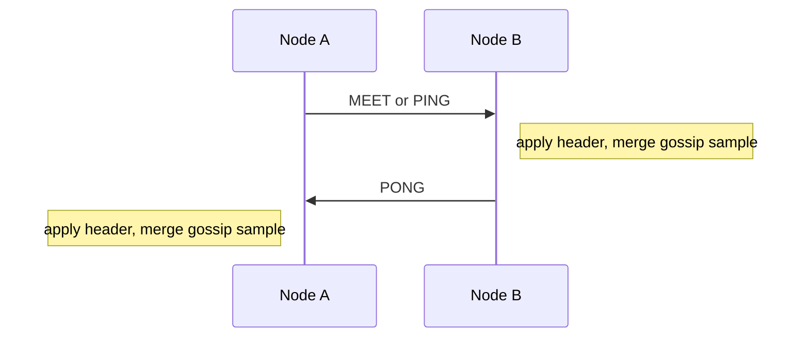
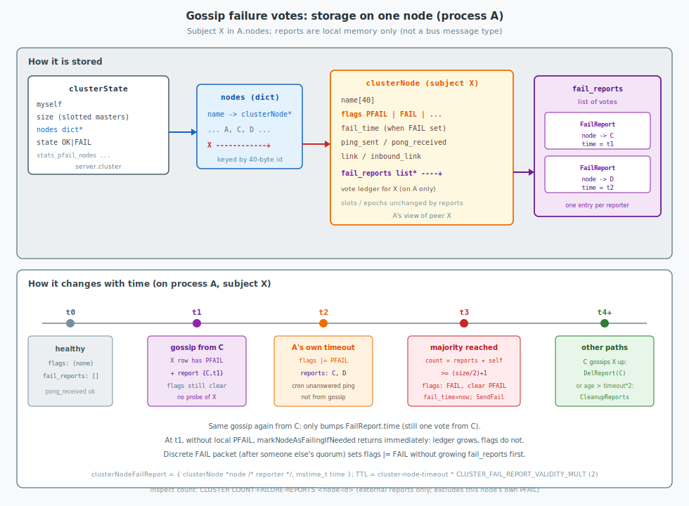

Redis Cluster keeps a second network plane beside client RESP: the **cluster bus**. Nodes use it to discover peers, share slot and epoch views, detect failures, vote on failovers, and propagate selected cluster events. This post covers **architecture** (planes and gossip mechanism), then **implementation** (protocol wire format and code paths) in `git/redis` (`cluster_legacy.h`, `cluster_legacy.c`).

<!--more-->

Related: [Network / command path](../architecture/), [Pub/Sub](../pubsub/), [Build from source](../build/).


---

## 1. Architecture

Redis Cluster’s control architecture is a **node-to-node mesh** on a dedicated **cluster bus** port, separate from client RESP. Each node holds a local membership and slot view and exchanges binary `clusterMsg` packets—periodic gossip for liveness and topology, plus discrete messages for failure, failover, and selected events.

### 1.1 Two planes

Redis Cluster separates **data** traffic from **control** traffic. Clients stay on RESP; only Redis nodes speak the binary bus protocol.

| Plane | Port (typical) | Speakers | Role |
|-------|----------------|----------|------|
| Client / data | `:6379` RESP | Apps, replication client | Commands, keys, replication stream |
| Cluster bus / control | `:16379` (base+10000) binary | Redis nodes only | Membership, health, slots/epochs, votes, selected events |

```c
/* cluster_legacy.h */
#define CLUSTER_PORT_INCR 10000 /* Cluster port = baseport + PORT_INCR */
```

```text
 clients --RESP--> [ Redis node: data + slots ]
                        |
                        | bus TCP (clusterMsg)
                        v
                   peer ... peer
```

The bus does not carry ordinary key commands. Gossip scales membership and health without shipping a full node list on every packet.

### 1.2 Gossip mechanism

Gossip is how Redis Cluster spreads **membership and health** without shipping a full node list on every packet. It rides only on `PING` / `PONG` / `MEET`: the fixed **header** always describes the sender (epochs, `myslots`, flags, …); the **body** carries a **sample** of rumors about other nodes (`clusterMsgDataGossip` rows). Discrete types (`FAIL`, `UPDATE`, Pub/Sub, failover votes, …) are separate events on the same links—they are not the gossip sampler.

| Pattern | Types | Cadence | Purpose |
|---------|-------|---------|---------|
| Continuous gossip | `PING`, `PONG`, `MEET` | Periodic / on meet | Liveness, membership rumors, slot/epoch in **header**, failure flags in gossip rows |
| Discrete events | `FAIL`, `FAILOVER_AUTH_*`, `UPDATE`, `PUBLISH` / `PUBLISHSHARD`, `MFSTART`, `MODULE` | On demand | Explicit flood or unicast for one cluster action |

```c
/* cluster_legacy.h — message type ids */
#define CLUSTERMSG_TYPE_PING 0
#define CLUSTERMSG_TYPE_PONG 1
#define CLUSTERMSG_TYPE_MEET 2
#define CLUSTERMSG_TYPE_FAIL 3
#define CLUSTERMSG_TYPE_PUBLISH 4
#define CLUSTERMSG_TYPE_FAILOVER_AUTH_REQUEST 5
#define CLUSTERMSG_TYPE_FAILOVER_AUTH_ACK 6
#define CLUSTERMSG_TYPE_UPDATE 7
#define CLUSTERMSG_TYPE_MFSTART 8
#define CLUSTERMSG_TYPE_MODULE 9
#define CLUSTERMSG_TYPE_PUBLISHSHARD 10
```

Wire layouts for those types are in [§2.3](#23-data-by-message-type).

#### 1.2.1 Exchange

`PING`, `PONG`, and `MEET` share the same packet kind (`data.ping`). Semantics differ:

| Type | Role |
|------|------|
| `PING` | Probe; receiver should answer with `PONG` |
| `PONG` | Reply; completes the liveness round-trip and carries the receiver’s own gossip sample |
| `MEET` | Like `PING`, but forces the receiver to **add** the sender if unknown |



**Default frequency.** `clusterCron` runs every **100 ms**. Ping timing is driven by `cluster-node-timeout` (default **15000 ms** / 15 s in `redis.conf` / `config.c`):

| Path | Default behavior |
|------|------------------|
| Per-peer refresh | If there is no outstanding ping and the last `PONG` from that peer is older than **`cluster-node-timeout / 2`** (**7500 ms** with the default timeout), send a `PING`. Override with hidden `cluster-ping-interval` (ms) when non-zero. |
| Random probe | About once per **second** (`iteration % 10` in `clusterCron`), pick among a few random peers and `PING` the one with the oldest `pong_received`. |
| `PONG` | Immediate reply to `PING` or `MEET` (same packet shape); not on a separate timer. |
| `PFAIL` | If a ping is still unanswered for longer than **`cluster-node-timeout`** (15 s default), the peer is marked locally unreachable. |

So under defaults, a healthy peer is typically re-pinged on the order of **every ~7.5 s** when its last pong ages out, plus occasional random pings (~1/s cluster-wide toward the stalest sample). Manual-failover wait may ping the chosen replica continuously.

```c
/* cluster_legacy.c — clusterCron: per-peer refresh */
mstime_t ping_interval = server.cluster_ping_interval ?
    server.cluster_ping_interval : server.cluster_node_timeout/2;
if (node->link &&
    node->ping_sent == 0 &&
    (now - node->pong_received) > ping_interval)
{
    clusterSendPing(node->link, CLUSTERMSG_TYPE_PING);
}
```

```c
/* cluster_legacy.c — clusterProcessPacket: reply to PING / MEET */
clusterSendPing(link, CLUSTERMSG_TYPE_PONG);
```

Each successful exchange updates the sender from the peer’s header and merges the peer’s gossip rows into the local `nodes` dictionary.

#### 1.2.2 Sampling

The body never lists the whole cluster. `clusterSendPing` builds a **bounded random sample**, then forces failure opinions into that sample:

| Step | Rule |
|------|------|
| Budget | `wanted = max(3, floor(N / 10))`, where `N = dictSize(nodes)` |
| Cap | At most `freshnodes = N - 2` (exclude self and the packet’s receiver) |
| Draw | Pick eligible peers at random (skip handshake / no-addr cases the send loop rejects); use `last_in_ping_gossip` so the same node is not repeated in one ping wave |
| PFAIL bias | After the random draw, **append every node the sender already marks `PFAIL`**, even if that exceeds `wanted` |
| Wire | Set `hdr->count` to the number of gossip entries actually written |

**Why ~1/10 (and at least three).** Source comment on `clusterSendPing`: within about two `cluster-node-timeout` windows, nodes exchange several pings/pongs. With ~`N/10` gossip slots per packet, the chance that a given master appears often enough in others’ samples is high enough that a node already in `PFAIL` can collect **majority** failure reports before reports expire—without paying full-membership bandwidth every round.

```c
/* cluster_legacy.c — clusterSendPing */
wanted = floor(dictSize(server.cluster->nodes)/10);
if (wanted < 3) wanted = 3;
if (wanted > freshnodes) wanted = freshnodes;

/* Include all the nodes in PFAIL state, so that failure reports are
 * faster to propagate to go from PFAIL to FAIL state. */
int pfail_wanted = server.cluster->stats_pfail_nodes;
/* … random draw into gossipcount < wanted …
 * … then append every PFAIL node via clusterSetGossipEntry … */
hdr->count = htons(gossipcount);
```

**What each sampled row carries.** A rumor about one third party: id, coarse `ping_sent` / `pong_received` (seconds), IP and ports, and that peer’s `flags` as the **sender** sees them (`MASTER` / `SLAVE` / `PFAIL` / `FAIL` / `NOADDR`, …). Exact field sizes are under [§2.3.1](#231-ping--pong--meet-02--dataping).

#### 1.2.3 Merge

`clusterProcessGossipSection` applies each gossip row to the local `nodes` dictionary after validating node identifiers. Invalid identifiers cause rejection of the entire gossip section.

For each row the subject is the node named in the row; the sender is the peer that transmitted the packet:

1. **Subject unknown** — if the sender is already a trusted member, the row is not `NOADDR`, and the subject id is not blacklisted, insert a new `clusterNode`.
2. **Subject is myself** — ignore the row for state updates.
3. **Subject known and not myself** — optionally record or clear a failure report when the sender is a master (rules below); may refresh `pong_received` from the row’s pong time when the subject has no failure flags and no outstanding reports; if the subject is locally `PFAIL`/`FAIL` but the row reports it reachable at a different address, update IP/ports and drop the old link.

##### Failure reports

A **failure report** is a local record that a given master recently advertised the subject as `PFAIL` or `FAIL` in gossip. Reports are not a bus message type and are not bits in `clusterNode.flags`. Each subject `clusterNode` holds a list `fail_reports` of `clusterNodeFailReport` entries `{reporter, time}` in this process only (`server.cluster->nodes`).

```c
/* cluster_legacy.h */
typedef struct clusterNodeFailReport {
    clusterNode *node;  /* master that reported the failure */
    mstime_t time;      /* last refresh of this report */
} clusterNodeFailReport;
/* subject->fail_reports — list of reporters for that subject */
```



| Event (master sender) | Local update |
|-----------------------|--------------|
| Gossip row with `PFAIL` or `FAIL` on the subject | `clusterNodeAddFailureReport(subject, sender)`: insert or refresh `time` for that reporter. No probe of the subject. Then `markNodeAsFailingIfNeeded(subject)`. |
| Gossip row without failure flags on the subject | `clusterNodeDelFailureReport(subject, sender)`. |
| Gossip from a replica | Failure-report list unchanged (only masters contribute reports). |
| Same reporter sends `PFAIL`/`FAIL` again | Only `time` is refreshed; still one report per reporter. |
| Report age exceeds `cluster-node-timeout × CLUSTER_FAIL_REPORT_VALIDITY_MULT` (2) | Entry removed by cleanup when the list is counted or edited. |

| Field | Effect of a report add/refresh alone |
|-------|--------------------------------------|
| `subject->fail_reports` | Ledger grows or timestamps move. |
| `subject->flags` (`PFAIL`, `FAIL`) | Unchanged. Local `PFAIL` is set only by this node’s unanswered ping / link delay in `clusterCron`. `FAIL` is set only by `markNodeAsFailingIfNeeded` (requires local `PFAIL` plus majority report count, including self if this node is a master) or by a discrete `FAIL` packet. |
| Slot map, epochs, `cluster_state` | Unchanged by reports directly; they react after `FAIL` is set, after failover, or in `clusterUpdateState`. |
| Gossip refresh of `pong_received` | Suppressed while any failure reports remain for the subject. |

```c
/* cluster_legacy.c — clusterProcessGossipSection (known subject, master sender) */
if (sender && clusterNodeIsMaster(sender)) {
    if (flags & (CLUSTER_NODE_FAIL|CLUSTER_NODE_PFAIL)) {
        clusterNodeAddFailureReport(node, sender);
        markNodeAsFailingIfNeeded(node);
    } else {
        clusterNodeDelFailureReport(node, sender);
    }
}
```

```c
/* cluster_legacy.c — markNodeAsFailingIfNeeded */
if (!nodeTimedOut(node)) return; /* local PFAIL required */
/* count reports (+ self if master); on quorum: set FAIL, clear PFAIL, clusterSendFail */
```

**Invariants.** Gossip `PFAIL`/`FAIL` rows record the sender’s opinion in `fail_reports`; they do not copy those flags onto the subject and do not schedule an immediate probe of the subject. Reachability for local `PFAIL` continues to follow the ordinary ping schedule in `clusterCron`. A discrete `FAIL` message, by contrast, sets `FAIL` on reachable receivers without requiring local `PFAIL`—that path runs after quorum has already been reached on some node.

Repeated merge of random samples with PFAIL bias converges membership and failure views with \(O(N)\) rumor bytes per packet rather than \(O(N^2)\) full dumps.

#### 1.2.4 Failure detection (weak quorum)

Failure is a **local opinion** that becomes a **cluster flag** only with majority support among masters that serve slots. Gossip sampling is what spreads those opinions:

1. If A cannot reach X within `cluster-node-timeout`, A sets **local** `PFAIL` on X (A’s own unanswered ping / link delay—not because gossip said so).
2. Masters advertise `PFAIL`/`FAIL` in **gossip rows**. Peers that receive those rows from masters **record failure reports without probing X** (see [§1.2.3](#123-merge)); they still do not set their own `PFAIL` on X from the rumor alone. PFAIL bias in [§1.2.2 Sampling](#122-sampling) accelerates report collection.
3. If A already has `PFAIL` on X and reports from a **majority of masters** (quorum \((\mathit{cluster\_size}/2)+1\)), A sets `FAIL`, clears `PFAIL`, and broadcasts a discrete `FAIL` message (`data.fail`) so others can adopt the flag without waiting for another gossip round (and without each peer needing local `PFAIL` first).
4. Reachability again can clear `FAIL` under the recovery rules in [§1.2.6](#126-failure-recovery).

```c
/* cluster_legacy.c — clusterCron: local PFAIL */
if (node_delay > server.cluster_node_timeout) {
    if (!(node->flags & (CLUSTER_NODE_PFAIL|CLUSTER_NODE_FAIL))) {
        node->flags |= CLUSTER_NODE_PFAIL;
        /* … */
    }
}
```

```c
/* cluster_legacy.c — markNodeAsFailingIfNeeded */
int needed_quorum = (server.cluster->size / 2) + 1;
if (!nodeTimedOut(node)) return;   /* need local PFAIL */
if (nodeFailed(node)) return;

failures = clusterNodeFailureReportsCount(node);
if (clusterNodeIsMaster(myself)) failures++;
if (failures < needed_quorum) return;

node->flags &= ~CLUSTER_NODE_PFAIL;
node->flags |= CLUSTER_NODE_FAIL;
node->fail_time = mstime();
clusterSendFail(node->name);       /* discrete FAIL flood */
```


This agreement is intentionally weak and time-based: partitions may delay visibility, and without majority no replica promotion is authorized. How partitions interact with that majority is covered in [§1.2.7](#127-split-brain-partitions).

#### 1.2.5 Replica promotion (to master)

Once the failed master is `FAIL`, a replica of that master may try to take over on the same bus:

1. Replica `R` broadcasts `FAILOVER_AUTH_REQUEST` (header carries epochs and claimed `myslots`; body empty). For manual failover, `MFSTART` runs first and `FORCEACK` may be set on the request.
2. Slotted masters that accept the vote reply with unicast `FAILOVER_AUTH_ACK`.
3. When `R` collects enough acks (`failover_auth_count` reaches quorum), it promotes: `SLAVE` → `MASTER`, claims the former master’s slots, bumps `configEpoch`.
4. Peers learn the new owner through subsequent gossip headers and optional `UPDATE` packets so client `MOVED` targets point at `R`.

```c
/* cluster_legacy.c — clusterHandleSlaveFailover (excerpt) */
int needed_quorum = (server.cluster->size / 2) + 1;
/* Preconditions: we are a replica; master is FAIL (or manual failover);
 * master still has slots; data not too stale per validity factor. */

if (server.cluster->failover_auth_sent == 0) {
    server.cluster->currentEpoch++;
    server.cluster->failover_auth_epoch = server.cluster->currentEpoch;
    clusterRequestFailoverAuth();   /* broadcast FAILOVER_AUTH_REQUEST */
    server.cluster->failover_auth_sent = 1;
    return;
}

if (server.cluster->failover_auth_count >= needed_quorum) {
    if (myself->configEpoch < server.cluster->failover_auth_epoch)
        myself->configEpoch = server.cluster->failover_auth_epoch;
    clusterFailoverReplaceYourMaster();
}
```

Masters that accept a request reply with `FAILOVER_AUTH_ACK` via `clusterSendFailoverAuthIfNeeded` (one vote per epoch, subject to the usual election rules).


Wire layouts: [§2.3.4](#234-failover_auth_request-5--empty-data)–[§2.3.6](#236-update-7--dataupdate), [§2.3.7](#237-mfstart-8--empty-data).

#### 1.2.6 Failure recovery

`FAIL` is mostly one-way: gossip can elevate `PFAIL` → `FAIL`, but clearing `FAIL` is deliberate and rare. When a node becomes reachable again, `clearNodeFailureIfNeeded` applies:

| Recovered node | When `FAIL` clears |
|----------------|-------------------|
| Replica, or master with **zero** slots | As soon as it is reachable again (replicas are not failed over; slotless masters are not yet part of slot ownership). |
| Master that still owns slots locally | Only after `fail_time` is older than `cluster-node-timeout × CLUSTER_FAIL_UNDO_TIME_MULT` (mult = **2**), and no promotion has taken the slots from this node’s point of view. |

```c
/* cluster_legacy.h */
#define CLUSTER_FAIL_REPORT_VALIDITY_MULT 2
#define CLUSTER_FAIL_UNDO_TIME_MULT 2

/* cluster_legacy.c — clearNodeFailureIfNeeded */
if (nodeIsSlave(node) || node->numslots == 0) {
    node->flags &= ~CLUSTER_NODE_FAIL;
}
if (clusterNodeIsMaster(node) && node->numslots > 0 &&
    (now - node->fail_time) >
    (server.cluster_node_timeout * CLUSTER_FAIL_UNDO_TIME_MULT))
{
    node->flags &= ~CLUSTER_NODE_FAIL;
}
```

Failure reports themselves expire after `cluster-node-timeout × CLUSTER_FAIL_REPORT_VALIDITY_MULT` (also **2**), so a stale minority `PFAIL` view stops contributing to quorum.

**After a successful failover.** The promoted replica owns the slots with a higher `configEpoch`. When the old master rejoins:

1. Heartbeats still claim the old slots and the old epoch.
2. Peers with the newer config reply with `UPDATE` (or equivalent header-driven slot ownership), so the rejoining node loses those slots one by one.
3. When its last slot is gone, the node reconfigures as a **replica of whoever stole that last slot** (normally the promoted replica). Other replicas of the failed master do the same.

**Cluster-level availability** (`clusterUpdateState`): local `cluster_state` becomes `ok` only when (with default `cluster-require-full-coverage`) every slot has a non-`FAIL` owner **and** this node can see a majority of slotted masters as neither `PFAIL` nor `FAIL`. Otherwise the node reports `fail` and refuses writes (`CLUSTERDOWN`). A master that was in a minority partition delays returning to `ok` after heal by a bounded rejoin delay (clamped from `cluster-node-timeout`) so it can absorb config updates before accepting queries again.

```c
/* cluster_legacy.c — clusterUpdateState (minority + rejoin delay) */
int needed_quorum = (server.cluster->size / 2) + 1;
if (reachable_masters < needed_quorum) {
    new_state = CLUSTER_FAIL;
    among_minority_time = mstime();
}
/* On heal to OK as a master: wait rejoin_delay (from node timeout,
 * clamped) after among_minority_time before accepting queries. */
```

#### 1.2.7 Split-brain (partitions)

A network partition splits the bus into sides that cannot exchange gossip. Redis Cluster does not allow both sides to remain fully writable for the same slots; majority among **slotted masters** is the gate.

**Majority side.** Masters that can still reach each other form a quorum. They can elevate unreachable peers to `FAIL`, elect replicas, and keep serving slots that still have a reachable owner (or a successful promotion). Clients on this side continue after failover completes.

**Minority side.** Reachable masters are fewer than \((\mathit{cluster\_size}/2)+1\). That side cannot:

- collect enough failure reports to authorize a durable `FAIL` that leads to promotion, or
- gather enough `FAILOVER_AUTH_ACK` votes for an election.

`clusterUpdateState` therefore sets `cluster_state` to `fail` on the minority (snippet in [§1.2.6](#126-failure-recovery)). Writes stop after roughly `NODE_TIMEOUT` without majority contact, bounding how long minority-side acknowledged writes can be lost when the majority later fails those masters over.

**Divergent `FAIL` views and convergence.** Because `FAIL` agreement is weak and `FAIL` messages may not cross the cut, temporary disagreement is possible:

1. **Majority already marked `FAIL`** — gossip and chain effect eventually force the flag on the rest of the reachable cluster once the partition heals.
2. **Only a minority marked `FAIL`** — no promotion is authorized (votes need majority votes). After the undo window with the node reachable again, nodes clear `FAIL` per [§1.2.6](#126-failure-recovery).

**Epochs vs dual masters.** Automatic failover requires majority votes and a unique bumped `configEpoch`, so two partitions cannot both complete a legitimate election for the same slots. If two masters ever claim the same `configEpoch` (for example after forced / admin paths), `clusterHandleConfigEpochCollision` breaks the tie by node id so conflicting masters do not keep identical epochs indefinitely—the design treats lasting dual writers for the same slots as the worst outcome.

```c
/* cluster_legacy.c — clusterHandleConfigEpochCollision */
if (sender->configEpoch != myself->configEpoch ||
    !clusterNodeIsMaster(sender) || !clusterNodeIsMaster(myself)) return;
/* Smaller node id keeps its epoch; larger id bumps itself. */
if (memcmp(sender->name, myself->name, CLUSTER_NAMELEN) <= 0) return;
server.cluster->currentEpoch++;
myself->configEpoch = server.cluster->currentEpoch;
```

**Client write safety (partition window).** Writes on the majority side are retained with best effort; a short window of loss is still possible around failover because replication is asynchronous. Writes accepted on the minority before it goes `CLUSTERDOWN` can be discarded when the majority promotes a replica whose dataset never saw them.

#### 1.2.8 Design properties (gossip)

| Property | Consequence |
|----------|-------------|
| Sampled gossip + PFAIL bias | Bandwidth grows gently with \(N\); failures propagate faster than uniform random gossip |
| Weak majority for `FAIL` | Avoids single-observer false failovers; still partition-sensitive |
| Majority gate on elections + `cluster_state` | Minority partitions refuse writes; only one side can complete failover |
| `FAIL` clear + epoch/`UPDATE` rejoin | False or stale failures unwind; old masters demote instead of fighting the new owner |
| Header + sample each ping | Topology and health refresh continuously without a full membership dump |

---

## 2. Implementation

### 2.1 Links and packet ingress

```c
/* cluster_legacy.h */
typedef struct clusterLink {
    connection *conn;
    list *send_msg_queue;
    char *rcvbuf;
    clusterNode *node;   /* NULL until sender is known */
    int inbound;
    /* ... */
} clusterLink;
```

`clusterCron` (and related paths) open outbound links and schedule pings. Inbound data accumulates in `rcvbuf` until a full `clusterMsg` is present; `clusterProcessPacket` branches on `type`:

```c
/* cluster_legacy.c — clusterProcessPacket (shape) */
uint16_t type = ntohs(hdr->type);
if (type == CLUSTERMSG_TYPE_PING || type == CLUSTERMSG_TYPE_MEET) {
    /* … MEET may create sender … */
    clusterSendPing(link, CLUSTERMSG_TYPE_PONG);
}
if (type == CLUSTERMSG_TYPE_PING || type == CLUSTERMSG_TYPE_PONG ||
    type == CLUSTERMSG_TYPE_MEET)
{
    /* apply header; then: */
    clusterProcessGossipSection(hdr, link);
} else if (type == CLUSTERMSG_TYPE_FAIL) {
    /* force FAIL on named node */
} else if (type == CLUSTERMSG_TYPE_FAILOVER_AUTH_REQUEST) {
    clusterSendFailoverAuthIfNeeded(sender, hdr);
} else if (type == CLUSTERMSG_TYPE_FAILOVER_AUTH_ACK) {
    /* count vote toward failover_auth_count */
}
/* UPDATE, PUBLISH*, MFSTART, MODULE, … */
```

### 2.2 Protocol design

#### 2.2.1 Framing

Every bus packet is one binary `clusterMsg`: fixed header, then a `type`-specific `data` body. Signature `RCmb`, protocol version 1; field offsets are ABI-stable across upgrades.

1. **Header always describes the sender** — id, IP, ports, flags, full slot bitmap (`myslots`), `currentEpoch` / `configEpoch`, replication offset, cluster state. Receivers refresh the sender from the header even when they care mainly about the body.
2. **Body is typed** — gossip arrays for the ping family; failed node name for `FAIL`; channel+payload for publish; slot config for `UPDATE`; module blob for `MODULE`; often empty for vote / `MFSTART` (meaning is in `type` + header epochs/flags).
3. **Trust boundary** — unknown senders are ignored for sensitive types. `MEET` is the intentional exception that **creates** knowledge of the sender.


#### 2.2.2 Header fields

The fixed header ends at offset 2256 (`data` begins there). Multi-byte integers are sent in network byte order. Offsets below are from `static_assert` in `cluster_legacy.h`.

| Field | Offset | Size | Meaning |
|-------|--------|------|---------|
| `sig` | 0 | 4 | Must be the ASCII bytes `RCmb` (Redis Cluster message bus). Used to reject non-bus data on the TCP stream. |
| `totlen` | 4 | 4 | Total packet length in bytes, including this header and the typed `data` section. Receiver waits until `rcvbuf` holds at least `totlen` before calling `clusterProcessPacket`. |
| `ver` | 8 | 2 | Wire protocol version; currently `CLUSTER_PROTO_VER` = 1. Nodes reject packets with an unsupported version. |
| `port` | 10 | 2 | Sender’s **primary** client port (TCP or TLS, whichever is primary for that node). Used with `myip` / gossip to reach the peer for RESP. |
| `type` | 12 | 2 | `CLUSTERMSG_TYPE_*` (0–10). Selects how `data` is interpreted; see [§2.3](#23-data-by-message-type). |
| `count` | 14 | 2 | For `PING` / `PONG` / `MEET`: number of `clusterMsgDataGossip` entries in `data.ping`. Unused (typically 0) for other types. |
| `currentEpoch` | 16 | 8 | Cluster epoch as known by the sender—the logical clock advanced on failover elections. Peers adopt a higher epoch when they see one. |
| `configEpoch` | 24 | 8 | If the sender is a **master**: its own config epoch for the slots it claims. If a **replica**: the config epoch last advertised by its master. Drives which slot map wins on conflict. |
| `offset` | 32 | 8 | If master: replication offset. If replica: offset processed from the master. Used in failover ranking and manual-failover catch-up (`mf_master_offset` path). |
| `sender` | 40 | 40 | Sender node id (`CLUSTER_NAMELEN`), 40-byte hex SHA1-style name. Primary key in the receiver’s `nodes` dictionary. |
| `myslots` | 80 | 2048 | Bitmap of 16384 slots (`CLUSTER_SLOTS/8` bytes). Bit set ⇒ sender claims that slot (as master). Refreshed on every gossip packet so peers keep `MOVED` targets current. |
| `slaveof` | 2128 | 40 | If the sender is a replica: master’s node id. If master: typically all zeros / null name. |
| `myip` | 2168 | 46 | Sender IP string (`NET_IP_STR_LEN`), if not all zeroed. Peers may update the known address when this is present and trusted. |
| `extensions` | 2214 | 2 | For ping-family packets with extension payloads: number of extension records after the gossip array. |
| `notused1` | 2216 | 30 | Reserved; must remain at this offset for ABI stability across upgrades. |
| `pport` | 2246 | 2 | **Secondary** client port: if `port` is TCP, this is TLS (and the reverse). Zero when unused. |
| `cport` | 2248 | 2 | Sender’s **cluster bus** TCP port (often `port + 10000` unless announced otherwise). |
| `flags` | 2250 | 2 | Sender’s `CLUSTER_NODE_*` flags (bitmask), e.g. `MASTER`, `SLAVE`, `PFAIL`, `FAIL`, `HANDSHAKE`, `NOADDR`, `NOFAILOVER`, … |
| `state` | 2252 | 1 | Cluster state from the sender’s point of view: `CLUSTER_OK` (0) or `CLUSTER_FAIL` (1). |
| `mflags` | 2253 | 3 | Per-message flags. Byte 0 (`CLUSTERMSG_FLAG0_*`): `PAUSED` (master paused for manual failover), `FORCEACK` (grant failover auth even if master is up), `EXT_DATA` (ping body includes extensions). Bytes 1–2 reserved. |

**How receivers use the header.** After validating `sig`, `ver`, and `totlen`, the node looks up or creates the `clusterNode` for `sender`, then copies reachability-related fields (ports, `myip`, `flags`, epochs, `myslots`, `slaveof`, `offset`, `state`) according to the processing rules for that `type`. Gossip rows in `data` describe *other* nodes; the header is always the sender’s self-description.

**Flags worth recognizing on the wire.**

| Bit | Name | Role |
|-----|------|------|
| 1 | `MASTER` | Node is a master |
| 2 | `SLAVE` | Node is a replica |
| 4 | `PFAIL` | Suspected failure (local opinion) |
| 8 | `FAIL` | Failed after majority agreement |
| 16 | `MYSELF` | This process (local use) |
| 32 | `HANDSHAKE` | First exchange not finished |
| 64 | `NOADDR` | Address unknown |
| 128 | `MEET` | Pending `MEET` to this node |
| 512 | `NOFAILOVER` | Replica will not start failover |
| 1024 | `EXTENSIONS_SUPPORTED` | Peer understands ping extensions |

In the **header**, `flags` describe the **sender** (normally `MASTER` or `SLAVE`, plus capability bits). `PFAIL` / `FAIL` matter most in **gossip rows** (see [§1.2](#12-gossip-mechanism)), where they are the sender’s opinion about *other* nodes and feed failure reports.

### 2.3 Data by message type

`hdr->type` selects the `union clusterMsgData` arm. The fixed header ([§2.2.2](#222-header-fields)) is always present; only `data` (and how `count` / `mflags` / epochs are interpreted) changes.

| § | Type | Id | `data` arm |
|---|------|----|------------|
| [2.3.1](#231-ping--pong--meet-02--dataping) | `PING` / `PONG` / `MEET` | 0–2 | `data.ping` |
| [2.3.2](#232-fail-3--datafail) | `FAIL` | 3 | `data.fail` |
| [2.3.3](#233-publish-4--publishshard-10--datapublish) | `PUBLISH` / `PUBLISHSHARD` | 4 / 10 | `data.publish` |
| [2.3.4](#234-failover_auth_request-5--empty-data) | `FAILOVER_AUTH_REQUEST` | 5 | (empty) |
| [2.3.5](#235-failover_auth_ack-6--empty-data) | `FAILOVER_AUTH_ACK` | 6 | (empty) |
| [2.3.6](#236-update-7--dataupdate) | `UPDATE` | 7 | `data.update` |
| [2.3.7](#237-mfstart-8--empty-data) | `MFSTART` | 8 | (empty) |
| [2.3.8](#238-module-9--datamodule) | `MODULE` | 9 | `data.module` |

#### 2.3.1 `PING` / `PONG` / `MEET` (0–2) — `data.ping`

**Role.** Continuous gossip: liveness round-trip plus membership rumors. `MEET` additionally inserts the sender if unknown.

**Body layout.**

```text
data.ping
+------------------+-----+------------------+------------------------+
| gossip[0]        | ... | gossip[count-1]  | ping extensions (opt.) |
+------------------+-----+------------------+------------------------+
  sizeof(clusterMsgDataGossip) each           hdr->extensions records
```

- `hdr->count` = number of gossip entries (see [§1.2.2 Sampling](#122-sampling)).
- Optional extensions follow `&gossip[count]` when `mflags[0]` has `CLUSTERMSG_FLAG0_EXT_DATA` (`getInitialPingExt`).

**Gossip entry** (`clusterMsgDataGossip`) — rumor about a **third** node, filled by `clusterSetGossipEntry`:

| Field | Size | Content |
|-------|------|---------|
| `nodename` | 40 | Subject node id |
| `ping_sent` | 4 | Last ping to that node, **seconds** (`n->ping_sent/1000`) |
| `pong_received` | 4 | Last pong from that node, **seconds** |
| `ip` | 46 | Last known IP |
| `port` | 2 | Primary client port (TCP/TLS per cluster mode) |
| `cport` | 2 | Cluster bus port |
| `flags` | 2 | Sender’s view of that node’s `CLUSTER_NODE_*` flags |
| `pport` | 2 | Secondary client port |
| `notused1` | 2 | Reserved; 0 |

**Extensions** (after the array, 8-byte aligned):

| Ext type | Payload | Purpose |
|----------|---------|---------|
| `HOSTNAME` | NUL-terminated hostname | Announced hostname |
| `HUMAN_NODENAME` | NUL-terminated name | Human-friendly node name |
| `FORGOTTEN_NODE` | node id + TTL (s) | Temporary blacklist |
| `SHARDID` | 40-byte shard id | Shard identity |
| `INTERNALSECRET` | 40-byte secret | Shard internal secret |

**Example (PING / PONG).** `A` sends `PING` to `B` with `count = 4` (three random peers + one `PFAIL`). `B` merges gossip, replies `PONG` with its own header and sample.

**Example (MEET).** Operator runs `CLUSTER MEET 10.0.0.5 7000` on node `A`. `A` opens a bus TCP connection to `10.0.0.5:17000` (client port + 10000) and sends a packet with `type = MEET`, the same `data.ping` layout as a ping (header describes `A`, body is a gossip sample). New node `N` does not yet know `A`: because the type is `MEET`, it inserts `A` into `nodes`, then replies with `PONG` (same body shape). Later membership grows through ordinary `PING`/`PONG` gossip samples, not further `MEET` packets.

#### 2.3.2 `FAIL` (3) — `data.fail`

**Role.** After local `PFAIL` plus majority master reports, broadcast so peers adopt `FAIL` quickly.

**Body** (`clusterMsgDataFail`):

| Field | Size | Content |
|-------|------|---------|
| `about.nodename` | 40 | Node id to mark `FAIL` |

No gossip array; `count` unused.

**Example.** Master `A` promotes `X` to `FAIL` and broadcasts `FAIL` with `about = X`. Peer `D` adopts the flag from known sender `A`.

#### 2.3.3 `PUBLISH` (4) / `PUBLISHSHARD` (10) — `data.publish`

**Role.** Cross-node Pub/Sub. `PUBLISH` is cluster-wide; `PUBLISHSHARD` goes only to other nodes in the sender’s shard.

**Body** (`clusterMsgDataPublish`; lengths in network order):

| Field | Size | Content |
|-------|------|---------|
| `channel_len` | 4 | Channel byte length |
| `message_len` | 4 | Payload byte length |
| `bulk_data` | `channel_len + message_len` | Channel bytes, then message bytes (flexible; struct shows an 8-byte placeholder) |

**Example.** `PUBLISH alerts "disk-full"` on `A` → bus `PUBLISH` to all nodes. `SPUBLISH` → `PUBLISHSHARD` only within the shard.

#### 2.3.4 `FAILOVER_AUTH_REQUEST` (5) — empty `data`

**Role.** Replica asks masters for votes to promote.

**Body.** None beyond the common header. Meaning is in:

| Header / flag | Use in this type |
|---------------|------------------|
| `currentEpoch` / `configEpoch` | Candidate’s election / config epochs |
| `myslots` | Slots the candidate claims |
| `mflags` `FORCEACK` | Manual failover: vote even if master still up |

Broadcast; only slotted masters vote (`clusterSendFailoverAuthIfNeeded`).

**Example.** Replica `R` of failed master `X` broadcasts `FAILOVER_AUTH_REQUEST` with `X`’s former slots in `myslots`.

#### 2.3.5 `FAILOVER_AUTH_ACK` (6) — empty `data`

**Role.** One master’s yes vote, unicast to the candidate.

**Body.** Empty. Validity is the sender being a slotted master and `senderCurrentEpoch >= failover_auth_epoch`. Candidate increments `failover_auth_count`.

**Example.** Master `A` sends `FAILOVER_AUTH_ACK` to `R`; at quorum, `R` promotes.

#### 2.3.6 `UPDATE` (7) — `data.update`

**Role.** Push another node’s slot ownership when a peer’s view is stale.

**Body** (`clusterMsgDataUpdate`):

| Field | Size | Content |
|-------|------|---------|
| `configEpoch` | 8 | Config epoch of the slots owner (network order) |
| `nodename` | 40 | Node id that owns the bitmap |
| `slots` | 2048 | Full 16384-bit slot bitmap for that node |

**Example.** After failover, an `UPDATE` about `R` with a higher epoch rewrites `B`’s slot map so `MOVED` targets `R`.

#### 2.3.7 `MFSTART` (8) — empty `data`

**Role.** Replica asks its master to start manual failover (pause writes, set `mf_end` / `mf_slave`).

**Body.** Empty. Sent from a replica to its master to start manual failover (`mf_end` / `mf_slave` on the master side).

**Example.** `R` sends `MFSTART` to master `M`; `M` pauses clients and pings `R` with the offset for `mf_can_start`.

#### 2.3.8 `MODULE` (9) — `data.module`

**Role.** Opaque module cluster API traffic.

**Body** (`clusterMsgModule`):

| Field | Size | Content |
|-------|------|---------|
| `module_id` | 8 | Module id (endian-safe as stored) |
| `len` | 4 | Payload length (network order) |
| `type` | 1 | Module-defined type 0–255 |
| `bulk_data` | `len` | Opaque payload (flexible; struct shows a 3-byte placeholder) |

**Example.** Module on `A` unicasts or broadcasts a typed blob; `B` dispatches to registered receivers.

### 2.4 Slots and epochs on the wire

Slot ownership and config freshness ride in every gossip **header** (`myslots`, `configEpoch`, `currentEpoch`). When a node learns a **higher** config epoch for a peer’s slots than it currently believes, an `UPDATE` packet’s **body** ([§2.3.6](#236-update-7--dataupdate)) can push that peer’s name, epoch, and full slot bitmap so redirects stay correct after failover or resharding.

### 2.5 Design properties (wire)

| Property | Consequence |
|----------|-------------|
| Separate bus port | Control traffic does not share the client connection pool or RESP parsers |
| Sender header on every packet | Peers continuously refresh reachability and claimed slots |
| Discrete types on same links | One mesh carries both rumor traffic and explicit cluster actions |

Gossip sampling and failure quorum are covered in [§1.2](#12-gossip-mechanism).

### 2.6 Wire format: `clusterMsg`

Binary framing as designed in §2.2. Concrete header fields:

```c
typedef struct {
    char sig[4];              /* "RCmb" */
    uint32_t totlen;
    uint16_t ver;
    uint16_t port;            /* primary client port */
    uint16_t type;            /* CLUSTERMSG_TYPE_* */
    uint16_t count;           /* gossip entries for ping family */
    uint64_t currentEpoch;
    uint64_t configEpoch;
    uint64_t offset;
    char sender[40];
    unsigned char myslots[CLUSTER_SLOTS/8];
    char slaveof[40];
    char myip[NET_IP_STR_LEN];
    uint16_t extensions;
    /* pport, cport, flags, state, mflags, ... */
    union clusterMsgData data;
} clusterMsg;
```

| `CLUSTERMSG_TYPE_*` | Id | `data` content | Example |
|---------------------|----|----------------|---------|
| `PING` / `PONG` / `MEET` | 0–2 | `clusterMsgDataGossip gossip[count]` (+ optional extensions) | [§2.3.1](#231-ping--pong--meet-02--dataping) |
| `FAIL` | 3 | failed node name (`clusterMsgDataFail`) | [§2.3.2](#232-fail-3--datafail) |
| `PUBLISH` / `PUBLISHSHARD` | 4 / 10 | channel + payload lengths and bytes | [§2.3.3](#233-publish-4--publishshard-10--datapublish) |
| `FAILOVER_AUTH_REQUEST` / `ACK` | 5 / 6 | empty beyond header (vote semantics in header/epochs) | [§2.3.4](#234-failover_auth_request-5--empty-data) / [§2.3.5](#235-failover_auth_ack-6--empty-data) |
| `UPDATE` | 7 | config epoch, node name, slots bitmap | [§2.3.6](#236-update-7--dataupdate) |
| `MFSTART` | 8 | empty beyond header | [§2.3.7](#237-mfstart-8--empty-data) |
| `MODULE` | 9 | module id, type, payload | [§2.3.8](#238-module-9--datamodule) |

#### Gossip entry

```c
typedef struct {
    char nodename[CLUSTER_NAMELEN];
    uint32_t ping_sent;
    uint32_t pong_received;
    char ip[NET_IP_STR_LEN];
    uint16_t port;
    uint16_t cport;
    uint16_t flags;
    uint16_t pport;
    uint16_t notused1;
} clusterMsgDataGossip;
```

Optional extensions (`CLUSTERMSG_FLAG0_EXT_DATA`): hostname, human nodename, forgotten-node TTL, shard id, internal secret—8-byte aligned after the gossip array.

### 2.7 Sending: `clusterSendPing`

Mechanism rules are in [§1.2.2](#122-sampling). Implementation highlights:

```c
/* cluster_legacy.c — clusterSendPing (structure) */
if (!link->inbound && type == CLUSTERMSG_TYPE_PING)
    link->node->ping_sent = mstime();

wanted = floor(dictSize(server.cluster->nodes)/10);
if (wanted < 3) wanted = 3;
/* random eligible nodes → clusterSetGossipEntry;
 * then append every PFAIL node; finally: */
hdr->count = htons(gossipcount);
/* send msgblock on link */
```

| Implementation detail | Purpose |
|-----------------------|---------|
| `wanted ≈ N/10` (min 3) | Probabilistic majority of failure reports within a few timeout windows (see source comment) |
| `last_in_ping_gossip` | Avoid repeating the same node in one ping wave |
| PFAIL appended unconditionally | Faster `PFAIL` → `FAIL` propagation |
| `ping_sent` stamped on outbound `PING` | Local liveness accounting for that peer |

### 2.8 Receiving: `clusterProcessGossipSection`

Called for ping-family packets after length validation. Mechanism steps: [§1.2.3](#123-merge).

| Entry | Implementation effect |
|-------|------------------------|
| Corrupt node id | `verifyGossipSectionNodeIds` fails → reject the entire gossip section |
| Known node ≠ myself | Master sender + `PFAIL`/`FAIL` → **unconditionally** `clusterNodeAddFailureReport` (no ping of the subject); clear report if gossip says up; `markNodeAsFailingIfNeeded` (requires **local** `PFAIL`); may refresh `pong_received` or update address if a down node is reported reachable elsewhere |
| Unknown node | May `createClusterNode` / insert into `server.cluster->nodes` (membership growth via gossip/`MEET`) |

```c
/* cluster_legacy.c — markNodeAsFailingIfNeeded (receive path) */
if (!nodeTimedOut(node)) return; /* gossip PFAIL did not set this */
failures = clusterNodeFailureReportsCount(node);
if (clusterNodeIsMaster(myself)) failures++;
if (failures < (server.cluster->size / 2) + 1) return;
node->flags &= ~CLUSTER_NODE_PFAIL;
node->flags |= CLUSTER_NODE_FAIL;
clusterSendFail(node->name);
```

### 2.9 Key files

| File | Role |
|------|------|
| `src/cluster_legacy.h` | `clusterMsg`, gossip structs, link/node flags, type ids |
| `src/cluster_legacy.c` | `clusterSendPing`, `clusterProcessGossipSection`, `clusterProcessPacket`, FAIL quorum |
| `src/cluster.h` / `cluster.c` | Slots, redirection, exported cluster API |
| `redis.conf` | `cluster-enabled`, `cluster-node-timeout`, bus announce options |

---

| Topic | Summary |
|-------|---------|
| Architecture | Planes; gossip mechanism with source excerpts (exchange, sampling, merge, failure, promotion, recovery, split-brain) (§1) |
| Implementation | Protocol design; wire structs; `clusterProcessPacket` / send/receive paths (§2) |
