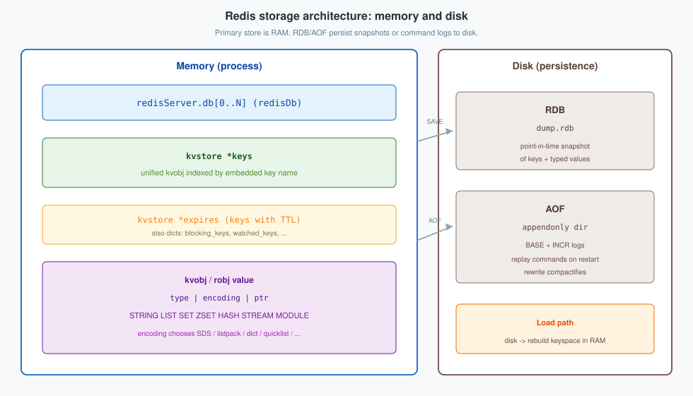
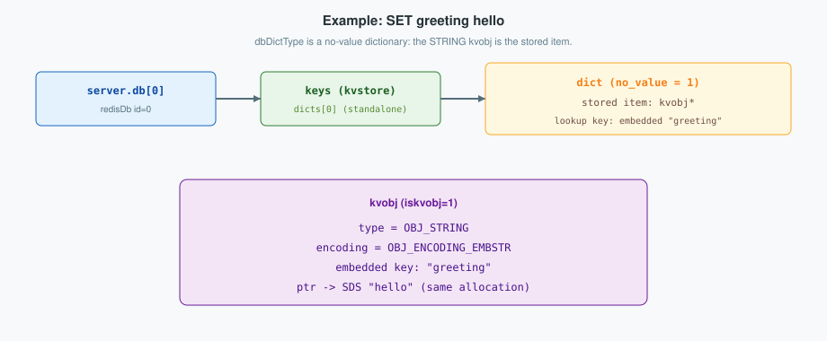
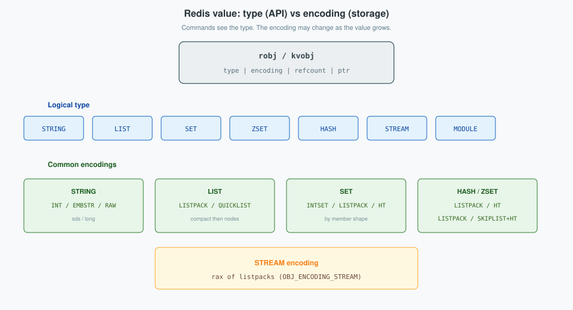
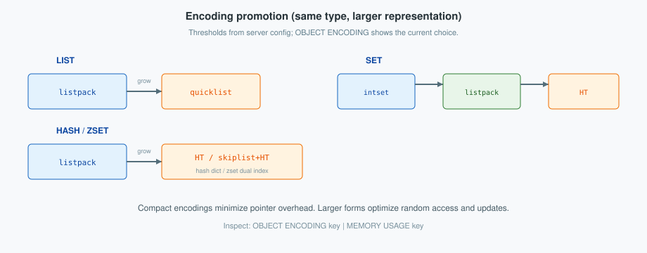
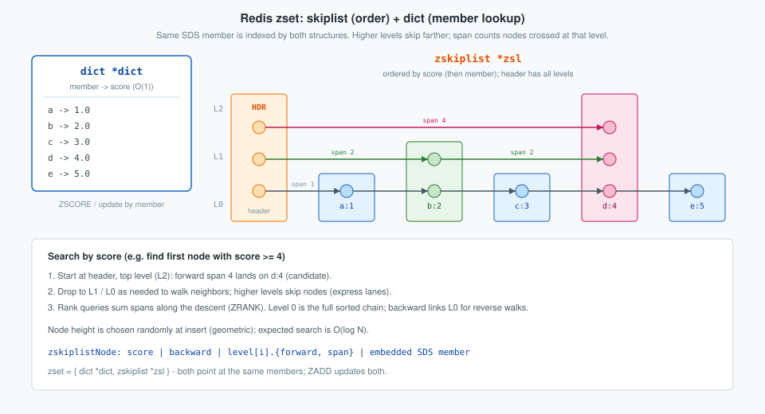

Redis stores the live keyspace in memory and may persist it to disk with RDB snapshots and AOF logs. Each value is a typed object (`robj` / `kvobj`): `type` is the client-visible contract, and `encoding` is the concrete in-memory representation. This post describes the storage architecture (memory hierarchy and disk persistence), then the per-type encodings and promotion rules (`git/redis`: `db.c`, `object.*`, `rdb.c`, `aof.c`, `t_*.c`).

<!--more-->

Related: [Network / command path](../architecture/), [Pub/Sub](../pubsub/), [Cluster bus](../cluster-bus/), [Build from source](../build/).



---

## 1. Storage architecture

The server process is the authoritative store for live data. Persistence reconstructs that keyspace after restart; ordinary command execution always reads and writes the in-memory object graph.

### 1.1 Memory hierarchy

| Layer | Structure | Role |
|-------|-----------|------|
| Process | `struct redisServer` | Server global state; owns `db` and `dbnum` |
| Database | `redisDb` | One logical database (`id` in `0 .. dbnum-1`) |
| Keyspace | `kvstore *keys` | Array of dictionaries indexing each unified `kvobj` |
| Expiry index | `kvstore *expires` | Subset of keys that have a timeout |
| Hash table | `dict` | Power-of-two buckets, chaining, incremental rehash |
| Value | `kvobj` / `robj` | `type`, `encoding`, `ptr`; key and metadata when `iskvobj` |

```plantuml
@startuml
!option handwritten true
skinparam class {
    BackgroundColor White
    BorderColor Black
    ArrowColor Black
}

struct redisServer {
  +db : redisDb*
  +dbnum : int
}

struct redisDb {
  +keys : kvstore*
  +expires : kvstore*
  +subexpires : estore*
  +blocking_keys : dict*
  +watched_keys : dict*
  +ready_keys : dict*
  +id : int
}

struct kvstore {
  +dicts : dict**
  +num_dicts : long long
  +num_dicts_bits : long long
  +key_count : unsigned long long
  +type : kvstoreType*
  +flags : int
}

struct dict {
  +ht : buckets
}

struct redisObject {
  +type : 4 bits
  +encoding : 4 bits
  +refcount
  +iskvobj : 1
  +metabits : 8
  +lru
  +ptr : void*
}

struct kvobj {
}

redisServer "1" *-- "N" redisDb : db
redisDb "1" *-- "1" kvstore : keys
redisDb "1" *-- "1" kvstore : expires
kvstore "1" *-- "num_dicts" dict : dicts
dict "1" --> "*" kvobj : entries
kvobj --|> redisObject : iskvobj + embedded key
@enduml
```

In standalone mode, `num_dicts == 1` and every key resides in `dicts[0]`. In Cluster mode, `dicts` is sized for hash slots so that keys of one slot share one dictionary (`kvstore.h`, `kvstore.c`).

#### 1.1.1 Process layer: `redisServer`

`server.c` declares a single global instance as the server global state. `struct redisServer` (`server.h`) holds process-wide configuration and runtime fields. For the keyspace hierarchy the relevant members are `db`, a contiguous array of logical databases, and `dbnum`, the total number of configured databases.

```c
/* server.h — abbreviated */
struct redisServer {
    /* General */
    redisDb *db;
    /* ... */
    int dbnum;  /* Total number of configured DBs */
    /* ... */
};

/* server.c */
struct redisServer server; /* Server global state */
```

A connected client does not own a database copy. `client.db` is a pointer to the currently selected `redisDb` (`SELECT`).

```c
/* server.h — abbreviated */
typedef struct client {
    redisDb *db;  /* Pointer to currently SELECTed DB. */
    /* ... */
} client;
```

At initialization Redis allocates `server.db` and constructs the indexes of each element:

```c
/* server.c — abbreviated initialization */
server.db = zmalloc(sizeof(redisDb) * server.dbnum);

int slot_count_bits = 0;
int flags = KVSTORE_ALLOCATE_DICTS_ON_DEMAND;
if (server.cluster_enabled) {
    slot_count_bits = CLUSTER_SLOT_MASK_BITS;
    flags |= KVSTORE_FREE_EMPTY_DICTS;
}

for (int j = 0; j < server.dbnum; j++) {
    server.db[j].keys =
        kvstoreCreate(&kvstoreExType, &dbDictType,
                      slot_count_bits, flags);
    server.db[j].expires =
        kvstoreCreate(&kvstoreBaseType, &dbExpiresDictType,
                      slot_count_bits, flags);
    server.db[j].id = j;
}
```

Command handlers resolve keys through `c->db`.

#### 1.1.2 Database layer: `redisDb`

`redisDb` is the Redis database representation (`server.h`). Multiple logical databases are identified by integers from 0 (the default) up to the configured maximum; that identifier is the structure’s `id` field.

```c
/* server.h — abbreviated */
typedef struct redisDb {
    kvstore *keys;       /* The keyspace for this DB */
    kvstore *expires;    /* Timeout of keys with a timeout set */
    estore *subexpires;  /* Timeout of sub-keys (currently hashes) */
    dict *blocking_keys; /* Keys with clients waiting for data (BLPOP) */
    dict *ready_keys;    /* Blocked keys that received a PUSH */
    dict *watched_keys;  /* WATCHED keys for MULTI/EXEC CAS */
    int id;              /* Database ID */
    long long avg_ttl;   /* Average TTL, for stats */
    unsigned long expires_cursor; /* Cursor of the active expire cycle */
    /* ... stream / unblock-on-nokey indexes ... */
} redisDb;
```

Field roles follow the source comments:

| Field | Summary |
|-------|---------|
| `keys` | Authoritative keyspace for this database; also carries key-size histogram metadata |
| `expires` | Index of keys that have a timeout set |
| `subexpires` | Index of sub-key timeouts; currently used for hash fields |
| `blocking_keys` / `ready_keys` | Coordinate clients blocked on keys (e.g. `BLPOP`) and wake them after a push |
| `watched_keys` | Track `WATCH` keys for optimistic `MULTI`/`EXEC` |
| `id` | Database number used by `SELECT`, persistence, and notifications |
| `avg_ttl` / `expires_cursor` | Expiry statistics and active-expire progress |

The remaining containers are secondary indexes or coordination structures; they do not duplicate value payloads. `expires` references the same `kvobj` instances stored in `keys`; the absolute expiry timestamp resides in metadata attached to that object (§1.1.6).

#### 1.1.3 Keyspace layer: `kvstore`

`kvstore` is an index-based key-value store implemented as an array of dictionaries (`kvstore.h`). Its purpose is to group all keys that share the same dictionary index so that those keys can be accessed together. In Cluster mode that index is the hash slot: each slot’s keys reside in a separate dictionary inside the kvstore, which simplifies slot-local scans, migration, and accounting.

```c
/* kvstore.c — abbreviated */
struct _kvstore {
    int flags;
    kvstoreType *type;
    dictType dtype;
    dict **dicts;
    long long num_dicts;
    long long num_dicts_bits;
    list *rehashing;             /* dictionaries currently rehashing */
    int allocated_dicts;         /* number of allocated dicts */
    int non_empty_dicts;         /* number of non-empty dicts */
    unsigned long long key_count;
    unsigned long long bucket_count;
    fenwickTree *dict_sizes;     /* cumulative key frequencies by dict index */
    /* ... */
};
```

`num_dicts` is a power of two:

```c
/* kvstore.c */
kvs->num_dicts_bits = num_dicts_bits;
kvs->num_dicts = 1 << kvs->num_dicts_bits;
kvs->dicts = zcalloc(sizeof(dict *) * kvs->num_dicts);
```

- Standalone: `num_dicts_bits == 0`, hence `num_dicts == 1` and every key uses `dicts[0]`.
- Cluster: the dictionary index equals the key’s hash slot.
- `KVSTORE_ALLOCATE_DICTS_ON_DEMAND` defers allocation of empty dictionaries; Cluster mode additionally sets `KVSTORE_FREE_EMPTY_DICTS`.
- `rehashing` tracks dictionaries undergoing incremental rehash; `dict_sizes` is a Fenwick tree of cumulative key frequencies used for size-weighted index selection when `num_dicts > 1`.

Lookup selects the slot, then queries that dictionary:

```c
/* db.c */
static kvobj *dbFindGeneric(kvstore *kvs, sds key) {
    dictEntry *de =
        kvstoreDictFind(kvs, getKeySlot(key), key);
    return de ? dictGetKey(de) : NULL;
}

kvobj *dbFind(redisDb *db, sds key) {
    return dbFindGeneric(db->keys, key);
}
```

Outside Cluster mode, `getKeySlot` returns `0`, so the path selects `dicts[0]`.

#### 1.1.4 Hash-table layer: `dict`

`dict` is Redis’s in-memory hash table (`dict.h`). It supports insert, delete, replace, find, and random-element operations; tables resize automatically, use power-of-two bucket counts, and resolve collisions by chaining.

```c
/* dict.h — abbreviated */
struct dict {
    dictType *type;
    dictEntry **ht_table[2];
    unsigned long ht_used[2];
    long rehashidx; /* -1 when not rehashing */
    unsigned pauserehash; /* >0 pauses rehashing */
    signed char ht_size_exp[2]; /* size = 1<<exp */
    int16_t pauseAutoResize;
    void *metadata[];
};
```

Behavior is parameterized by `dictType` (`dict.h`). The source groups members as callbacks, data, and flags. Callbacks are function pointers; flags are bit-fields that change entry layout:

```c
/* dict.h — abbreviated; section comments from source */
typedef struct dictType {
    /* Callbacks */
    uint64_t (*hashFunction)(const void *key);
    void *(*keyDup)(dict *d, const void *key);
    void *(*valDup)(dict *d, const void *obj);
    int (*keyCompare)(dictCmpCache *cache, const void *key1, const void *key2);
    void (*keyDestructor)(dict *d, void *key);
    void (*valDestructor)(dict *d, void *obj);
    int (*resizeAllowed)(size_t moreMem, double usedRatio);
    /* ... rehashingStarted, rehashingCompleted, bucketChanged,
     *     dictMetadataBytes ... */

    /* Data */
    void *userdata;

    /* Flags */
    unsigned int no_value:1;       /* values unused; dict acts as a set */
    unsigned int keys_are_odd:1;   /* required for no_value pointer tagging */
    unsigned int force_full_rehash:1;

    /* Callbacks (continued) */
    const void *(*keyFromStoredKey)(const void *key); /* lookup key from stored object */
    void (*onDictRelease)(dict *d);
    /* ... prefetchEntryKey, prefetchEntryValue ... */
} dictType;
```

| Kind | Member | Role for the database keyspace |
|------|--------|--------------------------------|
| Callback | `hashFunction` | Hash the lookup key (`dictSdsHash`) |
| Callback | `keyCompare` | Compare lookup key to stored key (`dictSdsCompareKV`) |
| Callback | `keyDestructor` | Free the stored `kvobj` (`dictDestructorKV`) |
| Callback | `keyFromStoredKey` | Extract SDS from stored `kvobj` (`kvGetKey`) |
| Flag | `no_value` | Values unused; stored item is the unified `kvobj` |
| Flag | `keys_are_odd` | Pointer-tagging mode for direct-key buckets |

Two bucket tables support incremental rehashing: lookups may consult both `ht_table[0]` and `ht_table[1]`, and ordinary operations advance `rehashidx` in small steps. Collision chains use `dictEntry` nodes (`next` and `key` occupy the first two fields so the no-value layout can share the same prefix):

```c
/* dict.c */
struct dictEntry {
    struct dictEntry *next;  /* Must be first */
    void *key;               /* Must be second */
    union {
        void *val;
        uint64_t u64;
        int64_t s64;
        double d;
    } v;
};
```

The database keyspace departs from the usual key/value layout. With flag `no_value = 1`, the table behaves as a set: `dictEntry.v` is unused, and the **stored key** is the unified `kvobj` (a `redisObject`). A lone key in a bucket may be stored directly without allocating a `dictEntry` (pointer tagging distinguishes entry pointers from direct keys).

`dictEntry` still uses `void *key` rather than `kvobj *` or `robj *` because `dict` is a generic hash table shared across Redis (SDS keys, hash fields, command tables, module maps, and so on). Polymorphism is provided by `dictType` callbacks, not by a typed pointer in `dictEntry`. For the keyspace specifically, the **lookup key** from a command is an SDS string (Simple Dynamic String — Redis’s length-prefixed, binary-safe string type; see §2.1), while the **stored key** is a `kvobj`; callback `keyFromStoredKey` (`kvGetKey`) extracts the embedded SDS so hash and compare can run on the lookup form. `dbDictType` in `server.c` wires that configuration:

```c
/* server.c — abbreviated */
dictType dbDictType = {
    /* Callbacks (positional) */
    dictSdsHash,          /* hashFunction */
    NULL,                 /* keyDup */
    NULL,                 /* valDup */
    dictSdsCompareKV,     /* keyCompare */
    dictDestructorKV,     /* keyDestructor */
    NULL,                 /* valDestructor */
    dictResizeAllowed,    /* resizeAllowed */
    /* Flags and later callbacks (designated) */
    .no_value = 1,                /* flag: unified kvobj, no separate value */
    .keys_are_odd = 0,            /* flag: kvobj pointer tagging mode */
    .keyFromStoredKey = kvGetKey, /* callback: SDS from stored kvobj */
};
```

#### 1.1.5 Value layer: `kvobj` / `robj`

`robj` (`struct redisObject`) is the fundamental in-memory container for Redis values (`object.h`). It carries:

- `type` — logical type (`OBJ_STRING`, `OBJ_LIST`, `OBJ_SET`, `OBJ_ZSET`, `OBJ_HASH`, `OBJ_STREAM`, `OBJ_MODULE`, …);
- `encoding` — how that value is represented in memory for the given type (`OBJ_ENCODING_*`);
- `lru` — LRU clock data, or LFU frequency/time bits when LFU eviction is enabled;
- `refcount` — reference counting for lifetime management;
- `ptr` — pointer to the underlying payload (SDS, dict, quicklist, …).

`kvobj` is the same structure used as a database key-value entry. When `iskvobj` is set, the **allocation** extends beyond `struct redisObject`:

- After the struct: the key SDS is embedded inline; for small strings the value SDS may follow the key.
- Before the struct: optional metadata **slots** (not members of `redisObject`). Up to eight slots exist, each 8 bytes. Which slots are present is recorded only by the `metabits` bit-field inside the struct (bit *i* means slot *i* is attached). Slot 0 holds the expiration timestamp; slots 1–7 are available for module key-metadata. Attached slots are laid out immediately before the `redisObject` header with higher IDs at lower addresses. `kvobjCreate` returns a pointer to that header, so callers see a normal `kvobj *` while the metadata bytes sit at negative offsets from it.

```text
/* Allocation layout when metabits has slots 3 and 1 set (bit pattern 0b00001010): */
| 8B slot 3 | 8B slot 1 | redisObject | key-hdr-size (1) | SDS key | [optional SDS value] |
                            ^
                            kvobj* returned here
```

`kvobjCreate` decides that layout from `keyMetaBits` and the key length. The number of prepended slots is the popcount of the bit mask; each slot is one `uint64_t`. The returned pointer is skewed past those slots so it addresses the `redisObject` header:

```c
/* keymeta.h */
static inline uint32_t getNumMeta(uint16_t metabits) {
    /* Assumed expire is always first meta */
    return __builtin_popcount(metabits);
}

/* object.c — abbreviated kvobjCreate */
kvobj *kvobjCreate(int type, const sds key, void *ptr, uint32_t keyMetaBits) {
    size_t key_sds_len = sdslen(key);
    /* Large keys reserve an expire slot even if EXPIRE is not set yet. */
    if (key_sds_len >= KEY_SIZE_TO_INCLUDE_EXPIRE_THRESHOLD)
        keyMetaBits |= KEY_META_MASK_EXPIRE;

    uint32_t sizeMetas = getNumMeta(keyMetaBits) * sizeof(uint64_t);

    char key_sds_type = sdsReqType(key_sds_len);
    size_t key_sds_size = sdsReqSize(key_sds_len, key_sds_type);

    size_t min_size = sizeof(robj);
    min_size += sizeMetas;
    min_size += 1 + key_sds_size; /* 1 byte: SDS header size of the embedded key */

    char *alloc = zmalloc(min_size);
    kvobj *kv = (kvobj *)(alloc + sizeMetas); /* skip metadata slots */
    /* ... fill type/encoding/ptr/refcount/iskvobj ... */
    kv->metabits = keyMetaBits;

    char *data = (void *)(kv + 1); /* bytes after the struct */
    *data++ = sdsHdrSize(key_sds_type);
    sdsnewplacement(data, key_sds_size, key_sds_type, key, key_sds_len);

    keyMetaResetValues(kv);
    return kv;
}
```

Accessors use the same convention. Metadata slot *i* is reached by counting how many lower IDs are set in `metabits` and indexing that many `uint64_t`s before `kv`. The embedded key starts one byte (header-size) after the struct:

```c
/* object.c — abbreviated */
uint64_t *kvobjMetaRef(kvobj *kv, int metaId) {
    uint32_t bits = kv->metabits;
    if (likely(metaId == 0))
        return ((uint64_t *)kv) - 1; /* expire is always adjacent */

    uint32_t maskId = 1u << metaId;
    uint32_t lowerMask = maskId - 1u;
    int metaSlot = __builtin_popcount(bits & lowerMask);
    return ((uint64_t *)kv) - metaSlot - 1;
}

sds kvobjGetKey(const kvobj *kv) {
    unsigned char *data = (void *)(kv + 1);
    uint8_t hdr_size = *data;
    data += 1 + hdr_size;
    return (sds)data;
}
```

`kvobjCreateEmbedString` uses the same size formula and adds the embedded value SDS after the key when the total fits a cache line (`kvobjSet`).

```c
/* object.h */
struct redisObject {
    unsigned type:4;
    unsigned encoding:4;
    unsigned refcount : OBJ_REFCOUNT_BITS;
    unsigned iskvobj : 1;   /* 1 if this struct serves as a kvobj base */
    /* metabits and lru are Relevant only when iskvobj is set: */
    unsigned metabits :8;  /* Bitmap of metadata (+expiry) attached to this kvobj */
    unsigned lru:LRU_BITS; /* LRU time or LFU data */
    void *ptr;
};
typedef struct redisObject robj;   /* general-purpose object */
typedef struct redisObject kvobj;  /* key-value object; see layout above */
```

| Field | Meaning |
|-------|---------|
| `type` | Logical type; command type checks use this field |
| `encoding` | Current representation; may change without changing `type` |
| `ptr` | Payload or inline integer |
| `refcount` | Lifetime management; special values mark shared or stack objects |
| `lru` | LRU clock, or LFU bits when LFU eviction is enabled |
| `metabits` | Bitmap of which 8-byte metadata **slots** precede the struct in the allocation; bit 0 = expiration |

On insertion, `kvobjSet` constructs the database form and transfers or duplicates the payload. The EMBSTR path may embed key and value in one allocation when the total size fits a cache line:

```c
/* object.c — abbreviated; EMBSTR branch of kvobjSet */
if (val->type == OBJ_STRING &&
    val->encoding == OBJ_ENCODING_EMBSTR) {
    size_t len = sdslen(val->ptr);
    size_t size = sizeof(kvobj);
    size += sdslen(key) + 3;
    size += 4 + len;

    if (size <= CACHE_LINE_SIZE)
        kv = kvobjCreateEmbedString(
            val->ptr, len, key, keyMetaBits);
    else
        kv = kvobjCreate(
            OBJ_STRING, key,
            sdsnewlen(val->ptr, len), keyMetaBits);
}
```

For other encodings, `kvobjSet` transfers or duplicates `val->ptr`, creates a `kvobj`, copies encoding and LRU fields, and decrements the previous value’s reference count. The resulting `kvobj` owns both the database key and the value representation.

#### 1.1.6 Expiry index and metadata

Expiry is not stored as a separate key-to-timestamp mapping in `db->expires`. Redis attaches the timestamp to metadata preceding the `kvobj`, then inserts that same object into the expiry index:

```c
/* db.c — abbreviated */
kvobj *kv = dictGetKV(*keyLink);
kvobj *kvnew = kvobjSetExpire(kv, when);

/* Adding metadata may reallocate the object. */
if (kv != kvnew) {
    kvstoreDictSetAtLink(
        db->keys, slot, kvnew, &keyLink, 0);
    kv = kvnew;
}

/* Index the current kvobj among expiring keys. */
kvstoreDictAddRaw(db->expires, slot, kv, NULL);
```

If attaching expiry metadata reallocates the object, Redis updates the `keys` index before inserting into `expires`, so both indexes refer to one current `kvobj` identity.

#### 1.1.7 Lookup and insertion

Read path:

```text
client->db
  -> redisDb.keys
  -> kvstore.dicts[getKeySlot(key)]
  -> dict hash lookup
  -> stored kvobj
  -> kvobj.type / encoding / ptr
```

Insertion packages key and value, then stores the result:

```c
/* db.c — abbreviated */
kvobj *dbAddInternal(redisDb *db, robj *key, robj **valref,
                     dictEntryLink *link,
                     const KeyMetaSpec *keymeta)
{
    int slot = getKeySlot(key->ptr);
    kvobj *kv = kvobjSet(key->ptr, *valref, keymeta->metabits);
    initObjectLRUOrLFU(kv);
    kvstoreDictSetAtLink(db->keys, slot, kv, link, 1);
    *valref = kv;
    return kv;
}
```

Subsequent steps may attach expiry or module metadata, emit readiness and keyspace notifications, update size histograms, and account per-slot memory when Cluster mode is enabled.

#### Example: `SET greeting hello`

```bash
SET greeting hello
```

`setCommand` (`t_string.c`) constructs a string object for `hello` and calls `setKey` / `dbAdd*` so that the key is inserted into the selected database’s `keys` kvstore.

| Step | Location | Effect |
|------|----------|--------|
| 1 | `server.db[0]` | Default database (`SELECT 0`) |
| 2 | `db->keys` | `kvstore` with one dictionary in standalone mode |
| 3 | `dicts[0]` | `dbDictType` stores the `kvobj` as a no-value dictionary key; comparison extracts the embedded key `greeting` |
| 4 | `kvobj` | `type = OBJ_STRING`; for this short pair, key and EMBSTR value share one allocation |

```plantuml
@startuml
!option handwritten true
skinparam object {
    BackgroundColor White
    BorderColor Black
    ArrowColor Black
}

object "redisDb id=0" as db {
  keys = kvstore*
}

object "kvstore keys" as kvs {
  num_dicts = 1
  dicts[0] = dict*
}

object "dict" as d {
  no_value = 1
  stored key = kvobj*
  lookup key = "greeting"
}

object "kvobj" as kv {
  type = OBJ_STRING
  encoding = EMBSTR
  key = "greeting"
  ptr -> SDS "hello"
}

db *-- kvs
kvs *-- d
d *-- kv : unified stored item
@enduml
```



`OBJECT ENCODING greeting` reports `embstr`. A small integer such as `SET n 1` may use `encoding = INT` instead of SDS. `SET` with `EX` or `PX` attaches expiration metadata and registers the same `kvobj` in `db->expires`.



| `type` (API) | Representative commands | Encodings in this tree |
|--------------|-------------------------|------------------------|
| `OBJ_STRING` | `SET`, `GET`, `INCR` | `INT`, `EMBSTR`, `RAW` |
| `OBJ_LIST` | `LPUSH`, `LRANGE` | `LISTPACK`, `QUICKLIST` |
| `OBJ_SET` | `SADD`, `SINTER` | `INTSET`, `LISTPACK`, `HT` |
| `OBJ_ZSET` | `ZADD`, `ZRANGE` | `LISTPACK`, `SKIPLIST` (+ dict) |
| `OBJ_HASH` | `HSET`, `HGETALL` | `LISTPACK`, `LISTPACK_EX`, `HT` |
| `OBJ_STREAM` | `XADD`, `XREAD` | `STREAM` (rax of listpacks) |
| `OBJ_MODULE` | module APIs | module-defined |

### 1.2 Disk persistence

| Mechanism | On-disk form | Contents | Load behavior |
|-----------|--------------|----------|---------------|
| RDB | Snapshot file (e.g. `dump.rdb`) | Serialized keys and typed values at a point in time | Rebuild the keyspace from the snapshot |
| AOF | Directory of BASE and INCR files | Log of write commands, plus rewrite output | Replay commands to reconstruct memory |
| RDB and AOF | Both configured | On restart AOF is preferred when present; RDB remains useful for replicas and backups | See `INFO persistence` and configuration |

RDB (`rdb.c`) walks the keyspace and writes type-tagged encodings, including legacy ziplist forms that are converted on load. AOF (`aof.c`) appends to an in-memory `aof_buf` and flushes according to `appendfsync`; rewrite produces a compact BASE that reflects current data. Neither path is the hot read path: commands always operate on the in-memory `kvobj`.

Replication transmits a base dataset to replicas using RDB (and related channels). That is a network use of the snapshot format, not a second storage model.

### 1.3 Boundaries

- Pub/Sub messages are not keys; they do not appear in `keys`, RDB, or AOF as values (see [Pub/Sub](../pubsub/)).
- Disk files are durable copies or logs; they do not maintain a live object graph beside RAM.
- Cluster slot ownership moves keys between nodes; each node stores its subset with the same memory and disk design (see [Cluster bus](../cluster-bus/)).

---

## 2. Data type implementations

Clients do not select an encoding. Redis begins with a compact representation and **promotes** when entry count, element size, or integer-only constraints are violated. The logical `type` remains unchanged. Promotion thresholds below are the defaults from `config.c` (overridable) unless noted otherwise.



### 2.1 String

`OBJ_STRING` (`t_string.c`). Client operations:

| Kind | Commands |
|------|----------|
| Write | `SET`, `SETNX`, `SETEX`, `PSETEX`, `MSET`, `MSETNX`, `APPEND`, `GETSET` / `SET` `GET` |
| Read | `GET`, `MGET`, `GETRANGE`, `STRLEN`, `GETDEL`, `GETEX` |
| Integer / float | `INCR`, `INCRBY`, `INCRBYFLOAT`, `DECR`, `DECRBY` |
| Bit / substring | `SETBIT`, `GETBIT`, `BITCOUNT`, `BITOP`, `BITPOS`, `BITFIELD`, `SETRANGE` |

String keys and values are built on **SDS** (Simple Dynamic String), Redis’s dynamic string library (`sds.h` / `sds.c`). An `sds` value is typed as `char *` and points at the character buffer (`buf`), not at the header. The header sits immediately before that pointer and stores used length (`len`), allocated capacity (`alloc`), and a `flags` byte that encodes the header width. The buffer is always null-terminated, so it remains usable as a C string, yet `sdslen` is O(1) and the payload may contain embedded `\0` bytes (binary-safe).

```text
/* Memory for one SDS string (sdshdr8 example): */
| len | alloc | flags | buf ... '\0' |
                      ^
                      sds pointer (typedef char *sds)
```

```c
/* sds.h */
typedef char *sds;

struct __attribute__ ((__packed__)) sdshdr8 {
    uint8_t len;         /* used length of buf */
    uint8_t alloc;       /* allocated capacity, excluding header and '\0' */
    unsigned char flags; /* low 3 bits: header type (8/16/32/64) */
    char buf[];
};
/* sdshdr16 / sdshdr32 / sdshdr64 widen len and alloc for longer strings. */
```

Redis selects the smallest header type that fits the length (`sdsReqType`). That same SDS representation is used for database key names embedded in `kvobj`, for `OBJ_STRING` payloads (`EMBSTR` / `RAW`), and for many other string-like keys throughout the server.

| Encoding | Payload | Condition |
|----------|---------|-----------|
| `INT` | `long` in `ptr` | Value admits integer encoding |
| `EMBSTR` | Object header and SDS in one allocation | Length ≤ `OBJ_ENCODING_EMBSTR_SIZE_LIMIT` (44) |
| `RAW` | Separate SDS allocation | Larger strings, or strings mutated in place |

Promotion and limits (`object.c`, `t_string.c`):

- Shared integers occupy `0 .. OBJ_SHARED_INTEGERS-1` (10000) and avoid per-key allocations.
- `EMBSTR` is used only while length ≤ 44 and the string is not mutated in place.
- Growth, append, or in-place mutation promotes `EMBSTR` (or a former `INT` that no longer fits) to `RAW`.
- `INCR` prefers integer encoding when the result remains an integer.

`EMBSTR` keeps the SDS bytes in the same allocation as the `kvobj` / `robj`. `RAW` stores `ptr` as a separately allocated SDS.

### 2.2 List

`OBJ_LIST` (`t_list.c`). Client operations:

| Kind | Commands |
|------|----------|
| Push / pop ends | `LPUSH`, `RPUSH`, `LPUSHX`, `RPUSHX`, `LPOP`, `RPOP`, `LMPOP` |
| Blocking | `BLPOP`, `BRPOP`, `BLMPOP`, `BRPOPLPUSH` / `BLMOVE`, `LMOVE` |
| Access / mutate | `LINDEX`, `LSET`, `LINSERT`, `LREM`, `LTRIM`, `LRANGE` |
| Length / position | `LLEN`, `LPOS` |

| Encoding | Structure |
|----------|-----------|
| `LISTPACK` | Single contiguous listpack |
| `QUICKLIST` | Doubly linked list of listpack nodes (`quicklist.c`); interior nodes may be LZF-compressed |

A list value is a sequence of elements. While it stays compact, Redis stores that sequence as one **listpack** (`listpack.h` / `listpack.c`): a contiguous byte array of string or integer entries. When the structure grows past the configured fill limit, `t_list.c` converts through `listTypeTryConversion*` into a **quicklist** whose nodes each hold a listpack (or a plain/LZF-compressed buffer). End operations remain O(1); mid-list access walks nodes.

#### Why quicklist

Redis lists are often used as queues (`LPUSH`/`RPOP`, `BLPOP`, …), so the hot path is the **ends**, not middle insert. Lists still expose mid-list commands (`LINDEX`, `LSET`, `LINSERT`, `LREM`, `LTRIM`, `LRANGE`, `LPOS`), but those are not why quicklist exists.

A single contiguous listpack is already a problem for **end** updates once it grows:

- `lpPrepend` (used by `LPUSH`) inserts after the 6-byte header and must `memmove` every existing entry.
- Growth also reallocates one ever-larger buffer.
- So even a pure queue on one giant listpack would copy O(list size) bytes on each push at the head.

A classical doubly linked list of elements (`adlist`) makes both ends O(1) without copying neighbors, but wastes memory on per-element pointers.

**Quicklist** is the hybrid for that queue-shaped workload: a doubly linked list of **small** listpacks. `LPUSH` / `LPOP` usually touch only `head`; `RPUSH` / `RPOP` only `tail`. When the head node is full (per `list-max-listpack-size`, default `-2` ≈ 8 KiB), Redis links a new head node instead of shifting the whole list. Mutation may still `memmove` inside one node, but that cost is bounded by the fill limit. Interior nodes can be LZF-compressed (`list-compress-depth`) because a queue rarely touches them. Very large single elements use a **PLAIN** node so they do not inflate a packed neighbor listpack.

Mid-list commands still work by walking nodes and operating inside one listpack; they remain more expensive than end ops, and that is expected. Quicklist’s primary win is keeping **end** operations cheap and memory compact as the list grows—not making middle mutation free.

#### Listpack layout

A listpack is a single allocation with a fixed header, zero or more entries, and a terminating `LP_EOF` byte:

```text
| total-bytes (4) | num-elements (2) | entry … entry | EOF (0xFF) |
|<-------- LP_HDR_SIZE = 6 -------->|
```

```c
/* listpack.c */
#define LP_HDR_SIZE 6       /* 32-bit total length + 16-bit element count */
#define LP_EOF 0xFF

unsigned char *lpNew(size_t capacity) {
    unsigned char *lp = lp_malloc(
        capacity > LP_HDR_SIZE+1 ? capacity : LP_HDR_SIZE+1);
    lpSetTotalBytes(lp, LP_HDR_SIZE+1);
    lpSetNumElements(lp, 0);
    lp[LP_HDR_SIZE] = LP_EOF;
    return lp;
}
```

Each entry is self-describing: an encoding byte (and optional length bytes), the payload, then a **backlen** — a reverse-encoded length of the whole entry so `lpPrev` can walk backward without a separate index:

```text
| encoding [+ len] | payload | backlen |
```

Integers that fit use a compact integer encoding (7-bit through 64-bit); other values use a string encoding with a 6-bit, 12-bit, or 32-bit length prefix (`lpEncodeGetType` / `lpEncodeIntegerGetType`). Decoded entries are exposed as `listpackEntry`:

```c
/* listpack.h */
typedef struct {
    unsigned char *sval;  /* string pointer; NULL if integer */
    uint32_t slen;
    long long lval;       /* used when sval == NULL */
} listpackEntry;
```

Navigation and mutation use opaque pointers into the byte array (`lpFirst`, `lpNext`, `lpPrev`, `lpAppend`, `lpInsertString` / `lpInsertInteger`, `lpDelete`). Insertions and deletions may reallocate and memmove the tail, which is why lists eventually split into quicklist nodes rather than growing one unbounded listpack.

The same listpack format is reused as the compact encoding for small sets, hashes, and sorted sets, and as the packed payload under each stream rax leaf.

#### Promotion and `list-max-listpack-size`

| Config | Default | Effect |
|--------|---------|--------|
| `list-max-listpack-size` | -2 | Fill limit for each listpack (standalone or inside a quicklist node) |

The value is the quicklist **fill** factor passed to `quicklistNodeLimit` / `quicklistNodeExceedsLimit` (`quicklist.c`). Its sign selects the limit kind:

- **Non-negative** (`fill >= 0`): limit by **element count** (at most `fill` entries per node; `0` means 1).
- **Negative** (`fill < 0`): limit by **byte size**. Redis maps the value onto a fixed size table:

```c
/* quicklist.c */
static const size_t optimization_level[] = {4096, 8192, 16384, 32768, 65536};

/* Calculate the size limit of the quicklist node based on negative 'fill'. */
static size_t quicklistNodeNegFillLimit(int fill) {
    assert(fill < 0);
    size_t offset = (-fill) - 1;   /* -1 → 0, -2 → 1, … */
    size_t max_level = sizeof(optimization_level) / sizeof(*optimization_level);
    if (offset >= max_level) offset = max_level - 1;
    return optimization_level[offset];
}
```

| `list-max-listpack-size` | Meaning |
|--------------------------|---------|
| `-1` | ≈ 4 KiB per listpack |
| `-2` (default) | ≈ 8 KiB per listpack |
| `-3` | ≈ 16 KiB |
| `-4` | ≈ 32 KiB |
| `-5` or lower | ≈ 64 KiB (table capped) |
| `N >= 0` | At most `N` elements per listpack (`0` ⇒ 1) |

So `-2` is not an error code: it selects the second size class (8192 bytes), the recommended default noted beside `SIZE_SAFETY_LIMIT` in `quicklist.c`. When a node would exceed that limit, Redis starts a new quicklist node rather than enlarging the current listpack further.

#### Quicklist

A quicklist bounds per-node size while preserving O(1) insertion at both ends:

```c
/* quicklist.h — abbreviated */
typedef struct quicklistNode {
    struct quicklistNode *prev;
    struct quicklistNode *next;
    unsigned char *entry;        /* a listpack, or LZF-compressed buffer */
    size_t sz;                   /* entry size in bytes */
    unsigned int count : 16;     /* items in this node's listpack */
    unsigned int encoding : 2;   /* RAW==1 or LZF==2 */
    unsigned int container : 2;  /* PLAIN==1 or PACKED==2 */
    /* ... compression bookkeeping bits ... */
} quicklistNode;

typedef struct quicklist {
    quicklistNode *head;
    quicklistNode *tail;
    unsigned long count;  /* total entries across all nodes */
    unsigned long len;    /* number of quicklistNodes */
    signed int fill : QL_FILL_BITS;       /* per-node fill factor */
    unsigned int compress : QL_COMP_BITS; /* uncompressed end depth */
    /* ... */
} quicklist;
```

### 2.3 Set

`OBJ_SET` (`t_set.c`). Client operations:

| Kind | Commands |
|------|----------|
| Membership | `SADD`, `SREM`, `SISMEMBER`, `SMISMEMBER`, `SCARD` |
| Retrieve | `SMEMBERS`, `SSCAN`, `SRANDMEMBER`, `SPOP` |
| Set algebra | `SINTER`, `SINTERSTORE`, `SINTERCARD`, `SUNION`, `SUNIONSTORE`, `SDIFF`, `SDIFFSTORE` |
| Move | `SMOVE` |

| Encoding | Constraint |
|----------|------------|
| `INTSET` | All members are integers; size ≤ `set-max-intset-entries` |
| `LISTPACK` | Small non-integer sets within listpack limits |
| `HT` | `dict` after conversion |

Promotion and limits:

| Config | Default | Effect |
|--------|---------|--------|
| `set-max-intset-entries` | 512 | Maximum size of an integer-only intset |
| `set-max-listpack-entries` | 128 | Maximum entry count in a set listpack |
| `set-max-listpack-value` | 64 | Maximum member size in a set listpack |

`setTypeConvert*` in `t_set.c` promotes when a non-integer member arrives (intset → listpack or HT) or when the configured entry/value limits are exceeded (listpack → HT).

An intset stores sorted fixed-width integers in one contiguous block. `encoding` selects the element width (16, 32, or 64 bits); `contents` is a flexible array reinterpreted at that width. Membership tests use binary search:

```c
/* intset.h */
typedef struct intset {
    uint32_t encoding;   /* INTSET_ENC_INT16 / INT32 / INT64 */
    uint32_t length;     /* number of elements */
    int8_t contents[];   /* sorted elements, reinterpreted per encoding */
} intset;
```

### 2.4 Sorted set

`OBJ_ZSET` (`t_zset.c`). Client operations:

| Kind | Commands |
|------|----------|
| Add / update | `ZADD`, `ZINCRBY`, `ZREM`, `ZMSCORE` |
| By rank | `ZRANGE`, `ZREVRANGE`, `ZRANK`, `ZREVRANK`, `ZREMRANGEBYRANK` |
| By score | `ZRANGEBYSCORE`, `ZREVRANGEBYSCORE`, `ZCOUNT`, `ZREMRANGEBYSCORE` |
| By lex | `ZRANGEBYLEX`, `ZREVRANGEBYLEX`, `ZLEXCOUNT`, `ZREMRANGEBYLEX` |
| Pop / block | `ZPOPMIN`, `ZPOPMAX`, `BZPOPMIN`, `BZPOPMAX`, `ZMPOP`, `BZMPOP` |
| Store / union | `ZUNION`, `ZUNIONSTORE`, `ZINTER`, `ZINTERSTORE`, `ZINTERCARD`, `ZDIFF`, `ZDIFFSTORE`, `ZRANDMEMBER`, `ZSCAN`, `ZCARD`, `ZSCORE` |

| Encoding | Structure |
|----------|-----------|
| `LISTPACK` | Member/score pairs for small sorted sets |
| `SKIPLIST` | Skiplist for order plus `dict` for member-to-score lookup; members are shared SDS |

Promotion and limits:

| Config | Default | Effect |
|--------|---------|--------|
| `zset-max-listpack-entries` | 128 | Maximum entry count in a zset listpack |
| `zset-max-listpack-value` | 64 | Maximum member size in a zset listpack |

When either limit is exceeded, `t_zset.c` converts the listpack into a `zset` (`SKIPLIST` encoding): a `dict` provides expected O(1) score-by-member lookup, and a `zskiplist` supports ordered range queries. Both structures index the same SDS member. Each skiplist node stores a score and a variable-height `level[]` array of forward pointers and spans:



Level 0 is a doubly linked chain of every member in score order (`forward` / `backward`). Higher levels are sparse express lanes: each `level[i].forward` skips ahead, and `level[i].span` counts how many level-0 nodes that hop crosses (used for `ZRANK`). A new node’s height is chosen randomly at insert, so search and rank are expected O(log N).

```c
/* server.h */
typedef struct zskiplistNode {
    double score;
    struct zskiplistNode *backward;
    struct zskiplistLevel {
        struct zskiplistNode *forward;
        unsigned long span;  /* elements skipped at this level */
    } level[];
    /* sds member embedded after level[] */
} zskiplistNode;

typedef struct zskiplist {
    struct zskiplistNode *header, *tail;
    unsigned long length;
    int level;
    size_t alloc_size;
} zskiplist;

typedef struct zset {
    dict *dict;      /* member -> score */
    zskiplist *zsl;  /* score order */
} zset;
```

Ordered operations are O(log N); score lookup by member is expected O(1) via the dictionary.

#### Add (`ZADD`)

Membership is checked in the dict first. A new member is inserted into the skiplist, then the node pointer is stored in the dict (the SDS member lives in the skiplist node):

```c
/* t_zset.c — abbreviated SKIPLIST branch of zsetAdd */
zset *zs = zobj->ptr;
dictEntryLink bucket = NULL;
dictEntryLink link = dictFindLink(zs->dict, ele, &bucket);

if (link != NULL) {
    /* Member already present: maybe zslUpdateScore after NX/XX/GT/LT checks. */
    zskiplistNode *znode = dictGetKey(*link);
    /* ... */
} else if (!xx) {
    zskiplistNode *znode = zslInsert(zs->zsl, score, ele);
    dictSetKeyAtLink(zs->dict, znode, &bucket, 1);
}
```

`zslInsert` picks a random height, allocates the node, then `zslInsertNode` walks from the top level to find predecessors and rewires `forward` / `span`:

```c
/* t_zset.c — abbreviated */
zskiplistNode *zslInsert(zskiplist *zsl, double score, sds ele) {
    int level = zslRandomLevel();
    zskiplistNode *node = zslCreateNode(zsl, level, score, ele);
    zslInsertNode(zsl, node);
    return node;
}

static void zslInsertNode(zskiplist *zsl, zskiplistNode *node) {
    zskiplistNode *update[ZSKIPLIST_MAXLEVEL];
    unsigned long rank[ZSKIPLIST_MAXLEVEL];
    zskiplistNode *x = zsl->header;
    double score = node->score;
    sds ele = zslGetNodeElement(node);
    int level = zslGetNodeInfo(node)->levels;
    int i;

    for (i = zsl->level - 1; i >= 0; i--) {
        rank[i] = i == (zsl->level - 1) ? 0 : rank[i + 1];
        while (zslCompareWithNode(score, ele, x->level[i].forward) > 0) {
            rank[i] += zslGetNodeSpanAtLevel(x, i);
            x = x->level[i].forward;
        }
        update[i] = x;
    }
    /* Raise skiplist height if needed, then splice node into each level
     * and adjust spans / backward / length. */
    /* ... */
}
```

#### Check / lookup

By member (`ZSCORE`, existence): use the dict, not a skiplist scan.

```c
/* t_zset.c — abbreviated */
int zsetScore(robj *zobj, sds member, double *score) {
    if (zobj->encoding == OBJ_ENCODING_SKIPLIST) {
        zset *zs = zobj->ptr;
        dictEntry *de = dictFind(zs->dict, member);
        if (de == NULL) return C_ERR;
        zskiplistNode *znode = dictGetKey(de);
        *score = znode->score;
        return C_OK;
    }
    /* LISTPACK: zzlFind(...) */
}
```

By rank (`ZRANGE` by index / `ZRANK` path): walk spans from the header downward until the traversed rank matches.

```c
/* t_zset.c — abbreviated */
static zskiplistNode *zslGetElementByRankFromNode(
        zskiplistNode *start_node, int start_level, unsigned long rank)
{
    zskiplistNode *x = start_node;
    unsigned long traversed = 0;
    int i;

    for (i = start_level; i >= 0; i--) {
        while (x->level[i].forward &&
               (traversed + zslGetNodeSpanAtLevel(x, i)) <= rank)
        {
            traversed += zslGetNodeSpanAtLevel(x, i);
            x = x->level[i].forward;
        }
        if (traversed == rank)
            return x;
    }
    return NULL;
}

zskiplistNode *zslGetElementByRank(zskiplist *zsl, unsigned long rank) {
    return zslGetElementByRankFromNode(zsl->header, zsl->level - 1, rank);
}
```

### 2.5 Hash

`OBJ_HASH` (`t_hash.c`). Client operations:

| Kind | Commands |
|------|----------|
| Field write | `HSET`, `HMSET`, `HSETNX`, `HINCRBY`, `HINCRBYFLOAT` |
| Field read | `HGET`, `HMGET`, `HGETALL`, `HKEYS`, `HVALS`, `HEXISTS`, `HLEN`, `HSTRLEN`, `HRANDFIELD`, `HSCAN` |
| Field delete | `HDEL` |
| Field expiry | `HEXPIRE`, `HPEXPIRE`, `HEXPIREAT`, `HPEXPIREAT`, `HTTL`, `HPTTL`, `HPERSIST`, `HGETEX`, `HSETEX` |

| Encoding | Structure |
|----------|-----------|
| `LISTPACK` | Alternating field and value entries |
| `LISTPACK_EX` | Listpack with per-field metadata |
| `HT` | `dict` mapping field to value |

Promotion and limits:

| Config | Default | Effect |
|--------|---------|--------|
| `hash-max-listpack-entries` | 512 | Maximum field count in a hash listpack |
| `hash-max-listpack-value` | 64 | Maximum field or value bytes in a hash listpack |

`hashTypeConvert` in `t_hash.c` converts listpack (or `LISTPACK_EX`) to `HT` when either limit is exceeded. The `HT` encoding reuses the `dict` structure defined in §1.1.4.

### 2.6 Stream

`OBJ_STREAM` / `OBJ_ENCODING_STREAM` (`stream.h`, `t_stream.c`). Client operations:

| Kind | Commands |
|------|----------|
| Append / trim | `XADD`, `XTRIM`, `XDEL`, `XLEN` |
| Read | `XRANGE`, `XREVRANGE`, `XREAD`, `XREADGROUP` |
| Groups / consumers | `XGROUP CREATE` / `DESTROY` / `CREATECONSUMER` / `DELCONSUMER` / `SETID`, `XINFO STREAM` / `GROUPS` / `CONSUMERS` |
| Pending / claim | `XPENDING`, `XACK`, `XCLAIM`, `XAUTOCLAIM` |
| Misc | `XSETID` |

| Field | Role |
|-------|------|
| `rax` | Radix tree from stream IDs to listpacks of entries |
| `length` | Current entry count |
| `first_id` / `last_id` | ID bounds |
| Groups / PEL | Consumer-group state beside the entry tree |

Entries are keyed by a 128-bit `streamID` (millisecond timestamp and sequence) inside a radix tree. Each rax leaf packs many entries into a listpack. Consumer groups are indexed in separate rax trees:

```c
/* stream.h — abbreviated */
typedef struct streamID {
    uint64_t ms;   /* Unix time in milliseconds */
    uint64_t seq;  /* sequence within the millisecond */
} streamID;

typedef struct stream {
    rax *rax;              /* radix tree: ID -> listpack of entries */
    uint64_t length;       /* current number of entries */
    streamID last_id;      /* last inserted ID */
    streamID first_id;     /* first non-tombstone entry */
    uint64_t entries_added;/* all-time inserts */
    rax *cgroups;          /* consumer groups: name -> streamCG */
    /* ... */
} stream;
```

Streams do not use a listpack→HT promotion path. Growth adds rax nodes and listpacks; there is no `*-max-listpack-*` threshold that switches the stream encoding itself.

### 2.7 Shared building blocks

| Structure | Files | Used by |
|-----------|-------|---------|
| SDS (Simple Dynamic String) | `sds.h`, `sds.c` | Binary-safe length-prefixed strings: keys, string values, zset members |
| listpack | `listpack.h`, `listpack.c` | Compact entry sequences (§2.2); also set/hash/zset encodings and stream leaves |
| quicklist | `quicklist.c` | List nodes (each node holds a listpack) |
| dict | `dict.c` | Hash and set `HT`; zset index; many maps |
| intset | `intset.c` | Integer sets |
| rax | `rax.c` | Stream IDs |
| skiplist | `t_zset.c` | Sorted-set order |

Listpack replaced ziplist for newly written data. RDB may still load legacy ziplist encodings and convert them on read.

---

## 3. Implementation map

### 3.1 Key files

| Concern | Files |
|---------|-------|
| Database / keyspace | `db.c`, `kvstore.c`, `server.h` (`redisDb`) |
| Objects | `object.h`, `object.c` |
| Persistence | `rdb.c`, `aof.c` |
| Types | `t_string.c`, `t_list.c`, `t_set.c`, `t_zset.c`, `t_hash.c`, `t_stream.c` |
| Encodings | `listpack.c`, `quicklist.c`, `dict.c`, `intset.c`, `rax.c` |
| Limits | `config.c` (`*-max-listpack-*`, …) |

### 3.2 Creation and conversion

Factories in `object.c` establish the initial encoding (`createStringObject`, `createHashObject`, `createZsetListpackObject`, …). Type modules invoke `*Convert*` when a write exceeds compact limits, then continue through type-level helpers (`listTypePush`, `hashTypeSet`, `zsetAdd`, …).

### 3.3 Observability

```bash
TYPE mykey
OBJECT ENCODING mykey
MEMORY USAGE mykey
INFO persistence
LASTSAVE
```

### 3.4 Scope

- Geo commands store geohash scores in sorted sets; they do not introduce a separate `OBJ_*` type.
- Bitmaps and HyperLogLog are layered on strings or modules and lie outside the encoding matrix above.
- This source tree also defines `OBJ_ARRAY` and `OBJ_GCRA`; those typed objects are outside the classic client types covered here.

---

| Topic | Summary |
|-------|---------|
| Architecture | Memory: `redisDb` → `kvstore` → `kvobj`; disk: RDB snapshot and AOF log/replay |
| Data types | Per-type encodings and promotion; stream rax; shared listpack, dict, and skiplist |
| Implementation | `db` / `object` / `rdb` / `aof` / `t_*`; inspect with `TYPE` and `OBJECT ENCODING` |
