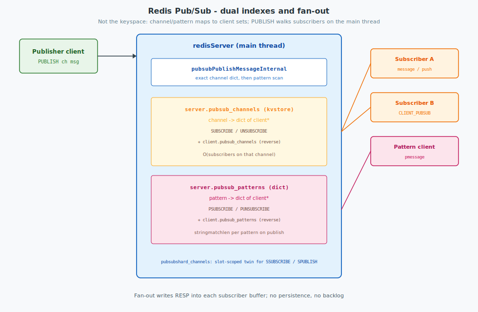
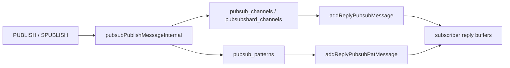
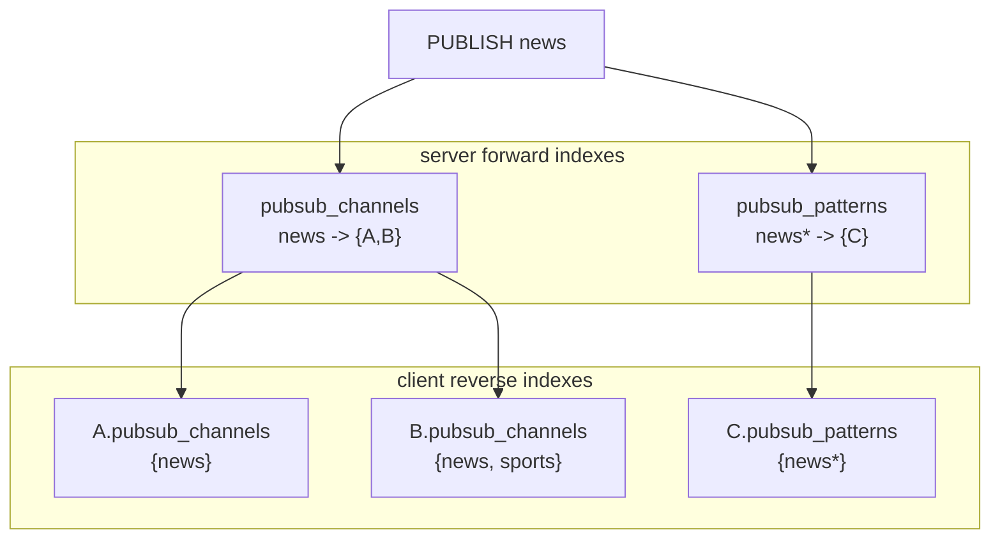
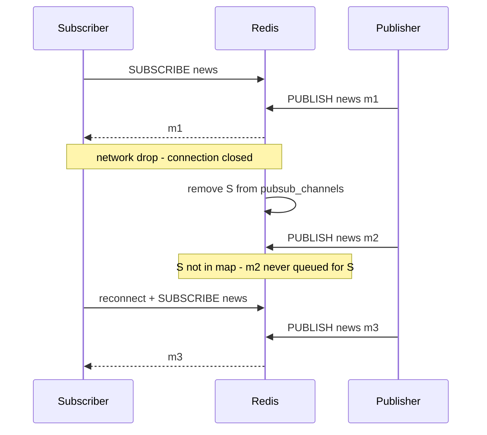

Redis Pub/Sub is an in-process fan-out over named channels and glob patterns. It is not the keyspace: messages are not stored as keys, have no TTL or RDB/AOF payload of their own, and are delivered only to clients that are subscribed at publish time. Delivery is best-effort (no server retry across disconnect). This post maps the structures, command paths, and delivery/security properties in `git/redis` (`pubsub.c`, fields on `redisServer` / `client`).

<!--more-->

Related: [Network / command path](../architecture/), [Cluster bus gossip](../cluster-bus/), [Build from source](../build/).



---

## 1. Overview

| Concern | Behavior |
|---------|----------|
| Transport | Same RESP connection as other commands |
| Delivery | Push into each subscriber’s output buffer on the **main** thread |
| Durability | None — offline or late subscribers miss the message |
| Patterns | `PSUBSCRIBE` uses `stringmatchlen` against every pattern on each `PUBLISH` |
| Shard channels | `SSUBSCRIBE` / `SPUBLISH` use a slot-scoped twin of the channel index |

A client in Pub/Sub mode (RESP2) may only run subscription control commands plus `PING` / `QUIT` / `RESET` until it unsubscribes from everything.



---

## 2. Data structures

Pub/Sub does not store messages. It stores **who is listening**. Two directions are kept in sync:

| Direction | Purpose |
|-----------|---------|
| Server → clients | Fast fan-out on `PUBLISH` / `SPUBLISH` |
| Client → channels/patterns | Fast cleanup on `UNSUBSCRIBE` / disconnect; subscription counts in acks |

Each “set of subscribers” is a Redis `dict` whose **keys** are `client*` pointers and whose values are unused (`NULL`) — a hash set, not a message queue.

### 2.1 Server-wide state

```c
/* server.h — redisServer */
kvstore *pubsub_channels;       /* channel → dict of client* */
dict *pubsub_patterns;          /* pattern → dict of client* */
kvstore *pubsubshard_channels;  /* per-slot channel → dict of client* */
unsigned int pubsub_clients;    /* clients with CLIENT_PUBSUB */
```

| Field | Container | Entry shape | Used by |
|-------|-----------|-------------|---------|
| `pubsub_channels` | `kvstore` (one dict when not sharding) | key: channel `robj*`; value: `dict*` of subscribers | `SUBSCRIBE` / `PUBLISH` |
| `pubsub_patterns` | `dict` | key: pattern `robj*`; value: `dict*` of subscribers | `PSUBSCRIBE` / `PUBLISH` |
| `pubsubshard_channels` | `kvstore` (dict per hash slot in cluster) | same as channels, slot-scoped | `SSUBSCRIBE` / `SPUBLISH` |
| `pubsub_clients` | counter | number of clients with `CLIENT_PUBSUB` | stats / accounting |

`pubsub_channels` is a `kvstore` so global and shard Pub/Sub share the same `pubsubtype` helpers (`server.c` init comment).

### 2.2 Per-client state

```c
/* server.h — client */
dict *pubsub_channels;       /* set of channel robj* this client subscribed to */
dict *pubsub_patterns;       /* set of pattern robj* this client psubscribed to */
dict *pubsubshard_channels;  /* set of shard channel robj* */
```

| Field | Entry shape | Updated by |
|-------|-------------|------------|
| `c->pubsub_channels` | key: channel `robj*`; value unused | `SUBSCRIBE` / `UNSUBSCRIBE` |
| `c->pubsub_patterns` | key: pattern `robj*`; value unused | `PSUBSCRIBE` / `PUNSUBSCRIBE` |
| `c->pubsubshard_channels` | key: shard channel `robj*` | `SSUBSCRIBE` / `SUNSUBSCRIBE` |
| `CLIENT_PUBSUB` | flag on `c->flags` | set when first subscription is added; cleared when total count hits 0 |

Subscription count reported in subscribe acks is `dictSize(c->pubsub_channels) + dictSize(c->pubsub_patterns)` (plus shard dict for shard commands).

### 2.3 Worked example

Three clients and a mix of channel and pattern subscriptions:

```text
Client A:  SUBSCRIBE news
Client B:  SUBSCRIBE news
           SUBSCRIBE sports
Client C:  PSUBSCRIBE news*
```

After these commands succeed, memory looks like this (pointers abbreviated):

```text
server.pubsub_channels  (kvstore / dict)
┌─────────────┬──────────────────────────────────────┐
│ key         │ value = dict of subscribers          │
├─────────────┼──────────────────────────────────────┤
│ "news"      │ { A, B }                             │
│ "sports"    │ { B }                                │
└─────────────┴──────────────────────────────────────┘

server.pubsub_patterns  (dict)
┌─────────────┬──────────────────────────────────────┐
│ key         │ value = dict of subscribers          │
├─────────────┼──────────────────────────────────────┤
│ "news*"     │ { C }                                │
└─────────────┴──────────────────────────────────────┘

client A                    client B                    client C
pubsub_channels:            pubsub_channels:            pubsub_channels: (empty)
  { "news" }                  { "news", "sports" }      pubsub_patterns:
pubsub_patterns: (empty)    pubsub_patterns: (empty)      { "news*" }
flags: CLIENT_PUBSUB        flags: CLIENT_PUBSUB        flags: CLIENT_PUBSUB

server.pubsub_clients == 3
```

The same channel `robj` (or an equivalent shared key object after `incrRefCount`) appears in both the server map and each member’s client map. Subscribe installs **both** edges; unsubscribe removes **both**.

#### What `PUBLISH news hello` walks

```text
1) Exact channel
   find server.pubsub_channels["news"]  →  { A, B }
   addReplyPubsubMessage(A, "news", "hello")
   addReplyPubsubMessage(B, "news", "hello")

2) Patterns (global PUBLISH only)
   for each pattern in server.pubsub_patterns:
     "news*" matches "news"  →  { C }
     addReplyPubsubPatMessage(C, "news*", "news", "hello")

Receivers returned to publisher = 3  (A + B + C)
```

`PUBLISH sports goal` delivers only to **B** (exact). Pattern `news*` does not match `sports`, so **C** is skipped.

`PUBLISH weather rain` finds no channel entry and no matching pattern → receivers `0`; nothing is buffered anywhere.

#### After `UNSUBSCRIBE news` from B

```text
server.pubsub_channels["news"]   →  { A }     # B removed from set
server.pubsub_channels["sports"] →  { B }     # unchanged
client B.pubsub_channels         →  { "sports" }
```

If **A** then also unsubscribes from `news`, the subscriber dict becomes empty and the `"news"` entry is **deleted** from `server.pubsub_channels` (avoids unbounded empty channel names).

#### Why both indexes

| Operation | Uses |
|-----------|------|
| `PUBLISH ch` | Server forward index only (`O(subscribers)` on that channel + pattern scan) |
| `UNSUBSCRIBE ch` for one client | Client reverse index to know membership; then delete that client from the channel’s set |
| Client disconnect | Iterate `c->pubsub_channels` / `pubsub_patterns` and remove the client from every server-side set |
| Subscribe ack count | `dictSize` of the client’s own dicts |

Without the reverse index, disconnect would require scanning every channel in the server.

### 2.4 Structure diagram

```plantuml
@startuml
!option handwritten true
skinparam class {
    BackgroundColor White
    BorderColor Black
    ArrowColor Black
}

struct redisServer {
  +pubsub_channels : kvstore*
  +pubsub_patterns : dict*
  +pubsubshard_channels : kvstore*
  +pubsub_clients : uint
}

struct client {
  +pubsub_channels : dict*
  +pubsub_patterns : dict*
  +pubsubshard_channels : dict*
  +flags : uint64_t
}

struct "dict (subscribers)" as SubDict {
  key : client*
  val : NULL
}

struct "dict (membership)" as MembDict {
  key : robj* channel_or_pattern
  val : NULL
}

redisServer --> SubDict : per channel / pattern
client --> MembDict : channels / patterns this client joined
SubDict ..> client : keys are client*
@enduml
```



### 2.5 Shard channels (brief)

`SSUBSCRIBE` / `SPUBLISH` use `server.pubsubshard_channels` and `c->pubsubshard_channels` with the same dual-index shape. In cluster mode the `kvstore` picks a **slot** from the channel name so subscriptions are partitioned like keys. Shard publish does **not** consult `pubsub_patterns`.

### 2.6 `pubsubtype` — shared global vs shard logic

Global and shard channel paths share one implementation parameterized by `pubsubtype`:

```c
/* pubsub.c */
typedef struct pubsubtype {
    int shard;
    dict *(*clientPubSubChannels)(client*);
    int (*subscriptionCount)(client*);
    kvstore **serverPubSubChannels;
    robj **subscribeMsg;
    robj **unsubscribeMsg;
    robj **messageBulk;
} pubsubtype;

pubsubtype pubSubType = { /* SUBSCRIBE / PUBLISH ... */ };
pubsubtype pubSubShardType = { /* SSUBSCRIBE / SPUBLISH ... */ };
```

`pubsubSubscribeChannel` / `pubsubPublishMessageInternal` take a `pubsubtype` and read/write whichever maps that type points at.

---

## 3. Subscribe path

### 3.1 Exact channel (`SUBSCRIBE`)

```c
/* pubsub.c — pubsubSubscribeChannel (sketch) */
/* 1) client.pubsub_channels[channel] = present */
/* 2) server.pubsub_channels[channel] → dictAdd(clients, c) */
/* 3) addReplyPubsubSubscribed(c, channel, type) */
markClientAsPubSub(c);
```

If the channel entry already exists, the existing `robj` key is reused (`incrRefCount`). An empty subscriber dict is deleted on last unsubscribe so abandoned channel names do not grow without bound.

### 3.2 Pattern (`PSUBSCRIBE`)

```c
/* pubsub.c — pubsubSubscribePattern */
dictAdd(c->pubsub_patterns, pattern, NULL);
/* server.pubsub_patterns[pattern] → dict of clients */
addReplyPubsubPatSubscribed(c, pattern);
```

Patterns are stored as `robj` keys; matching uses Redis glob rules via `stringmatchlen` at publish time (not a trie).

### 3.3 Client mode restriction

```c
/* server.c — processCommand */
if ((c->flags & CLIENT_PUBSUB && c->resp == 2) &&
    /* not (P|S)SUBSCRIBE / (P|S)UNSUBSCRIBE / PING / QUIT / RESET */)
{
    rejectCommandFormat(c, "Can't execute '%s': only …");
}
```

RESP3 connections can use push messages while still issuing other commands more freely; RESP2 Pub/Sub mode is the classic restricted session.

---

## 4. Publish path

### 4.1 Exact channel + patterns

```c
/* pubsub.c — pubsubPublishMessageInternal */
/* Exact: kvstoreDictFind(serverPubSubChannels, slot, channel)
 *        → for each client: addReplyPubsubMessage(...)
 * Patterns (global only): for each pattern in server.pubsub_patterns
 *        if stringmatchlen(pattern, channel)
 *           → addReplyPubsubPatMessage(...)
 */
```

| Step | Cost driver |
|------|-------------|
| Channel lookup | Hash lookup in `kvstore` / dict |
| Channel fan-out | Number of clients on that channel |
| Pattern fan-out | Number of **patterns** × match work, then subscribers per matching pattern |

There is no message queue: `addReply*` appends to each subscriber’s output buffer; the event loop later writes sockets (possibly via I/O threads — see [architecture](../architecture/)).

### 4.2 Commands and replication / cluster

```c
/* PUBLISH */
receivers = pubsubPublishMessageAndPropagateToCluster(channel, message, 0);
/* cluster: clusterPropagatePublish; else forceCommandPropagation REPL */
addReplyLongLong(c, receivers);
```

| Command | Index | Cluster note |
|---------|-------|--------------|
| `PUBLISH` | `pubsub_channels` + `pubsub_patterns` | Propagates; replicas re-publish locally |
| `SPUBLISH` | `pubsubshard_channels` | Slot-local; `clusterPropagatePublish` with `sharded` |
| `PUBSUB CHANNELS` / `NUMSUB` / … | introspection | Does not subscribe |

Return value is the count of **local** deliveries (channel + pattern hits), not a cluster-wide subscriber total.

### 4.3 Message wire shape

| Kind | RESP2 shape (conceptual) |
|------|---------------------------|
| Channel message | `*3` / `message` / channel / payload |
| Pattern message | `*4` / `pmessage` / pattern / channel / payload |
| Subscribe ack | `*3` / `subscribe` / channel / count |

RESP3 uses push-style framing (`addReplyPushLen`) with the same logical fields.

---

## 5. Message delivery and security

Pub/Sub indexes only track **who is subscribed**. They do not protect messages in transit or after a fault. Delivery is best-effort; access can be restricted with ACL.

### 5.1 What `PUBLISH` actually guarantees

```text
PUBLISH
  → for each subscriber: addReply*(output buffer)
  → return receivers (= how many clients were enqueued locally)
  → later: event loop write(2) / I/O thread flush
```

| Claim | True? |
|-------|-------|
| Message stored until consumed | No |
| Subscriber ACK / retry | No |
| Publisher reply = “client read it on the wire” | No — only “queued into that client’s buffer” |
| Offline / late subscriber receives it later | No |

TCP may retransmit packets while a connection remains up. That is not Redis Pub/Sub retry. Once the client connection is closed, its subscription entries are removed and any unflushed buffer is discarded.

### 5.2 Temporary network drop

| Event | Server state | Message fate |
|-------|--------------|--------------|
| Brief packet loss, TCP session alive | Subscriptions remain | TCP may recover in-flight bytes |
| Connection reset / timeout / client free | `client*` removed from channel/pattern dicts; `CLIENT_PUBSUB` cleared if empty | Messages already only in that buffer are lost; later `PUBLISH` will not include this client |
| Client reconnects without `SUBSCRIBE` | No membership | Sees nothing until it subscribes again |
| Client reconnects and `SUBSCRIBE` again | New edges in both indexes | Still misses everything published during the gap |

There is **no** server-side reconnect or resubscribe. The subscription does not survive the connection.

Application clients must implement:

1. Detect disconnect  
2. Reconnect  
3. Issue `SUBSCRIBE` / `PSUBSCRIBE` / `SSUBSCRIBE` again for the same names  
4. Accept gap loss, or use another primitive (e.g. Streams) if loss is unacceptable  

Libraries such as **Redisson** (`RTopic` / `RPatternTopic` / `RShardedTopic`) perform reconnect and **re-subscribe listeners automatically**, but still document that messages published during absence are lost. Redisson’s reliable topic APIs use a different design when gap delivery matters.



### 5.3 Availability detection (client and server)

Pub/Sub has **no dedicated heartbeat protocol** (no server-driven ping of subscribers, no per-message ACK). Liveness is inferred from the TCP connection and from a few Redis/client mechanisms that are not Pub/Sub-specific.

#### Server side

| Mechanism | Behavior for Pub/Sub clients |
|-----------|------------------------------|
| Idle `timeout` (`server.maxidletime`) | **Not applied.** `clientsCronHandleTimeout` explicitly skips `CLIENT_PUBSUB`, so a quiet subscriber is not closed merely for idle time. |
| `tcp-keepalive` (default **300** seconds in `redis.conf`) | On accept, `connKeepAlive` / `anetKeepAlive` enables `SO_KEEPALIVE` and sets **per-socket** `TCP_KEEPIDLE = 300`, `TCP_KEEPINTVL ≈ 100`, `TCP_KEEPCNT = 3`. This **overrides** the Linux system default idle of **7200** s (`net.ipv4.tcp_keepalive_time`) for Redis client fds only. Dead-peer detection is then on the order of minutes, not two hours. |
| Write / read errors | Failed socket I/O → `freeClient` / `freeClientAsync`; subscription indexes are cleared with the client. |
| Output buffer limits | Soft/hard limits may disconnect a slow subscriber (see §5.4). |

```c
/* timeout.c — clientsCronHandleTimeout */
if (server.maxidletime &&
    !(c->flags & CLIENT_SLAVE) &&
    !mustObeyClient(c) &&
    !(c->flags & CLIENT_BLOCKED) &&
    !(c->flags & CLIENT_PUBSUB) &&  /* no idle timeout for Pub/Sub */
    (now - c->lastinteraction > server.maxidletime))
{
    freeClient(c);
}
```

Implication: a half-open TCP session can leave a subscriber in `pubsub_channels` until TCP keepalive (or the next failed write on `PUBLISH`) aborts the connection. Until then, `PUBLISH` may still count that client as a receiver and enqueue into a buffer that will never be read.

#### Client side

| Mechanism | Role |
|-----------|------|
| TCP errors on read/write | Primary signal that the session is dead; library should reconnect and re-subscribe |
| `PING` while subscribed | Allowed in RESP2 Pub/Sub mode (with `(P\|S)SUBSCRIBE` / unsubscribe / `QUIT` / `RESET`); server replies with a Pub/Sub-shaped `PONG`. Useful as an **application heartbeat** because idle `timeout` will not cull the server-side client. |
| Library timers (e.g. Redisson) | Often ping or rely on connection events; re-subscribe after reconnect |

```text
Server:  no Pub/Sub idle timeout; tcp-keepalive + I/O failure + buffer limits
Client:  must detect socket death; may PING; must re-SUBSCRIBE after reconnect
```

There is no mutual “are you still interested in channel X?” exchange beyond the existence of the TCP session and optional client `PING`.

### 5.4 Transient path loss, TCP recovery, and when Redis frees the client

`PUBLISH` does not wait for subscriber acknowledgement. It enqueues with `addReply*` and returns `receivers`; the socket flush runs asynchronously (`handleClientsWithPendingWrites` / `AE_WRITABLE` → `writeToClient`). The server removes the client from Pub/Sub indexes only when the connection is reclaimed (`freeClient` / `freeClientAsync`), typically after a failed write or TCP abort—not during `publishCommand` itself.

```text
PUBLISH
  → addReply* (subscriber remains in pubsub_channels)
  → return receivers
  → later flush via writeToClient
       → connection still valid → TCP delivers / retransmits as usual
       → connection dead on write → freeClientAsync → indexes cleared
```

```c
/* networking.c — writeToClient (sketch) */
if (nwritten == -1) {
    if (connGetState(c->conn) != CONN_STATE_CONNECTED) {
        freeClientAsync(c);
        return C_ERR;
    }
}
```

#### Role of TCP under a temporary network interruption

Provided both endpoints remain up and the TCP connection control block is retained, TCP is designed to absorb short path disruptions: lost segments are retransmitted while the session stays `ESTABLISHED`. If the path is restored before the local stack aborts the connection, in-flight and not-yet-acknowledged data—including Pub/Sub payloads already accepted into the send path—can be delivered without Redis tearing down the subscription.

Under common defaults this abort budget is intentionally long relative to brief faults:

| Mechanism | Common default | Approximate time before the stack gives up on a silent peer |
|-----------|----------------|---------------------------------------------------------------|
| Active send / black-hole (data outstanding) | Linux `net.ipv4.tcp_retries2 = 15` | Typically **~13–30 minutes** (RTO-dependent) before abort |
| Idle connection | Redis `tcp-keepalive 300` → `TCP_KEEPIDLE=300`, `TCP_KEEPINTVL≈100`, `TCP_KEEPCNT=3` | First probe after **300 s**; abort often on the order of **~5–10+ minutes** if still unanswered |
| Redis idle `timeout` | Skipped for `CLIENT_PUBSUB` | Does not accelerate free of a quiet subscriber |

Consequently, a **temporary** network interruption that recovers while client and server processes remain healthy, and while the TCP session has not been aborted, is ordinarily handled by TCP: the subscriber need not re-`SUBSCRIBE`, and pending traffic can complete. That is transport recovery, not a Redis Pub/Sub replay log—messages never accepted onto a live session are still outside this guarantee.

#### Same-cloud deployments

When publisher, Redis, and subscribers run inside the same cloud network (for example a single VPC / VNet, private addressing, no consumer-grade NAT on the path), the conditions that most often cut TCP sessions early—aggressive NAT idle timeouts, flaky edge middleboxes—are typically weaker or absent. Retransmission and Redis’s per-socket keepalive then dominate detection latency. Short regional blips that clear within the TCP give-up window are therefore **more likely** to leave Pub/Sub membership intact and to allow in-flight delivery to finish than paths that traverse the public Internet or carrier-grade NAT.

Same-cloud placement does not create durability: process crash, explicit `RST`, security-group or LB idle policy, or exhaustion of the retransmission/keepalive budget still ends the session and requires re-subscription, with no replay of the gap.

#### When Redis frees the client (timing)

| Condition at flush / probe time | Server behavior | Order-of-magnitude latency to `freeClient*` |
|---------------------------------|-----------------|-----------------------------------------------|
| Socket already closed or `RST` observed | `writeToClient` fails → `freeClientAsync` | **Milliseconds** (same event-loop cycle as the failing flush, or one RTT) |
| Path black-holed; kernel accepted the send | TCP retransmits; Redis does not free yet | Until **`tcp_retries2`** give-up (**~13–30 min** typical on Linux) unless the path recovers first |
| Peer gone; connection idle | Keepalive probes | **~5–10+ min** with Redis `tcp-keepalive 300` (then free on the resulting error) |
| Intermediary idle timeout (less common in tight same-cloud topologies) | Mapping dropped; next I/O fails | **Tens of seconds to a few minutes** (policy-specific) |
| Output buffer soft/hard limit | Redis disconnects the client | When the limit is exceeded (load-dependent) |

```text
Transient path loss, session retained, path recovers
    → TCP retransmit succeeds → subscription kept; delivery can complete

Session aborted (RST, retries/keepalive exhausted, process death)
    → freeClient* → re-SUBSCRIBE required; gap not replayed
```

Until reclamation, the client may still appear in `pubsub_channels` and contribute to subsequent `receivers` counts. After reclamation, further publishes omit that client until it subscribes again.

### 5.5 Buffer and slow consumers

Even without a full disconnect, a subscriber can lose Pub/Sub traffic if its **output buffer** hits configured soft/hard limits: Redis may disconnect the client, which again drops membership and pending bytes. Fast publishers plus slow readers are a common failure mode for “I was subscribed but missed messages.”

### 5.6 Access control (who may pub/sub)

Delivery reliability is separate from **authorization**. Redis ACL can restrict which channels a user may publish to or subscribe to (`resetchannels` / channel patterns on the ACL selector; `acl-pubsub-default` controls the default). Revoking channel permissions can force affected Pub/Sub clients to disconnect. That limits who participates; it does not add persistence or retry.

Payload confidentiality (encryption) is likewise outside Pub/Sub: use TLS on the connection and/or encrypt at the application layer. Channel names and messages are otherwise plaintext RESP on the wire (or inside TLS).

### 5.7 Choosing a primitive

| Need | Fit |
|------|-----|
| Low-latency fan-out, loss OK | Classic Pub/Sub |
| Auto re-subscribe after drop | Client library (e.g. Redisson `RTopic`) still lossy across the gap |
| Faster dead-peer detection than TCP keepalive / `tcp_retries2` | Client `PING` / library heartbeat; tune `tcp-keepalive` |
| Transient same-cloud blips with session intact | Ordinarily covered by TCP retransmission within the give-up window |
| No loss across disconnect / process death | Streams, lists/queues, or a reliable topic implementation — not plain `PUBLISH` |

---

## 6. Key files

| File | Role |
|------|------|
| `src/pubsub.c` | Subscribe/unsubscribe/publish, reply helpers, `PUBSUB` command |
| `src/server.h` | `redisServer` / `client` Pub/Sub fields; API declarations |
| `src/server.c` | Init of `pubsub_*`; `CLIENT_PUBSUB` command filter |
| `src/notify.c` | Keyspace events published as Pub/Sub messages |
| `src/cluster*.c` | `clusterPropagatePublish` for cross-node delivery |
| `src/acl.c` | Channel permissions for Pub/Sub users |

---

| Topic | Summary |
|-------|---------|
| Indexes | Dual maps: channel/pattern → clients, and client → membership |
| Publish | Main-thread fan-out into reply buffers; patterns scanned linearly |
| Shard | Parallel `kvstore` keyed by slot; no pattern matching |
| Persistence | None for Pub/Sub messages |
| Delivery | Fire-and-forget; reconnect must re-`SUBSCRIBE`; gap messages lost |
| Liveness | No Pub/Sub idle timeout; `tcp-keepalive` (default 300s) + I/O errors; client may `PING` |
| Free after dead publish | Fast on RST (ms); black-hole ≈ `tcp_retries2` (~13–30 min); idle ≈ keepalive (~5–10+ min). Transient path loss with session retained is normally recovered by TCP; same-cloud paths are typically more favorable. |
| Access | ACL channel rules; TLS/app crypto for confidentiality |
