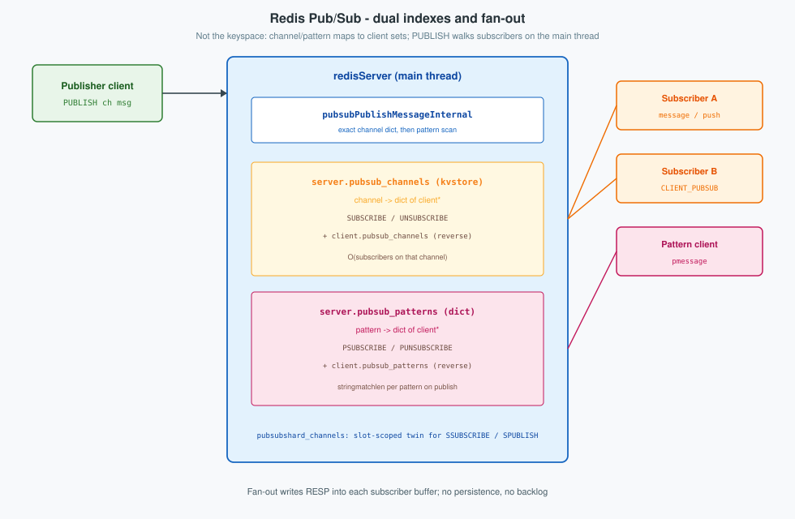
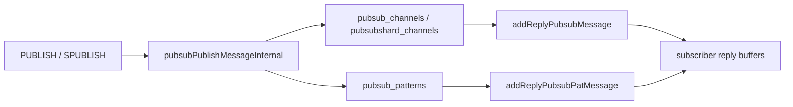
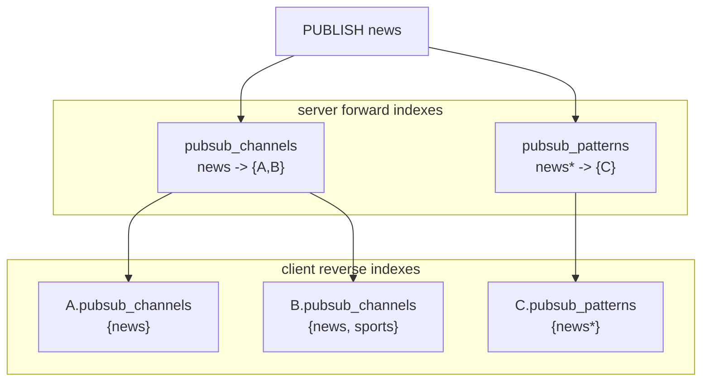
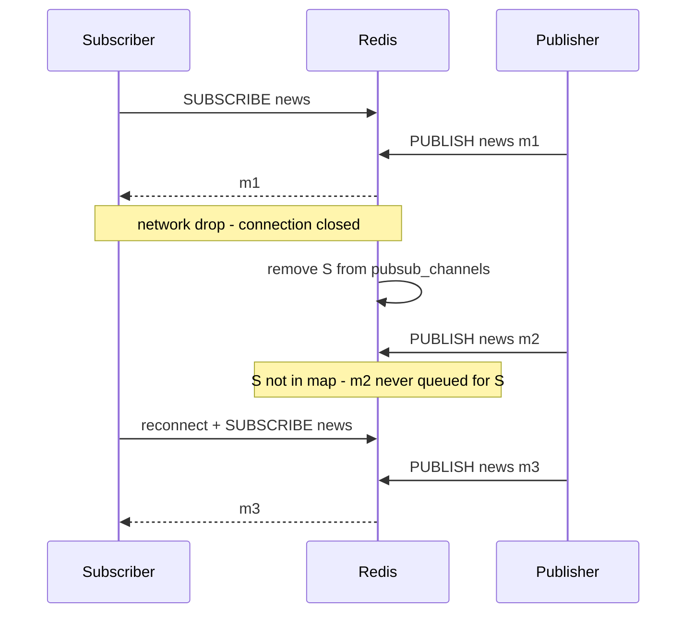

Redis Pub/Sub is an in-process fan-out over named channels and glob patterns. It is not the keyspace: messages are not stored as keys, have no TTL or RDB/AOF payload of their own, and are delivered only to clients that are subscribed at publish time. Delivery is best-effort (no server retry across disconnect). This post maps the structures, command paths, and delivery/security properties in `git/redis` (`pubsub.c`, fields on `redisServer` / `client`).

<!--more-->

Related: [Network / command path](../architecture/), [Data types and encodings](../data-types/), [Cluster bus gossip](../cluster-bus/), [Build from source](../build/).



---

## 1. Overview

| Concern | Behavior |
|---------|----------|
| Transport | Same RESP connection as other commands |
| Delivery | Push into each subscriber’s output buffer on the **main** thread |
| Durability | None — offline or late subscribers miss the message |
| Patterns | `PSUBSCRIBE` uses `stringmatchlen` against every pattern on each `PUBLISH` |
| Shard channels | `SSUBSCRIBE` / `SPUBLISH` use a slot-scoped twin of the channel index |
| Membership | **Per node.** Each process keeps only the clients connected to **it** in its own `pubsub_channels` / `pubsub_patterns` (and shard maps). Nodes do not sync or share subscriber lists. |
| Multi-node publish | `PUBLISH` propagates the **message** (channel + payload) on the cluster bus or REPL; every receiving node runs local fan-out against **its** client list only |

A client in Pub/Sub mode (RESP2) may only run subscription control commands plus `PING` / `QUIT` / `RESET` until it unsubscribes from everything. In a cluster, a subscriber is visible solely on the node that accepted its connection; other nodes learn nothing about that client until a published payload arrives and they deliver to whoever is subscribed locally.


```mermaid
flowchart LR
  Pub["PUBLISH / SPUBLISH"] --> Core["pubsubPublishMessageInternal"]
  Core --> Ch["pubsub_channels / pubsubshard_channels"]
  Core --> Pat["pubsub_patterns"]
  Ch --> SA["addReplyPubsubMessage"]
  Pat --> SB["addReplyPubsubPatMessage"]
  SA --> Out["subscriber reply buffers"]
  SB --> Out
```

---

## 2. Server implementation

Pub/Sub does not store messages. The server keeps **who is listening** in forward indexes on `redisServer` (channel or pattern → set of `client*`), installs those edges on subscribe, and on `PUBLISH` / `SPUBLISH` walks the matching sets to `addReply*` into each subscriber’s output buffer. Global and shard paths share `pubsubtype`; after local fan-out, cluster or replication may propagate the **payload** so peer processes run the same local publish against their own indexes.

```c
/* server.h — redisServer */
kvstore *pubsub_channels;       /* channel → dict of client* */
dict *pubsub_patterns;          /* pattern → dict of client* */
kvstore *pubsubshard_channels;  /* per-slot channel → dict of client* */
unsigned int pubsub_clients;    /* clients with CLIENT_PUBSUB */
```

```plantuml
@startuml
!option handwritten true
skinparam class {
    BackgroundColor White
    BorderColor Black
    ArrowColor Black
}

struct redisServer {
  +pubsub_channels : kvstore*
  +pubsub_patterns : dict*
  +pubsubshard_channels : kvstore*
  +pubsub_clients : uint
}

struct client {
  +pubsub_channels : dict*
  +pubsub_patterns : dict*
  +pubsubshard_channels : dict*
  +flags : uint64_t
}

struct "dict (subscribers)" as SubDict {
  key : client*
  val : NULL
}

struct "dict (membership)" as MembDict {
  key : robj* channel_or_pattern
  val : NULL
}

redisServer --> SubDict : per channel / pattern
client --> MembDict : channels / patterns this client joined
SubDict ..> client : keys are client*
@enduml
```


```mermaid
flowchart TB
  subgraph server_maps["server forward indexes"]
    PC["pubsub_channels\nnews -> {A,B}"]
    PP["pubsub_patterns\nnews* -> {C}"]
  end
  subgraph client_maps["client reverse indexes"]
    A["A.pubsub_channels\n{news}"]
    B["B.pubsub_channels\n{news, sports}"]
    C["C.pubsub_patterns\n{news*}"]
  end
  PUB["PUBLISH news"] --> PC
  PUB --> PP
  PC --> A
  PC --> B
  PP --> C
```

```c
/* pubsub.c — pubsubSubscribeChannel (sketch) */
/* 1) client.pubsub_channels[channel] = present */
/* 2) server.pubsub_channels[channel] → dictAdd(clients, c) */
/* 3) addReplyPubsubSubscribed(c, channel, type) */
markClientAsPubSub(c);
```

```c
/* Complete PUBLISH path (sharded=0). SPUBLISH: skip patterns; shard bus peers only. */

/* ---- publisher node ---- */

/* 1. Command entry */
void publishCommand(client *c) {
    int receivers = pubsubPublishMessageAndPropagateToCluster(
                        c->argv[1], c->argv[2], /* sharded */ 0);
    /* 11. Standalone / primary→replica (no cluster): replicate the command */
    if (!server.cluster_enabled)
        forceCommandPropagation(c, PROPAGATE_REPL);
    /* 12. Reply: local receivers only */
    addReplyLongLong(c, receivers);
}

/* 2. Local first, then cluster bus */
int pubsubPublishMessageAndPropagateToCluster(robj *channel, robj *message,
                                              int sharded) {
    int receivers = pubsubPublishMessage(channel, message, sharded);
    /* → pubsubPublishMessageInternal(..., pubSubType | pubSubShardType) */
    if (server.cluster_enabled)
        clusterPropagatePublish(channel, message, sharded);  /* step 6+ */
    return receivers;
}

/* 3–5. Local fan-out into subscriber output buffers */
int pubsubPublishMessageInternal(robj *channel, robj *message, pubsubtype type) {
    int receivers = 0;
    unsigned int slot = 0;
    if (server.cluster_enabled && type.shard)
        slot = keyHashSlot(channel->ptr, sdslen(channel->ptr));

    /* 3. Exact: kvstoreDictFind → for each client* addReplyPubsubMessage */
    dictEntry *de = kvstoreDictFind(*type.serverPubSubChannels, slot, channel);
    if (de) { /* iterate dictGetVal(de); receivers++ */ }

    /* 4. SPUBLISH: return here (no patterns) */
    if (type.shard) return receivers;

    /* 5. PUBLISH patterns: for each server.pubsub_patterns entry,
     *    stringmatchlen; addReplyPubsubPatMessage; receivers++ */
    return receivers;
}

/* 6. Build bus message (channel_len + message_len + bulk bytes) */
clusterMsgSendBlock *clusterCreatePublishMsgBlock(robj *channel, robj *message,
                                                  uint16_t type) {
    /* type = CLUSTERMSG_TYPE_PUBLISH or CLUSTERMSG_TYPE_PUBLISHSHARD
     * memcpy channel then message into hdr->data.publish.msg.bulk_data */
    return /* msgblock */;
}

/* 7. Choose who gets the bus packet */
void clusterPropagatePublish(robj *channel, robj *message, int sharded) {
    clusterMsgSendBlock *msgblock;
    if (!sharded) {
        msgblock = clusterCreatePublishMsgBlock(channel, message,
                                                CLUSTERMSG_TYPE_PUBLISH);
        clusterBroadcastMessage(msgblock);           /* step 8 */
        clusterMsgSendBlockDecrRefCount(msgblock);
        return;
    }
    /* SPUBLISH */
    msgblock = clusterCreatePublishMsgBlock(channel, message,
                                            CLUSTERMSG_TYPE_PUBLISHSHARD);
    /* for each node in clusterGetNodesInMyShard (except MYSELF|HANDSHAKE):
     *     clusterSendMessage(node->link, msgblock);     step 9 */
    clusterMsgSendBlockDecrRefCount(msgblock);
}

/* 8. PUBLISH: every known cluster node except self */
void clusterBroadcastMessage(clusterMsgSendBlock *msgblock) {
    dictIterator di;
    dictEntry *de;
    dictInitSafeIterator(&di, server.cluster->nodes);
    while ((de = dictNext(&di)) != NULL) {
        clusterNode *node = dictGetVal(de);
        if (node->flags & (CLUSTER_NODE_MYSELF|CLUSTER_NODE_HANDSHAKE))
            continue;
        clusterSendMessage(node->link, msgblock);    /* step 9 */
    }
    dictResetIterator(&di);
}

/* 9. Write msgblock onto that node’s cluster bus link (async send buffer) */
void clusterSendMessage(clusterLink *link, clusterMsgSendBlock *msgblock);

/* ---- peer node (bus receive) ---- */

/* 10. Handler for CLUSTERMSG_TYPE_PUBLISH / PUBLISHSHARD */
void clusterHandlePublish(/* hdr */) {
    if (!sender) return;
    /* Skip object alloc if this node has zero Pub/Sub subscribers. */
    if ((type == CLUSTERMSG_TYPE_PUBLISH
         && serverPubsubSubscriptionCount() > 0)
     || (type == CLUSTERMSG_TYPE_PUBLISHSHARD
         && serverPubsubShardSubscriptionCount() > 0)) {
        /* rebuild channel, message from hdr->data.publish.msg.bulk_data */
        pubsubPublishMessage(channel, message,
                             type == CLUSTERMSG_TYPE_PUBLISHSHARD);
        /* → steps 3–5 again on THIS node’s indexes only */
    }
}

/* 13. Later on each node: event loop / I/O threads write(2) flush
 *     of subscriber reply buffers (not inside publishCommand). */
```

```c
/* pubsub.c */
typedef struct pubsubtype {
    int shard;
    dict *(*clientPubSubChannels)(client*);
    int (*subscriptionCount)(client*);
    kvstore **serverPubSubChannels;
    robj **subscribeMsg;
    robj **unsubscribeMsg;
    robj **messageBulk;
} pubsubtype;

pubsubtype pubSubType = { /* SUBSCRIBE / PUBLISH ... */ };
pubsubtype pubSubShardType = { /* SSUBSCRIBE / SPUBLISH ... */ };
```

```text
Two cluster nodes. Membership is local; nodes do not sync client lists.

  Node N1 (clients A, B)              Node N2 (client C)
  A: SUBSCRIBE news                   C: PSUBSCRIBE news*
  B: SUBSCRIBE news
     SUBSCRIBE sports

N1.pubsub_channels                    N2.pubsub_channels
┌─────────┬──────────┐                (empty for these channels)
│ "news"  │ { A, B } │
│ "sports"│ { B }    │
└─────────┴──────────┘
N1.pubsub_patterns (empty)            N2.pubsub_patterns
                                      ┌─────────┬──────┐
                                      │ "news*" │ { C }│
                                      └─────────┴──────┘
N1 does not know C.  N2 does not know A or B.
```

```text
Publisher on N1:  PUBLISH news hello

N1 (command target) — pubsubPublishMessage on N1 only
  1) Exact: N1.pubsub_channels["news"] → { A, B }
       addReply* → A, B
  2) Patterns: N1.pubsub_patterns empty → no one
  receivers returned to publisher = 2   (local only; not C)
  3) clusterPropagatePublish → bus carries channel+payload to N2
     (not "A,B are subscribed"; only the message)

N2 (bus receive) — pubsubPublishMessage on N2 only
  1) Exact: N2.pubsub_channels["news"] missing → skip
  2) Patterns: "news*" matches "news" → { C }
       addReply* → C
  N2 never touches A or B

Per-client delivery:  A←N1,  B←N1,  C←N2
```

```text
Publisher on N2:  PUBLISH sports goal

N2 local: no "sports" channel, no matching pattern → receivers 0
          still propagates payload to N1
N1 local: N1.pubsub_channels["sports"] → { B } → addReply* → B only
          N1 patterns do not match "sports"
```

```text
UNSUBSCRIBE news from B (still on N1)
  → only N1.pubsub_channels["news"] becomes { A }
  → N2 unchanged
```

---

## 3. Client implementation

Each connected `client` carries the reverse membership needed for fast unsubscribe, disconnect cleanup, and subscribe-ack counts. The wire replies a subscriber consumes are produced by the server into that client’s output buffer; the client (or library) must parse them and, after faults, re-establish membership.

### 3.1 Per-client state

```c
/* server.h — client */
dict *pubsub_channels;       /* set of channel robj* this client subscribed to */
dict *pubsub_patterns;       /* set of pattern robj* this client psubscribed to */
dict *pubsubshard_channels;  /* set of shard channel robj* */
```

| Field | Entry shape | Updated by |
|-------|-------------|------------|
| `c->pubsub_channels` | key: channel `robj*`; value unused | `SUBSCRIBE` / `UNSUBSCRIBE` |
| `c->pubsub_patterns` | key: pattern `robj*`; value unused | `PSUBSCRIBE` / `PUNSUBSCRIBE` |
| `c->pubsubshard_channels` | key: shard channel `robj*` | `SSUBSCRIBE` / `SUNSUBSCRIBE` |
| `CLIENT_PUBSUB` | flag on `c->flags` | set when first subscription is added; cleared when total count hits 0 |

Subscription count reported in subscribe acks is `dictSize(c->pubsub_channels) + dictSize(c->pubsub_patterns)` (plus shard dict for shard commands). The same channel `robj` (or an equivalent shared key after `incrRefCount`) appears in both the server map and each member’s client map.

For the two-node example in §2 (A, B on N1; C on N2):

```text
client A (on N1)            client B (on N1)            client C (on N2)
pubsub_channels:            pubsub_channels:            pubsub_channels: (empty)
  { "news" }                  { "news", "sports" }      pubsub_patterns:
pubsub_patterns: (empty)    pubsub_patterns: (empty)      { "news*" }
flags: CLIENT_PUBSUB        flags: CLIENT_PUBSUB        flags: CLIENT_PUBSUB
```

| Operation | Client reverse index uses |
|-----------|---------------------------|
| `UNSUBSCRIBE ch` for one client | Know membership; then delete that client from the channel’s server set |
| Client disconnect | Iterate `c->pubsub_channels` / `pubsub_patterns` / shard dict and remove the client from every server-side set |
| Subscribe ack count | `dictSize` of the client’s own dicts |

### 3.2 Client mode restriction

```c
/* server.c — processCommand */
if ((c->flags & CLIENT_PUBSUB && c->resp == 2) &&
    /* not (P|S)SUBSCRIBE / (P|S)UNSUBSCRIBE / PING / QUIT / RESET */)
{
    rejectCommandFormat(c, "Can't execute '%s': only …");
}
```

RESP3 connections can use push messages while still issuing other commands more freely; RESP2 Pub/Sub mode is the classic restricted session.

### 3.3 Message wire shape

| Kind | RESP2 shape (conceptual) |
|------|---------------------------|
| Channel message | `*3` / `message` / channel / payload |
| Pattern message | `*4` / `pmessage` / pattern / channel / payload |
| Subscribe ack | `*3` / `subscribe` / channel / count |

RESP3 uses push-style framing (`addReplyPushLen`) with the same logical fields. These are pushed into the subscriber’s buffer asynchronously relative to the publisher’s command; the subscriber’s client must read them as unsolicited (or push) traffic, not as replies to its own last command (aside from subscribe/unsubscribe acks and `PING`).

### 3.4 Reconnect, re-subscribe, and client heartbeats

There is **no** server-side reconnect or resubscribe. Membership does not survive the connection. After disconnect:

1. Detect socket death (TCP error, library event).  
2. Reconnect.  
3. Issue `SUBSCRIBE` / `PSUBSCRIBE` / `SSUBSCRIBE` again for the same names.  
4. Accept gap loss, or use another primitive (e.g. Streams) if loss is unacceptable.

Libraries such as **Redisson** (`RTopic` / `RPatternTopic` / `RShardedTopic`) perform reconnect and **re-subscribe listeners automatically**, but still document that messages published during absence are lost. Redisson’s reliable topic APIs use a different design when gap delivery matters.

`PING` while subscribed is allowed in RESP2 Pub/Sub mode; the server replies with a Pub/Sub-shaped `PONG`. That is useful as an **application heartbeat** because the server idle `timeout` does not cull `CLIENT_PUBSUB` clients (see §4.3). Client libraries often ping or rely on connection events and re-subscribe after reconnect.

```text
Server:  no Pub/Sub idle timeout; tcp-keepalive + I/O failure + buffer limits
Client:  must detect socket death; may PING; must re-SUBSCRIBE after reconnect
```

---

## 4. Message delivery and security

Pub/Sub indexes only track **who is subscribed**. They do not protect messages in transit or after a fault. Delivery is best-effort; access can be restricted with ACL.

### 4.1 What `PUBLISH` actually guarantees

```text
PUBLISH
  → for each subscriber: addReply*(output buffer)
  → return receivers (= how many clients were enqueued locally)
  → later: event loop write(2) / I/O thread flush
```

| Claim | True? |
|-------|-------|
| Message stored until consumed | No |
| Subscriber ACK / retry | No |
| Publisher reply = “client read it on the wire” | No — only “queued into that client’s buffer” |
| Offline / late subscriber receives it later | No |

TCP may retransmit packets while a connection remains up. That is not Redis Pub/Sub retry. Once the client connection is closed, its subscription entries are removed and any unflushed buffer is discarded.

### 4.2 Temporary network drop

| Event | Server state | Message fate |
|-------|--------------|--------------|
| Brief packet loss, TCP session alive | Subscriptions remain | TCP may recover in-flight bytes |
| Connection reset / timeout / client free | `client*` removed from channel/pattern dicts; `CLIENT_PUBSUB` cleared if empty | Messages already only in that buffer are lost; later `PUBLISH` will not include this client |
| Client reconnects without `SUBSCRIBE` | No membership | Sees nothing until it subscribes again |
| Client reconnects and `SUBSCRIBE` again | New edges in both indexes | Still misses everything published during the gap |


```mermaid
sequenceDiagram
  participant S as Subscriber
  participant R as Redis
  participant P as Publisher
  S->>R: SUBSCRIBE news
  P->>R: PUBLISH news m1
  R-->>S: m1
  Note over S,R: network drop - connection closed
  R->>R: remove S from pubsub_channels
  P->>R: PUBLISH news m2
  Note over R: S not in map - m2 never queued for S
  S->>R: reconnect + SUBSCRIBE news
  P->>R: PUBLISH news m3
  R-->>S: m3
```

### 4.3 Availability detection (client and server)

Pub/Sub has **no dedicated heartbeat protocol** (no server-driven ping of subscribers, no per-message ACK). Liveness is inferred from the TCP connection and from a few Redis/client mechanisms that are not Pub/Sub-specific.

#### Server side

| Mechanism | Behavior for Pub/Sub clients |
|-----------|------------------------------|
| Idle `timeout` (`server.maxidletime`) | **Not applied.** `clientsCronHandleTimeout` explicitly skips `CLIENT_PUBSUB`, so a quiet subscriber is not closed merely for idle time. |
| `tcp-keepalive` (default **300** seconds in `redis.conf`) | On accept, `connKeepAlive` / `anetKeepAlive` enables `SO_KEEPALIVE` and sets **per-socket** `TCP_KEEPIDLE = 300`, `TCP_KEEPINTVL ≈ 100`, `TCP_KEEPCNT = 3`. This **overrides** the Linux system default idle of **7200** s (`net.ipv4.tcp_keepalive_time`) for Redis client fds only. Dead-peer detection is then on the order of minutes, not two hours. |
| Write / read errors | Failed socket I/O → `freeClient` / `freeClientAsync`; subscription indexes are cleared with the client. |
| Output buffer limits | Soft/hard limits may disconnect a slow subscriber (see §4.5). |

```c
/* timeout.c — clientsCronHandleTimeout */
if (server.maxidletime &&
    !(c->flags & CLIENT_SLAVE) &&
    !mustObeyClient(c) &&
    !(c->flags & CLIENT_BLOCKED) &&
    !(c->flags & CLIENT_PUBSUB) &&  /* no idle timeout for Pub/Sub */
    (now - c->lastinteraction > server.maxidletime))
{
    freeClient(c);
}
```

Implication: a half-open TCP session can leave a subscriber in `pubsub_channels` until TCP keepalive (or the next failed write on `PUBLISH`) aborts the connection. Until then, `PUBLISH` may still count that client as a receiver and enqueue into a buffer that will never be read.

#### Client side

See §3.4: TCP errors, optional `PING`, and library reconnect/re-subscribe. There is no mutual “are you still interested in channel X?” exchange beyond the existence of the TCP session and optional client `PING`.

### 4.4 Transient path loss, TCP recovery, and when Redis frees the client

`PUBLISH` does not wait for subscriber acknowledgement. It enqueues with `addReply*` and returns `receivers`; the socket flush runs asynchronously (`handleClientsWithPendingWrites` / `AE_WRITABLE` → `writeToClient`). The server removes the client from Pub/Sub indexes only when the connection is reclaimed (`freeClient` / `freeClientAsync`), typically after a failed write or TCP abort—not during `publishCommand` itself.

```text
PUBLISH
  → addReply* (subscriber remains in pubsub_channels)
  → return receivers
  → later flush via writeToClient
       → connection still valid → TCP delivers / retransmits as usual
       → connection dead on write → freeClientAsync → indexes cleared
```

```c
/* networking.c — writeToClient (sketch) */
if (nwritten == -1) {
    if (connGetState(c->conn) != CONN_STATE_CONNECTED) {
        freeClientAsync(c);
        return C_ERR;
    }
}
```

#### Role of TCP under a temporary network interruption

Provided both endpoints remain up and the TCP connection control block is retained, TCP is designed to absorb short path disruptions: lost segments are retransmitted while the session stays `ESTABLISHED`. If the path is restored before the local stack aborts the connection, in-flight and not-yet-acknowledged data—including Pub/Sub payloads already accepted into the send path—can be delivered without Redis tearing down the subscription.

Under common defaults this abort budget is intentionally long relative to brief faults:

| Mechanism | Common default | Approximate time before the stack gives up on a silent peer |
|-----------|----------------|---------------------------------------------------------------|
| Active send / black-hole (data outstanding) | Linux `net.ipv4.tcp_retries2 = 15` | Typically **~13–30 minutes** (RTO-dependent) before abort |
| Idle connection | Redis `tcp-keepalive 300` → `TCP_KEEPIDLE=300`, `TCP_KEEPINTVL≈100`, `TCP_KEEPCNT=3` | First probe after **300 s**; abort often on the order of **~5–10+ minutes** if still unanswered |
| Redis idle `timeout` | Skipped for `CLIENT_PUBSUB` | Does not accelerate free of a quiet subscriber |

Consequently, a **temporary** network interruption that recovers while client and server processes remain healthy, and while the TCP session has not been aborted, is ordinarily handled by TCP: the subscriber need not re-`SUBSCRIBE`, and pending traffic can complete. That is transport recovery, not a Redis Pub/Sub replay log—messages never accepted onto a live session are still outside this guarantee.

#### Same-cloud deployments

When publisher, Redis, and subscribers run inside the same cloud network (for example a single VPC / VNet, private addressing, no consumer-grade NAT on the path), the conditions that most often cut TCP sessions early—aggressive NAT idle timeouts, flaky edge middleboxes—are typically weaker or absent. Retransmission and Redis’s per-socket keepalive then dominate detection latency. Short regional blips that clear within the TCP give-up window are therefore **more likely** to leave Pub/Sub membership intact and to allow in-flight delivery to finish than paths that traverse the public Internet or carrier-grade NAT.

Same-cloud placement does not create durability: process crash, explicit `RST`, security-group or LB idle policy, or exhaustion of the retransmission/keepalive budget still ends the session and requires re-subscription, with no replay of the gap.

#### When Redis frees the client (timing)

| Condition at flush / probe time | Server behavior | Order-of-magnitude latency to `freeClient*` |
|---------------------------------|-----------------|-----------------------------------------------|
| Socket already closed or `RST` observed | `writeToClient` fails → `freeClientAsync` | **Milliseconds** (same event-loop cycle as the failing flush, or one RTT) |
| Path black-holed; kernel accepted the send | TCP retransmits; Redis does not free yet | Until **`tcp_retries2`** give-up (**~13–30 min** typical on Linux) unless the path recovers first |
| Peer gone; connection idle | Keepalive probes | **~5–10+ min** with Redis `tcp-keepalive 300` (then free on the resulting error) |
| Intermediary idle timeout (less common in tight same-cloud topologies) | Mapping dropped; next I/O fails | **Tens of seconds to a few minutes** (policy-specific) |
| Output buffer soft/hard limit | Redis disconnects the client | When the limit is exceeded (load-dependent) |

```text
Transient path loss, session retained, path recovers
    → TCP retransmit succeeds → subscription kept; delivery can complete

Session aborted (RST, retries/keepalive exhausted, process death)
    → freeClient* → re-SUBSCRIBE required; gap not replayed
```

Until reclamation, the client may still appear in `pubsub_channels` and contribute to subsequent `receivers` counts. After reclamation, further publishes omit that client until it subscribes again.

### 4.5 Buffer and slow consumers

Even without a full disconnect, a subscriber can lose Pub/Sub traffic if its **output buffer** hits configured soft/hard limits: Redis may disconnect the client, which again drops membership and pending bytes. Fast publishers plus slow readers are a common failure mode for “I was subscribed but missed messages.”

### 4.6 Access control (who may pub/sub)

Delivery reliability is separate from **authorization**. Redis ACL can restrict which channels a user may publish to or subscribe to (`resetchannels` / channel patterns on the ACL selector; `acl-pubsub-default` controls the default). Revoking channel permissions can force affected Pub/Sub clients to disconnect. That limits who participates; it does not add persistence or retry.

Payload confidentiality (encryption) is likewise outside Pub/Sub: use TLS on the connection and/or encrypt at the application layer. Channel names and messages are otherwise plaintext RESP on the wire (or inside TLS).

### 4.7 Choosing a primitive

| Need | Fit |
|------|-----|
| Low-latency fan-out, loss OK | Classic Pub/Sub |
| Auto re-subscribe after drop | Client library (e.g. Redisson `RTopic`) still lossy across the gap |
| Faster dead-peer detection than TCP keepalive / `tcp_retries2` | Client `PING` / library heartbeat; tune `tcp-keepalive` |
| Transient same-cloud blips with session intact | Ordinarily covered by TCP retransmission within the give-up window |
| No loss across disconnect / process death | Streams, lists/queues, or a reliable topic implementation — not plain `PUBLISH` |

---

| Topic | Summary |
|-------|---------|
| Server indexes | Channel/pattern → clients; fan-out and cluster/REPL payload propagate |
| Client state | Reverse membership, `CLIENT_PUBSUB`, wire push parse, re-subscribe after drop |
| Membership sync | None — each node knows only its connected subscribers |
| Publish | Local fan-out, then propagate **payload**; peers/replicas run local `pubsubPublishMessage` again |
| Shard | Parallel `kvstore` keyed by slot; `SPUBLISH` only to same-slot shard |
| Persistence | None for Pub/Sub messages |
| Delivery | Fire-and-forget; reconnect must re-`SUBSCRIBE`; gap messages lost |
| Liveness | No Pub/Sub idle timeout; `tcp-keepalive` (default 300s) + I/O errors; client may `PING` |
| Free after dead publish | Fast on RST (ms); black-hole ≈ `tcp_retries2` (~13–30 min); idle ≈ keepalive (~5–10+ min). Transient path loss with session retained is normally recovered by TCP; same-cloud paths are typically more favorable. |
| Access | ACL channel rules; TLS/app crypto for confidentiality |
