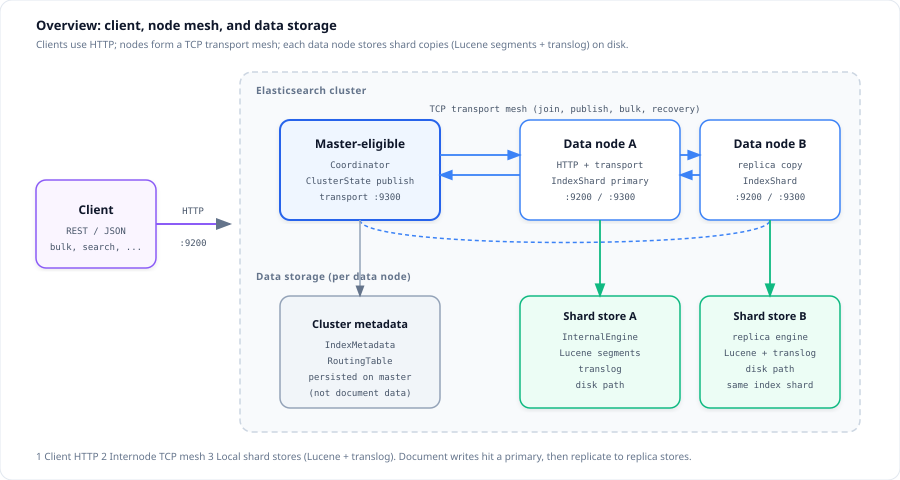
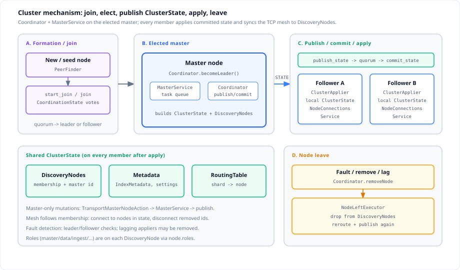
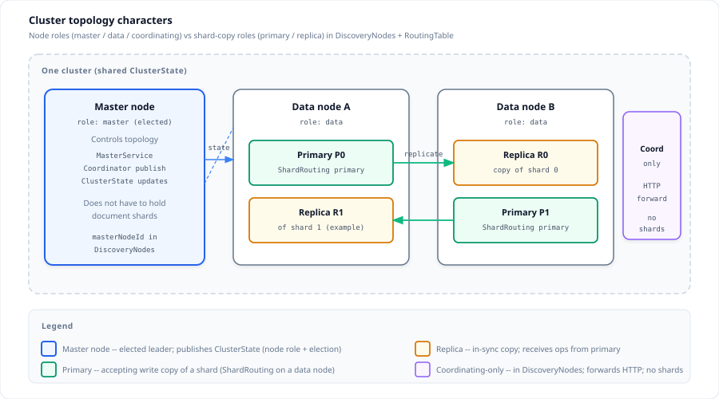
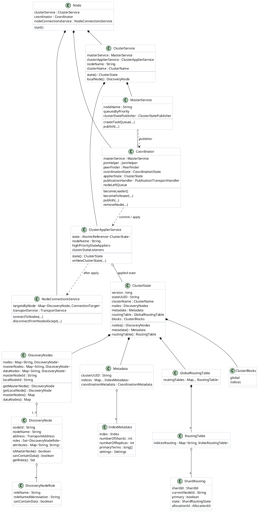
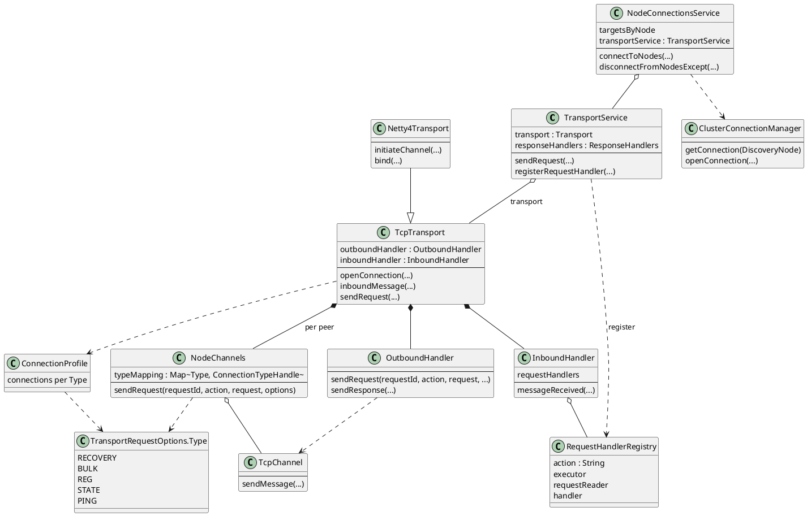
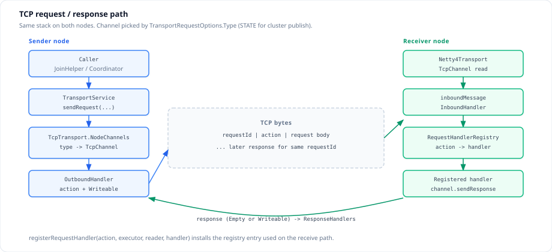
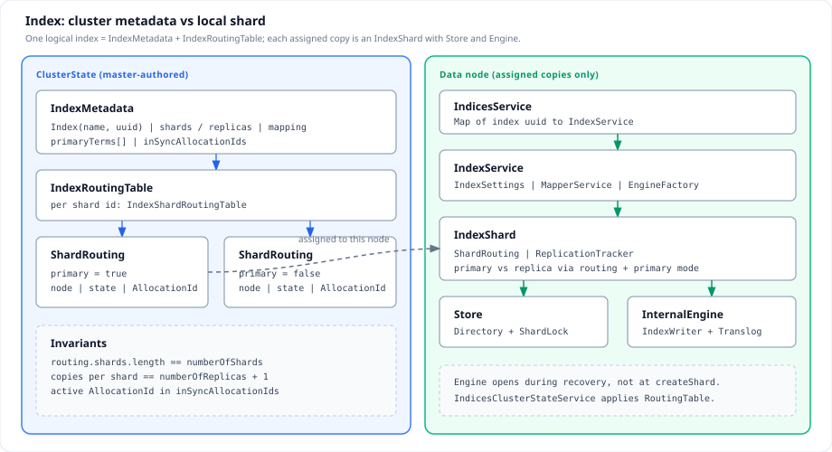
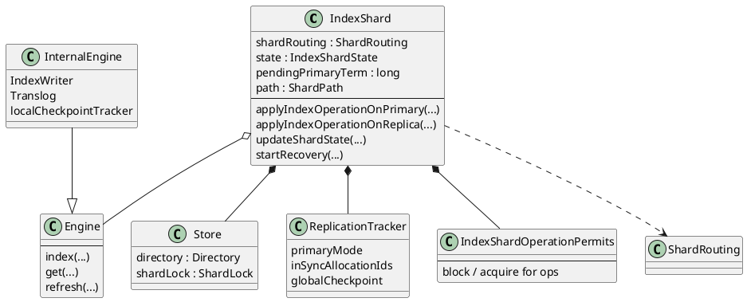

Elasticsearch is a distributed search engine: clients speak HTTP, nodes form a TCP mesh, a master publishes `ClusterState`, and each data node stores Lucene-backed shard copies. This post covers **cluster management** (topology and TCP transport) and **how an index is modeled and opened**, from the tree under `git/elasticsearch` (server `Version.CURRENT` = 9.6.0 on `main`).
<!--more-->

Related: [Elasticsearch generals](../elasticsearch/), [Lucene internals](../lucene/).

Source grounding: `server/` and `modules/transport-netty4/`.

---

## 1. Overview

Elasticsearch exposes one logical cluster to clients while spreading work and data across nodes.



1. **Client → server** — applications call the REST API over **HTTP** (`http.port`, default `9200-9300`) to any node that accepts HTTP.
2. **Server ↔ server** — nodes keep a **TCP transport** mesh (`transport.port`, default `9300-9399`) for discovery/join, cluster-state publish/commit, bulk replication, recovery, and search fan-out.
3. **Data storage** — each data node holds **shard copies** on disk (`InternalEngine`: Lucene segments + translog). Cluster **metadata** (`IndexMetadata`, `RoutingTable`) describes placement; it is not the document store.

**What this post covers**

1. Overview — client, node mesh, storage  
2. Cluster management — topology, class model, TCP transport channel types  
3. Indexes — architecture (metadata vs local shards) and implementation (create / open / document→shard routing)

**Usage facts**

- Creating or changing an index is a **master** `ClusterState` update (published on `Type.STATE`). Data nodes materialize `IndexService` / `IndexShard` only for copies assigned to them in the applied `RoutingTable`.
- Defaults: `index.number_of_shards` = **1**, `index.number_of_replicas` = **1** (replicas are dynamic; shard count is final after create).
- Prefer this post for internals; use [Elasticsearch generals](../elasticsearch/) for REST API and query JSON fields.
- Scope excludes X-Pack security, ingest pipelines in depth, aggregations internals, and the full allocation-decider catalog.

---

## 2. Cluster management

Cluster management is the control plane: **cluster architecture** (what is shared and who does what) and the **TCP transport** that carries membership and data-plane RPCs between nodes.



### 2.1 Cluster topology

**Topology** is the membership and placement view carried in `ClusterState`. Two different “characters” appear in that view: **node roles** (who may be master, hold data, or only coordinate) and **shard-copy roles** (primary vs replica on a data node).



| Character | Kind | Where recorded | Duty |
|-----------|------|----------------|------|
| **Master** (elected) | Node | `DiscoveryNodes.masterNodeId`; node has `master` role | Runs `MasterService` / `Coordinator` publish; owns topology changes |
| **Data node** | Node | `DiscoveryNode` with data-capable role | Hosts one or more `ShardRouting` copies |
| **Primary** | Shard copy | `ShardRouting` (primary flag) on a data node | Accepts writes; replicates to in-sync replicas |
| **Replica** | Shard copy | `ShardRouting` (non-primary) on another data node | Applies primary’s operations; may serve reads |
| **Coordinating-only** | Node | In `DiscoveryNodes` without data/master/ingest | Accepts HTTP and forwards actions; not a shard target |

The same JVM can be both master-eligible and a data node (combined roles). Primary/replica are **not** node types—they are placements of a given shard id across data nodes in the `RoutingTable`.

| Topology facet | In `ClusterState` | Meaning |
|----------------|-------------------|---------|
| Node membership | `DiscoveryNodes` | Every live `DiscoveryNode` (id, address, roles) |
| Elected master | `DiscoveryNodes.masterNodeId` | Which member currently leads state publication |
| Index definitions | `Metadata` / `IndexMetadata` | Indexes and their settings (shard/replica counts, …) |
| Shard placement | `RoutingTable` / `ShardRouting` | Which node holds which primary or replica copy |
| Blocks | `ClusterBlocks` | Operations forbidden until topology is healthy |

The transport mesh is the wire that carries join, publish, and data RPCs; the **topology itself** is not a separate gossip map—it is the applied `ClusterState` on each JVM.

Every member process keeps a **local copy** of that state. Reads such as “who is master?” or “where is shard 2?” go through `ClusterService.state()` on **that** node (the last committed state the local `ClusterApplierService` applied). Nodes do not query a remote catalog for routine routing; they use their applied snapshot, which lags only until the next publish/commit.

### 2.2 Class model: how a node holds cluster info

On each node, `ClusterService` is the façade. It owns `MasterService` (active for state updates only while this node is the elected master) and `ClusterApplierService` (always applies committed states). `ClusterApplierService` retains the current `ClusterState`. That object aggregates topology: `DiscoveryNodes` of `DiscoveryNode` instances, `Metadata`, routing tables, and blocks.



Invariant: after a successful apply, `ClusterService.state().nodes()` on every healthy member describes the **same** membership and master id (same `version` / `stateUUID`). Shard routing and metadata match that version. A node that has not yet applied a commit still serves from its previous applied state until commit catches up—or is removed if it lags too far.

### 2.3 TCP transport implementation

Internode traffic uses the **TCP stack**, not HTTP. Types and ownership:



| Layer | Type | Role |
|-------|------|------|
| Façade | `TransportService` | `sendRequest`, `registerRequestHandler`, handshake (`internal:transport/handshake`) |
| Engine | `TcpTransport` | Bind/connect, frame messages, map `Type` → `TcpChannel` |
| Netty | `Netty4Transport` | Concrete TCP (`transport.port` default `9300-9399`) |
| Mesh | `NodeConnectionsService` / `ClusterConnectionManager` | Open/close peers to match applied `DiscoveryNodes` |



**Send path.** Caller → `TransportService.sendRequest` → connection’s `NodeChannels` selects a channel by `TransportRequestOptions.Type` → `OutboundHandler` writes `requestId`, action string, and `Writeable` body.

**Receive path.** Netty read → `TcpTransport.inboundMessage` → `InboundHandler` resolves `RequestHandlerRegistry` by action → deserialize request → run handler on its executor → `channel.sendResponse`. The sender matches the response via `responseHandlers` and the same `requestId`.

Channel selection is the `options.type()` lookup on the peer’s `NodeChannels`:

```java
// TcpTransport.NodeChannels.sendRequest
TcpChannel channel = channel(options.type());
outboundHandler.sendRequest(node, channel, requestId, action, request, options, ...);
```

`ConnectionProfile.buildDefaultConnectionProfile` opens a **separate pool of TCP sockets per type** (counts from `transport.connections_per_node.*`). TCP is a single ordered byte stream: a large bulk or recovery transfer on a shared socket would delay small cluster-state or fault-detection messages (head-of-line blocking). Isolating types keeps latency-sensitive control traffic off bandwidth-heavy data paths. Roles that never send a type open **zero** sockets for it:

```java
// ConnectionProfile.buildDefaultConnectionProfile (defaults: recovery=2, bulk=3, reg=6, state=1, ping=1)
builder.addConnections(connectionsPerNodeBulk, Type.BULK);
builder.addConnections(connectionsPerNodePing, Type.PING);
builder.addConnections(DiscoveryNode.isMasterNode(settings) ? connectionsPerNodeState : 0, Type.STATE);
builder.addConnections(DiscoveryNode.canContainData(settings) ? connectionsPerNodeRecovery : 0, Type.RECOVERY);
builder.addConnections(connectionsPerNodeReg, Type.REG);
```

#### `Type.RECOVERY`

**Usage.** Peer recovery copies Lucene files and replays translog ops from a source shard to a recovering target. Transfers are large and long-lived; they must not stall publish or search on the same peer link. Default **2** sockets per data node (`transport.connections_per_node.recovery`). Non-data nodes open **0**.

```java
// RemoteRecoveryTargetHandler
this.fileChunkRequestOptions = TransportRequestOptions.of(
    recoverySettings.internalActionTimeout(),
    TransportRequestOptions.Type.RECOVERY
);
this.translogOpsRequestOptions = TransportRequestOptions.of(
    recoverySettings.internalActionLongTimeout(),
    TransportRequestOptions.Type.RECOVERY
);
// later: transportService.sendRequest(..., fileChunkRequestOptions, ...)
```

#### `Type.BULK`

**Usage.** Primary → replica shard bulk writes (`TransportShardBulkAction` / `TransportReplicationAction`). Indexing volume is high; a few parallel sockets absorb concurrent bulk shards without sharing the `STATE` or `PING` pipes. Default **3** sockets (`transport.connections_per_node.bulk`).

```java
// TransportShardBulkAction
private static final TransportRequestOptions TRANSPORT_REQUEST_OPTIONS = TransportRequestOptions.of(
    null,
    TransportRequestOptions.Type.BULK
);

@Override
protected TransportRequestOptions transportOptions() {
    return TRANSPORT_REQUEST_OPTIONS;
}
// TransportReplicationAction sends primary/replica requests with transportOptions
```

#### `Type.REG`

**Usage.** Default / general-purpose channel: discovery probes, most internal actions that omit an explicit type, and search fan-out. `TransportRequestOptions.EMPTY` and `timeout(...)` both use `Type.REG`. Default **6** sockets (`transport.connections_per_node.reg`)—the largest pool, for concurrent unrelated RPCs.

```java
// TransportRequestOptions
public static final TransportRequestOptions EMPTY = new TransportRequestOptions(null, Type.REG);

// SearchTransportService (query / fetch phases)
transportService.sendRequest(node, action, request, TransportRequestOptions.EMPTY, handler);

// HandshakingTransportAddressConnector — single-channel probe profile
handshakeConnectionProfile = ConnectionProfile.buildSingleChannelProfile(
    Type.REG, connectTimeout, handshakeTimeout, TimeValue.MINUS_ONE, null, null
);
```

#### `Type.STATE`

**Usage.** Cluster-state publication and related coordination that must stay responsive while peers may be busy with bulk or recovery. Master-eligible nodes open **1** socket by default (`transport.connections_per_node.state`); other roles open **0**. `PublicationTransportHandler` sends `internal:cluster/coordination/publish_state` on this type (no send timeout—acks may arrive late).

```java
// PublicationTransportHandler
private static final TransportRequestOptions STATE_REQUEST_OPTIONS = TransportRequestOptions.of(
    null,
    TransportRequestOptions.Type.STATE
);

transportService.sendChildRequest(
    connection,
    PUBLISH_STATE_ACTION_NAME,
    new BytesTransportRequest(bytes, connection.getTransportVersion()),
    task,
    STATE_REQUEST_OPTIONS,
    handler
);
```

#### `Type.PING`

**Usage.** Lightweight fault-detection RPCs (`LeaderChecker`, `FollowersChecker`) so leader/follower liveness checks are not queued behind bulk or recovery frames. Default **1** socket (`transport.connections_per_node.ping`). Separate from `TransportKeepAlive`, which writes a wire-level keep-alive on **every** open `TcpChannel` on a schedule; `Type.PING` is the application-level channel class for coordination ping *actions*.

```java
// LeaderChecker / FollowersChecker
private static final TransportRequestOptions PING_REQUEST_OPTIONS =
    TransportRequestOptions.of(null, Type.PING);

transportService.sendRequest(
    node,
    LEADER_CHECK_ACTION_NAME,  // or FOLLOWER_CHECK_ACTION_NAME
    request,
    PING_REQUEST_OPTIONS,
    handler
);
```

---

## 3. Indexes

An **index** is one logical namespace for documents. The cluster records its definition and shard placement in `ClusterState`; each data node that holds a copy runs a local `IndexShard` with a Lucene store. Document write and search paths assume that structure; this section covers the structure itself.

### 3.1 Architecture

Two planes share the same logical index:

| Plane | Home | Holds |
|-------|------|--------|
| **ClusterState** (master-authored) | `IndexMetadata` + `IndexRoutingTable` | Identity, settings, mappings, primary terms, in-sync allocation ids, which node holds which copy |
| **Data plane** (per data node) | `IndicesService` → `IndexService` → `IndexShard` | Lucene `Directory`, engine, recovery, primary/replica behavior for **assigned** copies only |



#### The index in ClusterState

`Index` is a value type `(name, uuid)`. Equality uses both; after create, the UUID (setting `index.uuid`) is the stable key for maps and on-disk paths. Until a UUID is assigned, code may see the placeholder `_na_`.

`IndexMetadata` is the authoritative definition for that UUID:

| Field / aspect | Meaning |
|----------------|---------|
| `index` | `Index(name, uuid)` |
| `numberOfShards` / `numberOfReplicas` | From `index.number_of_shards` (default **1**, **Final**) and `index.number_of_replicas` (default **1**, **Dynamic**). `totalNumberOfShards = shards × (replicas + 1)`. |
| `primaryTerms[]` | One `long` per shard id. Starts at unassigned (**0**); increments when a primary is assigned after a full restart or a replica is promoted. Any shard that can accept writes has term greater than 0. |
| `inSyncAllocationIds` | Per shard id, the set of `AllocationId` strings for copies safe to promote or recover from. |
| Mapping / aliases / settings versions | `mappingVersion`, `settingsVersion`, `aliasesVersion`, plus overall `version` for change detection. |
| `state` | `OPEN` or `CLOSE` (closed indexes keep metadata but do not host started shards for traffic). |
| Creation / compatibility | `getCreationVersion()` / `getCompatibilityVersion()` for N−1 and archive import checks. |

`IndexRoutingTable` holds one `IndexShardRoutingTable` per shard id `0 .. numberOfShards-1`. Each group has exactly one primary `ShardRouting` and `numberOfReplicas` replica routings. A `ShardRouting` is one **physical copy**: assigned node (or none), `primary` flag, cluster state (`UNASSIGNED` → `INITIALIZING` → `STARTED`, or `RELOCATING`), recovery source (empty store, existing store, peer, snapshot, …), and `AllocationId`.

**Invariants** (routing validated against metadata): `shards.length == numberOfShards`; copies per shard id equal `numberOfReplicas + 1`; every active promotable copy’s allocation id ∈ that shard’s in-sync set.

#### The index on a data node

`IndicesService` keeps `Map<uuid, IndexService>` for indexes that have at least one local shard. One `IndexService` is shared by all local shards of that index: `IndexSettings` (live view of `IndexMetadata` settings), `MapperService`, analyzers, similarity, field-data / bitset caches, `EngineFactory`, and async tasks (global-checkpoint sync, retention-lease sync, translog trim). The shard map is `Map<Integer, IndexShard>` keyed by shard id—not every shard id exists on every node, only those the routing table assigns here.

`ShardId` is `(Index, shardId)` and identifies a logical shard; each **copy** on a node is a separate `IndexShard` instance with its own store path.

#### `IndexShard`



An `IndexShard` is one local copy. Construction (`IndexService.createShard`) acquires a `ShardLock`, resolves or creates a `ShardPath` on disk, builds a Lucene `Directory`, wraps it in `Store`, and constructs `IndexShard` in state **`CREATED`**. The `Engine` reference stays empty until recovery opens `InternalEngine` (default) on `store.directory()` with an `IndexWriter` and a paired translog.

Two state axes must not be confused:

| Axis | Type | Where | Role |
|------|------|--------|------|
| Cluster placement | `ShardRouting.state()` | `ClusterState` | Master’s view: unassigned / initializing / started / relocating |
| Local lifecycle | `IndexShardState` | JVM | This process’s shard object: created → recovering → post-recovery → started → closed |

Local lifecycle:

| `IndexShardState` | Meaning |
|-------------------|---------|
| `CREATED` | Object and store exist; no engine yet |
| `RECOVERING` | `markAsRecovering`; engine opens; file/translog or peer recovery in progress |
| `POST_RECOVERY` | Recovery finished; reads allowed; waiting for master to mark routing active |
| `STARTED` | `updateShardState` saw active routing; serving normal traffic |
| `CLOSED` | Shard closed / failed / removed |

Reads are allowed in `POST_RECOVERY` and `STARTED`. Writes are allowed in `RECOVERING`, `POST_RECOVERY`, and `STARTED` (replicas index during recovery; relocating primaries have additional rules). Operation admission goes through `IndexShardOperationPermits` so promotion and engine reset can block new ops briefly.

`ReplicationTracker` is the local view of the replication group: whether this copy is in **primary mode**, which allocation ids are in-sync, global checkpoint, and retention leases. Primaries drive the group; replicas apply ops with primary-assigned sequence numbers.

**Primary vs replica** use the same class. Gates are `shardRouting.primary()` and primary mode on the tracker:

- **Primary** — `applyIndexOperationOnPrimary` (`Engine.Operation.Origin.PRIMARY`); activates primary mode when an initializing primary becomes started; receives master updates of in-sync sets into the tracker.
- **Replica** — almost always peer-recovers from the current primary (`Type.RECOVERY` channels); `applyIndexOperationOnReplica` (`Origin.REPLICA`); on promotion, primary term increases, history may be adjusted, primary–replica resync runs, then `activatePrimaryMode`.
- **Demotion** primary → replica on the **same** allocation is illegal (`updateShardState` rejects it).

### 3.2 Implementation

**Create index (ClusterState only).** HTTP/API create reaches the master as `TransportCreateIndexAction` → `MetadataCreateIndexService.createIndex`. The update task validates name/templates/settings, may use a temporary `IndexService` on the master to merge mappings, then builds `IndexMetadata` (`OPEN`) and `RoutingTable.addAsNew` / `IndexRoutingTable.initializeAsNew`: unassigned primary with empty-store recovery, unassigned replicas with peer recovery. `allocationService.reroute` assigns initializing shards. After publish/commit, every node applies the new metadata; only assigned data nodes open local objects. `IndexMetadataUpdater` (during allocation) fills in-sync ids as shards start and bumps primary terms on primary init/promotion.

```text
TransportCreateIndexAction
  -> MetadataCreateIndexService.createIndex
       validate + build IndexMetadata
       RoutingTable.addAsNew / initializeAsNew
       allocationService.reroute("create-index")
  -> publish / commit ClusterState
  -> (optional) wait for active shards
```

**Create `IndexService` / `IndexShard`.** `IndicesClusterStateService.applyClusterState` reconciles local objects with the applied routing table. For each assigned initializing shard:

```text
IndicesService.createIndex(IndexMetadata)     // once per uuid on this node
IndexService.createShard(routing, ...)
  nodeEnv.shardLock(shardId)
  ShardPath.loadShardPath | selectNewPathForShard
  DirectoryFactory.newDirectory(...)
  new Store(shardId, settings, directory, lock, ...)
  new IndexShard(routing, settings, path, store, engineFactory, ...)  // state = CREATED
  shards.put(shardId.id(), indexShard)
IndexShard.startRecovery(...)
  markAsRecovering -> RECOVERING
  EMPTY/EXISTING_STORE -> recoverFromStore -> open InternalEngine + translog
  PEER                  -> PeerRecoveryTargetService
  -> POST_RECOVERY when recovery completes
IndexShard.updateShardState(... active routing ...)
  -> STARTED; if primary, replicationTracker.activatePrimaryMode(localCheckpoint)
```

`updateShardState` is the ongoing applier hook: new `ShardRouting`, new primary term, in-sync set, and `IndexShardRoutingTable`. Same allocation only; term increase on a non-primary routing triggers promotion (block permits, bump `pendingPrimaryTerm`, resync, activate primary mode). Stale “shard started” messages against a still-recovering replica fail the shard rather than skipping to `STARTED`.

**Shard a document on insert.** Create-index fixes `number_of_shards`. Each index/update/delete must pick one shard id in `0 .. numberOfShards-1`, then the coordinating node groups items by `ShardId` and sends a `BulkShardRequest` to that shard’s **primary** (`TransportShardBulkAction` on `Type.BULK` channels). Placement is **not** load-balancing: it is a deterministic hash of routing key → shard number.

On the bulk coordinator (`BulkOperation`), after resolving the concrete write index:

```java
// BulkOperation — per DocWriteRequest in the bulk
IndexRouting indexRouting = concreteIndices.routing(concreteIndex); // IndexRouting.fromIndexMetadata(...)
docWriteRequest.preRoutingProcess(indexRouting);   // may auto-generate _id
int shardId = docWriteRequest.route(indexRouting); // -> IndexRouting.indexShard(...)
docWriteRequest.postRoutingProcess(indexRouting);
requestsByShard.computeIfAbsent(new ShardId(concreteIndex, shardId), ...).add(bulkItemRequest);
```

`IndexRequest.route` delegates to `IndexRouting.indexShard`. The default strategy (`Unpartitioned`) hashes `_routing` if set, otherwise `_id` (Murmur3), then maps the hash to a shard:

```java
// IndexRouting.IdAndRoutingOnly.preProcess — id required before hash
if (indexRequest.id() == null) {
    indexRequest.autoGenerateId();  // or time-based id for some index modes
}

// IndexRouting.indexShard (IdAndRoutingOnly)
int shardId = shardId(id, routing);
return rerouteWritesIfResharding(shardId);

// IndexRouting.Unpartitioned
protected int shardId(String id, @Nullable String routing) {
    return routingFunction.shardNum(effectiveRoutingToHash(routing == null ? id : routing));
}

private static int effectiveRoutingToHash(String effectiveRouting) {
    return Murmur3HashFunction.hash(effectiveRouting);
}
```

`RoutingFunction` turns that hash into a shard id. Newer indexes use plain modulo on `numberOfShards`; older ones use `routingNumShards` / `routingFactor` so shard counts can grow via split while keeping document→shard affinity:

```java
// RoutingFunction — chosen in IndexRouting.fromIndexMetadata by IndexVersion
// Modern:
Math.floorMod(hash, numberOfShards);

// Legacy (routingNumShards = numberOfShards * routingFactor, often for _split):
Math.floorMod(hash, routingNumShards) / routingFactor;
```

**Variants** (same `IndexRouting` façade):

| Strategy | When | Hash input |
|----------|------|------------|
| `Unpartitioned` | Default | `_routing` or else `_id` |
| `Partitioned` | `index.routing_partition_size` > 1 | Requires `_routing`; mixes `hash(routing) + offset(hash(id))` so one routing key fans across a partition of shards |
| `ExtractFromSource` | `index.routing_path` or time-series dimensions | Fields from the document source (not only `_id`) |

Optional `_routing` therefore pins related documents (e.g. same parent key) onto the same shard under the default strategy. With required routing in the mapping, missing `_routing` fails before a shard id is chosen (`RoutingMissingException`).

After grouping, each `BulkShardRequest` targets one primary; replication to in-sync replicas is a later step on that shard, not part of the hash.

**Key types**

| Type | Path (under `server/.../java`) | Role |
|------|--------------------------------|------|
| `Index` / `ShardId` | `org/elasticsearch/index/` | Index identity; logical shard id |
| `IndexMetadata` | `org/elasticsearch/cluster/metadata/` | Authoritative settings, terms, in-sync sets |
| `IndexRoutingTable` / `ShardRouting` | `org/elasticsearch/cluster/routing/` | Placement and copy state in ClusterState |
| `IndexRouting` / `RoutingFunction` | `org/elasticsearch/cluster/routing/` | Document → shard id (hash / modulo) |
| `BulkOperation` | `org/elasticsearch/action/bulk/` | Group bulk items by `ShardId` for insert |
| `MetadataCreateIndexService` | `org/elasticsearch/cluster/metadata/` | Create-index cluster-state mutation |
| `IndicesClusterStateService` | `org/elasticsearch/indices/cluster/` | Apply routing → local create/update/remove |
| `IndicesService` / `IndexService` | `org/elasticsearch/indices/`, `org/elasticsearch/index/` | Node registry; per-index shared services + shard map |
| `IndexShard` / `IndexShardState` | `org/elasticsearch/index/shard/` | Local copy lifecycle and ops |
| `Store` / `InternalEngine` / `ReplicationTracker` | `…/store/`, `…/engine/`, `…/seqno/` | Directory, Lucene+translog, replication group |

---

## Scope

This post covers cluster topology and how each node holds applied `ClusterState`, the internode TCP stack and per-type channels, how an index is represented in metadata versus opened as `IndexService` / `IndexShard`, and how insert traffic hashes documents onto shard ids. It does not cover the full primary→replica write pipeline, search execution trees, query DSL rewriting, aggregations, security plugins, or every allocation decider. For REST surface and query JSON fields, see [Elasticsearch generals](../elasticsearch/); for Lucene segment/writer detail, see [Lucene internals](../lucene/).
