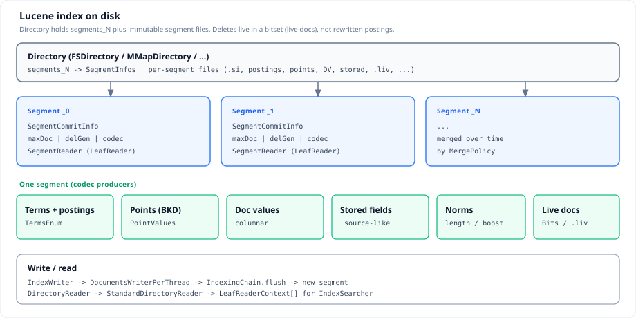
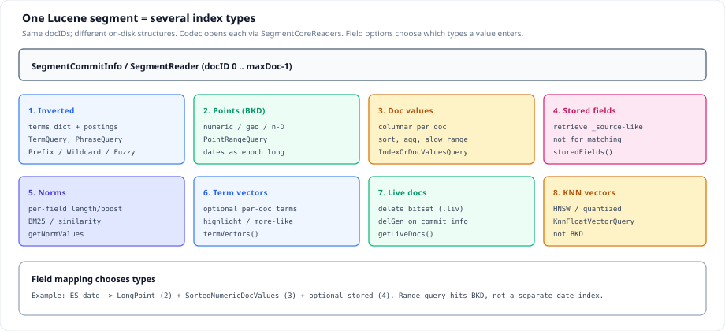
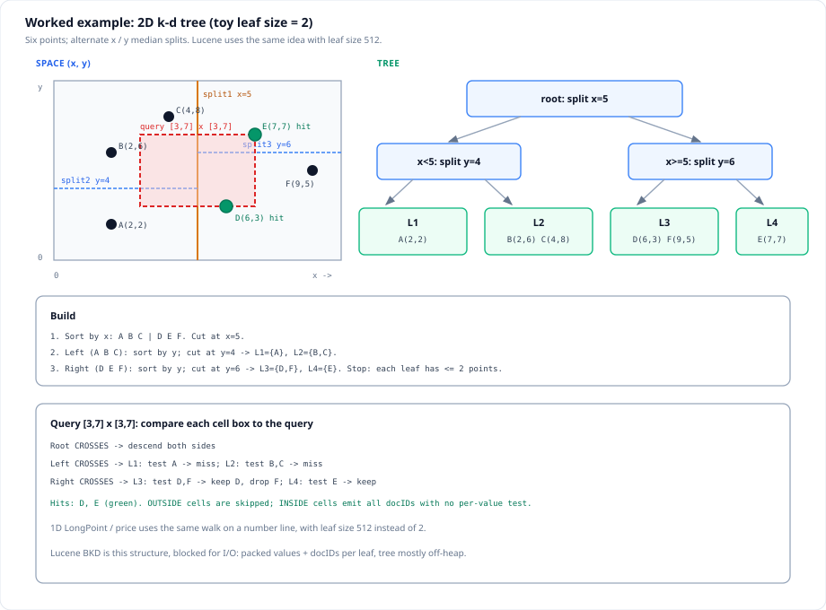
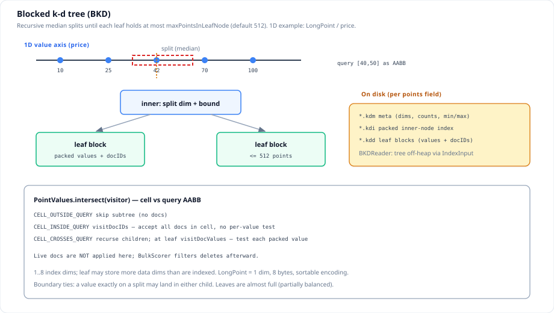
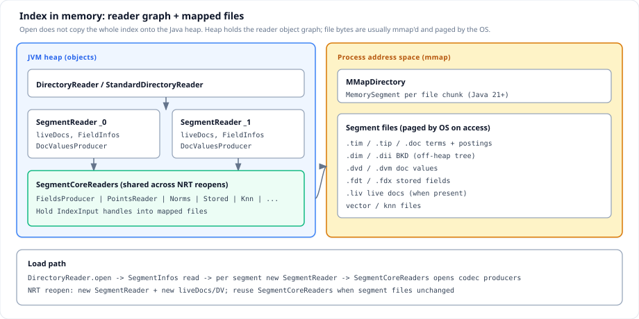
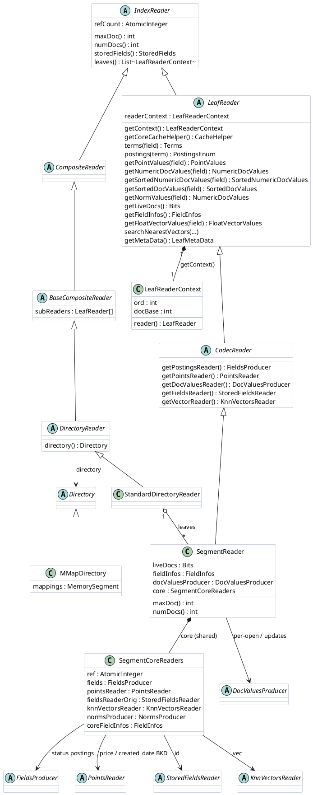
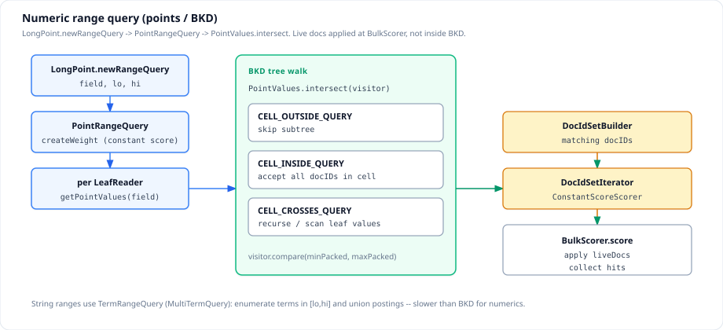

Apache Lucene is the Java library behind each Elasticsearch shard’s on-disk store. This post walks how a Lucene index is laid out—segments, index types, and the in-memory reader—then runs a concrete query example: filter by `created_date`, aggregate `qty`. Grounded in `git/lucene` (`Version.LATEST` = **11.0.0**, default write codec **Lucene104**; points remain Lucene90 / BKD).
<!--more-->

Related: [Elasticsearch generals](../elasticsearch/), [Elasticsearch cluster and indexes](../elasticsearch-cluster-index/).

Packages referenced below live under `lucene/lucene/core/` (`document`, `index`, `codecs`, `search`, `store`, `util/bkd`). Elasticsearch appears only where it maps dates and metric aggregations onto those APIs (`DateFieldMapper`, sum/avg aggregators).

---

## 1. Overview

Lucene is an embeddable library. Applications write with `IndexWriter`, open readers with `DirectoryReader`, and search with `IndexSearcher` over `Query` objects. Elasticsearch places one Lucene index behind each shard (`Store` → `Directory`, `InternalEngine` → `IndexWriter`). Cluster concerns are out of scope here; the subject is the per-shard Lucene index.

**What this post covers**

1. Overview — subject, content map, invariants  
2. Architecture — concepts and worked documents; segment files; index types (with BKD); in-memory reader graph  
3. Query example — `created_date` range via points, then `qty` aggregation via doc values  

**Invariants to keep in mind**

| Invariant | Meaning |
|-----------|---------|
| Shared docID space | Inside one segment, postings, points, doc values, and stored fields name the same integers `0 .. maxDoc-1`. |
| Field → type(s) | An `IndexableField` opts into one or more index types. A logical attribute may occupy several types; this post often uses one type per field for clarity. |
| Segment immutability | After flush, segment cores are immutable. Deletes are a separate live-docs layer (`delGen`), not in-place rewrites of postings or BKD. |
| Points vs doc values | Numeric/date **ranges** prune with BKD (`PointValues.intersect`). **Sort and aggregations** read columnar doc values. Dates are epoch-millis `LongPoint`s, not a separate index family. |
| Reader ≠ heap copy | `DirectoryReader.open` builds a small object graph and maps files (typically `MMapDirectory`). It does not deserialize the whole index onto the Java heap. |

**Out of scope:** analysis chains and tokenizers in depth, BM25 formula detail, highlighters, and HNSW internals.

---

## 2. Architecture

### 2.1 Concepts and worked documents

Indexing begins with `Document`: an ordered collection of named `IndexableField` values. `IndexWriter` buffers documents per thread (`DocumentsWriterPerThread` / `IndexingChain`). On flush, field values are written into the index types selected by each field’s options. The unit of durability and search is the **segment** (`SegmentCommitInfo` plus codec files). Several segments under one `Directory` constitute the searchable index; merges (`MergePolicy`) rewrite sets of segments into fewer ones without changing the logical document model.

| Concept | Definition |
|---------|------------|
| `Document` | Unit of indexing: ordered bag of `IndexableField`s |
| `IndexableField` | Named value plus options (analyze, store, doc values, points, vectors, …) |
| `Term` | Pair `(field, bytes)` in the inverted index (analyzed text or raw keyword bytes) |
| Segment | Immutable mini-index from a flush or merge: one `SegmentCommitInfo` and its codec files |
| Index type | One specialized on-disk structure over that segment’s docIDs (postings, BKD, doc values, …) |
| Codec | Pluggable formats that encode each index type; this tree’s default write name is **Lucene104** |

The sections below use one **worked segment** `_0` with two documents. The schema is minimal: each index type has a clear representative. Points has two fields (`price` and `created_date`) because both are 1D `LongPoint` BKDs and the query example needs a date range. Production mappings often dual-index the same name (for example `LongPoint` plus `SortedNumericDocValuesField`); that pattern is noted where relevant and avoided in the schema so file families stay distinct.

| Field | Lucene type | Index type | doc 0 | doc 1 |
|-------|-------------|------------|-------|-------|
| `status` | `StringField` | inverted | `published` | `draft` |
| `price` | `LongPoint` | points (BKD) | `42` | `100` |
| `created_date` | `LongPoint` (epoch millis) | points (BKD) | `2024-01-15` | `2024-06-01` |
| `qty` | `SortedNumericDocValuesField` | doc values | `3` | `10` |
| `id` | `StoredField` | stored | `doc-0` | `doc-1` |
| `vec` | `KnnFloatVectorField` (dim 3) | knn | `[0.1, 0.2, 0.3]` | `[0.9, 0.1, 0.0]` |

```java
// 2024-01-15T00:00:00Z and 2024-06-01T00:00:00Z
static final long D0 = 1705276800000L;
static final long D1 = 1717200000000L;

Document d0 = new Document();
d0.add(new StringField("status", "published", Store.NO));
d0.add(new LongPoint("price", 42L));
d0.add(new LongPoint("created_date", D0));
d0.add(new SortedNumericDocValuesField("qty", 3L));
d0.add(new StoredField("id", "doc-0"));
d0.add(new KnnFloatVectorField("vec", new float[] {0.1f, 0.2f, 0.3f}));
writer.addDocument(d0);
// Document 1: status=draft, price=100, created_date=D1, qty=10, id=doc-1, vec=[0.9,0.1,0.0]
// flush/commit -> segment _0, maxDoc = 2
```

Section 2.2 places these values in files; 2.3 describes each index type; 2.4 shows the reader object graph over the same segment.

### 2.2 Segment on disk



A `Directory` is the durable root: `segments_N` (`SegmentInfos`) lists live `SegmentCommitInfo` entries, and each segment owns a family of codec files. Soft deletes and updates are layered as **live docs** (and optionally doc-values updates) keyed by generation (`delGen`); the flushed postings and points cores are not rewritten until merge.

**Write path (summary):** `IndexWriter` → `DocumentsWriterPerThread` → `IndexingChain` → flush → new `SegmentCommitInfo` appended to `SegmentInfos`. Compaction is `MergePolicy` / `MergeScheduler`.

**Example `Directory`** after flushing the two documents into `_0` (compound file disabled; Lucene104 / Lucene90-style names):

```text
Directory/
  segments_1                 # SegmentInfos: SegmentCommitInfo _0, maxDoc=2
  _0.si                      # SegmentInfo, codec Lucene104
  _0.fnm                     # FieldInfos: status, price, created_date, qty, id, vec
  _0_Lucene104_0.tim/.tip    # terms dictionary (status)
  _0_Lucene104_0.doc         # postings for status
  _0.kdm / _0.kdi / _0.kdd   # points: separate BKD per field (price, created_date)
  _0.dvd / _0.dvm            # doc values: qty
  _0.fdt / _0.fdx            # stored: id
  _0_Lucene99_0.vec / ...    # knn: vec
  # no *.nvd / *.liv         # no norms; nothing deleted
```

| File family | Role on this segment |
|-------------|----------------------|
| `segments_1`, `_0.si`, `_0.fnm` | Commit list; segment identity; six field infos |
| `*.tim` / `*.tip` / `*.doc` | Inverted: `status:published` → `[0]`, `status:draft` → `[1]` |
| `*.kdm` / `*.kdi` / `*.kdd` | Points: `price` (`42`/`100`); `created_date` (`D0`/`D1`) |
| `*.dvd` / `*.dvm` | Doc values: `qty` = `[3, 10]` by docID |
| `*.fdt` / `*.fdx` | Stored: `id` per document |
| knn `*.vec`… | `vec` per document |
| `*.liv` | Absent ⇒ `liveDocs == null`; both documents live |

### 2.3 Index types

A segment is a **bundle of specialized indexes** over the same docIDs. Matching, sorting, retrieval, and vector search attach to different types; they must not be conflated.



#### 1. Inverted index — `status`

The inverted index maps terms to postings lists (`PostingsFormat`: `*.tim` / `*.tip` / `*.doc`). For `StringField`, the term bytes are the field value itself. Here `published` posts document `0` and `draft` posts document `1`. `TermQuery`, Boolean combinations, and most multi-term queries execute against this structure.

#### 2. Points index (BKD) — `price` and `created_date`

**Points** store fixed-width multi-dimensional values in a **blocked k-d tree** (BKD): `BKDWriter` / `BKDReader`, exposed by `Lucene90PointsFormat` as `*.kdm` (meta), `*.kdi` (inner index), and `*.kdd` (leaf blocks). Each points field has its own tree. `LongPoint`, `IntPoint`, geo types, and **dates-as-epoch-millis** all use this family. It is not a substitute for the inverted index.

**Blocked k-d tree.** A classical k-d tree alternates axis-aligned splits. Lucene stops recursion when a cell holds at most `maxPointsInLeafNode` points (default **512**) and writes each leaf as a block of packed values plus docIDs. The tree is partially balanced: leaves are full except possibly one short leaf, and leaves may occupy the bottom two levels. A value exactly on a split boundary may land in either child.

**Toy 2D example (leaf size 2).** The algorithm is easiest to see in two dimensions with a tiny leaf capacity. Lucene’s default leaf size remains 512; only the numbers change.

| Point | Coordinates |
|-------|-------------|
| A | (2, 2) |
| B | (2, 6) |
| C | (4, 8) |
| D | (6, 3) |
| E | (7, 7) |
| F | (9, 5) |

1. Sort by *x*; cut at **x = 5** → left `{A,B,C}`, right `{D,E,F}`.  
2. Left: sort by *y*; cut at **y = 4** → **L1** `{A}`, **L2** `{B,C}`.  
3. Right: sort by *y*; cut at **y = 6** → **L3** `{D,F}`, **L4** `{E}`.  

```text
                    [split x=5]
                   /            \
           [split y=4]        [split y=6]
           /        \          /        \
        L1{A}     L2{B,C}   L3{D,F}    L4{E}
```

Range query `[3, 7] × [3, 7]` compares each cell’s bounding box to the query AABB:

| Cell | Relation | Action |
|------|----------|--------|
| Root | CROSSES | Descend |
| Left / right | CROSSES | Descend |
| L1, L2 | CROSSES | Test points → miss |
| L3 | CROSSES | Keep **D**, drop F |
| L4 | CROSSES | Keep **E** (leaf box is not ⊆ query) |

**Hits: D, E.** Fully outside cells are skipped; a fully inside cell would emit every docID in the subtree without testing coordinates. That pruning is `PointValues.intersect`.



For 1D fields (`price`, `created_date`) the same process runs on a number line. Two values fit in one leaf under capacity 512.

| `BKDConfig` | Role | Value for these fields |
|-------------|------|------------------------|
| `numDims` | Dimensions stored in leaf data | 1 |
| `numIndexDims` | Dimensions used for inner splits (max 8) | 1 |
| `bytesPerDim` | Width per dimension | 8 (sortable long) |
| `maxPointsInLeafNode` | Leaf capacity | 512 |

`BKDWriter` finishes points into the three `*.kd*` files. Split selection is near-median per chosen dimension. Sort may spill to temporary files beyond `maxMBSortInHeap` (default 16 MB).

**Intersect relations** (used by `PointRangeQuery`):

| Relation | Meaning | Action |
|----------|---------|--------|
| `CELL_OUTSIDE_QUERY` | Cell misses the query | Skip subtree |
| `CELL_INSIDE_QUERY` | Cell ⊆ query | `visitDocIDs` — accept all docs in the cell |
| `CELL_CROSSES_QUERY` | Partial overlap | Recurse; at a leaf, `visitDocValues` tests each value |

Live documents are **not** filtered inside `intersect`; `BulkScorer` applies `liveDocs` afterward. `estimatePointCount` uses the same relations for cost-based choices such as `IndexOrDocValuesQuery`.



On the worked segment, `price` and `created_date` each have a 1D BKD. Section 3.2 runs `LongPoint.newRangeQuery("created_date", …)` for Q1 2024 and selects doc 0. Trees stay **off-heap** under `BKDReader` (`IndexInput` / mmap); the heap holds only small metadata (dims, counts, min/max).

#### 3. Doc values — `qty`

Doc values are a columnar encoding by docID (`*.dvd` / `*.dvm`). Here `qty` is `[3, 10]`. Sort and aggregations iterate this column with `advanceExact` / `nextValue`. The schema does not also index `qty` as points.

#### 4. Stored fields — `id`

Stored fields (`*.fdt` / `*.fdx`) hold values for retrieval only (`storedFields().document`). They do not participate in matching.

#### 5–6. Norms and term vectors

Unused in this schema (`StringField` omits norms; term vectors off). Other field types (for example `TextField` with term vectors enabled) write `*.nvd` / term-vector files.

#### 7. Live docs

Live docs are a segment-level bitset, not a field. After flush with no deletes there is no `.liv` file and `getLiveDocs()` returns null (all docIDs live). Deleting document 1 clears bit 1 for scorers; postings and points may still mention `1` until merge rewrites the cores.

#### 8. KNN vectors — `vec`

Dense vectors live in the knn file family. `KnnFloatVectorQuery` searches that structure; it does not use the `price` or `created_date` BKD.

**Invariant:** docIDs `0` and `1` are identical across all types on `_0`.

### 2.4 Memory layout

Opening an index does not load every byte onto the Java heap. `DirectoryReader.open` constructs a heap **object graph** and opens `IndexInput`s. With **`MMapDirectory`**, file chunks are mapped via `MemorySegment`; the operating system pages bytes on touch.



**Type hierarchy.** `IndexReader` is sealed into composite and leaf. Disk indexes open as `StandardDirectoryReader` (`DirectoryReader`). Its leaves are `SegmentReader` instances (`CodecReader` → `LeafReader`). Each `SegmentReader` holds per-open state (`liveDocs`, current `FieldInfos`, `DocValuesProducer`) and a reference-counted `SegmentCoreReaders` that owns immutable codec readers into mapped files. Near-real-time reopen may allocate a new `SegmentReader` (new live docs) while retaining the same core.

**`LeafReader` as the search surface.** `IndexSearcher` does not score through the composite API for postings access. It iterates `reader.leaves()`, and for each `LeafReaderContext` builds scorers in that leaf’s local docID space (`0 .. maxDoc-1`), remapping hits with `ctx.docBase`. A leaf is atomic: one segment, no children. Field access for matching and retrieval is through the leaf: `terms` / `postings`, `getPointValues`, doc-values getters, `getLiveDocs`, `storedFields()`, and `searchNearestVectors`. On `_0`: `terms("status")`, `getPointValues("created_date")` (and `"price"`), `getSortedNumericDocValues("qty")`, stored `id`, knn `vec`.



| Layer | Contents |
|-------|----------|
| Heap — composite | `StandardDirectoryReader` |
| Heap — leaf | `SegmentReader`: `liveDocs`, `FieldInfos`, `DocValuesProducer` |
| Heap — shared core | `SegmentCoreReaders`: `FieldsProducer`, `PointsReader`, stored, knn |
| Address space | mmap’d `*.tim` / `*.kdd` / `*.dvd` / `*.fdt` / knn files |
| Heap — metadata | FieldInfos; BKD min/max for points fields; terms metadata for `status` |

```text
DirectoryReader.open(directory)
  -> read SegmentInfos (segments_1)
  -> new SegmentReader(_0)
       SegmentCoreReaders: FieldInfos + fields + points + stored + knn
       liveDocs; DocValuesProducer (qty)

StandardDirectoryReader
  leaves: [ SegmentReader(_0) ]
    maxDoc = 2, numDocs = 2, liveDocs = null
    fieldInfos = {status, price, created_date, qty, id, vec}
    core.points -> PointsReader   # price + created_date BKD off-heap
    docValues   -> qty [3, 10]
```

### 2.5 Package map

| Package | Role |
|---------|------|
| `document` | Field types: `StringField`, `LongPoint`, `SortedNumericDocValuesField`, … |
| `index` | `IndexWriter`, `DirectoryReader`, `SegmentReader`, `SegmentCoreReaders`, `PointValues` |
| `codecs` | Per-type formats (`PostingsFormat`, points, doc values, …) |
| `search` | `Query`, `IndexSearcher`, `PointRangeQuery`, `IndexOrDocValuesQuery` |
| `util.bkd` | `BKDWriter` / `BKDReader` / `BKDConfig` |
| `store` | `Directory`, `MMapDirectory`, `IndexInput` |

---

## 3. Query example

On the worked segment, run the usual Elasticsearch pairing—**filter then aggregate**:

| Step | Workload | Field | Index type | Primary API |
|------|----------|-------|------------|-------------|
| 3.2 | Inclusive range for Q1 2024 | `created_date` | Points (BKD) | `LongPoint.newRangeQuery` → `PointValues.intersect` |
| 3.3 | Sum (or avg) on matches | `qty` | Doc values | `SortedNumericDocValues` |

`created_date` is points-only in the schema; `qty` is doc-values-only. `DateFieldMapper` in Elasticsearch often also writes doc values for the date field (sorting and `IndexOrDocValuesQuery`); that is optional for the paths below.

### 3.1 Shared search entry

```text
DirectoryReader.open(directory)
  -> IndexSearcher(reader)
  -> search(created_date_range_query, collector)   # ES also attaches qty agg collectors
       rewrite(query) -> createWeight(...)
       for each LeafReaderContext leaf:
         ScorerSupplier -> BulkScorer.score(..., acceptDocs = liveDocs)
         LeafCollector reads qty for matching local docIDs
```

`acceptDocs` is `leaf.reader().getLiveDocs()`. Query scoring respects deletes here; BKD `intersect` does not.

### 3.2 Range query on `created_date`

**Intent:** retain documents with `created_date` in `[2024-01-01T00:00:00Z, 2024-03-31T23:59:59.999Z]`. Only doc **0** (`2024-01-15`) matches; doc 1 (`2024-06-01`) does not.



**Construction.** Bounds are sortable longs (epoch millis). Elasticsearch parses date-math or strings to those longs, then builds a points range:

```java
long lo = 1704067200000L; // 2024-01-01T00:00:00Z
long hi = 1711929599999L; // 2024-03-31T23:59:59.999Z

Query q = LongPoint.newRangeQuery("created_date", lo, hi);
// PointRangeQuery: 1 dimension, 8 bytes per bound

// Optional production hybrid (requires DV on created_date):
new IndexOrDocValuesQuery(
    LongPoint.newRangeQuery("created_date", lo, hi),
    SortedNumericDocValuesField.newSlowRangeQuery("created_date", lo, hi));
```

`IndexOrDocValuesQuery` selects the points side when its estimated cost makes it a suitable lead iterator; otherwise it uses the doc-values range. `bulkScorer()` always uses the points side. A range on `price` is the same mechanism with a different field name and bounds.

**Per-leaf execution**

```text
PointRangeQuery.createWeight
  -> ConstantScoreWeight.scorerSupplier(leaf)
       leaf.reader().getPointValues("created_date").intersect(visitor)
       -> DocIdSet of matching local docIDs
  -> BulkScorer.score(collector, acceptDocs)
```

| Relation | Action |
|----------|--------|
| `CELL_OUTSIDE_QUERY` | Skip subtree |
| `CELL_INSIDE_QUERY` | `visitDocIDs` |
| `CELL_CROSSES_QUERY` | Recurse; at leaf, test packed millis |

The `created_date` BKD contains `D0` (doc 0) and `D1` (doc 1). Intersect for the Q1 window emits document **0** only. On dense single-valued leaves with a large estimated hit count, `PointRangeQuery` may invert the visit (mark non-matches, flip a bitset). Structure detail: section 2.3.

### 3.3 Aggregation on `qty`

**Intent:** after the date filter, compute a metric on **`qty`** for surviving documents—for example sum = **3**. Aggregators do not read values from the `created_date` BKD. They advance the `qty` column for each matching docID.

```text
for each LeafReaderContext leaf:
  SortedNumericDocValues dv = DocValues.getSortedNumeric(leaf.reader(), "qty")
  for each matching docID (from the created_date scorer / bitset):
    if (dv.advanceExact(doc)):
      for i in 0 .. dv.docValueCount()-1:
        accumulate(dv.nextValue())   # 3 for doc 0
```

| Surface | Role |
|---------|------|
| `DocValues.getSortedNumeric(reader, "qty")` | Per-leaf column iterator |
| Lucene `LongRangeFacetCounts` / sandbox `HistogramCollector` | Facet-style aggregation over doc values |
| ES `SumAggregator` / `AvgAggregator` | Metrics over fielddata (`SortedNumericDoubleValues`) |
| ES `NumericHistogramAggregator` | Numeric bucketing over doc values |

With the Q1 filter, only doc 0 remains ⇒ `sum(qty) = 3`. A match-all query would yield `3 + 10 = 13`. Points decided **membership**; doc values supplied **measure**.

BKD is organized for geometric pruning; doc values are organized for sequential and `advanceExact` access by docID. The worked schema assigns those roles to different fields so both file families appear explicitly.

### 3.4 Key types

| Type | Role |
|------|------|
| `LongPoint` / `PointRangeQuery` | Date (or numeric) range construction and weight |
| `PointValues` / `BKDReader` | `intersect` on `created_date` |
| `IndexOrDocValuesQuery` | Optional choice between points and DV range |
| `IndexSearcher` / `Weight` / `BulkScorer` | Per-leaf scoring and `liveDocs` |
| `SortedNumericDocValues` | `qty` for aggregations |
| ES `DateFieldMapper` | Date-math → epoch millis → `LongPoint` (+ optional DV) |
| ES `SumAggregator` / `AvgAggregator` | Metric aggregations over fielddata |

---

## Scope

Covered: how a Lucene index is organized (Directory, segments, index types, reader/mmap layout) and a query example on the worked segment—`created_date` range via points, `qty` aggregation via doc values. Not covered: analysis pipelines in depth, scoring formulas, highlighters, HNSW. Shard and cluster embedding: [Elasticsearch cluster and indexes](../elasticsearch-cluster-index/).
