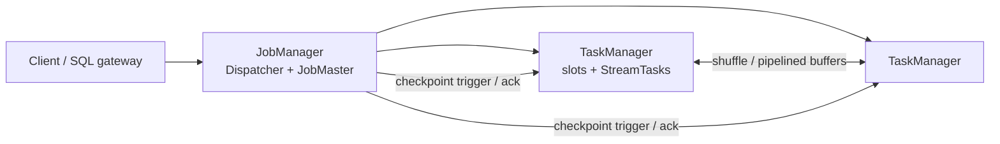
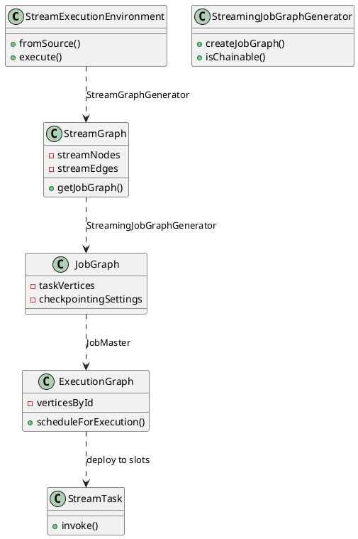
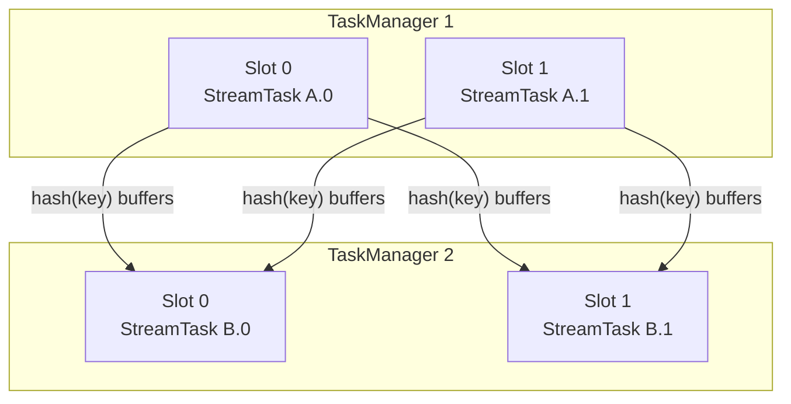
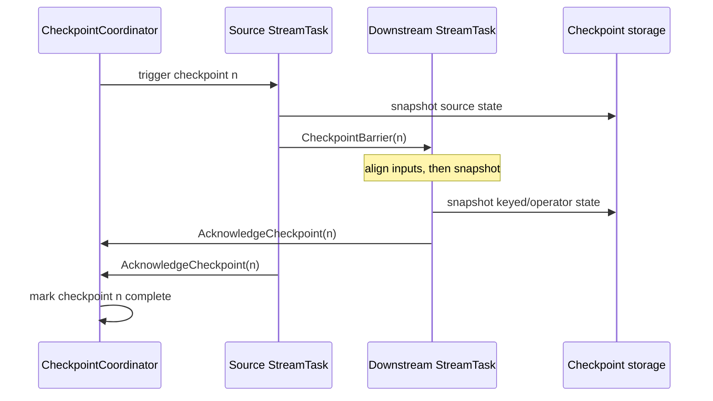

**Apache Flink** is a distributed engine for continuous (and bounded) dataflow programs. A job is a graph of operators; the runtime places parallel **tasks** on **TaskManagers**, keeps operator **state** local to those tasks, and advances time with **watermarks** so windows and timers close at well-defined points.

<!--more-->

---

## 1. Overview

A Flink application builds a logical pipeline—sources, transforms, sinks—usually through the DataStream API (`StreamExecutionEnvironment`) or the Table / SQL API. Calling `execute` (or submitting a JAR to a cluster) turns that pipeline into a physical job that runs until cancelled, fails past recovery, or finishes when all bounded inputs end.

The cluster has two process roles:

| Role | Responsibility |
|------|----------------|
| **JobManager** | Accepts jobs, builds the scheduling plan, coordinates checkpoints, recovers failures |
| **TaskManager** | Hosts **task slots**; runs one or more subtasks; holds keyed/operator state locally |

One JobManager is the leader for a given high-availability setup. TaskManagers register slots with the ResourceManager; the JobMaster claims slots and deploys tasks into them.



Default execution is **streaming**: records flow indefinitely, checkpoints capture consistent state snapshots, and recovery restores the last completed checkpoint. The same operators can run in **batch** style (`RuntimeExecutionMode.BATCH`) when all inputs are bounded; the scheduler then prefers blocking shuffles and can skip continuous checkpointing.

Parallelism is per operator (or a job default). A logical operator with parallelism `p` becomes `p` **subtasks**. Subtasks of the same operator share no mutable state; keyed state is partitioned by key group so that after a rescale Flink can redistribute groups without rewriting every key.

---

## 2. Job graph translation

User code does not schedule threads directly. Flink lowers the API graph in stages until each TaskManager runs concrete `StreamTask` instances.

**Transformations → StreamGraph.** Each DataStream operator call adds a `Transformation`. `StreamGraphGenerator` builds a `StreamGraph`: vertices are `StreamNode`s (operator factories, parallelism, state keys), edges are `StreamEdge`s (partitioner, exchange mode).

**StreamGraph → JobGraph.** `StreamingJobGraphGenerator.createJobGraph` collapses **chainable** operator sequences into one `JobVertex`. Chaining is allowed when the edge is forward (same parallelism, no re-partition), chaining is enabled, and the operators are compatible. Everything inside a chain runs in one thread and one mailbox, so there is no network hop between chained `map`/`filter` steps.

**JobGraph → ExecutionGraph.** The JobMaster expands each `JobVertex` into `parallelism` execution vertices, wires intermediate result partitions, and asks the scheduler to deploy them onto slots.



```text
API:     source -> map -> keyBy -> window -> sink
Stream:  [src] --fwd--> [map] --hash--> [window] --fwd--> [sink]
Job:     JobVertex_A(src+map)  ==network==>  JobVertex_B(window+sink)
Exec:    A.0 A.1 ...     shuffle      B.0 B.1 ...
```

`StreamGraph.getJobGraph` is the bridge the client (or Application Mode cluster entrypoint) uses before the JobMaster materializes the `ExecutionGraph`. Failures restart from the last completed checkpoint by resetting tasks and restoring state handles recorded in that checkpoint.

---

## 3. TaskManagers, slots, and data exchange

A TaskManager is a JVM worker. It advertises a fixed number of **slots**; each slot can run one parallel pipeline slice (one subtask from each chained JobVertex sharing that slot in slot-sharing groups). CPU and managed memory are budgeted per slot.

Records leave a chain through a **result partition** and enter the downstream chain through an **input gate**. Exchange modes matter:

| Mode | Behavior |
|------|----------|
| **Pipelined** | Producer sends buffers as soon as they fill; consumer reads concurrently (default streaming) |
| **Blocking** | Producer finishes a partition before the consumer reads (common in batch) |

Partitioners on `StreamEdge` decide routing: `ForwardPartitioner` keeps data local to the same subtask index, `KeyGroupStreamPartitioner` (after `keyBy`) hashes keys into key groups, `RebalancePartitioner` round-robins for load balance.



Backpressure is local: when a consumer’s input buffers fill, credit-based flow control slows the upstream output. That pressure propagates through pipelined edges until sources throttle or buffer timeouts fire.

---

## 4. State and checkpoints

Stateful operators store values in a **state backend** (heap, RocksDB, or others). After `keyBy`, state is **keyed**: each key group lives with the subtask that owns that group. Operator state (e.g. source offsets as list state) is redistributed on rescale by redistribution schemes declared on the state descriptor.

Consistency across the distributed graph uses **checkpoints**. The JobMaster’s `CheckpointCoordinator` periodically triggers a checkpoint:

1. Allocate a checkpoint id and storage location.
2. Send a trigger to source tasks (and notify operator coordinators when present).
3. Sources inject a **checkpoint barrier** into each outgoing stream.
4. Barriers flow with the data. On alignment (exactly-once), a task waits until the barrier arrives on all input channels for that checkpoint, then snapshots its state and forwards the barrier downstream.
5. Tasks acknowledge the coordinator with state handles. When all acknowledge, the checkpoint is marked **completed** and becomes the recovery baseline.



Exactly-once end-to-end additionally requires transactional sinks (or two-phase commit operators) that commit only after the checkpoint that includes their side effects completes. At-least-once can skip full barrier alignment so barriers overtake buffered data; recovery may replay more records.

Savepoints are user-triggered checkpoints with a stable format used for stop-with-savepoint, deploy upgrades, and rescaling. Externalized checkpoints keep metadata after job termination when retention is configured.

On recovery, the JobMaster resumes from the latest completed checkpoint: tasks restore state handles, sources re-emit from the offsets stored in that snapshot, and in-flight data after the barriers is discarded or replayed according to the mode.

---

## 5. Event time and watermarks

Flink distinguishes **processing time** (wall clock on the machine) from **event time** (timestamps carried by records). Event-time windows and timers fire from the progress of **watermarks**, not from wall-clock ticks.

A `WatermarkStrategy` supplies:

- a `TimestampAssigner` that stamps each record;
- a `WatermarkGenerator` that emits watermark values (periodically or on records).

`WatermarkStrategy.forBoundedOutOfOrderness(Duration)` is the common generator: it tracks the max observed event timestamp and emits `maxEventTs - outOfOrderness` (minus one millisecond in the usual formulation), so late arrivals within the bound can still join open windows.

```java
DataStream<Event> events = env.fromSource(
    source,
    WatermarkStrategy
        .<Event>forBoundedOutOfOrderness(Duration.ofSeconds(5))
        .withTimestampAssigner((e, ts) -> e.getEventTimeMillis()),
    "events");

events
    .keyBy(Event::getKey)
    .window(TumblingEventTimeWindows.of(Duration.ofMinutes(1)))
    .aggregate(new CountAggregate())
    .sinkTo(sink);
```

Watermarks propagate downstream. At a multi-input operator, the effective watermark is the **minimum** across inputs (and channels): the operator must not advance event time past data that might still arrive on a slower channel. Idle sources can be marked idle so they do not hold the minimum forever.

```text
records:   t=10  t=12  t=11  t=18  t=20
watermark:              ....  W=13       W=15
bound = 5s  =>  W ≈ maxEventTs - 5s

window [0,60s): closes when watermark >= 60s
```

Late records that arrive after the watermark has passed their window are either dropped, sent to a side output configured for lateness, or allowed into still-open windows if `allowedLateness` extends the lifetime. Processing-time windows ignore watermarks and fire on timer service wall-clock deadlines.

---

## 6. Minimal job shape

A complete streaming job always has the same outer shape: environment, source with timestamps if event time is used, keyed stateful (or windowed) operators, sink, and checkpoint configuration.

```java
StreamExecutionEnvironment env = StreamExecutionEnvironment.getExecutionEnvironment();
env.enableCheckpointing(10_000); // ms
env.getCheckpointConfig().setCheckpointingConsistencyMode(CheckpointingMode.EXACTLY_ONCE);

env.fromSource(source, watermarkStrategy, "src")
    .map(new ParseFn())
    .keyBy(Event::getKey)
    .process(new StatefulCountFn())
    .sinkTo(sink);

env.execute("order-count");
```

`StatefulCountFn` would hold a `ValueState<Long>` (or `MapState`) under the current key; after every checkpoint that state is part of the acknowledged snapshot. With RocksDB, large keyed state stays on local disk and is uploaded incrementally according to the configured checkpoint storage (JobManager + durable filesystem, or a fully remote incremental scheme).

The JobManager never sees individual records. It only schedules tasks, triggers checkpoints, and restores state handles. Throughput and latency are determined by slot count, chain boundaries, network buffers, state backend, and watermark delay—not by a central broker inside Flink itself.
