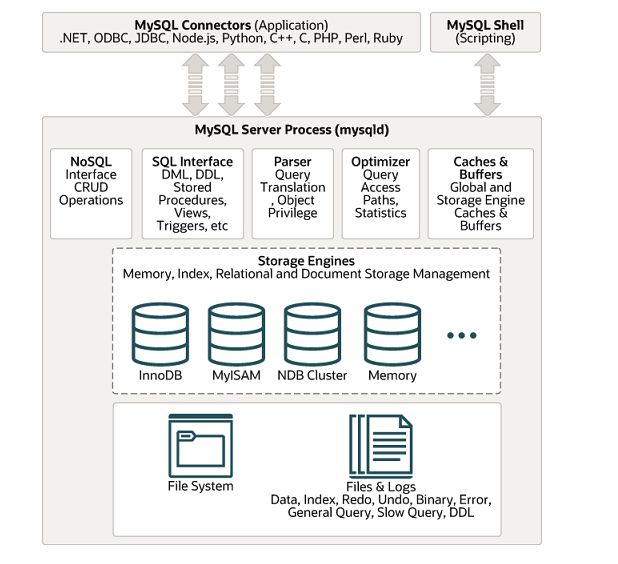

this article introduce Mysql internals
<!--more-->
# 1. Architecture


source code dir:
* `libmysql`    generate `libmysqlclient.so`
* `sql`         main codebase 
  * `dd`        Data dictionary


# 2. Server

Mysql Server maintains a one thread per connection model. 


## 2.1. Service

A `Service` is a struct of C function pointers
The server has all `service` structs defined and initialized so that the function pointers point to a actual `service` implementation functions


The big picture of plugin services


```plantuml


  actor "SQL client" as client
  box "MySQL Server" #LightBlue
    participant "Server Code" as server
    participant "Plugin" as plugin
  endbox

  == INSTALL PLUGIN ==
  server -> plugin : initialize
  activate plugin

  loop zero or many
    plugin -> server : service API call
    server --> plugin : service API result
  end
  plugin --> server : initialization done

  == CLIENT SESSION ==
  loop many
    client -> server : SQL command
    server -> server : Add reference for Plugin if absent
    loop one or many
      server -> plugin : plugin API call
      loop zero or many
        plugin -> server : service API call
        server --> plugin : service API result
      end
      plugin --> server : plugin API call result
    end
    server -> server : Optionally release reference for Plugin
    server --> client : SQL command reply
  end

  == UNINSTALL PLUGIN ==
  server -> plugin : deinitialize
  loop zero or many
    plugin -> server : service API call
    server --> plugin : service API result
  end
  plugin --> server : deinitialization done
  deactivate plugin

```

## 2.2. Data Dictionary


Mysql Server incorporates a transactional data dictionary that stores information about database objects. 
The data dictionary schema stores dictionary data in transactional(InnoDB) tables. Data. 
Data dictionary tables are located in the `mysql` database together with non-data dictionary system tables.
Data dictionary tables are created in a single `InnoDB` tablespace named `mysql.ibd`, which resides in the MySql data directory.

Basic Data Dictionary Tables
* `catalogs` catalog information
* `schemata` information about schemata
* `tablespaces` active tablespaces
* `tables` tables in databases
* `columns` columns in tables
* `indexes` information about table indexes


Many Data Dictionary tables are exposed in `INFORMATION_SCHEMA` as table views.


## 2.3. Connection


## 2.4. Storage Engine

### 2.4.1. InnoDB
`InnoDB` is a general-purpose storage engine that balances reliability and high performance. `InnoDB` is the default MySQL storage Engine.


#### 2.4.1.1. ACID


* Atomicity     transaction management
* Consistency   protect from Crashes
* Isolation     transaction Isolation level
* Durability    Mysql software features interacting with particular hardware configuration.

#### MVCC

`Multi-version Concurrency Control` A concurrency control method used by `InnoDB` to handle simultaneous transactions without locking the entire table. 

Old versions of changed rows are stored in undo tablespaces in a data structure called a rollback segment. InnoDB uses the information in the rollback segment to perform the undo operations needed in a transaction rollback. It also uses the info to build earlier versions of a row for a consistent read.

Internally `InnoDB` adds three fields to each row stored in the database:
* `DB_TRX_ID` indicates the transaction identifier for the last transaction that inserted or updated the row.
* `DB_ROLL_PTR` roll pointer points to an undo log record written to the rollback segment. if the row was updated, the undo log record contains the information necessary to rebuild the content of the row before it was updated.
* `DB_ROW_ID` contains a row ID that increases monotonically as new rows are inserted.


#### In Memory Structure

`Buffer pool` is an area in main memory where `InnoDB` caches table and index data as it is accessed. The buffer pool permits frequently used data to be accessed directly from memory

#### On Disk Structure

A `file-per-table` tablespace contains data and indexes for a single `InnoDB` table, and is stored on the file system in a single data file.


## 2.5. Bin log

## 2.6. Parser

## 2.7. optimizer

## 2.8. Mysqld

Configs
* `--defaults-file=#` read defaults options from the given file
* `--datadir=#` path to the database root directory 
* `--init-file=name` Read SQL commands from this file at startup
* `--open_files_limit=#`   number of file descriptors available to `mysqld`
* `--max-connections=#` max number of simultaneous client connections
* `--thread-cache-size=#` number of threads the server should cache for reuse

# 3. admin

```
show [full] processlist                      display the current running threads
SELECT * FROM performance_schema.threads    
show status like '%thread%'
```


# 4. Reference

* [mysql源码解析](https://github.com/Jeanhwea/mysql-source-course/blob/master/slides/p04-mysql-startup.pdf)
* [Mysql limitations](https://www.percona.com/blog/mysql-limitations-part-1-single-threaded-replication/)
* [MySQL · 源码分析 · 详解 Data Dictionary](http://mysql.taobao.org/monthly/2021/08/02)