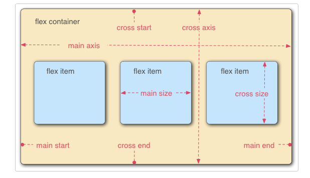

本文记录前端css 页面布局知识
<!--more-->

Cascading Style Sheets (css) is a stylesheet language used to describe the presentation of a document written in HTML or XML.
CSS describes how elements should be rendered on screen.

# Syntax
```
statements          = rulesets | at_rules | nested_statements
ruleset             = selector_list declaration_block
at_rule             = "@"identifier others
selector_list       = selectors {"," selectors}
declaration_block   = "{" {declaration} "}"
declaration         = property:value;
selectors           = selector{combinator selectors}
combinator          =   +   //next sibling
                        >   // child combinator
                        ||  // column combinator
                        ~   //subsequent sibling combinator
                        " " // descent combinator
                        |   // namespace separator

selectors           =   :blank
                        :active
                        :first-child
                        :is()
                        #tag // id selectors
                        .tag // class selectors
                        tag  // type selectors
```

## selectors

css selectors are the patterns used to match or select the elements to which a set of css rules are applied along with their specificity. 
Combinators allow precise selection by enabling selecting elements based on their relationship to other elements.

## inheritance
inheritance controls what happens when no value is specified for a property on an element.
1. inherited properties, by default are set to computed value of the parent element
2. non-inherited properties, which by default are set to initial value of the property


# Box model

Everything in CSS has a box around it.

## outer display type
if `width` not specified, box will extend in the inline direction to fill the container
`<h> <p>` use block as default outer display type
```
.box {
    display:block;
    width
    height
    padding
    margin
    border
}
```
## inline display type

## Flex model

Flexbox is a one-dimensional layout method for arranging items in ros or columns. Items flex (expand) to fill additional space or shrink to fit into smaller spaces.

Flex items are laid out along two axes:
1. main axis
2. cross axis
3. felx container parent element



# Grid layout

A grid is a collection of horizontal and vertical lines creating a pattern against which we can line up our design elements.
A grid will typically have columns, rows.
```
.container {
    display: grid;
    grid-template-columns: 200px 200px 200px; // 3 columns
}
```


# Unit
1. cm centimeter  1cm = 37.8px
2. mm millimeter
3. in inches
4. pt points 1/72nd of 1in
5. px pixels 1/96th of 1in
6. em   relative to the font size of the parent element 
7. rem  relative t the font size of the root element
8. vh   viewport's height
9. vw   viewport's width