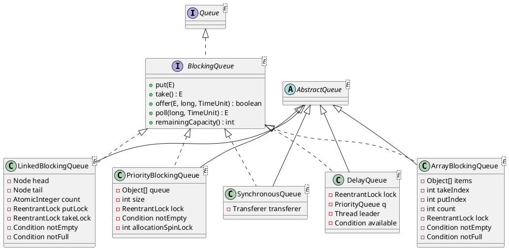

`java.util.concurrent.BlockingQueue` extends `Queue` with **blocking insertion and retrieval**: a producer invoking `put` suspends when capacity is exhausted; a consumer invoking `take` suspends when no element is available. All JDK implementations are thread-safe and intended for producer–consumer pipelines; their primary deployment is as the `workQueue` of `ThreadPoolExecutor`.

This article examines the OpenJDK implementations: the dual-condition bounded-buffer pattern, the two-lock design of `LinkedBlockingQueue`, the heap-backed `PriorityBlockingQueue`, the zero-capacity rendezvous semantics of `SynchronousQueue`, and the timed waiting protocol of `DelayQueue`.
<!--more-->

---

## 1. Overview

### 1.1 Interface contract

`BlockingQueue<E>` defines four variants of each operation: one that throws an exception, one that returns a sentinel value, one that blocks indefinitely, and one that blocks up to a specified timeout:

| | Throws exception | Special value | Blocks | Times out |
|--|------------------|---------------|--------|-----------|
| **Insert** | `add(e)` | `offer(e)` | `put(e)` | `offer(e, time, unit)` |
| **Remove** | `remove()` | `poll()` | `take()` | `poll(time, unit)` |
| **Examine** | `element()` | `peek()` | — | — |

Properties common to all implementations:

- **Null prohibition** — `null` elements are rejected; `null` is reserved as the failure indicator for non-blocking `poll`.
- **Capacity semantics** — bounded implementations report `remainingCapacity()`; implementations without an intrinsic bound always return `Integer.MAX_VALUE`.
- **Operation atomicity** — individual queue operations are atomic; compound `Collection` operations (`addAll`, `removeAll`, etc.) are not guaranteed to be atomic unless explicitly documented by the implementation.
- **No shutdown protocol** — the interface defines no close or shutdown operation; callers typically employ poison-pill elements or external cancellation.

Blocking methods declare `InterruptedException` and respond to thread interruption while waiting on internal conditions.

### 1.2 Standard implementations

| Class | Backing structure | Capacity | Ordering | Synchronization |
|-------|-------------------|----------|----------|-----------------|
| `ArrayBlockingQueue` | circular `Object[]` | fixed at construction | FIFO | one `ReentrantLock`; two `Condition` variables |
| `LinkedBlockingQueue` | singly linked nodes | optional bound (default `Integer.MAX_VALUE`) | FIFO | separate `putLock` and `takeLock`; `AtomicInteger count` |
| `PriorityBlockingQueue` | binary heap (`Object[]`) | unbounded† | priority order | one `ReentrantLock`; CAS spinlock during heap resize |
| `SynchronousQueue` | none (direct transfer) | zero | FIFO or LIFO | non-blocking dual stack/queue (`Transferer`) |
| `DelayQueue` | `PriorityQueue<Delayed>` | unbounded† | ascending expiration time | one `ReentrantLock`; leader–follower timed wait |

†Unbounded with respect to the `BlockingQueue` API; `PriorityBlockingQueue` and `DelayQueue` may still fail with `OutOfMemoryError` under sustained insertion.

`LinkedTransferQueue` also implements `BlockingQueue` (via `TransferQueue`) but is optimized for `transfer` and `tryTransfer`. The implementations above are those used by `Executors` factory methods and typical `ThreadPoolExecutor` configurations.

---

## 2. Architecture



Implementations fall into three structural categories:

1. **Bounded buffer** (`ArrayBlockingQueue`, `LinkedBlockingQueue`) — elements reside in a fixed or capacity-limited structure; producers block at capacity, consumers block when empty.
2. **Unbounded heap** (`PriorityBlockingQueue`, `DelayQueue`) — insertion does not block on capacity; retrieval blocks while empty, or until expiration in `DelayQueue`.
3. **Direct handoff** (`SynchronousQueue`) — no element storage; each insertion must rendezvous with a concurrent removal.

Synchronization primitives (`ReentrantLock`, `Condition`, `LockSupport`) are described in [Synchronizer Framework](/post/java/concurrency/synchronizer-framework/).

---

## 3. Bounded-buffer synchronization

Array- and linked-based bounded queues employ the classical **monitor with two conditions** over a shared element count:

- **`notFull`** — waiting set for producers blocked at capacity.
- **`notEmpty`** — waiting set for consumers blocked on an empty queue.

`ArrayBlockingQueue` guards the entire structure with a single lock:

```java
public void put(E e) throws InterruptedException {
    lock.lockInterruptibly();
    try {
        while (count == items.length)
            notFull.await();
        enqueue(e);          // items[putIndex] = e; advance; count++; notEmpty.signal()
    } finally {
        lock.unlock();
    }
}

public E take() throws InterruptedException {
    lock.lockInterruptibly();
    try {
        while (count == 0)
            notEmpty.await();
        return dequeue();    // read head slot; advance; count--; notFull.signal()
    } finally {
        lock.unlock();
    }
}
```

Index advancement follows the ring-buffer scheme shared with `ArrayDeque` (`takeIndex`, `putIndex`, `inc(i, modulus)`). Constructing the lock with the fairness flag (`new ReentrantLock(fair)`) enforces FIFO ordering among contending threads at the expense of throughput.

---

## 4. Implementation analysis

### 4.1 ArrayBlockingQueue

A **fixed-capacity bounded buffer**: storage is allocated once at construction, the capacity is immutable, and memory consumption is bounded.

| Field | Role |
|-------|------|
| `items` | ring-buffer array |
| `takeIndex` / `putIndex` | dequeue and enqueue indices |
| `count` | current element count (≤ `items.length`) |
| `lock` | exclusive lock for all structural mutations |
| `notEmpty` / `notFull` | condition variables for consumers and producers |

Non-blocking variants (`offer`, `poll`) acquire the lock once and return immediately when the buffer is full or empty, respectively. `drainTo` transfers multiple elements under a single lock acquisition.

**Application profile:** fixed worker pools, explicit back-pressure with a known upper bound (`ThreadPoolExecutor` with a bounded queue), workloads where per-element node allocation is undesirable.

### 4.2 LinkedBlockingQueue

`LinkedBlockingQueue` partitions synchronization between producers and consumers:

| Lock | Scope | Associated condition |
|------|-------|----------------------|
| `putLock` | tail insertion; `notFull` wait set | `notFull` |
| `takeLock` | head removal; `notEmpty` wait set | `notEmpty` |
| `AtomicInteger count` | element count observable from either side | — |

The implementation comment states the rationale:

> The putLock gates entry to put (and offer), and has an associated condition for waiting puts. Similarly for the takeLock. The count field that they both rely on is maintained as an atomic to avoid needing to get both locks in most cases.

A `put` holds only `putLock`. When the queue transitions from empty (`c == 0` before increment), it invokes `signalNotEmpty()`, which briefly acquires `takeLock` to wake a blocked consumer. A `take` that reduces occupancy to capacity invokes the symmetric `signalNotFull()`. This **cascading signal** permits the common case to proceed without holding both locks.

```java
public void put(E e) throws InterruptedException {
    final Node<E> node = new Node<>(e);
    putLock.lockInterruptibly();
    try {
        while (count.get() == capacity)
            notFull.await();
        enqueue(node);
        c = count.getAndIncrement();
        if (c + 1 < capacity)
            notFull.signal();
    } finally {
        putLock.unlock();
    }
    if (c == 0)
        signalNotEmpty();   // queue was empty; wake a consumer
}
```

Operations requiring a consistent view of the structure (`remove(Object)`, `contains`, iteration) acquire both locks in fixed order via `fullyLock()` (`putLock`, then `takeLock`).

**Memory visibility:** enqueuing occurs under `putLock`; dequeuing reads `count` under `takeLock` and traverses from `head`. This protocol ensures visibility of the first `count` nodes without dual-lock acquisition on every operation.

**Application profile:** default queue for `Executors.newFixedThreadPool` and `newSingleThreadExecutor` (capacity `Integer.MAX_VALUE`); generally higher throughput than `ArrayBlockingQueue` under concurrent producers and consumers, at the cost of per-element node allocation and less deterministic latency.

### 4.3 PriorityBlockingQueue

A logically unbounded **priority heap** applying the same ordering contract as `PriorityQueue` (`Comparator` or `Comparable`). Insertion never blocks on capacity; `take` waits on `notEmpty` when the heap contains no elements.

| Field | Role |
|-------|------|
| `queue` | array-backed binary min-heap |
| `size` | element count |
| `lock` | serializes all public operations |
| `notEmpty` | consumer wait set when `size == 0` |
| `allocationSpinLock` | CAS-guarded spinlock for heap expansion without holding `lock` |

Heap growth allocates a replacement array. Performing allocation under the main lock would block all consumers behind resize. A thread requiring expansion therefore acquires `allocationSpinLock` by CAS, copies elements, and releases the spinlock — permitting concurrent `take` operations against the existing array during expansion.

```java
public E take() throws InterruptedException {
    lock.lockInterruptibly();
    try {
        E result;
        while ((result = dequeue()) == null)   // extract root; sift-down
            notEmpty.await();
        return result;
    } finally {
        lock.unlock();
    }
}
```

No `notFull` condition exists: `put` and `offer` succeed until memory is exhausted. Iterators are weakly consistent and do not guarantee priority order; ordered bulk removal requires `drainTo` or explicit sorting of extracted elements.

**Application profile:** priority-based task scheduling; event ordering where FIFO tie-breaking among equal priorities is not required (or is supplied via a secondary key, as in the Javadoc `FIFOEntry` example).

### 4.4 SynchronousQueue

`SynchronousQueue` retains **no queued elements**. Each insertion must rendezvous with a concurrent removal, and vice versa — equivalent to a CSP **rendezvous channel**.

Internally, `Transferer` (extending `LinkedTransferQueue`) implements the **dual stack / dual queue** algorithm of Scherer and Scott. Nodes operate in **data mode** (carrying an offered element) or **request mode** (awaiting a matcher). A complementary operation pairs with an opposite-mode node and completes the transfer without a global lock on the fast path.

| Fairness | Internal structure | Typical deployment |
|----------|-------------------|-------------------|
| Non-fair (default) | LIFO stack (`xferLifo`) | cached thread pools; improved temporal locality |
| Fair | FIFO queue | ordered handoff; message-passing pipelines |

`peek` always returns `null`. `isEmpty` and `size()` report an empty collection because no elements are buffered; waiting threads are represented as internal transfer nodes, not as stored queue entries.

**Application profile:** `Executors.newCachedThreadPool()` (handoff queue with elastic thread creation); designs requiring synchronous producer–consumer pairing without intermediate buffering.

### 4.5 DelayQueue

`DelayQueue<E extends Delayed>` delegates storage to a **`PriorityQueue`** ordered by `Delayed.getDelay()`. Only elements whose delay has elapsed (≤ 0) are eligible for removal. Insertion is unbounded and non-blocking (`put` delegates to `offer`).

Blocking retrieval employs a **leader–follower** protocol to limit concurrent timed waits:

```java
for (;;) {
    E first = q.peek();
    if (first == null)
        available.await();
    else {
        long delay = first.getDelay(NANOSECONDS);
        if (delay <= 0L)
            return q.poll();
        first = null;
        if (leader != null)
            available.await();           // follower: indefinite wait
        else {
            Thread thisThread = Thread.currentThread();
            leader = thisThread;
            try {
                available.awaitNanos(delay);  // leader: timed wait until expiration
            } finally {
                if (leader == thisThread)
                    leader = null;
            }
        }
    }
}
```

Exactly one thread (the **leader**) executes a timed wait corresponding to the head element's remaining delay. Remaining threads await on `available` without independent timers. Insertion of an element with an earlier expiration invalidates the leader and signals waiters. `ScheduledThreadPoolExecutor` employs an analogous internal `DelayedWorkQueue` for scheduled task dispatch.

**Application profile:** deferred execution, timeout management, and the scheduling substrate of `ScheduledExecutorService`.

---

## 5. Thread pool integration

`ThreadPoolExecutor` mediates between task submission and worker threads through a **`BlockingQueue<Runnable> workQueue`**:

```java
// Worker loop (simplified)
Runnable r = (allowCoreThreadTimeOut || wc > corePoolSize)
    ? workQueue.poll(keepAliveTime, NANOSECONDS)
    : workQueue.take();
```

| Factory method | Work queue | Semantics |
|----------------|------------|-----------|
| `newFixedThreadPool(n)` | `LinkedBlockingQueue` (unbounded) | fixed thread count; unbounded task backlog |
| `newSingleThreadExecutor()` | `LinkedBlockingQueue` | single worker; FIFO task ordering |
| `newCachedThreadPool()` | `SynchronousQueue` | no task buffering; thread creation when no idle worker is available |
| `ThreadPoolExecutor` (custom) | `ArrayBlockingQueue(cap)` | bounded thread count and bounded backlog |

Queue selection jointly determines **back-pressure** behavior: a bounded queue causes `execute` to reject (under the default handler) when full; `SynchronousQueue` applies back-pressure by creating threads up to `maximumPoolSize`; an unbounded `LinkedBlockingQueue` accepts all submissions but permits unbounded backlog growth.

---

## 6. Selection criteria

| Requirement | Implementation |
|-------------|----------------|
| Fixed capacity; minimal allocation overhead | `ArrayBlockingQueue` |
| High concurrency; multiple producers and consumers | `LinkedBlockingQueue` |
| Priority-ordered dispatch | `PriorityBlockingQueue` |
| Synchronous handoff without buffering | `SynchronousQueue` |
| Time-based deferral | `DelayQueue` |
| FIFO ordering among blocked waiters | `ArrayBlockingQueue(fair)` or `SynchronousQueue(fair)` |

With the exception of `SynchronousQueue`, standard implementations coordinate blocking through `ReentrantLock` and `Condition`. `SynchronousQueue` pairs producers and consumers via CAS-based dual structures and parks unmatched threads with `LockSupport`. The synchronization model of each implementation directly governs its latency distribution, fairness properties, and memory characteristics under contention.
