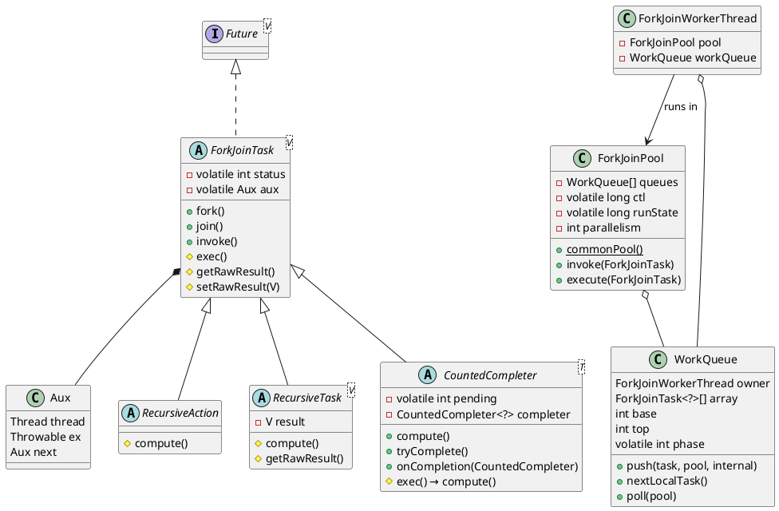
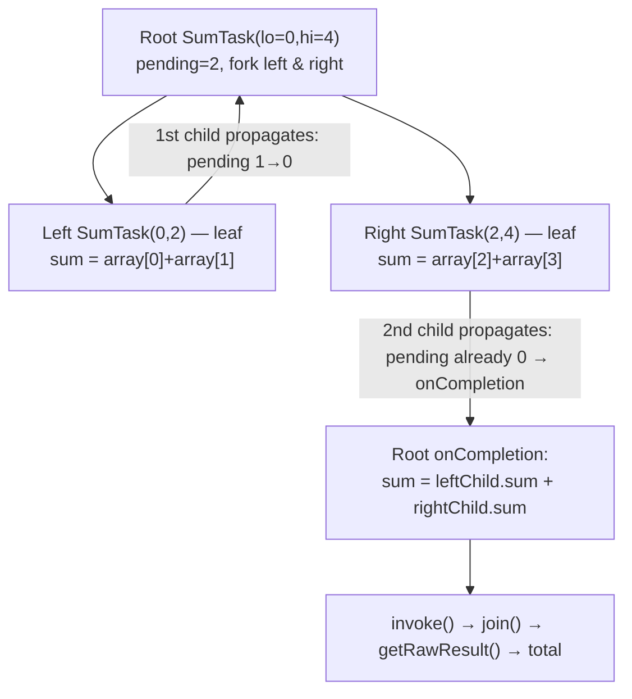
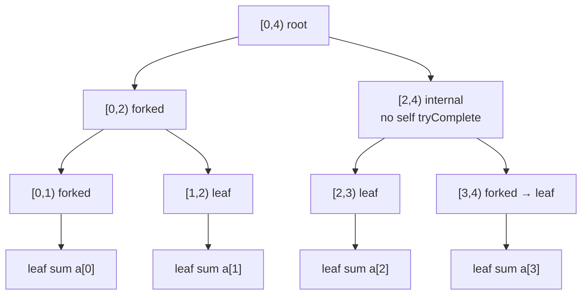
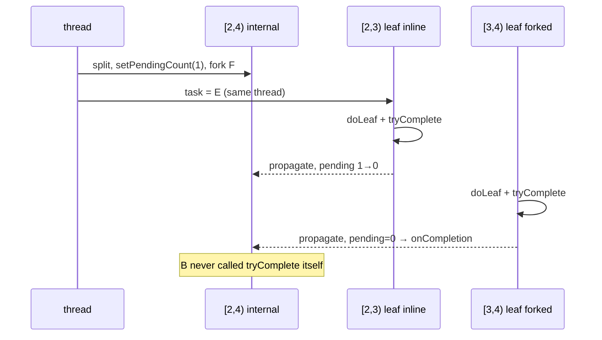

The Fork/Join Framework (`java.util.concurrent`) supports **structured parallelism**: a problem is split recursively into subtasks that run in parallel, partial results are merged, and the caller waits for completion. Tasks are lightweight `ForkJoinTask` objects executed by a fixed pool of worker threads using **work-stealing** deques — not one thread per task. This document traces the OpenJDK implementation in `ForkJoinPool`, `ForkJoinTask`, and related classes.
<!--more-->


---

## 1. Programming model

Fork/join fits computations that are:

- **Recursive** — large tasks split into smaller subtasks until a base-case granularity is reached
- **DAG-structured** — completion dependencies are acyclic (`join` waits only on tasks you forked)
- **Mostly non-blocking** — workers should not block on I/O or locks; on `join()` they run other available tasks instead of idling

`ForkJoinTask` javadoc recommends a rough granularity of **100–10,000** basic steps per leaf task. Too large → poor parallelism; too small → queue and task allocation overhead dominates.

### 1.1 Starting a computation

| Goal | External caller (not in pool) | Inside an existing FJ computation |
|------|------------------------------|-------------------------------------|
| Run async | `pool.execute(task)` | `task.fork()` |
| Run and get result | `pool.invoke(task)` | `task.invoke()` |
| Submit as `Future` | `pool.submit(task)` | `task.fork()` (tasks are `Future`s) |

`invoke()` is equivalent to `fork(); join()` but **runs `exec()` on the current thread first** before waiting:

```java
// ForkJoinTask.java
public final V invoke() {
    doExec();
    return join();
}

final void doExec() {
    if (status >= 0) {
        boolean completed = false;
        try {
            completed = exec();   // subclass body
        } catch (Throwable rex) {
            trySetException(rex);
        }
        if (completed)
            setDone();
    }
}
```

`fork()` pushes the task onto a work queue — the current worker's deque if the caller is a `ForkJoinWorkerThread`, otherwise the pool's **external submission queue** (typically `ForkJoinPool.commonPool()`):

```java
public final ForkJoinTask<V> fork() {
    // ...
    if (internal = (t = Thread.currentThread()) instanceof ForkJoinWorkerThread)
        q = wt.workQueue;
    else
        q = ForkJoinPool.common.externalSubmissionQueue(false);
    q.push(this, p, internal);
    return this;
}
```

---

## 2. Class hierarchy

Application code rarely subclasses `ForkJoinTask` directly. Three abstract styles cover most use cases:



| Base class | Returns result | Completion model |
|------------|----------------|------------------|
| `RecursiveAction` | `Void` | `fork` / `join` on children; `exec()` calls `compute()` and returns `true` |
| `RecursiveTask<V>` | `V` via `result` field | Same split/join pattern as `RecursiveAction` |
| `CountedCompleter<T>` | Optional via `getRawResult()` | **Completion-driven**: `tryComplete()` decrements pending count; `onCompletion()` merges when count hits zero |

`CountedCompleter` overrides `exec()` to call `compute()` and return `false` (completion is signaled explicitly via `tryComplete`, not by returning from `exec`):

```java
@Override
protected final boolean exec() {
    compute();
    return false;
}
```

Parallel `Stream` terminal ops use this style: `AbstractTask` extends `CountedCompleter` and splits a `Spliterator` in `compute()`, merging partial sinks in `onCompletion()`. See [§3](#3-countedcompleter) for a full walkthrough.

---

## 3. CountedCompleter

`RecursiveTask` coordinates children with **`fork()` + `join()`**. `CountedCompleter` uses a **pending counter** and a **completer chain** instead: children call `tryComplete()` when done; the parent runs `onCompletion()` when the counter is exhausted. There is **no `join()` on individual children** — only the root blocks, via **`invoke()`**.

### 3.1 Pending count

`tryComplete()` either decrements `pending` or, if already zero, runs `onCompletion()` and propagates to the completer:

```java
public final void tryComplete() {
    CountedCompleter<?> a = this, s = a;
    for (int c;;) {
        if ((c = a.pending) == 0) {
            a.onCompletion(s);
            if ((a = (s = a).completer) == null) {
                s.quietlyComplete();
                return;
            }
        }
        else if (a.weakCompareAndSetPendingCount(c, c - 1))
            return;
    }
}
```

`pending` counts **completion signals**, not active children. Each task's terminal `tryComplete()` in `compute()` consumes one signal. With two forks, `setPendingCount(2)` yields:

| Step | Source | Root `pending` |
|------|--------|----------------|
| 1 | Root `tryComplete()` after fork | 2 → 1 |
| 2 | First child propagates | 1 → 0 (`onCompletion` deferred) |
| 3 | Second child propagates | 0 → `onCompletion()` |

`onCompletion` runs on the propagation that finds `pending == 0`, not on the decrement that reaches zero. With `setPendingCount(1)` (stream `AbstractTask`), the single count covers the forked sibling; the inline branch completes on the same thread.

**Result retrieval:** `invoke()` runs root `compute()`, then `join()` returns `getRawResult()`. Internal nodes store partial state merged in `onCompletion()`; only the root is joined.

```java
public final V invoke() { doExec(); return join(); }  // join() → getRawResult()
```

`CountedCompleter.exec()` returns `false`; completion is signaled only through `tryComplete()`.

### 3.2 Example: parallel array sum

Two-child fork with `setPendingCount(2)`:

```java
class SumTask extends CountedCompleter<Long> {
    static final int THRESHOLD = 10_000;
    final int[] array;
    final int lo, hi;
    long sum;   // partial result for this node
    SumTask leftChild, rightChild;

    SumTask(int[] array, int lo, int hi) {
        super(null);   // root — no completer
        this.array = array; this.lo = lo; this.hi = hi;
    }

    SumTask(SumTask parent, int lo, int hi) {
        super(parent); // completer chain: child → parent
        this.array = parent.array;
        this.lo = lo; this.hi = hi;
    }

    @Override
    public void compute() {
        if (hi - lo > THRESHOLD) {
            int mid = (lo + hi) >>> 1;
            setPendingCount(2);                        // wait for both forked children
            leftChild = new SumTask(this, lo, mid);
            rightChild = new SumTask(this, mid, hi);
            leftChild.fork();
            rightChild.fork();
        } else {
            for (int i = lo; i < hi; i++)
                sum += array[i];                       // leaf: compute local partial sum
        }
        tryComplete();                                 // signal this node is finished
    }

    @Override
    public void onCompletion(CountedCompleter<?> caller) {
        // pending hit 0 — both children are done; merge their partial sums
        sum = leftChild.sum + rightChild.sum;
    }

    @Override
    public Long getRawResult() {
        return sum;                                    // read by invoke() / join()
    }
}

// retrieve final result — only join at the root
long total = new SumTask(array, 0, array.length).invoke();
```

**Trace for `array.length = 4`, `THRESHOLD = 2`:**



1. Root sets `pending = 2`, forks both children, `tryComplete()` → 2 → 1.
2. First child propagates → 1 → 0; `onCompletion` not invoked.
3. Second child propagates → `pending == 0` → root `onCompletion()` merges both sums.
4. Root `quietlyComplete()` → `invoke()` returns `getRawResult()`.

### 3.3 Tail-call style (parallel stream)

Parallel stream terminal ops use `AbstractTask` + `ReduceTask`. The split loop **reassigns `task`** to the inline child and **forks** the other — there is no `leftChild.compute()` call.

**`AbstractTask.compute()`** (split / fork / inline loop):

```java
// java.util.stream.AbstractTask
public void compute() {
    Spliterator<P_IN> rs = spliterator, ls;
    long sizeEstimate = rs.estimateSize();
    long sizeThreshold = getTargetSize(sizeEstimate);
    boolean forkRight = false;
    K task = (K) this;
    while (sizeEstimate > sizeThreshold && (ls = rs.trySplit()) != null) {
        K leftChild, rightChild, taskToFork;
        task.leftChild  = leftChild  = task.makeChild(ls);
        task.rightChild = rightChild = task.makeChild(rs);
        task.setPendingCount(1);
        if (forkRight) {
            forkRight = false;
            rs = ls;
            task = leftChild;
            taskToFork = rightChild;
        } else {
            forkRight = true;
            task = rightChild;
            taskToFork = leftChild;
        }
        taskToFork.fork();
        sizeEstimate = rs.estimateSize();
    }
    task.setLocalResult(task.doLeaf());
    task.tryComplete();
}
```

**`ReduceTask`** — leaf traversal and merge (used by `collect`, `reduce`, `count`):

```java
// java.util.stream.ReduceOps.ReduceTask
protected S doLeaf() {
    return helper.wrapAndCopyInto(op.makeSink(), spliterator);
}

public void onCompletion(CountedCompleter<?> caller) {
    if (!isLeaf()) {
        S leftResult = leftChild.getLocalResult();
        leftResult.combine(rightChild.getLocalResult());
        setLocalResult(leftResult);
    }
    super.onCompletion(caller);
}

// ReduceOps.ReduceOp.evaluateParallel
return new ReduceTask<>(this, helper, spliterator).invoke().get();
//     └─ invoke() → getRawResult() returns AccumulatingSink S
//                                                         └─ .get() → final R
```

#### Minimal example (same structure, array sum)

Below, `int lo/hi` stand in for a `Spliterator` range; `SumSink` stands in for `AccumulatingSink`. The **`compute()` body matches `AbstractTask`**; **`doLeaf` / `onCompletion` match `ReduceTask`**.

```java
static class SumSink {
    long sum;
    void combine(SumSink other) { sum += other.sum; }
    long get() { return sum; }
}

static class SumReduceTask extends CountedCompleter<SumSink> {
    final int[] array;
    int lo, hi;
    SumReduceTask leftChild, rightChild;
    SumSink localResult;

    SumReduceTask(int[] array, int lo, int hi) { super(null); this.array = array; this.lo = lo; this.hi = hi; }
    SumReduceTask(SumReduceTask parent, int lo, int hi) {
        super(parent); this.array = parent.array; this.lo = lo; this.hi = hi;
    }

    SumReduceTask makeChild(int lo, int hi) { return new SumReduceTask(this, lo, hi); }
    boolean isLeaf() { return leftChild == null; }
    void setLocalResult(SumSink r) { localResult = r; }
    SumSink getLocalResult() { return localResult; }

    SumSink doLeaf() {
        SumSink sink = new SumSink();
        for (int i = lo; i < hi; i++) sink.sum += array[i];
        return sink;
    }

    @Override
    public void compute() {
        long sizeThreshold = 1;          // illustration only; AbstractTask uses getTargetSize()
        boolean forkRight = false;
        SumReduceTask task = this;
        long sizeEstimate = task.hi - task.lo;

        while (sizeEstimate > sizeThreshold) {   // > 1 → split; leaf when size == 1
            int mid = task.lo + (int) (sizeEstimate / 2);
            SumReduceTask left = task.makeChild(task.lo, mid);
            SumReduceTask right = task.makeChild(mid, task.hi);
            task.leftChild = left;
            task.rightChild = right;
            task.setPendingCount(1);
            SumReduceTask taskToFork;
            if (forkRight) {
                forkRight = false;
                task = left;             // inline: continue as leftChild
                taskToFork = right;
            } else {
                forkRight = true;
                task = right;            // inline: continue as rightChild
                taskToFork = left;
            }
            taskToFork.fork();
            sizeEstimate = task.hi - task.lo;
        }
        task.setLocalResult(task.doLeaf());
        task.tryComplete();
    }

    @Override
    public void onCompletion(CountedCompleter<?> caller) {
        if (!isLeaf()) {
            SumSink leftResult = leftChild.getLocalResult();
            leftResult.combine(rightChild.getLocalResult());
            setLocalResult(leftResult);
        }
    }

    @Override
    public SumSink getRawResult() { return localResult; }
}

// same entry point as ReduceOp.evaluateParallel
long total = new SumReduceTask(array, 0, array.length).invoke().get();
```

**Trace** for `array.length = 4`, `sizeThreshold = 1` — splits until each leaf covers one element:



Each internal node: `setPendingCount(1)`, fork one child, **`task =` inline child** (same thread). The **`task = …` reassignment is the subtle part**: internal nodes never reach the bottom of `compute()` as themselves.

#### Internal nodes do not self-`tryComplete`

In §3.2 (dual fork), the root forks both children and then **calls `tryComplete()` on itself** even though it did no leaf work — the parent explicitly consumes a pending signal.

In the inline / stream pattern, an internal node such as **`[2,4)` never calls `tryComplete()`**. After forking `[3,4)`, the same thread sets `task = [2,3)` and continues the `while` loop; when the loop exits, **`doLeaf()` + `tryComplete()` run on `[2,3)`**, not on `[2,4)`. Node `[2,4)` is completed entirely by its children:

| Node | `tryComplete()`? | How it completes |
|------|------------------|------------------|
| `[2,3)` leaf (inline path) | Yes | `doLeaf()` + `tryComplete()` → decrements `[2,4)` pending |
| `[3,4)` leaf (forked) | Yes | `doLeaf()` + `tryComplete()` → `[2,4)` `onCompletion()` merges both sinks |
| **`[2,4)` internal** | **No** | **`onCompletion()` only** — driven by the two leaves above |

The same applies to `[0,2)` and root `[0,4)`: every internal node waits for **`leftChild` + `rightChild`**; only **leaf** task objects execute the final two lines of `compute()`:

```java
task.setLocalResult(task.doLeaf());
task.tryComplete();
```



Full tree completion:

| Step | Event |
|------|-------|
| 1 | Four leaves finish — each runs `doLeaf()` + `tryComplete()` (only leaves hit those lines) |
| 2 | `[0,1)` + `[1,2)` → `[0,2)` via `onCompletion`; `[2,3)` + `[3,4)` → `[2,4)` via `onCompletion` |
| 3 | `[0,2)` + `[2,4)` → root via `onCompletion` |
| 4 | `invoke().get()` returns total sum |

Production streams use `getTargetSize()` ≈ `estimateSize / (parallelism × 4)` — far larger than `1`, so leaves hold many elements. The **`> sizeThreshold` loop / fork / inline / `tryComplete` / `onCompletion`** mechanics are the same; only tree depth changes.

| | §3.2 dual fork | §3.3 inline (stream) |
|--|----------------|----------------------|
| Internal node after fork | calls `tryComplete()` on itself | **never** — thread becomes inline child |
| Who runs `doLeaf()` | each leaf task | only the **leaf** task object at end of inline descent |
| Example `[2,4)` | N/A (would fork both halves) | completes via `[2,3)` + `[3,4)` children only |

### 3.4 Compared to RecursiveTask

| | `RecursiveTask` | `CountedCompleter` |
|--|-----------------|-------------------|
| Wait for child | `child.join()` | `setPendingCount(n)` + child `tryComplete()` |
| Merge results | in `compute()` after join | `onCompletion(caller)` |
| `exec()` return | `true` when leaf done | always `false` |
| Get final answer | `invoke()` → `join()` → `getRawResult()` | same — **`invoke()` on root only** |
| Best for | symmetric divide-and-conquer | tree pipelines, varying task duration, stream reduce |

---

## 4. Work-stealing queues

Each worker owns a `WorkQueue` — a **bounded circular deque** backed by `ForkJoinTask<?>[] array` with indices `base` (steal end) and `top` (owner end). The design follows Chase–Lev / idempotent work-stealing deques; OpenJDK moves CAS arbitration from indices to **slots** so stolen entries can be nulled promptly for GC.

### 4.1 Owner vs thief

| Operation | Who | End | Order | Mechanism |
|-----------|-----|-----|-------|-----------|
| **push** | owner | top | — | `array[top++] = task` |
| **pop** (local) | owner | top | **LIFO** | `getAndSet(top slot, null)` — default for recursive divide-and-conquer |
| **poll** (steal) | other worker | base | **FIFO** | CAS base slot to `null`, increment `base` |

LIFO on the owner's deque keeps recently forked sibling tasks hot in cache (depth-first). FIFO steals take the **oldest** waiting task from a busy worker, balancing load.

When `ForkJoinPool` is constructed with **async mode** (`asyncMode = true`), the owner uses local **poll** (FIFO) instead of pop — suited to event-style tasks that are never joined.

### 4.2 External submission queues

Tasks submitted from non-FJ threads (`execute`, `invoke`, or `fork()` outside a worker) go to **shared submission queues** (also `WorkQueue` instances with `owner == null`). Push/pop on these queues require a **phase seqlock** (`tryLockPhase` / `unlockPhase`) because external threads and workers can contend.

After a successful push, `signalWork()` wakes or creates workers to scan for tasks.

---

## 5. Worker scheduling and join

Workers loop: run a local task → try to steal → if idle, park on the pool's waiter stack (`ctl` lower bits).

### 5.1 Join without blocking the pool

When a worker calls `join()` on an incomplete task, it must not stall the pool — other tasks may depend on progress. `awaitDone()` first tries **helping**:

```java
private int awaitDone(boolean interruptible, long deadline) {
    // ...
    return (((s = (p == null) ? 0 :
              ((this instanceof CountedCompleter) ?
               p.helpComplete(this, q, internal) :
               !internal && ((ss = status) & NO_USER_HELP) != 0 ? ss :
               p.helpJoin(this, q, internal))) < 0)) ? s :
        awaitDone(internal ? p : null, s, interruptible, deadline);
}
```

- **`helpJoin`** — worker runs other tasks from its deque or steals until the target task's `status` becomes negative (done)
- **`helpComplete`** — used for `CountedCompleter`; runs tasks known to be downstream of the waited-on completer
- If helping exhausts available work and the target is still running elsewhere, the waiter registers in the task's **`Aux` linked list** and parks on `LockSupport` until `setDone()` signals it

External callers joining from a non-FJ thread may block on `Aux` after limited helping; the pool may **compensate** by temporarily adding a worker so parallelism is preserved.

### 5.2 Task status

`ForkJoinTask.status` is a single `volatile int` encoding completion (no separate "running" bit):

| Bits | Meaning |
|------|---------|
| upper (sign) | `DONE` — task finished |
| `ABNORMAL` | cancelled or exceptional |
| `THROWN` | exception stored in `aux` |
| lower 16 | optional user tag (`setForkJoinTaskTag`) |

`join()` spins/helps while `status >= 0`, then returns `getRawResult()` or throws via `reportException()`.

---

## 6. Pool control: `ctl` and `runState`

`ForkJoinPool` packs worker lifecycle into one **`volatile long ctl`** (four 16-bit subfields):

```
RC (bits 48–63): released workers — scanning but not queued on waiter stack
TC (bits 32–47): total workers
SS (bits 16–31): version / status of top waiting worker
ID (bits  0–15): poolIndex of top of Treiber stack of idle waiters
```

When `sp = (int) ctl` is non-zero, idle workers are stacked waiting for work. `RC` can be incremented with `getAndAdd(RC_UNIT)` when a blocked join ends — cheaper than CAS for that path. Multi-field updates use CAS.

**`runState`** is a separate versioned counter with lock bit `RS_LOCK`:

| Bit | Meaning |
|-----|---------|
| `STOP` | pool terminating |
| `SHUTDOWN` | terminate when quiescent |
| `CLEANED` | queues cleared |
| `TERMINATED` | fully stopped |

The pool dynamically adds, parks, or resumes workers to keep active threads near **`parallelism`** (default: `Runtime.getRuntime().availableProcessors()`). Spare threads beyond target parallelism are capped (default max spares: 256, via system property).

### 6.1 Common pool

`ForkJoinPool.commonPool()` is shared by:

- `ForkJoinTask.fork()` / `invoke()` from non-FJ threads
- `Collection.parallelStream()` and `Stream.parallel()`

Common-pool threads are **daemon** threads, slowly reclaimed when idle and recreated on demand. Tuning via system properties:

- `java.util.concurrent.ForkJoinPool.common.parallelism`
- `java.util.concurrent.ForkJoinPool.common.threadFactory`
- `java.util.concurrent.ForkJoinPool.common.exceptionHandler`
- `java.util.concurrent.ForkJoinPool.common.maximumSpares`

---

## 7. Example: recursive `RecursiveTask`

Classic divide-and-conquer — fork one half, compute the other on the current thread, then join:

```java
class SumTask extends RecursiveTask<Long> {
    static final int THRESHOLD = 10_000;
    final int[] array;
    final int from, to;

    protected Long compute() {
        int len = to - from;
        if (len <= THRESHOLD) {
            long sum = 0;
            for (int i = from; i < to; i++) sum += array[i];
            return sum;
        }
        int mid = from + len / 2;
        SumTask left = new SumTask(array, from, mid);
        left.fork();
        long rightSum = new SumTask(array, mid, to).compute();
        return rightSum + left.join();   // innermost join first is more efficient
    }
}

// external caller
long total = ForkJoinPool.commonPool().invoke(new SumTask(array, 0, array.length));
```

---

## 8. Design trade-offs

**Strengths**

- Near-linear speedup on CPU-bound, recursively decomposable work
- Very low task creation cost compared to `Thread`
- Join helping keeps workers busy without thread explosion

**Constraints** (from `ForkJoinTask` / `ForkJoinPool` contracts)

- Avoid blocking I/O and heavy synchronization inside `compute()`; use `ManagedBlocker` if blocking is unavoidable
- Cyclic join dependencies deadlock — structure work as a DAG
- `CountedCompleter` fits completion-tree merges (streams, async pipelines) better than naive `join` when subtasks vary widely in duration
- External blocking joins may reduce effective parallelism unless the pool compensates

For parallel stream internals built on this framework, see [Java Stream internals](/2026/06/stream/).
