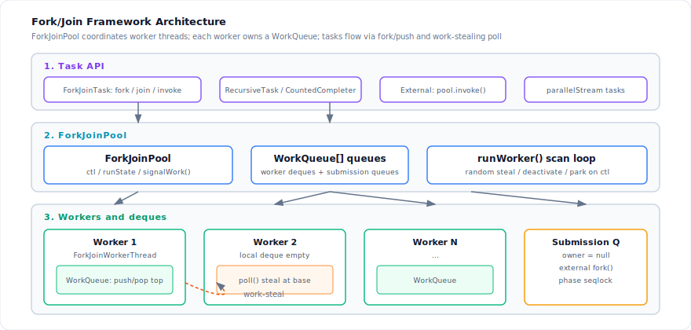
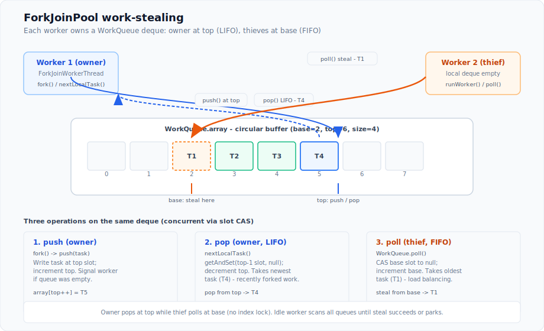
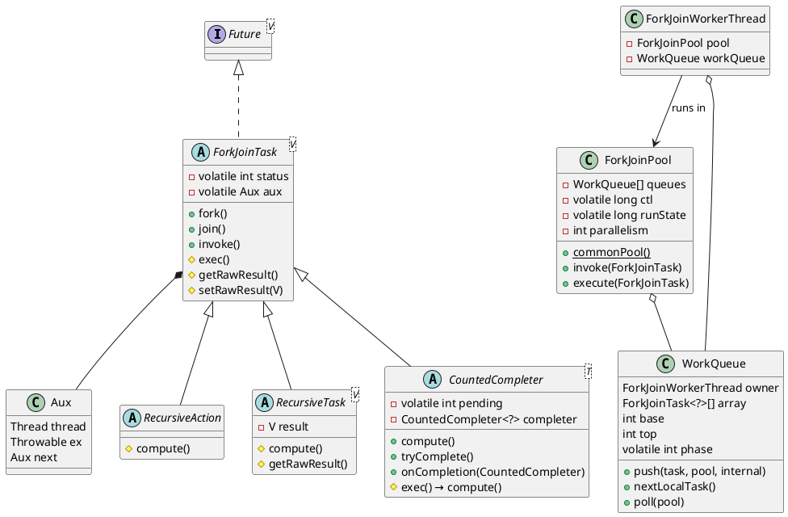
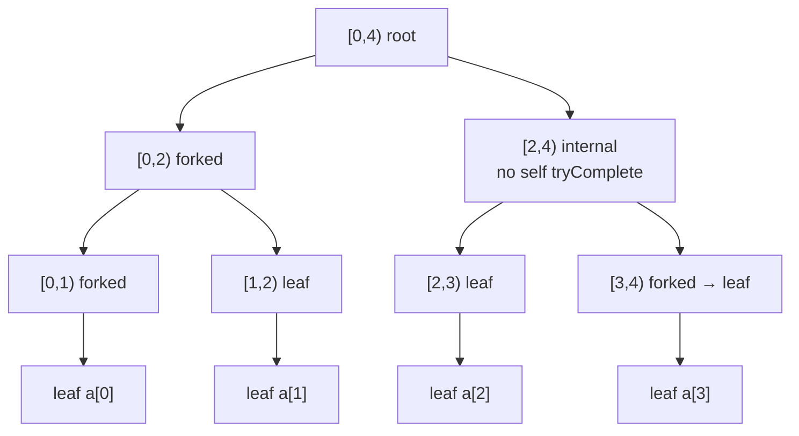

The Fork/Join Framework (`java.util.concurrent`) supports **structured parallelism**: a problem is split recursively into subtasks that run in parallel, partial results are merged, and the caller waits for completion. Tasks are lightweight `ForkJoinTask` objects executed by a fixed pool of worker threads using **work-stealing** deques — not one thread per task. This document traces the OpenJDK implementation in `ForkJoinPool`, `ForkJoinTask`, and related classes.
<!--more-->

---

## 1. Architecture

At the highest level, three layers cooperate:

| Layer | Role |
|-------|------|
| **Task API** | `ForkJoinTask` subclasses (`RecursiveTask`, `CountedCompleter`, …) express recursive work via `fork()`, `join()`, and `invoke()` |
| **ForkJoinPool** | Owns `WorkQueue[]`, tracks worker lifecycle in `ctl`, wakes or parks threads via `signalWork()` / `runWorker()` |
| **Workers** | Each `ForkJoinWorkerThread` has one deque; owners push/pop at **top**, idle workers **steal** from other queues at **base** |

External callers (non-FJ threads) submit through **shared submission queues** (`owner == null`); workers inside the pool push onto their own deque.



### 1.1 Programming model

Fork/join fits computations that are:

- **Recursive** — large tasks split into smaller subtasks until a base-case granularity is reached
- **DAG-structured** — completion dependencies are acyclic (`join` waits only on tasks you forked)
- **Mostly non-blocking** — workers should not block on I/O or locks; on `join()` they run other available tasks instead of idling

`ForkJoinTask` javadoc recommends a rough granularity of **100–10,000** basic steps per leaf task. Too large → poor parallelism; too small → queue and task allocation overhead dominates.

#### Starting a computation

| Goal | External caller (not in pool) | Inside an existing FJ computation |
|------|------------------------------|-------------------------------------|
| Run async | `pool.execute(task)` | `task.fork()` |
| Run and get result | `pool.invoke(task)` | `task.invoke()` |
| Submit as `Future` | `pool.submit(task)` | `task.fork()` (tasks are `Future`s) |

`invoke()` is equivalent to `fork(); join()` but **runs `exec()` on the current thread first** before waiting:

```java
// ForkJoinTask.java
public final V invoke() {
    doExec();
    return join();
}

final void doExec() {
    if (status >= 0) {
        boolean completed = false;
        try {
            completed = exec();   // subclass body
        } catch (Throwable rex) {
            trySetException(rex);
        }
        if (completed)
            setDone();
    }
}
```

`fork()` pushes the task onto a work queue — the current worker's deque if the caller is a `ForkJoinWorkerThread`, otherwise the pool's **external submission queue** (typically `ForkJoinPool.commonPool()`):

```java
public final ForkJoinTask<V> fork() {
    // ...
    if (internal = (t = Thread.currentThread()) instanceof ForkJoinWorkerThread)
        q = wt.workQueue;
    else
        q = ForkJoinPool.common.externalSubmissionQueue(false);
    q.push(this, p, internal);
    return this;
}
```

---

## 2. Work-stealing

Each worker owns one `WorkQueue` — a circular deque with `base` (steal end) and `top` (owner end). OpenJDK CASes **slots** rather than indices so stolen entries are nulled for GC.



**Owner** push/pop at **top** (LIFO) — depth-first on recently forked work. **Thief** poll at **base** (FIFO) — oldest task for load balance. Both can run concurrently on the same deque via per-slot CAS.

### 2.1 Owner operations: push and pop

**Push** (owner or locked external caller) — no CAS on indices; owner-only:

```java
// WorkQueue.push()
top = s + 1;
array[s & (cap - 1)] = task;   // internal: getAndSetReference (fenced)
if (room == 0) growArray(...);
if (queue was empty) pool.signalWork();
```

**Pop** (owner, default LIFO) — `getAndSet` slot to `null`, then decrement `top`:

```java
// WorkQueue.nextLocalTask(fifo=0) — pop path
t = getAndSetReference(array, slotOffset((top - 1) & mask), null);
if (t != null) updateTop(top - 1);
```

LIFO pop keeps recently forked siblings on the same worker — depth-first, cache-friendly for recursive fork/join.

**Local poll** (owner, async/FIFO mode) — reads from `base` like a stealer, but without cross-thread contention:

```java
// fifo != 0 path in nextLocalTask()
t = getAndSetReference(array, slotOffset(base & mask), null);
if (t != null) updateBase(base + 1);
```

### 2.2 Steal: poll from another queue

Only **non-owners** call `poll()`. Steal from **`base`** (FIFO — oldest task), CAS slot to `null`, then increment `base`:

```java
// WorkQueue.poll() — simplified
t = getReferenceAcquire(array, slotOffset(base & mask));
if (t != null && compareAndSetReference(array, slot, t, null)) {
    updateBase(base + 1);
    return t;
}
// on null slot: spin (onSpinWait) if base stalled; retry or give up
```

Slot-based CAS lets owner pop and thief poll **concurrent** on the same deque without locking indices. Failed CAS or stall → thief tries another queue (bounded retries).

### 2.3 Task acquisition and execution

The same pool uses different acquire-and-run paths depending on who submits the work and whether the thread is already a worker. Two execution modes recur:

| Mode | Pattern | Used when |
|------|---------|-----------|
| **Burst** | `topLevelExec(task)` → `doExec()` then `nextLocalTask()` until local deque empty | Worker's main loop after scan-stealing |
| **Single** | one `doExec()` per acquired task | `join()` helping, external untracked polls |
| **Inline** | `doExec()` on the current thread, no queue | `invoke()`, `invokeAll()` |

```java
// WorkQueue.topLevelExec() — burst mode
while (task != null) {
    task.doExec();              // may fork() subtasks onto this worker's deque
    task = nextLocalTask(fifo); // pop local work (LIFO at top) until empty
}
```

#### Entry points

| Entry | Thread | Acquire | Execute |
|-------|--------|---------|---------|
| **`runWorker`** (idle worker) | FJ worker | Scan all queues; CAS-steal one task from `q.base` (pseudo-random order) | `topLevelExec(stolen)` |
| **`fork()`** | FJ worker | `push()` onto **own** deque at `top`; not run yet | Picked up by caller's `topLevelExec` / `helpJoin` / `helpComplete` via `nextLocalTask()` or targeted scan |
| **`invoke()`** | FJ worker | **`doExec()` inline first** (no queue); unfinished work via `join()` | `join()` → `helpJoin` or `helpComplete` (single `doExec` per stolen task) |
| **`join()`** on child | FJ worker | `tryRemoveAndExec` on local deque; then scan for tasks in the target's steal chain | Single `doExec()` per helping steal — **not** `topLevelExec` |
| **`join()`** on `CountedCompleter` | FJ worker | Pop downstream `CountedCompleter`s from own top; then scan pool for eligible completers | Single `doExec()` per helping steal |
| **`pool.execute()` / external `fork()`** | Non-FJ | `push()` onto **submission queue** (`owner == null`); `signalWork()` | Idle worker scan-steals → `topLevelExec` |
| **`pool.invoke()`** | Non-FJ | Same submit as `execute()`; caller **`join()` blocks** on `Aux` after limited external help | Worker runs task via scan → `topLevelExec`; caller waits |

#### Worker idle loop (`runWorker`)

When a worker has no local work, it scans every queue (worker deques and submission queues) and CAS-steals from `base`:

```java
// runWorker() — simplified
for (;;) {
    // local deque empty (drained by previous topLevelExec)
    scan all queues in pseudo-random order:
        CAS-steal one task from q.base
        if stolen:
            topLevelExec(task);   // burst: run + drain all local forks
            break scan              // re-poll same queue (temporal locality)
    if nothing stolen → deactivate(w);   // park on ctl waiter stack
}
```

The scan runs only when the local deque is empty — `topLevelExec` drained it on the previous iteration. That is why the loop looks like "steal first, clear local second": local clearing is **inside** the burst after each steal, not as a separate pre-scan step. Depth-first behavior comes from `fork()` pushing onto the executing worker's deque and `nextLocalTask()` popping before the next scan.

#### `fork()` vs `invoke()` inside a worker

```java
// fork() — queue for later
q.push(this, pool, internal);   // own deque at top

// invoke() — run now, then wait
doExec();    // exec() on current thread first
return join();  // helpJoin / helpComplete if still incomplete
```

A common divide-and-conquer pattern forks one child and **`compute()`s the other inline** — equivalent to `invoke()` on one side without queueing it:

```java
left.fork();
long right = new RightTask(...).compute();  // inline doExec path
return right + left.join();
```

#### `join()` helping (not the main loop)

When a worker blocks on `join()`, it must not idle. `awaitDone()` dispatches to `helpJoin` (plain tasks) or `helpComplete` (`CountedCompleter`s). Each helping steal runs **one** `doExec()` — the waiter targets work that might unblock its join target, rather than draining its full local deque in burst mode.

External callers joining from a non-FJ thread get limited helping via `pollScan()`; if the target is still running elsewhere, they park on the task's `Aux` list and the pool may **compensate** with a spare worker.

`signalWork()` wakes idle workers or starts new ones when a push makes a previously empty queue non-empty.

### 2.4 External submission queues

Tasks from non-FJ threads (`pool.execute`, `fork()` outside a worker) go to **shared submission queues** (`owner == null`), selected by `ThreadLocalRandom` probe. External push/pop require **`phase` seqlock** (`tryLockPhase` / `unlockPhase`) because submitters and workers contend. After push, `signalWork()` starts scanning.

| Queue type | `owner` | push/pop | steal |
|------------|---------|----------|-------|
| Worker deque | `ForkJoinWorkerThread` | owner only, no lock | any worker via `poll()` |
| Submission queue | `null` | seqlock | workers scan same way |

---

## 3. ForkJoinTask

Application code rarely subclasses `ForkJoinTask` directly. Three abstract styles cover most use cases:



| Base class | Returns result | Completion model |
|------------|----------------|------------------|
| `RecursiveAction` | `Void` | `fork` / `join` on children; `exec()` calls `compute()` and returns `true` |
| `RecursiveTask<V>` | `V` via `result` field | Same split/join pattern as `RecursiveAction` |
| `CountedCompleter<T>` | Optional via `getRawResult()` | **Completion-driven**: `tryComplete()` decrements pending count; `onCompletion()` merges when count hits zero |

### 3.1 Example: `RecursiveTask`

Classic divide-and-conquer — fork one half, compute the other on the current thread, then `join()`:

```java
class SumTask extends RecursiveTask<Long> {
    static final int THRESHOLD = 10_000;
    final int[] array;
    final int from, to;

    protected Long compute() {
        int len = to - from;
        if (len <= THRESHOLD) {
            long sum = 0;
            for (int i = from; i < to; i++) sum += array[i];
            return sum;
        }
        int mid = from + len / 2;
        SumTask left = new SumTask(array, from, mid);
        left.fork();
        long rightSum = new SumTask(array, mid, to).compute();
        return rightSum + left.join();
    }
}

long total = ForkJoinPool.commonPool().invoke(new SumTask(array, 0, array.length));
```

### 3.2 CountedCompleter

`RecursiveTask` (§3.1) coordinates children with **`fork()` + `join()`**. `CountedCompleter` uses a **pending counter** and a **completer chain** instead: children call `tryComplete()` when done; the parent runs `onCompletion()` when the counter is exhausted. There is **no `join()` on individual children** — only the root blocks, via **`invoke()`**.

`CountedCompleter` overrides `exec()` to call `compute()` and return `false` (completion is signaled via `tryComplete`, not by returning from `exec`):

```java
@Override
protected final boolean exec() {
    compute();
    return false;
}
```

Parallel `Stream` terminal ops use this style: `AbstractTask` extends `CountedCompleter` and splits a `Spliterator` in `compute()`, merging partial sinks in `onCompletion()`.

#### Pending count

`tryComplete()` either decrements `pending` or, if already zero, runs `onCompletion()` and propagates to the completer:

```java
public final void tryComplete() {
    CountedCompleter<?> a = this, s = a;
    for (int c;;) {
        if ((c = a.pending) == 0) {
            a.onCompletion(s);
            if ((a = (s = a).completer) == null) {
                s.quietlyComplete();
                return;
            }
        }
        else if (a.weakCompareAndSetPendingCount(c, c - 1))
            return;
    }
}
```

`pending` counts **completion signals**, not active children. Each task's terminal `tryComplete()` in `compute()` consumes one signal. With two forks, `setPendingCount(2)` yields:

| Step | Source | Root `pending` |
|------|--------|----------------|
| 1 | Root `tryComplete()` after fork | 2 → 1 |
| 2 | First child propagates | 1 → 0 (`onCompletion` deferred) |
| 3 | Second child propagates | 0 → `onCompletion()` |

**Result retrieval:** `invoke()` runs root `compute()`, then `join()` returns `getRawResult()`. Internal nodes store partial state merged in `onCompletion()`; only the root is joined.

#### Example: parallel array sum

Two-child fork with `setPendingCount(2)`:

```java
class SumTask extends CountedCompleter<Long> {
    static final int THRESHOLD = 10_000;
    final int[] array;
    final int lo, hi;
    long sum;
    SumTask leftChild, rightChild;

    SumTask(int[] array, int lo, int hi) {
        super(null);
        this.array = array; this.lo = lo; this.hi = hi;
    }

    SumTask(SumTask parent, int lo, int hi) {
        super(parent);
        this.array = parent.array;
        this.lo = lo; this.hi = hi;
    }

    @Override
    public void compute() {
        if (hi - lo > THRESHOLD) {
            int mid = (lo + hi) >>> 1;
            setPendingCount(2);
            leftChild = new SumTask(this, lo, mid);
            rightChild = new SumTask(this, mid, hi);
            leftChild.fork();
            rightChild.fork();
        } else {
            for (int i = lo; i < hi; i++)
                sum += array[i];
        }
        tryComplete();
    }

    @Override
    public void onCompletion(CountedCompleter<?> caller) {
        sum = leftChild.sum + rightChild.sum;
    }

    @Override
    public Long getRawResult() {
        return sum;
    }
}

long total = new SumTask(array, 0, array.length).invoke();
```

#### Tail-call style (parallel stream)

Stream parallel tasks (`AbstractTask` / `ReduceTask`): `setPendingCount(1)`, fork one child, **`task =` inline child** — only **leaves** run `doLeaf()` + `tryComplete()`. Internal nodes complete via **`onCompletion()`** when both children finish.

```java
// AbstractTask.compute()
while (sizeEstimate > sizeThreshold && (ls = rs.trySplit()) != null) {
    task.leftChild  = leftChild  = task.makeChild(ls);
    task.rightChild = rightChild = task.makeChild(rs);
    task.setPendingCount(1);
    taskToFork.fork();
    task = inlineChild;
    sizeEstimate = rs.estimateSize();
}
task.setLocalResult(task.doLeaf());
task.tryComplete();

// ReduceTask
protected S doLeaf() {
    return helper.wrapAndCopyInto(op.makeSink(), spliterator);
}
public void onCompletion(CountedCompleter<?> caller) {
    if (!isLeaf()) {
        S r = leftChild.getLocalResult();
        r.combine(rightChild.getLocalResult());
        setLocalResult(r);
    }
}
return new ReduceTask<>(this, helper, spliterator).invoke().get();
```

Example: `array.length = 4`, `sizeThreshold = 1` (production uses `getTargetSize()` ≈ `estimateSize / (parallelism × 4)`).



**Completion order** (`new ReduceTask(...).invoke().get()`):

| Step | State |
|------|-------|
| 1 | Leaves `[0,1)` `[1,2)` `[2,3)` `[3,4)` each `doLeaf()` + `tryComplete()` |
| 2 | `[0,2)` ← merge `[0,1)`+`[1,2)`; `[2,4)` ← merge `[2,3)`+`[3,4)` |
| 3 | Root `[0,4)` ← merge `[0,2)`+`[2,4)` |
| 4 | `invoke().get()` → final result |

---

## 4. Pool scheduling and control

### 4.1 Worker scheduling and join

Workers loop: run a local task → try to steal → if idle, park on the pool's waiter stack (`ctl` lower bits).

#### Join without blocking the pool

When a worker calls `join()` on an incomplete task, it must not stall the pool — other tasks may depend on progress. `awaitDone()` first tries **helping**:

```java
private int awaitDone(boolean interruptible, long deadline) {
    // ...
    return (((s = (p == null) ? 0 :
              ((this instanceof CountedCompleter) ?
               p.helpComplete(this, q, internal) :
               !internal && ((ss = status) & NO_USER_HELP) != 0 ? ss :
               p.helpJoin(this, q, internal))) < 0)) ? s :
        awaitDone(internal ? p : null, s, interruptible, deadline);
}
```

- **`helpJoin`** — worker runs other tasks from its deque or steals until the target task's `status` becomes negative (done)
- **`helpComplete`** — used for `CountedCompleter`; runs tasks known to be downstream of the waited-on completer
- If helping exhausts available work and the target is still running elsewhere, the waiter registers in the task's **`Aux` linked list** and parks on `LockSupport` until `setDone()` signals it

External callers joining from a non-FJ thread may block on `Aux` after limited helping; the pool may **compensate** by temporarily adding a worker so parallelism is preserved.

#### Task status

`ForkJoinTask.status` is a single `volatile int` encoding completion (no separate "running" bit):

| Bits | Meaning |
|------|---------|
| upper (sign) | `DONE` — task finished |
| `ABNORMAL` | cancelled or exceptional |
| `THROWN` | exception stored in `aux` |
| lower 16 | optional user tag (`setForkJoinTaskTag`) |

`join()` spins/helps while `status >= 0`, then returns `getRawResult()` or throws via `reportException()`.

### 4.2 Pool control: `ctl` and `runState`

`ForkJoinPool` packs worker lifecycle into one **`volatile long ctl`** (four 16-bit subfields):

```
RC (bits 48–63): released workers — scanning but not queued on waiter stack
TC (bits 32–47): total workers
SS (bits 16–31): version / status of top waiting worker
ID (bits  0–15): poolIndex of top of Treiber stack of idle waiters
```

When `sp = (int) ctl` is non-zero, idle workers are stacked waiting for work. `RC` can be incremented with `getAndAdd(RC_UNIT)` when a blocked join ends — cheaper than CAS for that path. Multi-field updates use CAS.

**`runState`** is a separate versioned counter with lock bit `RS_LOCK`:

| Bit | Meaning |
|-----|---------|
| `STOP` | pool terminating |
| `SHUTDOWN` | terminate when quiescent |
| `CLEANED` | queues cleared |
| `TERMINATED` | fully stopped |

The pool dynamically adds, parks, or resumes workers to keep active threads near **`parallelism`** (default: `Runtime.getRuntime().availableProcessors()`). Spare threads beyond target parallelism are capped (default max spares: 256, via system property).

#### Common pool

`ForkJoinPool.commonPool()` is shared by:

- `ForkJoinTask.fork()` / `invoke()` from non-FJ threads
- `Collection.parallelStream()` and `Stream.parallel()`

Common-pool threads are **daemon** threads, slowly reclaimed when idle and recreated on demand. Tuning via system properties:

- `java.util.concurrent.ForkJoinPool.common.parallelism`
- `java.util.concurrent.ForkJoinPool.common.threadFactory`
- `java.util.concurrent.ForkJoinPool.common.exceptionHandler`
- `java.util.concurrent.ForkJoinPool.common.maximumSpares`

---

## 5. Design trade-offs

**Strengths**

- Near-linear speedup on CPU-bound, recursively decomposable work
- Very low task creation cost compared to `Thread`
- Join helping keeps workers busy without thread explosion

**Constraints** (from `ForkJoinTask` / `ForkJoinPool` contracts)

- Avoid blocking I/O and heavy synchronization inside `compute()`; use `ManagedBlocker` if blocking is unavoidable
- Cyclic join dependencies deadlock — structure work as a DAG
- `CountedCompleter` fits completion-tree merges (streams, async pipelines) better than naive `join` when subtasks vary widely in duration
- External blocking joins may reduce effective parallelism unless the pool compensates

For parallel stream internals built on this framework, see [Java Stream internals](/2026/06/stream/).
