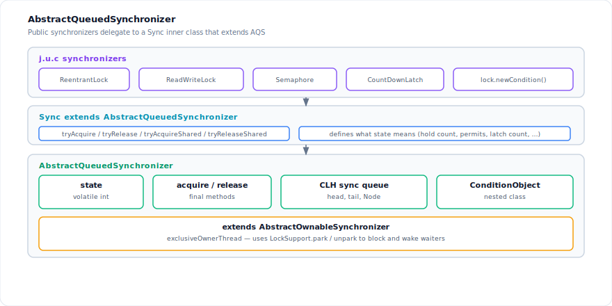
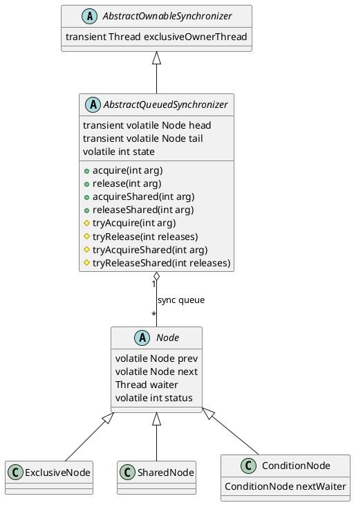
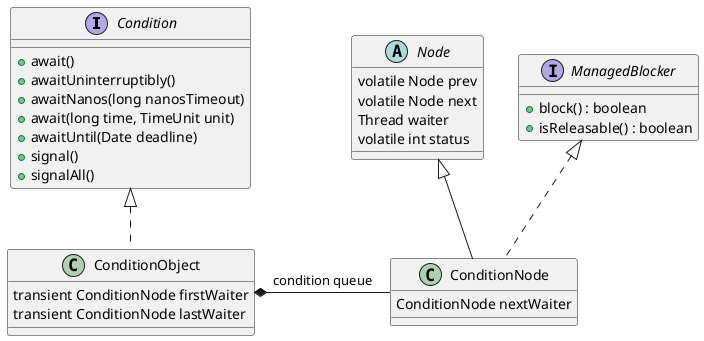
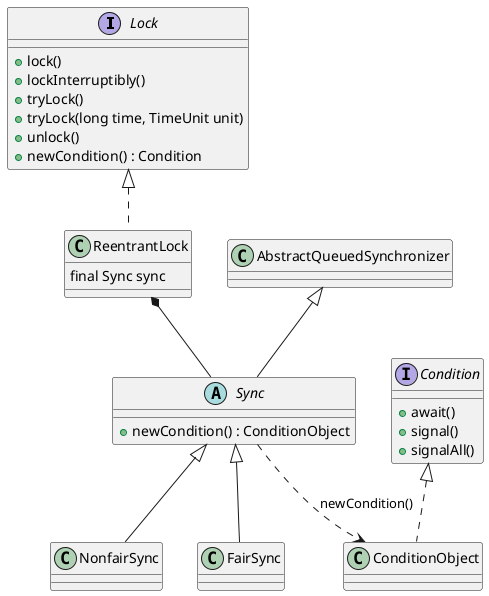
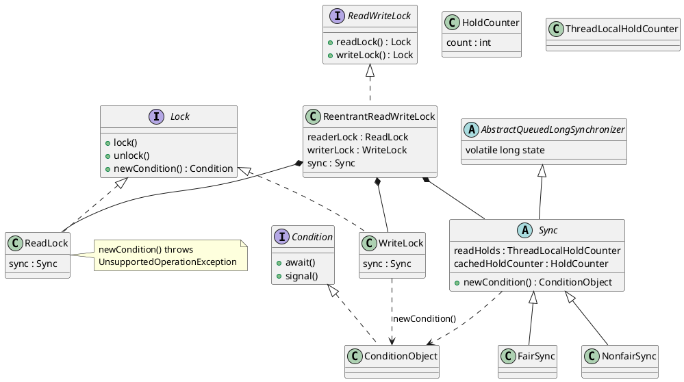
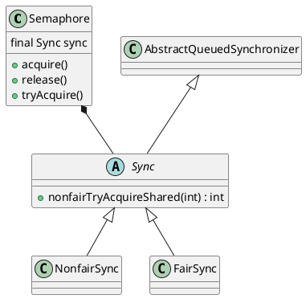
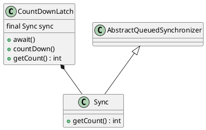
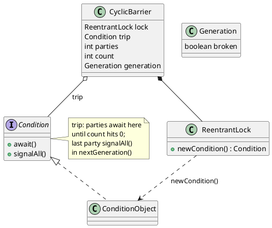
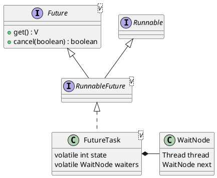

`ReentrantLock`, `Semaphore`, and `CountDownLatch` look unrelated at the API level, but each holds a private **`Sync extends AbstractQueuedSynchronizer`**. The **`Sync`** subclass overrides **`tryAcquire`** / **`tryRelease`** and decides what **`state`** represents. **`AbstractQueuedSynchronizer`** (AQS) is the base class: it owns `state`, the CLH sync queue, `acquire` / `release`, and the nested **`ConditionObject`**.

<!--more-->

---

## 1. Architecture

### 1.1 Design overview

A blocking synchronizer has two operations: **acquire** waits until `state` permits progress; **release** updates `state` and may wake waiters. In the JDK this splits across two classes:

| Class | Responsibility |
|-------|----------------|
| **`Sync extends AQS`** | Override `tryAcquire*` / `tryRelease*`; define what `state` means |
| **`AbstractQueuedSynchronizer`** | Hold `state`, run the `acquire` / `release` loop, manage the CLH queue, park threads via `LockSupport` |



The diagram shows the call chain:

1. **`ReentrantLock`**, **`Semaphore`**, etc. — public API (`lock`, `acquire`, `await`).
2. **`Sync`** — inner class that extends AQS and implements the `try*` hooks. `ReentrantLock.Sync` treats `state` as hold count; `Semaphore.Sync` treats it as permit count.
3. **`AbstractQueuedSynchronizer`** — when `tryAcquire` fails, AQS enqueues the thread on a CLH FIFO queue and blocks it with `LockSupport.park`. On `release`, AQS calls `tryRelease` then `signalNext` to unpark a successor. Also contains **`ConditionObject`** for `await` / `signal`, and extends **`AbstractOwnableSynchronizer`** to track the exclusive owner thread.

`AbstractQueuedLongSynchronizer` is the same design with a `long state` field — used by `ReentrantReadWriteLock`.

Both modes share one sync queue; the node type records the mode:

| Mode | AQS API | Node class | Examples |
|------|---------|------------|----------|
| Exclusive | `acquire` / `release` | `ExclusiveNode` | `ReentrantLock`, write lock |
| Shared | `acquireShared` / `releaseShared` | `SharedNode` | `Semaphore`, `CountDownLatch.await`, read lock |

CAS, memory fences, and the OS primitives behind `park` are covered in [Synchronization](/2024/04/concurrency/synchronization/).

### 1.2 AbstractQueuedSynchronizer

Every AQS-backed type holds a `Sync extends AbstractQueuedSynchronizer` (or `AbstractQueuedLongSynchronizer`) and overrides the hook methods:



#### State and hooks

`state` is read and written only through `getState`, `setState`, and `compareAndSetState`. Subclasses override **hooks**; callers never touch `state` directly:

| Mode | Acquire hook | Release hook | Result |
|------|--------------|--------------|--------|
| Exclusive | `tryAcquire(int arg)` | `tryRelease(int releases)` | `boolean`; `true` when fully released |
| Shared | `tryAcquireShared(int arg)` | `tryReleaseShared(int releases)` | `int`: negative = fail; `0` = success; positive = success and others may proceed |

`AbstractOwnableSynchronizer` tracks `exclusiveOwnerThread` for exclusive syncs. When 32 bits are insufficient, **`AbstractQueuedLongSynchronizer`** provides the same API with a `long state` — used by `ReentrantReadWriteLock`.

#### Sync queue

On first contention AQS installs a dummy header; waiters link at `tail` via CAS:

```java
private transient volatile Node head;
private transient volatile Node tail;
```

| Field | Role |
|-------|------|
| `prev`, `next` | CLH-variant links; enqueue uses `prev`; `next` may lag after cancellation |
| `waiter` | `Thread` passed to `LockSupport.unpark` |
| `status` | Bit flags: `WAITING` (1), `COND` (2), `CANCELLED` (`0x80000000`, negative) — see [Cancellation](#cancellation-cancelled) |

#### ExclusiveNode and SharedNode

`ExclusiveNode` and `SharedNode` are empty subclasses of `Node` — no extra fields. AQS uses the type tag to decide which hook to call and which waiters to wake:

| | `ExclusiveNode` | `SharedNode` |
|---|-----------------|--------------|
| **Created when** | `acquire(..., shared=false, ...)` | `acquire(..., shared=true, ...)` |
| **Fast-path hook** | `tryAcquire(arg)` → `boolean` | `tryAcquireShared(arg) >= 0` |
| **Release path** | `release` → `signalNext(head)` | `releaseShared` → `signalNext(head)` |
| **After becoming head** | stop | `signalNextIfShared(node)` — wake next shared waiter if still eligible |
| **Queue inspection** | `getExclusiveQueuedThreads()` | `getSharedQueuedThreads()` |

Enqueue picks the node type in the main acquire loop:

```java
node = (shared) ? new SharedNode() : new ExclusiveNode();
```

Inside the loop, the same `acquire(...)` method branches on `shared`:

```java
if (shared)
    acquired = (tryAcquireShared(arg) >= 0);
else
    acquired = tryAcquire(arg);
```

When a shared waiter succeeds and installs itself as the new head, AQS may propagate the wake to the next shared node — multiple readers can pass through without each needing a separate `release`:

```java
if (acquired) {
    if (first) {
        node.prev = null;
        head = node;
        pred.next = null;
        node.waiter = null;
        if (shared)
            signalNextIfShared(node);   // only unparks if successor is SharedNode
        // ...
    }
    return 1;
}
```

`signalNext` wakes any successor; `signalNextIfShared` wakes only a `SharedNode`:

```java
private static void signalNext(Node h) {
    Node s;
    if (h != null && (s = h.next) != null && s.status != 0) {
        s.getAndUnsetStatus(WAITING);
        LockSupport.unpark(s.waiter);
    }
}

private static void signalNextIfShared(Node h) {
    Node s;
    if (h != null && (s = h.next) != null &&
        (s instanceof SharedNode) && s.status != 0) {
        s.getAndUnsetStatus(WAITING);
        LockSupport.unpark(s.waiter);
    }
}
```

`ConditionNode` is a third node type, used on condition queues rather than the CLH sync queue (§1.3).

#### Acquire and release

Public entry points try the hook once, then delegate to the internal loop:

```java
// exclusive — ReentrantLock.lock()
public final void acquire(int arg) {
    if (!tryAcquire(arg))
        acquire(null, arg, false, false, false, 0L);
}

// shared — Semaphore.acquire(), CountDownLatch.await()
public final void acquireShared(int arg) {
    if (tryAcquireShared(arg) < 0)
        acquire(null, arg, true, false, false, 0L);
}
```

The internal **`acquire(...)`** loop handles enqueue, park, and retry. Simplified flow:

```java
for (;;) {
    // 1. If at queue head (or not yet enqueued), try the hook
    if (first || pred == null) {
        boolean acquired = shared
            ? (tryAcquireShared(arg) >= 0)
            : tryAcquire(arg);
        if (acquired) { /* set head, maybe signalNextIfShared */ return 1; }
    }
    // 2. Initialize queue on first contention
    if (tail == null)
        tryInitializeHead();
    // 3. Allocate ExclusiveNode or SharedNode
    else if (node == null)
        node = shared ? new SharedNode() : new ExclusiveNode();
    // 4. CAS onto tail, link prev
    else if (pred == null) { /* enqueue */ }
    // 5. Spin after unpark (postSpins)
    else if (first && spins != 0) { --spins; Thread.onSpinWait(); }
    // 6. Set WAITING on predecessor, then park
    else if (node.status == 0)
        node.status = WAITING;
    else {
        LockSupport.park(this);   // or parkNanos for timed acquire
        node.clearStatus();
    }
}
```

Release is symmetric and short — hook first, then unpark one successor:

```java
public final boolean release(int arg) {
    if (tryRelease(arg)) {
        signalNext(head);
        return true;
    }
    return false;
}

public final boolean releaseShared(int arg) {
    if (tryReleaseShared(arg)) {
        signalNext(head);
        return true;
    }
    return false;
}
```

#### Interrupts and waking parked waiters

A contending thread that fails `tryAcquire` is enqueued on the CLH sync queue and enters the internal `acquire(...)` loop. The **first waiter** — the successor of `head` (`head.next`) — is the node that will invoke `tryAcquire` on the next eligible iteration. Blocking follows a two-phase protocol to prevent a lost signal between `release` and `park` (Dekker-style arrangement documented in the AQS source):

1. Assign `node.status = WAITING` on one loop iteration, publishing the intent to block.
2. On a subsequent iteration, if acquisition still fails, invoke `LockSupport.park(this)` (or `parkNanos` for timed acquire).

`signalNext` atomically clears `WAITING` via `getAndUnsetStatus(WAITING)` and calls `LockSupport.unpark(node.waiter)` on the successor. While blocked, a waiter has `Node.waiter` bound to its thread and `WAITING` set on its node until `park` returns.

##### Delivery of `Thread.interrupt()` to a parked thread

At the API level, interruption is a status flag; at the JVM level, it unblocks a thread parked in a native wait.

1. **Interrupt request.** Thread *T* invokes `target.interrupt()`. The implementation sets `target.interrupted = true` and invokes the native `interrupt0()`.
2. **Native unpark.** If *target* is blocked in a park or wait primitive, `interrupt0()` unparks the underlying carrier thread, making it eligible for scheduling. The interrupting thread does not call `LockSupport.unpark`; the VM delivers the wake.
3. **Return from `park`.** The blocked thread's `LockSupport.park` invocation returns. `LockSupport` does not indicate whether the return was caused by `unpark`, interrupt, timeout, or spurious wakeup; callers must re-evaluate their blocking condition.
4. **Interrupt status.** Following an interrupt-induced return from `park`, the target's interrupted status remains set until it is observed and cleared (typically by `Thread.interrupted()`).

An interrupt therefore unblocks a parked first waiter — or any sync-queue waiter — in the same operational sense as `signalNext`: the `park` call returns and execution resumes inside `acquire(...)`. Interruption alone does not grant the synchronizer and does not dequeue the thread.

##### Post-wake processing in `acquire(...)`

Every return from `park` executes the same epilogue, irrespective of cause:

```java
node.clearStatus();
if ((interrupted |= Thread.interrupted()) && interruptible)
    break;
```

`Thread.interrupted()` queries the current thread's interrupted status and **clears** it, OR-ing the result into a local `interrupted` variable. The loop either continues (retry `tryAcquire`, reassign `WAITING`, re-park) or exits into `cancelAcquire`.

For the first waiter after a wake, the next iteration satisfies `first == (head == pred)` and therefore invokes `tryAcquire` / `tryAcquireShared` before blocking again. If the hook succeeds — for example, after a concurrent `release` — the node is promoted to `head` and acquisition completes. If the hook fails, including when the wake originated solely from an interrupt without a corresponding `release`, the thread reassigns `WAITING` and re-parks. **Interruption alone does not satisfy acquisition.**

| Entry point | `interruptible` | Outcome when interrupted during `park` |
|-------------|-----------------|----------------------------------------|
| `acquire` / `acquireShared` (`lock()`, `Semaphore.acquire()`, …) | `false` | Loop continues; thread remains enqueued; re-parks if `tryAcquire` fails |
| `acquireInterruptibly` / `acquireSharedInterruptibly` (`lockInterruptibly()`, …) | `true` | Loop terminates; node marked `CANCELLED`; `cleanQueue()`; `InterruptedException` |
| Timed `tryAcquireNanos` / `tryAcquireSharedNanos` | `true` | Same termination as interruptible acquire; timeout returns `0` |

##### Non-interruptible acquire and deferred interrupt restoration

When `interruptible == false`, interruption is not a loop-termination condition. If acquisition eventually succeeds at the queue head, AQS restores the interrupt status before returning:

```java
if (acquired) {
    if (first) {
        // ... promote to head; signalNextIfShared ...
        if (interrupted)
            current.interrupt();
    }
    return 1;
}
```

This restoration follows from two contractual obligations that must hold simultaneously.

**Obligation 1 — uninterruptible acquisition.** Methods such as `lock()` and `Semaphore.acquire()` delegate to `acquire(...)` with `interruptible = false`. They must neither throw `InterruptedException` nor abort the wait in response to `interrupt()`. A thread that wakes from `park` due to interruption re-enters the loop and continues waiting until `tryAcquire` succeeds. Completion of acquisition is unconditional with respect to interruption.

**Obligation 2 — preservation of interrupt status.** Each `park` return invokes `Thread.interrupted()`, which atomically reads and **clears** the thread's interrupted bit, recording the outcome in the local `interrupted` variable. Without subsequent restoration, a successful return from `acquire` would leave the interrupt request permanently unobservable: `isInterrupted()` would return `false`, and subsequent interruptible operations would not detect the prior interruption. The established convention for an uninterruptible method that internally uses an interruptible blocking primitive (`park`) is to accumulate interrupt observations during the wait, complete the operation, and restore the status before returning to the caller. The sample lock in the `LockSupport` specification implements the same protocol.

The call to `current.interrupt()` upon successful acquisition is **deferred restoration**, not generation of a new interrupt. It reinstates the interrupt request that was cleared during the wait, enabling the caller to observe and respond after `lock()` returns:

```java
lock.lock();   // may restore interrupted status before return
try {
    if (Thread.currentThread().isInterrupted())
        return;
    // critical section
} finally {
    lock.unlock();
}
```

**Contrast with interruptible acquire.** `lockInterruptibly()` passes `interruptible = true`. An interrupt during `park` terminates the loop, cancels the node, and results in `InterruptedException` at the public API (with interrupt status cleared per the exception contract). Successful acquisition and interrupt-driven cancellation are mutually exclusive on that path; no restoration occurs on success because success implies the interrupt was not acted upon as a failure.

If `cancelAcquire` is invoked without acquisition and `interrupted && !interruptible`, the same restoration applies:

```java
if (interrupted) {
    if (interruptible)
        return CANCELLED;
    else
        Thread.currentThread().interrupt();
}
```

The caller of `lock()` may therefore observe a set interrupted status after holding the lock, although `lock()` itself does not throw `InterruptedException`.

**Interruptible acquire (`interruptible == true`).** The `break` following `Thread.interrupted()` enters `cancelAcquire`: `node.status = CANCELLED`, `node.waiter = null`, and `cleanQueue()` unlinks cancelled nodes so successors remain reachable. The public method maps a negative return to `InterruptedException`. A first waiter cancelled on this path relinquishes its queue position; a subsequent `release` invokes `signalNext` on the next non-cancelled successor.

##### Interrupt wake compared with `release` wake

Both causes converge at the same `park` return site; `acquire` does not record the wake reason.

| Source | Mechanism | Effect on first waiter |
|--------|-----------|------------------------|
| `release` → `signalNext(head)` | Clear successor `WAITING`; `LockSupport.unpark(successor.waiter)` | `park` returns; `tryAcquire` succeeds if `tryRelease` permitted acquisition |
| `Thread.interrupt()` on waiter | Set interrupted status; `interrupt0()` unparks carrier | `park` returns; `tryAcquire` succeeds only if the synchronizer permits; otherwise re-park |
| Spurious wakeup | JVM may return from `park` without `unpark` or interrupt | Identical epilogue; condition re-evaluated; possible re-park |

Following a wake from `release`, the first waiter may execute up to `postSpins` iterations of `Thread.onSpinWait` before re-parking, reducing context-switch overhead when the releasing thread remains on-CPU. Interrupt-induced wakes follow the same spin path when applicable.

When `signalNext` encounters a cancelled successor, it may fail to unpark an eligible thread. Traversal in `cleanQueue()` unlinks cancelled nodes and unparks a relinked first waiter, preserving liveness.

#### Cancellation (`CANCELLED`)

`CANCELLED` is assigned the most significant bit so that **`status < 0`** identifies a dead sync-queue node in a single comparison. A cancelled node remains linked until `cleanQueue()` unsplices it; it must never acquire the synchronizer.

##### When `CANCELLED` is set on the sync queue

`cancelAcquire` marks a node and triggers cleanup:

```java
private int cancelAcquire(Node node, boolean interrupted, boolean interruptible) {
    if (node != null) {
        node.waiter = null;
        node.status = CANCELLED;
        if (node.prev != null)
            cleanQueue();
    }
    // ...
}
```

| Trigger | `interruptible` | Result |
|---------|-----------------|--------|
| Interrupt during `acquireInterruptibly` / `tryAcquireNanos` | `true` | `CANCELLED` return → `InterruptedException` or `false` |
| Timed `tryAcquire` / `tryAcquireShared` expires | `true` | return `0` (timeout) |
| `Error` / `RuntimeException` from `tryAcquire` in the loop | `false` | node cancelled; exception propagated |
| Interrupt during non-interruptible `acquire` | `false` | node **not** cancelled; loop continues (§1.2 interrupt section) |

A waiting thread may also discover that its **predecessor** was cancelled:

```java
if (pred.status < 0) {
    cleanQueue();   // unlink cancelled nodes from tail
    continue;
}
```

`cleanQueue()` walks from `tail` toward `head`, unsplicing nodes with `status < 0` via CAS on `prev`/`next`. If the relinked node becomes the new first waiter (`p.prev == null`), it invokes `signalNext(p)` so a successor blocked behind cancelled nodes is not stranded. This complements `signalNext(head)`, which skips cancelled successors that may still appear in a stale `next` pointer.

##### Condition waits and cancellation

Condition handling reuses `Node.status` but applies **`COND`** rather than `CANCELLED` for the primary wait protocol. A `ConditionNode` on the condition queue carries `COND | WAITING`; transfer to the sync queue clears `COND` and proceeds through normal `acquire`.

**`enableWait` failure.** If the lock is not held exclusively, or `release` fails, the node is marked `CANCELLED` and `IllegalMonitorStateException` is thrown — the thread never entered a valid wait:

```java
node.status = CANCELLED; // lock not held or inconsistent
throw new IllegalMonitorStateException();
```

**Interrupt or timeout while still on the condition queue.** In `await()`, `awaitNanos()`, and related timed methods, the wait loop tests whether the node **remains on the condition queue** by atomically clearing and inspecting the `COND` bit:

```java
if (interrupted |= Thread.interrupted()) {
    if (cancelled = (node.getAndUnsetStatus(COND) & COND) != 0)
        break;              // still on condition queue — abort wait
}
// else: interrupted after signal() already cleared COND and enqueued node
```

| `cancelled` | Meaning | Subsequent action |
|-------------|---------|-------------------|
| `true` | `COND` was present — thread not yet transferred by `signal()` | `unlinkCancelledWaiters(node)`; `reacquire`; throw `InterruptedException` or return `false` on timeout |
| `false` | `signal()` already ran — `doSignal` cleared `COND` and called `enqueue` | `reacquire` via sync queue; restore interrupt if interrupted after signal |

`doSignal` skips nodes whose `COND` bit was already cleared (for example, by a concurrent interrupt):

```java
if ((first.getAndUnsetStatus(COND) & COND) != 0)
    enqueue(first);
```

**`unlinkCancelledWaiters`.** Removes condition-queue entries that no longer carry the `COND` flag — nodes aborted before transfer. The sync-queue `CANCELLED` marker is not used for this path; the node is simply unlinked from `firstWaiter` / `lastWaiter`.

**`reacquire`.** After any `await` variant, the thread re-enters the sync queue through non-interruptible `acquire(node, savedState, …)` — even following interruptible `await()`. Cancellation on the condition queue prevents reacquisition from starting; once `signal()` has enqueued the node, reacquisition follows the standard sync-queue protocol, including `CANCELLED` handling if the competitive `acquire` is interruptible (not the case for `reacquire`, which passes `interruptible = false`).

**`awaitUninterruptibly`.** Does not use the `cancelled` / `COND` abort path; the loop runs until `canReacquire(node)` — that is, until `signal()` has enqueued the node and links are consistent.

### 1.3 ConditionObject

`ConditionObject` is nested inside AQS and backs `Lock.newCondition()`. It reuses `ConditionNode` but maintains a **separate condition queue** (`firstWaiter` / `lastWaiter`), distinct from the CLH sync queue:



**`await()`** (caller must hold the exclusive lock):

1. `enableWait(node)` — enqueue on the condition list, then **`release(savedState)`**.
2. Park (`ForkJoinPool.managedBlock` or `LockSupport.park`) until signalled.
3. `reacquire(node, savedState)` — competitive `acquire`; may re-enter the sync queue.
4. Restore interrupt status if interrupted after a real signal.

**`signal()`** transfers nodes from the condition queue to the sync queue. The signalled thread does not run until it re-acquires the lock:

```java
private void doSignal(ConditionNode first, boolean all) {
    while (first != null) {
        ConditionNode next = first.nextWaiter;
        if ((first.getAndUnsetStatus(COND) & COND) != 0) {
            enqueue(first);
            if (!all) break;
        }
        first = next;
    }
}
```

Unlike `synchronized`, each `Condition` instance has its own wait set rather than sharing one per monitor.

Interrupt and timeout handling on the condition queue — the `COND` bit, the local `cancelled` flag, and `unlinkCancelledWaiters` — are described in [Cancellation (`CANCELLED`)](#cancellation-cancelled). In summary: abort while still on the condition queue unlinks the node and throws or returns failure after `reacquire`; interrupt after `signal()` defers to the sync-queue `reacquire` path with deferred interrupt restoration.

---

## 2. Implementation

### 2.1 LockSupport

AQS stores the waiting thread in `Node.waiter` and calls **`LockSupport.unpark`** from `signalNext`. Each thread holds at most **one permit**; `park()` consumes it or blocks. Parking is per-thread, not bound to a lock object. Short spins (`postSpins`, `Thread.onSpinWait`) before parking cut context switches when the releaser is still on-CPU.

### 2.2 Built-in synchronizers

| Class | AQS base | `state` meaning | Mode |
|-------|----------|-----------------|------|
| `ReentrantLock` | `AbstractQueuedSynchronizer` | hold count (0 = unlocked) | exclusive |
| `ReentrantReadWriteLock` | `AbstractQueuedLongSynchronizer` | high 32 = reads, low 32 = writes | both |
| `Semaphore` | `AbstractQueuedSynchronizer` | available permits | shared |
| `CountDownLatch` | `AbstractQueuedSynchronizer` | countdown (0 = open) | shared |
| `CyclicBarrier` | — (`ReentrantLock` + `Condition`) | `count` under lock | — |
| `FutureTask` | — (own CAS `state` + `WaitNode` stack) | task lifecycle | — |

#### ReentrantLock

A reentrant mutual-exclusion lock: one thread holds it at a time, but the owner may acquire it again. It supports optional FIFO fairness, timed and interruptible acquire, and multiple condition variables on the same lock. Use it wherever `synchronized` is too limited — `tryLock`, fairness, or separate *notFull* / *notEmpty* waits on one buffer.



`lock.newCondition()` returns a **`ConditionObject`** on the same `Sync`. A thread **`await`**s only while holding the lock; `await` releases the lock and waits on the condition queue; **`signal`** moves waiters back to the sync queue. One lock can have many conditions (e.g. *notFull* and *notEmpty*).

Fairness is not in AQS — it is chosen in the **`Sync` subclass**. The default constructor uses **`NonfairSync`**; `new ReentrantLock(true)` uses **`FairSync`**:

```java
public ReentrantLock() {
    sync = new NonfairSync();
}

public ReentrantLock(boolean fair) {
    sync = fair ? new FairSync() : new NonfairSync();
}
```

**NonfairSync** skips the queue check, so a new thread can **barge** ahead of waiters:

```java
final boolean initialTryLock() {
    Thread current = Thread.currentThread();
    if (compareAndSetState(0, 1)) {
        setExclusiveOwnerThread(current);
        return true;
    } else if (getExclusiveOwnerThread() == current) {
        setState(getState() + 1);
        return true;
    }
    return false;
}

protected final boolean tryAcquire(int acquires) {
    if (getState() == 0 && compareAndSetState(0, acquires)) {
        setExclusiveOwnerThread(Thread.currentThread());
        return true;
    }
    return false;
}
```

**FairSync** calls `hasQueuedThreads()` / `hasQueuedPredecessors()` before CAS:

```java
final boolean initialTryLock() {
    Thread current = Thread.currentThread();
    int c = getState();
    if (c == 0) {
        if (!hasQueuedThreads() && compareAndSetState(0, 1)) {
            setExclusiveOwnerThread(current);
            return true;
        }
    } else if (getExclusiveOwnerThread() == current) {
        setState(++c);
        return true;
    }
    return false;
}

protected final boolean tryAcquire(int acquires) {
    if (getState() == 0 && !hasQueuedPredecessors() &&
        compareAndSetState(0, acquires)) {
        setExclusiveOwnerThread(Thread.currentThread());
        return true;
    }
    return false;
}
```

`lock()` always tries `initialTryLock()` before `acquire(1)`, so a fair lock still takes the fast path when the queue is empty.

`state` is the reentrant hold count; `exclusiveOwnerThread` is the owner. `tryRelease` decrements and returns `true` at zero, which triggers `signalNext`:

```java
protected final boolean tryRelease(int releases) {
    int c = getState() - releases;
    if (getExclusiveOwnerThread() != Thread.currentThread())
        throw new IllegalMonitorStateException();
    boolean free = (c == 0);
    if (free) setExclusiveOwnerThread(null);
    setState(c);
    return free;
}
```

#### ReentrantReadWriteLock

A read/write lock: many threads may hold the read lock together; the write lock excludes all readers and other writers. Both modes are reentrant. It fits read-heavy data — caches, config snapshots — where writes are infrequent but must see a consistent view.



Only **`writeLock().newCondition()`** is supported — `await` must release exclusive ownership. **`readLock().newCondition()`** throws `UnsupportedOperationException`.

`SHARED_SHIFT = 32`: low 32 bits hold write count, high 32 bits hold read count. `ReadLock` calls `acquireShared`; `WriteLock` calls `acquire`. Per-thread read recursion is tracked in `ThreadLocalHoldCounter`.

#### Semaphore

A counting semaphore tracks a pool of permits. `acquire` takes one and blocks when the pool is empty; `release` returns one. There is no owner — any thread may release. Typical uses are connection pools, rate limiters, and any cap of *N* concurrent workers.



`state` holds available permits. **NonfairSync** subtracts via CAS with no queue check. **FairSync** returns `-1` when `hasQueuedPredecessors()` is true, forcing the thread to enqueue:

```java
// NonfairSync — barging allowed
protected int tryAcquireShared(int acquires) {
    for (;;) {
        int available = getState();
        int remaining = available - acquires;
        if (remaining < 0 || compareAndSetState(available, remaining))
            return remaining;
    }
}

// FairSync
protected int tryAcquireShared(int acquires) {
    for (;;) {
        if (hasQueuedPredecessors())
            return -1;
        int available = getState();
        int remaining = available - acquires;
        if (remaining < 0 || compareAndSetState(available, remaining))
            return remaining;
    }
}
```

#### CountDownLatch

A one-shot countdown latch starts at *N*. Threads `await` until `countDown` has been called *N* times; then every waiter is released at once. The count cannot be reset — use a new latch or a `CyclicBarrier` when the gate must fire again. Common pattern: wait for all workers to finish startup before processing begins.



`state` is the remaining count. `await` succeeds only when `state == 0`; the last `countDown` returns `true` from `tryReleaseShared` and wakes all waiters.

```java
protected int tryAcquireShared(int acquires) {
    return (getState() == 0) ? 1 : -1;
}

protected boolean tryReleaseShared(int releases) {
    for (;;) {
        int c = getState();
        if (c == 0) return false;
        int nextc = c - 1;
        if (compareAndSetState(c, nextc))
            return nextc == 0;
    }
}
```

#### CyclicBarrier

A cyclic barrier synchronizes a fixed number of parties. Each calls `await`; when the last arrives, an optional action runs and everyone proceeds. The barrier then resets for the next round — suited to parallel algorithms that advance in lockstep phases. `reset()` or a broken barrier starts a fresh cycle.



Field **`trip`** is the condition all parties share. Under `lock`, each party decrements `count`; non-last threads **`trip.await()`**; the last thread runs the barrier action and **`trip.signalAll()`** in **`nextGeneration()`** to release everyone for the next cycle.

Fields and setup:

```java
private final ReentrantLock lock = new ReentrantLock();
private final Condition trip = lock.newCondition();
```

Each party decrements `count` under `lock`. Non-last parties **`trip.await()`**; the last party runs `barrierCommand`, then **`nextGeneration()`** resets `count` and **`trip.signalAll()`** wakes everyone:

```java
private void nextGeneration() {
    trip.signalAll();
    count = parties;
    generation = new Generation();
}

// inside dowait(), after lock.lock()
int index = --count;
if (index == 0) {          // last party — trip the barrier
    if (barrierCommand != null)
        barrierCommand.run();
    nextGeneration();
    return 0;
}
for (;;) {
    if (!timed)
        trip.await();      // wait for last party to signal
    else if (nanos > 0L)
        nanos = trip.awaitNanos(nanos);
    if (g != generation)     // woken by nextGeneration()
        return index;
}
```

#### FutureTask

A `FutureTask` wraps a `Callable` or `Runnable`, runs it on an executor, and exposes the result through `Future`. Callers block on `get()` until the task completes, fails, or is cancelled — the usual task type behind `ExecutorService.submit`.



---

## Summary

| Piece | Role |
|-------|------|
| **`state` + hooks** | Subclass decides when acquire / release succeeds |
| **`acquire` / `release`** | Template loop: try → enqueue → park → retry |
| **CLH queue** | FIFO waiters; fair mode checks `hasQueuedPredecessors` |
| **`LockSupport`** | Per-thread park / unpark |
| **`ConditionObject`** | Separate condition queue; `signal` enqueues onto sync queue |
| **Concrete syncs** | Thin wrappers mapping domain semantics onto `state` |

Every AQS-backed class wraps a **`Sync`** inner class: read how **`state`** is encoded, then read **`tryAcquire*`** / **`tryRelease*`**.
