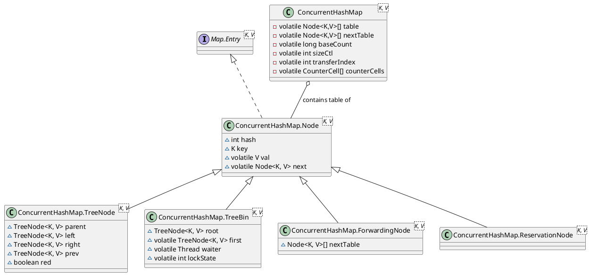
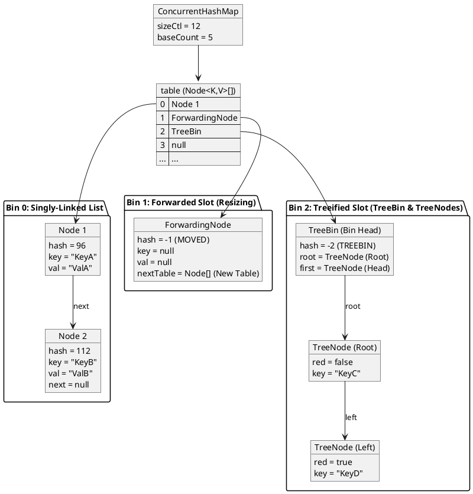

<!--more-->

`java.util.concurrent.ConcurrentHashMap` is a highly concurrent, thread-safe hash table implementation in the Java Collections Framework. It allows full concurrency of retrievals and high expected concurrency for updates. This document details its internal architecture, node hierarchy, concurrency design, multi-threaded cooperative resizing mechanism, and size-counting algorithms based on the OpenJDK source code.

---

## 1. Architecture and Internal Data Structures

`ConcurrentHashMap` is structured as a binned hash table where each bin contains a singly-linked list of nodes or a balanced Red-Black Tree. It uses volatile variables, Compare-And-Swap (CAS) operations, and fine-grained monitor locking to achieve thread safety.

### 1.1 Node Class Hierarchy

All entries in the table are subclasses of the base `Node<K,V>` class. Unlike `HashMap` which uses a deeply nested inheritance model via `LinkedHashMap`, `ConcurrentHashMap` maintains a flat node hierarchy where specialized nodes inherit directly from `Node<K,V>`.



#### Node Types and Role Encodings
Specialized nodes are identified by negative values in their `hash` field, which are reserved for control purposes:
* **`Node<K,V>`**: The standard node containing user key-value pairs (hash $\ge 0$).
* **`ForwardingNode<K,V>`**: Placed at the head of a bin during resizing (hash = `MOVED` = `-1`). It contains a reference to the new table array (`nextTable`).
* **`TreeBin<K,V>`**: Serves as the bin head and holds the root of a Red-Black Tree of `TreeNode`s (hash = `TREEBIN` = `-2`).
* **`ReservationNode<K,V>`**: A transient placeholder node used during compute operations like `computeIfAbsent` to reserve the slot before the value is established (hash = `RESERVED` = `-3`).

### 1.2 Memory Layout and Bin Representation

The following diagram illustrates the structural layout of a `ConcurrentHashMap` with various bin states:



---

## 2. Concurrency Design

`ConcurrentHashMap` achieves high concurrency by avoiding table-wide locks. It separates read operations from write operations and applies locking at the individual bin level.

### 2.1 Lock-Free Read Operations (`get`)
Retrieval operations do not block and run completely lock-free.
* The `table` array reference and the `next` and `val` fields of every `Node` are declared `volatile`. This guarantees that updates made by one thread are immediately visible to reader threads.
* If a reader thread encounters a `ForwardingNode` (hash = `-1`), the read is redirected to the new table array referenced by the node, ensuring seamless reads even during active resizing.
* If a reader thread accesses a treeified bin, it can traverse the bin using the sequential `next` pointers of `TreeNode` without needing to acquire a tree-lock.

### 2.2 Fine-Grained Write Operations (`putVal`)
Write operations (`put`, `remove`, `replace`) use a combination of CAS and localized monitor synchronization:

1. **CAS for Empty Bins**:
   * If the target bin index is empty (`tabAt(tab, i) == null`), the thread attempts to insert the new node using a Compare-And-Swap (CAS) operation:
     ```java
     if (casTabAt(tab, i, null, new Node<K,V>(hash, key, value)))
         break; // Node inserted without acquiring a lock
     ```
   * If the CAS succeeds, no lock is acquired, eliminating synchronization overhead for empty slots.
2. **Synchronized Bin Heads**:
   * If the bin is not empty, the thread locks the first node of the bin (`f`) using Java's built-in monitor synchronization:
     ```java
     synchronized (f) {
         if (tabAt(tab, i) == f) { // Double-check to ensure head node hasn't changed
             // Perform insertion, update, or treeification
         }
     }
     ```
   * Only threads writing to the *same* bucket will contend for the lock. Threads writing to different buckets execute in parallel.
   * The double-check `tabAt(tab, i) == f` ensures that the head node has not been removed, treeified, or relocated by a concurrent resize before the lock was acquired.

### 2.3 Prohibition of Null Keys and Values
Unlike `HashMap`, `ConcurrentHashMap` does not permit `null` keys or values. 
In a concurrent map, allowing `null` values introduces an ambiguity: `map.get(key) -> null` could mean that the key maps to `null`, or that the key is not present in the map. In a single-threaded map, this is resolved using `map.containsKey(key)`. In a concurrent map, the state of the map can change between the calls to `get()` and `containsKey()`, creating race conditions. To prevent this ambiguity, `null` keys and values are strictly prohibited.

---

## 3. Multi-Threaded Cooperative Resizing

Resizing in `ConcurrentHashMap` is a cooperative, multi-threaded operation. When a thread detects that the map is resizing (by encountering a `ForwardingNode`), it assists in the transfer of elements rather than stalling.

### 3.1 Coordination Constants and Fields
* **`sizeCtl`**: A multi-use control field:
  * `-1`: Represents active table initialization.
  * Less than `-1`: Represents active resizing. The value encodes a generation stamp in the higher 16 bits and the number of active helper threads in the lower 16 bits.
  * Positive value: Represents the next resize threshold (capacity $\times$ load factor).
* **`transferIndex`**: Tracks the next block of bins to be migrated, starting from the old table capacity `n` down to `0`.

### 3.2 Cooperative Migration (Stride)
To avoid contention among threads helping with a resize, the migration work is divided into chunks called **strides**.

```
Old Table:
[ Bin N-1 ] ... [ Bin 0 ]
 ◄─────────────────────── (transferIndex moves from N down to 0)
   Thread A: Claims [Stride A]  |  Thread B: Claims [Stride B]
```

1. **Claiming a Stride**:
   * A thread claims a block of bins (with a minimum size of `MIN_TRANSFER_STRIDE = 16`) by performing a CAS on `transferIndex`:
     ```java
     U.compareAndSetInt(this, TRANSFERINDEX, nextIndex, nextBound = (nextIndex > stride ? nextIndex - stride : 0))
     ```
   * Once claimed, the thread is solely responsible for migrating bins in the range `[nextBound, nextIndex - 1]`.
2. **Transfer Mechanics**:
   * For each index `i` in its stride:
     * If the bin is empty, the thread CASes a `ForwardingNode` (`fwd`) into the slot. This blocks new writes at this index; any thread attempting to write will see `fwd` and join the resizing effort.
     * If the bin contains elements, the thread locks the bin head (`synchronized(f)`) and splits it into low-index (`ln`) and high-index (`hn`) lists based on the bitwise check `(hash & n) == 0`.
3. **The "Last Run" Optimization**:
   * In a linked list bin, many nodes at the tail of the list may share the same destination index.
   * `ConcurrentHashMap` traverses the list to find the `lastRun` node—the node after which all subsequent nodes have the identical destination index.
   * The thread reuses the `lastRun` node and its descendants directly, avoiding node recreation. On average, only one-sixth of the nodes in a bin require allocation during doubling.
4. **Completion**:
   * Once a bin's elements are written to the new table, the old slot is marked with the `ForwardingNode`.
   * When a thread finishes its stride, it decrements the helper count in `sizeCtl`. The last thread to finish the migration performs a final sweep and commits the new table.

---

## 4. High-Throughput Concurrent Size Counter

In a highly concurrent environment, a single global counter (like a volatile variable updated via CAS) becomes a performance bottleneck due to thread contention. `ConcurrentHashMap` implements a high-throughput counter based on the design of `java.util.concurrent.atomic.LongAdder`.

### 4.1 Counter Representation
The counter consists of two components:
* **`baseCount`**: A volatile long updated via CAS when there is no contention.
* **`counterCells`**: A volatile array of `CounterCell` objects, where each cell contains a volatile `value` field. This array is lazily allocated and grown as contention increases.

```
                  [ Thread A ]        [ Thread B ]        [ Thread C ]
                       │                   │                   │
                 (CAS Success)       (CAS Failure)       (CAS Failure)
                       ▼                   │                   │
                [ baseCount ]              ▼                   ▼
                                    [ Cell 0 ]          [ Cell 1 ]  (inside counterCells)
```

### 4.2 Size Upate Algorithm (`addCount`)
1. **Uncontended Update**:
   * The thread attempts to update the global `baseCount` using CAS:
     ```java
     U.compareAndSetLong(this, BASECOUNT, b = baseCount, s = b + x)
     ```
   * If this succeeds, the operation completes.
2. **Contended Update (Fallback)**:
   * If `counterCells` is already allocated, or if the `baseCount` CAS fails due to contention:
     * The thread maps to a specific index in the `counterCells` array using a thread-local random probe:
       ```java
       index = ThreadLocalRandom.getProbe() & (counterCells.length - 1)
       ```
     * It attempts to CAS the value of the cell at that index.
     * If the cell is null, or if the cell CAS fails, the thread enters `fullAddCount()` to initialize the array, allocate new cells, or resize the array.
3. **Summation (`size()`)**:
   * To calculate the total size, `ConcurrentHashMap` sums the `baseCount` and the values of all active `CounterCell` instances:
     ```java
     final long sumCount() {
         CounterCell[] cs = counterCells;
         long sum = baseCount;
         if (cs != null) {
             for (CounterCell c : cs) {
                 if (c != null)
                     sum += c.value;
             }
         }
         return sum;
     }
     ```
   * This design localizes write contention to separate memory locations, ensuring that counting does not bottleneck map updates.

---

## Summary of State and Concurrency Controls

The concurrent state and locking strategies of `ConcurrentHashMap` can be summarized by the following operational modes:

| Operation | Target State | Concurrency Control | Complexity |
| :--- | :--- | :--- | :--- |
| **`get`** | Any | Lock-Free volatile read / ForwardingNode redirection | $O(1)$ / $O(\log n)$ |
| **`put`** | Empty slot | Lock-Free CAS on bin index | $O(1)$ |
| **`put`** | Non-empty bin | Fine-grained `synchronized` lock on bin head node | $O(1)$ / $O(\log n)$ |
| **`put`** | Resizing bin | Thread assists with transfer via `helpTransfer` | $O(1)$ / $O(\log n)$ |
| **`size`** | N/A | Non-blocking sum of `baseCount` and `counterCells` | $O(\text{cells})$ |

Through this multi-layered approach—combining CAS, lock-free reads, synchronized bucket heads, cooperative resizing, and striping-based size counters—`ConcurrentHashMap` delivers high throughput and thread-safe operations under extreme multi-threaded workloads.
