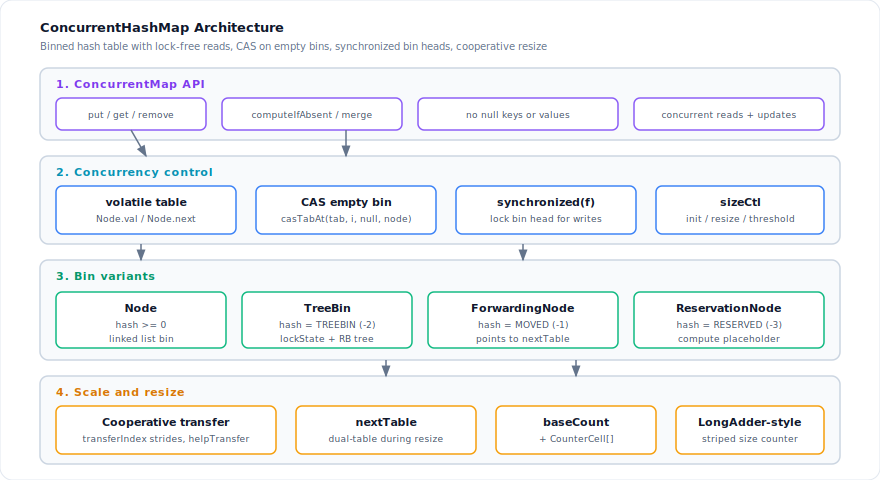
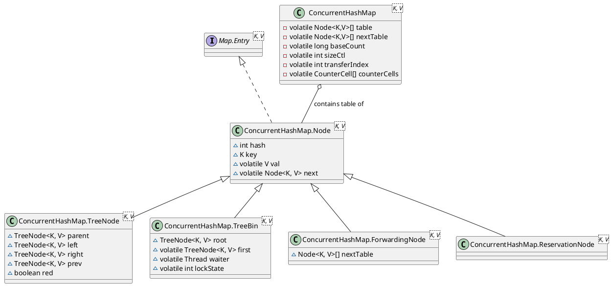
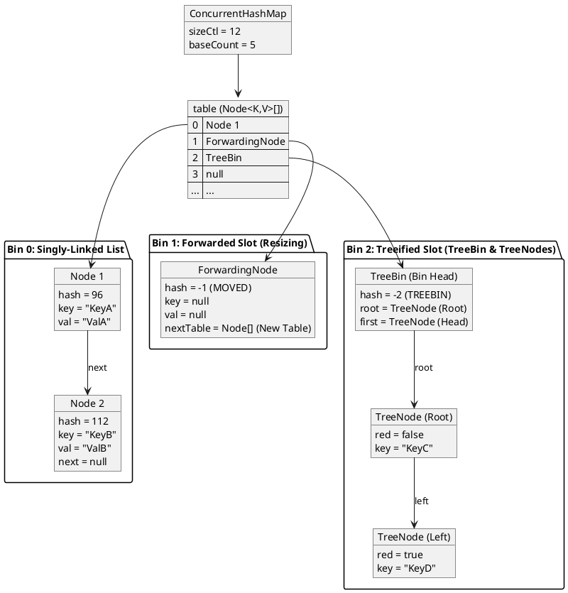

`java.util.concurrent.ConcurrentHashMap` is a highly concurrent, thread-safe hash table in the Java Collections Framework. It allows **full concurrency of retrievals** and high expected concurrency for updates. Unlike `HashMap`, it **prohibits null keys and values** to avoid the ambiguity of `get(key) == null`.

The design avoids table-wide locks: reads are lock-free via `volatile` fields; writes use CAS on empty bins and `synchronized` on the bin head; resizing is **cooperative** — threads that encounter a `ForwardingNode` help migrate bins rather than blocking.
<!--more-->

---

## 1. Architecture

`ConcurrentHashMap` is a binned hash table like `HashMap`, but each bin can be a linked list, a `TreeBin`, a `ForwardingNode` during resize, or a `ReservationNode` during atomic compute operations. Negative `hash` values encode these special node roles.

| Layer | Role |
|-------|------|
| **ConcurrentMap API** | `put`, `get`, `remove`, `computeIfAbsent`, `merge` — no null keys or values |
| **Concurrency control** | `volatile` `table` / `Node.next` / `Node.val`; CAS insert into empty bin; `synchronized(f)` on bin head for non-empty bins; `sizeCtl` coordinates init and resize |
| **Bin variants** | `Node` (list), `TreeBin` (tree + `lockState`), `ForwardingNode` (resize redirect), `ReservationNode` (compute placeholder) |
| **Scale and resize** | Cooperative `transfer` with `nextTable` and `transferIndex` strides; `baseCount` + `CounterCell[]` striped size counter |



### 1.1 Design overview

1. **Read (`get`)** — lock-free: load `table`, index the bin, walk `next` chain or traverse tree via `TreeBin.find`. If the head is a `ForwardingNode`, follow `nextTable` to the new table.
2. **Write to empty bin** — `casTabAt(tab, i, null, new Node(...))` inserts without locking.
3. **Write to non-empty bin** — `synchronized (f)` on the bin head; double-check head unchanged, then insert/update/treeify inside the monitor.
4. **Tree bin writes** — outer `synchronized(f)` serializes writers; inner `TreeBin.lockState` coordinates with lock-free readers (reader count CAS, or fallback to linked-list traversal).
5. **Resize** — initiating thread sets `sizeCtl` negative and builds `nextTable`; other threads help via `helpTransfer`, claiming strides from `transferIndex`. Each migrated slot gets a `ForwardingNode` so concurrent readers and writers redirect correctly.
6. **Size tracking** — `addCount` stripes increments across `CounterCell[]` (LongAdder-style) to avoid CAS contention on a single counter.

---

### 1.2 Nodes and bins

#### Node class hierarchy

All entries in the table are subclasses of the base `Node<K,V>` class. Unlike `HashMap` which uses a deeply nested inheritance model via `LinkedHashMap`, `ConcurrentHashMap` maintains a flat node hierarchy where specialized nodes inherit directly from `Node<K,V>`.



#### Special node hash codes
Specialized nodes are identified by negative values in their `hash` field, which are reserved for control purposes:
* **`Node<K,V>`**: The standard node containing user key-value pairs (hash $\ge 0$).
* **`ForwardingNode<K,V>`**: Placed at the head of a bin during resizing (hash = `MOVED` = `-1`). It contains a reference to the new table array (`nextTable`).
* **`TreeBin<K,V>`**: Serves as the bin head and holds the root of a Red-Black Tree of `TreeNode`s (hash = `TREEBIN` = `-2`).
* **`ReservationNode<K,V>`**: A transient placeholder node used during compute operations like `computeIfAbsent` to reserve the slot before the value is established (hash = `RESERVED` = `-3`).

#### Table and bin layout

The following diagram illustrates the structural layout of a `ConcurrentHashMap` with various bin states:



---

## 2. Implementation

`ConcurrentHashMap` achieves high concurrency by avoiding table-wide locks — reads and writes use different paths, and locking is scoped to individual bins.

### 2.1 Lock-free get and putVal

#### get
Retrieval operations do not block and run completely lock-free.
* The `table` array reference and the `next` and `val` fields of every `Node` are declared `volatile`. This guarantees that updates made by one thread are immediately visible to reader threads.
* If a reader thread encounters a `ForwardingNode` (hash = `-1`), the read is redirected to the new table array referenced by the node, ensuring seamless reads even during active resizing.
* If a reader thread accesses a treeified bin, it can traverse the bin using the sequential `next` pointers of `TreeNode` without needing to acquire a tree-lock.

#### putVal: CAS and synchronized bin head
Write operations (`put`, `remove`, `replace`) use a combination of CAS and localized monitor synchronization:

1. **CAS for Empty Bins**:
   * If the target bin index is empty (`tabAt(tab, i) == null`), the thread attempts to insert the new node using a Compare-And-Swap (CAS) operation:
     ```java
     if (casTabAt(tab, i, null, new Node<K,V>(hash, key, value)))
         break; // Node inserted without acquiring a lock
     ```
   * If the CAS succeeds, no lock is acquired, eliminating synchronization overhead for empty slots.
2. **Synchronized Bin Heads**:
   * If the bin is not empty, the thread locks the first node of the bin (`f`) using Java's built-in monitor synchronization:
     ```java
     synchronized (f) {
         if (tabAt(tab, i) == f) { // Double-check to ensure head node hasn't changed
             // Perform insertion, update, or treeification
         }
     }
     ```
   * Only threads writing to the *same* bucket will contend for the lock. Threads writing to different buckets execute in parallel.
   * The double-check `tabAt(tab, i) == f` ensures that the head node has not been removed, treeified, or relocated by a concurrent resize before the lock was acquired.

#### No null keys or values
Unlike `HashMap`, `ConcurrentHashMap` does not permit `null` keys or values. 
In a concurrent map, allowing `null` values introduces an ambiguity: `map.get(key) -> null` could mean that the key maps to `null`, or that the key is not present in the map. In a single-threaded map, this is resolved using `map.containsKey(key)`. In a concurrent map, the state of the map can change between the calls to `get()` and `containsKey()`, creating race conditions. To prevent this ambiguity, `null` keys and values are strictly prohibited.

### 2.2 TreeBin locking

When a bucket is treeified, the bin head becomes a `TreeBin`. `lockState` coordinates concurrent reads and writes:
* **`WRITER = 1`**: Set when a thread is writing to or restructuring the tree (holding a write lock).
* **`WAITER = 2`**: Set when a thread is waiting to acquire the write lock.
* **`READER = 4`**: Used as a unit of increment/decrement to track active reader threads.

#### Reader count tracking
When a thread calls `find(h, k)` on a `TreeBin`:
* **Acquisition**: It checks if there are active writers or waiters (`(lockState & (WAITER|WRITER)) != 0`). If the tree is stable, the thread attempts to increment the reader count by `READER` using CAS:
  ```java
  U.compareAndSetInt(this, LOCKSTATE, s, s + READER)
  ```
  If successful, it traverses the Red-Black Tree using `findTreeNode(h, k)`.
* **Release**: Once the read is complete, the thread decrements the reader count in the `finally` block using an atomic add:
  ```java
  U.getAndAddInt(this, LOCKSTATE, -READER)
  ```
  If this thread was the last reader and a writer thread is waiting (`lockState` becomes `WAITER`), it calls `LockSupport.unpark(waiter)` to wake up the waiting writer.

#### Why reads never block
This atomic increment and decrement of the reader count does **not** cause problems or bottlenecks in concurrent multiple reads:
* **No Mutual Reader Blockage**: Since `READER` is represented by bit-fields above `WRITER` and `WAITER` (value 4, or `0b100`), multiple reader threads can increment the lock state concurrently without interfering with each other. If five threads read at the same time, `lockState` simply becomes `20` (`5 * READER`). They all traverse the tree in parallel.
* **Optimistic CAS Loop**: The acquisition uses a CAS spin-loop. If multiple threads attempt to increment `lockState` concurrently, the ones that fail the CAS will simply loop, read the updated state, and retry immediately. Since read registration is a simple, fast register update, spin contention is extremely short-lived.
* **Atomic Release**: The release phase uses `U.getAndAddInt`, which translates to a hardware-level atomic instruction (such as `LOCK XADD` on x86). This instruction never fails and is guaranteed by the hardware to update the count thread-safely without locks.
* **Zero-Blocking Fallback (Singly-Linked List Traversal)**: If a reader thread detects that a writer is active or waiting (`(lockState & (WAITER|WRITER)) != 0`), or if it repeatedly fails to acquire the read lock due to extreme contention, **it does not block or spin**. Instead, it immediately bypasses the tree structure and traverses the bin using the sequential singly-linked list (`next` pointers) maintained by the `TreeNode` instances.
  This fallback guarantees that **reader threads never block under any circumstance**, preserving the non-blocking read contract of `ConcurrentHashMap`.

#### Single waiter field
`TreeBin.waiter` is a single `volatile Thread` — not a queue — because the outer `synchronized(f)` on the bin head already serializes writers. At most one thread waits for active readers to finish.

Before any thread calls `putTreeVal` or `removeTreeNode`, it holds the monitor on the bin head:
```java
synchronized (f) {
    if (tabAt(tab, i) == f) {
        // Delegate to putTreeVal or removeTreeNode
    }
}
```

Because of this outer `synchronized` block:
* At most **one** writer thread can ever execute code inside a specific `TreeBin` at any time.
* Consequently, there is **never any contention between multiple writers** trying to write to the same `TreeBin` simultaneously.
* The only contention a writer thread faces is with **active reader threads** that are currently traversing the tree.

#### Writer lock flow
When the single writer thread enters `putTreeVal` or `removeTreeNode`, it must restructure the tree. To ensure reader threads do not read an unstable, partially restructured tree, the writer must wait for all active readers to exit.
1. The writer calls `lockRoot()`:
   * It attempts to CAS `lockState` from `0` to `WRITER` (1).
   * If there are active readers, `lockState` is greater than 0 (a multiple of `READER` = 4). The CAS fails.
2. The writer delegates to `contendedLock()`:
   * Since this is the only writer thread allowed in the `TreeBin` block, it is the **only** thread that will ever execute `contendedLock()`.
   * It sets the `WAITER` bit (2) in `lockState` and stores its own thread reference in the `waiter` field:
     ```java
     U.compareAndSetReference(this, WAITERTHREAD, null, current);
     ```
   * It then parks itself using `LockSupport.park(this)`.
3. Waking the Writer:
   * As reader threads finish their traversal, they decrement the reader count in `lockState`.
   * The last reader thread to exit detects that the `WAITER` bit is set and wakes up the single waiting writer:
     ```java
     if (U.getAndAddInt(this, LOCKSTATE, -READER) == (READER|WAITER) && (w = waiter) != null)
         LockSupport.unpark(w);
     ```

Because the outer monitor lock (`synchronized(f)`) guarantees that there is at most one writer thread per bin, **it is physically impossible for multiple threads to wait in `contendedLock()` at the same time**. A single `waiter` reference is therefore completely sufficient, and no waiting queue is required.

---

### 2.3 Cooperative resize

Resizing is multi-threaded: a thread that sees a `ForwardingNode` helps transfer bins via `helpTransfer` rather than blocking.

#### sizeCtl and transferIndex
* **`sizeCtl`**: A multi-use control field:
  * `-1`: Represents active table initialization.
  * Less than `-1`: Represents active resizing. The value encodes a generation stamp in the higher 16 bits and the number of active helper threads in the lower 16 bits.
  * Positive value: Represents the next resize threshold (capacity $\times$ load factor).
* **`transferIndex`**: Tracks the next block of bins to be migrated, starting from the old table capacity `n` down to `0`.

#### Stride migration
To avoid contention among threads helping with a resize, the migration work is divided into chunks called **strides**.

```
Old Table:
[ Bin N-1 ] ... [ Bin 0 ]
 ◄─────────────────────── (transferIndex moves from N down to 0)
   Thread A: Claims [Stride A]  |  Thread B: Claims [Stride B]
```

1. **Claiming a Stride**:
   * A thread claims a block of bins (with a minimum size of `MIN_TRANSFER_STRIDE = 16`) by performing a CAS on `transferIndex`:
     ```java
     U.compareAndSetInt(this, TRANSFERINDEX, nextIndex, nextBound = (nextIndex > stride ? nextIndex - stride : 0))
     ```
   * Once claimed, the thread is solely responsible for migrating bins in the range `[nextBound, nextIndex - 1]`.
2. **Transfer Mechanics**:
   * For each index `i` in its stride:
     * If the bin is empty, the thread CASes a `ForwardingNode` (`fwd`) into the slot. This blocks new writes at this index; any thread attempting to write will see `fwd` and join the resizing effort.
     * If the bin contains elements, the thread locks the bin head (`synchronized(f)`) and splits it into low-index (`ln`) and high-index (`hn`) lists based on the bitwise check `(hash & n) == 0`.
3. **The "Last Run" Optimization**:
   * In a linked list bin, many nodes at the tail of the list may share the same destination index.
   * `ConcurrentHashMap` traverses the list to find the `lastRun` node—the node after which all subsequent nodes have the identical destination index.
   * The thread reuses the `lastRun` node and its descendants directly, avoiding node recreation. On average, only one-sixth of the nodes in a bin require allocation during doubling.
4. **Completion**:
   * Once a bin's elements are written to the new table, the old slot is marked with the `ForwardingNode`.
   * When a thread finishes its stride, it decrements the helper count in `sizeCtl`. The last thread to finish the migration performs a final sweep and commits the new table.

---

### 2.4 Size counting

A single global counter would bottleneck under contention. `ConcurrentHashMap` uses a **LongAdder-style** design:

#### baseCount and CounterCell
The counter consists of two components:
* **`baseCount`**: A volatile long updated via CAS when there is no contention.
* **`counterCells`**: A volatile array of `CounterCell` objects, where each cell contains a volatile `value` field. This array is lazily allocated and grown as contention increases.

```
                  [ Thread A ]        [ Thread B ]        [ Thread C ]
                       │                   │                   │
                 (CAS Success)       (CAS Failure)       (CAS Failure)
                       ▼                   │                   │
                [ baseCount ]              ▼                   ▼
                                    [ Cell 0 ]          [ Cell 1 ]  (inside counterCells)
```

#### addCount
1. **Uncontended Update**:
   * The thread attempts to update the global `baseCount` using CAS:
     ```java
     U.compareAndSetLong(this, BASECOUNT, b = baseCount, s = b + x)
     ```
   * If this succeeds, the operation completes.
2. **Contended Update (Fallback)**:
   * If `counterCells` is already allocated, or if the `baseCount` CAS fails due to contention:
     * The thread maps to a specific index in the `counterCells` array using a thread-local random probe:
       ```java
       index = ThreadLocalRandom.getProbe() & (counterCells.length - 1)
       ```
     * It attempts to CAS the value of the cell at that index.
     * If the cell is null, or if the cell CAS fails, the thread enters `fullAddCount()` to initialize the array, allocate new cells, or resize the array.
3. **Summation (`size()`)**:
   * To calculate the total size, `ConcurrentHashMap` sums the `baseCount` and the values of all active `CounterCell` instances:
     ```java
     final long sumCount() {
         CounterCell[] cs = counterCells;
         long sum = baseCount;
         if (cs != null) {
             for (CounterCell c : cs) {
                 if (c != null)
                     sum += c.value;
             }
         }
         return sum;
     }
     ```
   * This design localizes write contention to separate memory locations, ensuring that counting does not bottleneck map updates.

---

### 2.5 Concurrency summary

The concurrent state and locking strategies of `ConcurrentHashMap` can be summarized by the following operational modes:

| Operation | Target State | Concurrency Control | Complexity |
| :--- | :--- | :--- | :--- |
| **`get`** | Any | Lock-Free volatile read / ForwardingNode redirection | $O(1)$ / $O(\log n)$ |
| **`put`** | Empty slot | Lock-Free CAS on bin index | $O(1)$ |
| **`put`** | Non-empty bin | Fine-grained `synchronized` lock on bin head node | $O(1)$ / $O(\log n)$ |
| **`put`** | Resizing bin | Thread assists with transfer via `helpTransfer` | $O(1)$ / $O(\log n)$ |
| **`size`** | N/A | Non-blocking sum of `baseCount` and `counterCells` | $O(\text{cells})$ |

Through this multi-layered approach—combining CAS, lock-free reads, synchronized bucket heads, cooperative resizing, and striping-based size counters—`ConcurrentHashMap` delivers high throughput and thread-safe operations under extreme multi-threaded workloads.
