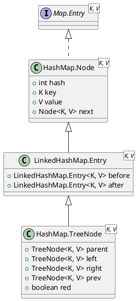
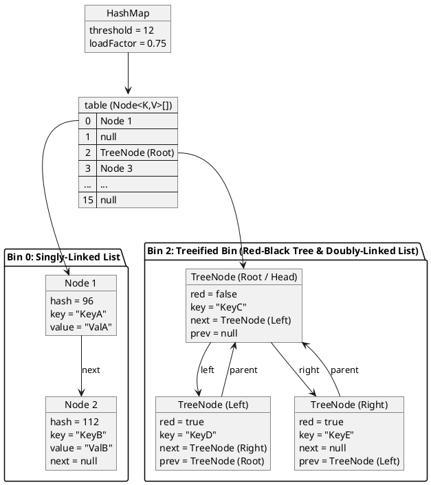
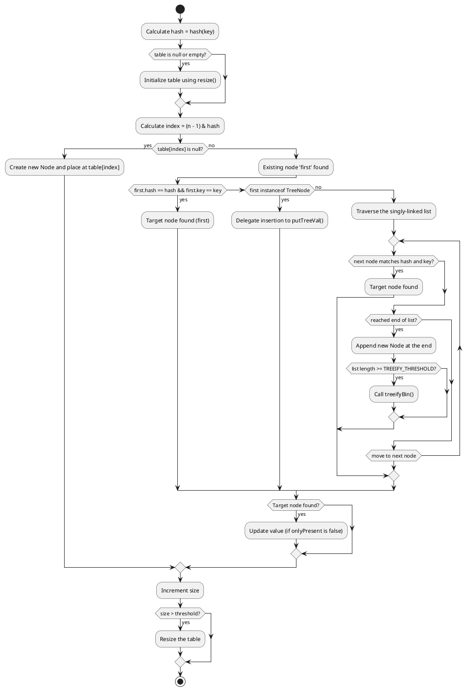

<!--more-->

`java.util.HashMap` is a hash table-based implementation of the `Map` interface in the Java Collections Framework, permitting `null` keys and `null` values. This document details its internal architecture, data structures, key thresholds, resizing mechanics, and treeification algorithms based on the OpenJDK source code.

---

## 1. Architecture and Internal Data Structures

HashMap uses chaining to resolve hash collisions. When a bin's collision count exceeds a set threshold, the bin dynamically transforms from a singly-linked list into a balanced Red-Black Tree to guarantee $O(\log n)$ worst-case performance.

### 1.1 Class Hierarchy and Node Variants

HashMap represents entries using two primary node types:
1. **`Node<K,V>`**: The standard singly-linked list node used for most bins.
2. **`TreeNode<K,V>`**: The red-black tree node used for treeified bins. It extends `LinkedHashMap.Entry<K,V>`, which extends `HashMap.Node<K,V>`.



By inheriting from `LinkedHashMap.Entry`, a `TreeNode` retains the `next` pointer and adds a `prev` pointer. Tree bins maintain a doubly-linked list structure in parallel to their red-black tree structure. This dual representation enables rapid sequential iteration and efficient conversion back to a plain linked list during shrinking.

### 1.2 HashMap Memory Layout

The following diagram illustrates the memory layout of a HashMap containing both standard linked-list bins and a treeified red-black tree bin:



### 1.3 Singly-Linked Lists vs. Doubly-Linked Trees: Design Trade-offs

The architectural difference in chaining—singly-linked for normal lists and doubly-linked for trees—is a trade-off between space overhead and time complexity.

#### Singly-Linked List Bin Design Rationale
* **Memory Optimization**: The majority of buckets in a well-distributed hash table contain zero or one element. Under a default load factor of $0.75$, the probability of a bin containing more than 2 elements is extremely small. Keeping the standard `Node` singly linked (possessing only a `next` pointer) minimizes the overall memory footprint of the map.
* **Negligible Deletion Cost**: Although removing a node from a singly-linked list requires traversing the list to find the predecessor ($O(n)$ time complexity), the maximum list length is capped at 8 due to treeification. Finding the predecessor in a list of length $\le 8$ is extremely fast and runs in constant time in practice.

#### Doubly-Linked Tree Bin Design Rationale
TreeNode inherits the `next` pointer from `Node`. This sequential `next` chain enables forward-only operations, such as resizing partitioning (`split`) and sequential iteration. A singly-linked structure is sufficient for these tasks. However, `TreeNode` introduces a `prev` pointer, creating a doubly-linked list, specifically to optimize deletion:

* **Constant-Time Sequential Unlinking (`removeTreeNode`)**: When removing a key-value pair from a tree bin, HashMap deletes the node from both the Red-Black Tree and the sequential list. 
  * Without a `prev` pointer, unlinking a node from the sequential list would require starting at the head of the bin and traversing forward to find the predecessor, costing $O(n)$ time.
  * Since tree deletion operates in $O(\log n)$ time, a sequential $O(n)$ predecessor search during list unlinking would bottleneck the operation.
  * The `prev` pointer enables immediate unlinking in $O(1)$ time:
  ```java
  TreeNode<K,V> succ = (TreeNode<K,V>)next, pred = prev;
  if (pred == null)
      tab[index] = first = succ;
  else
      pred.next = succ;
  if (succ != null)
      succ.prev = pred;
  ```
  This preserves the overall $O(\log n)$ deletion complexity.

---

## 2. Key Thresholds and Constants

The behavior of HashMap is governed by several critical constants defined in the source code:

| Constant | Default Value | Rationale |
| :--- | :--- | :--- |
| `DEFAULT_INITIAL_CAPACITY` | `16` (`1 << 4`) | Must be a power of two. |
| `MAXIMUM_CAPACITY` | `1,073,741,824` (`1 << 30`) | The maximum size of the internal table array. |
| `DEFAULT_LOAD_FACTOR` | `0.75f` | The default trade-off threshold between space and time cost. |
| `TREEIFY_THRESHOLD` | `8` | The bin count threshold for transforming a list into a tree. |
| `UNTREEIFY_THRESHOLD` | `6` | The bin count threshold for transforming a tree back into a list during resizing. |
| `MIN_TREEIFY_CAPACITY` | `64` | The minimum table capacity required to treeify a bin. |

### The Poisson Distribution and Threshold Design
The selection of `TREEIFY_THRESHOLD = 8` is mathematically motivated. Under a well-distributed hash function, the probability of having $k$ elements in any given bin follows a Poisson Distribution with a parameter of approximately $0.5$ (for a load factor of $0.75$).

The expected probability for list sizes is:
* **0 elements**: $0.60653066$
* **1 element**: $0.30326533$
* **2 elements**: $0.07581633$
* **3 elements**: $0.01263606$
* **4 elements**: $0.00157952$
* **5 elements**: $0.00015795$
* **6 elements**: $0.00001316$
* **7 elements**: $0.00000094$
* **8 elements**: $0.00000006$ (less than 1 in 10 million)

Treeification is an exceptional fallback designed to protect against poor hash distributions (accidental or malicious, such as HashDoS attacks).

---

## 3. Hash Function and Index Calculation

### 3.1 Hash Spreading
To ensure elements are dispersed uniformly, HashMap applies a supplemental hash function to the key's `hashCode()`:

```java
static final int hash(Object key) {
    int h;
    return (key == null) ? 0 : (h = key.hashCode()) ^ (h >>> 16);
}
```

#### Supplemental Hash Design Rationale
Since the table capacity is always a power of two, index calculations only consider the lower bits of the hash. If keys have hash codes that differ only in their higher bits, they will collide. Shifting the higher 16 bits downward and XORing them with the lower 16 bits ensures that variations in the upper bits influence the final index calculation, reducing systematic collisions in small tables.

### 3.2 Index Masking
The bucket index for a hash is computed using bitwise AND:
```java
index = (n - 1) & hash
```
Since the table capacity $n$ is a power of two, $n-1$ acts as a bitmask where all lower bits are set to 1. Using a bitwise AND operation (`&`) is computationally faster than the modulo operator (`%`).

---

## 4. The Put Operation and Treeify Mechanism

When inserting a key-value pair via `put(K key, V value)`, HashMap delegates to the internal `putVal` method.



### 4.1 The `treeifyBin` Guard
When a bin's linked list reaches a length of 8, `treeifyBin` is called. It does not immediately build a tree:

```java
final void treeifyBin(Node<K,V>[] tab, int hash) {
    int n, index; Node<K,V> e;
    if (tab == null || (n = tab.length) < MIN_TREEIFY_CAPACITY)
        resize();
    else if ((e = tab[index = (n - 1) & hash]) != null) {
        TreeNode<K,V> hd = null, tl = null;
        do {
            TreeNode<K,V> p = replacementTreeNode(e, null);
            if (tl == null)
                hd = p;
            else {
                p.prev = tl;
                tl.next = p;
            }
            tl = p;
        } while ((e = e.next) != null);
        if ((tab[index] = hd) != null)
            hd.treeify(tab);
    }
}
```

If the table capacity is less than `MIN_TREEIFY_CAPACITY` (64), HashMap resizes the entire table instead of treeifying. Resizing doubles the capacity and splits the crowded bin, which is more effective for smaller tables.

### 4.2 Red-Black Tree Construction
When the capacity is $\ge 64$, `treeifyBin` converts the singly-linked list into a doubly-linked list of `TreeNode` instances and invokes `treeify(tab)` on the head node (`hd`). 

Inside `treeify`, nodes are inserted one by one into a Red-Black Tree. To maintain a strict binary search tree structure, keys are ordered using the following cascading strategies:
1. **Hash Comparison**: Nodes are ordered by their hash values.
2. **Comparable Class**: If keys share the same hash and implement `Comparable<C>`, their `compareTo` method is used.
3. **Tie-Breaker**: If keys remain unordered, `tieBreakOrder(Object a, Object b)` is called:
   ```java
   static int tieBreakOrder(Object a, Object b) {
       int d;
       if (a == null || b == null ||
           (d = a.getClass().getName().compareTo(b.getClass().getName())) == 0)
           d = (System.identityHashCode(a) <= System.identityHashCode(b) ? -1 : 1);
       return d;
   }
   ```
   This ensures a stable, consistent order across tree rebalancings. After every insertion, `balanceInsertion` is called to repaint and rotate the tree, and `moveRootToFront` ensures the tree's root remains at the head of the table bin.

### 4.3 TreeNode Insertion and Deletion Mechanics

Tree operations such as node addition and deletion require Red-Black Tree traversal, structural manipulation, and rebalancing algorithms.

#### TreeNode Insertion Mechanics (`putTreeVal`)
When `putVal` delegates to `putTreeVal(map, tab, h, k, v)`, the insertion follows these steps:
1. **Locate the Root**: Identifies the root node of the current tree bin:
   ```java
   TreeNode<K,V> root = (parent != null) ? root() : this;
   ```
2. **Binary Search Tree Traversal**: Traverses down the tree. At each node `p`, it compares the target hash `h` and key `k`:
   * **Go Left**: If `h < p.hash`.
   * **Go Right**: If `h > p.hash`.
   * **Exact Match**: If `h == p.hash` and `(p.key == k || (k != null && k.equals(p.key)))`, the key exists; it returns `p` to update its value.
   * **Tie-Breaking**: If hashes are equal but keys do not match, it checks if the key implements `Comparable`. If they are not comparable or `compareTo` returns `0`, it searches the left and right subtrees (`find`). If the key is not found, it invokes `tieBreakOrder` to choose a direction.
3. **Insert the TreeNode**:
   * Upon reaching a leaf position (where the chosen direction is `null`), it creates a new `TreeNode` `x`.
   * It hooks the new node `x` as the left or right child of the parent node (`xp`).
   * **Doubly-Linked List Insertion**: Instead of appending the new node to the end of the sequential list, HashMap inserts it **immediately after its tree parent `xp`** in the doubly-linked list:
     ```java
     Node<K,V> xpn = xp.next;
     TreeNode<K,V> x = map.newTreeNode(h, k, v, xpn); 
     xp.next = x;
     x.parent = x.prev = xp;
     if (xpn != null)
         ((TreeNode<K,V>)xpn).prev = x;
     ```
     ##### Insertion Location Rationale
     * **Constant-Time Complexity ($O(1)$)**: HashMap only tracks the head (root) of the tree in the bucket array (`table[index]`) and does not maintain a reference to the tail of the list. Appending to the end of the list would require traversing the entire list, costing $O(n)$ time. Inserting immediately after the tree parent `xp` ensures a guaranteed $O(1)$ pointer reassignment, preserving the overall $O(\log n)$ insertion complexity.
     * **Locality of Reference**: Keys that are parent-child in the Red-Black Tree are close in sorting order. Inserting them adjacent to each other in the sequential list maintains memory and traversal locality, improving CPU cache efficiency during iteration.
     * **No Chronological Order Requirement**: The "preserving insertion order" rule only applies when splitting the list during `resize()`. Within an active tree bin, there is no requirement that the sequential list must be in strict chronological insertion order. The list's order only needs to be stable and traversable.
4. **Restore Red-Black Invariants**:
   * It calls `balanceInsertion(root, x)` to perform color adjustments and tree rotations, maintaining tree balance.
   * It calls `moveRootToFront(tab, root)` to ensure the root of the tree is stored at the head of the table bucket array `tab[index]`.

#### TreeNode Deletion Mechanics (`removeTreeNode`)
When removing an entry that resides in a tree bin, HashMap invokes `removeTreeNode(map, tab, movable)` using these steps:
1. **Unlink from the Doubly-Linked List**: Unlinks the node from the sequential doubly-linked list using its `prev` and `next` pointers in $O(1)$ time.
2. **Pre-emptive Untreeify Check**: Evaluates the tree structure. If the tree is too small, it is converted back to a plain singly-linked list:
   ```java
   if (root == null || (movable && (root.right == null || (rl = root.left) == null || rl.left == null))) {
       tab[index] = first.untreeify(map);
       return;
   }
   ```
3. **Tree Linkage Swapping**: Standard academic Red-Black Tree implementations typically swap the key-value data of a deleted node with its successor. In contrast, HashMap **swaps the actual node pointers and tree connections** (parent, left, right, and colors). This prevents issues with external iterators or other threads holding references to the actual `TreeNode` object.
4. **Unlink from the Tree Structure**: Updates the parent's and children's references to bypass the deleted node, unlinking it.
5. **Restore Balance (`balanceDeletion`)**: If the deleted node (or its replacement) was black, it calls `balanceDeletion(root, replacement)` to perform recoloring and rotations to rebalance the tree.
6. **Maintain Root at Head**: Calls `moveRootToFront` to place the rebalanced tree's root at the table array index.

### 4.4 The "compareTo() == 0" vs "equals() == false" Scenario

Keys are considered logically identical in a HashMap if and only if their hashes match and their `equals` method returns `true`:
```java
k1.hashCode() == k2.hashCode() && (k1 == k2 || k1.equals(k2))
```
If this condition is met, HashMap overwrites the existing entry's value.

However, a Red-Black Tree requires a **total ordering** of elements to arrange them hierarchically. When a hash collision occurs (different keys share the same hash), HashMap relies on the `Comparable` interface to establish this ordering.

This introduces a critical edge case: **What happens when `compareTo()` returns `0`, but `equals()` is `false`?**

#### 1. Rationale and Context
The `Comparable` documentation states:
> "It is strongly recommended (though not required) that natural orderings be consistent with equals."
Consequently, a class can be designed where `compareTo(x) == 0` does not imply `equals(x) == true`.
For example, consider a custom class representing a student:
* `equals()` compares all fields: `id`, `name`, and `age`.
* `compareTo()` only compares the `id` field.
* Two instances, `Student("123", "Alice", 20)` and `Student("123", "Bob", 22)`:
  * `compareTo()` returns `0` (shared ID).
  * `equals()` returns `false` (different names and ages).
  * Because `equals()` is `false`, they are distinct keys and both must be stored as separate entries in the HashMap.

#### 2. Conflict Resolution Mechanism
When HashMap encounters two keys in a tree bin where `hash(k1) == hash(k2)` and `k1.compareTo(k2) == 0`, but `k1.equals(k2) == false`, it resolves the conflict as follows:

1. **Subtree Search (`find`)**:
   Before inserting a new node, HashMap must guarantee the key does not already exist in the tree. Because `compareTo() == 0` fails to provide a left/right direction, the target key could be located in either subtree. It searches both the left and right subtrees of the current node:
   ```java
   if (!searched) {
       TreeNode<K,V> q, ch;
       searched = true;
       if (((ch = p.left) != null && (q = ch.find(h, k, kc)) != null) ||
           ((ch = p.right) != null && (q = ch.find(h, k, kc)) != null))
           return q; // Found the matching node (via equals() == true)
   }
   ```
2. **Deterministic Tie-Breaking (`tieBreakOrder`)**:
   If the subtree search returns `null`, the key is not in the map. To insert the new node and maintain a stable tree structure, HashMap invokes `tieBreakOrder` to choose a direction:
   ```java
   static int tieBreakOrder(Object a, Object b) {
       int d;
       if (a == null || b == null ||
           (d = a.getClass().getName().compareTo(b.getClass().getName())) == 0)
           d = (System.identityHashCode(a) <= System.identityHashCode(b) ? -1 : 1);
       return d;
   }
   ```
   * It compares class names alphabetically.
   * If classes are identical, it compares their `System.identityHashCode()`, which is based on memory addresses, guaranteeing a consistent, stable ordering for different object instances.

This combination of subtree searching and memory-address-based tie-breaking allows HashMap to support keys where the natural ordering is inconsistent with equality, maintaining both map correctness and logarithmic search performance.

---

## 5. Resizing and Capacity Management

Resizing occurs when the number of elements in the map exceeds `threshold` (capacity $\times$ load factor). The `resize()` method initializes the table or doubles its capacity.

### 5.1 The Bitwise Split Logic
During capacity doubling, the table capacity increases from `oldCap` to `newCap` (where `newCap = oldCap << 1`). 

Because the table size is a power of two, the index of any key in the new table is calculated as `hash & (newCap - 1)`. The difference between the new mask (`newCap - 1`) and the old mask (`oldCap - 1`) is exactly the bit representing `oldCap`. 

Consequently, any node in bin `j` of the old table can only be redistributed to:
1. **`j`** (the same index)
2. **`j + oldCap`** (the index offset by the old capacity)

HashMap determines this destination using a bitwise check:
```java
if ((e.hash & oldCap) == 0) {
    // Element stays at index j
} else {
    // Element moves to index j + oldCap
}
```
This bitwise split avoids recalculating hash codes or performing division/modulo arithmetic.

### 5.2 Preservation of Insertion Order
When redistributing a singly-linked list, HashMap builds two separate sub-lists: the `lo` list (which stays at `j`) and the `hi` list (which moves to `j + oldCap`).

```java
Node<K,V> loHead = null, loTail = null;
Node<K,V> hiHead = null, hiTail = null;
Node<K,V> next;
do {
    next = e.next;
    if ((e.hash & oldCap) == 0) {
        if (loTail == null) loHead = e;
        else loTail.next = e;
        loTail = e;
    } else {
        if (hiTail == null) hiHead = e;
        else hiTail.next = e;
        hiTail = e;
    }
} while ((e = next) != null);

if (loTail != null) {
    loTail.next = null;
    newTab[j] = loHead;
}
if (hiTail != null) {
    hiTail.next = null;
    newTab[j + oldCap] = hiHead;
}
```

By appending elements to the tail of `lo` and `hi` lists, HashMap preserves their original relative iteration order. Java 8 preserves the relative order of nodes during redistribution, addressing a vulnerability in Java 7 where order reversal under concurrent resize operations could lead to infinite loops.

### 5.3 The Java 7 Multi-Threaded Resizing Bug (Circular References)

A circular reference occurs when two nodes in a bucket's linked list point to each other, forming a closed loop:
```
Node A ───► Node B ───► Node A (loop)
```
Once this loop is established, any subsequent operation (e.g., `get()`, `put()`) that maps to this bucket will traverse the loop endlessly, resulting in an infinite loop that spikes CPU utilization to 100%.

#### Java 7 Circular Reference Formation
In Java 7, the `transfer` method moved nodes from the old table to the new table by prepending them to the head of the new bucket list (head-insertion). Head-insertion reverses the order of nodes during resizing. Under multi-threaded concurrent execution, this reversal can lead to a circular reference.

##### The Step-by-Step Scenario
Suppose a bucket contains two nodes, `A` and `B`, where `A.next = B` (`A -> B -> null`). Both keys hash to the same bucket index in the new table. Two threads, **Thread 1** and **Thread 2**, resize the map concurrently:

1. **Thread 1 Starts Resizing**:
   * It accesses the bucket and prepares to process the first element.
   * Its local variables are set to: `e = A` and `next = B`.
   * Thread 1's execution is immediately suspended (context switched).

2. **Thread 2 Runs to Completion**:
   * Thread 2 resizes the map fully.
   * Due to head-insertion, the order of nodes in the new table is reversed:
     * Node `A` is moved first: `newTable[index] = A -> null`.
     * Node `B` is moved second and prepended: `newTable[index] = B -> A -> null`.
   * In the shared main memory, the links are:
     ```
     B.next = A
     A.next = null
     ```

3. **Thread 1 Resumes**:
   * Thread 1 resumes with its local variables: `e = A` and `next = B`.
   * Thread 1 executes its head-insertion logic for `e` (`A`):
     * It sets `e.next = newTable[index]` (`A.next = newTable[index]`).
     * Since Thread 2 has already completed, `newTable[index]` currently points to `B`.
     * Thread 1 sets: `A.next = B`.
   * Since Thread 2 had already established `B.next = A`, a **circular reference** is formed: `A.next = B` and `B.next = A`.

```
               ┌──────────┐
          ┌───►│  Node A  │───┐
          │    └──────────┘   │
          │                   ▼
     A.next = B          B.next = A
          │                   │
          │    ┌──────────┐   │
          └────│  Node B  │◄──┘
               └──────────┘
```

Subsequent calls to `get(key)` mapping to this bucket will cycle between `A` and `B` infinitely, consuming 100% of a CPU core.

#### Java 8 Tail-Insertion Solution
In Java 8, HashMap uses tail-insertion during resizing. By building two separate lists (`lo` and `hi`) and appending elements to their tails, the original relative order of the elements is preserved (e.g., `A` remains before `B`). Because the relative order is never reversed, a circular reference cannot be formed, eliminating the resizing infinite loop.

> [!NOTE]
> Although Java 8's order-preserving resize eliminates the circular reference infinite loop, HashMap is still **not thread-safe**. Concurrent modifications can cause other structural corruptions, lost updates, or `NullPointerException`s. For multi-threaded scenarios, `ConcurrentHashMap` or `Collections.synchronizedMap()` must be used.

---

## 6. Shrinking and Untreeification Mechanics

While HashMap enlarges its capacity dynamically, it also shrinks individual tree bins back into plain singly-linked lists when their size becomes too small. This process is called **untreeification** and is done to save memory and avoid tree maintenance overhead when the number of elements is low.

There are two primary triggers for untreeification:

### 6.1 Untreeification During Resizing
When a treeified bin is split during a `resize()` operation, HashMap evaluates the number of elements allocated to the low and high split lists (`lc` and `hc` respectively) by traversing the doubly-linked list:

```java
final void split(HashMap<K,V> map, Node<K,V>[] tab, int index, int bit) {
    TreeNode<K,V> b = this;
    TreeNode<K,V> loHead = null, loTail = null;
    TreeNode<K,V> hiHead = null, hiTail = null;
    int lc = 0, hc = 0;
    for (TreeNode<K,V> e = b, next; e != null; e = next) {
        next = (TreeNode<K,V>)e.next;
        e.next = null;
        if ((e.hash & bit) == 0) {
            if ((e.prev = loTail) == null) loHead = e;
            else loTail.next = e;
            loTail = e;
            ++lc;
        } else {
            if ((e.prev = hiTail) == null) hiHead = e;
            else hiTail.next = e;
            hiTail = e;
            ++hc;
        }
    }

    if (loHead != null) {
        if (lc <= UNTREEIFY_THRESHOLD)
            tab[index] = loHead.untreeify(map);
        else {
            tab[index] = loHead;
            if (hiHead != null) // Re-treeify if split occurred
                loHead.treeify(tab);
        }
    }
    if (hiHead != null) {
        if (hc <= UNTREEIFY_THRESHOLD)
            tab[index + bit] = hiHead.untreeify(map);
        else {
            tab[index + bit] = hiHead;
            if (loHead != null)
                hiHead.treeify(tab);
        }
    }
}
```

If the count of a split list drops to or below the `UNTREEIFY_THRESHOLD` (6), the bin is converted back to a plain `Node` list using `untreeify(map)`.

### 6.2 Untreeification During Deletion
When a node is removed from a treeified bin via `removeTreeNode`, HashMap performs a structural check on the remaining tree:

```java
if (root == null
    || (movable
        && (root.right == null
            || (rl = root.left) == null
            || rl.left == null))) {
    tab[index] = first.untreeify(map);  // Too small, untreeify
    return;
}
```

If the tree is too small—specifically, if the root, the root's right child, the root's left child, or the root's left grandchild is missing—the bin is converted back to a plain linked list. This structural check triggers when the tree size falls between 2 and 6 nodes, depending on balance.

---

## Summary of Core State Transitions

The lifecycle of a single HashMap bucket is summarized by the following state transitions:

```
                  [ Empty Bin ]
                        │  (first put)
                        ▼
            [ Singly-Linked List ]
                        │
                        ├─ (put() & bin size >= 8 & capacity < 64) ──► [ Resize & Split ]
                        │
                        ├─ (put() & bin size >= 8 & capacity >= 64) ─► [ Red-Black Tree ]
                        │                                                   │
                        │                                                   ├─ (remove() & tree too small)
                        │                                                   │
                        ◄───────────────── (resize() & split size <= 6) ────┘
```

Through these synchronized mechanisms—efficient bitwise masking, high-to-low bit spreading, order-preserving resizing, and dynamic treeification/untreeification—HashMap achieves high throughput and robust performance under extreme workloads.
