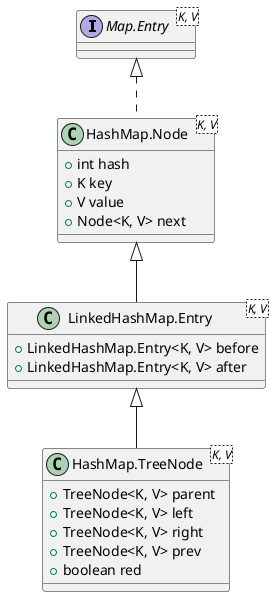
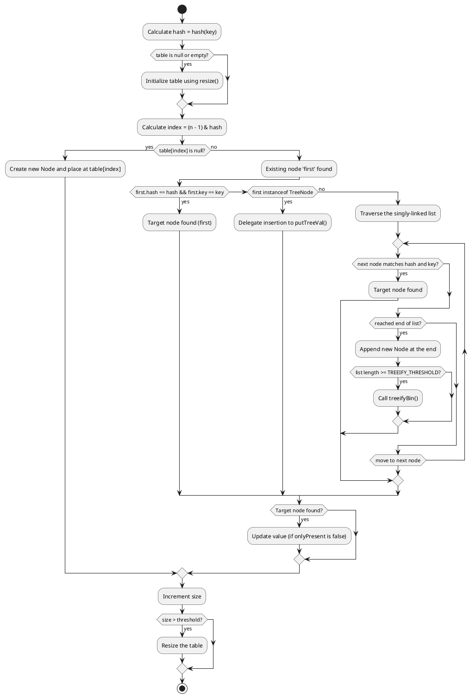

<!--more-->

`java.util.HashMap` is one of the most widely used data structures in the Java Collections Framework. It is a hash table-based implementation of the `Map` interface, permitting `null` keys and `null` values. 

This post provides a deep dive into the internal architecture, data structures, treeification thresholds, resizing mechanics, and shrinking algorithms of `HashMap`, based on the OpenJDK source code.

---

## 1. Architecture and Internal Data Structures

At its core, `HashMap` is a binned (bucketed) hash table that uses **chaining** to resolve hash collisions. When a bin becomes too crowded, `HashMap` dynamically transforms it from a singly-linked list into a balanced Red-Black Tree to guarantee $O(\log n)$ worst-case performance.

### 1.1 Class Hierarchy and Node Variants

Inside `HashMap`, entries are represented by two primary node types:
1. **`Node<K,V>`**: A standard singly-linked list node used for most bins.
2. **`TreeNode<K,V>`**: A red-black tree node used when a bin is treeified. It extends `LinkedHashMap.Entry<K,V>`, which in turn extends `HashMap.Node<K,V>`.

The class hierarchy of these nodes is illustrated below:



By inheriting from `LinkedHashMap.Entry`, a `TreeNode` retains the `next` pointer and adds a `prev` pointer. This means **tree bins maintain a doubly-linked list structure in parallel to their red-black tree structure**. This dual representation enables rapid iteration and extremely efficient conversion back to a plain linked list when shrinking.

### 1.2 HashMap Memory Layout

The following diagram shows the structural layout of a `HashMap` containing both standard linked-list bins and a treeified red-black tree bin:

```plantuml
@startuml
!option handwritten true
skinparam monochrome false

object "HashMap" as hm {
    threshold = 12
    loadFactor = 0.75
}

map "table (Node<K,V>[])" as table {
    0 => Node 1
    1 => null
    2 => TreeNode (Root)
    3 => Node 3
    ... => ...
    15 => null
}

hm --> table

package "Bin 0: Singly-Linked List" {
    object "Node 1" as n1 {
        hash = 96
        key = "KeyA"
        value = "ValA"
    }
    object "Node 2" as n2 {
        hash = 112
        key = "KeyB"
        value = "ValB"
        next = null
    }
    n1 --> n2 : next
}

package "Bin 2: Treeified Bin (Red-Black Tree & Doubly-Linked List)" {
    object "TreeNode (Root / Head)" as tr {
        red = false
        key = "KeyC"
        next = TreeNode (Left)
        prev = null
    }
    object "TreeNode (Left)" as tl {
        red = true
        key = "KeyD"
        next = TreeNode (Right)
        prev = TreeNode (Root)
    }
    object "TreeNode (Right)" as tx {
        red = true
        key = "KeyE"
        next = null
        prev = TreeNode (Left)
    }
    
    ' Tree Links
    tr --> tl : left
    tr --> tx : right
    tl --> tr : parent
    tx --> tr : parent
}

table::0 --> n1
table::2 --> tr
@enduml
```

### 1.3 Singly-Linked Lists vs. Doubly-Linked Trees: Design Trade-offs

The architectural difference in how entries are chained—singly-linked for normal lists and doubly-linked for trees—is a deliberate design trade-off between **space overhead** and **time complexity**.

#### Why the List Bin is Singly Linked
* **Memory Optimization**: 
  The vast majority of buckets in a well-distributed hash table contain either zero or one element. Under a default load factor of $0.75$, the probability of a bin containing more than 2 elements is extremely small. 
  By keeping the standard `Node` singly linked (possessing only a `next` pointer), `HashMap` minimizes its overall memory footprint. Adding a `prev` pointer to every single key-value entry would incur an unacceptable memory overhead across the application for a feature that is rarely utilized in short lists.
* **Negligible Deletion Cost**: 
  Although removing a node from a singly-linked list technically requires traversing the list to find the predecessor ($O(n)$ time complexity), the maximum list length is capped in practice (under 8 due to treeification). Finding the predecessor in a list of length $\le 8$ is extremely fast and effectively constant time ($O(1)$) in practice.

#### Why the Tree Bin is Doubly Linked (Adding the `prev` Pointer)

Because `TreeNode` inherits from `Node`, it automatically inherits the `next` pointer. This sequential `next` chain is what enables forward-only operations like **efficient resizing partitioning (`split`)** and the **$O(1)$ iteration step**. Indeed, a singly-linked list structure is completely sufficient for these two tasks since they only require forward traversal.

However, `TreeNode` introduces a `prev` pointer, transforming the chain into a doubly-linked list. The `prev` pointer is added **specifically and exclusively** to optimize deletion:

* **Constant-Time Sequential Unlinking During Deletion (`removeTreeNode`)**:
  When a key-value pair is removed from a tree bin, `HashMap` must delete the node from both the Red-Black Tree and the sequential list.
  * If the nodes were only singly linked, the only way to unlink a deleted node from the list would be to start at the head of the bin and traverse forward to find the node's predecessor, which takes $O(n)$ time.
  * Since the tree itself operates in $O(\log n)$ time, a sequential $O(n)$ predecessor search during list unlinking would bottleneck the entire deletion operation, destroying the worst-case logarithmic guarantee.
  * By maintaining a `prev` pointer, `HashMap` can immediately locate the predecessor and unlink the node from the list in $O(1)$ time:
  ```java
  TreeNode<K,V> succ = (TreeNode<K,V>)next, pred = prev;
  if (pred == null)
      tab[index] = first = succ;
  else
      pred.next = succ;
  if (succ != null)
      succ.prev = pred;
  ```
  This keeps the overall deletion complexity bounded at $O(\log n)$ (determined solely by the tree rebalancing phase).

---

## 2. Key Thresholds and Constants

The behavior of `HashMap` is governed by several critical constants defined in the source code:

| Constant | Default Value | Rationale |
| :--- | :--- | :--- |
| `DEFAULT_INITIAL_CAPACITY` | `16` (`1 << 4`) | Must be a power of two. |
| `MAXIMUM_CAPACITY` | `1,073,741,824` (`1 << 30`) | The maximum size of the internal table array. |
| `DEFAULT_LOAD_FACTOR` | `0.75f` | The default trade-off threshold between space and time cost. |
| `TREEIFY_THRESHOLD` | `8` | The bin count threshold for transforming a list into a tree. |
| `UNTREEIFY_THRESHOLD` | `6` | The bin count threshold for transforming a tree back into a list during resizing. |
| `MIN_TREEIFY_CAPACITY` | `64` | The minimum table capacity required to treeify a bin. |

### The Poisson Distribution and Threshold Design
The selection of `TREEIFY_THRESHOLD = 8` is mathematically motivated. Under the assumption of a well-distributed hash function, the probability of having $k$ elements in any given bin follows a **Poisson Distribution** with a parameter of approximately $0.5$ (for a load factor of $0.75$).

According to the OpenJDK source documentation, the expected probability for list sizes is:
* **0 elements**: $0.60653066$
* **1 element**: $0.30326533$
* **2 elements**: $0.07581633$
* **3 elements**: $0.01263606$
* **4 elements**: $0.00157952$
* **5 elements**: $0.00015795$
* **6 elements**: $0.00001316$
* **7 elements**: $0.00000094$
* **8 elements**: $0.00000006$ (less than 1 in 10 million)

Thus, treeification is an exceptional fallback designed to protect against poor hash distributions (accidental or malicious, such as HashDoS attacks) rather than a common execution path.

---

## 3. Hash Function and Index Calculation

### 3.1 Hash Spreading
To ensure elements are dispersed uniformly, `HashMap` applies a supplemental hash function to the key's `hashCode()`:

```java
static final int hash(Object key) {
    int h;
    return (key == null) ? 0 : (h = key.hashCode()) ^ (h >>> 16);
}
```

**Why XOR with `h >>> 16`?**
Because the capacity of the table is always a power of two, the index calculation only considers the lower bits of the hash. If keys have hash codes that differ only in their higher bits, they will inevitably collide. By shifting the higher 16 bits downward and XORing them with the lower 16 bits, `HashMap` ensures that variations in the upper bits also influence the final index calculation, reducing systematic collisions in small tables.

### 3.2 Index Masking
The bucket index for a hash is computed using bitwise AND:
```java
index = (n - 1) & hash
```
Since the table capacity $n$ is a power of two, $n-1$ acts as a bitmask where all lower bits are set to 1. Using a bitwise AND operation (`&`) is computationally much faster than the modulo operator (`%`).

---

## 4. The Put Operation and Treeify Mechanism

When inserting a key-value pair via `put(K key, V value)`, `HashMap` delegates to the internal `putVal` method.



### 4.1 The `treeifyBin` Guard
When a bin's linked list reaches a length of 8, `treeifyBin` is called. However, it does not immediately build a tree:

```java
final void treeifyBin(Node<K,V>[] tab, int hash) {
    int n, index; Node<K,V> e;
    if (tab == null || (n = tab.length) < MIN_TREEIFY_CAPACITY)
        resize();
    else if ((e = tab[index = (n - 1) & hash]) != null) {
        TreeNode<K,V> hd = null, tl = null;
        do {
            TreeNode<K,V> p = replacementTreeNode(e, null);
            if (tl == null)
                hd = p;
            else {
                p.prev = tl;
                tl.next = p;
            }
            tl = p;
        } while ((e = e.next) != null);
        if ((tab[index] = hd) != null)
            hd.treeify(tab);
    }
}
```

If the table capacity is less than `MIN_TREEIFY_CAPACITY` (64), `HashMap` chooses to **resize the entire table** instead of treeifying. Resizing doubles the capacity and naturally splits the crowded bin, which is generally more effective for smaller tables.

### 4.2 Building the Red-Black Tree
When the capacity is $\ge 64$, `treeifyBin` converts the singly-linked list into a doubly-linked list of `TreeNode` instances and invokes `treeify(tab)` on the head node (`hd`). 

Inside `treeify`, nodes are inserted one by one into a Red-Black Tree. To maintain a strict binary search tree structure, the keys must be ordered. `HashMap` uses the following cascading strategies to establish a deterministic search order:
1. **Hash Comparison**: Nodes are ordered by their hash values.
2. **Comparable Class**: If keys share the same hash and implement `Comparable<C>`, their `compareTo` method is used.
3. **Tie-Breaker**: If keys are still unordered (e.g., they do not implement `Comparable` or are of different classes), `tieBreakOrder(Object a, Object b)` is called:
   ```java
   static int tieBreakOrder(Object a, Object b) {
       int d;
       if (a == null || b == null ||
           (d = a.getClass().getName().compareTo(b.getClass().getName())) == 0)
           d = (System.identityHashCode(a) <= System.identityHashCode(b) ? -1 : 1);
       return d;
   }
   ```
   This ensures a total and consistent order across tree rebalancings. After every insertion, `balanceInsertion` is called to repaint and rotate the tree, and `moveRootToFront` ensures the tree's root remains at the head of the table bin.

### 4.3 Tree Node Insertion and Deletion Mechanics

When a bin is treeified, operations such as adding a node or deleting a node are no longer simple pointer reassignments on a linked list. They require executing Red-Black Tree traversal, structural manipulation, and rebalancing algorithms.

#### How a Tree Node is Added (`putTreeVal`)
When `putVal` delegates to `putTreeVal(map, tab, h, k, v)`, the insertion follows these steps:
1. **Locate the Root**: It identifies the root node of the current tree bin:
   ```java
   TreeNode<K,V> root = (parent != null) ? root() : this;
   ```
2. **Binary Search Tree Traversal**: It starts at the root and traverses down the tree. At each node `p`, it compares the target hash `h` and key `k` to decide the direction:
   * **Go Left**: If `h < p.hash`.
   * **Go Right**: If `h > p.hash`.
   * **Exact Match**: If `h == p.hash` and `(p.key == k || (k != null && k.equals(p.key)))`, the key already exists. It returns `p` to let the caller update its value.
   * **Tie-Breaking**: If the hashes are equal but the keys do not match, it checks if the key implements `Comparable` to compare them. If they are still not comparable or `compareTo` returns `0`, it searches the left and right subtrees (`find`). If the key is not found anywhere in the tree, it invokes `tieBreakOrder` to consistently choose a left or right direction.
3. **Insert the TreeNode**:
   - Once it reaches a leaf position (where the chosen direction is `null`), it creates a new `TreeNode`.
   - It hooks the new node as the child of the parent node (`xp`).
   - In addition to the tree pointers (`parent`, `left`, `right`), it inserts the new node immediately after `xp` in the sequential doubly-linked list (`next` and `prev` pointers).
4. **Restore Red-Black Invariants**:
   - It calls `balanceInsertion(root, x)` which performs necessary color adjustments and tree rotations (left or right) to maintain the Red-Black Tree balance.
   - It calls `moveRootToFront(tab, root)` to guarantee that the root of the tree is stored at the head of the table bucket array `tab[index]`.

#### How a Tree Node is Deleted (`removeTreeNode`)
When removing an entry that resides in a tree bin, `HashMap` invokes `removeTreeNode(map, tab, movable)`. The deletion follows these steps:
1. **Unlink from the Doubly-Linked List**:
   - It immediately unlinks the node from the sequential doubly-linked list using its `prev` and `next` pointers. This is done in $O(1)$ time, preventing the need to traverse the bin.
2. **Pre-emptive Untreeify Check**:
   - Before performing complex tree rotations, it checks the tree's structure. If the tree is too small, it is converted back to a plain singly-linked list:
     ```java
     if (root == null || (movable && (root.right == null || (rl = root.left) == null || rl.left == null))) {
         tab[index] = first.untreeify(map); // Too small, untreeify
         return;
     }
     ```
3. **Tree Linkage Swapping**:
   - Unlike standard academic Red-Black Tree implementations that simply swap the key-value data of a deleted node with its successor, `HashMap` **swaps the actual node pointers and tree connections** (parent, left, right, and colors).
   - This is necessary because external iterators and other threads might hold references to the actual `TreeNode` object, and mutating its key/value fields would violate thread safety and consistency.
4. **Unlink from the Tree Structure**:
   - Once the node is isolated or swapped with a successor leaf, the parent's and children's references are updated to bypass the deleted node, effectively unlinking it.
5. **Restore Balance (`balanceDeletion`)**:
   - If the deleted node (or its replacement) was black, deleting it disrupts the black-height invariant of the tree. `HashMap` runs `balanceDeletion(root, replacement)` to perform recoloring and rotations to rebalance the tree.
6. **Maintain Root at Head**:
   - Finally, it calls `moveRootToFront` to ensure that the potentially new root node of the rebalanced tree is placed at the index of the table array.

### 4.4 The "compareTo() == 0" vs "equals() == false" Scenario

In Java, two keys `k1` and `k2` are considered logically identical in a `HashMap` **if and only if** their hashes match and their `equals` method returns `true`:
```java
k1.hashCode() == k2.hashCode() && (k1 == k2 || k1.equals(k2))
```
If this condition is met, `HashMap` will overwrite the existing entry's value.

However, a Red-Black Tree is a binary search tree that requires a **total ordering** of elements to arrange them hierarchically. This means for any two nodes in a tree bin, `HashMap` must determine which one goes left and which one goes right.

When a hash collision occurs (i.e., different keys share the exact same hash, such as `"Aa"` and `"BB"` which both hash to `2112`), `HashMap` relies on the `Comparable` interface to establish this ordering.

This introduces a subtle and critical edge case: **What happens when `compareTo()` returns `0`, but `equals()` is `false`?**

#### 1. How Can This Happen?
According to the Java documentation for the `Comparable` interface:
> "It is strongly recommended (though not required) that natural orderings be consistent with equals."
This means a developer can write a class where `compareTo(x) == 0` does **not** imply `equals(x) == true`.
For example, consider a custom class representing a student:
* `equals()` compares all fields: `id`, `name`, and `age`.
* `compareTo()` is written to only compare `id`.
* If we have `Student("123", "Alice", 20)` and `Student("123", "Bob", 22)`:
  * Their `compareTo()` will return `0` (because they share the same ID).
  * Their `equals()` will return `false` (because their names and ages differ).
  * Since `equals()` is `false`, they are distinct keys and **both must be stored as separate entries in the HashMap**.

#### 2. How `HashMap` Resolves This Conflict
When `HashMap` encounters two keys in a tree bin where `hash(k1) == hash(k2)` and `k1.compareTo(k2) == 0`, but `k1.equals(k2) == false`, it handles it as follows:

1. **Subtree Search (`find`)**:
   Before declaring that the key is new and inserting a new node, `HashMap` must guarantee that the key does not already exist in the tree. Because `compareTo() == 0` fails to provide a left/right direction, the target key could be located in either subtree.
   Therefore, `HashMap` searches both the left and right subtrees of the current node:
   ```java
   if (!searched) {
       TreeNode<K,V> q, ch;
       searched = true;
       if (((ch = p.left) != null && (q = ch.find(h, k, kc)) != null) ||
           ((ch = p.right) != null && (q = ch.find(h, k, kc)) != null))
           return q; // Found the matching node (via equals() == true)
   }
   ```
2. **Deterministic Tie-Breaking (`tieBreakOrder`)**:
   If the subtree search returns `null` (meaning the key is indeed not in the map yet), `HashMap` must insert the new node. To maintain a stable tree structure, it must choose a consistent left/right direction.
   Since neither the hash nor `compareTo` can break the tie, `HashMap` invokes `tieBreakOrder`:
   ```java
   static int tieBreakOrder(Object a, Object b) {
       int d;
       if (a == null || b == null ||
           (d = a.getClass().getName().compareTo(b.getClass().getName())) == 0)
           d = (System.identityHashCode(a) <= System.identityHashCode(b) ? -1 : 1);
       return d;
   }
   ```
   * It first compares their class names alphabetically.
   * If the classes are identical, it compares their `System.identityHashCode()`.
   * Since `System.identityHashCode` is based on the object's memory address, it guarantees a consistent, stable ordering for different object instances.

Through this combination of subtree searching and memory-address-based tie-breaking, `HashMap` safely supports keys where the natural ordering is inconsistent with equality, maintaining both the correctness of the map and the logarithmic search performance of the Red-Black Tree.

---

## 5. Resizing and Capacity Management

Resizing occurs when the number of elements in the map exceeds `threshold` (capacity $\times$ load factor). The `resize()` method is responsible for initializing the table or doubling its capacity.

### 5.1 The Bitwise Split Logic
During capacity doubling, the table capacity increases from `oldCap` to `newCap` (where `newCap = oldCap << 1`). 

Because the table size is a power of two, the index of any key in the new table is calculated as `hash & (newCap - 1)`. The difference between the new mask (`newCap - 1`) and the old mask (`oldCap - 1`) is exactly the bit representing `oldCap`. 

Consequently, any node in bin `j` of the old table can only be redistributed to one of two indices in the new table:
1. **`j`** (the same index)
2. **`j + oldCap`** (the index offset by the old capacity)

`HashMap` determines this destination using a highly efficient bitwise check:
```java
if ((e.hash & oldCap) == 0) {
    // Element stays at index j
} else {
    // Element moves to index j + oldCap
}
```

This bitwise split avoids recalculating hash codes or performing division/modulo arithmetic.

### 5.2 Preservation of Insertion Order
When redistributing a singly-linked list, `HashMap` builds two separate sub-lists: the `lo` list (which stays at `j`) and the `hi` list (which moves to `j + oldCap`).

```java
Node<K,V> loHead = null, loTail = null;
Node<K,V> hiHead = null, hiTail = null;
Node<K,V> next;
do {
    next = e.next;
    if ((e.hash & oldCap) == 0) {
        if (loTail == null) loHead = e;
        else loTail.next = e;
        loTail = e;
    } else {
        if (hiTail == null) hiHead = e;
        else hiTail.next = e;
        hiTail = e;
    }
} while ((e = next) != null);

if (loTail != null) {
    loTail.next = null;
    newTab[j] = loHead;
}
if (hiTail != null) {
    hiTail.next = null;
    newTab[j + oldCap] = hiHead;
}
```

By appending elements to the tail of `lo` and `hi` lists, `HashMap` preserves their original relative iteration order. This is a crucial improvement introduced in Java 8; in Java 7, resizing reversed the order of nodes, which could lead to infinite loops under concurrent modifications.

---

## 6. Shrinking and Untreeification Mechanics

While `HashMap` enlarges its capacity dynamically, it also shrinks individual tree bins back into plain singly-linked lists when their size becomes too small. This process is called **untreeification** and is done to save memory and avoid the overhead of maintaining a Red-Black Tree when the number of elements is low.

There are two primary triggers for untreeification:

### 6.1 Untreeification During Resizing
When a treeified bin is split during a `resize()` operation, `HashMap` evaluates the number of elements allocated to the low and high split lists (`lc` and `hc` respectively) by traversing the inherited doubly-linked list:

```java
final void split(HashMap<K,V> map, Node<K,V>[] tab, int index, int bit) {
    TreeNode<K,V> b = this;
    TreeNode<K,V> loHead = null, loTail = null;
    TreeNode<K,V> hiHead = null, hiTail = null;
    int lc = 0, hc = 0;
    for (TreeNode<K,V> e = b, next; e != null; e = next) {
        next = (TreeNode<K,V>)e.next;
        e.next = null;
        if ((e.hash & bit) == 0) {
            if ((e.prev = loTail) == null) loHead = e;
            else loTail.next = e;
            loTail = e;
            ++lc;
        } else {
            if ((e.prev = hiTail) == null) hiHead = e;
            else hiTail.next = e;
            hiTail = e;
            ++hc;
        }
    }

    if (loHead != null) {
        if (lc <= UNTREEIFY_THRESHOLD)
            tab[index] = loHead.untreeify(map);
        else {
            tab[index] = loHead;
            if (hiHead != null) // Re-treeify if split occurred
                loHead.treeify(tab);
        }
    }
    if (hiHead != null) {
        if (hc <= UNTREEIFY_THRESHOLD)
            tab[index + bit] = hiHead.untreeify(map);
        else {
            tab[index + bit] = hiHead;
            if (loHead != null)
                hiHead.treeify(tab);
        }
    }
}
```

If the count of a split list drops to or below the `UNTREEIFY_THRESHOLD` (6), the bin is converted back to a plain `Node` list using `untreeify(map)`.

### 6.2 Untreeification During Deletion
When a node is removed from a treeified bin via `removeTreeNode`, `HashMap` performs a structural check on the remaining tree. Instead of counting all nodes (which would require $O(n)$ time), it checks for the presence of key structural nodes:

```java
if (root == null
    || (movable
        && (root.right == null
            || (rl = root.left) == null
            || rl.left == null))) {
    tab[index] = first.untreeify(map);  // Too small, untreeify
    return;
}
```

If the tree is too small—specifically, if the root, the root's right child, the root's left child, or the root's left grandchild is missing—the bin is deemed too sparse and is converted back to a plain linked list. This structural check triggers when the tree size falls between 2 and 6 nodes, depending on its balance.

---

## Summary of Core State Transitions

The lifecycle of a single `HashMap` bucket can be summarized by the following state transitions:

```
                  [ Empty Bin ]
                        │  (first put)
                        ▼
            [ Singly-Linked List ]
                        │
                        ├─ (put() & bin size >= 8 & capacity < 64) ──► [ Resize & Split ]
                        │
                        ├─ (put() & bin size >= 8 & capacity >= 64) ─► [ Red-Black Tree ]
                        │                                                   │
                        │                                                   ├─ (remove() & tree too small)
                        │                                                   │
                        ◄───────────────── (resize() & split size <= 6) ────┘
```

Through these synchronized mechanisms—efficient bitwise masking, high-to-low bit spreading, order-preserving resizing, and dynamic treeification/untreeification—`HashMap` achieves high throughput and robust performance even under extreme workloads.
