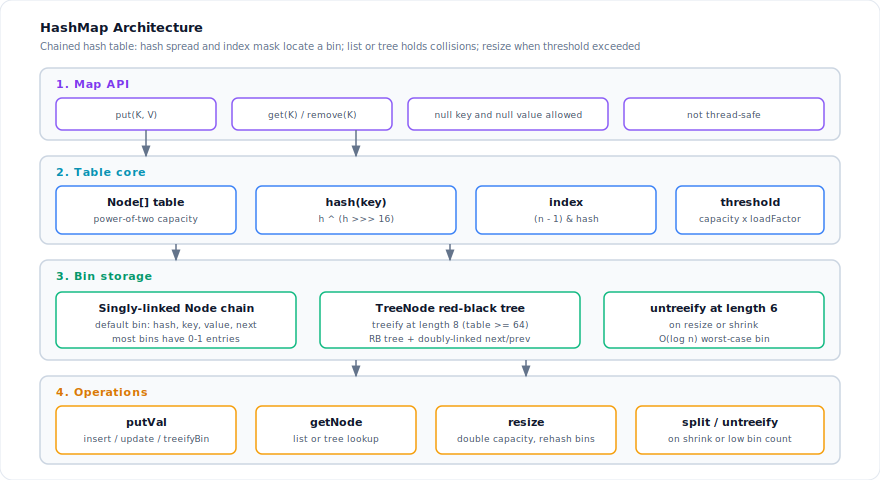
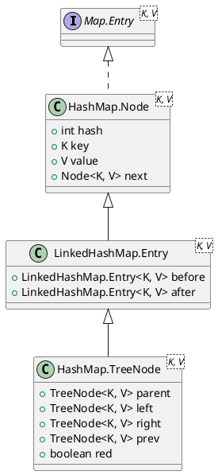
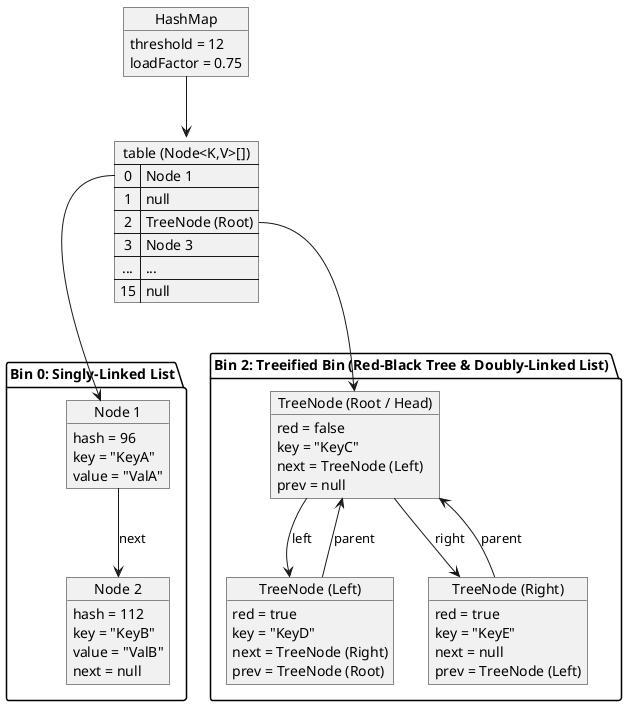

`java.util.HashMap` is a hash table-based implementation of the `Map` interface in the Java Collections Framework, permitting `null` keys and `null` values. It is **not thread-safe** — concurrent updates require external synchronization or `ConcurrentHashMap`.

At a high level, every operation follows the same path: spread the key's hash, mask it to a bin index, then search or mutate the bin's chain (or tree). When the table grows too full, `resize()` doubles capacity and re-distributes entries.
<!--more-->

---

## 1. Architecture

### 1.1 Layers and operation lifecycle

HashMap uses **chaining** to resolve hash collisions. Most bins hold zero or one entry as a singly-linked `Node`; when a bin's chain reaches length 8 (and the table is at least 64 slots), it **treeifies** into a red-black tree for $O(\log n)$ worst-case lookup in that bin.

| Layer | Role |
|-------|------|
| **Map API** | `put`, `get`, `remove` — delegates to internal `putVal` / `getNode` |
| **Table core** | `Node[] table`, supplemental `hash()`, index `(n - 1) & hash`, `threshold = capacity × loadFactor` |
| **Bin storage** | Singly-linked `Node` chain by default; `TreeNode` red-black tree when chain length ≥ 8 |
| **Operations** | `putVal` (insert/update/treeify), `getNode`, `resize` (double and rehash), `split` / untreeify on shrink |



#### Operation lifecycle

1. **Hash and index** — `hash(key)` XOR-spreads `hashCode()` upper bits; `index = (n - 1) & hash` selects the bin (table length is always a power of two).
2. **Bin lookup** — if `table[index]` is null, insert a new `Node`; otherwise walk the chain (or delegate to `putTreeVal` if the head is a `TreeNode`).
3. **Treeify guard** — when a chain reaches `TREEIFY_THRESHOLD` (8), `treeifyBin` builds a tree only if `table.length ≥ MIN_TREEIFY_CAPACITY` (64); otherwise it **resizes** first — doubling capacity often splits a crowded bin more cheaply than treeifying a small table.
4. **Resize trigger** — after each insert, if `size > threshold`, `resize()` allocates a doubled array and re-hashes every entry into low/high bins via `(hash & oldCap) == 0`.
5. **Untreeify** — during resize or when a tree bin shrinks to `UNTREEIFY_THRESHOLD` (6) entries, nodes revert to a plain linked list.

---

### 1.2 Structure

#### Class hierarchy and node variants

HashMap represents entries using two primary node types:
1. **`Node<K,V>`**: The standard singly-linked list node used for most bins.
2. **`TreeNode<K,V>`**: The red-black tree node used for treeified bins. It extends `LinkedHashMap.Entry<K,V>`, which extends `HashMap.Node<K,V>`.



`TreeNode` extends `LinkedHashMap.Entry` → `HashMap.Node`, adding tree pointers and `prev` on top of the base `next` field.

#### Memory layout

The following diagram illustrates the memory layout of a HashMap containing both standard linked-list bins and a treeified red-black tree bin:



**List bins** stay singly-linked (`next` only) — minimal footprint when most bins hold 0–1 entries at load factor 0.75; delete walks the chain to find a predecessor, but length is capped at 8 before treeify.

**Tree bins** maintain the RB tree and a parallel sequential chain: `next` for resize `split` and iteration; **`prev`** so `removeTreeNode` unlinks from the list in $O(1)$ while tree deletion stays $O(\log n)$:

```java
TreeNode<K,V> succ = (TreeNode<K,V>)next, pred = prev;
if (pred == null) tab[index] = first = succ;
else pred.next = succ;
if (succ != null) succ.prev = pred;
```

---

### 1.3 Key thresholds and constants

The behavior of HashMap is governed by several critical constants defined in the source code:

| Constant | Default Value | Rationale |
| :--- | :--- | :--- |
| `DEFAULT_INITIAL_CAPACITY` | `16` (`1 << 4`) | Must be a power of two. |
| `MAXIMUM_CAPACITY` | `1,073,741,824` (`1 << 30`) | The maximum size of the internal table array. |
| `DEFAULT_LOAD_FACTOR` | `0.75f` | The default trade-off threshold between space and time cost. |
| `TREEIFY_THRESHOLD` | `8` | The bin count threshold for transforming a list into a tree. |
| `UNTREEIFY_THRESHOLD` | `6` | The bin count threshold for transforming a tree back into a list during resizing. |
| `MIN_TREEIFY_CAPACITY` | `64` | The minimum table capacity required to treeify a bin. |

#### The Poisson Distribution and Threshold Design
The selection of `TREEIFY_THRESHOLD = 8` is mathematically motivated. Under a well-distributed hash function, the probability of having $k$ elements in any given bin follows a Poisson Distribution with a parameter of approximately $0.5$ (for a load factor of $0.75$).

The expected probability for list sizes is:
* **0 elements**: $0.60653066$
* **1 element**: $0.30326533$
* **2 elements**: $0.07581633$
* **3 elements**: $0.01263606$
* **4 elements**: $0.00157952$
* **5 elements**: $0.00015795$
* **6 elements**: $0.00001316$
* **7 elements**: $0.00000094$
* **8 elements**: $0.00000006$ (less than 1 in 10 million)

Treeification is an exceptional fallback designed to protect against poor hash distributions (accidental or malicious, such as HashDoS attacks).

---

## 2. Implementation details

### 2.1 Hash function and index calculation

#### Hash spreading
To ensure elements are dispersed uniformly, HashMap applies a supplemental hash function to the key's `hashCode()`:

```java
static final int hash(Object key) {
    int h;
    return (key == null) ? 0 : (h = key.hashCode()) ^ (h >>> 16);
}
```

##### Supplemental Hash Design Rationale
Since the table capacity is always a power of two, index calculations only consider the lower bits of the hash. If keys have hash codes that differ only in their higher bits, they will collide. Shifting the higher 16 bits downward and XORing them with the lower 16 bits ensures that variations in the upper bits influence the final index calculation, reducing systematic collisions in small tables.

#### Index masking
The bucket index for a hash is computed using bitwise AND:
```java
index = (n - 1) & hash
```
Since the table capacity $n$ is a power of two, $n-1$ acts as a bitmask where all lower bits are set to 1. Using a bitwise AND operation (`&`) is computationally faster than the modulo operator (`%`).

---

### 2.2 The put operation and treeify mechanism

`put()` delegates to `putVal`: hash and index the key, insert or update in the bin (empty slot, list walk, or `putTreeVal` for trees), increment `size`, resize if over `threshold`.

#### Treeify guard

When a list reaches length 8, `treeifyBin` runs — but if `table.length < MIN_TREEIFY_CAPACITY` (64), it **resizes instead** of building a tree:

```java
final void treeifyBin(Node<K,V>[] tab, int hash) {
    int n, index; Node<K,V> e;
    if (tab == null || (n = tab.length) < MIN_TREEIFY_CAPACITY)
        resize();
    else if ((e = tab[index = (n - 1) & hash]) != null) {
        TreeNode<K,V> hd = null, tl = null;
        do {
            TreeNode<K,V> p = replacementTreeNode(e, null);
            if (tl == null)
                hd = p;
            else {
                p.prev = tl;
                tl.next = p;
            }
            tl = p;
        } while ((e = e.next) != null);
        if ((tab[index] = hd) != null)
            hd.treeify(tab);
    }
}
```

When capacity is $\ge 64$, the chain becomes doubly-linked `TreeNode`s, then `hd.treeify(tab)` builds the red-black tree.

#### Tree ordering and insertion

Tree nodes are ordered by **hash**, then **`Comparable.compareTo`** if hashes tie, then **`tieBreakOrder`** (class name, then `identityHashCode`):

```java
static int tieBreakOrder(Object a, Object b) {
    int d;
    if (a == null || b == null ||
        (d = a.getClass().getName().compareTo(b.getClass().getName())) == 0)
        d = (System.identityHashCode(a) <= System.identityHashCode(b) ? -1 : 1);
    return d;
}
```

`putTreeVal` BST-walks to a leaf, inserts the new node **after its tree parent** in the sequential list, then `balanceInsertion` and `moveRootToFront`:

```java
Node<K,V> xpn = xp.next;
TreeNode<K,V> x = map.newTreeNode(h, k, v, xpn);
xp.next = x;
x.parent = x.prev = xp;
if (xpn != null)
    ((TreeNode<K,V>)xpn).prev = x;
```

**`compareTo() == 0` but `equals() == false`:** the map keys on `hash + equals`, but the tree needs a total order. When `compareTo` gives no direction, `find()` searches both subtrees before insert; if absent, `tieBreakOrder` picks left/right:

```java
if (!searched) {
    TreeNode<K,V> q, ch;
    searched = true;
    if (((ch = p.left) != null && (q = ch.find(h, k, kc)) != null) ||
        ((ch = p.right) != null && (q = ch.find(h, k, kc)) != null))
        return q;
}
```

#### Tree deletion

`removeTreeNode`: O(1) list unlink via `prev`/`next`; untreeify if the tree is too small; swap **node pointers** (not key/value); `balanceDeletion` and `moveRootToFront`:

```java
if (root == null || (movable &&
    (root.right == null || (rl = root.left) == null || rl.left == null))) {
    tab[index] = first.untreeify(map);
    return;
}
```

---

### 2.3 Resizing and capacity management

Resizing occurs when the number of elements in the map exceeds `threshold` (capacity $\times$ load factor). The `resize()` method initializes the table or doubles its capacity.

#### The bitwise split logic
During capacity doubling, the table capacity increases from `oldCap` to `newCap` (where `newCap = oldCap << 1`). 

Because the table size is a power of two, the index of any key in the new table is calculated as `hash & (newCap - 1)`. The difference between the new mask (`newCap - 1`) and the old mask (`oldCap - 1`) is exactly the bit representing `oldCap`. 

Consequently, any node in bin `j` of the old table can only be redistributed to:
1. **`j`** (the same index)
2. **`j + oldCap`** (the index offset by the old capacity)

HashMap determines this destination using a bitwise check:
```java
if ((e.hash & oldCap) == 0) {
    // Element stays at index j
} else {
    // Element moves to index j + oldCap
}
```
This bitwise split avoids recalculating hash codes or performing division/modulo arithmetic.

#### Preservation of insertion order
When redistributing a singly-linked list, HashMap builds two separate sub-lists: the `lo` list (which stays at `j`) and the `hi` list (which moves to `j + oldCap`).

```java
Node<K,V> loHead = null, loTail = null;
Node<K,V> hiHead = null, hiTail = null;
Node<K,V> next;
do {
    next = e.next;
    if ((e.hash & oldCap) == 0) {
        if (loTail == null) loHead = e;
        else loTail.next = e;
        loTail = e;
    } else {
        if (hiTail == null) hiHead = e;
        else hiTail.next = e;
        hiTail = e;
    }
} while ((e = next) != null);

if (loTail != null) {
    loTail.next = null;
    newTab[j] = loHead;
}
if (hiTail != null) {
    hiTail.next = null;
    newTab[j + oldCap] = hiHead;
}
```

By appending elements to the tail of `lo` and `hi` lists, HashMap preserves their original relative iteration order. Java 8 preserves the relative order of nodes during redistribution, addressing a vulnerability in Java 7 where order reversal under concurrent resize operations could lead to infinite loops.

#### The Java 7 multi-threaded resizing bug (circular references)

A circular reference occurs when two nodes in a bucket's linked list point to each other, forming a closed loop:
```
Node A ───► Node B ───► Node A (loop)
```
Once this loop is established, any subsequent operation (e.g., `get()`, `put()`) that maps to this bucket will traverse the loop endlessly, resulting in an infinite loop that spikes CPU utilization to 100%.

##### Java 7 Circular Reference Formation
In Java 7, the `transfer` method moved nodes from the old table to the new table by prepending them to the head of the new bucket list (head-insertion). Head-insertion reverses the order of nodes during resizing. Under multi-threaded concurrent execution, this reversal can lead to a circular reference.

##### The Step-by-Step Scenario
Suppose a bucket contains two nodes, `A` and `B`, where `A.next = B` (`A -> B -> null`). Both keys hash to the same bucket index in the new table. Two threads, **Thread 1** and **Thread 2**, resize the map concurrently:

1. **Thread 1 Starts Resizing**:
   * It accesses the bucket and prepares to process the first element.
   * Its local variables are set to: `e = A` and `next = B`.
   * Thread 1's execution is immediately suspended (context switched).

2. **Thread 2 Runs to Completion**:
   * Thread 2 resizes the map fully.
   * Due to head-insertion, the order of nodes in the new table is reversed:
     * Node `A` is moved first: `newTable[index] = A -> null`.
     * Node `B` is moved second and prepended: `newTable[index] = B -> A -> null`.
   * In the shared main memory, the links are:
     ```
     B.next = A
     A.next = null
     ```

3. **Thread 1 Resumes**:
   * Thread 1 resumes with its local variables: `e = A` and `next = B`.
   * Thread 1 executes its head-insertion logic for `e` (`A`):
     * It sets `e.next = newTable[index]` (`A.next = newTable[index]`).
     * Since Thread 2 has already completed, `newTable[index]` currently points to `B`.
     * Thread 1 sets: `A.next = B`.
   * Since Thread 2 had already established `B.next = A`, a **circular reference** is formed: `A.next = B` and `B.next = A`.

```
               ┌──────────┐
          ┌───►│  Node A  │───┐
          │    └──────────┘   │
          │                   ▼
     A.next = B          B.next = A
          │                   │
          │    ┌──────────┐   │
          └────│  Node B  │◄──┘
               └──────────┘
```

Subsequent calls to `get(key)` mapping to this bucket will cycle between `A` and `B` infinitely, consuming 100% of a CPU core.

##### Java 8 Tail-Insertion Solution
In Java 8, HashMap uses tail-insertion during resizing. By building two separate lists (`lo` and `hi`) and appending elements to their tails, the original relative order of the elements is preserved (e.g., `A` remains before `B`). Because the relative order is never reversed, a circular reference cannot be formed, eliminating the resizing infinite loop.

> [!NOTE]
> Although Java 8's order-preserving resize eliminates the circular reference infinite loop, HashMap is still **not thread-safe**. Concurrent modifications can cause other structural corruptions, lost updates, or `NullPointerException`s. For multi-threaded scenarios, `ConcurrentHashMap` or `Collections.synchronizedMap()` must be used.

---

### 2.4 Shrinking and untreeification mechanics

While HashMap enlarges its capacity dynamically, it also shrinks individual tree bins back into plain singly-linked lists when their size becomes too small. This process is called **untreeification** and is done to save memory and avoid tree maintenance overhead when the number of elements is low.

There are two primary triggers for untreeification:

#### Untreeification during resizing
When a treeified bin is split during a `resize()` operation, HashMap evaluates the number of elements allocated to the low and high split lists (`lc` and `hc` respectively) by traversing the doubly-linked list:

```java
final void split(HashMap<K,V> map, Node<K,V>[] tab, int index, int bit) {
    TreeNode<K,V> b = this;
    TreeNode<K,V> loHead = null, loTail = null;
    TreeNode<K,V> hiHead = null, hiTail = null;
    int lc = 0, hc = 0;
    for (TreeNode<K,V> e = b, next; e != null; e = next) {
        next = (TreeNode<K,V>)e.next;
        e.next = null;
        if ((e.hash & bit) == 0) {
            if ((e.prev = loTail) == null) loHead = e;
            else loTail.next = e;
            loTail = e;
            ++lc;
        } else {
            if ((e.prev = hiTail) == null) hiHead = e;
            else hiTail.next = e;
            hiTail = e;
            ++hc;
        }
    }

    if (loHead != null) {
        if (lc <= UNTREEIFY_THRESHOLD)
            tab[index] = loHead.untreeify(map);
        else {
            tab[index] = loHead;
            if (hiHead != null) // Re-treeify if split occurred
                loHead.treeify(tab);
        }
    }
    if (hiHead != null) {
        if (hc <= UNTREEIFY_THRESHOLD)
            tab[index + bit] = hiHead.untreeify(map);
        else {
            tab[index + bit] = hiHead;
            if (loHead != null)
                hiHead.treeify(tab);
        }
    }
}
```

If the count of a split list drops to or below the `UNTREEIFY_THRESHOLD` (6), the bin is converted back to a plain `Node` list using `untreeify(map)`.

#### Untreeification during deletion
When a node is removed from a treeified bin via `removeTreeNode`, HashMap performs a structural check on the remaining tree:

```java
if (root == null
    || (movable
        && (root.right == null
            || (rl = root.left) == null
            || rl.left == null))) {
    tab[index] = first.untreeify(map);  // Too small, untreeify
    return;
}
```

If the tree is too small—specifically, if the root, the root's right child, the root's left child, or the root's left grandchild is missing—the bin is converted back to a plain linked list. This structural check triggers when the tree size falls between 2 and 6 nodes, depending on balance.

---

### 2.5 Summary of core state transitions

The lifecycle of a single HashMap bucket is summarized by the following state transitions:

```
                  [ Empty Bin ]
                        │  (first put)
                        ▼
            [ Singly-Linked List ]
                        │
                        ├─ (put() & bin size >= 8 & capacity < 64) ──► [ Resize & Split ]
                        │
                        ├─ (put() & bin size >= 8 & capacity >= 64) ─► [ Red-Black Tree ]
                        │                                                   │
                        │                                                   ├─ (remove() & tree too small)
                        │                                                   │
                        ◄───────────────── (resize() & split size <= 6) ────┘
```

Through these synchronized mechanisms—efficient bitwise masking, high-to-low bit spreading, order-preserving resizing, and dynamic treeification/untreeification—HashMap achieves high throughput and robust performance under extreme workloads.
