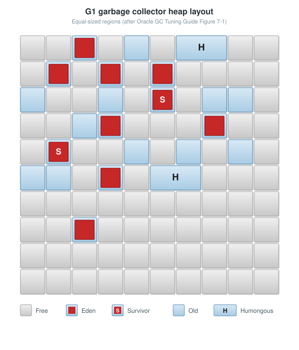
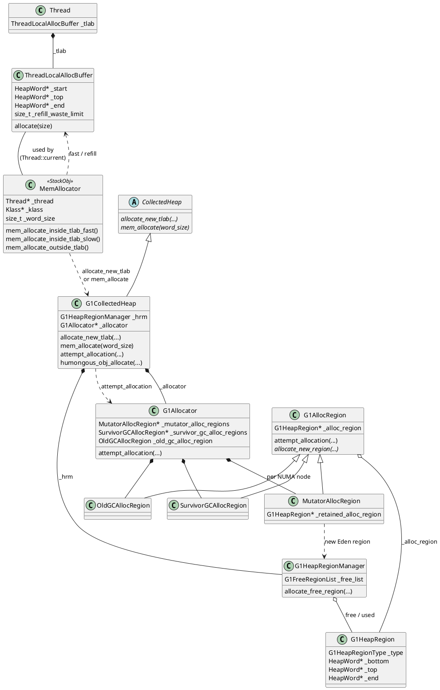
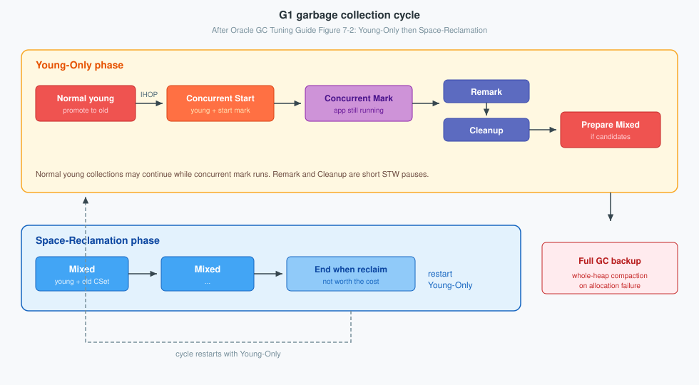
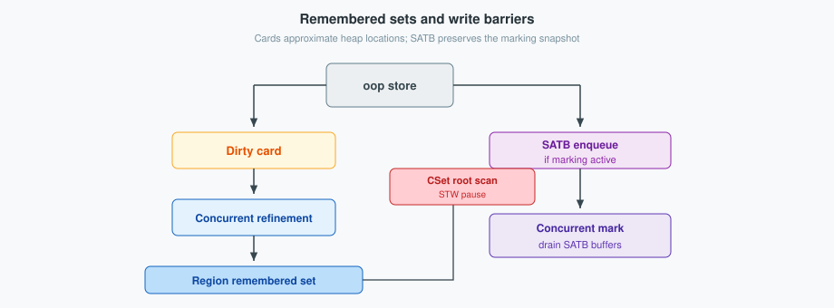
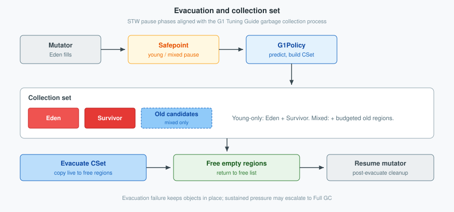

HotSpot **memory management** places Java objects in the heap and reclaims them when they become unreachable. Mutators allocate; a **garbage collector** discovers live objects from GC roots, frees or relocates storage, and returns space so allocation can continue. On modern JDKs the collector that does this by default is **G1** (Garbage-First).

<!--more-->

---

## 1. Overview

A Java process uses several native memory domains. The **Java heap** holds ordinary instances and arrays—the memory `new` draws from and that garbage collection manages. **Metaspace** holds class metadata outside that heap. Thread stacks, the code cache, and direct buffers are further pools; they are not reclaimed by the same young/old collectors that service object allocation.

For heap objects the contract is reachability: a thread obtains storage, initializes the object ([header and klass pointer](/post/java/jvm/object/)), and any path still reachable from **GC roots** (locals, statics, JNI handles, and similar) keeps the object alive. When no such path remains, the collector may reuse the storage. HotSpot collectors are typically **generational**: most objects die in a young area (Eden, then Survivor); survivors are **tenured** into an old area that is reclaimed less often.

Which collector HotSpot selects when none is named on the command line depends on the JDK version (and, historically, on whether the machine looked “server-class”):

| JDK | Ergonomic default (no `-XX:+Use*GC`) |
|-----|--------------------------------------|
| **5–8** | **Parallel** on server-class machines; **Serial** on client / constrained machines |
| **9–26** | **G1** on server-class machines ([JEP 248](https://openjdk.org/jeps/248)); **Serial** when treated as constrained (typically one CPU or under about 1792 MB of memory) |
| **27+** | **G1** in all environments ([JEP 523](https://openjdk.org/jeps/523)) |

**G1** partitions that Java heap into equally sized **regions**—contiguous ranges of virtual memory that are the unit of both allocation and reclaim. At any moment a region is free, or assigned as Eden, Survivor, Old, or Humongous. Young and old generations are therefore **sets of regions**, typically noncontiguous in address order, rather than one Eden slab and one Old slab. Region size is chosen at startup from the maximum heap (on the order of **2048** regions, between **1 MB** and an ergonomic **32 MB**, hard max **512 MB** on 64-bit), or set with `G1HeapRegionSize`.



G1 meets a pause-time goal (default **200 ms**, `MaxGCPauseMillis`) by evacuating live objects from a chosen **collection set** and by marking the old generation concurrently. Mutators **allocate** into regions; the **GC cycle** then marks, evacuates, and frees them back for reuse.

---

## 2. Memory allocation

HotSpot routes mutator allocation through a small set of types. `MemAllocator` is the runtime entry when constructing a new object, but it is a **`StackObj` for one allocation on the current thread**—not a shared, thread-agnostic allocator. It stores `Thread* _thread` (must be `Thread::current()`) so the fast path can reach that thread’s TLAB without repeatedly calling `Thread::current()`, and so slow-path bookkeeping (bytes allocated, sampling) stays on the right thread. Each `Thread` owns a `ThreadLocalAllocBuffer` (`_tlab`). Under G1, heap entry points land on `G1CollectedHeap`, which owns the region table (`G1HeapRegionManager`) and the current allocating regions (`G1Allocator`). Mutator traffic goes through `MutatorAllocRegion` into a live Eden `G1HeapRegion`; GC evacuation uses sibling alloc regions for Survivor and Old.



`MemAllocator::mem_allocate` dispatches the three paths:

```cpp
HeapWord* MemAllocator::mem_allocate(Allocation& allocation) const {
  if (UseTLAB) {
    HeapWord* mem = mem_allocate_inside_tlab_fast();
    if (mem != nullptr) {
      return mem;
    }
  }

  DEBUG_ONLY(allocation._thread->check_for_valid_safepoint_state());

  if (UseTLAB) {
    HeapWord* mem = mem_allocate_inside_tlab_slow(allocation);
    if (mem != nullptr) {
      return mem;
    }
  }

  return mem_allocate_outside_tlab(allocation);
}
```

**TLAB fast path** — bump `_top` if the object fits:

```cpp
HeapWord* MemAllocator::mem_allocate_inside_tlab_fast() const {
  return _thread->tlab().allocate(_word_size);
}

inline HeapWord* ThreadLocalAllocBuffer::allocate(size_t size) {
  HeapWord* obj = top();
  if (pointer_delta(end(), obj) >= size) {
    set_top(obj + size);
    return obj;
  }
  return nullptr;
}
```

**TLAB refill** — if free space is small enough to discard, retire the TLAB and take a new one via `allocate_new_tlab`; otherwise keep the TLAB and fall through (returns `nullptr`):

```cpp
HeapWord* MemAllocator::mem_allocate_inside_tlab_slow(Allocation& allocation) const {
  ThreadLocalAllocBuffer& tlab = _thread->tlab();

  // Retain tlab and allocate object in shared space if
  // the amount free in the tlab is too large to discard.
  if (tlab.free() > tlab.refill_waste_limit()) {
    tlab.record_slow_allocation(_word_size);
    return nullptr;
  }

  tlab.record_refill_waste();
  _thread->retire_tlab();

  size_t new_tlab_size = tlab.compute_size(_word_size);
  if (new_tlab_size == 0) {
    return nullptr;
  }

  size_t min_tlab_size = ThreadLocalAllocBuffer::compute_min_size(_word_size);
  HeapWord* mem = Universe::heap()->allocate_new_tlab(
      min_tlab_size, new_tlab_size, &allocation._allocated_tlab_size);
  if (mem == nullptr) {
    return nullptr;
  }

  _thread->fill_tlab(mem, _word_size, allocation._allocated_tlab_size);
  return mem;
}
```

Under G1, refill asks the mutator alloc region for Eden space and does **not** allow a GC:

```cpp
HeapWord* G1CollectedHeap::allocate_new_tlab(size_t min_size,
                                             size_t requested_size,
                                             size_t* actual_size) {
  assert(!is_humongous(requested_size), "we do not allow humongous TLABs");
  return attempt_allocation(min_size, requested_size, actual_size, false /* allow_gc */);
}
```

**Non-TLAB request** — one object from the shared heap; the thread’s TLAB is left as-is:

```cpp
HeapWord* MemAllocator::mem_allocate_outside_tlab(Allocation& allocation) const {
  allocation._allocated_outside_tlab = true;
  HeapWord* mem = Universe::heap()->mem_allocate(_word_size);
  if (mem == nullptr) {
    return mem;
  }

  size_t size_in_bytes = _word_size * HeapWordSize;
  _thread->incr_allocated_bytes(size_in_bytes);
  _thread->heap_sampler().inc_outside_tlab_bytes(size_in_bytes);
  return mem;
}
```

G1’s `mem_allocate` either takes a humongous path or allocates a single block from the mutator region (GC allowed on failure):

```cpp
HeapWord* G1CollectedHeap::mem_allocate(size_t word_size) {
  if (is_humongous(word_size)) {
    return attempt_allocation_humongous(word_size);
  }
  size_t dummy = 0;
  return attempt_allocation(word_size, word_size, &dummy, true /* allow_gc */);
}

static bool is_humongous(size_t word_size) {
  // Strictly greater than half a region; TLABs are capped at this threshold.
  return word_size > _humongous_object_threshold_in_words;
}
```

---

## 3. GC cycle

G1 alternates a **Young-Only** phase with a **Space-Reclamation** phase. Young-Only starts with normal young collections that promote into Old. When old occupancy warrants it, a Concurrent Start young collection begins marking; Remark and Cleanup finish that analysis; Prepare Mixed (if candidates exist) leads into mixed collections that also evacuate selected old regions. When further old reclaim is not worth the pause, the cycle returns to Young-Only. Full GC is the backup when evacuation cannot free space.



Inside that cycle, three mechanisms work together: concurrent mark decides which old regions are candidates; evacuation copies live objects out of the collection set; freeing returns empty regions to the allocator.

### 3.1 Concurrent mark

Young collections alone promote survivors into Old and do not compact the old generation. When old occupancy crosses **InitiatingHeapOccupancyPercent** (default **45%** of current old capacity, usually adapted by **adaptive IHOP**), G1 schedules a **Concurrent Start** young collection: it still evacuates Eden/Survivor, and it starts concurrent marking of the old generation.

Marking uses **snapshot-at-the-beginning (SATB)**. At Concurrent Start, G1 takes a virtual snapshot of liveness; a mutator pre-barrier logs the previous referent of a reference field into a thread-local SATB buffer before the store so objects live at mark start stay in the snapshot. Concurrent mark threads walk the object graph with the marking bitmap and drain SATB buffers while the application runs. Normal young collections may continue until marking finishes.



Two STW pauses complete the analysis:

1. **Remark** — drains remaining SATB work, finishes reference processing related to marking, and may reclaim completely empty regions.
2. **Cleanup** — accounts live data per old region, rebuilds remembered sets for collection-set candidates, and decides whether a Space-Reclamation (mixed) phase should follow.

Marking answers which old regions are sparse (or poorly connected) enough to be worth evacuating later. It does not by itself free those regions for mutator allocation.

### 3.2 Evacuation

G1 reclaims by **evacuation**: live objects in a **collection set (CSet)** are copied into free regions, and references (from roots and remembered sets) are updated to the new locations. A young or mixed STW pause roughly: disconnect TLABs and select the CSet; merge heap roots / remembered sets for that CSet; copy objects; then post-evacuate cleanup.

**Remembered sets (RSets)** record approximate locations outside a region that may point into it (cards, by default 512-byte granules). Mutators dirty cards on reference stores; concurrent refinement turns dirty cards into RSet entries so the pause need not scan the entire old generation for pointers into the CSet.

**Young-only** collections put every Eden and Survivor region into the CSet. Surviving objects go to Survivor or, when aged out, to Old. No old region is evacuated—the common case while the Young-Only phase fills Old.

**Mixed** collections still evacuate all young regions, and add a budgeted number of **old candidate** regions chosen after marking (low live bytes, favorable connectivity). Policy spreads old reclaim across several mixed pauses (`G1MixedGCCountTarget`, default **8**). Regions whose live bytes exceed `G1MixedGCLiveThresholdPercent` (default **85%** of a region) stay out of the mixed CSet. Humongous objects are normally only dropped when dead, not moved, except in last-resort efforts.



If destination space is insufficient, **evacuation failure** leaves objects in place and schedules those regions for later collection. Sustained failure may escalate to a **Full GC** (whole-heap compacting STW).

### 3.3 Free

After a successful evacuation, source regions in the CSet contain no live objects. G1 returns them to the **free** list: their type becomes Free, and the memory manager may later hand them out again as Eden, Survivor, Old, or Humongous destinations. That is the step that makes the gray cells in the heap layout reusable.

Completely empty regions can also appear without a full CSet evacuation—for example after Remark/Cleanup when marking finds a region with no live data, or when a dead humongous object is reclaimed. Those regions likewise become Free.

Policy keeps a fraction of the heap in reserve (`G1ReservePercent`) so evacuation always has destination space. Space-Reclamation (mixed) stops when further old evacuation would not free enough space worth the pause (`G1HeapWastePercent`, default **5%**), and the cycle returns to Young-Only with a larger free pool for allocation.

| Lever | Default (typical) | Role in the cycle |
|-------|-------------------|-------------------|
| `MaxGCPauseMillis` | 200 | Bounds how large Eden and mixed CSets may be |
| `InitiatingHeapOccupancyPercent` | 45 | When concurrent mark (then mixed reclaim) starts |
| `G1ReservePercent` | 10 | Free regions held back for evacuation destinations |
| `G1MixedGCCountTarget` | 8 | How many mixed pauses spread old freeing |
| `G1MixedGCLiveThresholdPercent` | 85 | Skip dense old regions in the CSet |
| `G1HeapWastePercent` | 5 | Stop mixed reclaim when little free space remains to gain |

Logs (`-Xlog:gc*` and `-Xlog:gc+phases=debug`) show pause kind, CSet composition, and whether regions were freed or evacuation failed. Building a debuggable HotSpot for stepping these paths is covered in [JVM build and debug](/post/java/jvm/build-debug/).

---

## 4. References

- [Garbage-First (G1) Garbage Collector — HotSpot Virtual Machine Garbage Collection Tuning Guide (Java SE 22)](https://docs.oracle.com/en/java/javase/22/gctuning/garbage-first-g1-garbage-collector1.html#GUID-ED3AB6D3-FD9B-4447-9EDF-983ED2F7A573)
- [JEP 248: Make G1 the Default Garbage Collector](https://openjdk.org/jeps/248)
- [JEP 523: Make G1 the Default Garbage Collector in All Environments](https://openjdk.org/jeps/523)
