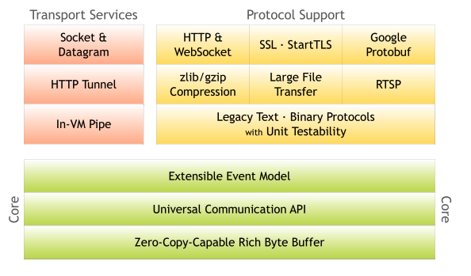
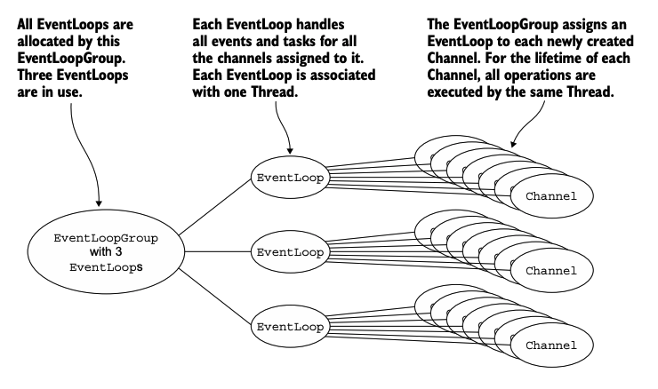
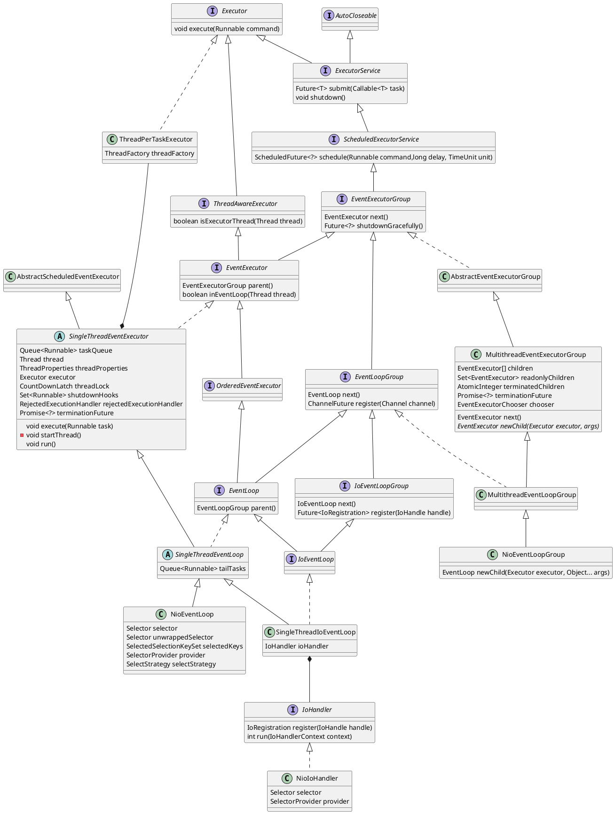
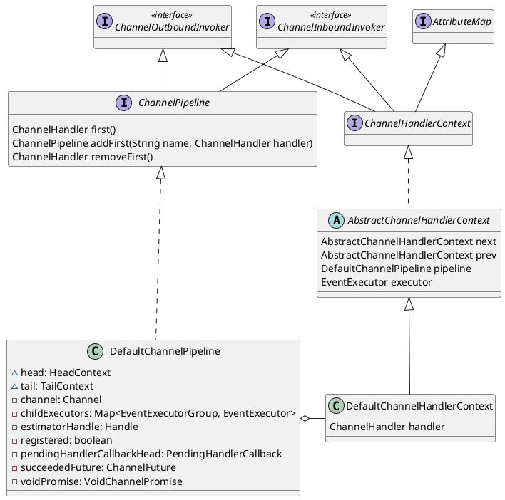

本文记录Netty架构与实现
<!--more-->


Netty is an asynchronous event-driven network application framework for rapid development of maintainable high performance protocol servers & clients.




# Event Model



## Transport 
The data that flows through a network always has the same type: bytes. How these bytes are moved around depends mostly on what we refer to as the network transport, a concept that helps us to abstract away the underlying mechanics of data transfer.


## EventLoop and Threading model

`EventLoop` is used to handle all the I/O operations for the channels registered, multiple `Channel`s can be assigned to one `EventLoop`. Each `EventLoop` is powered by exactly one `Thread` that never changes.

* `ScheduledExecutorService` an `ExecutorService` that can schedule commands to run after a given delay.
* `EventExecutorGroup` provides the `EventExecutor` to use via its method `next()`. It also provides method of life-cycle management and shutting them down in global fashion.
* `EventExecutor` is a special `EventExecutorGroup` whose `next()` is itself.
* `EventLoopGroup` special `EventExecutorGroup` which allows registering `Channel`s that get processed for later selection during the event loop 
* `EventLoop` will handle all the I/O operations for a `Channel` once registered.
* `IoHandler` handles I/O dispatching for an `ThreadAwareExecutor`




### Channel
`Channel`  A nexus to a network socket or a component which is capable of I/O operations such as read,write,connect and bind.
  A channel provides a user:
  * the current state of the channel (open or connected)
  * the `configuration properties` of the channel(receive buffer size)
  * the `ChannelPipeline` which handles all I/O events and requests associated with the channel

`ChannelFuture` The result of an asynchronous `Channel` I/O operation.

`ServerChannel` A `Channel` that accepts an incoming connection attempt and creates its child `Channel`s by accepting them. 
All I/O operations in Netty are asynchronous. A `ChannelFuture` instance will be returned which gives you the information of about the result or status of I/O operation.

`ChannelPromise` special `ChannelFuture` which is writable.
`ChannelFutureListener` callback function which can be added to the `ChannelFuture`.

`ChannelOutboundInvoker` are methods be called from Application layer to the Transport Layer

`ChannelInboundInvoker` are methods be called from Transport layer to the Application Layer


```plantuml
interface ChannelOutboundInvoker {
  bind()
  connect()
  close()
  register()
  deregister()
  read()
  write()
}

interface Channel extends AttributeMap, ChannelOutboundInvoker {
  EventLoop eventLoop()
  Channel parent()
  boolean isRegistered()
  boolean isActive()
  ChannelPipeline pipeline()
}
interface DuplexChannel extends Channel
interface SocketChannel extends DuplexChannel
interface DatagramChannel extends Channel
abstract class AbstractChannel implements Channel
abstract class AbstractNioChannel extends AbstractChannel
abstract class AbstractNioByteChannel extends AbstractNioChannel
class NioSocketChannel extends AbstractNioByteChannel implements SocketChannel
```

### Channel Handler

* `ChannelHandler` handles an I/O event or intercepts an I/O operation, and forwards it to its next handlers in its `ChannelPipeline`
* `ChannelPipeline` a list of `ChannelHandler`s which handles or intercepts inbound events and outbound operations of a `Channel`





```plantuml
title Channel Handler
interface ChannelHandler
interface ChannelInboundHandler extends ChannelHandler
interface ChannelOutboundHandler extends ChannelHandler
class ChannelInboundHandlerAdapter extends ChannelHandlerAdapter implements ChannelInboundHandler
class ChannelOutboundHandlerAdapter extends ChannelHandlerAdapter implements ChannelOutboundHandler
```


# BootStrap

`ServerBootstrap` make it easy to bootstrap a `ServerChannel` 


```plantuml
abstract class AbstractBootstrap<B extends AbstractBootstrap<B, C>, C extends Channel> implements Cloneable {
  EventLoopGroup group
  ChannelFactory<? extends C> channelFactory
  SocketAddress localAddress
  Map<ChannelOption<?>, Object> options
  Map<AttributeKey<?>, Object> attrs
  ChannelHandler handler
  ClassLoader extensionsClassLoader
  ChannelFuture bind(int inetPort)
  abstract void init(Channel channel)
}
class ServerBootstrap extends AbstractBootstrap<ServerBootstrap, ServerChannel> {
  Map<ChannelOption<?>, Object> childOptions
  Map<AttributeKey<?>, Object> childAttrs
  ServerBootstrapConfig config
  EventLoopGroup childGroup
  ChannelHandler childHandler
  void init(Channel channel)
}
```