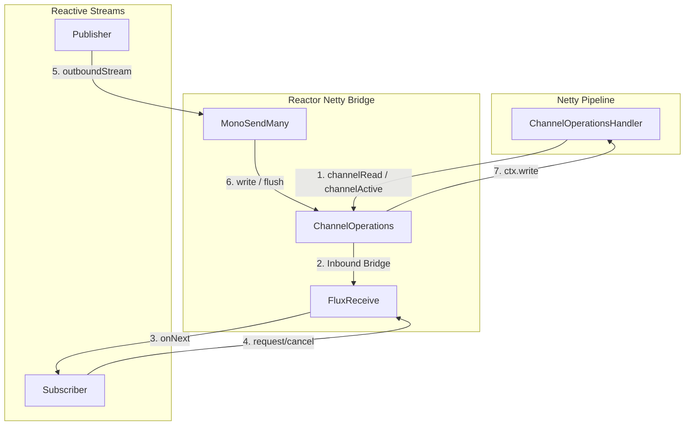

Reactor is a fourth-generation reactive library, based on Reactive Streams specification, for building non-blocking applications on JVM
<!--more-->


# Reactive Streams

Reactive Streams is a standard and specification for Stream-oriented libraries for JVM that
* process a potentially unbounded number of elements
* in sequence
* asynchronously passing elements between components
* with mandatory non-blocking backpressure.


## API components
1. publisher
2. subscriber
3. subscription
4. processor

`Publisher` is a provider of a potentially unbounded number of sequences elements, publishing them according to the demand received from its Subscribers.

In response to a call to `Publisher.subscribe(Subscriber)` the possible invocation sequences for methods on the `Subscriber` are given by the following protocol:
```
onSubscribe onNext* (onError | onComplete)?
```
This means that `onSubscribe` is always signaled, followed by a possibly unbounded number of `onNext` signals(as requested by `Subscriber`) followed by an `onError` signal if there is a failure, or an `onComplete` signal when no more elements are available 

`Subscriber` will receive call to `onSubscribe(Subscription)` once after passing an instance of `Subscriber` to `Publisher.subscribe(Subscriber)`


## Publisher

Project Reactor provides two core implementations of the `Publisher` interface:
1. **`Mono<T>`**: Emits at most one item (0 or 1), followed by a completion or error signal.
2. **`Flux<T>`**: Emits 0 to N items, followed by a completion or error signal.

### Class Structure

Here is the relationship between the core reactive interfaces, `Mono`, and `Flux`:

```plantuml
interface Publisher<T> {
    void subscribe(Subscriber<? super T> s)
}

interface CorePublisher<T> extends Publisher {
    void subscribe(CoreSubscriber<? super T> s)
}

interface Subscriber<T> {
    void onSubscribe(Subscription s)
    void onNext(T t)
    void onError(Throwable t)
    void onComplete()
}

interface CoreSubscriber<T> extends Subscriber {
    Context currentContext()
}

interface Subscription {
    void request(long n)
    void cancel()
}

abstract class Mono<T> implements CorePublisher {
    + {static} <T> Mono<T> just(T data)
    + {static} <T> Mono<T> empty()
    + {static} <T> Mono<T> error(Throwable error)
    + <R> Mono<R> map(Function<? super T, ? extends R> mapper)
    + <R> Mono<R> flatMap(Function<? super T, ? extends Mono<? extends R>> transformer)
    + Mono<T> publishOn(Scheduler scheduler)
    + Mono<T> subscribeOn(Scheduler scheduler)
}

abstract class Flux<T> implements CorePublisher {
    + {static} <T> Flux<T> just(T... data)
    + {static} <T> Flux<T> fromIterable(Iterable<? extends T> it)
    + {static} Flux<Integer> range(int start, int count)
    + <R> Flux<R> map(Function<? super T, ? extends R> mapper)
    + <R> Flux<R> flatMap(Function<? super T, ? extends Publisher<? extends R>> transformer)
    + Flux<T> publishOn(Scheduler scheduler)
    + Flux<T> subscribeOn(Scheduler scheduler)
}
```

### Usage Examples

#### 1. Mono Example (At most 1 element)

A `Mono` is commonly used for asynchronous operations that return a single result or a completion signal (similar to a `Future` or `Promise`).

```java
// Create a Mono that emits a single value
Mono<String> mono = Mono.just("Hello from Mono");

// Subscribe to consume the emitted value
mono.subscribe(
    data -> System.out.println("onNext: " + data),
    error -> System.err.println("onError: " + error.getMessage()),
    () -> System.out.println("onComplete: Mono finished!")
);
```

#### 2. Flux Example (0 to N elements)

A `Flux` is used for asynchronous sequences of multiple items (similar to a stream of events or an asynchronous list).

```java
// Create a Flux that emits a range of integers and transforms them
Flux<Integer> flux = Flux.range(1, 5)
                         .map(i -> i * 10);

// Subscribe to consume the stream
flux.subscribe(
    data -> System.out.println("onNext: " + data),
    error -> System.err.println("onError: " + error.getMessage()),
    () -> System.out.println("onComplete: Flux finished!")
);
```

## Subscriber

While `Mono` and `Flux` are the core publishers in Project Reactor, consumers interact with them by subscribing. 

When you use convenience subscription methods like `.subscribe(valueConsumer, errorConsumer, completeConsumer)`, Reactor wraps these callbacks internally in a `LambdaSubscriber`.

For writing a custom subscriber with full backpressure control, Project Reactor provides **`BaseSubscriber`** as the standard implementation base class.

### Class Structure

The structure of `BaseSubscriber` simplifies handling of subscription lifecycles and backpressure:

```plantuml
interface Subscriber<T> {
    void onSubscribe(Subscription s)
    void onNext(T t)
    void onError(Throwable t)
    void onComplete()
}

interface CoreSubscriber<T> extends Subscriber {
    Context currentContext()
}

interface Subscription {
    void request(long n)
    void cancel()
}

abstract class BaseSubscriber<T> implements CoreSubscriber, Subscription {
    # void hookOnSubscribe(Subscription subscription)
    # void hookOnNext(T value)
    # void hookOnError(Throwable throwable)
    # void hookOnComplete()
    # void hookOnCancel()
    + final void request(long n)
    + final void cancel()
}
```

### BaseSubscriber Example (Custom Backpressure Control)

By inheriting from `BaseSubscriber`, you can override lifecycle hooks (like `hookOnSubscribe` and `hookOnNext`) to control exactly when and how many elements are pulled from the publisher:

```java
import reactor.core.publisher.BaseSubscriber;
import org.reactivestreams.Subscription;

public class CustomBackpressureSubscriber<T> extends BaseSubscriber<T> {

    @Override
    protected void hookOnSubscribe(Subscription subscription) {
        System.out.println("Subscribed to publisher. Requesting first item...");
        // Request exactly 1 item initially (Backpressure control)
        request(1);
    }

    @Override
    protected void hookOnNext(T value) {
        System.out.println("hookOnNext: Processed item -> " + value);
        
        // Simulate processing delay
        try {
            Thread.sleep(100);
        } catch (InterruptedException e) {
            Thread.currentThread().interrupt();
        }

        // Request next item after processing is done
        System.out.println("Requesting next item...");
        request(1);
    }

    @Override
    protected void hookOnComplete() {
        System.out.println("hookOnComplete: Completed stream!");
    }

    @Override
    protected void hookOnError(Throwable throwable) {
        System.err.println("hookOnError: Encountered error: " + throwable.getMessage());
    }
}
```

#### Subscribing with a Custom Subscriber:

```java
Flux<Integer> numbers = Flux.range(1, 3);

// Pass the custom subscriber instance
numbers.subscribe(new CustomBackpressureSubscriber<>());
```

# Reactor Netty Core 
In Java-based reactive network programming, Reactor Netty plays a vital role: it seamlessly bridges the event-driven, **push-model** Netty framework with the demand-driven, backpressure-aware, **pull-model** Reactive Streams (Reactor).

## 1. Core Bridge Architecture

In traditional Netty, reading and writing are handled by `ChannelHandler`s on a `ChannelPipeline`. Once data arrives in the TCP buffer, it is automatically read and pushed down the pipeline (push model).
In contrast, in the Reactive Streams specification, data consumption is driven by the `Subscriber` (pull model), using `Subscription.request(n)` to precisely control data flow.

To connect these two paradigms, Reactor Netty introduces several key abstractions:



### Core Abstractions

1. **`ChannelOperations`**
   - Implements `Connection`, `NettyInbound`, `NettyOutbound`, and `CoreSubscriber<Void>`.
   - It acts as the central hub of Reactor Netty, wrapping a Netty `Channel` to represent reactive input and output streams.
2. **`ChannelOperationsHandler`**
   - A Netty `ChannelInboundHandlerAdapter` implementation.
   - It intercepts Netty inbound lifecycle events (such as `channelActive`, `channelRead`, `channelInactive`) and delegates them to the associated `ChannelOperations`.
3. **`FluxReceive`**
   - Extends `Flux<Object>` and implements `Subscription`.
   - It manages **inbound** backpressure by dynamically toggling Netty's `autoRead` configuration to match consumer demand.
4. **`MonoSend` / `MonoSendMany`**
   - Extends `Mono<Void>` and represents **outbound** writing tasks.
   - It handles writing reactive `Publisher` streams to the Netty channel and ensures outbound backpressure.

---

## 2. Deep Dive: Backpressure Implementation Details

### A. Inbound Backpressure (Netty to Reactor)

Reactor Netty disables Netty's default auto-read behavior (`setAutoRead(false)`) and controls reading flow dynamically inside `FluxReceive`:

1. **Subscription & Initialization**:
   When a user subscribes to `NettyInbound.receive()`, `FluxReceive` is activated. The Netty channel's `autoRead` is initialized to `false` (manual read mode).
2. **Demand Tracking**:
   When the downstream `Subscriber` requests data by calling `request(n)`, `FluxReceive` tracks the demand using `receiverDemand`.
3. **Toggling autoRead to True**:
   If there is pending demand, or if the queue of buffered objects drops below a low watermark (`QUEUE_LOW_LIMIT = 32`), `FluxReceive` turns on `autoRead`:
   ```java
   parent.channel().config().setAutoRead(true);
   ```
4. **Data Delivery**:
   The Netty event loop reads socket data and triggers `channelRead`. `ChannelOperationsHandler` intercepts the read buffer, sends it to `ChannelOperations.onInboundNext()`, which enqueues it in `FluxReceive` and delivers it via `Subscriber.onNext()`.
5. **Toggling autoRead to False**:
   If the consumer handles data too slowly (causing queue buildup) or if the pending demand is fully met (`receiverDemand <= 0`), `FluxReceive` disables `autoRead`:
   ```java
   parent.channel().config().setAutoRead(false);
   ```
   This pauses Netty from reading more bytes off the socket, eventually shrinking the TCP window size and propagating backpressure to the remote sender.

### B. Outbound Backpressure (Reactor to Netty)

When streaming data to the network (e.g., `NettyOutbound.send(Publisher)`), if the production rate of the upstream publisher exceeds the network's outbound transmission rate, Netty's write buffers would build up indefinitely, risking Out Of Memory (OOM) errors. Reactor Netty uses `MonoSendMany` to enforce outbound backpressure:

1. **Prefetch Limits**:
   The internal `SendManyInner` class requests up to `MAX_SIZE` (default 128) elements from the upstream `Publisher` to fill its local queue.
2. **Asynchronous Writes & Smart Flushing**:
   Emitted items are polled from the queue and written via `ctx.write()`. To avoid frequent flushing which degrades performance, it flushes only under specific conditions:
   - Explicit boundaries are reached (matching the user's predicate).
   - The channel becomes unwritable: `!ctx.channel().isWritable()`.
   - The write buffer size exceeds the high-watermark threshold: `readableBytes > ctx.channel().bytesBeforeUnwritable()`.
3. **Promise-Driven Refill Callback**:
   `SendManyInner` implements Netty's `ChannelPromise`. When Netty flushes data to the network, it triggers the `trySuccess()` callback:
   ```java
   @Override
   public boolean trySuccess(Void result) {
       requested--;
       pending--; // Decrement in-flight write counter
              if (requested <= REFILL_SIZE) { // Prefetch window is half empty (128 / 2 = 64)
            int u = MAX_SIZE - requested;
            requested += u;
            nextRequest += u;
            trySchedule(); // Request more data from upstream: s.request(nextRequest)
        }
        return true;
    }
    ```
    > [!NOTE]
    > **Overlapping Execution (Replenishment Optimization)**: If the subscriber waited until all 128 elements were fully sent (`requested == 0`) before asking for more, the system would experience a processing gap (idle latency) while waiting for the upstream publisher to generate the next batch. Refilling the prefetch window when it is half empty allows the upstream producer to fetch and queue the next batch of items *concurrently* while Netty is flushing the remainder of the current batch.

4. **Rate Alignment**:
   This guarantees that data is pulled from the upstream source only as fast as the network socket can write it out. If the network experiences congestion, Netty writes will take longer to resolve, delaying the `trySuccess()` calls, pausing upstream requests, and ensuring robust outbound backpressure.

---

## 3. Practical Example: Bridging Netty Events to Reactor Streams

To see how these internals work in a real-world application, consider an HTTP server built with Reactor Netty. This example shows how raw incoming Netty channel read buffers are translated into a reactive publisher (`ByteBufFlux`), transformed using Reactor operators, and written back out:

```java
import reactor.netty.http.server.HttpServer;
import reactor.netty.ByteBufFlux;
import reactor.core.publisher.Flux;

public class ReactorNettyBridgeExample {
    public static void main(String[] args) {
        HttpServer.create()
                  .port(8080)
                  .handle((request, response) -> {
                      // 1. request.receive() returns a ByteBufFlux, which wraps the internal FluxReceive
                      // This represents incoming Netty byte buffers packaged as a reactive Publisher
                      ByteBufFlux inbound = request.receive();

                      // 2. Transform the incoming reactive stream using standard Reactor operators
                      Flux<String> upperCaseStrings = inbound
                              .asString()                   // Decodes incoming Netty ByteBufs to String instances
                              .map(String::toUpperCase)     // Transforms the strings in a non-blocking map step
                              .log("http-server-pipeline"); // Logs stream lifecycle events (onSubscribe, request, onNext)

                      // 3. Send the transformed reactive Publisher back downstream to the Netty channel outbound
                      return response.sendString(upperCaseStrings);
                  })
                  .bindNow()
                  .onDispose()
                  .block();
    }
}
```

### Trace: How a Socket Packet Becomes a Stream Element

1. **OS to Netty Pipeline**: An client sends a packet. Netty's selector thread reads the bytes from the socket, allocates a `ByteBuf`, and propagates it down the Netty `ChannelPipeline` as a `channelRead` event.
2. **Intercepted by Bridge Handler**: The `channelRead` event hits `ChannelOperationsHandler.channelRead()`. It extracts the current connection's `ChannelOperations` bridge object:
   ```java
   Connection connection = Connection.from(ctx.channel());
   ChannelOperations<?, ?> ops = connection.as(ChannelOperations.class);
   ops.onInboundNext(ctx, msg);
   ```
3. **Queueing & Delivery**: The message is passed into `FluxReceive.onInboundNext(msg)`. 
   - If the downstream subscriber (created by `.asString().map(...)`) has requested elements, `FluxReceive` bypasses queueing (fastpath) and directly calls `Subscriber.onNext(msg)`.
   - If the subscriber has no pending demand, the buffer is enqueued in `FluxReceive`'s internal queue, and `autoRead` is dynamically toggled to `false` via `parent.channel().config().setAutoRead(false)` to halt the socket reads.
4. **Outbound Write Back**: When the response is processed and written back through `response.sendString()`, the outgoing string publisher is subscribed to by `MonoSendMany`, which flushes the bytes to the Netty channel write buffers only as fast as the TCP connection can transmit them.

---

## 4. Key Advantages of Reactor Netty over Raw Netty

A common question is: *If we still need Netty codecs and handlers, why wrap Netty in Reactor?*

While Reactor Netty relies on Netty handlers for low-level protocol decoding and transport (like SSL, HTTP framing, compression), wrapping Netty with Reactor provides several transformative advantages for application development:

### 1. Declarative Programming vs. Callback Hell (Fragmented Handlers)
*   **Raw Netty**: Application logic is scattered across multiple stateful handlers (e.g. extending `ChannelInboundHandlerAdapter`). To pass state, you must store attributes in the channel context, leading to highly coupled, fragmented code that is difficult to trace.
*   **Reactor Netty**: Allows you to express request handling as a single, cohesive, declarative pipeline. You can use standard reactive operators (`map`, `flatMap`, `filter`, `timeout`, `retry`, `zip`) directly on incoming bytes.

### 2. End-to-End Application Backpressure vs. Local Transport Backpressure
*   **Raw Netty (Local Transport level)**: Netty has built-in local backpressure. For instance, if its write buffer is full, `channel.isWritable()` becomes `false`. If you stop reading, the TCP sliding window fills up. However, Netty's backpressure is strictly *transport-level*. It does **not** know if your downstream application components (like a slow database, thread pool, or microservice call) are congested. To handle this, you must write custom boilerplate code to monitor application queues and manually trigger `channel.config().setAutoRead(false)` or pause writes.
*   **Reactor Netty (End-to-End level)**: Bridges Netty's transport-level flow control to Project Reactor's standard application-level demand model (`request(n)`). If a downstream reactive database writer slows down, it signals less demand. This demand throttle propagates automatically back through the reactive pipeline, reaching Reactor Netty's [FluxReceive](file:///code/git/reactor-netty/reactor-netty-core/src/main/java/reactor/netty/channel/FluxReceive.java), which toggles Netty's `autoRead` configuration to halt reading from the TCP socket. The entire stack—from network socket to database—shares the exact same backpressure vocabulary without any manual integration code.

### 3. Automatic Resource Management
*   **Raw Netty**: Senders and receivers must strictly manage `ReferenceCounted` Netty buffers (like `ByteBuf`) by calling `ReferenceCountUtil.release(msg)` to prevent memory leaks.
*   **Reactor Netty**: Wraps byte buffers inside reactive streams (like `ByteBufFlux`). The reactive framework automatically handles release operations as buffers flow down the pipeline.

### 4. Seamless Ecosystem Integration
*   **Reactor Netty** integrates Netty directly with the modern Java reactive ecosystem (Spring WebFlux, Spring Cloud Gateway, WebClient, R2DBC database drivers, Reactive Kafka). This allows you to construct a completely non-blocking, backpressure-aware architecture from the network socket all the way to the database.

---

## 5. Non-Blocking Thread Execution & Scheduling Model

To understand how Reactor Netty achieves extreme resource efficiency compared to traditional servlet containers (like Tomcat), we must examine how it avoids thread blocking and schedules executions.

### A. The Cost of Thread Blocking (Tomcat Model)
In a traditional **Thread-per-Request** model (Tomcat):
* Each active connection consumes a dedicated worker thread.
* If your application makes a database query or an external REST call, that worker thread is put into a **blocked/waiting** state.
* The thread does zero useful work, yet continues to hold ~1MB of memory for its stack and forces the OS to perform expensive CPU context switches as it alternates between blocked and active threads.

### B. Skipping the Wait: Reactor Netty Event Loop
Reactor Netty eliminates this waste by running on a small, fixed number of **EventLoop threads** (typically matched to the number of CPU cores).

Instead of waiting for a downstream system to respond, the EventLoop thread operates asynchronously:
1. The thread initiates the network call (e.g. sending a query to a database or a REST request via `HttpClient`).
2. It registers a callback (event handler) on Netty's selector and **immediately returns** to processing other tasks. It does not block or sleep.
3. While the downstream system processes the request, the same EventLoop thread handles thousands of other active client connections.
4. When the response arrives, Netty's selector detects the read event and schedules the registered callback on the EventLoop thread to process the returned data.

By never "waiting" for consumers, a handful of EventLoop threads can handle tens of thousands of concurrent connections with negligible CPU context switching and memory overhead.

### C. How Thread Execution is Scheduled (`publishOn` vs `subscribeOn`)

In Project Reactor, execution threading is declarative and controlled by `Schedulers`. You can change which thread pool runs a segment of code using two core operators:

```
[Publisher Source]
       │
       ▼ (subscribeOn thread context)
 ┌─────────────┐
 │ operatorA() │
 └─────┬───────┘
       │
       ▼
 ┌─────────────┐
 │  publishOn  │ ──► Switches execution context to a new Scheduler
 └─────┬───────┘
       │
       ▼ (publishOn thread context)
 ┌─────────────┐
 │ operatorB() │
 └─────────────┘
```

#### 1. `publishOn(Scheduler)`: Downstream Thread Switching
* **Scope**: Affects **downstream** operators *after* the `publishOn` call.
* **Under-the-Hood Mechanics**:
  * `publishOn` switches threads by intercepting data signals (`onNext`, `onError`, `onComplete`) as they flow downstream.
  * When the upstream publisher calls `onNext(data)`, the internal `PublishOnSubscriber` intercepts it. Instead of immediately calling the downstream subscriber's `onNext(data)` on the *upstream* thread, it enqueues the item in an internal queue.
  * It then schedules a drain task on the selected `Scheduler`'s worker thread pool.
  * The worker thread runs a loop that pulls elements from the queue and calls `actual.onNext(data)` downstream.
* **Execution Flow**:
  ```
  [Upstream Thread]               [PublishOnSubscriber]           [Scheduler Worker Thread]
          │                                 │                                 │
          ├──► onNext(data) ───────────────►│ (Enqueue data)                  │
          │                                 ├──► schedule drain() ───────────►│
          │                                 │                                 ├──► queue.poll()
          │                                 │                                 ├──► actual.onNext(data)
  ```

#### 2. `subscribeOn(Scheduler)`: Upstream Subscription Offloading
* **Scope**: Affects **upstream** execution (the initial subscription and source creation) regardless of where it is placed in the pipeline.
* **Under-the-Hood Mechanics**:
  * `subscribeOn` switches threads by intercepting the downstream-to-upstream subscription sequence.
  * When a downstream subscriber calls `.subscribe()`, it propagates upstream until it hits the `SubscribeOn` publisher.
  * Instead of subscribing to the upstream source publisher synchronously on the *caller* thread, it schedules a task on the `Scheduler` to execute the subscription:
    ```java
    scheduler.schedule(() -> source.subscribe(innerSubscriber));
    ```
  * As a result, the source's data emission logic (e.g., executing a blocking query or reading a file) is triggered on the scheduled thread.
* **Execution Flow**:
  ```
  [Caller Thread]                 [SubscribeOn Publisher]         [Scheduler Worker Thread]
         │                                 │                                 │
         ├──► subscribe() ────────────────►│                                 │
         │                                 ├──► schedule subscription ─────►│
         │                                 │                                 ├──► source.subscribe()
         │                                 │                                 ├──► (Data production starts)
  ```

### D. Reactor Netty Scheduling Rule of Thumb
In Reactor Netty, network IO and pipeline processing default to Netty EventLoop threads (typically named `reactor-http-nio-*`).

> [!WARNING]
> **Never Block the EventLoop**: Because there are only a few EventLoop threads, blocking one blocks all other connections sharing that thread. If you must execute blocking I/O (such as legacy JDBC, synchronous files, or `Thread.sleep()`), you must explicitly offload the execution to a worker pool using `publishOn`:
> ```java
> request.receive()
>        .asString()
>        .publishOn(Schedulers.boundedElastic()) // Offloads blocking JDBC downstream
>        .map(id -> jdbcDatabase.findUser(id))   // Legacy blocking JDBC call
> ```

### E. Coexistence of Schedulers and Backpressure

Because `publishOn` and `subscribeOn` change threads, they must handle Reactive Streams backpressure carefully to prevent memory overflows. Here is how they coexist with backpressure:

#### 1. How `publishOn` Coexists with Backpressure (Prefetch & Queueing)
When `publishOn` switches threads, it introduces an internal queue (`SpscArrayQueue`) to hold elements before they are dispatched onto the scheduler's worker thread. Without flow control, this queue could grow unbounded and lead to Out Of Memory (OOM) errors.

* **Upstream Flow Control (Prefetch)**:
  When a stream containing `publishOn` is subscribed to, the operator requests an initial batch of items from upstream based on a `prefetch` configuration (default is `256` items). This limits how much data the upstream publisher will produce, regardless of how much the downstream subscriber has requested.
* **Downstream Request Handling**:
  As the downstream subscriber calls `request(n)`, the worker thread's drain loop polls elements from the internal queue and delivers them to the subscriber.
* **Replenishment (Refill)**:
  Once the queue is drained below a certain threshold (typically **75%** of the prefetch size, which is `192` out of `256` items), `publishOn` issues a new replenishment request (`s.request(192)`) back to the upstream publisher.
* **Backpressure Propagation**:
  If the downstream subscriber stops requesting elements, the drain loop stops, the internal queue remains full, the prefetch replenishment threshold is never reached, and no further `request` signals are sent upstream. Thus, backpressure is successfully propagated to the upstream source.

```
[Upstream Publisher] --(emit 256 items max)--> [Internal Queue (publishOn)] --(drain n requested)--> [Downstream Subscriber]
         ▲                                                                                                    │
         │                                                                                                    ▼
         └─────────────────(request 192 when queue is 75% empty)──────────────────────────────────────────────┘
```

#### 2. How `subscribeOn` Coexists with Backpressure
Unlike `publishOn`, `subscribeOn` **does not introduce an intermediate queue** because it only alters where the subscription phase is executed, not how individual signals are processed.

* **Direct Demand Propagation**:
  When the downstream subscriber requests data via `request(n)`, this request is intercepted by the `SubscribeOnSubscription`.
* **Thread Offloading**:
  The request signal is either directly forwarded upstream, or it is wrapped and scheduled to run on the scheduler's worker thread to maintain thread safety.
* **No Buffering**:
  Since there is no queue, the downstream demand flows directly to the upstream publisher, ensuring that data is produced only as requested by the consumer.

---

## 6. Fault Tolerance & JVM Crashes: Preventing Data Loss

Because Project Reactor is a library that operates **entirely in-memory**, its internal queues (like the ones used in `publishOn` or `FluxReceive`) reside in the JVM heap.

> [!CAUTION]
> **No Built-In Persistence**: If the JVM crashes or the application process is terminated mid-stream, **all unconsumed in-memory data is lost**. Project Reactor does not write transaction logs, nor does it persist queue states to disk automatically.

To build zero-data-loss systems with Project Reactor, you must implement fault-tolerant architecture patterns at the application boundary:

### A. Acknowledgment-Based Messaging (At-Least-Once Delivery)
The most common solution is to pair Reactor with a durable external message broker (such as Apache Kafka, RabbitMQ, or AWS SQS) using explicit acknowledgments (ACKs):

* **How it works**:
  1. The application polls messages from a durable queue.
  2. The messages are processed through the Reactor stream.
  3. **Crucial**: The offset or message ACK is **only committed to the broker** at the very end of the stream (e.g., inside `doOnSuccess()` or the subscriber's `onComplete()` / `hookOnNext` after the database write succeeds).
  4. If the JVM crashes mid-flight, the in-memory queue is lost. However, because the ACK was never sent, the message broker detects the client disconnect and redelivers the unacknowledged messages to another running instance (or to the same instance once it restarts).

```java
// Example: Safe message consumption from Kafka
kafkaReceiver.receive() // Returns Flux<ReceiverRecord<K, V>>
             .flatMap(record -> {
                 return processRecord(record) // Business logic
                     .then(Mono.defer(() -> {
                         // Commit/ACK only after successful processing
                         record.receiverOffset().acknowledge();
                         return Mono.empty();
                     }));
             })
             .subscribe();
```

### B. Idempotent Downstream Writing
Since redelivery guarantees *at-least-once* execution, a JVM crash followed by a restart will result in duplicate messages.
* To prevent data corruption, all database operations and side-effects must be **idempotent** (e.g., using SQL `UPSERT`, unique constraints, or transaction deduplication keys).

### C. Graceful Shutdown
To minimize data loss during standard updates or deployments:
* Implement **graceful shutdown** configurations (e.g., `spring.lifecycle.timeout-per-shutdown-phase` in Spring Boot).
* During shutdown, the application stops accepting new connections/messages, drains the in-memory queues, completes current active streams, and commits remaining ACKs before terminating the JVM process.
  
  
```,StartLine:408,TargetContent: